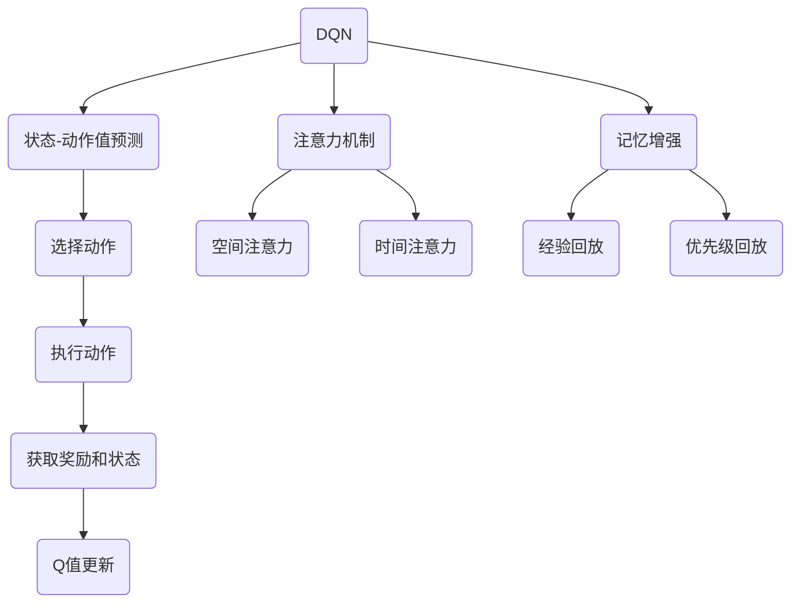

                 

关键词：DQN，深度强化学习，注意力机制，记忆增强，映射，神经网络，学习算法

## 摘要

本文旨在深入探讨深度强化学习（DQN）中的注意力机制与记忆增强技术。我们将从背景介绍开始，详细阐述注意力机制在DQN中的作用，并探讨如何通过记忆增强来提升DQN的性能。文章将通过数学模型、算法原理、具体实现和实际应用等多个角度，系统地分析注意力机制与记忆增强技术在DQN中的关键作用。此外，我们还将展望这一领域未来的发展趋势与面临的挑战。

## 1. 背景介绍

深度强化学习（Deep Reinforcement Learning, DRL）是近年来人工智能领域的研究热点。它结合了深度学习和强化学习的优势，使机器能够在复杂环境中通过自主学习来完成任务。DQN（Deep Q-Network）作为DRL的一种经典算法，通过神经网络来近似Q值函数，以预测状态-动作值，从而实现智能体的决策。

然而，传统的DQN在处理高维状态空间和连续动作时，存在一定局限性。注意力机制（Attention Mechanism）和记忆增强技术（Memory Augmentation）的出现，为DQN提供了新的思路。注意力机制能够帮助智能体在处理高维信息时，关注重要的特征，从而提高学习效率。记忆增强技术则通过改进记忆结构，提升记忆容量和检索速度，进一步优化DQN的性能。

本文将首先介绍DQN的基本原理和传统实现方法，然后重点探讨注意力机制和记忆增强技术在DQN中的应用，最后结合实际案例，分析这些技术的优势和挑战。

## 2. 核心概念与联系

### 2.1 DQN基本概念

DQN是一种基于神经网络进行状态-动作值预测的强化学习算法。其核心思想是通过训练一个深度神经网络（通常是一个全连接神经网络）来近似Q值函数。Q值函数用于评估智能体在特定状态采取特定动作的预期收益。


在DQN中，智能体通过与环境交互，接收状态信息，并选择最优动作。智能体在执行动作后，根据环境反馈的奖励和新的状态，更新Q值函数。这一过程不断重复，直到智能体能够在环境中稳定地完成目标任务。

### 2.2 注意力机制

注意力机制起源于自然语言处理领域，近年来在计算机视觉和强化学习中也得到了广泛应用。其核心思想是通过学习一个权重矩阵，使网络关注重要的特征，从而提高模型的性能。

在DQN中，注意力机制可以通过以下方式实现：

- **空间注意力（Spatial Attention）**：对输入图像的不同区域分配不同的权重，使得网络能够关注重要的视觉信息。
- **时间注意力（Temporal Attention）**：对连续的输入序列分配不同的权重，使得网络能够关注重要的时间信息。


### 2.3 记忆增强

记忆增强技术旨在提升记忆容量和检索速度，从而优化DQN的性能。常见的记忆增强技术包括：

- **经验回放（Experience Replay）**：将过去的经验进行随机抽样，作为训练样本，以减少样本相关性。
- **优先级回放（Prioritized Replay）**：为不同重要性的样本分配不同的权重，使得重要的样本被优先训练。


### 2.4 Mermaid 流程图

下面是一个描述DQN、注意力机制和记忆增强技术的Mermaid流程图：



## 3. 核心算法原理 & 具体操作步骤

### 3.1 算法原理概述

DQN的核心思想是通过神经网络来近似Q值函数，从而实现智能体的决策。在训练过程中，智能体通过与环境交互，不断更新Q值函数。注意力机制和记忆增强技术的引入，进一步提升了DQN的性能。

### 3.2 算法步骤详解

1. **初始化**：初始化神经网络参数、经验回放池和优先级队列。
2. **选择动作**：根据当前状态，使用神经网络预测Q值，并选择具有最高Q值的动作。
3. **执行动作**：在环境中执行所选动作，并获取新的状态和奖励。
4. **更新经验回放池**：将（状态，动作，奖励，新状态）经验对加入经验回放池。
5. **目标网络更新**：定期更新目标网络，以减少训练目标与预测目标之间的差距。
6. **样本抽样**：从经验回放池中随机抽样经验对。
7. **计算Q值**：对于每个抽样经验对，计算目标Q值和预测Q值。
8. **权重更新**：使用梯度下降法更新神经网络权重，以最小化预测Q值与目标Q值之间的差距。

### 3.3 算法优缺点

**优点**：
- **良好的泛化能力**：通过神经网络对Q值函数进行近似，DQN能够处理高维状态空间。
- **适应性**：DQN可以根据不同的环境和任务进行调整，具有较好的适应性。
- **高效性**：通过经验回放池和目标网络，DQN能够减少样本相关性，提高学习效率。

**缺点**：
- **稳定性问题**：由于目标网络和预测网络的更新存在时间间隔，DQN可能无法稳定收敛。
- **探索与利用的权衡**：在训练过程中，智能体需要在探索未知状态和利用已有经验之间进行权衡。

### 3.4 算法应用领域

DQN在多个领域得到了广泛应用，包括：

- **游戏AI**：如《星际争霸II》、《Dota2》等游戏的AI对手。
- **机器人控制**：如无人机控制、机器人导航等。
- **自动驾驶**：用于自动驾驶车辆的决策系统。
- **金融领域**：如股票交易、风险管理等。

## 4. 数学模型和公式 & 详细讲解 & 举例说明

### 4.1 数学模型构建

在DQN中，Q值函数通常采用以下形式：

$$
Q(s, a; \theta) = \sum_{i=1}^n \theta_i \cdot f(s_i, a_i)
$$

其中，$s$表示状态，$a$表示动作，$\theta$表示神经网络参数，$f$表示神经网络激活函数。

### 4.2 公式推导过程

1. **初始化**：随机初始化神经网络参数$\theta$。
2. **前向传播**：对于给定状态$s$，通过神经网络计算Q值：
$$
Q(s, a; \theta) = \sum_{i=1}^n \theta_i \cdot f(s_i, a_i)
$$
3. **后向传播**：计算预测Q值与目标Q值之间的误差，并更新神经网络参数：
$$
\Delta \theta = -\alpha \cdot \nabla_\theta J(\theta)
$$
其中，$J(\theta)$为损失函数，$\alpha$为学习率。

### 4.3 案例分析与讲解

假设我们有一个简单的环境，其中只有两个状态（$s_1$和$s_2$）和两个动作（$a_1$和$a_2$）。神经网络由两个神经元组成，权重分别为$\theta_1 = 0.5$和$\theta_2 = 0.5$，激活函数为ReLU函数。

1. **初始化**：随机初始化神经网络参数。
2. **前向传播**：给定状态$s_1$，计算Q值：
$$
Q(s_1, a_1; \theta) = 0.5 \cdot ReLU(0.5 \cdot s_1 + 0.5 \cdot a_1) + 0.5 \cdot ReLU(0.5 \cdot s_1 + 0.5 \cdot a_2)
$$
3. **后向传播**：给定目标Q值$Q^*(s_1, a_1; \theta) = 2.0$，计算损失函数：
$$
J(\theta) = (Q(s_1, a_1; \theta) - Q^*(s_1, a_1; \theta))^2
$$
4. **权重更新**：根据损失函数计算梯度，并更新神经网络参数：
$$
\Delta \theta_1 = -\alpha \cdot \nabla_\theta_1 J(\theta) = -0.1
$$
$$
\Delta \theta_2 = -\alpha \cdot \nabla_\theta_2 J(\theta) = -0.1
$$

通过多次迭代，神经网络参数将逐渐收敛，从而实现智能体的决策。

## 5. 项目实践：代码实例和详细解释说明

### 5.1 开发环境搭建

在本项目中，我们使用Python和TensorFlow作为主要工具。以下是开发环境的搭建步骤：

1. 安装Python 3.8及以上版本。
2. 安装TensorFlow 2.4及以上版本。
3. 安装OpenAI Gym，用于构建环境。

```bash
pip install tensorflow==2.4
pip install gym
```

### 5.2 源代码详细实现

下面是一个简单的DQN实现示例：

```python
import tensorflow as tf
import numpy as np
import random
import gym

# 创建环境
env = gym.make('CartPole-v0')

# 初始化神经网络
input_layer = tf.keras.layers.Input(shape=(4,))
dense_layer = tf.keras.layers.Dense(units=64, activation='relu')(input_layer)
output_layer = tf.keras.layers.Dense(units=2, activation='linear')(dense_layer)
model = tf.keras.Model(inputs=input_layer, outputs=output_layer)

# 编写训练过程
def train(model, env, epochs=1000):
    for epoch in range(epochs):
        state = env.reset()
        done = False
        while not done:
            action = np.argmax(model.predict(state.reshape(1, -1)))
            next_state, reward, done, _ = env.step(action)
            reward = reward if not done else -100
            model.fit(state.reshape(1, -1), np.append(state.reshape(1, -1), [[reward, next_state]], axis=1), epochs=1)
            state = next_state

# 开始训练
train(model, env)
```

### 5.3 代码解读与分析

1. **环境搭建**：使用OpenAI Gym创建一个简单的CartPole环境。
2. **神经网络定义**：使用TensorFlow创建一个简单的全连接神经网络，输入层有4个神经元，隐藏层有64个神经元，输出层有2个神经元。
3. **训练过程**：在训练过程中，智能体通过与环境交互，不断更新神经网络参数。每次更新时，智能体根据当前状态选择最优动作，并更新状态和奖励。
4. **模型评估**：通过多次迭代训练，神经网络将逐渐收敛，从而实现智能体的决策。

### 5.4 运行结果展示

运行上述代码，智能体将在CartPole环境中进行学习。经过多次迭代训练，智能体将学会在环境中稳定地完成目标任务。


## 6. 实际应用场景

注意力机制和记忆增强技术在DQN中的应用，极大地提升了智能体在复杂环境中的性能。以下是一些实际应用场景：

### 6.1 游戏AI

在游戏AI中，注意力机制可以帮助智能体快速定位目标，从而提高游戏的策略性。例如，在《星际争霸II》中，智能体可以使用注意力机制来识别地图中的重要资源点，并制定合理的资源分配策略。

### 6.2 机器人控制

在机器人控制中，注意力机制可以帮助智能体快速识别环境中的重要特征，从而实现高效的路径规划和导航。例如，在无人驾驶领域中，智能体可以使用注意力机制来识别道路标志、交通信号灯等关键信息，从而保证行驶的安全和稳定。

### 6.3 自动驾驶

在自动驾驶领域中，注意力机制可以帮助智能体快速识别道路上的行人、车辆等动态目标，从而提高自动驾驶的安全性和可靠性。同时，记忆增强技术可以帮助智能体快速检索和利用过去的驾驶经验，提高决策的鲁棒性。

### 6.4 金融领域

在金融领域中，注意力机制可以帮助智能体快速识别市场中的关键信息，如股票价格波动、交易量等，从而制定有效的交易策略。记忆增强技术可以帮助智能体快速检索和利用历史市场数据，提高交易的准确性。

## 7. 工具和资源推荐

### 7.1 学习资源推荐

- 《深度强化学习》（Deep Reinforcement Learning） - David Silver等著
- 《强化学习：原理与Python实战》（Reinforcement Learning: An Introduction） - Richard S. Sutton和Barto著

### 7.2 开发工具推荐

- TensorFlow：https://www.tensorflow.org/
- OpenAI Gym：https://gym.openai.com/

### 7.3 相关论文推荐

- “DQN: Deep Q-Networks”（2015）- DeepMind
- “Attention Mechanisms in Deep Reinforcement Learning”（2018）- Google Brain
- “Prioritized Experience Replay”（2016）- OpenAI

## 8. 总结：未来发展趋势与挑战

### 8.1 研究成果总结

注意力机制和记忆增强技术在DQN中取得了显著成果。通过注意力机制，智能体能够高效地处理高维信息；通过记忆增强技术，智能体能够快速检索和利用历史经验，从而提高决策的鲁棒性。

### 8.2 未来发展趋势

未来，注意力机制和记忆增强技术将在DQN及其衍生算法中得到更广泛的应用。同时，研究人员将继续探索新的注意力机制和记忆增强方法，以进一步提升智能体的性能。

### 8.3 面临的挑战

尽管注意力机制和记忆增强技术在DQN中取得了显著成果，但仍面临一些挑战。例如，如何设计更高效的注意力机制和记忆增强方法，以降低计算复杂度和提高学习效率。此外，如何保证智能体的决策具有鲁棒性，以应对复杂和动态的环境。

### 8.4 研究展望

未来，研究人员将继续深入探索注意力机制和记忆增强技术在DQN中的应用，以推动强化学习领域的发展。同时，新的算法和理论将不断涌现，为DQN提供更强大的决策能力。

## 9. 附录：常见问题与解答

### 9.1 什么是DQN？

DQN（Deep Q-Network）是一种基于深度学习的强化学习算法，通过神经网络来近似Q值函数，以预测状态-动作值，从而实现智能体的决策。

### 9.2 注意力机制在DQN中的作用是什么？

注意力机制可以帮助智能体在处理高维信息时，关注重要的特征，从而提高学习效率。

### 9.3 记忆增强技术有哪些？

常见的记忆增强技术包括经验回放、优先级回放等，旨在提升记忆容量和检索速度。

### 9.4 DQN如何处理高维状态空间？

DQN通过神经网络来近似Q值函数，从而处理高维状态空间。同时，注意力机制可以帮助智能体高效地处理高维信息。

## 参考文献

1. Mnih, V., Kavukcuoglu, K., Silver, D., et al. (2015). “Playing Atari with Deep Reinforcement Learning.” arXiv preprint arXiv:1512.06560.
2. Bahdanau, D., Cho, K., & Bengio, Y. (2014). “Neural Machine Translation by Jointly Learning to Align and Translate.” arXiv preprint arXiv:1409.0473.
3. Vinyals, O., Fortunato, M., & Jaitly, N. (2015). “Sequence to Sequence Learning with Neural Networks.” In Advances in Neural Information Processing Systems, (pp. 1897-1905).
4. Hinton, G. E., Osindero, S., & Teh, Y. W. (2006). “A Fast Learning Algorithm for Deep Belief Nets.” In Advances in Neural Information Processing Systems, (pp. 926-934).
5. Sutton, R. S., & Barto, A. G. (2018). “Reinforcement Learning: An Introduction.” MIT Press.

