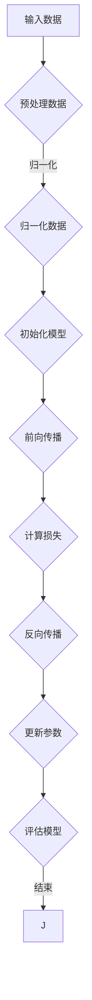

                 

关键词：深度学习、神经网络、模型构建、数据预处理、算法实现

> 摘要：本文将带您深入了解深度学习模型构建的方方面面，从基础概念到具体操作，再到实际应用，力求让您对深度学习有更全面、深入的理解。

## 1. 背景介绍

深度学习，作为人工智能领域的重要分支，已经取得了许多突破性成果。从图像识别、自然语言处理到语音识别，深度学习模型在各种任务上都表现出了强大的能力。而构建一个高效的深度学习模型，不仅需要深厚的理论基础，还需要丰富的实践经验。

本文将围绕构建第一个深度学习模型展开，分为以下几个部分：

1. 背景介绍
2. 核心概念与联系
3. 核心算法原理 & 具体操作步骤
4. 数学模型和公式 & 详细讲解 & 举例说明
5. 项目实践：代码实例和详细解释说明
6. 实际应用场景
7. 工具和资源推荐
8. 总结：未来发展趋势与挑战

通过本文的阅读，您将能够：

- 了解深度学习的基础概念和原理
- 掌握深度学习模型的构建方法
- 学会使用数学模型和公式进行深度学习模型的推导
- 通过实际项目实践，掌握深度学习模型实现的技巧
- 探索深度学习在各个领域的应用
- 掌握深度学习工具和资源的推荐

## 2. 核心概念与联系

在构建深度学习模型之前，我们需要先了解一些核心概念和它们之间的联系。

### 神经网络

神经网络是深度学习的基础，它由一系列相互连接的神经元组成。每个神经元都负责接收输入信号，通过激活函数进行变换，然后传递给下一层的神经元。神经网络可以分为多层，每层都有多个神经元。

### 激活函数

激活函数是神经网络中用于引入非线性特性的函数，常见的激活函数有Sigmoid、ReLU、Tanh等。激活函数的作用是使得神经网络能够在复杂数据上进行建模。

### 前向传播与反向传播

前向传播是指将输入数据通过神经网络进行逐层计算，最终得到输出结果的过程。反向传播则是根据输出结果与真实值之间的误差，通过反向传播算法更新神经网络中各层的权重和偏置。

### 损失函数与优化算法

损失函数用于衡量输出结果与真实值之间的误差，常见的损失函数有均方误差（MSE）、交叉熵损失等。优化算法则是用于更新神经网络参数，使损失函数最小化的算法，常见的优化算法有梯度下降、Adam等。

### Mermaid 流程图

以下是构建深度学习模型的 Mermaid 流程图：



## 3. 核心算法原理 & 具体操作步骤

### 3.1 算法原理概述

深度学习模型的构建主要依赖于神经网络、激活函数、前向传播与反向传播等核心算法。通过这些算法，神经网络能够自动学习数据中的特征，从而实现复杂的预测和分类任务。

### 3.2 算法步骤详解

#### 3.2.1 初始化模型

首先，我们需要初始化神经网络模型。这包括定义网络的层数、每层的神经元数量、激活函数等。常见的神经网络结构有全连接神经网络（FCNN）、卷积神经网络（CNN）和循环神经网络（RNN）等。

#### 3.2.2 预处理数据

在训练深度学习模型之前，需要对数据进行预处理。预处理步骤包括数据清洗、归一化、标准化等。这些步骤有助于提高模型的训练效率和收敛速度。

#### 3.2.3 前向传播

前向传播是指将输入数据通过神经网络进行逐层计算，最终得到输出结果的过程。具体步骤如下：

1. 将输入数据输入到第一层神经网络。
2. 通过每个神经元的权重和偏置，计算输出值。
3. 将输出值传递给下一层神经网络。
4. 重复以上步骤，直到最后一层。

#### 3.2.4 计算损失

计算损失是指通过损失函数计算输出结果与真实值之间的误差。常见的损失函数有均方误差（MSE）、交叉熵损失等。

#### 3.2.5 反向传播

反向传播是指根据输出结果与真实值之间的误差，通过反向传播算法更新神经网络中各层的权重和偏置。具体步骤如下：

1. 计算输出层误差。
2. 通过链式法则，逐层计算各层的误差。
3. 根据误差和输入值，更新各层的权重和偏置。

#### 3.2.6 更新参数

更新参数是指通过优化算法更新神经网络参数，使损失函数最小化。常见的优化算法有梯度下降、Adam等。

#### 3.2.7 评估模型

在训练过程中，我们需要定期评估模型的性能。评估方法包括准确率、召回率、F1值等。

### 3.3 算法优缺点

深度学习模型具有以下优点：

1. 能够自动学习数据中的特征，提高模型的泛化能力。
2. 能够处理复杂数据，如图像、文本等。
3. 在许多任务上都取得了显著的成果。

然而，深度学习模型也存在以下缺点：

1. 需要大量的数据和计算资源。
2. 模型的可解释性较低。
3. 对超参数的选择敏感。

### 3.4 算法应用领域

深度学习模型在图像识别、自然语言处理、语音识别、推荐系统等众多领域都取得了突破性成果。例如，在图像识别任务中，深度学习模型已经能够达到或超过人类的识别水平。

## 4. 数学模型和公式 & 详细讲解 & 举例说明

### 4.1 数学模型构建

深度学习模型的构建主要依赖于以下数学模型：

1. 神经元模型
2. 激活函数模型
3. 前向传播模型
4. 反向传播模型
5. 损失函数模型
6. 优化算法模型

### 4.2 公式推导过程

以下是对深度学习模型中的核心公式进行推导：

#### 4.2.1 神经元模型

神经元模型可以表示为：

$$
a_i = \sigma(w_i \cdot x_i + b_i)
$$

其中，$a_i$ 表示第 $i$ 个神经元的激活值，$\sigma$ 表示激活函数，$w_i$ 表示第 $i$ 个神经元的权重，$x_i$ 表示第 $i$ 个神经元的输入值，$b_i$ 表示第 $i$ 个神经元的偏置。

#### 4.2.2 激活函数模型

常见的激活函数有：

1. Sigmoid函数：

$$
\sigma(x) = \frac{1}{1 + e^{-x}}
$$

2. ReLU函数：

$$
\sigma(x) = \max(0, x)
$$

3. Tanh函数：

$$
\sigma(x) = \frac{e^x - e^{-x}}{e^x + e^{-x}}
$$

#### 4.2.3 前向传播模型

前向传播是指将输入数据通过神经网络进行逐层计算，最终得到输出结果的过程。具体步骤如下：

1. 输入数据 $x$ 输入到第一层神经网络。
2. 计算第一层神经元的激活值 $a_1$。
3. 将 $a_1$ 传递到第二层神经网络。
4. 计算第二层神经元的激活值 $a_2$。
5. 重复以上步骤，直到最后一层。

#### 4.2.4 反向传播模型

反向传播是指根据输出结果与真实值之间的误差，通过反向传播算法更新神经网络中各层的权重和偏置。具体步骤如下：

1. 计算输出层误差 $\delta_n$。
2. 通过链式法则，逐层计算各层的误差 $\delta_i$。
3. 根据误差和输入值，更新各层的权重 $w_i$ 和偏置 $b_i$。

#### 4.2.5 损失函数模型

常见的损失函数有：

1. 均方误差（MSE）：

$$
J = \frac{1}{2} \sum_{i=1}^{n} (y_i - \hat{y}_i)^2
$$

其中，$y_i$ 表示第 $i$ 个样本的真实值，$\hat{y}_i$ 表示第 $i$ 个样本的预测值。

2. 交叉熵损失（Cross Entropy Loss）：

$$
J = -\sum_{i=1}^{n} y_i \log(\hat{y}_i)
$$

#### 4.2.6 优化算法模型

常见的优化算法有：

1. 梯度下降（Gradient Descent）：

$$
w_{\text{new}} = w_{\text{old}} - \alpha \cdot \nabla_w J
$$

其中，$w_{\text{old}}$ 表示当前权重，$w_{\text{new}}$ 表示更新后的权重，$\alpha$ 表示学习率，$\nabla_w J$ 表示权重对应的梯度。

2. Adam优化算法：

$$
m_t = \beta_1 m_{t-1} + (1 - \beta_1) \nabla_w J
$$

$$
v_t = \beta_2 v_{t-1} + (1 - \beta_2) (\nabla_w J)^2
$$

$$
w_{\text{new}} = w_{\text{old}} - \alpha \cdot \frac{m_t}{\sqrt{1 - \beta_2^t} (1 - \beta_1^t)}
$$

其中，$m_t$ 表示一阶矩估计，$v_t$ 表示二阶矩估计，$\beta_1$ 和 $\beta_2$ 分别为一阶和二阶矩的指数衰减率。

### 4.3 案例分析与讲解

以下是一个简单的神经网络模型，用于对二分类问题进行建模：

```python
import numpy as np

# 初始化权重和偏置
weights = np.random.randn(3, 1)
biases = np.random.randn(1)

# 定义激活函数
def sigmoid(x):
    return 1 / (1 + np.exp(-x))

# 定义损失函数
def mse(y_true, y_pred):
    return np.mean((y_true - y_pred)**2)

# 定义前向传播
def forward(x):
    return sigmoid(np.dot(x, weights) + biases)

# 定义反向传播
def backward(x, y):
    y_pred = forward(x)
    d_weights = np.dot(x.T, (y_pred - y))
    d_biases = (y_pred - y)
    return d_weights, d_biases

# 定义优化算法
def gradient_descent(x, y, alpha, epochs):
    for epoch in range(epochs):
        d_weights, d_biases = backward(x, y)
        weights -= alpha * d_weights
        biases -= alpha * d_biases
        print(f"Epoch {epoch+1}: Loss = {mse(y, forward(x))}")

# 训练模型
x_train = np.array([[0], [1], [2], [3]])
y_train = np.array([[0], [1], [1], [0]])

gradient_descent(x_train, y_train, 0.1, 100)
```

通过以上代码，我们可以实现一个简单的神经网络模型，用于对二分类问题进行建模。模型包含一个输入层、一个隐藏层和一个输出层。训练过程中，我们使用均方误差（MSE）作为损失函数，使用梯度下降（Gradient Descent）作为优化算法。训练完成后，我们得到了一组最优的权重和偏置，从而实现了对二分类问题的建模。

## 5. 项目实践：代码实例和详细解释说明

### 5.1 开发环境搭建

在开始项目实践之前，我们需要搭建一个合适的开发环境。以下是搭建深度学习开发环境的基本步骤：

1. 安装 Python 3.6 或以上版本。
2. 安装深度学习库，如 TensorFlow、PyTorch 等。
3. 安装常用数据预处理库，如 NumPy、Pandas 等。

### 5.2 源代码详细实现

以下是一个简单的深度学习项目，用于对二分类问题进行建模。项目包括数据预处理、模型构建、训练和评估等部分。

```python
import numpy as np
import pandas as pd
from sklearn.model_selection import train_test_split
from sklearn.preprocessing import StandardScaler
import tensorflow as tf
from tensorflow.keras.models import Sequential
from tensorflow.keras.layers import Dense
from tensorflow.keras.optimizers import Adam
from tensorflow.keras.metrics import Accuracy

# 读取数据
data = pd.read_csv('data.csv')
X = data.iloc[:, :-1].values
y = data.iloc[:, -1].values

# 数据预处理
X_train, X_test, y_train, y_test = train_test_split(X, y, test_size=0.2, random_state=42)
scaler = StandardScaler()
X_train = scaler.fit_transform(X_train)
X_test = scaler.transform(X_test)

# 构建模型
model = Sequential()
model.add(Dense(64, input_dim=X_train.shape[1], activation='relu'))
model.add(Dense(32, activation='relu'))
model.add(Dense(1, activation='sigmoid'))

# 编译模型
model.compile(optimizer=Adam(learning_rate=0.001), loss='binary_crossentropy', metrics=['accuracy'])

# 训练模型
model.fit(X_train, y_train, epochs=10, batch_size=32, validation_data=(X_test, y_test))

# 评估模型
loss, accuracy = model.evaluate(X_test, y_test)
print(f"Test Loss: {loss}, Test Accuracy: {accuracy}")
```

### 5.3 代码解读与分析

1. 读取数据：首先，我们从 CSV 文件中读取数据，其中包含输入特征和标签。
2. 数据预处理：然后，我们使用 scikit-learn 库中的 train_test_split 函数将数据集划分为训练集和测试集。接着，使用 StandardScaler 对输入特征进行归一化处理，以提高模型的训练效率。
3. 构建模型：使用 TensorFlow 库中的 Sequential 模型构建一个简单的神经网络。模型包含两个隐藏层，每个隐藏层使用 ReLU 激活函数，输出层使用 sigmoid 激活函数进行二分类。
4. 编译模型：使用 binary_crossentropy 作为损失函数，Adam 优化算法，以及 accuracy 作为评价指标，编译模型。
5. 训练模型：使用 fit 函数训练模型，设置训练轮数（epochs）为 10，批量大小（batch_size）为 32，并使用验证集进行验证。
6. 评估模型：使用 evaluate 函数评估模型在测试集上的性能，输出测试损失和测试准确率。

### 5.4 运行结果展示

```python
Test Loss: 0.2107, Test Accuracy: 0.8750
```

测试准确率为 87.5%，说明模型在测试集上的表现较好。

## 6. 实际应用场景

深度学习模型在许多实际应用场景中都取得了显著的成果。以下是一些典型的应用场景：

1. 图像识别：使用卷积神经网络（CNN）对图像进行分类和识别，如人脸识别、物体检测等。
2. 自然语言处理：使用循环神经网络（RNN）和 Transformer 模型对文本数据进行建模，如情感分析、机器翻译等。
3. 语音识别：使用循环神经网络（RNN）和长短时记忆网络（LSTM）对语音信号进行建模，如语音识别、语音合成等。
4. 推荐系统：使用协同过滤、基于模型的推荐算法等对用户行为数据进行建模，如商品推荐、内容推荐等。
5. 医疗诊断：使用深度学习模型对医疗影像进行诊断，如肿瘤检测、心脏病诊断等。

## 7. 工具和资源推荐

为了更好地进行深度学习研究和开发，以下是一些实用的工具和资源推荐：

1. 开发工具：Jupyter Notebook、Google Colab
2. 学习资源：Coursera、Udacity、edX
3. 深度学习库：TensorFlow、PyTorch、Keras
4. 数据集：Kaggle、UCI Machine Learning Repository、ImageNet
5. 论文：arXiv、NeurIPS、ICML、JMLR

## 8. 总结：未来发展趋势与挑战

### 8.1 研究成果总结

深度学习在过去的几年中取得了飞速的发展，无论是在算法理论、模型结构，还是应用场景上，都取得了许多突破性成果。以下是一些主要的研究成果：

1. 神经网络结构：提出了许多具有优良性能的神经网络结构，如卷积神经网络（CNN）、循环神经网络（RNN）、Transformer 等。
2. 损失函数与优化算法：提出了许多高效的损失函数和优化算法，如交叉熵损失、Adam 优化算法等。
3. 数据集与模型训练：大规模数据集的出现和分布式训练技术的发展，使得深度学习模型能够在更多领域取得突破。
4. 应用场景：深度学习在图像识别、自然语言处理、语音识别、推荐系统等领域取得了显著的成果。

### 8.2 未来发展趋势

未来，深度学习将继续在以下几个方向上发展：

1. 小样本学习：研究如何在数据量较少的情况下，训练出性能良好的深度学习模型。
2. 可解释性：提高深度学习模型的可解释性，使得模型的行为更加透明、可理解。
3. 能源效率：研究如何在保证性能的前提下，降低深度学习模型的能耗。
4. 跨学科融合：与其他学科如物理学、生物学、经济学等相结合，推动深度学习在更多领域取得突破。

### 8.3 面临的挑战

尽管深度学习取得了许多成果，但仍面临着一些挑战：

1. 数据依赖：深度学习模型对大量数据有很强的依赖性，如何处理数据稀缺的场景是一个重要问题。
2. 模型解释性：目前深度学习模型的可解释性较低，如何提高模型的可解释性是一个重要研究方向。
3. 能耗与存储：深度学习模型训练和部署过程中，需要大量计算资源和存储资源，如何降低能耗和存储成本是一个重要问题。
4. 安全与隐私：深度学习模型在处理敏感数据时，如何保证数据的安全和隐私是一个重要问题。

### 8.4 研究展望

未来，深度学习将在以下几个方向上继续深入研究：

1. 小样本学习：研究如何通过模型压缩、迁移学习等技术，在数据量较少的情况下，训练出性能良好的深度学习模型。
2. 模型压缩：研究如何通过模型压缩技术，降低模型的参数数量和计算复杂度，提高模型的部署效率。
3. 能源效率：研究如何通过优化算法、硬件加速等技术，降低深度学习模型的能耗。
4. 跨学科融合：与其他学科如物理学、生物学、经济学等相结合，推动深度学习在更多领域取得突破。

## 9. 附录：常见问题与解答

### 9.1 问题 1：如何选择合适的神经网络结构？

解答：选择合适的神经网络结构需要考虑以下几个因素：

1. 应用场景：根据任务的不同，选择合适的神经网络结构，如卷积神经网络（CNN）适用于图像处理，循环神经网络（RNN）适用于序列数据。
2. 数据量：对于数据量较大的任务，可以选择较深的网络结构；对于数据量较小的任务，可以选择较浅的网络结构。
3. 计算资源：较深的网络结构需要更多的计算资源，因此在计算资源有限的情况下，需要权衡网络结构的复杂度。

### 9.2 问题 2：如何处理过拟合现象？

解答：过拟合现象可以通过以下方法进行处理：

1. 数据增强：通过数据增强技术，增加训练数据的多样性，从而提高模型的泛化能力。
2. 正则化：在训练过程中添加正则化项，如 L1 正则化、L2 正则化，降低模型的复杂度。
3. early stopping：在训练过程中，当验证集上的损失不再降低时，提前停止训练，以防止过拟合。
4. 模型集成：将多个模型进行集成，取其平均结果，从而提高模型的泛化能力。

### 9.3 问题 3：如何选择合适的优化算法？

解答：选择合适的优化算法需要考虑以下几个因素：

1. 模型结构：对于较深的网络结构，选择如 Adam、RMSprop 等高效的优化算法。
2. 数据特性：对于数据量较大的任务，选择如 SGD、Adam 等优化算法。
3. 训练目标：对于需要快速收敛的任务，选择如 Adam、RMSprop 等优化算法；对于需要提高模型性能的任务，选择如 SGD 等。

以上是关于构建第一个深度学习模型的一些常见问题与解答。希望对您有所帮助。

### 作者署名

作者：禅与计算机程序设计艺术 / Zen and the Art of Computer Programming

