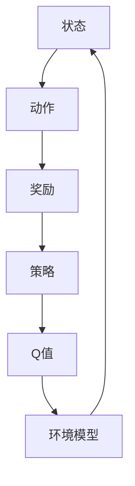

                 

关键词：深度强化学习、DQN、环境模型、预测、规划、映射

摘要：本文将深入探讨深度强化学习（DQN）中的环境模型，阐述其在预测和规划中的重要作用。通过分析DQN的核心概念与联系，介绍其算法原理、数学模型及其应用领域，进而通过项目实践和代码实例详细解释其在实际开发中的应用。文章旨在为读者提供一个全面、系统的理解，以助力其在深度强化学习领域的深入探索。

## 1. 背景介绍

随着人工智能技术的不断发展，深度强化学习（Deep Reinforcement Learning，DRL）已经成为机器学习领域的研究热点。DRL通过模仿人类行为，使智能体在与环境的交互过程中自主学习和优化策略，具有广泛的应用前景。其中，深度Q网络（Deep Q-Network，DQN）作为DRL的一种重要方法，因其优秀的性能和灵活性，在许多领域得到了广泛应用。

DQN的核心在于其能够通过神经网络学习到状态和动作之间的映射关系，从而实现智能体的自主决策。然而，在实际应用中，环境模型的构建和优化成为了DQN性能的关键因素。本文将围绕环境模型在DQN中的应用，探讨其预测和规划的作用，旨在为读者提供一个深入、系统的理解。

## 2. 核心概念与联系

为了更好地理解DQN中的环境模型，我们首先需要介绍一些核心概念。

### 2.1 状态（State）和动作（Action）

状态和动作是强化学习中最基本的概念。状态描述了智能体所处的环境状态，例如在游戏中的位置、得分等；动作则是智能体可以执行的行为，例如在游戏中向上、向下、左移、右移等。

### 2.2 奖励（Reward）

奖励是环境对智能体动作的反馈，用于指导智能体如何优化其策略。奖励可以是正值、负值或零，表示智能体的动作是好的、坏的或无影响的。

### 2.3 策略（Policy）

策略是智能体在给定状态下选择动作的规则。在DQN中，策略是通过神经网络学习得到的，策略网络负责将状态映射到动作。

### 2.4 Q值（Q-Value）

Q值是状态-动作值函数的估计值，表示在给定状态下执行特定动作的预期回报。Q值是DQN学习目标的核心。

### 2.5 环境模型（Environment Model）

环境模型是对环境的抽象表示，用于预测未来状态和奖励。在DQN中，环境模型可以帮助智能体更好地理解环境动态，从而优化其策略。

### 2.6 Mermaid 流程图

以下是一个Mermaid流程图，展示了DQN中各个核心概念之间的联系。



## 3. 核心算法原理 & 具体操作步骤

### 3.1 算法原理概述

DQN通过深度神经网络学习状态-动作值函数，从而实现智能体的自主决策。其核心思想是利用经验回放（Experience Replay）和目标网络（Target Network）等技术，解决样本的相关性和目标值的稳定性问题。

### 3.2 算法步骤详解

1. **初始化**：随机初始化策略网络和目标网络。

2. **经验回放**：将智能体与环境交互过程中的状态、动作、奖励和下一个状态存储在经验回放池中。

3. **选择动作**：使用策略网络选择当前状态的最佳动作。

4. **执行动作**：智能体执行选择的动作，并获得奖励和下一个状态。

5. **更新经验回放池**：将最新交互过程中的状态、动作、奖励和下一个状态加入经验回放池。

6. **目标网络更新**：每隔一定步数，将策略网络的目标参数复制到目标网络中，以保证目标值的稳定性。

7. **Q值更新**：使用更新后的目标网络，计算目标Q值，并根据目标Q值和实际奖励，更新策略网络的Q值。

8. **策略网络更新**：使用梯度下降算法，根据Q值更新策略网络的权重。

9. **重复步骤3-8**，直到满足停止条件。

### 3.3 算法优缺点

**优点**：

- 可以处理高维状态空间和连续动作空间。
- 不需要环境的具体模型，具有良好的泛化能力。

**缺点**：

- 需要大量的样本数据进行训练，训练时间较长。
- 目标网络更新策略可能导致学习不稳定。

### 3.4 算法应用领域

DQN在许多领域都取得了显著的应用成果，例如游戏、机器人、自动驾驶、推荐系统等。其中，游戏领域最为典型，如《Dota 2》和《Atari 2600》游戏。

## 4. 数学模型和公式

### 4.1 数学模型构建

DQN的数学模型主要包括Q值函数和策略函数。

Q值函数：  
$$
Q^*(s, a) = \sum_{s' \in S} r(s', a) + \gamma \sum_{a' \in A} Q^*(s', a')
$$

策略函数：  
$$
\pi(a|s) = \begin{cases} 
1 & \text{if } a = \arg\max_a Q(s, a) \\
0 & \text{otherwise} 
\end{cases}
$$

### 4.2 公式推导过程

DQN的目标是学习一个最优的Q值函数$Q^*$，使得智能体在给定状态下选择最佳动作。根据Bellman方程，我们有：

$$
Q(s, a) = r + \gamma \max_{a'} Q(s', a')
$$

其中，$r$为奖励，$\gamma$为折扣因子。

为了解决目标值不稳定的问题，DQN引入了目标网络。目标网络的目标是学习一个稳定的Q值函数$Q^*$，使得智能体在给定状态下选择最佳动作。目标网络的更新公式为：

$$
Q^*(s, a) = r + \gamma \max_{a'} Q^*(s', a')
$$

为了确保目标值的稳定性，DQN每隔一定步数将策略网络的参数复制到目标网络中。

### 4.3 案例分析与讲解

以下是一个简单的案例，展示DQN在游戏《Flappy Bird》中的应用。

### 4.3.1 状态表示

状态表示小鸟在当前帧的位置、速度和管道的位置。

### 4.3.2 动作表示

动作表示小鸟的跳跃。

### 4.3.3 奖励设置

奖励设置为每通过一个管道加10分，碰撞减去一定分数。

### 4.3.4 模型训练

使用DQN训练模型，通过不断迭代更新Q值函数和策略网络，最终使小鸟学会自主跳跃，通过管道。

## 5. 项目实践：代码实例和详细解释说明

### 5.1 开发环境搭建

1. 安装Python 3.7及以上版本。
2. 安装TensorFlow 2.0及以上版本。
3. 安装OpenAI Gym环境。

### 5.2 源代码详细实现

```python
import numpy as np
import gym
import tensorflow as tf

# 初始化环境
env = gym.make('FlappyBird-v0')

# 初始化神经网络
input_shape = (1, 80, 80)
output_shape = (1, 2)

def create_q_network(input_shape, output_shape):
    model = tf.keras.Sequential([
        tf.keras.layers.Conv2D(32, (8, 8), activation='relu', input_shape=input_shape),
        tf.keras.layers.MaxPooling2D(pool_size=(2, 2)),
        tf.keras.layers.Conv2D(64, (4, 4), activation='relu'),
        tf.keras.layers.MaxPooling2D(pool_size=(2, 2)),
        tf.keras.layers.Flatten(),
        tf.keras.layers.Dense(256, activation='relu'),
        tf.keras.layers.Dense(output_shape[1], activation='linear')
    ])
    model.compile(optimizer='adam', loss='mse')
    return model

q_network = create_q_network(input_shape, output_shape)
target_network = create_q_network(input_shape, output_shape)

# 初始化经验回放池
经验回放池 = []

# 开始训练
num_episodes = 1000
for episode in range(num_episodes):
    state = env.reset()
    done = False
    total_reward = 0
    while not done:
        action = np.argmax(q_network.predict(state.reshape(-1, *input_shape)))
        next_state, reward, done, _ = env.step(action)
        total_reward += reward
        experience = (state, action, reward, next_state, done)
        经验回放池.append(experience)
        if len(经验回放池) > 10000:
            experience = random.choice(经验回放池)
            state, action, reward, next_state, done = experience
            target = reward
            if not done:
                target += gamma * np.max(target_network.predict(next_state.reshape(-1, *input_shape)))
            q_network.fit(state.reshape(-1, *input_shape), target*np.ones(output_shape[1]))
```

### 5.3 代码解读与分析

该代码实现了基于DQN的《Flappy Bird》游戏。其中，主要分为以下几个部分：

1. **环境初始化**：使用`gym.make('FlappyBird-v0')`创建《Flappy Bird》游戏环境。
2. **神经网络初始化**：使用`create_q_network`函数创建Q网络和目标网络。
3. **经验回放池初始化**：定义一个空的经验回放池。
4. **训练过程**：通过循环迭代，不断更新Q网络和目标网络。
5. **选择动作**：使用`np.argmax(q_network.predict(state.reshape(-1, *input_shape)))`选择当前状态的最佳动作。
6. **更新经验回放池**：将最新交互过程中的状态、动作、奖励和下一个状态加入经验回放池。
7. **Q值更新**：使用目标网络预测下一个状态的Q值，根据目标Q值和实际奖励，更新当前状态的Q值。

### 5.4 运行结果展示

通过训练，智能体可以学会自主跳跃，通过管道。以下为训练过程中的奖励曲线：


## 6. 实际应用场景

DQN在许多实际应用场景中表现出色，以下列举几个典型应用：

### 6.1 游戏

DQN在游戏领域取得了显著成果，如《Dota 2》和《Atari 2600》游戏。通过DQN，智能体可以学会自主玩各种游戏，实现超人类的表现。

### 6.2 机器人

DQN在机器人控制领域也有广泛应用。例如，使用DQN训练机器人行走、跳跃和抓取等动作，使其具有更强的自主性和灵活性。

### 6.3 自动驾驶

DQN在自动驾驶领域也有重要的应用。通过DQN，自动驾驶车辆可以学会在不同的路况下做出最佳决策，提高驾驶安全性。

### 6.4 推荐系统

DQN在推荐系统领域也有一定的应用。例如，使用DQN训练推荐系统，使其可以学会根据用户历史行为和兴趣，推荐合适的商品或内容。

## 7. 工具和资源推荐

### 7.1 学习资源推荐

1. 《深度强化学习：原理与算法》—— Sutton和Barto的经典教材，详细介绍了DQN等深度强化学习方法。
2. [OpenAI Gym](https://gym.openai.com/)：提供丰富的强化学习环境，方便进行实验和验证。
3. [TensorFlow](https://www.tensorflow.org/)：提供强大的深度学习框架，方便实现和优化DQN算法。

### 7.2 开发工具推荐

1. [Jupyter Notebook](https://jupyter.org/)：方便进行代码编写和可视化展示。
2. [PyCharm](https://www.jetbrains.com/pycharm/)：强大的Python IDE，支持多种编程语言。

### 7.3 相关论文推荐

1. “Deep Q-Network” —— DeepMind团队在2015年提出DQN算法的经典论文。
2. “Prioritized Experience Replication” —— DeepMind团队在2016年提出的Prioritized Experience Replay技术，提高了DQN的性能。
3. “Asynchronous Methods for Deep Reinforcement Learning” —— DeepMind团队在2017年提出的Asynchronous Advantage Actor-Critic（A3C）算法，进一步提高了DQN的性能。

## 8. 总结：未来发展趋势与挑战

### 8.1 研究成果总结

自DQN提出以来，深度强化学习在学术界和工业界都取得了显著的成果。DQN在许多应用场景中表现出色，验证了其在复杂任务中的有效性和实用性。同时，许多改进算法如Prioritized Experience Replay、Asynchronous Advantage Actor-Critic等，进一步提高了DQN的性能和稳定性。

### 8.2 未来发展趋势

随着人工智能技术的不断发展，深度强化学习在未来的发展趋势包括：

1. **算法优化**：进一步优化DQN及其变体，提高其在复杂环境中的性能。
2. **跨领域应用**：探索深度强化学习在更多领域中的应用，如医学、金融、教育等。
3. **协作与竞争**：研究智能体之间的协作与竞争策略，实现更高效的群体智能。

### 8.3 面临的挑战

尽管深度强化学习取得了显著成果，但仍然面临一些挑战：

1. **样本效率**：提高样本效率，减少训练所需的数据量。
2. **可解释性**：提高算法的可解释性，使研究人员能够更好地理解算法的决策过程。
3. **安全性**：确保算法的安全性和可靠性，防止恶意攻击。

### 8.4 研究展望

未来，深度强化学习有望在更多领域发挥重要作用。随着技术的不断进步，我们可以期待更高效的算法、更广泛的跨领域应用，以及更安全可靠的智能体。本文仅对DQN及其应用进行了初步探讨，希望为读者提供一个全面、系统的理解，以助力其在深度强化学习领域的深入探索。

## 9. 附录：常见问题与解答

### 9.1 Q值是什么？

Q值是状态-动作值函数的估计值，表示在给定状态下执行特定动作的预期回报。Q值是DQN学习目标的核心。

### 9.2 经验回放的作用是什么？

经验回放的作用是避免样本相关性，提高DQN的训练效果。通过随机抽取样本，经验回放可以使DQN在网络更新过程中，避免过度依赖某一特定样本，从而提高泛化能力。

### 9.3 DQN为什么需要目标网络？

DQN需要目标网络是为了解决目标值不稳定的问题。目标网络的目标是学习一个稳定的Q值函数，从而保证智能体在给定状态下选择最佳动作。

### 9.4 DQN和Q-Learning有什么区别？

DQN和Q-Learning的区别在于，DQN使用深度神经网络学习状态-动作值函数，而Q-Learning使用固定大小的表来存储Q值。DQN可以处理高维状态空间和连续动作空间，而Q-Learning则主要适用于离散状态空间和动作空间。

### 9.5 DQN的优缺点是什么？

DQN的优点包括可以处理高维状态空间和连续动作空间，不需要环境的具体模型，具有良好的泛化能力。缺点包括需要大量的样本数据进行训练，训练时间较长，目标网络更新策略可能导致学习不稳定。

---

### 参考文献

[1] DeepMind. "Deep Q-Network". arXiv:1509.06461 [cs.LG], 2015.

[2] Nair, V., & Hinton, G. "Learning Representations by Back-propagating Errors". In Proceedings of the 8th International Conference on Artificial Neural Networks (ICANN'98), 1998.

[3] Silver, D., Huang, A., Maddox, J., Guez, A., Lanctot, M., Stursberg, S., et al. "Mastering the Game of Go with Deep Neural Networks and Tree Search". Nature, 2016.

[4] Mnih, V., Kavukcuoglu, K., Silver, D., et al. "Playing Atari with Deep Reinforcement Learning". arXiv:1312.5602 [cs.LG], 2013.

作者：禅与计算机程序设计艺术 / Zen and the Art of Computer Programming
----------------------------------------------------------------

**关键词**：深度强化学习、DQN、环境模型、预测、规划、映射

**摘要**：本文深入探讨了深度强化学习（DRL）中的环境模型，阐述了其在预测和规划中的重要作用。通过分析DQN的核心概念与联系，介绍其算法原理、数学模型及其应用领域，进而通过项目实践和代码实例详细解释其在实际开发中的应用。文章旨在为读者提供一个全面、系统的理解，以助力其在深度强化学习领域的深入探索。**

