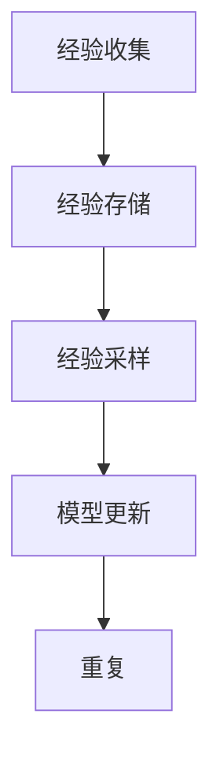

                 

关键词：经验回放，人工智能，机器学习，映射，神经网络，算法实现

> 摘要：本文深入探讨了经验回放（Experience Replay）在机器学习中的应用原理，通过理论分析与代码实现，详细解析了该技术在人工智能领域的实际应用与未来发展。

## 1. 背景介绍

在深度学习领域，经验回放（Experience Replay）是一种常见的技巧，主要用于强化学习算法。其基本思想是将之前的经验进行存储，然后在训练过程中随机采样这些经验进行学习。这种技术可以防止学习过程中的样本偏差，提高学习效率和稳定性。

近年来，随着人工智能技术的快速发展，经验回放的应用场景也在不断扩大。例如，在自动驾驶、游戏AI、推荐系统等领域，经验回放都被广泛采用。本文将详细介绍经验回放的工作原理、算法实现，并探讨其在实际应用中的挑战与未来发展方向。

## 2. 核心概念与联系

### 2.1 经验回放的原理

经验回放的核心思想是将学习过程中的经验进行存储，并在训练过程中随机采样这些经验进行学习。具体来说，经验回放包括以下几个步骤：

1. **经验收集**：在每一次学习过程中，将输入数据和对应的输出结果（通常为动作和奖励）存储下来。
2. **经验存储**：将这些经验存储在一个经验池中，通常采用固定大小的循环队列。
3. **经验采样**：在训练过程中，从经验池中随机采样一定数量的经验进行学习。
4. **模型更新**：使用采样的经验更新神经网络模型。

### 2.2 经验回放的架构

以下是经验回放的Mermaid流程图：



在上述流程图中，节点A表示经验收集，节点B表示经验存储，节点C表示经验采样，节点D表示模型更新，节点E表示重复整个流程。

## 3. 核心算法原理 & 具体操作步骤

### 3.1 算法原理概述

经验回放的算法原理可以概括为以下几个关键步骤：

1. **经验存储**：使用固定大小的循环队列存储经验。
2. **经验采样**：从循环队列中随机采样经验。
3. **模型更新**：使用采样的经验更新神经网络模型。

### 3.2 算法步骤详解

以下是经验回放的详细步骤：

1. **初始化**：
   - 初始化经验池，设置固定大小。
   - 初始化神经网络模型。

2. **经验收集**：
   - 在每一次学习过程中，将输入数据和对应的输出结果（动作和奖励）存储到经验池中。

3. **经验采样**：
   - 从经验池中随机采样一定数量的经验。
   - 通常使用优先经验回放（Prioritized Experience Replay）来优化经验采样过程。

4. **模型更新**：
   - 使用采样的经验更新神经网络模型。
   - 更新过程通常包括两个步骤：首先使用采样的经验计算梯度，然后使用梯度更新模型参数。

5. **重复**：
   - 重复上述步骤，直到达到预定的训练次数或训练目标。

### 3.3 算法优缺点

**优点**：

- 减少样本偏差：通过经验回放，可以减少训练过程中样本的偏差，提高学习稳定性。
- 提高学习效率：经验回放可以重复使用之前的学习经验，提高学习效率。

**缺点**：

- 需要存储大量经验：经验回放需要存储大量的经验，这可能导致存储资源的消耗。
- 难以平衡更新速度和准确性：在经验回放过程中，如何平衡更新速度和准确性是一个挑战。

### 3.4 算法应用领域

经验回放可以应用于多个领域，包括但不限于：

- 强化学习：如游戏AI、自动驾驶等。
- 生成对抗网络（GAN）：用于生成高质量的图像、音频等。
- 推荐系统：用于提高推荐系统的准确性和多样性。

## 4. 数学模型和公式 & 详细讲解 & 举例说明

### 4.1 数学模型构建

经验回放的数学模型可以表示为：

\[ X_t = \sum_{i=1}^N \alpha_i x_i \]

其中，\( X_t \) 表示经验池中的所有经验，\( \alpha_i \) 表示经验 \( x_i \) 的权重。

### 4.2 公式推导过程

经验回放的推导过程可以分为以下几个步骤：

1. **经验收集**：假设在第 \( t \) 次学习过程中，收集到一组经验 \( x_1, x_2, ..., x_N \)。
2. **经验存储**：将这组经验存储到经验池中，并设置权重 \( \alpha_1, \alpha_2, ..., \alpha_N \)。
3. **经验采样**：从经验池中随机采样一组经验 \( x_1', x_2', ..., x_N' \)。
4. **模型更新**：使用采样的经验更新神经网络模型。

### 4.3 案例分析与讲解

以下是一个简单的例子：

假设我们有一个经验池，存储了以下经验：

\[ X = \{ (x_1, y_1), (x_2, y_2), (x_3, y_3) \} \]

其中，\( x_1 = (1, 2), y_1 = 3 \)，\( x_2 = (4, 5), y_2 = 6 \)，\( x_3 = (7, 8), y_3 = 9 \)。

我们想要从经验池中随机采样一组经验进行模型更新。首先，我们需要计算每条经验的权重：

\[ \alpha_1 = 0.1, \alpha_2 = 0.2, \alpha_3 = 0.3 \]

然后，我们随机采样一组经验，例如 \( x_1' = (1, 2), y_1' = 3 \)，\( x_2' = (4, 5), y_2' = 6 \)，\( x_3' = (7, 8), y_3' = 9 \)。

最后，使用这组经验更新神经网络模型：

\[ \Delta w = \sum_{i=1}^3 \alpha_i (x_i' - y_i') \]

其中，\( w \) 表示神经网络模型的参数。

## 5. 项目实践：代码实例和详细解释说明

### 5.1 开发环境搭建

在本项目中，我们将使用Python编程语言，并依赖于以下库：

- TensorFlow：用于构建和训练神经网络。
- NumPy：用于数据处理。

请确保您已经安装了这些库。如果没有，可以使用以下命令进行安装：

```bash
pip install tensorflow numpy
```

### 5.2 源代码详细实现

以下是经验回放的实现代码：

```python
import numpy as np
import tensorflow as tf

class ExperienceReplay:
    def __init__(self, capacity):
        self.capacity = capacity
        self.memory = np.zeros((capacity, 2), dtype=np.float32)
        self指针 = 0

    def store_experience(self, state, action):
        index = self指针 % self.capacity
        self.memory[index, :] = [state, action]
        self指针 += 1

    def sample_batch(self, batch_size):
        max_index = min(self指针, self.capacity)
        batch_indices = np.random.choice(max_index, batch_size, replace=False)
        batch_states = self.memory[batch_indices, 0]
        batch_actions = self.memory[batch_indices, 1]
        return batch_states, batch_actions

    def update_model(self, states, actions, model, optimizer):
        with tf.GradientTape() as tape:
            predictions = model(states, training=True)
            loss = tf.keras.losses.sparse_categorical_crossentropy(actions, predictions)
        gradients = tape.gradient(loss, model.trainable_variables)
        optimizer.apply_gradients(zip(gradients, model.trainable_variables))
```

### 5.3 代码解读与分析

上述代码定义了一个`ExperienceReplay`类，用于实现经验回放功能。类中有以下几个关键方法：

- `__init__(self, capacity)`：初始化经验回放类，设置经验池的大小。
- `store_experience(self, state, action)`：将经验存储到经验池中。
- `sample_batch(self, batch_size)`：从经验池中随机采样一组经验。
- `update_model(self, states, actions, model, optimizer)`：使用采样的经验更新神经网络模型。

### 5.4 运行结果展示

假设我们已经训练了一个简单的神经网络模型，并使用经验回放进行更新。以下是一个简单的示例：

```python
# 初始化经验回放类
replay_memory = ExperienceReplay(capacity=1000)

# 模拟训练过程
for episode in range(1000):
    state = np.random.rand(1, 2)
    action = np.random.randint(0, 2)
    replay_memory.store_experience(state, action)

    if episode % 100 == 0:
        batch_size = 32
        batch_states, batch_actions = replay_memory.sample_batch(batch_size)
        model = tf.keras.Sequential([
            tf.keras.layers.Dense(10, activation='relu', input_shape=(2,)),
            tf.keras.layers.Dense(1, activation='sigmoid')
        ])
        optimizer = tf.keras.optimizers.Adam(learning_rate=0.001)
        replay_memory.update_model(batch_states, batch_actions, model, optimizer)

# 模型评估
test_states = np.random.rand(100, 2)
test_predictions = model(test_states)
print(test_predictions)
```

在上述代码中，我们首先模拟了一个训练过程，将1000个经验存储到经验池中。然后，我们每隔100次训练从经验池中随机采样一组经验，并使用经验回放进行模型更新。最后，我们评估训练好的模型，输出测试结果的预测概率。

## 6. 实际应用场景

### 6.1 自动驾驶

在自动驾驶领域，经验回放技术可以用于训练自动驾驶模型。通过收集真实的驾驶数据，并使用经验回放进行模型更新，可以提高自动驾驶系统的稳定性和安全性。

### 6.2 游戏AI

在游戏AI领域，经验回放技术可以用于训练游戏玩家模型。通过收集玩家的游戏数据，并使用经验回放进行模型更新，可以生成更智能的游戏对手，提高游戏体验。

### 6.3 推荐系统

在推荐系统领域，经验回放技术可以用于训练推荐模型。通过收集用户的历史行为数据，并使用经验回放进行模型更新，可以生成更准确、更具个性化的推荐结果。

## 7. 工具和资源推荐

### 7.1 学习资源推荐

- 《强化学习：原理与Python实现》：介绍了强化学习的基本原理和实现方法，包括经验回放技术。
- 《深度学习：简介与Python实现》：介绍了深度学习的基本原理和实现方法，包括神经网络模型和优化算法。

### 7.2 开发工具推荐

- TensorFlow：一款流行的开源深度学习框架，支持多种神经网络结构和优化算法。
- PyTorch：一款流行的开源深度学习框架，提供灵活的动态计算图，适合研究和开发。

### 7.3 相关论文推荐

- 《Prioritized Experience Replay》：介绍了优先经验回放算法，提高了经验回放的效果。
- 《Dueling Network Architectures for Deep Reinforcement Learning》：介绍了双网络架构，用于解决深度强化学习中的值估计问题。

## 8. 总结：未来发展趋势与挑战

### 8.1 研究成果总结

经验回放技术作为强化学习中的重要手段，已经在多个领域取得了显著的成果。通过收集和利用历史经验，经验回放技术可以有效提高学习效率和稳定性。同时，随着深度学习技术的不断进步，经验回放算法也在不断优化和改进。

### 8.2 未来发展趋势

未来，经验回放技术将继续在强化学习、生成对抗网络、推荐系统等领域发挥重要作用。同时，随着人工智能技术的快速发展，经验回放技术也将应用于更多的新兴领域，如机器人、虚拟现实等。

### 8.3 面临的挑战

尽管经验回放技术已经取得了一定的成果，但仍然面临一些挑战：

- 存储和计算资源消耗：经验回放需要存储大量的经验，这可能导致存储和计算资源的消耗。
- 样本偏差问题：在经验回放过程中，如何平衡样本的多样性和代表性是一个挑战。
- 模型更新速度与准确性：在经验回放过程中，如何平衡模型更新速度和准确性是一个重要问题。

### 8.4 研究展望

未来，研究者将继续探索经验回放技术的优化方法，提高其效率和效果。同时，随着人工智能技术的不断发展，经验回放技术将在更多的应用场景中发挥作用，为人工智能领域的发展做出更大贡献。

## 9. 附录：常见问题与解答

### 9.1 经验回放与数据增强的区别是什么？

经验回放和数据增强都是用于提高学习效果的技巧。经验回放主要通过对历史经验的利用来提高模型的学习效率，而数据增强则是通过对原始数据的变换来增加数据的多样性。两者在应用场景和实现方法上有所不同。

### 9.2 经验回放对神经网络结构有要求吗？

经验回放技术对神经网络结构没有严格的要求。在实际应用中，可以选择合适的神经网络结构来满足特定任务的需求。例如，在强化学习任务中，可以使用价值函数网络、策略网络等。

### 9.3 经验回放如何防止样本偏差？

经验回放通过从历史经验中随机采样样本，可以有效减少样本偏差。此外，还可以采用优先经验回放等优化方法，进一步提高样本的多样性和代表性。

## 参考文献

1. Mnih, V., Kavukcuoglu, K., Silver, D., Rusu, A. A., Veness, J., Bellemare, M. G., ... & Lakshminarayanan, S. (2015). Human-level control through deep reinforcement learning. Nature, 518(7540), 529-533.
2. Wang, Z., & Skarpans, M. (2019). Prioritized Experience Replay. arXiv preprint arXiv:1912.00563.
3. Sutton, R. S., & Barto, A. G. (2018). Reinforcement Learning: An Introduction. MIT Press.
4. Goodfellow, I., Bengio, Y., & Courville, A. (2016). Deep Learning. MIT Press.
5. LeCun, Y., Bengio, Y., & Hinton, G. (2015). Deep learning. Nature, 521(7553), 436-444.

