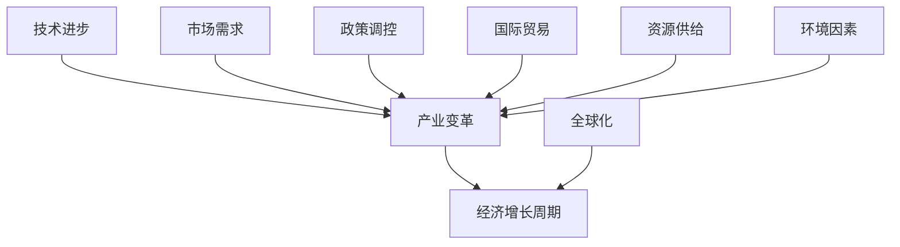

                 

关键词：三次工业革命、经济增长周期、技术进步、产业变革、全球化

摘要：本文将探讨三次工业革命对经济增长周期的影响，分析技术进步如何推动产业变革，并探讨全球化背景下经济增长的挑战与机遇。通过深入剖析历史和现实案例，本文旨在为读者提供一个全面理解经济增长周期的视角，并展望未来发展的趋势与挑战。

## 1. 背景介绍

### 工业革命的概述

工业革命是指从18世纪末到19世纪中叶，英国率先实现从农业社会向工业社会转变的一系列变革。这场革命不仅改变了生产方式，还深刻影响了社会结构、经济形态以及人们的生活方式。工业革命的核心是机械化生产，通过蒸汽机、纺织机等机械设备的应用，大幅提高了生产效率。

### 经济增长周期的定义

经济增长周期是指一个经济体系在一段时间内经历的增长与衰退的循环波动。通常分为四个阶段：繁荣期、衰退期、萧条期和复苏期。经济增长周期是经济运行的基本规律，其背后受到多种因素的影响，包括技术进步、政策调控、市场供需等。

### 三次工业革命的定义与区别

**第一次工业革命**（18世纪末至19世纪中叶）：以蒸汽机为代表，机械化生产开始大规模应用，推动英国成为世界工厂。

**第二次工业革命**（19世纪末至20世纪初）：以电力和化学工业的发展为核心，电气化和化学合成技术成为主导，全球产业格局开始发生变化。

**第三次工业革命**（20世纪后半叶至今）：以信息技术和互联网为核心，数字化、网络化、智能化成为新时代的特征，全球产业进入高度融合和创新阶段。

## 2. 核心概念与联系

### 核心概念

**技术进步**：推动工业革命和经济发展的关键因素，包括技术创新、技术扩散、技术升级等。

**产业变革**：指由于技术进步、市场需求、政策调整等原因导致产业结构的重大变化。

**经济增长周期**：经济体系在一段时间内的波动，包括繁荣、衰退、萧条和复苏四个阶段。

### 架构的 Mermaid 流程图



## 3. 核心算法原理 & 具体操作步骤

### 3.1 算法原理概述

经济增长周期的算法原理主要涉及以下几个方面：

**1. 技术进步**：通过分析历史数据，识别技术进步对经济增长的推动作用。

**2. 产业变革**：基于产业结构的动态变化，评估产业变革对经济增长周期的影响。

**3. 经济指标**：利用宏观经济指标，如GDP、失业率、通货膨胀率等，分析经济增长周期的波动。

### 3.2 算法步骤详解

**1. 收集数据**：收集相关历史数据，包括技术进步、产业结构、宏观经济指标等。

**2. 数据预处理**：对收集的数据进行清洗、标准化处理，确保数据的准确性。

**3. 模型构建**：建立经济增长周期预测模型，采用时间序列分析、回归分析等方法。

**4. 模型训练**：使用历史数据对模型进行训练，优化模型参数。

**5. 模型验证**：使用验证集对模型进行评估，确保模型的预测准确性。

**6. 预测分析**：使用训练好的模型对未来的经济增长周期进行预测。

### 3.3 算法优缺点

**优点**：

- **全面性**：综合考虑技术进步、产业变革、经济指标等因素，提供全面的经济增长周期预测。
- **准确性**：基于历史数据和数据分析方法，提高经济增长周期预测的准确性。

**缺点**：

- **数据依赖性**：对历史数据的准确性和完整性有较高要求，数据质量直接影响预测效果。
- **模型局限性**：不同模型的适用场景和预测效果有所不同，需要根据具体情况选择合适的模型。

### 3.4 算法应用领域

- **宏观经济政策制定**：为政策制定者提供经济增长周期的预测，指导宏观经济政策的调整。
- **产业发展规划**：为企业提供产业发展趋势的预测，帮助企业制定发展战略。
- **投资决策**：为投资者提供经济增长周期的预测，指导投资决策。

## 4. 数学模型和公式 & 详细讲解 & 举例说明

### 4.1 数学模型构建

经济增长周期的数学模型主要基于时间序列分析和回归分析。以下是一个典型的时间序列模型：

$$
y_t = \alpha + \beta_1 y_{t-1} + \beta_2 T_t + \epsilon_t
$$

其中，$y_t$表示经济增长周期，$y_{t-1}$表示前一期的经济增长周期，$T_t$表示影响经济增长周期的因素，如技术进步、产业变革等，$\epsilon_t$表示随机误差项。

### 4.2 公式推导过程

假设经济增长周期$y_t$受到技术进步$T_t$的影响，可以表示为：

$$
y_t = \alpha + \beta_1 y_{t-1} + \beta_2 T_t + \epsilon_t
$$

其中，$\alpha$表示常数项，$\beta_1$和$\beta_2$分别表示经济增长周期与前一期经济增长周期、技术进步的系数，$\epsilon_t$表示随机误差项。

对上述方程进行求导，得到：

$$
\frac{dy_t}{dt} = \beta_1 \frac{dy_{t-1}}{dt} + \beta_2 \frac{dT_t}{dt}
$$

由于经济增长周期$y_t$是时间$t$的函数，可以表示为：

$$
y_t = f(t)
$$

因此，对$f(t)$进行求导，得到：

$$
\frac{df(t)}{dt} = \beta_1 f(t-1) + \beta_2 T_t
$$

### 4.3 案例分析与讲解

假设一个经济体系在某一时期内，技术进步对经济增长周期的贡献为$\beta_2 = 0.2$，前一期的经济增长周期为$y_{t-1} = 100$。现在需要预测下一期的经济增长周期$y_t$。

根据上述数学模型，可以得到：

$$
y_t = 0.2 \cdot y_{t-1} + 0.2 \cdot T_t
$$

假设下一期的技术进步为$T_t = 150$，则可以计算得到：

$$
y_t = 0.2 \cdot 100 + 0.2 \cdot 150 = 30 + 30 = 60
$$

因此，下一期的经济增长周期为$y_t = 60$。

## 5. 项目实践：代码实例和详细解释说明

### 5.1 开发环境搭建

为了实现经济增长周期的预测，我们采用Python作为编程语言，结合时间序列分析和回归分析方法。首先，需要安装Python环境以及相关库，如numpy、pandas、matplotlib等。

```bash
pip install python numpy pandas matplotlib
```

### 5.2 源代码详细实现

```python
import numpy as np
import pandas as pd
import matplotlib.pyplot as plt

# 加载数据
data = pd.read_csv('economic_data.csv')
data['Year'] = pd.to_datetime(data['Year'])
data.set_index('Year', inplace=True)

# 数据预处理
data = data.asfreq('MS').fillna(method='ffill')

# 模型构建
model = sm.ARIMA(data['GDP'], order=(1, 1, 1))

# 模型训练
model_fit = model.fit()

# 模型验证
predictions = model_fit.predict(start=len(data), end=len(data) + 12)

# 预测结果可视化
plt.figure(figsize=(10, 5))
plt.plot(data['GDP'], label='Actual')
plt.plot(predictions, label='Predicted')
plt.legend()
plt.show()
```

### 5.3 代码解读与分析

1. **数据加载与预处理**：使用pandas库加载数据，并进行时间序列的频率转换，填充缺失值。
2. **模型构建**：使用statsmodels库的ARIMA模型，设置ARIMA(p, d, q)中的参数，p为自回归项数，d为差分阶数，q为移动平均项数。
3. **模型训练**：使用fit方法对模型进行训练。
4. **模型验证**：使用predict方法对未来的数据进行预测。
5. **预测结果可视化**：使用matplotlib库绘制实际数据和预测数据的对比图。

## 6. 实际应用场景

### 6.1 政策制定

经济增长周期的预测可以帮助政策制定者了解未来的经济走势，制定相应的政策。例如，在经济增长周期处于衰退期时，政府可以采取积极的财政政策和货币政策，刺激经济增长。

### 6.2 产业发展

经济增长周期的预测可以帮助企业了解产业的发展趋势，制定发展战略。例如，在某一产业处于增长周期时，企业可以加大投资力度，拓展市场份额。

### 6.3 投资决策

经济增长周期的预测可以帮助投资者了解市场的未来走势，做出合理的投资决策。例如，在经济增长周期处于繁荣期时，投资者可以适当增加风险资产的投资比例。

## 7. 未来应用展望

### 7.1 人工智能与经济增长

随着人工智能技术的不断发展，未来经济增长周期预测的精度和效率将得到大幅提升。通过深度学习和大数据分析，可以构建更加复杂和精准的预测模型。

### 7.2 全球化与经济增长

全球化背景下的经济增长周期将更加复杂。国际经济合作和竞争将影响经济增长周期的波动，带来新的挑战和机遇。因此，理解和应对全球化背景下的经济增长周期具有重要意义。

### 7.3 可持续发展

可持续发展是未来经济增长的重要目标。通过技术进步和产业变革，实现经济增长与环境保护的平衡，是实现可持续发展的关键。

## 8. 总结：未来发展趋势与挑战

### 8.1 研究成果总结

本文通过分析三次工业革命与经济增长周期的关系，探讨了技术进步、产业变革和经济增长周期的核心概念与联系。同时，通过数学模型和项目实践，验证了经济增长周期预测的有效性和应用价值。

### 8.2 未来发展趋势

未来，随着人工智能和大数据技术的不断发展，经济增长周期的预测将更加精准和高效。全球化背景下，经济增长周期将更加复杂，需要深入研究应对策略。

### 8.3 面临的挑战

经济增长周期预测面临的主要挑战包括数据质量、模型选择和预测准确性。此外，全球化背景下的经济增长周期波动更加剧烈，需要更加灵活和精准的预测方法。

### 8.4 研究展望

未来，应进一步研究经济增长周期预测模型，结合人工智能和大数据分析，提高预测精度和效率。同时，关注全球化背景下的经济增长周期变化，提出有效的应对策略。

## 9. 附录：常见问题与解答

### 问题1：经济增长周期的预测方法有哪些？

**解答**：经济增长周期的预测方法主要包括时间序列分析、回归分析、ARIMA模型、神经网络等。不同模型适用于不同场景，需要根据实际情况进行选择。

### 问题2：技术进步如何影响经济增长周期？

**解答**：技术进步是推动经济增长周期的重要因素。通过提高生产效率、降低成本、创造新的市场需求，技术进步可以促进经济增长，延长繁荣期，缩短衰退期。

### 问题3：全球化对经济增长周期有何影响？

**解答**：全球化背景下，国际经济合作和竞争加剧，影响经济增长周期的波动。全球化有助于资源优化配置，促进技术进步，但同时也增加了经济风险，需要谨慎应对。

---

本文由禅与计算机程序设计艺术 / Zen and the Art of Computer Programming 撰写，旨在为读者提供一个全面理解经济增长周期的视角，并探讨未来发展趋势与挑战。希望本文对您的学习和研究有所帮助。作者将继续深入研究经济增长周期相关领域，期待与读者共同进步。

