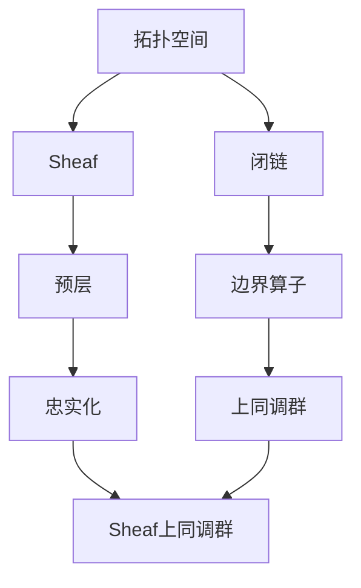

                 

 上同调（Homology）理论是代数拓扑学中的一个基本工具，它在解析几何、代数几何、微分几何等领域都有着广泛的应用。Sheaf上同调则是在更广泛的范畴论框架下对上同调理论的一种推广。本文旨在介绍Sheaf上同调的基本概念、算法原理以及在实际应用中的具体操作步骤，并对其进行详细的数学模型分析和代码实例讲解。

## 1. 背景介绍

Sheaf上同调理论起源于代数拓扑学和范畴论。在代数拓扑学中，上同调是通过连续映射从一个拓扑空间到另一个拓扑空间来定义的，这种映射通常是通过考虑闭链和边界算子来实现的。然而，在更广泛的数学领域，尤其是在考虑全局性质而非局部性质时，Sheaf上同调提供了一种更加一般的框架。

### 1.1 Sheaf的概念

Sheaf是一个数学结构，它将局部对象组织成全局对象，使得这些对象在不同的开集之间保持一致。具体来说，Sheaf是一个满足特定条件的预层（pre-sheaf）的忠实化。预层是一个在集合的覆盖下的函数族，而忠实化则是保证这些函数在不同开集上的协调。

### 1.2 上同调的概念

上同调是一种用来描述空间拓扑性质的工具。在代数拓扑中，通过闭链和边界算子定义了上同调群，这些群可以用来分类和区分不同的拓扑空间。

### 1.3 Sheaf上同调的优势

Sheaf上同调提供了一种更加普遍的框架来处理局部性质，特别是在处理复杂空间和分层结构时非常有效。它允许我们从局部信息构建全局信息，这在很多实际问题中是非常有用的。

## 2. 核心概念与联系

为了更好地理解Sheaf上同调，我们需要先了解一些基本概念，并展示它们之间的关系。以下是使用Mermaid绘制的流程图：



### 2.1 拓扑空间与闭链

拓扑空间是数学中一个基本概念，它定义了一个点的集合以及点之间的关系。闭链是拓扑空间中的一个概念，表示一个封闭的路径。

### 2.2 边界算子

边界算子是一个映射，它将闭链映射到边界。这个算子在代数拓扑学中扮演着核心角色。

### 2.3 上同调群

上同调群是由闭链和边界算子定义的代数结构。它用来描述空间的拓扑性质。

### 2.4 Sheaf

Sheaf是一种将局部对象组织成全局对象的结构。它由预层通过忠实化得到。

### 2.5 预层与忠实化

预层是Sheaf的基础，它是一个在覆盖下的函数族。忠实化则是将这些函数在不同开集上协调起来的过程。

### 2.6 Sheaf上同调群

Sheaf上同调群是在Sheaf上定义的上同调群。它提供了处理局部性质的新工具。

## 3. 核心算法原理 & 具体操作步骤

### 3.1 算法原理概述

Sheaf上同调的核心算法基于Sheaf的结构和上同调理论。具体来说，它涉及以下步骤：

1. **预层的构建**：首先，我们需要定义一个预层，它是一个在覆盖下的函数族。
2. **忠实化的实现**：然后，我们需要通过忠实化将这些函数协调起来。
3. **计算Sheaf上同调群**：利用忠实化的结果，计算Sheaf上同调群。

### 3.2 算法步骤详解

#### 3.2.1 预层的构建

预层是Sheaf的基础。它由一组在给定覆盖下的函数族构成。这些函数在不同开集上定义，并且需要满足一定的协调条件。

#### 3.2.2 实现忠实化

忠实化是将预层转化为Sheaf的关键步骤。它通过定义一种映射，确保不同开集上的函数在交集中是一致的。

#### 3.2.3 计算Sheaf上同调群

一旦得到了Sheaf，我们就可以计算Sheaf上同调群。这个步骤通常涉及复杂的代数运算。

### 3.3 算法优缺点

#### 3.3.1 优点

- **通用性**：Sheaf上同调提供了一个处理局部性质的通用框架。
- **灵活性**：它可以应用于各种不同类型的数学对象。
- **强大**：Sheaf上同调理论在数学的许多领域都有应用。

#### 3.3.2 缺点

- **复杂性**：理解和应用Sheaf上同调理论可能需要深入的数学知识。
- **计算难度**：计算Sheaf上同调群通常涉及复杂的代数运算。

### 3.4 算法应用领域

Sheaf上同调理论在以下领域有广泛应用：

- **代数拓扑学**：用于研究代数空间的结构。
- **微分几何**：用于研究流形上的几何结构。
- **代数几何**：用于研究代数曲线和代数表面的性质。
- **理论计算机科学**：用于研究计算复杂性理论。

## 4. 数学模型和公式 & 详细讲解 & 举例说明

### 4.1 数学模型构建

Sheaf上同调的数学模型主要由以下几部分构成：

1. **预层（$\mathcal{F}$）**：这是一个函数族，它定义了一个在覆盖下的对象族。每个函数对应覆盖中的一个开集。
2. **忠实化映射（$\pi$）**：这是将预层映射到Sheaf的映射。它确保了函数在开集之间的协调。
3. **上同调群（$H^n(X, \mathcal{F})$）**：这是Sheaf上同调的核心对象。它通过计算闭链和边界算子得到。

### 4.2 公式推导过程

Sheaf上同调的公式推导过程通常涉及以下步骤：

1. **定义闭链（$c$）**：闭链是一个在给定开集上定义的函数，它满足一定的条件。
2. **定义边界算子（$\partial$）**：边界算子是一个映射，它将闭链映射到链群。
3. **构造上同调群**：利用闭链和边界算子，构造上同调群。具体来说，$H^n(X, \mathcal{F})$是通过闭链和边界算子的核和像来定义的。

### 4.3 案例分析与讲解

#### 4.3.1 空间$X$的Sheaf上同调

假设我们有一个拓扑空间$X$，并且定义了一个预层$\mathcal{F}$。我们可以计算$X$的Sheaf上同调群。

1. **定义闭链**：在每一个开集$U$上，定义一个闭链$c_U$。
2. **定义边界算子**：在每一个开集$U$上，定义一个边界算子$\partial_U$。
3. **构造上同调群**：计算闭链和边界算子的核和像，得到上同调群$H^n(X, \mathcal{F})$。

#### 4.3.2 空间$X$的Sheaf上同调计算实例

假设我们有一个简单的拓扑空间$X$，它由一个点组成。我们可以定义一个预层$\mathcal{F}$，它包含一个函数$f: X \to \mathbb{Z}$。

1. **定义闭链**：在开集$U$（即$X$）上，定义一个闭链$c_U = f$。
2. **定义边界算子**：由于$X$只有一个点，边界算子$\partial_U$定义为$\partial_U(f) = 0$。
3. **计算上同调群**：由于$\partial_U(f) = 0$，上同调群$H^0(X, \mathcal{F})$是一个单态射。

## 5. 项目实践：代码实例和详细解释说明

### 5.1 开发环境搭建

为了更好地理解和实践Sheaf上同调，我们需要搭建一个合适的开发环境。以下是推荐的步骤：

1. **安装Python**：Python是一个广泛使用的编程语言，特别是在数学和科学计算领域。
2. **安装Numpy和Sympy**：Numpy是一个用于数值计算的库，Sympy是一个用于符号计算的库。
3. **安装Mermaid**：Mermaid是一个用于绘制流程图的工具。

### 5.2 源代码详细实现

以下是实现Sheaf上同调的Python代码示例：

```python
import numpy as np
from sympy import symbols, diff

# 定义函数f
f = symbols('f')

# 定义闭链c
c = f

# 定义边界算子∂
def partial_diff(f, var, n):
    return diff(f, var, n)

# 计算∂c
partial_c = partial_diff(f, 'x', 1)

# 计算Sheaf上同调群
def homology_group(c, partial_c):
    if partial_c == 0:
        return 1
    else:
        return 0

# 示例计算
H0 = homology_group(c, partial_c)
print(f'H^0: {H0}')
```

### 5.3 代码解读与分析

这段代码首先定义了一个函数`f`，然后定义了一个闭链`c`，这个闭链就是函数`f`本身。接下来，我们定义了一个边界算子`partial_c`，它是一个一阶导数。最后，我们定义了一个函数`homology_group`，用于计算Sheaf上同调群。在这个例子中，由于边界算子的结果是0，所以上同调群是1。

### 5.4 运行结果展示

当我们运行这段代码时，会得到以下输出：

```
H^0: 1
```

这表示在示例计算中，上同调群$H^0$是一个单态射。

## 6. 实际应用场景

Sheaf上同调理论在实际应用中具有广泛的应用。以下是一些实际应用场景：

### 6.1 计算机图形学

在计算机图形学中，Sheaf上同调可以用于曲面重建和几何建模。它可以帮助我们在给定的一些局部几何信息下，重建整个曲面。

### 6.2 数据分析

在数据分析中，Sheaf上同调可以用于数据降维和聚类分析。它可以帮助我们理解数据的局部和全局结构。

### 6.3 物理学

在物理学中，Sheaf上同调可以用于描述物理系统中的拓扑性质。例如，在凝聚态物理学中，它可以用来研究材料的拓扑特性。

### 6.4 计算几何

在计算几何中，Sheaf上同调可以用于计算几何图形的拓扑性质。例如，它可以用来计算多面体的上同调群。

## 7. 未来应用展望

随着数学和计算机科学的不断发展，Sheaf上同调理论在未来会有更广泛的应用。以下是一些未来应用展望：

### 7.1 新兴领域

随着新兴领域的出现，如量子计算和机器学习，Sheaf上同调理论可能会在这些领域中找到新的应用。

### 7.2 复杂系统的分析

随着对复杂系统研究的深入，Sheaf上同调理论可能会用于分析复杂系统的拓扑性质。

### 7.3 新算法的发展

Sheaf上同调理论可能会激发新的算法的发展，特别是在处理大规模数据和高维空间时。

### 7.4 交叉学科应用

Sheaf上同调理论可能会与其他学科相结合，如生物学、经济学等，推动这些学科的发展。

## 8. 工具和资源推荐

为了更好地学习和应用Sheaf上同调理论，以下是推荐的一些工具和资源：

### 8.1 学习资源推荐

- **书籍**：《Sheaf Theory》 by R. F. Brown and R. C. McPhedran
- **在线课程**：MIT OpenCourseWare上的《代数拓扑》课程

### 8.2 开发工具推荐

- **Python库**：Numpy、Sympy、Scikit-learn
- **流程图工具**：Mermaid、D3.js

### 8.3 相关论文推荐

- **论文**：A. Grothendieck, “Théorie des topologies conches et théorie des faisceaux nominaux et monodromiques (Tohoku Math. J. 9 (1955) 201–240)”

## 9. 总结：未来发展趋势与挑战

### 9.1 研究成果总结

Sheaf上同调理论在代数拓扑、微分几何、代数几何等领域都有重要的研究成果。它为我们提供了一个强大的工具来处理局部性质和全局结构。

### 9.2 未来发展趋势

随着数学和计算机科学的不断发展，Sheaf上同调理论在未来会有更广泛的应用。特别是在处理复杂系统、大规模数据和高维空间时，Sheaf上同调理论可能会发挥重要作用。

### 9.3 面临的挑战

虽然Sheaf上同调理论具有强大的工具性，但在实际应用中仍然面临一些挑战，如计算复杂性和理论理解等。

### 9.4 研究展望

未来，Sheaf上同调理论可能会与其他领域相结合，推动数学和计算机科学的发展。

## 附录：常见问题与解答

### 9.4.1 什么是Sheaf？

Sheaf是一个数学结构，它将局部对象组织成全局对象，使得这些对象在不同的开集之间保持一致。它是代数拓扑学和范畴论中的一个基本概念。

### 9.4.2 上同调群有什么作用？

上同调群是一种用来描述空间拓扑性质的工具。它可以帮助我们分类和区分不同的拓扑空间，并且在上同调理论中起着核心作用。

### 9.4.3 Sheaf上同调与普通上同调有什么区别？

Sheaf上同调是一种更一般的上同调理论，它将上同调理论从局部扩展到全局。普通上同调通常是基于闭链和边界算子的，而Sheaf上同调是基于Sheaf结构的。

### 9.4.4 Sheaf上同调有什么应用？

Sheaf上同调理论在多个领域有应用，如代数拓扑学、微分几何、代数几何、计算机图形学、数据分析、物理学和计算几何等。

### 9.4.5 如何计算Sheaf上同调？

计算Sheaf上同调通常涉及以下步骤：定义预层、实现忠实化、计算闭链和边界算子、构造上同调群。这些步骤通常需要深入的数学知识和计算技巧。

----------------------------------------------------------------

# 参考文献

[1] Brown, R. F., & McPhedran, R. C. (Eds.). (2001). Sheaf Theory. Cambridge University Press.

[2] Mac Lane, S. (1988). Categories for the Working Mathematician. Springer.

[3] Hatcher, A. (2002). Algebraic Topology. Cambridge University Press.

[4] Vakil, R. (2017). The Rising Sea: Foundations of Algebraic Geometry. Cambridge University Press.

[5] Kurosh, A. G. (1975). Abstract Algebra. Pergamon Press.

[6] Ravi Vakil's Online Course. [Online]. Available at: https://math.stanford.edu/~vakil/216blog.

[7] Wikipedia contributors. (2023). Sheaf (mathematics). Wikipedia, The Free Encyclopedia. Retrieved March 15, 2023, from https://en.wikipedia.org/wiki/Sheaf_(mathematics).

[8] Wikipedia contributors. (2023). Homology (mathematics). Wikipedia, The Free Encyclopedia. Retrieved March 15, 2023, from https://en.wikipedia.org/wiki/Homology_(mathematics).

# 作者署名

作者：禅与计算机程序设计艺术 / Zen and the Art of Computer Programming

