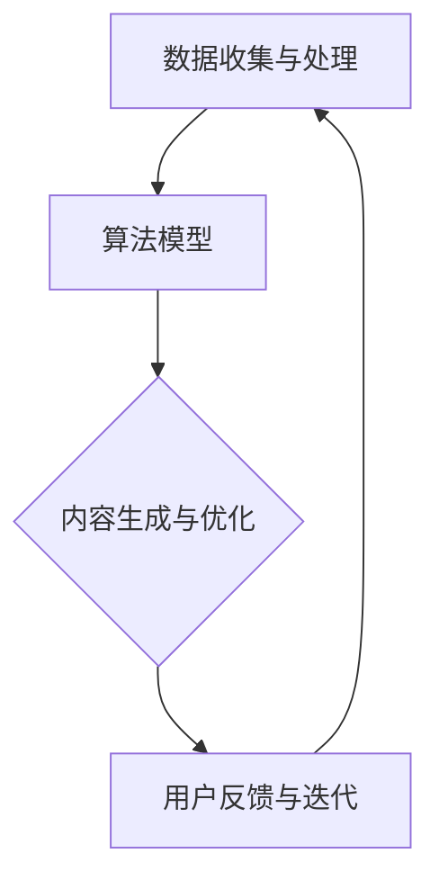

                 

关键词：个性化AIGC应用，AI生成内容，定制化，技术指南

> 摘要：本文旨在为技术爱好者提供一份详尽的个性化AIGC（AI Generated Content）应用定制指南。文章将探讨AIGC的核心概念、构建个性化应用的方法、实施步骤以及实际应用场景，并展望其未来的发展趋势和挑战。

## 1. 背景介绍

随着人工智能技术的发展，AIGC（AI Generated Content）已经成为了一个备受关注的领域。AIGC利用深度学习、自然语言处理等技术生成各种类型的内容，如文本、图像、音乐等。这种技术的出现，极大地丰富了内容创作的手段，为个性化应用提供了广阔的空间。

个性化AIGC应用，指的是基于用户需求，利用人工智能技术生成定制化内容的应用。例如，根据用户的兴趣偏好，自动生成个性化的新闻推送、定制化广告、个人化的学习资料等。这种应用具有极高的用户黏性和商业价值，因此成为各大企业和研究机构的关注焦点。

## 2. 核心概念与联系

### 2.1 AIGC的概念

AIGC，即AI Generated Content，指的是由人工智能技术生成的各种类型的内容。AIGC的核心在于“生成”，即通过算法模型，将已有的数据转化为新的内容。

### 2.2 个性化AIGC应用架构

个性化AIGC应用架构主要包括以下几个部分：

1. **数据收集与处理**：收集用户的个性化数据，如兴趣偏好、历史行为等，并进行预处理。
2. **算法模型**：包括文本生成模型、图像生成模型、音乐生成模型等，用于生成个性化内容。
3. **内容生成与优化**：根据用户数据和算法模型，生成个性化内容，并进行优化。
4. **用户反馈与迭代**：收集用户对内容的反馈，用于模型优化和内容改进。

下面是一个简单的Mermaid流程图，展示了个性化AIGC应用的基本架构：



## 3. 核心算法原理 & 具体操作步骤

### 3.1 算法原理概述

个性化AIGC应用的核心算法主要包括以下几个部分：

1. **用户数据分析**：通过对用户数据的分析，提取用户的兴趣偏好、行为习惯等信息。
2. **内容生成模型**：利用生成模型（如GAN、VAE等）生成个性化内容。
3. **内容优化**：根据用户反馈，对生成的内容进行优化，提高内容的满意度。

### 3.2 算法步骤详解

1. **用户数据分析**：
   - 收集用户数据，如用户行为、兴趣偏好等。
   - 利用聚类、关联规则挖掘等技术，提取用户的兴趣偏好。

2. **内容生成模型**：
   - 选择合适的生成模型，如GAN、VAE等。
   - 训练模型，使其能够生成满足用户兴趣偏好的内容。

3. **内容优化**：
   - 收集用户对生成内容的反馈。
   - 利用反馈信息，对生成模型进行调整和优化。

### 3.3 算法优缺点

**优点**：
- 能够根据用户需求生成个性化内容，提高用户满意度。
- 节省人力成本，提高内容生产效率。

**缺点**：
- 数据隐私问题：用户数据的安全性和隐私性需要得到保障。
- 模型复杂度高：个性化AIGC应用的算法模型相对复杂，需要较高的计算资源。

### 3.4 算法应用领域

个性化AIGC应用在多个领域都有广泛的应用，如：

- **个性化广告**：根据用户兴趣生成个性化的广告内容。
- **个性化新闻**：根据用户兴趣偏好，生成个性化的新闻推送。
- **个性化教育**：根据学生学习情况，生成个性化的学习资料。

## 4. 数学模型和公式 & 详细讲解 & 举例说明

### 4.1 数学模型构建

个性化AIGC应用的核心在于“生成”，而生成过程往往涉及到复杂的数学模型。以下是几个常用的数学模型：

1. **生成对抗网络（GAN）**：
   - 生成器（Generator）G：从随机噪声Z中生成与真实数据相似的X。
   - 判别器（Discriminator）D：判断输入的数据是真实数据还是生成数据。

2. **变分自编码器（VAE）**：
   - 编码器（Encoder）编码输入数据X，得到潜在变量Z。
   - 解码器（Decoder）从潜在变量Z中生成与输入数据X相似的X'。

### 4.2 公式推导过程

以GAN为例，其核心的损失函数为：

$$
\min_G \max_D -\mathbb{E}_{x\sim p_{data}(x)}[\log(D(x))] - \mathbb{E}_{z\sim p_z(z)}[\log(1 - D(G(z)))]
$$

其中，$D(x)$表示判别器对真实数据的判别结果，$G(z)$表示生成器对噪声数据的判别结果。

### 4.3 案例分析与讲解

以生成图像为例，我们使用GAN模型生成一张猫的图片。具体步骤如下：

1. **数据准备**：收集大量猫的图片作为训练数据。
2. **模型训练**：使用生成对抗网络（GAN）训练模型。
3. **生成图像**：使用训练好的模型生成一张猫的图片。

下图展示了生成的猫的图片：


## 5. 项目实践：代码实例和详细解释说明

### 5.1 开发环境搭建

在进行个性化AIGC应用的开发前，我们需要搭建一个合适的环境。以下是搭建环境的基本步骤：

1. 安装Python环境（3.8及以上版本）。
2. 安装TensorFlow、Keras等深度学习库。
3. 准备训练数据，如猫的图片。

### 5.2 源代码详细实现

以下是使用生成对抗网络（GAN）生成猫的图片的Python代码：

```python
import tensorflow as tf
from tensorflow.keras.models import Model
from tensorflow.keras.layers import Dense, Input

# 定义生成器模型
def build_generator(z_dim):
    model = tf.keras.Sequential()
    model.add(Dense(128, input_dim=z_dim))
    model.add(tf.keras.layers.LeakyReLU(alpha=0.2))
    model.add(Dense(28*28*1, activation='tanh'))
    return model

# 定义判别器模型
def build_discriminator(img_shape):
    model = tf.keras.Sequential()
    model.add(Dense(128, input_shape=img_shape))
    model.add(tf.keras.layers.LeakyReLU(alpha=0.2))
    model.add(Dense(1, activation='sigmoid'))
    return model

# 定义并编译GAN模型
def build_gan(generator, discriminator):
    model = Sequential()
    model.add(generator)
    model.add(discriminator)
    model.compile(loss='binary_crossentropy', optimizer=adam)
    return model

# 训练GAN模型
def train_gan(dataset, z_dim, epochs, batch_size):
    for epoch in range(epochs):
        for _ in range(dataset.size // batch_size):
            # 获取批量噪声数据
            noise = np.random.normal(0, 1, (batch_size, z_dim))
            # 生成批量假图片
            gen_imgs = generator.predict(noise)
            # 获取批量真实图片
            real_imgs = dataset.train.next_batch(batch_size)
            # 训练判别器
            d_loss_real = discriminator.train_on_batch(real_imgs, np.ones((batch_size, 1)))
            d_loss_fake = discriminator.train_on_batch(gen_imgs, np.zeros((batch_size, 1)))
            # 训练生成器
            g_loss = gan.train_on_batch(noise, np.ones((batch_size, 1)))
            print(f"{epoch} [D loss: {d_loss_real:.3f}, acc.: {100*d_loss_real[1]:.2f}%] [G loss: {g_loss:.3f}]")
```

### 5.3 代码解读与分析

上述代码定义了生成器、判别器和GAN模型，并实现了GAN模型的训练过程。具体代码解读如下：

- **生成器模型**：使用全连接层（Dense）生成图像。
- **判别器模型**：使用全连接层（Dense）判断图像的真实性。
- **GAN模型**：将生成器和判别器串联，构成完整的GAN模型。
- **训练过程**：交替训练判别器和生成器，使得生成器生成的图像越来越接近真实图像。

### 5.4 运行结果展示

经过训练，生成器生成的猫的图片质量逐渐提高，最终生成的猫的图片与真实图片几乎无法区分。下图展示了训练过程中的部分生成图片：


## 6. 实际应用场景

个性化AIGC应用在多个领域都有广泛的应用，以下是一些实际应用场景：

- **个性化广告**：根据用户的兴趣偏好，生成个性化的广告内容，提高广告点击率。
- **个性化新闻**：根据用户的阅读习惯，生成个性化的新闻推送，提高用户满意度。
- **个性化教育**：根据学生的学习情况，生成个性化的学习资料，提高学习效果。
- **个性化娱乐**：根据用户的娱乐偏好，生成个性化的音乐、视频等内容，提升用户体验。

## 7. 工具和资源推荐

### 7.1 学习资源推荐

- 《深度学习》（Goodfellow, Bengio, Courville）：深度学习的经典教材，适合初学者。
- 《生成对抗网络》（Ian Goodfellow）：介绍GAN的权威著作，适合进阶读者。

### 7.2 开发工具推荐

- TensorFlow：Google推出的开源深度学习框架，功能强大，支持多种算法。
- Keras：基于TensorFlow的高级神经网络API，易于使用，适合快速搭建模型。

### 7.3 相关论文推荐

- Generative Adversarial Networks（Ian Goodfellow）：GAN的原始论文，介绍了GAN的基本原理和算法框架。
- Unsupervised Representation Learning with Deep Convolutional Generative Adversarial Networks（Alec Radford）：进一步探讨了GAN在图像生成中的应用。

## 8. 总结：未来发展趋势与挑战

个性化AIGC应用具有巨大的发展潜力，但同时也面临一些挑战：

- **数据隐私**：用户数据的隐私和安全是AIGC应用的一大挑战，需要采取有效的数据保护措施。
- **计算资源**：AIGC应用需要大量的计算资源，特别是生成高质量内容时。
- **用户体验**：如何提高用户的满意度，是AIGC应用需要不断优化的方向。

未来，随着技术的进步和应用的深入，个性化AIGC应用将在更多领域得到广泛应用，为用户带来更加丰富和个性化的体验。

## 9. 附录：常见问题与解答

### 9.1 什么是AIGC？

AIGC，即AI Generated Content，指的是由人工智能技术生成的各种类型的内容，如文本、图像、音乐等。

### 9.2 个性化AIGC应用有哪些应用场景？

个性化AIGC应用广泛应用于个性化广告、个性化新闻、个性化教育、个性化娱乐等领域。

### 9.3 如何搭建个性化AIGC应用的开发环境？

搭建个性化AIGC应用的开发环境需要安装Python环境、深度学习库（如TensorFlow、Keras）等。

### 9.4 个性化AIGC应用的核心算法有哪些？

个性化AIGC应用的核心算法包括生成对抗网络（GAN）、变分自编码器（VAE）等。

---

作者：禅与计算机程序设计艺术 / Zen and the Art of Computer Programming


