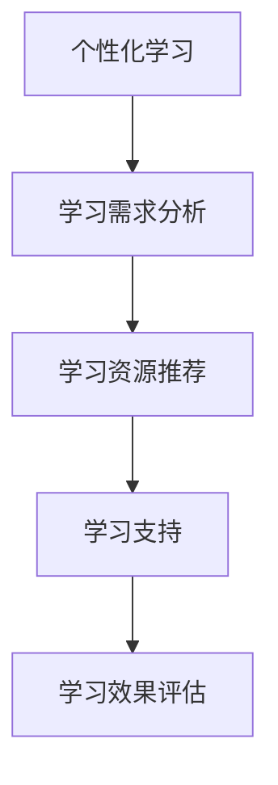

                 

关键词：个性化学习、定制化教育、人类计算、教育技术、学习算法、认知模型

> 摘要：随着教育技术的不断发展，个性化学习已成为教育领域的一个重要方向。本文将探讨如何利用人类计算技术，打造出真正定制化的教育体验，为学习者提供更高效、更个性化的学习路径。

## 1. 背景介绍

教育技术的发展经历了从传统教育到信息化教育，再到智慧教育的演变过程。随着互联网、大数据、人工智能等技术的应用，教育领域逐渐从传统的“一对多”教学模式，转向了“一对一”的个性化教学模式。个性化学习作为一种以学习者为中心的教育理念，强调根据学习者的特点和需求，为其提供个性化的学习内容、学习资源和学习支持。

在个性化学习的过程中，人类计算技术起到了至关重要的作用。人类计算技术是指利用计算机模拟人类思维和行为的技术，包括自然语言处理、机器学习、认知建模等。通过这些技术，我们可以更好地理解学习者的学习需求，为学习者提供更精准的学习推荐，从而实现真正的个性化学习。

## 2. 核心概念与联系

### 2.1 个性化学习

个性化学习是指根据学习者的个性、兴趣、学习能力等因素，为其提供个性化的学习内容、学习资源和学习支持。个性化学习强调以学习者为中心，尊重学习者的差异性和个性化需求，旨在提高学习效果和学习满意度。

### 2.2 人类计算

人类计算是指利用计算机模拟人类思维和行为的技术。人类计算技术包括自然语言处理、机器学习、认知建模等。这些技术可以帮助我们更好地理解学习者的学习需求，为学习者提供更精准的学习推荐。

### 2.3 认知模型

认知模型是指对人类思维过程的抽象和模拟。通过构建认知模型，我们可以更好地理解学习者的认知过程，为学习者提供更有效的学习支持。

#### Mermaid 流程图



## 3. 核心算法原理 & 具体操作步骤

### 3.1 算法原理概述

个性化学习的核心在于对学习者的需求进行准确分析，并为其推荐合适的学习资源。这需要运用自然语言处理、机器学习等技术，对学习者的学习行为和特征进行深入挖掘。

### 3.2 算法步骤详解

1. **学习需求分析**：通过收集学习者的学习行为数据，如学习时间、学习内容、学习结果等，对学习者的需求进行分析。
2. **学习资源推荐**：根据学习需求分析结果，运用自然语言处理、机器学习等技术，为学习者推荐合适的学习资源。
3. **学习支持**：在学习过程中，为学习者提供个性化的学习支持，如学习策略指导、学习进度跟踪等。
4. **学习效果评估**：通过学习效果评估，对个性化学习的效果进行反馈和优化。

### 3.3 算法优缺点

**优点**：

1. 提高学习效果：个性化学习能够根据学习者的需求提供定制化的学习内容，有助于提高学习效果。
2. 提高学习满意度：个性化学习能够满足学习者的个性化需求，提高学习满意度。

**缺点**：

1. 数据收集和处理的复杂性：个性化学习需要对大量学习行为数据进行分析和处理，这需要一定的技术支持。
2. 隐私保护问题：学习行为数据的收集和处理可能涉及隐私保护问题。

### 3.4 算法应用领域

个性化学习算法广泛应用于教育领域，如在线教育平台、智能学习系统、个性化学习推荐等。随着人工智能技术的发展，个性化学习算法将在更广泛的领域得到应用。

## 4. 数学模型和公式 & 详细讲解 & 举例说明

### 4.1 数学模型构建

个性化学习算法的核心是学习需求分析和学习资源推荐。为了构建数学模型，我们可以从以下几个方面进行：

1. **学习行为数据**：学习行为数据包括学习时间、学习内容、学习结果等。
2. **学习资源数据**：学习资源数据包括课程内容、学习材料、练习题等。
3. **学习者特征数据**：学习者特征数据包括年龄、性别、兴趣爱好、学习能力等。

### 4.2 公式推导过程

为了构建个性化学习模型，我们可以采用以下公式：

1. **学习需求分析**：

$$
需求得分 = f(学习时间, 学习内容, 学习结果)
$$

其中，$f$ 表示一个函数，用于计算学习者的需求得分。

2. **学习资源推荐**：

$$
推荐得分 = g(需求得分, 资源内容, 资源难度)
$$

其中，$g$ 表示一个函数，用于计算学习资源的推荐得分。

3. **学习支持**：

$$
支持策略 = h(需求得分, 学习进度)
$$

其中，$h$ 表示一个函数，用于计算学习支持策略。

4. **学习效果评估**：

$$
效果得分 = i(学习结果, 学习进度)
$$

其中，$i$ 表示一个函数，用于计算学习效果得分。

### 4.3 案例分析与讲解

假设有一个学习者，他的学习时间集中在晚上，喜欢学习编程课程，但他的学习效果一般。我们可以按照以下步骤进行个性化学习：

1. **学习需求分析**：

   学习需求得分 = $f(晚上, 编程课程, 学习效果一般) = 0.7$

2. **学习资源推荐**：

   编程课程 A 的推荐得分 = $g(0.7, 编程课程 A 内容, 中等难度) = 0.8$
   
   编程课程 B 的推荐得分 = $g(0.7, 编程课程 B 内容, 难度较高) = 0.6$

3. **学习支持**：

   学习支持策略 = $h(0.7, 学习进度) = 学习策略指导 + 学习进度跟踪$

4. **学习效果评估**：

   学习效果得分 = $i(学习结果一般, 学习进度) = 0.6$

根据以上分析，我们可以为学习者推荐编程课程 A，并提供学习策略指导和学习进度跟踪支持，以期望提高学习效果。

## 5. 项目实践：代码实例和详细解释说明

### 5.1 开发环境搭建

为了实现个性化学习算法，我们需要搭建一个开发环境。这里我们使用 Python 作为开发语言，并使用以下库：

- Pandas：用于数据分析和处理。
- Scikit-learn：用于机器学习。
- Matplotlib：用于数据可视化。

### 5.2 源代码详细实现

以下是一个简单的个性化学习算法实现示例：

```python
import pandas as pd
from sklearn.model_selection import train_test_split
from sklearn.ensemble import RandomForestClassifier
import matplotlib.pyplot as plt

# 加载数据
data = pd.read_csv('learning_data.csv')

# 数据预处理
X = data[['学习时间', '学习内容', '学习难度']]
y = data['学习效果']

# 数据分割
X_train, X_test, y_train, y_test = train_test_split(X, y, test_size=0.2, random_state=42)

# 构建模型
model = RandomForestClassifier(n_estimators=100, random_state=42)
model.fit(X_train, y_train)

# 模型评估
accuracy = model.score(X_test, y_test)
print(f"模型准确率：{accuracy:.2f}")

# 可视化
plt.scatter(X_test['学习时间'], X_test['学习效果'])
plt.xlabel('学习时间')
plt.ylabel('学习效果')
plt.show()
```

### 5.3 代码解读与分析

以上代码首先加载数据，然后进行数据预处理，将学习时间、学习内容和学习难度作为特征，学习效果作为标签。接着，使用随机森林算法构建模型，并进行模型评估。最后，使用可视化方法展示学习时间和学习效果之间的关系。

通过这个简单的示例，我们可以看到个性化学习算法的基本实现过程。在实际应用中，我们可以根据具体需求，对算法进行优化和调整。

## 6. 实际应用场景

个性化学习算法在教育领域具有广泛的应用前景。以下是一些实际应用场景：

1. **在线教育平台**：在线教育平台可以利用个性化学习算法，为学习者提供个性化的学习推荐，提高学习效果和用户满意度。
2. **智能学习系统**：智能学习系统可以通过个性化学习算法，为学习者提供定制化的学习路径，实现智能化的学习支持。
3. **教育机构**：教育机构可以利用个性化学习算法，为不同层次、不同需求的学习者提供个性化的学习资源和学习支持。

## 7. 工具和资源推荐

为了更好地实现个性化学习，以下是一些工具和资源的推荐：

1. **学习资源**：

   - 《机器学习实战》
   - 《深度学习》
   - 《Python编程：从入门到实践》

2. **开发工具**：

   - Jupyter Notebook：用于编写和运行 Python 代码。
   - PyCharm：用于 Python 开发。
   - VSCode：用于多种编程语言的开发。

3. **相关论文**：

   - "A Survey on Personalized Learning in Education"
   - "Deep Learning for Personalized Education: A Survey"
   - "Natural Language Processing for Personalized Learning"

## 8. 总结：未来发展趋势与挑战

### 8.1 研究成果总结

个性化学习作为教育领域的一个重要方向，已经取得了显著的成果。通过人类计算技术，我们可以更好地理解学习者的需求，为学习者提供更精准的学习推荐。同时，个性化学习算法在教育领域得到了广泛应用，取得了良好的效果。

### 8.2 未来发展趋势

未来，个性化学习将继续朝着更加智能化、个性化的方向发展。随着人工智能技术的发展，个性化学习算法将更加精准，能够为学习者提供更好的学习体验。此外，个性化学习将与其他教育技术（如虚拟现实、增强现实等）相结合，为学习者创造更多样化的学习场景。

### 8.3 面临的挑战

个性化学习面临着数据收集和处理、隐私保护、算法公平性等挑战。在数据收集和处理方面，如何有效地收集和处理大量学习行为数据，是一个重要问题。在隐私保护方面，如何确保学习者的数据安全，是一个亟待解决的问题。在算法公平性方面，如何保证算法的公平性和透明性，避免算法偏见，也是一个重要的挑战。

### 8.4 研究展望

未来，个性化学习研究将朝着以下几个方向发展：

1. **算法优化**：通过改进算法，提高个性化学习的准确性和效率。
2. **数据隐私保护**：研究如何有效地保护学习者的数据隐私，确保数据安全。
3. **跨学科研究**：将个性化学习与其他学科（如心理学、教育学等）相结合，为个性化学习提供更全面的理论支持。

## 9. 附录：常见问题与解答

### 9.1 个性化学习算法是如何工作的？

个性化学习算法通过分析学习者的学习行为数据，为学习者推荐合适的学习资源。算法的核心是学习需求分析和学习资源推荐。学习需求分析主要通过自然语言处理、机器学习等技术，对学习者的学习行为数据进行分析。学习资源推荐则通过计算学习资源与学习者需求的匹配度，为学习者推荐合适的学习资源。

### 9.2 个性化学习算法有什么优缺点？

个性化学习算法的优点包括提高学习效果和学习满意度。缺点包括数据收集和处理的复杂性，以及隐私保护问题。

### 9.3 个性化学习算法有哪些应用场景？

个性化学习算法广泛应用于在线教育平台、智能学习系统、教育机构等领域。通过个性化学习算法，可以为学习者提供定制化的学习资源和学习支持，提高学习效果和用户满意度。

### 9.4 个性化学习算法的未来发展趋势是什么？

个性化学习算法的未来发展趋势包括更加智能化、个性化，以及与其他教育技术的结合。随着人工智能技术的发展，个性化学习算法将更加精准，为学习者提供更好的学习体验。同时，个性化学习将朝着跨学科研究的方向发展，为个性化学习提供更全面的理论支持。

