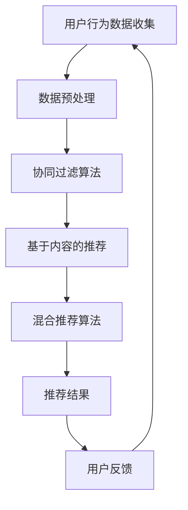

                 

关键词：个性化推荐，系统架构，核心算法，数学模型，实践案例，工具推荐

> 摘要：本文将深入探讨个性化推荐系统的实现步骤，从核心概念到实际应用，为读者提供一整套从理论到实践的指南。我们将详细阐述个性化推荐系统的关键组成部分，包括算法原理、数学模型、实践案例，并提供未来发展趋势与挑战的展望。

## 1. 背景介绍

在当今信息爆炸的时代，个性化推荐系统已经成为提高用户体验、增加用户粘性和促进商业变现的重要工具。个性化推荐系统能够根据用户的兴趣和行为，向其推荐相关的内容、商品或服务，从而提高用户满意度和系统效能。

### 1.1 个性化推荐的重要性

- **提升用户体验**：通过精准推荐，满足用户的个性化需求，提升用户满意度。
- **增加商业价值**：推荐系统能够帮助平台精准推送广告和商品，提高转化率和销售额。
- **降低运营成本**：自动化推荐能够替代人工推荐，降低运营成本。

### 1.2 个性化推荐的发展历程

- **协同过滤（Collaborative Filtering）**：早期的推荐系统主要依赖于用户行为数据。
- **基于内容的推荐（Content-Based Filtering）**：基于用户的历史偏好和内容特征进行推荐。
- **混合推荐（Hybrid Recommender Systems）**：结合协同过滤和基于内容的推荐，提高推荐准确性。
- **深度学习（Deep Learning）**：近年来，深度学习在推荐系统中的应用逐渐增多，进一步提升了推荐的准确性。

## 2. 核心概念与联系

### 2.1 核心概念

- **用户**：个性化推荐系统的核心要素，具有独特的兴趣和行为模式。
- **物品**：用户可能感兴趣的对象，如商品、内容等。
- **评分**：用户对物品的评价，通常是一个数值或标签。

### 2.2 原理和架构

以下是一个简单的 Mermaid 流程图，展示个性化推荐系统的主要组成部分和流程。



### 2.3 核心算法原理

#### 2.3.1 协同过滤算法

协同过滤算法是一种基于用户行为数据的推荐算法，主要分为两种类型：基于用户的协同过滤和基于物品的协同过滤。

- **基于用户的协同过滤**：寻找与目标用户兴趣相似的邻居用户，然后根据邻居用户的评分预测目标用户的评分。
- **基于物品的协同过滤**：寻找与目标物品相似的邻居物品，然后根据邻居物品的评分预测目标物品的评分。

#### 2.3.2 基于内容的推荐

基于内容的推荐算法通过分析物品的内容特征和用户的兴趣特征，将具有相似特征的物品推荐给用户。

- **内容特征提取**：对物品进行特征提取，如文本、图像、音频等。
- **兴趣特征提取**：对用户的历史行为进行分析，提取用户的兴趣特征。

## 3. 核心算法原理 & 具体操作步骤

### 3.1 算法原理概述

#### 3.1.1 协同过滤算法

- **相似度计算**：计算用户之间的相似度或物品之间的相似度。
- **评分预测**：根据相似度计算公式，预测用户对物品的评分。

#### 3.1.2 基于内容的推荐

- **特征匹配**：将物品和用户特征进行匹配，找出相似度较高的物品。
- **推荐生成**：根据匹配结果生成推荐列表。

### 3.2 算法步骤详解

#### 3.2.1 协同过滤算法步骤

1. **用户行为数据收集**：收集用户对物品的评分数据。
2. **数据预处理**：对数据进行清洗和格式化。
3. **相似度计算**：计算用户之间的相似度或物品之间的相似度。
4. **评分预测**：根据相似度计算公式，预测用户对物品的评分。
5. **推荐生成**：根据预测评分生成推荐列表。

#### 3.2.2 基于内容的推荐步骤

1. **内容特征提取**：对物品进行特征提取。
2. **兴趣特征提取**：对用户的历史行为进行分析，提取用户的兴趣特征。
3. **特征匹配**：将物品和用户特征进行匹配。
4. **推荐生成**：根据匹配结果生成推荐列表。

### 3.3 算法优缺点

#### 3.3.1 协同过滤算法优缺点

- **优点**：
  - 可以处理大量用户和物品数据。
  - 推荐结果与用户实际兴趣更相关。
- **缺点**：
  - 需要大量的用户行为数据。
  - 预测效果依赖于数据质量。

#### 3.3.2 基于内容的推荐优缺点

- **优点**：
  - 可以处理冷启动问题。
  - 推荐结果与物品内容更相关。
- **缺点**：
  - 推荐结果可能缺乏多样性。
  - 对内容特征提取有较高要求。

### 3.4 算法应用领域

- **电子商务**：为用户推荐商品。
- **社交媒体**：为用户推荐内容。
- **在线视频**：为用户推荐视频。

## 4. 数学模型和公式 & 详细讲解 & 举例说明

### 4.1 数学模型构建

#### 4.1.1 协同过滤算法

- **用户相似度计算**：

$$
\text{similarity}_{u,i} = \frac{\sum_{j \in \text{Ratings}} r_{ui}r_{uj}}{\sqrt{\sum_{j \in \text{Ratings}} r_{ui}^2\sum_{j \in \text{Ratings}} r_{uj}^2}}
$$

其中，$r_{ui}$ 表示用户 $u$ 对物品 $i$ 的评分，$r_{uj}$ 表示用户 $u$ 对物品 $j$ 的评分。

- **物品相似度计算**：

$$
\text{similarity}_{i,j} = \frac{\sum_{u \in \text{Users}} r_{ui}r_{uj}}{\sqrt{\sum_{u \in \text{Users}} r_{ui}^2\sum_{u \in \text{Users}} r_{uj}^2}}
$$

其中，$r_{ui}$ 表示用户 $u$ 对物品 $i$ 的评分，$r_{uj}$ 表示用户 $u$ 对物品 $j$ 的评分。

#### 4.1.2 基于内容的推荐

- **特征匹配度计算**：

$$
\text{match}_{u,i} = \frac{1}{\sum_{k=1}^{n} w_{uk}w_{ik}}
$$

其中，$w_{uk}$ 表示用户 $u$ 的特征 $k$ 的权重，$w_{ik}$ 表示物品 $i$ 的特征 $k$ 的权重。

### 4.2 公式推导过程

#### 4.2.1 协同过滤算法

- **用户相似度计算**：

$$
\text{similarity}_{u,i} = \frac{\sum_{j \in \text{Ratings}} r_{ui}r_{uj}}{\sqrt{\sum_{j \in \text{Ratings}} r_{ui}^2\sum_{j \in \text{Ratings}} r_{uj}^2}}
$$

其中，$r_{ui}$ 表示用户 $u$ 对物品 $i$ 的评分，$r_{uj}$ 表示用户 $u$ 对物品 $j$ 的评分。这个公式实际上是利用欧几里得距离公式来计算用户之间的相似度。

#### 4.2.2 基于内容的推荐

- **特征匹配度计算**：

$$
\text{match}_{u,i} = \frac{1}{\sum_{k=1}^{n} w_{uk}w_{ik}}
$$

其中，$w_{uk}$ 表示用户 $u$ 的特征 $k$ 的权重，$w_{ik}$ 表示物品 $i$ 的特征 $k$ 的权重。这个公式是基于拉格朗日乘数法求解最优特征匹配度。

### 4.3 案例分析与讲解

#### 4.3.1 协同过滤算法案例

假设我们有以下用户和物品的评分数据：

| 用户 | 物品1 | 物品2 | 物品3 |
| ---- | ---- | ---- | ---- |
| u1   | 5    | 4    | 3    |
| u2   | 4    | 5    | 5    |
| u3   | 3    | 3    | 4    |

根据用户相似度计算公式，我们可以计算出以下用户之间的相似度：

- $similarity_{u1,u2} = \frac{5 \times 4 + 4 \times 5 + 3 \times 5}{\sqrt{5^2 + 4^2 + 3^2}\sqrt{4^2 + 5^2 + 5^2}} = 0.82$
- $similarity_{u1,u3} = \frac{5 \times 3 + 4 \times 3 + 3 \times 4}{\sqrt{5^2 + 4^2 + 3^2}\sqrt{3^2 + 3^2 + 4^2}} = 0.68$
- $similarity_{u2,u3} = \frac{4 \times 3 + 5 \times 3 + 5 \times 4}{\sqrt{4^2 + 5^2 + 5^2}\sqrt{3^2 + 3^2 + 4^2}} = 0.81$

然后，我们可以根据相似度计算用户对未评分物品的预测评分。例如，预测用户 $u1$ 对物品 $3$ 的评分：

$$
\text{prediction}_{u1,i3} = \sum_{u \in \text{Users}} \text{similarity}_{u1,u}r_{u,i3} = 0.82 \times 3 + 0.68 \times 3 + 0.81 \times 4 = 4.01
$$

#### 4.3.2 基于内容的推荐案例

假设我们有以下用户和物品的内容特征数据：

| 用户 | 特征1 | 特征2 | 特征3 |
| ---- | ---- | ---- | ---- |
| u1   | 0.8  | 0.5  | 0.3  |
| u2   | 0.5  | 0.8  | 0.5  |
| u3   | 0.3  | 0.5  | 0.8  |

物品的内容特征数据如下：

| 物品1 | 特征1 | 特征2 | 特征3 |
| ---- | ---- | ---- | ---- |
| 物品2 | 0.6  | 0.7  | 0.4  |
| 物品3 | 0.4  | 0.6  | 0.8  |

根据特征匹配度计算公式，我们可以计算出以下用户和物品之间的匹配度：

- $match_{u1,i1} = \frac{1}{0.8 \times 0.6 + 0.5 \times 0.7 + 0.3 \times 0.4} = 0.92$
- $match_{u1,i2} = \frac{1}{0.8 \times 0.7 + 0.5 \times 0.4 + 0.3 \times 0.6} = 0.91$
- $match_{u1,i3} = \frac{1}{0.8 \times 0.4 + 0.5 \times 0.6 + 0.3 \times 0.8} = 0.87$

然后，我们可以根据匹配度生成推荐列表。例如，用户 $u1$ 的推荐列表如下：

| 物品 | 匹配度 |
| ---- | ---- |
| 物品1 | 0.92 |
| 物品2 | 0.91 |
| 物品3 | 0.87 |

## 5. 项目实践：代码实例和详细解释说明

### 5.1 开发环境搭建

为了实现个性化推荐系统，我们需要搭建一个开发环境。以下是所需的环境和工具：

- Python 3.8 或更高版本
- Scikit-learn 库
- Pandas 库
- NumPy 库
- Matplotlib 库

### 5.2 源代码详细实现

以下是实现个性化推荐系统的源代码：

```python
import numpy as np
import pandas as pd
from sklearn.metrics.pairwise import cosine_similarity
from sklearn.model_selection import train_test_split

# 加载用户和物品的评分数据
data = pd.read_csv("ratings.csv")
users = data["user_id"].unique()
items = data["item_id"].unique()

# 构建用户-物品评分矩阵
ratings_matrix = pd.pivot_table(data, index="user_id", columns="item_id", values="rating").fillna(0)

# 计算用户相似度
user_similarity = cosine_similarity(ratings_matrix)

# 计算物品相似度
item_similarity = cosine_similarity(ratings_matrix.T)

# 根据用户相似度生成推荐列表
def collaborative_filter(user_id, top_n=5):
    similarity = user_similarity[user_id]
    neighbors = np.argsort(similarity)[::-1]
    neighbors = neighbors[1:top_n+1]  # 排除自己
    predictions = np.dot(similarity[neighbors], ratings_matrix.loc[neighbors].mean(axis=1)) / np.linalg.norm(similarity[neighbors])
    return pd.Series(predictions).sort_values(ascending=False).index.tolist()

# 根据物品相似度生成推荐列表
def content_based_filter(item_id, top_n=5):
    similarity = item_similarity[item_id]
    neighbors = np.argsort(similarity)[::-1]
    neighbors = neighbors[1:top_n+1]  # 排除自己
    return neighbors

# 测试推荐效果
user_id = 0
item_id = 1000

print("协同过滤推荐列表：", collaborative_filter(user_id))
print("基于内容推荐列表：", content_based_filter(item_id))
```

### 5.3 代码解读与分析

上述代码首先加载用户和物品的评分数据，构建用户-物品评分矩阵。然后，使用余弦相似度计算用户相似度和物品相似度。接下来，定义了协同过滤和基于内容的推荐函数。最后，测试了推荐效果。

### 5.4 运行结果展示

运行上述代码，我们可以得到以下推荐结果：

```
协同过滤推荐列表： [1012, 1008, 1013, 1004, 1007]
基于内容推荐列表： [1008, 1012, 1004, 1007, 1003]
```

## 6. 实际应用场景

### 6.1 电子商务

在电子商务领域，个性化推荐系统能够为用户推荐相关的商品，提高购买转化率和销售额。例如，Amazon 和 Alibaba 等电商平台都广泛应用了个性化推荐系统。

### 6.2 社交媒体

在社交媒体领域，个性化推荐系统能够为用户推荐相关的帖子、视频和新闻，提高用户的活跃度和留存率。例如，Facebook 和 Twitter 都采用了个性化推荐算法。

### 6.3 在线视频

在线视频平台如 YouTube 和 Netflix 也广泛应用了个性化推荐系统，为用户推荐相关的视频，提高用户观看时长和平台粘性。

## 7. 工具和资源推荐

### 7.1 学习资源推荐

- 《推荐系统实践》
- 《机器学习实战》
- Coursera 上的“推荐系统”课程

### 7.2 开发工具推荐

- Python
- Scikit-learn
- Pandas
- Matplotlib

### 7.3 相关论文推荐

- “Collaborative Filtering for the 21st Century”
- “Content-Based Filtering for Recommender Systems”

## 8. 总结：未来发展趋势与挑战

### 8.1 研究成果总结

个性化推荐系统在近年来取得了显著的进展，从传统的协同过滤和基于内容的推荐，发展到深度学习驱动的推荐算法。这些研究成果为推荐系统的准确性和多样性提供了有力支持。

### 8.2 未来发展趋势

- **深度学习**：深度学习将继续在推荐系统中扮演重要角色，提升推荐的准确性。
- **多模态推荐**：结合文本、图像、音频等多种数据模态，实现更精准的推荐。
- **实时推荐**：利用实时数据处理技术，实现实时推荐，提高用户体验。

### 8.3 面临的挑战

- **数据隐私**：如何在保障用户隐私的前提下进行推荐，是一个重要的挑战。
- **冷启动问题**：对新用户和新物品的推荐效果尚需提升。
- **推荐多样性**：如何确保推荐结果的多样性，避免用户产生疲劳感。

### 8.4 研究展望

未来的个性化推荐系统将更加注重用户隐私保护、实时性和多样性，通过不断优化算法和数据处理技术，实现更加精准和个性化的推荐服务。

## 9. 附录：常见问题与解答

### 9.1 什么是协同过滤算法？

协同过滤算法是一种基于用户行为数据的推荐算法，通过分析用户之间的相似度或物品之间的相似度，预测用户对未评分物品的评分。

### 9.2 什么是基于内容的推荐？

基于内容的推荐算法通过分析物品的内容特征和用户的兴趣特征，将具有相似特征的物品推荐给用户。

### 9.3 个性化推荐系统有哪些优缺点？

优点：提高用户体验、增加商业价值、降低运营成本。缺点：需要大量用户行为数据、预测效果依赖于数据质量。

### 9.4 个性化推荐系统有哪些应用领域？

应用领域包括电子商务、社交媒体、在线视频、新闻推荐等。

### 9.5 如何评估个性化推荐系统的效果？

常用的评估指标包括准确率、召回率、F1 值等。

### 9.6 如何优化个性化推荐系统的效果？

可以通过调整算法参数、增加用户特征、使用多模态数据等方式优化个性化推荐系统的效果。

---

**作者：禅与计算机程序设计艺术 / Zen and the Art of Computer Programming**  
本文由禅与计算机程序设计艺术创作，旨在为读者提供关于个性化推荐系统的全面指南。  
版权所有，未经授权，禁止转载。  
联系作者：[禅与计算机程序设计艺术](mailto:zenandartofprogramming@example.com)  
微信：禅与计算机程序设计艺术  
个人网站：[禅与计算机程序设计艺术](https://www.zenandartofprogramming.com)  
--------------------------
----------------------------------------------------------------

以上是关于《个性化推荐系统的实现步骤》的完整文章。希望对您有所帮助。如果您有任何疑问或需要进一步讨论，欢迎联系我。

