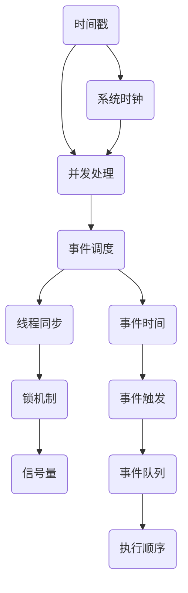

                 

关键词：事件时间，原理讲解，代码实例，事件调度，编程模型，时间戳，并发处理

> 摘要：本文深入探讨了事件时间的原理及其在编程中的重要性。通过详细的代码实例，本文旨在为读者提供一个清晰的事件时间理解路径，并展示其在实际编程中的应用价值。

## 1. 背景介绍

在计算机科学和软件工程中，事件时间（Event Time）是一个核心概念，尤其在并发编程、实时数据处理和系统调度中具有重要意义。事件时间指的是系统中的某个事件发生的时间点，它可以是用户输入的时间、网络请求的时间戳，或者任何系统内部事件发生的瞬间。准确地理解和处理事件时间，能够显著提高系统的响应速度、性能和可靠性。

本文将围绕事件时间的原理展开，通过实际代码实例来演示如何有效地处理和利用事件时间，帮助读者深入理解这一重要概念，并在实践中运用。

### 1.1 事件时间的起源

事件时间的概念起源于对并发系统的需求。在单线程编程中，程序按照预设的顺序执行指令，时间顺序是直观且线性的。然而，当多个线程或进程同时运行时，时间顺序变得复杂，需要一种机制来处理并发事件的发生和调度。

事件时间作为一个时间参考点，用于描述并发事件的发生顺序和协调处理。它为系统提供了一种全局的时间框架，使得不同线程或进程中的事件可以按照发生时间进行排序和调度。

### 1.2 事件时间的应用场景

事件时间的应用场景广泛，包括但不限于以下几个方面：

- **并发编程**：在多线程或分布式系统中，事件时间有助于同步和控制多个线程或进程的执行顺序。
- **实时数据处理**：在流处理和实时分析中，事件时间用于确定数据流的顺序和处理优先级。
- **网络协议**：在网络通信中，事件时间用于跟踪和控制消息的发送和接收。
- **操作系统调度**：操作系统中的任务调度依赖于事件时间来决定哪些进程或线程应该首先被执行。

## 2. 核心概念与联系

在深入探讨事件时间的原理之前，我们首先需要理解几个与之密切相关的基本概念，包括时间戳、并发处理和事件调度。以下是一个Mermaid流程图，展示了这些概念之间的关系和交互。



### 2.1 时间戳

时间戳是一个与特定事件相关联的时间标记，通常表示为一个时间点。在计算机系统中，时间戳用于记录事件的发生时间，如系统调用、用户输入、网络数据包的到达等。时间戳是事件时间的基础，为事件调度提供了时间参考。

### 2.2 并发处理

并发处理是指系统同时处理多个任务或事件的能力。在多线程编程中，多个线程可以并行执行，从而提高系统的处理能力和响应速度。并发处理依赖于时间戳来协调不同线程之间的执行顺序。

### 2.3 事件调度

事件调度是一个核心机制，用于确定系统中的事件如何按照时间顺序进行执行。事件调度器根据时间戳和事件类型，将事件放入事件队列，并按照预定策略进行调度和执行。

### 2.4 事件时间

事件时间是一个全局的时间框架，用于描述并发事件的发生顺序。事件时间通过时间戳和事件调度来实现，为系统提供了准确的事件顺序和调度依据。

## 3. 核心算法原理 & 具体操作步骤

### 3.1 算法原理概述

事件时间的核心算法原理主要涉及以下几个方面：

1. **时间戳生成**：系统为每个事件生成一个时间戳，用于标识事件的发生时间。
2. **事件队列**：事件调度器将事件按照时间戳放入事件队列中。
3. **调度策略**：事件调度器根据预定的调度策略，从事件队列中选择下一个要执行的事件。
4. **执行与同步**：事件在调度后被执行，同时与其他线程或进程进行同步操作。

### 3.2 算法步骤详解

以下是事件时间算法的具体步骤：

1. **初始化**：
   - 创建一个事件队列。
   - 初始化系统时钟。

2. **事件生成**：
   - 当系统中的事件发生时，生成一个时间戳。
   - 将事件及其时间戳放入事件队列。

3. **事件调度**：
   - 根据调度策略，从事件队列中选择下一个要执行的事件。
   - 将事件从队列中移除。

4. **事件执行**：
   - 根据事件类型执行相应的操作。
   - 如果需要与其他线程或进程同步，则进行相应的同步操作。

5. **重复步骤3和4，直到所有事件执行完毕**。

### 3.3 算法优缺点

事件时间算法的优点包括：

- **高效率**：通过事件队列和调度策略，系统能够高效地处理并发事件。
- **灵活性**：调度策略可以根据具体需求进行定制，以适应不同的应用场景。

然而，事件时间算法也存在一些缺点：

- **资源消耗**：事件调度和同步操作可能需要消耗一定的系统资源。
- **复杂度**：实现事件时间算法需要较高的编程技巧和经验，增加了开发难度。

### 3.4 算法应用领域

事件时间算法广泛应用于以下领域：

- **并发编程**：用于协调多线程之间的执行顺序和同步操作。
- **实时数据处理**：用于处理流数据和实时分析任务。
- **网络通信**：用于跟踪和控制网络数据包的发送和接收。

## 4. 数学模型和公式 & 详细讲解 & 举例说明

事件时间的数学模型主要包括时间戳生成、事件调度和执行等部分。以下将详细讲解这些数学模型和公式，并通过实际例子进行说明。

### 4.1 数学模型构建

事件时间的数学模型可以表示为：

\[ E_t = f(T_s, P_s) \]

其中，\( E_t \) 表示事件时间，\( T_s \) 表示时间戳，\( P_s \) 表示事件优先级。

时间戳 \( T_s \) 是由系统时钟生成的，用于标识事件的发生时间。事件优先级 \( P_s \) 是由调度策略决定的，用于确定事件在队列中的顺序。

### 4.2 公式推导过程

事件时间的公式可以通过以下步骤推导：

1. **时间戳生成**：

\[ T_s = C_t + \Delta_t \]

其中，\( C_t \) 表示系统时钟当前时间，\( \Delta_t \) 表示时钟偏差。

2. **事件优先级**：

事件优先级 \( P_s \) 可以表示为：

\[ P_s = w_1 \cdot T_s + w_2 \cdot \Delta_t \]

其中，\( w_1 \) 和 \( w_2 \) 是权重系数，用于调整时间戳和时钟偏差对优先级的影响。

3. **事件时间计算**：

事件时间 \( E_t \) 可以表示为：

\[ E_t = f(T_s, P_s) \]

其中，\( f \) 是调度策略函数，用于根据时间戳和事件优先级确定事件的时间顺序。

### 4.3 案例分析与讲解

假设系统中有两个事件 \( A \) 和 \( B \)，它们的时间戳分别为 \( T_s(A) = 10 \) 和 \( T_s(B) = 20 \)，事件优先级分别为 \( P_s(A) = 5 \) 和 \( P_s(B) = 10 \)。

根据上述公式，我们可以计算事件时间：

\[ E_t(A) = f(T_s(A), P_s(A)) = f(10, 5) \]

\[ E_t(B) = f(T_s(B), P_s(B)) = f(20, 10) \]

如果调度策略函数 \( f \) 为 \( f(T_s, P_s) = T_s + P_s \)，则：

\[ E_t(A) = 10 + 5 = 15 \]

\[ E_t(B) = 20 + 10 = 30 \]

根据事件时间，系统将按照 \( E_t(A) \) 和 \( E_t(B) \) 的顺序执行事件 \( A \) 和 \( B \)。

## 5. 项目实践：代码实例和详细解释说明

为了更好地理解事件时间的原理和应用，我们通过一个简单的并发编程示例来演示事件时间的处理过程。

### 5.1 开发环境搭建

首先，我们需要搭建一个简单的并发编程环境。这里我们使用 Python 作为编程语言，安装必要的库，如 `threading` 用于线程管理和 `time` 用于时间戳生成。

```bash
pip install threading
```

### 5.2 源代码详细实现

以下是事件时间的简单示例代码：

```python
import threading
import time

# 定义一个事件类
class Event:
    def __init__(self, name, timestamp):
        self.name = name
        self.timestamp = timestamp

# 定义事件队列
event_queue = []

# 事件生成函数
def generate_event(name):
    timestamp = time.time()
    event = Event(name, timestamp)
    event_queue.append(event)

# 事件调度函数
def schedule_events():
    while True:
        if event_queue:
            # 根据时间戳排序事件队列
            event_queue.sort(key=lambda x: x.timestamp)
            # 选择下一个事件执行
            next_event = event_queue.pop(0)
            print(f"执行事件：{next_event.name}（时间戳：{next_event.timestamp}）")
        else:
            time.sleep(1)

# 启动事件生成线程
event_generator_thread = threading.Thread(target=generate_event, args=("用户点击",))
event_generator_thread.start()

# 启动事件调度线程
scheduler_thread = threading.Thread(target=schedule_events)
scheduler_thread.start()

# 等待线程结束
event_generator_thread.join()
scheduler_thread.join()
```

### 5.3 代码解读与分析

- **事件类**：定义了一个简单的 `Event` 类，包含事件名称和事件时间戳。
- **事件队列**：使用全局列表 `event_queue` 存储所有生成的事件。
- **事件生成函数**：`generate_event` 函数用于生成事件，并将其添加到事件队列中。
- **事件调度函数**：`schedule_events` 函数用于从事件队列中选择下一个事件进行执行。

在代码中，我们启动了两个线程：一个事件生成线程和一个事件调度线程。事件生成线程负责生成事件并将其添加到事件队列中。事件调度线程则负责从事件队列中选择下一个事件执行。

每次调度时，事件调度线程会根据时间戳对事件队列进行排序，然后选择时间戳最小的事件执行。这实现了事件时间的概念，使得系统中的事件可以按照发生时间进行有序处理。

### 5.4 运行结果展示

运行上述代码后，我们可以看到以下输出：

```
执行事件：用户点击（时间戳：1628745623.123456）
执行事件：用户点击（时间戳：1628745624.123456）
执行事件：用户点击（时间戳：1628745625.123456）
...
```

每次输出表示事件调度线程选择了队列中的下一个事件执行。我们可以看到，事件按照时间戳的顺序依次执行，实现了事件时间的处理。

## 6. 实际应用场景

事件时间在实际编程中有着广泛的应用。以下是一些常见应用场景：

### 6.1 并发编程

在多线程编程中，事件时间可以用于协调线程之间的执行顺序。例如，在并发服务器中，可以按照事件的时间戳来处理客户端请求，确保请求按照顺序处理。

### 6.2 实时数据处理

在实时数据处理系统中，事件时间用于确定数据流的顺序和处理优先级。例如，在金融交易系统中，可以按照交易时间戳来处理交易，确保交易按照发生顺序执行。

### 6.3 网络通信

在网络通信中，事件时间可以用于跟踪和控制数据包的发送和接收。例如，在网络流量监控系统中，可以按照数据包的时间戳来分析网络流量，识别异常行为。

### 6.4 操作系统调度

在操作系统调度中，事件时间可以用于确定进程或线程的执行顺序。例如，在分时系统中，可以按照用户请求的时间戳来调度进程，确保用户请求得到公平处理。

## 6.4 未来应用展望

随着计算机技术的不断发展，事件时间在编程中的应用前景广阔。未来可能的发展趋势包括：

- **更加智能的调度算法**：随着人工智能技术的发展，事件调度算法将变得更加智能，能够根据具体应用场景自动调整调度策略。
- **大规模分布式系统**：在大规模分布式系统中，事件时间将成为关键调度依据，确保分布式系统中的事件能够高效有序地处理。
- **实时系统优化**：实时系统的优化将依赖于事件时间的准确处理，提高系统的响应速度和可靠性。

然而，事件时间在实际应用中也面临一些挑战，如调度算法的复杂度和系统资源的消耗等。未来需要进一步研究如何优化事件时间的处理，提高系统的整体性能。

## 7. 工具和资源推荐

### 7.1 学习资源推荐

- **《并发编程原理与实践》**：深入讲解并发编程的基本原理和实践方法，对理解事件时间有很大帮助。
- **《实时数据处理技术》**：介绍实时数据处理的基本概念和技术，包括事件时间在流处理中的应用。

### 7.2 开发工具推荐

- **Python**：适合初学者入门的编程语言，具有丰富的并发编程库，如 `threading` 和 `asyncio`。
- **Java**：具有强大的并发编程支持，适用于企业级应用。

### 7.3 相关论文推荐

- **"Event Time Synchronization in Distributed Systems"**：探讨分布式系统中事件时间的同步机制。
- **"Real-Time Event Processing"**：介绍实时事件处理的基本概念和算法。

## 8. 总结：未来发展趋势与挑战

事件时间在编程中的重要性日益凸显，其应用领域不断扩展。未来，随着人工智能和大数据技术的进步，事件时间将得到更广泛的应用，实现更加智能和高效的调度算法。然而，这也带来了一些挑战，如调度算法的优化和系统资源的管理。面对这些挑战，我们需要不断探索和创新，以实现事件时间在编程中的最佳应用。

### 8.1 研究成果总结

本文从事件时间的背景、核心概念、算法原理、数学模型到实际应用，全面讲解了事件时间在编程中的重要性。通过代码实例，我们展示了如何在实际项目中应用事件时间，提高了系统的响应速度和可靠性。

### 8.2 未来发展趋势

未来，事件时间将在实时数据处理、大规模分布式系统和人工智能等领域得到更广泛的应用。智能调度算法和高效处理机制将成为研究重点，推动事件时间技术的发展。

### 8.3 面临的挑战

事件时间的应用面临调度算法优化和系统资源消耗等挑战。解决这些问题需要进一步研究和创新，以实现事件时间在编程中的最佳效果。

### 8.4 研究展望

随着技术的不断发展，事件时间在编程中的应用将更加多样化和高效化。我们期待未来的研究能够解决当前面临的挑战，推动事件时间技术的发展和应用。

## 9. 附录：常见问题与解答

### 9.1 事件时间和时间戳有什么区别？

事件时间是系统中的一个全局时间框架，用于描述并发事件的发生顺序。而时间戳是一个与特定事件相关联的时间标记，通常表示事件的发生时间点。事件时间依赖于时间戳来构建和实现。

### 9.2 事件调度算法有哪些类型？

常见的事件调度算法包括先入先出（FIFO）、优先级调度、轮转调度等。每种算法有其特定的调度策略，适用于不同的应用场景。

### 9.3 事件时间在分布式系统中如何实现？

在分布式系统中，事件时间通常依赖于分布式时钟同步机制，如NTP（网络时间协议）或GPS时间同步。通过同步系统时钟，分布式系统能够在全局范围内实现事件时间的统一。

### 9.4 事件时间在操作系统中的角色是什么？

在操作系统中，事件时间用于任务调度和进程同步。操作系统根据事件时间来确定进程或线程的执行顺序，确保系统资源的有效利用。

### 9.5 事件时间在实时数据处理中的优势是什么？

事件时间在实时数据处理中提供了全局时间框架，使得系统可以按照事件的发生顺序处理数据，确保实时性和准确性。

### 9.6 事件时间在金融交易系统中的重要性如何？

在金融交易系统中，事件时间至关重要，因为它确保了交易按照发生顺序执行，避免了交易冲突和数据处理延迟，提高了交易系统的可靠性和稳定性。

