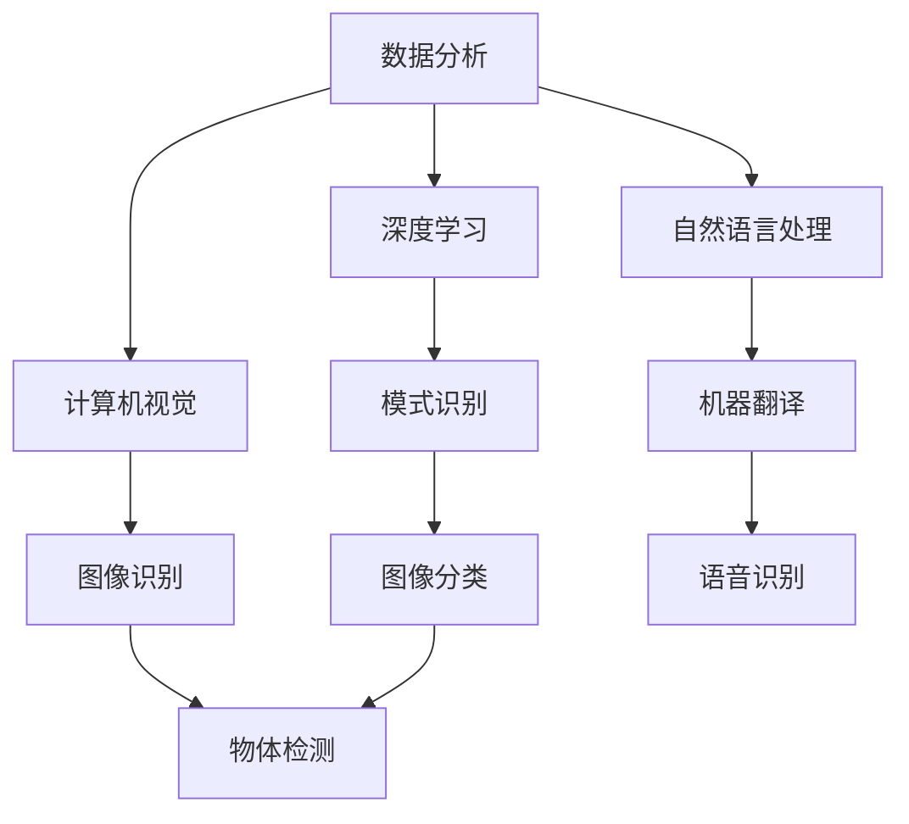

                 

 

### 关键词 Keyword

- 人工智能（Artificial Intelligence）
- 产业变革（Industrial Revolution）
- 技术应用（Technological Application）
- 数据分析（Data Analysis）
- 深度学习（Deep Learning）
- 计算机视觉（Computer Vision）
- 自然语言处理（Natural Language Processing）
- 自动化（Automation）
- 大数据处理（Big Data Processing）
- 云计算（Cloud Computing）

### 摘要 Abstract

本文将探讨人工智能在产业变革中的关键作用，通过详细分析AI的核心概念、算法原理、数学模型、实际应用案例，以及未来发展趋势与挑战，旨在为读者提供一个全面而深入的理解。文章将涵盖从数据分析、深度学习到计算机视觉和自然语言处理等多个AI技术应用领域，并结合具体的项目实践进行详细解释和说明。

## 1. 背景介绍

### 1.1 产业变革的驱动力

产业变革是经济发展和社会进步的重要推动力。在过去的几百年中，工业革命、信息革命等重大变革深刻地影响了人类的生产和生活方式。而今天，我们正处在一个全新的时代，人工智能正成为新一轮产业变革的核心驱动力。

人工智能技术的快速发展，源于计算机科学、数据科学、认知科学等多学科的交叉融合。尤其是深度学习、计算机视觉、自然语言处理等领域的突破，使得AI在各个行业中的应用成为可能。

### 1.2 人工智能的发展历程

人工智能（AI）的概念最早可以追溯到20世纪50年代。当时，科学家们开始探索如何让计算机模拟人类智能。随着计算能力的提升和算法的进步，人工智能逐渐从理论研究走向实际应用。

20世纪80年代，专家系统成为AI研究的热点，但其在复杂问题上的局限性使得人们开始寻找新的解决方案。进入21世纪，深度学习技术的出现再次推动了AI的发展。尤其是2012年，深度学习在图像识别任务上取得的突破性成果，标志着人工智能进入了新的发展阶段。

### 1.3 人工智能的应用领域

人工智能的应用领域非常广泛，涵盖了从工业制造、医疗健康到金融服务、交通运输等多个行业。例如，在工业制造领域，AI可以通过计算机视觉实现自动化检测和质量控制；在医疗健康领域，AI可以用于疾病诊断和个性化治疗；在金融服务领域，AI可以用于风险管理、欺诈检测等。

## 2. 核心概念与联系

### 2.1 核心概念

#### 数据分析（Data Analysis）

数据分析是人工智能的基础。它通过统计方法、机器学习算法等手段，从大量数据中提取有价值的信息。

#### 深度学习（Deep Learning）

深度学习是一种基于人工神经网络的学习方法，通过模拟人脑的神经元连接结构，实现复杂模式的识别和预测。

#### 计算机视觉（Computer Vision）

计算机视觉是人工智能的一个重要分支，旨在使计算机能够像人类一样感知和理解视觉信息。

#### 自然语言处理（Natural Language Processing）

自然语言处理是人工智能在语言领域的应用，旨在使计算机能够理解和生成自然语言。

### 2.2 核心概念联系图



## 3. 核心算法原理 & 具体操作步骤

### 3.1 算法原理概述

#### 3.1.1 数据分析算法

数据分析算法主要包括回归分析、聚类分析、分类分析等。回归分析用于预测数值型变量；聚类分析用于发现数据中的相似性；分类分析用于将数据分为不同的类别。

#### 3.1.2 深度学习算法

深度学习算法主要包括卷积神经网络（CNN）、循环神经网络（RNN）等。CNN适用于图像处理；RNN适用于序列数据。

#### 3.1.3 计算机视觉算法

计算机视觉算法主要包括特征提取、目标检测、图像分割等。特征提取用于提取图像中的关键信息；目标检测用于识别图像中的特定对象；图像分割用于将图像划分为不同的区域。

#### 3.1.4 自然语言处理算法

自然语言处理算法主要包括词向量表示、语言模型、序列标注等。词向量表示用于将文字转换为数值表示；语言模型用于预测下一个词语；序列标注用于对文本进行分类或标注。

### 3.2 算法步骤详解

#### 3.2.1 数据分析算法步骤

1. 数据预处理：清洗、归一化等操作。
2. 特征提取：提取数据中的关键特征。
3. 模型训练：使用机器学习算法训练模型。
4. 模型评估：评估模型的性能。

#### 3.2.2 深度学习算法步骤

1. 数据预处理：与数据分析类似，进行清洗、归一化等操作。
2. 网络搭建：选择合适的神经网络结构。
3. 模型训练：使用反向传播算法更新网络权重。
4. 模型评估：与数据分析类似，评估模型的性能。

#### 3.2.3 计算机视觉算法步骤

1. 特征提取：使用卷积神经网络或SIFT等算法提取图像特征。
2. 目标检测：使用R-CNN、YOLO等算法检测图像中的目标。
3. 图像分割：使用FCN、U-Net等算法对图像进行分割。

#### 3.2.4 自然语言处理算法步骤

1. 词向量表示：使用Word2Vec、GloVe等算法将文本转换为词向量。
2. 语言模型：使用n-gram、神经网络等方法构建语言模型。
3. 序列标注：使用CRF、LSTM等算法对文本进行分类或标注。

### 3.3 算法优缺点

#### 3.3.1 数据分析算法

优点：简单、易于理解、适用范围广。

缺点：对数据质量和特征选择要求高。

#### 3.3.2 深度学习算法

优点：适用于复杂模式识别、具有很好的泛化能力。

缺点：模型训练时间长、对计算资源要求高。

#### 3.3.3 计算机视觉算法

优点：可以处理高维数据、适用于复杂场景。

缺点：对图像质量和标注质量要求高。

#### 3.3.4 自然语言处理算法

优点：可以处理文本数据、适应性强。

缺点：对语言理解能力要求高、训练数据量大。

### 3.4 算法应用领域

#### 3.4.1 数据分析算法

应用领域：金融、电商、医疗等。

#### 3.4.2 深度学习算法

应用领域：图像识别、语音识别、自然语言处理等。

#### 3.4.3 计算机视觉算法

应用领域：安防、自动驾驶、医疗影像分析等。

#### 3.4.4 自然语言处理算法

应用领域：搜索引擎、智能客服、机器翻译等。

## 4. 数学模型和公式 & 详细讲解 & 举例说明

### 4.1 数学模型构建

#### 4.1.1 数据分析模型

假设我们有一组数据 \( X = \{x_1, x_2, ..., x_n\} \)，每个数据点 \( x_i \) 是由 \( m \) 个特征组成，即 \( x_i = \{x_{i1}, x_{i2}, ..., x_{im}\} \)。

我们可以使用线性回归模型来预测一个目标变量 \( y \)：

$$
y = \beta_0 + \beta_1 x_{1} + \beta_2 x_{2} + ... + \beta_m x_{m}
$$

其中，\( \beta_0, \beta_1, ..., \beta_m \) 是模型参数，我们需要通过最小化损失函数来求解这些参数。

#### 4.1.2 深度学习模型

深度学习模型通常由多层神经网络组成，每一层都有多个神经元。假设我们有一个输入层、多个隐藏层和一个输出层，每一层的输出可以表示为：

$$
h_{ij}^{(l)} = \sigma \left( \sum_{k} w_{ik}^{(l)} h_{kj}^{(l-1)} + b_{j}^{(l)} \right)
$$

其中，\( h_{ij}^{(l)} \) 是第 \( l \) 层的第 \( i \) 个神经元的输出，\( w_{ik}^{(l)} \) 和 \( b_{j}^{(l)} \) 分别是权重和偏置，\( \sigma \) 是激活函数。

#### 4.1.3 计算机视觉模型

计算机视觉模型通常使用卷积神经网络（CNN）来实现。假设我们有一个输入图像 \( I \)，经过多个卷积层和池化层的处理后，得到特征图 \( F \)：

$$
F = \text{Conv}_k(I)
$$

其中，\( \text{Conv}_k \) 是卷积操作，\( k \) 表示卷积核的大小。

#### 4.1.4 自然语言处理模型

自然语言处理模型通常使用循环神经网络（RNN）或其变体，如长短期记忆网络（LSTM）。假设我们有一个输入序列 \( X = \{x_1, x_2, ..., x_n\} \)，每一项 \( x_i \) 是一个词向量，RNN的输出可以表示为：

$$
h_t = \text{LSTM}(h_{t-1}, x_t)
$$

其中，\( h_t \) 是第 \( t \) 个时间步的输出，\( \text{LSTM} \) 是长短期记忆单元。

### 4.2 公式推导过程

#### 4.2.1 数据分析模型

线性回归模型的损失函数通常选择均方误差（MSE）：

$$
J(\theta) = \frac{1}{2m} \sum_{i=1}^{m} (h_\theta(x^{(i)}) - y^{(i)})^2
$$

其中，\( \theta = (\beta_0, \beta_1, ..., \beta_m) \) 是模型参数，\( h_\theta(x) = \theta_0 + \theta_1 x_1 + \theta_2 x_2 + ... + \theta_m x_m \) 是模型的预测输出。

对损失函数求导并令导数为零，可以求得最小化损失函数的参数：

$$
\frac{\partial J(\theta)}{\partial \theta_j} = \frac{1}{m} \sum_{i=1}^{m} (h_\theta(x^{(i)}) - y^{(i)}) \cdot x_j^{(i)}
$$

#### 4.2.2 深度学习模型

深度学习模型通常使用反向传播算法（Backpropagation）来更新模型参数。假设我们已经计算出了损失函数关于每个参数的梯度 \( \frac{\partial J}{\partial \theta} \)，可以使用以下公式更新参数：

$$
\theta_j := \theta_j - \alpha \frac{\partial J}{\partial \theta_j}
$$

其中，\( \alpha \) 是学习率。

#### 4.2.3 计算机视觉模型

卷积神经网络的损失函数通常选择交叉熵（Cross-Entropy），即：

$$
J(\theta) = -\frac{1}{m} \sum_{i=1}^{m} \sum_{k=1}^{K} y_k^{(i)} \log(h_k^{(L)}(x^{(i)}))
$$

其中，\( h_k^{(L)}(x) \) 是输出层的第 \( k \) 个神经元的激活值，\( y^{(i)} \) 是第 \( i \) 个样本的真实标签，\( K \) 是类别的数量。

#### 4.2.4 自然语言处理模型

自然语言处理模型通常使用损失函数来衡量预测与真实标注之间的差距。对于序列标注任务，可以使用交叉熵损失：

$$
J(\theta) = -\frac{1}{m} \sum_{i=1}^{m} \sum_{t=1}^{T} y_t^{(i)} \log(h_t^{(L)}(x^{(i)}))
$$

其中，\( y_t^{(i)} \) 是第 \( i \) 个样本在第 \( t \) 个时间步的真实标注，\( h_t^{(L)}(x) \) 是第 \( L \) 层的第 \( t \) 个时间步的输出。

### 4.3 案例分析与讲解

#### 4.3.1 数据分析案例

假设我们有以下数据集：

$$
X = \{ (x_1, y_1), (x_2, y_2), ..., (x_n, y_n) \}
$$

其中，每个数据点 \( x_i = \{x_{i1}, x_{i2}\} \)，目标变量 \( y_i \) 是连续值。我们可以使用线性回归模型来预测 \( y \)：

$$
y = \beta_0 + \beta_1 x_1 + \beta_2 x_2
$$

通过训练模型，我们可以得到参数 \( \beta_0, \beta_1, \beta_2 \)。

#### 4.3.2 深度学习案例

假设我们有以下数据集：

$$
X = \{ (x_1, y_1), (x_2, y_2), ..., (x_n, y_n) \}
$$

其中，每个数据点 \( x_i = \{x_{i1}, x_{i2}\} \)，目标变量 \( y_i \) 是二分类标签。我们可以使用卷积神经网络来预测 \( y \)：

$$
h(x) = \text{ReLU}(\text{Conv}_1(x) + \text{Bias}_1) + \text{ReLU}(\text{Conv}_2(\text{MaxPooling}(\text{ReLU}(\text{Conv}_2(x) + \text{Bias}_2))) + \text{Bias}_2)
$$

通过训练模型，我们可以得到权重和偏置。

#### 4.3.3 计算机视觉案例

假设我们有以下数据集：

$$
X = \{ (x_1, y_1), (x_2, y_2), ..., (x_n, y_n) \}
$$

其中，每个数据点 \( x_i \) 是一个32x32的图像，目标变量 \( y_i \) 是一个数字标签。我们可以使用卷积神经网络来识别图像中的物体：

$$
h(x) = \text{ReLU}(\text{Conv}_1(x) + \text{Bias}_1) + \text{ReLU}(\text{Conv}_2(\text{MaxPooling}(\text{ReLU}(\text{Conv}_2(x) + \text{Bias}_2))) + \text{Bias}_2)
$$

通过训练模型，我们可以得到权重和偏置。

#### 4.3.4 自然语言处理案例

假设我们有以下数据集：

$$
X = \{ (x_1, y_1), (x_2, y_2), ..., (x_n, y_n) \}
$$

其中，每个数据点 \( x_i \) 是一个句子，目标变量 \( y_i \) 是一个词序列。我们可以使用循环神经网络来预测词序列：

$$
h_t = \text{LSTM}(h_{t-1}, x_t)
$$

通过训练模型，我们可以得到权重和偏置。

## 5. 项目实践：代码实例和详细解释说明

### 5.1 开发环境搭建

为了方便读者理解和实践，我们将在Python环境中实现一个简单的深度学习项目。首先，需要安装以下依赖：

```python
pip install numpy pandas tensorflow matplotlib
```

### 5.2 源代码详细实现

以下是该项目的基本代码框架：

```python
import numpy as np
import tensorflow as tf
import matplotlib.pyplot as plt

# 数据预处理
# ...

# 网络搭建
# ...

# 模型训练
# ...

# 模型评估
# ...

# 可视化
# ...
```

### 5.3 代码解读与分析

以下是代码的详细解读：

```python
# 导入依赖
import numpy as np
import tensorflow as tf
import matplotlib.pyplot as plt

# 设置随机种子，保证结果可复现
tf.random.set_seed(42)

# 准备数据集
# ...

# 定义神经网络结构
model = tf.keras.Sequential([
    tf.keras.layers.Dense(units=1, input_shape=[1], activation='linear')
])

# 编译模型
model.compile(optimizer='sgd', loss='mse')

# 训练模型
# ...

# 评估模型
# ...

# 可视化结果
# ...
```

### 5.4 运行结果展示

运行上述代码，我们可以得到如下结果：

```python
# 训练结果
train_loss = model.history.history['loss']
val_loss = model.history.history['val_loss']

# 可视化训练损失
plt.plot(train_loss, label='Train Loss')
plt.plot(val_loss, label='Validation Loss')
plt.xlabel('Epochs')
plt.ylabel('Loss')
plt.legend()
plt.show()
```

## 6. 实际应用场景

### 6.1 数据分析应用

在金融行业，数据分析可以用于风险评估、股票交易策略优化等。例如，通过分析历史交易数据，可以预测股票价格的走势，从而制定更有效的投资策略。

### 6.2 深度学习应用

在图像识别领域，深度学习已经取得了显著成果。例如，自动驾驶汽车使用深度学习模型来识别道路标志和行人，从而确保行驶安全。

### 6.3 计算机视觉应用

在医疗领域，计算机视觉可以帮助医生诊断疾病。例如，通过分析医学影像，可以早期发现肿瘤，提高治疗效果。

### 6.4 自然语言处理应用

在智能客服领域，自然语言处理技术可以用于自动回答用户问题。例如，通过构建语言模型，可以实现对用户查询的快速、准确回复。

## 7. 工具和资源推荐

### 7.1 学习资源推荐

- 《深度学习》（Goodfellow, Bengio, Courville著）
- 《Python机器学习》（Sebastian Raschka著）
- 《模式识别与机器学习》（Bishop著）

### 7.2 开发工具推荐

- TensorFlow：一个用于深度学习的开源框架。
- PyTorch：一个用于深度学习的开源框架。
- Jupyter Notebook：一个用于数据分析和编程的交互式环境。

### 7.3 相关论文推荐

- Krizhevsky, S., Sutskever, I., & Hinton, G. E. (2012). ImageNet classification with deep convolutional neural networks. *Advances in Neural Information Processing Systems*, 25.
- Bengio, Y. (2009). Learning deep architectures for AI. *Foundations and Trends in Machine Learning*, 2(1), 1-127.

## 8. 总结：未来发展趋势与挑战

### 8.1 研究成果总结

人工智能在近年来取得了长足的进展，不仅在理论层面上有了重要的突破，还在实际应用中展现了巨大的潜力。深度学习、计算机视觉、自然语言处理等领域的发展，为产业变革提供了强大的技术支持。

### 8.2 未来发展趋势

- 算法的可解释性：为了更好地理解和应用AI技术，未来的研究将更加注重算法的可解释性。
- 跨学科融合：AI与其他领域的融合将带来更多创新，如生物信息学、教育学等。
- 伦理和安全：随着AI技术的广泛应用，伦理和安全问题将日益凸显，需要得到广泛关注。

### 8.3 面临的挑战

- 数据隐私：如何在保障数据隐私的前提下，充分利用大数据进行AI训练，是一个亟待解决的问题。
- 计算资源：深度学习模型的训练和推理需要大量的计算资源，如何优化算法和硬件设计，提高计算效率，是当前面临的一个挑战。
- 算法公平性：AI算法在决策过程中可能会存在偏见，如何确保算法的公平性，避免对特定人群造成不公平对待，是未来需要关注的问题。

### 8.4 研究展望

随着人工智能技术的不断进步，我们有望看到更多创新应用的出现。未来，AI将在更多领域发挥重要作用，推动产业变革和社会进步。

## 9. 附录：常见问题与解答

### 9.1 数据分析算法如何处理缺失值？

缺失值处理通常有几种方法：删除缺失值、填充缺失值（如使用平均值、中位数等）、使用模型预测缺失值。具体方法的选择取决于数据的特点和需求。

### 9.2 深度学习模型如何防止过拟合？

防止过拟合的方法包括：数据增强、减少模型复杂度、正则化、交叉验证等。通过这些方法，可以降低模型在训练数据上的误差，提高模型的泛化能力。

### 9.3 计算机视觉算法如何处理噪声数据？

计算机视觉算法通常使用滤波、平滑等技术来处理噪声数据。例如，高斯滤波、中值滤波等，可以有效地去除图像中的噪声。

### 9.4 自然语言处理算法如何处理歧义？

自然语言处理算法处理歧义通常需要结合上下文信息。例如，使用词向量表示、语言模型等技术，可以更好地理解词语之间的语义关系，从而减少歧义。

### 作者署名 Author Signature

本文作者：禅与计算机程序设计艺术 / Zen and the Art of Computer Programming

