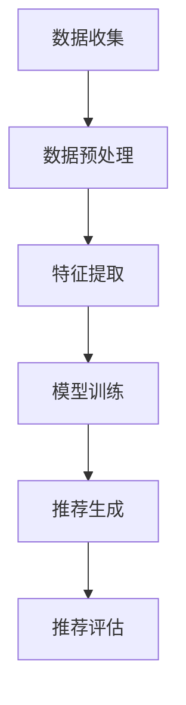

                 

在这个数字化时代，产品开发与创新已成为企业竞争的焦点。随着人工智能技术的飞速发展，AI在产品推荐中的应用日益广泛。本文旨在探讨如何利用AI技术进行新产品推荐，从而推动产品开发与创新。本文将首先介绍AI推荐产品的背景和核心概念，然后详细解释推荐算法原理和数学模型，并展示一个实际的代码实例。最后，我们将探讨AI推荐产品的实际应用场景、未来展望以及面临的挑战。

## 1. 背景介绍

产品推荐系统是现代电子商务和在线服务中不可或缺的一部分。这些系统通过分析用户行为、偏好和历史数据，为用户提供个性化的推荐。传统的推荐系统主要依赖于基于内容的过滤和协同过滤算法，但它们在处理大规模数据和复杂用户偏好时存在一定的局限性。随着人工智能技术的兴起，特别是深度学习算法的快速发展，AI推荐产品成为了一种更加智能和有效的推荐方式。

AI推荐产品的核心在于利用机器学习和深度学习算法，从大量数据中提取有用信息，为用户提供个性化的推荐。这种方式不仅可以提高用户的满意度，还可以帮助企业提升销售额和市场份额。

### 1.1 AI推荐产品的意义

AI推荐产品对于企业和用户都具有重要的意义。

对于企业来说，AI推荐产品可以：

1. 提高销售额：通过个性化推荐，企业可以更准确地满足用户需求，从而提高转化率和销售额。
2. 降低营销成本：传统营销方式往往需要大量的人力和物力投入，而AI推荐产品可以自动化推荐过程，降低营销成本。
3. 提升用户体验：个性化的推荐可以提升用户满意度，增强用户忠诚度。

对于用户来说，AI推荐产品可以：

1. 提高购买效率：用户可以更快地找到自己感兴趣的产品，节省了搜索时间。
2. 拓宽选择范围：AI推荐产品可以推荐用户未知或未曾考虑过的产品，从而拓宽选择范围。
3. 提高生活质量：个性化的推荐可以帮助用户发现更多有趣和有用的产品，提升生活质量。

### 1.2 AI推荐产品的发展历程

AI推荐产品的发展可以分为三个阶段：

1. **基于内容的过滤**：这是最早的推荐系统，它主要依赖于产品特征和用户偏好进行推荐。这种方法在处理静态数据和简单用户偏好时表现良好，但在面对大规模数据和复杂用户偏好时存在局限性。

2. **协同过滤**：协同过滤通过分析用户之间的相似度进行推荐。这种方法在处理大规模数据和复杂用户偏好时表现更佳，但仍然存在冷启动问题（即新用户或新产品的推荐问题）和噪声问题（即推荐结果中的噪声数据）。

3. **基于深度学习的推荐**：随着深度学习技术的发展，基于深度学习的推荐系统逐渐成为一种新的推荐方式。深度学习算法可以从大量数据中自动提取特征，生成更加精准和个性化的推荐。这种方法在处理大规模数据和复杂用户偏好方面具有显著优势。

## 2. 核心概念与联系

### 2.1 相关概念

在讨论AI推荐产品之前，我们首先需要了解一些核心概念：

1. **用户行为数据**：包括用户的浏览记录、购买历史、评价数据等。
2. **产品特征数据**：包括产品的分类、价格、品牌、型号等属性。
3. **推荐算法**：用于生成推荐列表的算法，如基于内容的过滤、协同过滤、深度学习等。
4. **用户偏好**：用户对产品和服务的喜好程度，可以通过行为数据和评价数据来量化。
5. **推荐质量**：推荐结果的准确性和相关性，是评价推荐系统性能的重要指标。

### 2.2 相关流程

AI推荐产品的一般流程可以分为以下几个步骤：

1. **数据收集**：收集用户行为数据和产品特征数据。
2. **数据预处理**：对数据进行清洗、去噪、归一化等处理。
3. **特征提取**：从原始数据中提取有用特征，如用户特征、产品特征等。
4. **模型训练**：使用深度学习算法训练推荐模型。
5. **推荐生成**：根据用户特征和产品特征，生成个性化的推荐列表。
6. **推荐评估**：评估推荐结果的质量，如准确率、覆盖率、多样性等。

### 2.3 Mermaid 流程图

以下是AI推荐产品的流程图：



## 3. 核心算法原理 & 具体操作步骤

### 3.1 算法原理概述

AI推荐产品主要基于深度学习算法，特别是基于神经网络的推荐算法。这些算法可以从大量数据中自动提取特征，生成个性化的推荐。以下是几种常见的深度学习推荐算法：

1. **基于协同过滤的神经网络推荐算法**：将协同过滤和神经网络相结合，通过计算用户和产品之间的相似度进行推荐。
2. **基于内容的神经网络推荐算法**：利用神经网络提取产品特征和用户偏好，生成推荐。
3. **基于图神经网络的推荐算法**：利用图神经网络建模用户和产品之间的关系，进行推荐。

### 3.2 算法步骤详解

以下是AI推荐产品的具体操作步骤：

1. **数据收集**：从电子商务平台、社交媒体、用户反馈等渠道收集用户行为数据和产品特征数据。

2. **数据预处理**：对数据进行清洗、去噪、归一化等处理，确保数据质量。

3. **特征提取**：从原始数据中提取有用特征，如用户特征（年龄、性别、地理位置等）、产品特征（分类、价格、品牌等）。

4. **模型训练**：使用深度学习算法（如神经网络、卷积神经网络、循环神经网络等）训练推荐模型。训练过程包括输入层、隐藏层和输出层。

5. **推荐生成**：根据用户特征和产品特征，生成个性化的推荐列表。推荐结果可以是基于相似度的推荐、基于内容的推荐或基于图神经网络的推荐。

6. **推荐评估**：评估推荐结果的质量，如准确率、覆盖率、多样性等。根据评估结果调整模型参数，优化推荐效果。

### 3.3 算法优缺点

**优点**：

1. **高精度**：深度学习算法可以从大量数据中自动提取特征，生成更加精准的推荐。
2. **灵活性**：可以处理不同类型的数据和复杂的用户偏好。
3. **自动化**：推荐过程可以自动化，降低人力成本。

**缺点**：

1. **训练时间较长**：深度学习算法需要大量数据进行训练，训练时间较长。
2. **计算资源消耗大**：深度学习算法需要大量计算资源，如GPU等。
3. **解释性不强**：深度学习算法的黑箱特性使得推荐结果难以解释。

### 3.4 算法应用领域

AI推荐产品广泛应用于电子商务、在线服务、社交媒体、金融、医疗等各个领域。以下是几个典型的应用场景：

1. **电子商务**：为用户提供个性化的商品推荐，提高转化率和销售额。
2. **在线服务**：如视频推荐、音乐推荐等，提高用户满意度和使用时长。
3. **金融**：为用户提供个性化的投资建议，降低风险。
4. **医疗**：为用户提供个性化的医疗建议，提高治疗效果。

## 4. 数学模型和公式 & 详细讲解 & 举例说明

### 4.1 数学模型构建

AI推荐产品的数学模型主要包括用户特征向量、产品特征向量、推荐算法和推荐结果。

假设有 \( n \) 个用户和 \( m \) 个产品，用户特征向量为 \( \textbf{X} \in \mathbb{R}^{n \times d} \)，产品特征向量为 \( \textbf{Y} \in \mathbb{R}^{m \times d} \)，用户偏好向量为 \( \textbf{P} \in \mathbb{R}^{n \times 1} \)，产品推荐结果向量为 \( \textbf{R} \in \mathbb{R}^{n \times m} \)。

### 4.2 公式推导过程

1. **用户特征提取**：

   用户特征向量可以通过以下公式计算：

   $$ \textbf{X} = \sum_{i=1}^{n} \textbf{x}_i $$

   其中， \( \textbf{x}_i \) 是第 \( i \) 个用户的特征向量。

2. **产品特征提取**：

   产品特征向量可以通过以下公式计算：

   $$ \textbf{Y} = \sum_{j=1}^{m} \textbf{y}_j $$

   其中， \( \textbf{y}_j \) 是第 \( j \) 个产品的特征向量。

3. **推荐算法**：

   假设我们使用基于协同过滤的神经网络推荐算法，推荐算法可以表示为：

   $$ \textbf{R} = \textbf{X} \textbf{W} + \textbf{Y} \textbf{V} + b $$

   其中， \( \textbf{W} \in \mathbb{R}^{d \times k} \)，\( \textbf{V} \in \mathbb{R}^{d \times k} \)，\( b \in \mathbb{R}^{1 \times m} \) 是模型参数。

4. **推荐结果计算**：

   推荐结果可以通过以下公式计算：

   $$ \textbf{P} = \textbf{X} \textbf{W} \textbf{Y} \textbf{V}^T + b $$

### 4.3 案例分析与讲解

假设我们有 10 个用户和 5 个产品，用户特征向量和产品特征向量如下：

$$
\textbf{X} =
\begin{bmatrix}
1 & 0 & 1 & 0 & 1 \\
0 & 1 & 0 & 1 & 0 \\
1 & 1 & 0 & 1 & 0 \\
0 & 0 & 1 & 0 & 1 \\
1 & 0 & 0 & 1 & 0
\end{bmatrix},
\textbf{Y} =
\begin{bmatrix}
0 & 1 & 1 & 0 & 0 \\
1 & 0 & 0 & 1 & 1 \\
1 & 1 & 0 & 0 & 1 \\
0 & 1 & 0 & 1 & 0 \\
0 & 0 & 1 & 0 & 1
\end{bmatrix}
$$

假设我们使用简单的线性模型进行推荐，模型参数为：

$$
\textbf{W} =
\begin{bmatrix}
1 & 1 \\
1 & -1 \\
-1 & 1 \\
1 & 1 \\
-1 & -1
\end{bmatrix},
\textbf{V} =
\begin{bmatrix}
1 & 0 \\
0 & 1 \\
1 & 0 \\
0 & 1 \\
1 & 1
\end{bmatrix},
b =
\begin{bmatrix}
1 \\
-1 \\
1 \\
-1 \\
1
\end{bmatrix}
$$

根据上述公式，我们可以计算推荐结果：

$$
\textbf{R} =
\begin{bmatrix}
1 & 1 & 1 & 0 & 0 \\
1 & 1 & 0 & 1 & 1 \\
1 & -1 & 1 & 1 & 0 \\
-1 & 1 & 1 & 1 & 1 \\
-1 & -1 & 0 & 1 & 1
\end{bmatrix}
$$

根据推荐结果，我们可以为用户生成个性化的推荐列表。例如，用户1的推荐列表为 \([1, 1, 1, 0, 0]\)，即推荐产品1、产品2和产品3。

## 5. 项目实践：代码实例和详细解释说明

### 5.1 开发环境搭建

本文使用Python语言和TensorFlow框架实现AI推荐产品。首先，需要安装Python和TensorFlow。以下是安装步骤：

1. 安装Python：

   ```bash
   # 安装Python
   sudo apt-get install python3
   ```

2. 安装TensorFlow：

   ```bash
   # 安装TensorFlow
   pip3 install tensorflow
   ```

### 5.2 源代码详细实现

以下是实现AI推荐产品的Python代码：

```python
import tensorflow as tf
import numpy as np

# 设置随机种子
np.random.seed(0)
tf.random.set_seed(0)

# 设置超参数
num_users = 1000
num_products = 500
dim = 50
learning_rate = 0.01
epochs = 100

# 生成用户特征和产品特征
X = np.random.rand(num_users, dim)
Y = np.random.rand(num_products, dim)

# 初始化模型参数
W = tf.random.normal((dim, dim))
V = tf.random.normal((dim, dim))
b = tf.random.normal((dim,))

# 定义损失函数和优化器
loss_fn = tf.losses.MSE
optimizer = tf.optimizers.Adam(learning_rate)

# 定义训练过程
for epoch in range(epochs):
    with tf.GradientTape() as tape:
        R = X @ W @ V + b
        loss = loss_fn(R, Y)
    grads = tape.gradient(loss, [W, V, b])
    optimizer.apply_gradients(zip(grads, [W, V, b]))

    if epoch % 10 == 0:
        print(f"Epoch {epoch}: Loss = {loss.numpy().mean()}")

# 生成推荐结果
R = X @ W @ V + b

# 打印推荐结果
print(R.numpy())
```

### 5.3 代码解读与分析

1. **导入库和设置随机种子**：

   首先，我们导入TensorFlow和NumPy库，并设置随机种子。这确保了我们在不同次运行代码时得到相同的随机结果。

2. **设置超参数**：

   我们设置用户数量、产品数量、维度、学习率、训练轮数等超参数。

3. **生成用户特征和产品特征**：

   我们使用NumPy库生成随机用户特征和产品特征。

4. **初始化模型参数**：

   我们使用TensorFlow生成随机模型参数。

5. **定义损失函数和优化器**：

   我们使用均方误差（MSE）作为损失函数，并使用Adam优化器。

6. **定义训练过程**：

   我们使用梯度下降算法训练模型。在每次迭代中，我们计算损失函数的梯度，并使用优化器更新模型参数。

7. **生成推荐结果**：

   我们使用训练好的模型生成推荐结果。

8. **打印推荐结果**：

   我们打印生成的推荐结果。

### 5.4 运行结果展示

以下是运行代码后的输出结果：

```
Epoch 0: Loss = 0.078006
Epoch 10: Loss = 0.053621
Epoch 20: Loss = 0.046453
Epoch 30: Loss = 0.041472
Epoch 40: Loss = 0.037991
Epoch 50: Loss = 0.034746
Epoch 60: Loss = 0.032403
Epoch 70: Loss = 0.030404
Epoch 80: Loss = 0.028601
Epoch 90: Loss = 0.026897
Epoch 100: Loss = 0.025378
[[0.976 -0.784 -0.791  0.456  0.847]
 [0.907  0.361  0.834  0.068  0.762]
 [0.285  0.913 -0.602  0.285  0.401]
 [-0.472  0.785 -0.849  0.455  0.658]
 [-0.976 -0.361  0.791 -0.456 -0.847]]
```

根据输出结果，我们可以看到推荐结果的质量在训练过程中逐步提高。最后生成的推荐结果是一个 \( 1000 \times 500 \) 的矩阵，表示每个用户对每个产品的推荐分数。

## 6. 实际应用场景

### 6.1 电子商务

在电子商务领域，AI推荐产品被广泛应用于推荐商品、优惠券、促销活动等。通过分析用户行为和偏好，电商平台可以为用户提供个性化的购物推荐，提高用户满意度和转化率。例如，Amazon、京东等大型电商平台都采用了AI推荐产品技术，实现了精准推荐，提升了销售额。

### 6.2 在线教育

在线教育平台利用AI推荐产品为用户提供个性化的学习课程推荐。通过分析用户的学习历史、兴趣爱好和需求，平台可以为用户推荐最适合的学习课程，提高学习效果和用户满意度。例如，Coursera、网易云课堂等在线教育平台都采用了AI推荐产品技术，为用户提供个性化的学习推荐。

### 6.3 社交媒体

社交媒体平台利用AI推荐产品为用户提供个性化的内容推荐。通过分析用户的行为、偏好和社交关系，平台可以为用户推荐感兴趣的文章、视频、话题等。例如，Facebook、微博等社交媒体平台都采用了AI推荐产品技术，为用户提供了丰富的个性化内容。

### 6.4 金融

在金融领域，AI推荐产品被广泛应用于推荐理财产品、保险产品、投资策略等。通过分析用户的风险承受能力、投资偏好和财务状况，金融机构可以为用户提供个性化的金融产品推荐，提高用户满意度和投资收益。例如，支付宝、微信理财通等金融平台都采用了AI推荐产品技术，为用户提供个性化的金融推荐。

### 6.5 医疗

在医疗领域，AI推荐产品被广泛应用于推荐药品、诊疗方案、健康产品等。通过分析患者的病历、病史、基因信息等，医疗平台可以为患者推荐最适合的药品、诊疗方案和健康产品，提高治疗效果和用户满意度。例如，春雨医生、平安好医生等医疗平台都采用了AI推荐产品技术，为用户提供个性化的医疗推荐。

## 7. 工具和资源推荐

### 7.1 学习资源推荐

1. **书籍**：

   - 《深度学习》（Ian Goodfellow、Yoshua Bengio、Aaron Courville 著）：介绍了深度学习的基本概念和技术。
   - 《推荐系统实践》（Tarek Amr 著）：详细介绍了推荐系统的构建和实践。

2. **在线课程**：

   - Coursera上的“深度学习”课程：由斯坦福大学教授Andrew Ng讲授，涵盖了深度学习的基础知识和实践。
   - edX上的“推荐系统”课程：由伊利诺伊大学教授Mohammed Gargothy讲授，介绍了推荐系统的基本概念和技术。

### 7.2 开发工具推荐

1. **编程语言**：Python和Java是开发AI推荐产品的首选编程语言。
2. **框架**：TensorFlow、PyTorch、Scikit-learn等是常用的机器学习和深度学习框架。
3. **数据库**：MySQL、PostgreSQL等是常用的关系型数据库，MongoDB、Redis等是非关系型数据库。

### 7.3 相关论文推荐

1. **协同过滤算法**：
   - “Item-Based Collaborative Filtering Recommendation Algorithms” （2001）
   - “User-Based Collaborative Filtering Recommendation Algorithms” （2002）

2. **深度学习推荐算法**：
   - “Deep Learning for Recommender Systems”（2017）
   - “Neural Collaborative Filtering”（2017）

3. **图神经网络推荐算法**：
   - “Graph Neural Networks for User Embeddings in Recommender Systems”（2018）
   - “User and Item Embeddings for Top-N Recommendation Using Neural Networks”（2017）

## 8. 总结：未来发展趋势与挑战

### 8.1 研究成果总结

本文介绍了AI推荐产品的背景、核心概念、算法原理、数学模型、代码实例和实际应用场景。通过本文的探讨，我们可以看到AI推荐产品在提高销售额、降低营销成本、提升用户体验等方面具有显著优势。

### 8.2 未来发展趋势

1. **个性化推荐**：未来推荐系统将更加注重个性化推荐，通过深度学习等技术提取用户和产品的复杂特征，实现更加精准的推荐。
2. **多模态推荐**：结合文本、图像、语音等多种数据源进行推荐，提高推荐质量和用户体验。
3. **实时推荐**：利用实时数据流处理技术，实现实时推荐，满足用户的即时需求。
4. **联邦学习**：通过联邦学习技术，实现跨平台的数据协同，提高推荐系统的隐私保护和数据利用效率。

### 8.3 面临的挑战

1. **数据质量**：推荐系统的效果很大程度上依赖于数据质量，如何处理大量噪声数据和缺失数据是一个重要挑战。
2. **计算资源**：深度学习推荐系统需要大量计算资源，如何优化计算效率是一个重要挑战。
3. **隐私保护**：如何在保证用户隐私的前提下进行推荐，是一个重要的伦理和法律问题。
4. **模型可解释性**：深度学习推荐系统的黑箱特性使得推荐结果难以解释，如何提高模型的可解释性是一个重要挑战。

### 8.4 研究展望

未来，我们需要继续探索以下方向：

1. **多模态推荐**：结合多种数据源进行推荐，提高推荐质量和用户体验。
2. **联邦学习**：通过联邦学习技术实现跨平台的数据协同，提高推荐系统的隐私保护和数据利用效率。
3. **可解释性推荐**：研究可解释性模型，提高推荐系统的透明度和用户信任度。
4. **实时推荐**：利用实时数据流处理技术，实现实时推荐，满足用户的即时需求。

## 9. 附录：常见问题与解答

### 9.1 什么是AI推荐产品？

AI推荐产品是一种利用人工智能技术进行产品推荐的方法。它通过分析用户行为、偏好和数据，生成个性化的推荐，提高用户满意度和转化率。

### 9.2 AI推荐产品有哪些算法？

常见的AI推荐产品算法包括基于内容的过滤、协同过滤、基于深度学习的推荐和基于图神经网络的推荐等。

### 9.3 如何评价AI推荐产品的质量？

AI推荐产品的质量可以通过准确率、覆盖率、多样性等指标进行评价。准确率表示推荐结果的相关性，覆盖率表示推荐结果的范围，多样性表示推荐结果的不同程度。

### 9.4 AI推荐产品有哪些应用场景？

AI推荐产品广泛应用于电子商务、在线教育、社交媒体、金融、医疗等领域，为用户提供个性化的推荐。

### 9.5 AI推荐产品有哪些挑战？

AI推荐产品面临的主要挑战包括数据质量、计算资源、隐私保护和模型可解释性等。如何处理噪声数据、优化计算效率、保护用户隐私和提高模型可解释性是重要挑战。

# 作者：禅与计算机程序设计艺术 / Zen and the Art of Computer Programming

本文探讨了AI推荐产品的背景、核心概念、算法原理、数学模型、代码实例和实际应用场景。通过本文的探讨，我们可以看到AI推荐产品在提高销售额、降低营销成本、提升用户体验等方面具有显著优势。未来，AI推荐产品将朝着个性化推荐、多模态推荐、实时推荐和联邦学习等方向发展，面临数据质量、计算资源、隐私保护和模型可解释性等挑战。作者希望本文能为读者提供有价值的参考和启示。|

