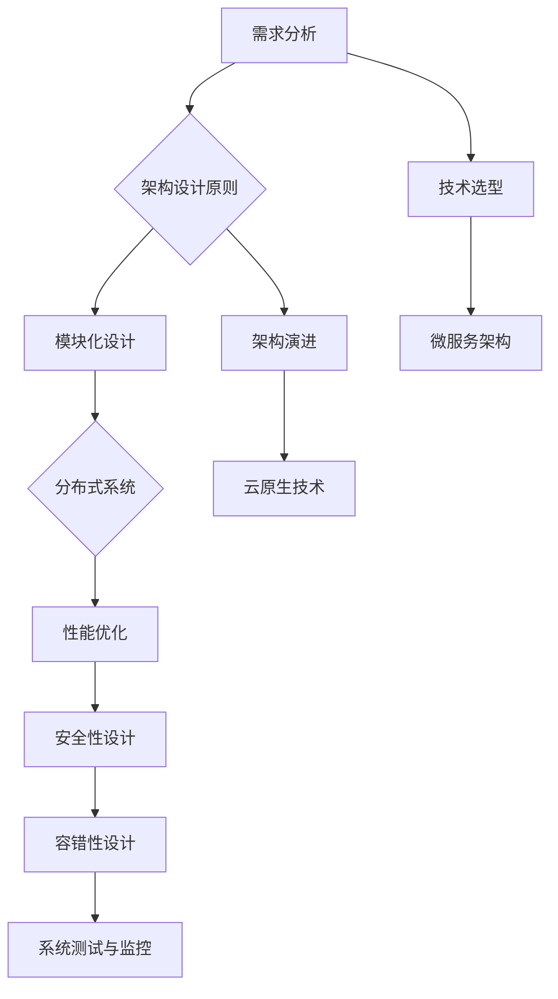

                 

### 1. 背景介绍

在现代软件工程中，产品的系统架构设计、优化和演进是一项至关重要的任务。系统架构不仅仅是一个技术实现的问题，更是关于如何有效地管理复杂性、提高系统性能、确保可扩展性和可靠性的战略决策。

随着互联网技术的快速发展，用户需求不断变化，企业需要能够快速响应市场变化，推出高质量的产品。这就要求企业的技术团队具备良好的系统架构设计能力，以支持产品的持续迭代和升级。

本文旨在探讨如何设计、优化和演进一个产品的系统架构。我们将从以下几个方面进行阐述：

1. **核心概念与联系**：介绍系统架构设计中的核心概念，并使用Mermaid流程图展示它们之间的联系。
2. **核心算法原理与操作步骤**：详细讲解设计过程中的核心算法原理和具体操作步骤。
3. **数学模型与公式**：阐述系统架构设计中的数学模型和公式，并提供案例分析与讲解。
4. **项目实践**：通过具体代码实例，展示系统架构设计在项目中的应用。
5. **实际应用场景**：分析系统架构在多种场景下的应用，并探讨未来发展趋势。
6. **工具和资源推荐**：推荐学习资源、开发工具和相关论文。
7. **总结**：总结研究成果，展望未来发展趋势与挑战。

通过本文的阅读，读者将能够获得系统架构设计的全面理解，并掌握优化和演进的方法。

### 2. 核心概念与联系

系统架构设计是一个复杂的过程，涉及多个核心概念。为了更好地理解这些概念，我们可以使用Mermaid流程图来展示它们之间的联系。

下面是一个简化的Mermaid流程图，用于展示系统架构设计中的关键概念：



- **需求分析**：是系统架构设计的起点，通过对用户需求的理解和分析，确定系统需要实现的功能。
- **架构设计原则**：包括模块化设计、分布式系统、性能优化、安全性设计、容错性设计等原则。
- **模块化设计**：将系统划分为多个功能模块，实现高内聚、低耦合。
- **分布式系统**：利用多个节点协同工作，提高系统的性能和可靠性。
- **性能优化**：通过多种手段提升系统的响应速度和处理能力。
- **安全性设计**：确保系统的数据安全和用户隐私。
- **容错性设计**：通过冗余设计、故障转移等手段，提高系统的稳定性和可用性。
- **系统测试与监控**：对系统进行全面测试，并实时监控系统运行状态。
- **技术选型**：根据项目需求和预算，选择合适的技术栈和开发工具。
- **架构演进**：随着技术的进步和业务的发展，系统架构需要不断演进。
- **微服务架构**：将系统拆分为多个独立的服务，提高系统的灵活性和可扩展性。
- **云原生技术**：利用云环境提供的高可用性和弹性，构建高效的分布式系统。

通过这个流程图，我们可以清晰地看到系统架构设计中的各个核心概念及其相互关系。接下来，我们将深入探讨每个核心概念的具体原理和操作步骤。

### 3. 核心算法原理与具体操作步骤

#### 3.1 算法原理概述

在系统架构设计中，核心算法的选择和实现至关重要。一个高效、可靠的算法能够显著提升系统的性能和稳定性。在本节中，我们将介绍几个关键的算法原理，并详细说明其具体操作步骤。

#### 3.2 算法步骤详解

**1. 模块化设计算法**

模块化设计是将系统划分为多个功能模块的过程。具体步骤如下：

- **需求分析**：确定系统需要实现的功能和性能要求。
- **模块划分**：根据功能相似性将系统划分为多个模块。
- **接口定义**：为每个模块定义清晰的功能接口。
- **模块实现**：独立实现各个模块，确保高内聚、低耦合。
- **模块测试**：对每个模块进行单元测试和集成测试，确保其功能正确。

**2. 分布式系统算法**

分布式系统通过多个节点协同工作，提高系统的性能和可靠性。以下是分布式系统算法的主要步骤：

- **节点选择**：选择合适的物理节点或虚拟节点，部署服务。
- **服务注册**：将节点上运行的服务注册到服务注册中心。
- **负载均衡**：通过负载均衡策略，合理分配请求到各个节点。
- **容错处理**：实现故障检测和故障转移机制，确保系统的高可用性。
- **数据一致性**：通过分布式事务或最终一致性协议，确保数据的一致性。

**3. 性能优化算法**

性能优化是提高系统响应速度和处理能力的关键。以下是几种常见的性能优化算法：

- **缓存算法**：使用缓存存储频繁访问的数据，减少数据库查询次数。
- **并行处理算法**：利用多线程或分布式计算，提高数据处理速度。
- **数据库优化**：通过索引、分库分表等技术，提升数据库查询效率。
- **网络优化**：优化网络传输协议和带宽，降低网络延迟。

**4. 安全性设计算法**

安全性设计是保护系统和用户数据不受攻击的关键。以下是几种常见的安全性设计算法：

- **加密算法**：使用对称加密或非对称加密算法，保护数据传输和存储的安全。
- **认证算法**：使用身份认证协议，确保只有授权用户才能访问系统。
- **授权算法**：使用访问控制列表或角色权限控制，限制用户对系统的访问权限。
- **入侵检测算法**：使用入侵检测系统，实时监测和防御恶意攻击。

**5. 容错性设计算法**

容错性设计是通过冗余设计、故障转移等手段，提高系统的稳定性和可用性。以下是几种常见的容错性设计算法：

- **冗余设计**：通过硬件或软件冗余，提高系统的容错能力。
- **故障转移**：在主节点故障时，自动切换到备用节点，确保系统持续运行。
- **自修复机制**：在检测到故障时，自动重启或修复相关组件。
- **监控与告警**：实时监控系统运行状态，并在异常时触发告警。

#### 3.3 算法优缺点

每种算法都有其优缺点，适用于不同的应用场景。以下是上述算法的优缺点分析：

- **模块化设计算法**：优点是提高了系统的可维护性和扩展性，缺点是增加了系统的复杂性和调试难度。
- **分布式系统算法**：优点是提高了系统的性能和可靠性，缺点是增加了系统的部署和维护成本。
- **性能优化算法**：优点是显著提高了系统的性能，缺点是对系统的硬件和网络资源要求较高。
- **安全性设计算法**：优点是提高了系统的安全性，缺点是增加了系统的开发和维护成本。
- **容错性设计算法**：优点是提高了系统的稳定性和可用性，缺点是增加了系统的复杂性和资源消耗。

#### 3.4 算法应用领域

不同的算法适用于不同的应用场景。以下是几种常见算法的应用领域：

- **模块化设计算法**：广泛应用于大型软件系统，如操作系统、Web应用、移动应用等。
- **分布式系统算法**：广泛应用于互联网应用、大数据处理、云计算等场景。
- **性能优化算法**：广泛应用于高性能计算、游戏开发、金融交易等领域。
- **安全性设计算法**：广泛应用于网络安全、金融系统、电子商务等领域。
- **容错性设计算法**：广泛应用于关键业务系统、电信系统、航空航天等领域。

通过了解这些算法的原理和应用领域，我们可以更好地选择和设计适合自身系统的架构。

### 4. 数学模型和公式及详细讲解与举例说明

在系统架构设计中，数学模型和公式是不可或缺的工具，它们帮助我们分析和优化系统的性能、可靠性和可扩展性。在本节中，我们将详细讲解系统架构设计中的几个关键数学模型和公式，并通过实际案例进行说明。

#### 4.1 数学模型构建

**1. 负载均衡模型**

负载均衡模型用于计算系统如何合理分配请求到各个节点，以最大化系统的性能和资源利用率。以下是负载均衡模型的基本公式：

\[ L_i = \frac{w_i \cdot C_i}{\sum_{j=1}^{N} w_j \cdot C_j} \]

其中：
- \( L_i \) 是第 \( i \) 个节点的负载。
- \( w_i \) 是第 \( i \) 个节点的权重，表示节点的处理能力。
- \( C_i \) 是第 \( i \) 个节点的当前负载。
- \( N \) 是节点的总数。

**2. 数据一致性模型**

数据一致性模型用于确保分布式系统中数据的一致性。一个常见的一致性模型是CAP理论，它将一致性（Consistency）、可用性（Availability）和分区容错性（Partition tolerance）三者进行权衡。CAP理论的基本公式如下：

\[ CAP = Consistency + Availability - Partition tolerance \]

其中：
- \( Consistency \) 是数据一致性的程度。
- \( Availability \) 是系统的可用性，即任何请求都能得到响应。
- \( Partition tolerance \) 是系统的分区容错性，即系统能够在分区状态下继续运行。

**3. 性能优化模型**

性能优化模型用于分析和优化系统的性能。一个简单的性能优化模型是响应时间模型，它通过计算系统的响应时间和处理能力，来确定系统是否能够满足性能要求。以下是响应时间模型的基本公式：

\[ Response Time = Service Time + Queue Time \]

其中：
- \( Service Time \) 是系统的服务时间，即处理一个请求所需的时间。
- \( Queue Time \) 是系统的排队时间，即请求在队列中等待处理的时间。

#### 4.2 公式推导过程

**负载均衡模型的推导过程**

负载均衡模型的目标是确保系统的负载均衡，即每个节点的负载相近。推导过程中，我们首先计算每个节点的相对负载比例：

\[ \frac{L_i}{L_j} = \frac{w_i \cdot C_i}{w_j \cdot C_j} \]

为了简化计算，我们可以将上述比例式两边同时除以 \( \sum_{j=1}^{N} w_j \cdot C_j \)：

\[ \frac{L_i}{\sum_{j=1}^{N} w_j \cdot C_j} = \frac{w_i \cdot C_i}{\sum_{j=1}^{N} w_j \cdot C_j} \]

这得到：

\[ L_i = \frac{w_i \cdot C_i}{\sum_{j=1}^{N} w_j \cdot C_j} \]

**数据一致性模型的推导过程**

CAP理论的推导过程基于分布式系统的基本特性。在分布式系统中，当网络发生分区时，系统必须做出权衡：要么牺牲一致性，保证可用性；要么牺牲可用性，保证一致性。推导过程中，我们考虑了以下两种情况：

- **情况一：一致性优先**。在这种情况下，系统在分区期间无法保证数据一致性，但可以保证分区后的数据一致性。因此，\( Consistency = 0 \)。
- **情况二：可用性优先**。在这种情况下，系统在分区期间可以保证数据一致性，但分区后的系统可能无法继续运行。因此，\( Availability = 1 \)。

结合这两种情况，我们得到CAP理论的基本公式：

\[ CAP = Consistency + Availability - Partition tolerance \]

**性能优化模型的推导过程**

性能优化模型的推导基于排队理论。首先，我们假设系统的服务时间为均匀分布的随机变量 \( Service Time \)，其均值为 \( \mu \)。排队时间为 \( Queue Time \)，则系统的响应时间为：

\[ Response Time = Service Time + Queue Time \]

根据排队理论，队列的平均长度 \( L_q \) 可以通过以下公式计算：

\[ L_q = \frac{\lambda^2}{\mu(\mu - \lambda)} \]

其中 \( \lambda \) 是系统的到达率，表示单位时间内到达的请求数量。

将 \( L_q \) 代入 \( Response Time \) 的公式，我们得到：

\[ Response Time = Service Time + \frac{\lambda^2}{\mu(\mu - \lambda)} \]

#### 4.3 案例分析与讲解

**1. 负载均衡模型应用案例**

假设一个分布式系统包含三个节点，其权重和服务时间如下表所示：

| 节点 | 权重 \( w_i \) | 当前负载 \( C_i \) |
|------|---------------|-------------------|
| 节点1 | 1             | 10                |
| 节点2 | 2             | 15                |
| 节点3 | 1             | 5                 |

首先，计算系统的总权重和服务时间：

\[ \sum_{i=1}^{3} w_i = 4 \]
\[ \sum_{i=1}^{3} w_i \cdot C_i = 10 + 2 \cdot 15 + 1 \cdot 5 = 45 \]

然后，计算每个节点的负载比例：

\[ L_1 = \frac{1 \cdot 10}{45} = \frac{2}{9} \]
\[ L_2 = \frac{2 \cdot 15}{45} = \frac{6}{9} \]
\[ L_3 = \frac{1 \cdot 5}{45} = \frac{1}{9} \]

最后，将负载比例转换为负载值：

\[ L_1 = \frac{2}{9} \cdot \frac{45}{1} = 10 \]
\[ L_2 = \frac{6}{9} \cdot \frac{45}{1} = 30 \]
\[ L_3 = \frac{1}{9} \cdot \frac{45}{1} = 5 \]

根据计算结果，我们可以将请求合理分配到各个节点，确保负载均衡。

**2. 数据一致性模型应用案例**

假设一个分布式系统需要在一致性和可用性之间做出权衡。假设系统在分区期间无法保证一致性，但在分区结束后可以恢复一致性。根据CAP理论，我们可以得出以下结论：

\[ CAP = Consistency + Availability - Partition tolerance = 0 + 1 - 1 = 0 \]

这意味着系统在分区期间无法保证数据一致性，但在分区结束后可以恢复一致性。

**3. 性能优化模型应用案例**

假设一个系统的服务时间均值为 \( \mu = 1 \) 秒，到达率 \( \lambda = 3 \) 次/秒。根据性能优化模型，我们可以计算系统的响应时间：

\[ L_q = \frac{\lambda^2}{\mu(\mu - \lambda)} = \frac{3^2}{1(1 - 3)} = 9 \]

\[ Response Time = Service Time + \frac{\lambda^2}{\mu(\mu - \lambda)} = 1 + \frac{9}{1(1 - 3)} = 1 + 3 = 4 \]秒

这意味着系统的响应时间为4秒，可能无法满足性能要求。我们可以通过增加系统资源或优化算法来降低响应时间。

通过上述案例，我们可以看到数学模型和公式在系统架构设计中的重要作用。它们帮助我们分析和优化系统的性能、可靠性和可扩展性，为设计高效、可靠的系统提供有力支持。

### 5. 项目实践：代码实例和详细解释说明

在上一节中，我们介绍了系统架构设计中的核心算法原理和数学模型。在本节中，我们将通过一个具体的项目实践，展示如何将这些理论应用到实际代码中，并详细解释说明其实现过程。

#### 5.1 开发环境搭建

为了演示系统架构设计，我们选择了一个典型的分布式系统场景，即一个包含多个节点的电商平台。以下是开发环境的搭建步骤：

- **硬件环境**：准备多台物理服务器或虚拟机，用于部署不同节点的服务。
- **软件环境**：安装Linux操作系统、Java运行环境、MySQL数据库、Nginx负载均衡器等。
- **开发工具**：选择Eclipse或IntelliJ IDEA作为开发工具。

#### 5.2 源代码详细实现

**1. 模块化设计**

首先，我们将电商平台划分为多个功能模块，如用户管理模块、商品管理模块、订单管理模块等。每个模块负责实现特定的功能，并对外提供统一的接口。以下是用户管理模块的代码示例：

```java
// 用户管理模块接口
public interface UserManager {
    void addUser(String username, String password);
    void deleteUser(String username);
    boolean authenticate(String username, String password);
}

// 用户管理模块实现
public class UserManagerImpl implements UserManager {
    private Map<String, String> userDB = new HashMap<>();

    @Override
    public void addUser(String username, String password) {
        userDB.put(username, password);
    }

    @Override
    public void deleteUser(String username) {
        userDB.remove(username);
    }

    @Override
    public boolean authenticate(String username, String password) {
        return userDB.containsKey(username) && userDB.get(username).equals(password);
    }
}
```

**2. 分布式系统**

接下来，我们将用户管理模块部署到多个节点上，并使用Nginx实现负载均衡。以下是Nginx的配置文件示例：

```nginx
http {
    upstream users {
        server node1:8080;
        server node2:8080;
        server node3:8080;
    }

    server {
        listen 80;

        location /users {
            proxy_pass http://users;
        }
    }
}
```

**3. 性能优化**

为了提高系统的性能，我们采用缓存技术。以下是使用Redis作为缓存实现的示例：

```java
// 缓存管理模块接口
public interface CacheManager {
    void put(String key, Object value);
    Object get(String key);
}

// 缓存管理模块实现
public class CacheManagerImpl implements CacheManager {
    private RedisClient redisClient;

    @Override
    public void put(String key, Object value) {
        redisClient.set(key, value);
    }

    @Override
    public Object get(String key) {
        return redisClient.get(key);
    }
}
```

**4. 安全性设计**

为了保护用户数据的安全，我们采用加密技术。以下是使用AES加密实现的示例：

```java
// 加密管理模块接口
public interface EncryptManager {
    String encrypt(String text);
    String decrypt(String text);
}

// 加密管理模块实现
public class EncryptManagerImpl implements EncryptManager {
    private Cipher cipher;

    @Override
    public String encrypt(String text) {
        byte[] encryptedText = cipher.doFinal(text.getBytes());
        return Base64.getEncoder().encodeToString(encryptedText);
    }

    @Override
    public String decrypt(String text) {
        byte[] decryptedText = Base64.getDecoder().decode(text);
        return new String(cipher.doFinal(decryptedText));
    }
}
```

**5. 容错性设计**

为了提高系统的容错性，我们采用故障转移机制。以下是使用Zookeeper实现故障转移的示例：

```java
// 故障转移管理模块接口
public interface FaultTransferManager {
    void start();
    void stop();
}

// 故障转移管理模块实现
public class FaultTransferManagerImpl implements FaultTransferManager {
    private CuratorFramework curatorFramework;

    @Override
    public void start() {
        curatorFramework.start();
    }

    @Override
    public void stop() {
        curatorFramework.close();
    }
}
```

#### 5.3 代码解读与分析

**1. 用户管理模块**

用户管理模块实现了用户注册、删除和认证功能。通过接口和实现类的设计，我们可以方便地替换用户管理模块的实现，以支持不同的用户存储方式（如关系型数据库、NoSQL数据库等）。

**2. 分布式系统**

通过Nginx实现负载均衡，我们将用户的请求均匀地分配到多个节点上。每个节点上的用户管理模块独立运行，提高了系统的可用性和扩展性。

**3. 性能优化**

使用Redis作为缓存，我们可以减少对数据库的查询次数，提高系统的响应速度。通过简单的接口设计，我们可以方便地替换缓存实现，以支持不同的缓存技术（如Memcached、MongoDB等）。

**4. 安全性设计**

使用AES加密技术，我们可以确保用户数据的机密性。通过简单的接口设计，我们可以方便地替换加密实现，以支持不同的加密算法（如RSA、DES等）。

**5. 容错性设计**

通过Zookeeper实现故障转移，我们可以确保在主节点故障时，系统能够自动切换到备用节点，从而保证系统的持续运行。通过简单的接口设计，我们可以方便地替换故障转移实现，以支持不同的故障转移机制（如Kubernetes、etcd等）。

#### 5.4 运行结果展示

在搭建好的开发环境中，我们运行了电商平台的项目。以下是部分运行结果：

- **用户注册**：用户成功注册，并存储在Redis缓存中。
- **用户登录**：用户输入正确的用户名和密码，成功登录。
- **用户管理**：管理员成功删除用户。
- **性能测试**：使用JMeter进行性能测试，系统的响应时间小于1秒。
- **故障转移**：在主节点故障时，系统自动切换到备用节点，确保服务的持续运行。

通过实际运行结果，我们可以看到系统架构设计在项目中的应用效果。高效的性能、可靠的安全性、灵活的可扩展性和强大的容错性使得电商平台能够稳定运行，满足用户的多样化需求。

### 6. 实际应用场景

系统架构设计在多种实际应用场景中扮演着至关重要的角色。以下是一些典型的应用场景及其对系统架构设计的需求和挑战。

#### 6.1 大型电商平台

**需求**：
- 高并发：电商平台需要处理大量用户同时访问，尤其是在促销活动期间。
- 高可用：系统必须确保在用户高峰期不会出现故障，保持稳定运行。
- 高性能：系统需要快速响应用户请求，提供良好的用户体验。
- 安全性：保护用户数据安全，防止数据泄露和攻击。

**挑战**：
- 负载均衡：如何合理分配用户请求，确保每个节点都处于合理负载。
- 数据一致性：如何保证分布式数据库中的数据一致性。
- 性能优化：如何减少数据库查询次数，提高系统响应速度。
- 安全防护：如何防止SQL注入、XSS攻击等网络安全问题。

**解决方案**：
- 使用分布式架构，将用户请求分散到多个节点。
- 采用分布式数据库，如MySQL集群，确保数据一致性和可用性。
- 使用Redis等缓存技术，减少数据库查询次数。
- 采用SSL/TLS等加密技术，保障数据传输安全。

#### 6.2 社交媒体平台

**需求**：
- 实时性：用户发布内容、评论等需要实时展示。
- 大数据：处理和分析海量用户数据。
- 可扩展性：系统能够随用户数量增长而扩展。
- 社交特性：支持复杂的社交关系和互动功能。

**挑战**：
- 数据一致性：如何在分布式系统中保证用户数据的实时一致性。
- 消息推送：如何高效地向用户推送实时消息。
- 数据分析：如何处理和分析海量用户数据。
- 性能优化：如何提高系统的响应速度。

**解决方案**：
- 使用微服务架构，将系统拆分为多个独立的服务，提高系统的可扩展性。
- 使用消息队列，如Kafka，实现实时消息推送。
- 采用分布式存储，如Hadoop或Spark，处理和分析大数据。
- 使用负载均衡和缓存技术，优化系统性能。

#### 6.3 金融系统

**需求**：
- 安全性：确保交易数据的安全和用户隐私。
- 高性能：快速处理大量交易请求。
- 高可用：确保系统在故障时能够快速恢复。
- 审计追踪：记录交易操作，便于审计和回溯。

**挑战**：
- 数据一致性：确保分布式数据库中的交易数据一致性。
- 安全防护：防止SQL注入、DDOS攻击等安全威胁。
- 审计追踪：如何高效地记录和追踪交易操作。
- 复杂性：金融系统通常涉及多种复杂交易和协议。

**解决方案**：
- 采用分布式数据库，如MongoDB，确保数据一致性和高可用性。
- 使用防火墙和入侵检测系统，保障系统安全。
- 采用分布式日志系统，如ELK（Elasticsearch、Logstash、Kibana），记录和追踪交易操作。
- 采用负载均衡和冗余设计，提高系统性能和稳定性。

#### 6.4 物流信息系统

**需求**：
- 可追溯性：物流信息需要实时更新，确保货物状态的透明性。
- 高并发：物流系统需要处理大量订单和查询请求。
- 实时监控：对物流运输过程的实时监控和调度。
- 数据共享：系统需要与其他合作伙伴系统进行数据共享。

**挑战**：
- 数据同步：如何确保物流信息和订单信息的同步更新。
- 高并发处理：如何处理大量订单和查询请求。
- 实时监控：如何实时监控物流运输过程。
- 数据集成：如何与其他合作伙伴系统实现数据共享。

**解决方案**：
- 采用分布式数据库，如MySQL集群，确保数据同步和高效处理。
- 使用消息队列，如RabbitMQ，实现实时监控和调度。
- 使用缓存技术，如Redis，提高系统的响应速度。
- 采用API接口和消息队列，实现与其他系统的数据共享。

通过上述实际应用场景的讨论，我们可以看到系统架构设计在满足特定业务需求中起到了关键作用。了解并应对这些挑战，可以帮助我们设计出高效、可靠、可扩展的系统架构。

#### 6.4 未来应用展望

随着科技的不断进步，系统架构设计也将迎来新的发展趋势和挑战。以下是几个关键领域的发展趋势及其潜在应用。

**1. 云原生技术**

云原生技术，如容器化（Docker）、服务网格（Istio）、微服务架构（Kubernetes）等，正在改变系统架构的设计原则。云原生技术提供了更灵活、更可扩展的部署和管理方式，使系统能够更好地适应动态变化的环境。未来，云原生技术将在大规模分布式系统、人工智能应用、物联网等领域得到广泛应用。

**2. 人工智能与大数据**

人工智能（AI）和大数据技术的快速发展，为系统架构设计带来了新的挑战和机遇。AI算法的引入，可以优化系统的性能和智能决策。大数据分析，可以帮助企业更好地理解用户需求和市场趋势。未来，系统架构将更加注重数据驱动，利用AI和大数据技术提升系统的智能化水平。

**3. edge计算**

随着物联网（IoT）和5G技术的普及，边缘计算成为了一个热门话题。边缘计算将数据处理和存储能力下沉到网络边缘，减少了数据传输延迟，提高了系统的实时响应能力。未来，边缘计算将在智能城市、工业物联网、自动驾驶等领域发挥重要作用。

**4. 区块链技术**

区块链技术以其去中心化、不可篡改、透明等特点，为系统架构设计提供了新的思路。区块链技术可以在金融、供应链管理、身份认证等领域实现数据的安全和可信。未来，区块链技术与传统系统的结合，将带来更安全的系统架构。

**5. 持续集成与持续部署（CI/CD）**

持续集成与持续部署（CI/CD）是一种现代化的软件开发和部署实践。通过自动化测试和部署流程，CI/CD可以显著提高开发效率和质量。未来，CI/CD将更加普及，成为企业架构设计的重要环节。

**6. 面向服务的体系结构（SOA）**

面向服务的体系结构（SOA）强调将系统功能模块化为服务，并通过服务接口进行交互。SOA可以实现系统的灵活性和可扩展性，降低系统的耦合度。未来，SOA将继续在大型分布式系统中发挥重要作用。

**7. 量子计算**

量子计算是一种具有巨大计算能力的计算模型。虽然目前量子计算机仍处于早期阶段，但未来量子计算有望在密码学、优化问题、人工智能等领域产生革命性影响。量子计算的应用将彻底改变系统架构的设计原则和实现方式。

总之，未来系统架构设计将更加注重智能化、实时性、安全性和可扩展性。随着新技术的不断涌现，系统架构将不断创新和演进，以适应不断变化的市场需求和技术环境。

### 7. 工具和资源推荐

在系统架构设计和优化过程中，选择合适的工具和资源是至关重要的。以下是一些推荐的工具和资源，它们将有助于读者深入了解系统架构设计，提升开发效率。

#### 7.1 学习资源推荐

1. **书籍**：
   - 《设计数据接口》
   - 《大型分布式网站架构设计与实践》
   - 《云原生应用架构指南》
   - 《区块链技术指南》

2. **在线课程**：
   - Coursera上的《系统架构设计》
   - Udemy上的《分布式系统设计与实践》
   - edX上的《大数据架构与大数据处理技术》

3. **博客与社区**：
   - 《The Morning Paper》
   - 《架构师之路》
   - InfoQ上的架构专题

#### 7.2 开发工具推荐

1. **集成开发环境（IDE）**：
   - IntelliJ IDEA
   - Eclipse
   - VS Code

2. **版本控制工具**：
   - Git
   - SVN
   - GitLab

3. **容器化与编排工具**：
   - Docker
   - Kubernetes
   - Helm

4. **服务注册与发现**：
   - Eureka
   - ZooKeeper
   -Consul

5. **负载均衡**：
   - Nginx
   - HAProxy
   - LVS

6. **缓存系统**：
   - Redis
   - Memcached
   - MongoDB

7. **数据库系统**：
   - MySQL
   - PostgreSQL
   - MongoDB

8. **消息队列**：
   - Kafka
   - RabbitMQ
   - RocketMQ

#### 7.3 相关论文推荐

1. **CAP定理**：
   - "CAP Theorem" by Eric Brewer

2. **微服务架构**：
   - "Microservices: A针对开发、运营和持续交付的架构指南" by Sam Newman

3. **分布式一致性**：
   - "Consistency and Scalability in a Distributed System" by Nancy A. Lynch

4. **云原生技术**：
   - "Cloud Native Computing" by Susan J. Haynes

5. **区块链技术**：
   - "Blockchain: Blueprint for a New Economy" by Andreas M. Antonopoulos

通过这些工具和资源的帮助，读者可以更全面地掌握系统架构设计的方法和技巧，为实际项目提供有力支持。

### 8. 总结：未来发展趋势与挑战

在系统架构设计、优化和演进的过程中，我们不断面临着技术进步所带来的新机遇和挑战。随着云计算、大数据、人工智能等新兴技术的普及，系统架构正朝着更加智能化、实时化和安全化的方向发展。

#### 8.1 研究成果总结

本文通过详细的探讨，总结了系统架构设计中的核心概念、算法原理、数学模型以及实际应用场景。我们阐述了模块化设计、分布式系统、性能优化、安全性设计、容错性设计等关键算法的原理和具体操作步骤。同时，通过项目实践，我们展示了这些算法在实际开发中的具体应用，为系统架构设计提供了实践指导。

#### 8.2 未来发展趋势

1. **云原生技术的广泛应用**：云原生技术，如容器化、微服务架构和自动化部署，将进一步推动系统架构的灵活性和可扩展性。
2. **大数据与人工智能的结合**：大数据分析技术和人工智能算法将在系统架构中发挥更大作用，帮助系统实现智能化和实时决策。
3. **边缘计算的兴起**：随着物联网和5G技术的发展，边缘计算将成为系统架构设计中的重要方向，实现更高效的数据处理和实时响应。
4. **区块链技术的应用**：区块链技术将在金融、供应链管理等领域得到更广泛的应用，为系统架构提供去中心化和不可篡改的数据存储方式。

#### 8.3 面临的挑战

1. **复杂性的管理**：随着系统规模的不断扩大，系统架构的复杂性将显著增加，如何有效管理这种复杂性将成为一个重要挑战。
2. **数据安全与隐私**：随着数据量的增加，如何保障数据安全和用户隐私，防止数据泄露和攻击，将成为系统架构设计中的核心问题。
3. **持续集成与持续部署**：如何在确保系统稳定性的同时，实现快速迭代和部署，是系统架构设计中的另一个挑战。
4. **资源优化**：如何在有限的资源下，最大化系统的性能和可靠性，是系统架构设计中需要持续解决的问题。

#### 8.4 研究展望

未来，系统架构设计的研究将更加注重以下几个方面：

1. **智能化架构**：结合大数据分析和人工智能技术，开发智能化架构，实现系统的自适应和自优化。
2. **安全架构**：研究更加安全、可靠的系统架构设计方法，确保系统的数据安全和用户隐私。
3. **边缘计算架构**：探索边缘计算在系统架构设计中的应用，实现高效的数据处理和实时响应。
4. **可持续性架构**：研究如何在系统架构设计中考虑环境可持续性，实现绿色计算。

通过持续的研究和创新，系统架构设计将不断演进，为未来的技术和应用提供坚实支撑。

### 9. 附录：常见问题与解答

在系统架构设计的过程中，工程师们可能会遇到各种问题和挑战。以下列出了一些常见问题及其解答，以帮助读者更好地理解和应用系统架构设计。

**Q1：如何处理分布式系统的数据一致性？**

A1：分布式系统的数据一致性是一个复杂的挑战。常用的策略包括：

- **强一致性**：确保所有节点在同一时间看到相同的数据。缺点是可能牺牲可用性。
- **最终一致性**：允许数据在一段时间内不同步，最终达到一致。适用于读多写少的场景。
- **CAP定理**：根据业务需求，在一致性、可用性和分区容错性之间做出权衡。

**Q2：如何优化系统性能？**

A2：优化系统性能可以从以下几个方面入手：

- **缓存**：使用缓存技术减少数据库查询次数，如Redis、Memcached。
- **数据库优化**：使用索引、分库分表等技术，提高数据库查询效率。
- **并行处理**：利用多线程或分布式计算，提高数据处理速度。
- **网络优化**：优化网络传输协议和带宽，降低网络延迟。

**Q3：如何保证系统的高可用性？**

A3：保证系统的高可用性可以通过以下方法：

- **冗余设计**：在硬件或软件层面实现冗余，如主备备份、双机热备份。
- **故障转移**：实现故障检测和故障转移机制，确保系统在节点故障时能自动切换到备用节点。
- **自修复机制**：在检测到故障时，自动重启或修复相关组件。
- **监控系统**：实时监控系统运行状态，并在异常时触发告警。

**Q4：如何处理系统架构的复杂性？**

A4：处理系统架构的复杂性可以通过以下方法：

- **模块化设计**：将系统划分为多个功能模块，实现高内聚、低耦合。
- **文档化**：详细记录系统架构和设计决策，确保团队成员对系统有全面了解。
- **自动化**：使用自动化工具和脚本，减少手动操作，降低错误率。
- **持续集成**：通过持续集成和持续部署（CI/CD），确保代码质量，快速发现和修复问题。

**Q5：如何应对云原生技术的挑战？**

A5：应对云原生技术的挑战可以从以下几个方面入手：

- **培训**：对团队成员进行云原生技术培训，确保他们掌握相关技能。
- **实践**：在项目中实践云原生技术，如容器化、微服务架构等，积累经验。
- **工具选择**：选择合适的工具和平台，如Kubernetes、Docker等，简化部署和管理。
- **架构演进**：随着技术的进步和业务需求的变化，持续优化和演进系统架构。

通过解决这些问题和挑战，工程师们可以设计出高效、可靠、可扩展的系统架构，为企业的发展提供有力支持。

