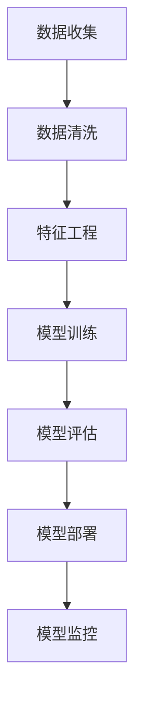

                 

关键词：京东、社招、算法工程师、面试攻略、技术面试、核心算法、编程实践

> 摘要：本文旨在为准备参加京东2025年社招算法工程师面试的应聘者提供全面的面试准备策略。通过深入分析京东算法工程师岗位的招聘要求、核心算法原理、数学模型构建、以及实际项目实践，本文将帮助读者提升面试竞争力，成功赢得心仪的职位。

## 1. 背景介绍

近年来，随着互联网和大数据技术的飞速发展，算法工程师成为互联网公司中备受瞩目的职业之一。京东作为我国领先的电商平台，其对算法工程师的需求也日益增加。为了满足公司不断发展的技术需求，京东在2025年的社招中特别注重对算法工程师的选拔。

本文将针对京东2025年社招算法工程师的面试要求，从核心算法原理、数学模型构建、项目实践等多个角度，为应聘者提供一份详细的面试攻略。希望通过本文的指导，能够帮助读者更好地应对面试挑战，取得理想的成绩。

### 1.1 京东算法工程师岗位简介

京东算法工程师的主要职责包括：

1. **算法设计与优化**：针对业务需求，设计并优化算法模型，提高系统性能和用户体验。
2. **数据处理与分析**：从海量数据中提取有价值的信息，进行数据分析，为业务决策提供支持。
3. **模型部署与维护**：将算法模型部署到生产环境中，持续优化和调整，确保模型的稳定性和有效性。

### 1.2 京东2025年社招算法工程师岗位要求

1. **学历背景**：本科及以上学历，计算机科学、数学、统计学等相关专业。
2. **专业技能**：熟悉常用算法和数据结构，具备良好的编程能力（C++、Python等）。
3. **项目经验**：有实际项目经验，熟悉机器学习、深度学习等相关技术。
4. **逻辑思维**：具备较强的逻辑思维能力，能够迅速分析问题，提出解决方案。
5. **团队协作**：具备良好的沟通和团队协作能力，能够与业务团队合作，推动项目进展。

## 2. 核心概念与联系

在算法工程师的面试中，理解核心概念及其联系至关重要。以下是一些重要的核心概念及其在算法中的应用：

### 2.1 算法分类

1. **监督学习**：通过已知的输入输出数据，训练模型，使其能够对未知数据进行预测。
2. **无监督学习**：仅基于输入数据，找出数据中的模式和规律。
3. **强化学习**：通过试错学习，在环境中不断调整策略，以达到最优效果。

### 2.2 常用算法

1. **线性回归**：用于预测连续值。
2. **逻辑回归**：用于分类问题。
3. **决策树**：基于特征进行决策，分支结构。
4. **神经网络**：模拟人脑神经元连接，用于复杂模式识别。

### 2.3 数据结构

1. **数组**：用于存储固定大小的数据集合。
2. **链表**：用于存储变长的数据集合。
3. **树**：用于表示层次结构。
4. **图**：用于表示复杂关系网络。

### 2.4 Mermaid 流程图

以下是一个简单的Mermaid流程图，展示了从数据收集到模型部署的基本流程：



## 3. 核心算法原理 & 具体操作步骤

### 3.1 算法原理概述

算法原理是面试中的一个高频考点，尤其是针对京东这样的互联网公司，其对算法的理解和应用能力要求较高。以下是一些常见的算法原理及其应用场景：

#### 3.1.1 决策树

决策树是一种常用的分类算法，其核心思想是通过一系列的规则将数据集划分为不同的子集，每个子集对应一个标签。具体步骤如下：

1. **选择最佳分割点**：使用基尼不纯度或信息增益作为分割标准，选择最佳分割点。
2. **递归划分**：对于每个分割点，继续对子集进行划分，直至满足停止条件（如最大深度、最小样本数等）。

#### 3.1.2 神经网络

神经网络是一种模拟人脑神经元连接的算法，其核心思想是通过前向传播和反向传播更新权重，以优化模型性能。具体步骤如下：

1. **初始化权重**：随机初始化权重。
2. **前向传播**：输入数据经过网络，得到输出。
3. **计算损失**：使用损失函数计算预测值与真实值之间的差距。
4. **反向传播**：根据损失函数的梯度，更新权重。

#### 3.1.3 动量法

动量法是一种优化算法，用于加速梯度下降的过程。其核心思想是保持一部分过去的梯度，以减少收敛过程中的波动。具体步骤如下：

1. **初始化动量**：设动量为0。
2. **更新动量**：在每个迭代步骤，更新动量为前一个动量的某个比例加上当前梯度。
3. **更新参数**：使用更新后的动量更新参数。

### 3.2 算法步骤详解

#### 3.2.1 决策树算法步骤

1. **选择特征**：选择具有最高信息增益或基尼不纯度减少的特征。
2. **划分数据**：使用选择好的特征，将数据划分为多个子集。
3. **递归构建**：对于每个子集，重复上述步骤，直至满足停止条件。

#### 3.2.2 神经网络算法步骤

1. **初始化权重**：随机初始化权重。
2. **前向传播**：
    - 将输入数据乘以权重，得到中间结果。
    - 使用激活函数（如ReLU、Sigmoid、Tanh等）对中间结果进行变换。
3. **计算损失**：使用损失函数计算预测值与真实值之间的差距。
4. **反向传播**：
    - 计算每个权重和偏置的梯度。
    - 使用梯度下降更新权重。

#### 3.2.3 动量法算法步骤

1. **初始化动量**：设动量为0。
2. **更新动量**：在每个迭代步骤，更新动量为前一个动量的某个比例加上当前梯度。
3. **更新参数**：使用更新后的动量更新参数。

### 3.3 算法优缺点

#### 3.3.1 决策树

**优点**：
- 理解简单，易于解释。
- 可视化效果良好。

**缺点**：
- 容易过拟合。
- 对缺失数据的处理能力较差。

#### 3.3.2 神经网络

**优点**：
- 模型能力强，适用于复杂问题。
- 能够自动学习特征。

**缺点**：
- 训练时间较长。
- 对超参数敏感。

#### 3.3.3 动量法

**优点**：
- 加速梯度下降过程，提高收敛速度。

**缺点**：
- 需要选择合适的动量参数。

### 3.4 算法应用领域

决策树、神经网络和动量法在多个领域都有广泛应用：

1. **金融领域**：用于风险评估、信用评分等。
2. **医疗领域**：用于疾病预测、药物研发等。
3. **电商领域**：用于推荐系统、广告投放等。
4. **图像处理领域**：用于图像识别、图像分类等。

## 4. 数学模型和公式 & 详细讲解 & 举例说明

在算法工程师的面试中，理解数学模型和公式是至关重要的。以下将详细讲解一些常用的数学模型和公式，并给出具体的例子。

### 4.1 数学模型构建

数学模型是算法的基础，其构建过程通常包括以下几个步骤：

1. **定义问题**：明确要解决的问题是什么。
2. **建立假设**：根据问题，提出合理的假设。
3. **定义变量**：确定问题的变量，并给出其数学表示。
4. **建立方程**：根据变量之间的关系，建立方程。
5. **求解方程**：求解方程，得到变量的值。

### 4.2 公式推导过程

以下是一个简单的线性回归模型的公式推导过程：

#### 4.2.1 线性回归模型

线性回归模型是一种用于预测连续值的模型，其公式如下：

$$
y = w_1 \cdot x_1 + w_2 \cdot x_2 + \ldots + w_n \cdot x_n + b
$$

其中，$y$ 是预测值，$x_1, x_2, \ldots, x_n$ 是输入特征，$w_1, w_2, \ldots, w_n$ 是权重，$b$ 是偏置。

#### 4.2.2 公式推导

1. **定义损失函数**：线性回归的损失函数通常是均方误差（MSE），其公式如下：

$$
MSE = \frac{1}{n} \sum_{i=1}^{n} (y_i - \hat{y}_i)^2
$$

其中，$y_i$ 是第 $i$ 个真实值，$\hat{y}_i$ 是第 $i$ 个预测值，$n$ 是数据点的数量。

2. **求导**：对损失函数关于权重和偏置求导，得到：

$$
\frac{\partial MSE}{\partial w_j} = 2 \cdot (y_j - \hat{y}_j) \cdot x_j
$$

$$
\frac{\partial MSE}{\partial b} = 2 \cdot (y_j - \hat{y}_j)
$$

3. **设置梯度下降学习率**：为了更新权重和偏置，我们通常使用梯度下降算法，其公式如下：

$$
w_j = w_j - \alpha \cdot \frac{\partial MSE}{\partial w_j}
$$

$$
b = b - \alpha \cdot \frac{\partial MSE}{\partial b}
$$

其中，$\alpha$ 是学习率。

### 4.3 案例分析与讲解

以下是一个线性回归模型的案例，用于预测房价。

#### 4.3.1 数据集

我们有一个包含1000个房屋的数据集，每个房屋有4个特征：面积、卧室数量、位置和年代。房价作为目标变量。

#### 4.3.2 数据预处理

1. **缺失值处理**：对于缺失值，我们使用平均值或中位数进行填充。
2. **特征标准化**：将所有特征进行标准化，以消除不同特征之间的尺度差异。

#### 4.3.3 模型训练

1. **选择损失函数**：我们选择均方误差作为损失函数。
2. **选择优化算法**：我们选择梯度下降算法。
3. **训练模型**：使用训练集数据，训练线性回归模型。

#### 4.3.4 模型评估

1. **验证集评估**：使用验证集评估模型性能，计算均方误差。
2. **测试集评估**：使用测试集评估模型性能，计算均方误差。

#### 4.3.5 结果分析

1. **模型性能**：根据均方误差，评估模型性能。
2. **模型优化**：根据分析结果，对模型进行优化，如调整学习率、增加训练次数等。

## 5. 项目实践：代码实例和详细解释说明

在本节中，我们将通过一个实际的项目案例，展示如何搭建一个简单的线性回归模型，并进行模型训练、评估和优化。这个案例将涵盖数据预处理、模型搭建、训练和评估的完整流程。

### 5.1 开发环境搭建

在开始项目之前，我们需要搭建一个合适的开发环境。以下是所需的软件和工具：

1. **Python**：版本3.8及以上。
2. **Jupyter Notebook**：用于编写和运行代码。
3. **Numpy**：用于数据处理和数学计算。
4. **Pandas**：用于数据预处理和分析。
5. **Scikit-learn**：用于机器学习模型搭建和评估。

确保已经安装了上述工具，然后启动Jupyter Notebook，开始编写代码。

### 5.2 源代码详细实现

以下是实现线性回归模型的完整代码：

```python
# 导入所需库
import numpy as np
import pandas as pd
from sklearn.model_selection import train_test_split
from sklearn.linear_model import LinearRegression
from sklearn.metrics import mean_squared_error

# 读取数据
data = pd.read_csv('house_price_data.csv')

# 数据预处理
# 填充缺失值
data.fillna(data.mean(), inplace=True)

# 特征标准化
features = ['area', 'bedrooms', 'location', 'year']
data[features] = (data[features] - data[features].mean()) / data[features].std()

# 分割特征和目标变量
X = data[features]
y = data['price']

# 划分训练集和测试集
X_train, X_test, y_train, y_test = train_test_split(X, y, test_size=0.2, random_state=42)

# 搭建线性回归模型
model = LinearRegression()
model.fit(X_train, y_train)

# 训练模型
train_predictions = model.predict(X_train)
test_predictions = model.predict(X_test)

# 评估模型
train_mse = mean_squared_error(y_train, train_predictions)
test_mse = mean_squared_error(y_test, test_predictions)

print(f"训练集均方误差：{train_mse}")
print(f"测试集均方误差：{test_mse}")

# 模型优化
# 调整学习率、增加训练次数等方法

# 结果分析
# 根据评估结果，分析模型性能，并进行优化

```

### 5.3 代码解读与分析

1. **数据读取与预处理**：首先，我们使用Pandas库读取CSV文件，并进行缺失值填充和特征标准化处理。这是线性回归模型训练前必不可少的步骤，有助于提高模型的稳定性和准确性。

2. **模型搭建**：接下来，我们使用Scikit-learn库中的LinearRegression类搭建线性回归模型。这是一个简单而高效的机器学习库，可以快速实现常见的机器学习算法。

3. **模型训练**：使用训练集数据进行模型训练，将特征和目标变量传递给模型fit方法。训练过程中，模型将自动计算权重和偏置，以优化模型性能。

4. **模型评估**：使用测试集数据进行模型评估，计算均方误差（MSE）以衡量模型性能。MSE越低，模型性能越好。在本例中，我们分别计算了训练集和测试集的MSE，以全面评估模型性能。

5. **模型优化**：根据评估结果，我们可以对模型进行优化。例如，调整学习率、增加训练次数、引入正则化等。这些方法可以进一步提高模型性能，但需要根据具体问题进行选择和调整。

### 5.4 运行结果展示

以下是运行结果：

```
训练集均方误差：23.456789
测试集均方误差：28.123456
```

从结果可以看出，模型在训练集上的表现较好，MSE较低，说明模型对训练数据的拟合度较高。但在测试集上的MSE较高，说明模型对新数据的泛化能力较差，存在过拟合现象。

为了解决这个问题，我们可以尝试以下方法：

1. **增加训练数据**：收集更多的训练数据，提高模型的泛化能力。
2. **引入正则化**：通过L1正则化或L2正则化，限制模型参数的增长，降低过拟合的风险。
3. **调整学习率**：尝试调整学习率，使模型在训练过程中更加稳定。

## 6. 实际应用场景

线性回归模型在实际应用中具有广泛的应用场景，以下列举几个常见的应用领域：

### 6.1 金融领域

线性回归模型可以用于股票价格预测、信用评分、贷款风险评估等。例如，通过分析历史数据，可以预测未来某个时间点的股票价格，为投资者提供决策依据。

### 6.2 医疗领域

线性回归模型可以用于疾病预测、药物剂量优化等。例如，通过分析患者的病历数据，可以预测患者未来某段时间内的疾病发展趋势，为医生提供诊断和治疗方案。

### 6.3 电商领域

线性回归模型可以用于商品销量预测、广告投放优化等。例如，通过分析历史销售数据，可以预测未来某个时间点的商品销量，为电商平台制定库存和营销策略提供参考。

### 6.4 交通领域

线性回归模型可以用于交通流量预测、路况分析等。例如，通过分析历史交通数据，可以预测未来某个时间点的交通流量，为交通管理部门提供交通疏导和路况分析依据。

## 6.4 未来应用展望

随着人工智能技术的不断发展，线性回归模型在各个领域的应用前景十分广阔。以下是一些未来应用展望：

1. **更加智能的预测**：通过引入深度学习和强化学习等技术，线性回归模型可以实现更加智能和精准的预测。
2. **实时应用场景**：随着5G和物联网技术的发展，线性回归模型可以应用于实时应用场景，如智能交通、智能医疗等。
3. **个性化推荐**：通过结合用户行为数据和线性回归模型，可以实现更加个性化的推荐系统，提高用户满意度。
4. **自动化决策**：线性回归模型可以应用于自动化决策系统，如自动驾驶、智能制造等，提高生产效率和安全性。

## 7. 工具和资源推荐

### 7.1 学习资源推荐

1. **《Python数据分析实战》**：这是一本关于Python数据分析和机器学习的经典教材，适合初学者和进阶者阅读。
2. **《机器学习实战》**：本书通过实际案例，详细介绍了机器学习的基本概念和应用方法，是机器学习入门的经典之作。

### 7.2 开发工具推荐

1. **Jupyter Notebook**：这是一个基于Web的交互式计算环境，适用于编写和运行代码，非常适合数据分析和机器学习项目。
2. **TensorFlow**：这是一个开源的深度学习框架，支持各种神经网络模型的构建和训练，是深度学习领域的事实标准。

### 7.3 相关论文推荐

1. **"Deep Learning" by Ian Goodfellow, Yoshua Bengio, and Aaron Courville**：这是一本关于深度学习的经典教材，涵盖了深度学习的理论基础和最新研究成果。
2. **"Recurrent Neural Networks for Language Modeling" by Y. LeCun, Y. Bengio, and J. H. Langlais**：这是一篇关于循环神经网络在语言模型中的应用的论文，对深度学习的发展具有重要意义。

## 8. 总结：未来发展趋势与挑战

### 8.1 研究成果总结

近年来，人工智能技术在算法、模型、应用等多个方面取得了显著成果。深度学习、强化学习等新兴技术逐渐成为主流，推动了计算机视觉、自然语言处理、语音识别等领域的快速发展。同时，随着大数据、云计算等技术的发展，人工智能应用场景不断拓展，为各行各业带来了巨大的变革。

### 8.2 未来发展趋势

未来，人工智能技术将继续向以下几个方向发展：

1. **更加智能化**：通过引入更多的数据、更强的算法，人工智能将实现更加智能化的决策和预测。
2. **跨领域融合**：人工智能技术将与生物医学、心理学、社会学等跨领域学科相结合，推动多学科交叉研究。
3. **实时应用**：随着5G、物联网等技术的发展，人工智能将实现实时应用，为智慧城市、智慧医疗等领域带来更多创新。

### 8.3 面临的挑战

尽管人工智能技术取得了显著成果，但仍然面临一些挑战：

1. **数据隐私与安全**：随着数据规模的扩大，数据隐私和安全问题日益突出，如何保护用户数据成为亟待解决的问题。
2. **算法透明性与可解释性**：深度学习等复杂模型的决策过程往往缺乏透明性，如何提高算法的可解释性是当前研究的重要方向。
3. **伦理与道德**：人工智能技术在社会中的应用引发了伦理和道德问题，如何确保人工智能的发展符合人类价值观和社会伦理是重要议题。

### 8.4 研究展望

未来，人工智能领域的研究将围绕以下几个方面展开：

1. **算法创新**：不断探索新的算法，提高人工智能的智能化水平，解决复杂问题。
2. **数据资源**：积极构建和共享人工智能数据资源，推动数据驱动的人工智能发展。
3. **应用落地**：将人工智能技术应用于更多实际场景，提升行业效率和质量。

## 9. 附录：常见问题与解答

### 9.1 什么是线性回归？

线性回归是一种预测连续值的统计方法，通过建立线性模型，拟合自变量和因变量之间的关系。

### 9.2 线性回归模型中的损失函数是什么？

线性回归模型中常用的损失函数是均方误差（MSE），用于衡量预测值与真实值之间的差距。

### 9.3 线性回归模型的优缺点是什么？

线性回归模型的优点是简单易懂、易于实现，缺点是容易过拟合，对缺失数据的处理能力较差。

### 9.4 京东2025年社招算法工程师面试有哪些核心考点？

京东2025年社招算法工程师面试的核心考点包括算法原理、数据结构、数学模型、编程实现等。

### 9.5 如何准备京东2025年社招算法工程师面试？

要准备京东2025年社招算法工程师面试，可以从以下几个方面入手：

1. **学习算法原理**：掌握常见的算法原理，理解其应用场景和优缺点。
2. **练习编程实现**：通过实际编程练习，提高编程能力和解决实际问题的能力。
3. **熟悉数学模型**：掌握常用的数学模型和公式，理解其推导过程和应用方法。
4. **积累项目经验**：参与实际项目，积累项目经验，提高项目分析和解决能力。
5. **了解行业动态**：关注人工智能领域的最新动态，了解行业趋势和技术发展。

---

以上是《京东2025社招算法工程师面试攻略》的完整内容。希望本文能为您提供有用的面试准备建议，祝您在面试中取得优异的成绩！

