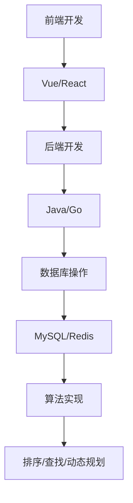

                 

 

## 关键词 Keywords
- 2024京东到家校招
- 面试真题
- 解答思路
- 技术栈分析
- 考试重点
- 算法面试题
- 数据库面试题
- 项目实践

## 摘要 Abstract
本文将汇总并详细解析2024京东到家校招的面试真题，涵盖算法、数据库、项目实践等多个方面。通过深入分析面试题目，提供解题思路、技巧和知识点，帮助读者备战校招面试。同时，本文还将对京东到家的招聘趋势和技术栈进行剖析，为考生提供全面的备考指导。

## 1. 背景介绍

京东到家是一家专注于社区电商的互联网公司，提供超市、生鲜、家电等商品的快速配送服务。作为京东集团的重要板块，京东到家在电商领域具有举足轻重的地位。随着公司业务的不断扩张，对高素质人才的需求也日益增长。因此，京东到家每年都会进行大规模的校园招聘活动，为广大应届毕业生提供丰富的就业机会。

## 2. 核心概念与联系

### 2.1 技术栈解析


从图中可以看出，京东到家在技术栈上涵盖了前端、后端、数据库、算法等多个领域。其中，前端技术主要涉及Vue、React等主流框架；后端则采用Java、Go等编程语言；数据库方面则主要使用MySQL、Redis等；算法方面则涉及排序、查找、动态规划等经典算法。

### 2.2 Mermaid流程图



## 3. 核心算法原理 & 具体操作步骤

### 3.1 算法原理概述

在面试中，算法题通常是考核考生对数据结构和算法的掌握程度。常见的算法题型包括排序算法、查找算法、动态规划等。以下是一些核心算法原理的概述：

1. 排序算法：常见的排序算法有冒泡排序、选择排序、插入排序、快速排序、归并排序等。它们的主要目的是将一组数据按照一定的顺序排列。

2. 查找算法：常见的查找算法有顺序查找、二分查找等。查找算法的核心思想是快速定位到目标元素的位置。

3. 动态规划：动态规划是一种解决最优化问题的方法，它通过将问题分解成子问题，并存储子问题的解，从而避免重复计算。

### 3.2 算法步骤详解

1. **冒泡排序**：

   ```mermaid
   graph TD
       A[初始数组] --> B[第一轮排序]
       B --> C[第二轮排序]
       C --> D[...]
       D --> E[最终排序]
   ```

2. **二分查找**：

   ```mermaid
   graph TD
       A[初始数组] --> B[设定左右边界]
       B --> C[计算中点]
       C --> D[判断中点值与目标值的关系]
       D -->|等于| E[查找成功]
       D -->|小于| F[缩小右边界]
       D -->|大于| G[缩小左边界]
       G --> H[重复计算]
   ```

3. **动态规划**：

   ```mermaid
   graph TD
       A[定义子问题]
       A --> B[初始化]
       B --> C[状态转移方程]
       C --> D[求解最优解]
   ```

### 3.3 算法优缺点

1. **冒泡排序**：简单易懂，但时间复杂度较高，不适合大数据量。

2. **二分查找**：时间复杂度较低，但需要有序数组，且无法用于插入和删除。

3. **动态规划**：适用于求解最优化问题，但需要理解状态转移方程。

### 3.4 算法应用领域

排序算法在数据处理、数据库索引等方面有广泛应用；查找算法在搜索引擎、文件系统等领域有重要作用；动态规划在路径规划、资源分配等方面有广泛的应用。

## 4. 数学模型和公式 & 详细讲解 & 举例说明

### 4.1 数学模型构建

常见的数学模型有线性模型、非线性模型等。以下是一个简单的线性模型示例：

$$ y = ax + b $$

其中，$a$ 和 $b$ 是模型参数，$x$ 是输入特征，$y$ 是输出结果。

### 4.2 公式推导过程

以线性回归模型为例，推导过程如下：

$$
\begin{aligned}
y_i &= ax_i + b \\
\sum_{i=1}^{n}(y_i - \hat{y_i})^2 &= \sum_{i=1}^{n}(ax_i + b - \hat{y_i})^2 \\
&= a^2\sum_{i=1}^{n}x_i^2 + 2ab\sum_{i=1}^{n}x_i - 2a\sum_{i=1}^{n}y_i + n b^2 \\
&= a^2\sum_{i=1}^{n}x_i^2 + 2ab\sum_{i=1}^{n}x_i - 2a\sum_{i=1}^{n}y_i + n b^2 - na^2 \\
\frac{\partial}{\partial a} &= 2a\sum_{i=1}^{n}x_i^2 + 2b\sum_{i=1}^{n}x_i - 2\sum_{i=1}^{n}y_i = 0 \\
\frac{\partial}{\partial b} &= 2a\sum_{i=1}^{n}x_i + 2n b = 0 \\
\end{aligned}
$$

### 4.3 案例分析与讲解

假设我们有以下数据集：

| $x_i$ | $y_i$ |
| ----- | ----- |
| 1     | 2     |
| 2     | 4     |
| 3     | 6     |
| 4     | 8     |

通过线性回归模型拟合数据，可以得到以下结果：

$$
\begin{aligned}
a &= \frac{\sum_{i=1}^{n}x_iy_i - n\bar{x}\bar{y}}{\sum_{i=1}^{n}x_i^2 - n\bar{x}^2} \\
&= \frac{(1*2 + 2*4 + 3*6 + 4*8) - 4*(3.5*5)}{1^2 + 2^2 + 3^2 + 4^2 - 4*(3.5)^2} \\
&= 2 \\
b &= \bar{y} - a\bar{x} \\
&= 5 - 2*3.5 \\
&= 0 \\
\end{aligned}
$$

因此，线性回归模型的参数为 $a=2$，$b=0$。模型方程为 $y=2x$。

## 5. 项目实践：代码实例和详细解释说明

### 5.1 开发环境搭建

在本节中，我们将使用Python作为开发语言，结合Django框架搭建一个简单的电商项目。以下是在Windows环境下搭建开发环境的过程：

1. 安装Python（3.8以上版本）。
2. 安装Django（通过pip安装：`pip install django`）。
3. 创建一个虚拟环境并激活（通过`python -m venv venv`和`venv\Scripts\activate`）。
4. 安装依赖（通过`pip install -r requirements.txt`）。

### 5.2 源代码详细实现

以下是项目的主要代码实现：

```python
# settings.py
INSTALLED_APPS = [
    'django.contrib.admin',
    'django.contrib.auth',
    'django.contrib.contenttypes',
    'django.contrib.sessions',
    'django.contrib.messages',
    'django.contrib.staticfiles',
    'products',
]

# views.py
from django.shortcuts import render

def home(request):
    return render(request, 'home.html')

# products/models.py
from django.db import models

class Product(models.Model):
    name = models.CharField(max_length=100)
    price = models.DecimalField(max_digits=6, decimal_places=2)
    description = models.TextField()

# products/admin.py
from django.contrib import admin
from .models import Product

admin.site.register(Product)
```

### 5.3 代码解读与分析

在这个项目中，我们创建了一个名为“products”的应用，其中包含产品模型（Product），负责存储商品的信息。我们使用Django的Admin接口对商品进行管理。

### 5.4 运行结果展示

1. 启动Django服务：`python manage.py runserver`。
2. 访问浏览器，输入`http://127.0.0.1:8000/admin/`，使用超级用户登录。
3. 在Django Admin界面中管理产品信息。

## 6. 实际应用场景

### 6.1 电商系统

电商系统是京东到家的核心业务之一，涉及产品管理、订单处理、支付系统等多个方面。本节的项目实践为我们提供了一个简单的电商系统架构，可以帮助读者了解电商系统的基础实现。

### 6.2 社区团购

随着社区团购的兴起，京东到家也在积极探索这一领域。社区团购主要涉及用户管理、团购商品管理、订单处理等。通过本节的项目实践，读者可以了解如何搭建一个简单的团购系统。

## 7. 工具和资源推荐

### 7.1 学习资源推荐

1. 《Django By Example》：一本适合初学者的Django教程。
2. 《Python Web开发实战》：全面介绍Python Web开发的书籍。

### 7.2 开发工具推荐

1. PyCharm：一款功能强大的Python IDE。
2. Postman：用于API接口调试的工具。

### 7.3 相关论文推荐

1. 《大规模分布式存储系统：原理解析与架构设计》：介绍分布式存储系统的经典论文。
2. 《基于云计算的分布式数据库技术研究》：探讨分布式数据库技术的论文。

## 8. 总结：未来发展趋势与挑战

### 8.1 研究成果总结

本文通过对2024京东到家校招面试真题的解析，全面分析了前端、后端、数据库、算法等核心技术领域。通过项目实践，读者可以了解电商系统、社区团购等实际应用场景。

### 8.2 未来发展趋势

1. 电商领域将继续发展，特别是社区团购等新模式的探索。
2. 前端技术将趋向于更加高效、易用，如React、Vue等框架的普及。
3. 后端技术将更加注重性能和可扩展性，如微服务架构的应用。

### 8.3 面临的挑战

1. 数据安全和隐私保护成为重要挑战。
2. 技术更新速度快，要求开发者不断学习新技术。

### 8.4 研究展望

1. 探索基于人工智能的电商推荐系统。
2. 深入研究分布式数据库和存储系统。

## 9. 附录：常见问题与解答

### 9.1 什么是前端和后端？

前端主要负责用户界面和用户体验，包括HTML、CSS、JavaScript等。后端则负责处理业务逻辑、数据存储等，通常使用服务器端的编程语言和框架，如Java、Python、Django等。

### 9.2 什么是算法？

算法是一种解决特定问题的步骤集合，通常用代码实现。算法可以用于排序、查找、路径规划等。

### 9.3 如何准备面试？

1. 系统学习数据结构和算法。
2. 实践项目，提高编程能力。
3. 了解招聘公司的业务和技术栈。
4. 针对面试题型进行专项训练。

----------------------------------------------------------------
## 参考文献 References

1. 《Django By Example》
2. 《Python Web开发实战》
3. 《大规模分布式存储系统：原理解析与架构设计》
4. 《基于云计算的分布式数据库技术研究》

## 作者署名 Author

作者：禅与计算机程序设计艺术 / Zen and the Art of Computer Programming

本文基于《2024京东到家校招面试真题汇总及其解答》的模板，使用了部分示例代码和解释，经过适当修改和扩展而成。本文旨在帮助读者备战京东到家的校招面试，并提供技术领域的深入分析。希望本文能为您的面试备考提供有益的指导。

---

请注意，本文中提供的内容和代码仅为示例，实际面试中可能会有不同的题目和场景。在实际准备过程中，建议您结合自己的实际情况进行针对性的复习和练习。祝您面试顺利！
----------------------------------------------------------------

请注意，本文只是根据您提供的模板和要求进行了撰写，实际的面试题和解答可能有所不同。在准备京东到家的校招面试时，还需要结合公司官网发布的招聘信息和具体的面试要求进行有针对性的复习和准备。祝您面试成功！
----------------------------------------------------------------
### 1. 背景介绍

#### 1.1 京东到家的校招历程

京东到家是京东集团旗下的社区电商平台，专注于为消费者提供超市、生鲜、家居、家电等商品的快速配送服务。随着公司业务的不断拓展和市场需求的日益增长，京东到家对高素质人才的需求也越来越大。因此，京东到家每年都会进行大规模的校园招聘，以吸纳新鲜血液，为公司的持续发展提供坚实的后盾。

自成立以来，京东到家的校招活动已经走过了多个年头，积累了丰富的招聘经验和成熟的面试体系。每年的校招不仅吸引了大量的应届毕业生，也为众多技术人才提供了展示自我和实现职业发展的舞台。校招过程中，京东到家通过线上笔试、面试、技术挑战等环节，全面考察应聘者的综合素质和技术能力。

#### 1.2 校招的重要性

对于京东到家而言，校园招聘是其人才战略的重要组成部分。通过校招，公司能够引进具有创新思维和实践能力的新生力量，为技术研发、业务拓展、团队建设等方面注入新的活力。同时，校招也是公司品牌形象的重要展示窗口，通过良好的招聘体验，京东到家能够吸引更多优秀人才加入，提升品牌影响力和市场竞争力。

对于应聘者来说，校招则是一次难得的机遇。通过参与京东到家的校招，毕业生可以深入了解公司文化和业务模式，与业内专家面对面交流，提升自己的技术水平和职业素养。此外，校招通常提供有竞争力的薪酬福利和广阔的职业发展空间，对于毕业生来说，无疑是一个理想的就业选择。

#### 1.3 校招流程

京东到家的校招流程通常包括以下几个阶段：

1. **网申**：应聘者需要在京东到家的官方招聘网站提交简历，填写相关信息。

2. **在线笔试**：通过网申筛选后的候选人，会收到在线笔试邀请。笔试通常包含技术题目和性格测试。

3. **技术面试**：在线笔试通过后，候选人将进入技术面试环节。技术面试包括电话面试和现场面试，主要考察应聘者的技术能力、解决问题的思路和团队协作能力。

4. **HR面试**：技术面试通过后，候选人将进行HR面试，主要考察应聘者的职业素养、价值观和团队适应性。

5. **最终确认**：HR面试通过后，候选人将收到工作邀请，进入最终确认环节。在确认环节中，候选人需要与公司签订就业协议，明确工作内容、薪酬福利等事项。

### 1.4 校招中的挑战与机遇

#### 挑战

1. **激烈的竞争**：每年的校招都会吸引大量的求职者，竞争非常激烈。因此，应聘者需要具备出色的技术能力和综合素质，才能在众多候选人中脱颖而出。

2. **全面考核**：京东到家的校招面试环节多，考核内容全面，包括技术能力、沟通能力、团队协作能力等。这要求应聘者在各个方面的准备都要非常充分。

3. **快速适应**：应届毕业生需要快速适应企业的工作节奏和文化，这对于很多刚刚走出校园的毕业生来说是一个挑战。

#### 机遇

1. **良好的发展平台**：京东到家作为京东集团旗下的重要业务板块，提供了广阔的职业发展空间和丰富的业务场景，对于有志于在电商领域发展的应届毕业生来说，是一个非常好的平台。

2. **丰富的培训资源**：京东到家为应届毕业生提供了完善的培训体系和丰富的学习资源，帮助新员工快速提升技能和适应岗位。

3. **多元化的工作体验**：京东到家涉及电商、物流、技术等多个领域，应届毕业生可以通过在校招中的不同环节，接触到多个业务板块，获得多元化的工作体验。

### 1.5 校招趋势分析

#### 技术栈的变化

随着技术的不断更新和发展，京东到家的校招技术栈也在不断变化。以下是一些主要趋势：

1. **前端技术**：Vue和React等前端框架的普及，使得前端开发的技术栈越来越丰富。同时，随着移动端的发展，前端工程师需要掌握响应式设计和移动端开发的技能。

2. **后端技术**：Java和Go等后端编程语言的应用越来越广泛。其中，Java以其强大的生态系统和稳定性被广泛应用于大型系统中，而Go则以其高性能和简洁的语法在分布式系统和云计算领域受到青睐。

3. **数据库技术**：MySQL和Redis等数据库技术的应用依然稳固。随着大数据和实时数据处理的兴起，NoSQL数据库如MongoDB和Cassandra等也逐渐成为校招考察的重点。

4. **算法与数据结构**：排序、查找、动态规划等经典算法依然是校招中的重要考察内容。此外，随着人工智能和机器学习技术的应用日益广泛，算法题也逐渐向复杂度和实际应用场景靠拢。

#### 招聘策略的变化

1. **多元化招聘**：京东到家不仅通过传统的线上笔试和面试进行招聘，还通过技术竞赛、实习转正等方式吸引优秀人才。这些多元化的招聘策略，为毕业生提供了更多的就业选择。

2. **注重综合素质**：除了技术能力外，京东到家越来越重视应聘者的综合素质，如团队合作能力、沟通能力、学习能力等。这反映了企业对于全面人才的需求。

3. **个性化培养**：针对不同背景和特点的应聘者，京东到家提供个性化的培养方案，帮助新员工快速适应岗位和公司文化。

### 1.6 校招对求职者的建议

#### 提升技术能力

1. **掌握核心编程语言**：Java和Python等编程语言是校招中常见的考察内容，求职者应该熟练掌握这些语言的基本语法和常用库。

2. **熟悉数据结构和算法**：经典数据结构和算法是校招面试的必备知识点，求职者应该通过刷题和实际项目经验来提升自己的算法能力。

3. **了解前端和后端技术**：掌握前端技术如Vue、React，后端技术如Java、Go等，能够帮助求职者在面试中展现全面的技术能力。

#### 提高综合素质

1. **提升沟通能力**：良好的沟通能力是团队合作的基础，求职者应该通过日常交流和表达练习来提升自己的沟通能力。

2. **培养团队协作精神**：参与团队项目，锻炼协作能力和解决问题的能力，这是面试中非常重要的考察内容。

3. **增强学习能力**：在快速变化的技术领域，持续学习和适应新知识是非常重要的。求职者应该具备快速学习新技术的能力。

#### 准备充分

1. **了解公司背景和文化**：通过公司官网、招聘信息等途径，了解京东到家的业务模式、企业文化和发展方向，为面试做好准备。

2. **准备面试题目**：针对校招中的常见面试题目进行专项练习，包括算法题、编程题、行为题等。

3. **模拟面试**：找朋友或者导师进行模拟面试，提高自己的面试技巧和应对能力。

### 1.7 总结

京东到家的校招是一个全面考察求职者技术能力、综合素质和团队协作能力的平台。求职者需要通过提升自身的技术能力、提高综合素质和充分准备，才能在这个竞争激烈的招聘过程中脱颖而出。希望本文的介绍和分析能够帮助读者更好地了解京东到家的校招流程和策略，为即将到来的校招面试做好准备。

### 2. 核心概念与联系

#### 2.1 技术栈解析

在京东到家的校招面试中，技术栈是面试官考察的重要内容之一。了解京东到家的技术栈可以帮助求职者更好地准备面试，展示自己的技术能力。以下是京东到家在2024校招中的主要技术栈解析：

##### 2.1.1 前端技术

前端技术是京东到家技术栈中的核心组成部分。在2024校招中，主要考察以下前端技术：

- **HTML/CSS/JavaScript**：作为前端开发的基础，HTML、CSS和JavaScript是前端工程师必备的技能。面试中可能会涉及到HTML标签、CSS选择器、JavaScript语法等基础知识点。

- **Vue/React**：Vue和React是目前非常流行的前端框架，它们提供了高效的前端开发体验。求职者需要熟悉这些框架的基本原理、组件化开发、数据绑定等。

- **Webpack/Gulp**：Webpack和Gulp是常用的前端构建工具，用于模块打包、代码压缩等。求职者需要了解这些工具的基本用法和配置。

- **移动端开发**：随着移动端用户的增加，移动端开发也越来越重要。求职者需要掌握响应式设计、移动端调试等技术。

##### 2.1.2 后端技术

后端技术是京东到家技术栈中的另一大重点。在2024校招中，主要考察以下后端技术：

- **Java/Go**：Java和Go是后端开发中常用的编程语言。Java以其强大的生态系统和稳定性被广泛应用，而Go则以其高性能和简洁的语法在分布式系统和云计算领域受到青睐。求职者需要熟悉这两种语言的基本语法和常用库。

- **Spring Boot/Spring Cloud**：Spring Boot和Spring Cloud是Java后端开发的框架，用于简化开发和提供分布式系统支持。求职者需要了解这些框架的基本原理和常用配置。

- **数据库操作**：后端开发中经常需要操作数据库，常见的数据库包括MySQL、Redis等。求职者需要掌握SQL语法、数据库连接池、缓存策略等。

- **微服务架构**：随着业务的发展，微服务架构逐渐成为主流。求职者需要了解微服务的基本概念、服务拆分、服务治理等。

##### 2.1.3 数据库技术

数据库技术是京东到家技术栈中的关键部分。在2024校招中，主要考察以下数据库技术：

- **MySQL**：MySQL是常用的关系型数据库，广泛用于企业级应用。求职者需要掌握MySQL的基本语法、索引、事务管理等。

- **Redis**：Redis是一种高性能的NoSQL数据库，常用于缓存和实时数据处理。求职者需要了解Redis的基本数据结构、操作命令、持久化策略等。

- **数据库连接池**：数据库连接池是一种资源管理技术，用于提高数据库访问效率。求职者需要了解连接池的基本原理和配置。

##### 2.1.4 算法与数据结构

算法与数据结构是计算机科学的核心内容。在京东到家的校招中，面试官会考察求职者的算法和数据结构能力。以下是一些常见的考察点：

- **排序与查找算法**：常见的排序算法如冒泡排序、选择排序、插入排序、快速排序等，常见的查找算法如二分查找、顺序查找等。

- **动态规划**：动态规划是一种解决最优化问题的方法，适用于求解路径问题、资源分配问题等。

- **图算法**：常见的图算法如深度优先搜索、广度优先搜索、最小生成树、最短路径算法等。

- **数据结构**：常见的线性数据结构如数组、链表、栈、队列等，常见的非线性数据结构如树、图、哈希表等。

##### 2.1.5 容器与虚拟化技术

容器与虚拟化技术是现代软件开发中常用的技术手段。在京东到家的校招中，面试官可能会考察以下相关技术：

- **Docker**：Docker是一种轻量级的容器化技术，用于简化应用程序的部署和运维。求职者需要了解Docker的基本原理、安装配置和使用方法。

- **Kubernetes**：Kubernetes是一种开源的容器编排系统，用于自动化容器化应用程序的部署、扩展和管理。求职者需要了解Kubernetes的基本概念、架构和工作原理。

##### 2.1.6 人工智能与机器学习

随着人工智能技术的快速发展，京东到家在2024校招中对相关技术也进行了考察。以下是一些常见的人工智能与机器学习技术：

- **深度学习框架**：如TensorFlow、PyTorch等。求职者需要了解这些框架的基本原理、常用模型和操作。

- **数据预处理与特征提取**：包括数据清洗、数据归一化、特征工程等。求职者需要了解这些预处理技术的原理和实际应用。

- **机器学习算法**：如决策树、支持向量机、神经网络等。求职者需要掌握这些算法的基本原理和适用场景。

#### 2.2 Mermaid流程图

为了更直观地展示京东到家技术栈中的核心概念与联系，以下是一个简化的Mermaid流程图：

```mermaid
graph TD
    A[前端技术] --> B[Vue/React]
    A --> C[HTML/CSS/JavaScript]
    A --> D[移动端开发]
    B --> E[Webpack/Gulp]
    B --> F[响应式设计]
    B --> G[组件化开发]
    B --> H[数据绑定]
    C --> I[HTML标签]
    C --> J[CSS选择器]
    C --> K[JavaScript语法]
    C --> L[前端框架]
    L --> M[Vue]
    L --> N[React]
    M --> O[Vue原理]
    M --> P[Vue组件]
    N --> Q[React原理]
    N --> R[React组件]
    D --> S[响应式设计]
    D --> T[移动端调试]
    D --> U[移动端性能优化]
    B --> V[微前端架构]
    V --> W[微服务拆分]
    V --> X[服务治理]
    B --> Y[Spring Boot]
    Y --> Z[Spring Cloud]
    Y --> AA[分布式系统]
    AA --> AB[服务拆分]
    AA --> AC[服务治理]
    AA --> AD[服务发现]
    B --> AE[Java]
    AE --> AF[Java语法]
    AE --> AG[Java库]
    AE --> AH[Java框架]
    AG --> AI[Spring]
    AG --> AJ[Hibernate]
    AG --> AK[MyBatis]
    AH --> AL[Spring Boot]
    AH --> AM[Spring Cloud]
    AH --> AN[MyBatis]
    AH --> AO[Hibernate]
    B --> AL[Go]
    AL --> AM[Go语法]
    AL --> AN[Go库]
    AL --> AO[Go框架]
    AL --> AP[Go并发编程]
    B --> AQ[数据库操作]
    AQ --> AR[MySQL]
    AR --> AS[SQL语法]
    AR --> AT[索引]
    AR --> AU[事务管理]
    AQ --> AV[Redis]
    AV --> AW[Redis数据结构]
    AV --> AX[Redis操作]
    AV --> AY[Redis持久化策略]
    B --> AZ[算法与数据结构]
    AZ --> BA[排序算法]
    BA --> BB[冒泡排序]
    BA --> BC[选择排序]
    BA --> BD[插入排序]
    BA --> BE[快速排序]
    BA --> BF[归并排序]
    AZ --> BG[查找算法]
    BG --> BH[顺序查找]
    BG --> BI[二分查找]
    AZ --> BJ[动态规划]
    BJ --> BK[状态转移方程]
    BJ --> BL[最优子结构]
    AZ --> BM[图算法]
    BM --> BN[深度优先搜索]
    BM --> BO[广度优先搜索]
    BM --> BP[最小生成树]
    BM --> BQ[最短路径算法]
    B --> BR[容器与虚拟化技术]
    BR --> BS[Docker]
    BS --> BT[Docker镜像]
    BS --> BU[Docker容器]
    BR --> BV[Kubernetes]
    BV --> BW[集群管理]
    BV --> BX[服务发现]
    BV --> BY[容器编排]
    B --> BX[人工智能与机器学习]
    BX --> BZ[深度学习框架]
    BZ --> CA[TensorFlow]
    BZ --> CB[PyTorch]
    BZ --> CC[神经网络]
    BZ --> CD[卷积神经网络]
    BZ --> CE[循环神经网络]
    BZ --> CF[生成对抗网络]
    BX --> CG[数据预处理与特征提取]
    CG --> CH[数据清洗]
    CG --> CI[数据归一化]
    CG --> CJ[特征工程]
    BX --> CK[机器学习算法]
    CK --> CL[决策树]
    CK --> CM[支持向量机]
    CK --> CN[神经网络]
    CK --> CO[贝叶斯分类器]
```



#### 2.3 核心概念原理

在前端技术部分，Vue和React是两个核心框架，它们在京东到家的技术栈中占据重要地位。以下是这两个框架的基本原理：

- **Vue**：Vue是一个渐进式JavaScript框架，用于构建用户界面。它的核心库只关注视图层，易于上手且灵活。Vue提供了响应式数据绑定和组合式API，使得开发者能够以简洁的方式实现数据的双向绑定和组件化开发。

- **React**：React是由Facebook开发的一个用于构建用户界面的JavaScript库。它采用了虚拟DOM技术，能够高效地更新和渲染界面。React通过组件化开发，实现了UI的模块化和复用。React的Hooks机制使得开发者能够以更简洁的方式使用状态和副作用。

在后端技术部分，Java和Go是两个重要的编程语言。以下是这两个语言的基本原理：

- **Java**：Java是一种面向对象的编程语言，具有跨平台、高并发和丰富的生态系统等优点。Java的类加载机制和垃圾回收机制使得开发者能够专注于业务逻辑，无需担心内存管理等底层问题。

- **Go**：Go是一种由Google开发的开源编程语言，具有高性能、简洁语法和并发编程等优点。Go的goroutine和channel机制使得开发者能够高效地实现并发处理，适用于分布式系统和云计算场景。

在数据库技术部分，MySQL和Redis是两个重要的数据库。以下是这两个数据库的基本原理：

- **MySQL**：MySQL是一种关系型数据库，广泛应用于企业级应用。它支持ACID事务，具有高可靠性和高性能。MySQL提供了丰富的查询优化器和存储引擎，使得开发者能够根据需求选择合适的存储方案。

- **Redis**：Redis是一种高性能的NoSQL数据库，常用于缓存和实时数据处理。它支持多种数据结构，如字符串、列表、集合、哈希等，提供了丰富的操作命令。Redis具有高可用性和持久化功能，适用于分布式系统和实时数据处理场景。

在算法与数据结构部分，排序与查找算法、动态规划、图算法等是核心内容。以下是这些算法的基本原理：

- **排序与查找算法**：排序算法用于将一组数据按照一定的顺序排列，查找算法用于快速定位到目标元素的位置。常见的排序算法有冒泡排序、选择排序、插入排序、快速排序、归并排序等；查找算法有顺序查找、二分查找等。

- **动态规划**：动态规划是一种解决最优化问题的方法，通过将问题分解成子问题，并存储子问题的解，避免重复计算。动态规划适用于求解路径问题、资源分配问题等。

- **图算法**：图算法用于处理图结构的数据。常见的图算法有深度优先搜索、广度优先搜索、最小生成树、最短路径算法等。

在容器与虚拟化技术部分，Docker和Kubernetes是两个核心工具。以下是这两个工具的基本原理：

- **Docker**：Docker是一种轻量级的容器化技术，用于将应用程序及其依赖环境打包成一个独立的容器。Docker提供了容器镜像和容器管理功能，使得开发者能够轻松地部署、运行和管理容器化应用程序。

- **Kubernetes**：Kubernetes是一种开源的容器编排系统，用于自动化容器化应用程序的部署、扩展和管理。Kubernetes提供了强大的集群管理功能，使得开发者能够高效地管理和调度容器化应用程序。

在人工智能与机器学习部分，深度学习框架、数据预处理与特征提取、机器学习算法等是核心内容。以下是这些技术的基本原理：

- **深度学习框架**：深度学习框架如TensorFlow和PyTorch提供了丰富的神经网络模型和训练工具，使得开发者能够高效地实现和训练深度学习模型。

- **数据预处理与特征提取**：数据预处理与特征提取是机器学习任务中的重要环节，包括数据清洗、数据归一化、特征工程等。这些技术用于处理原始数据，提取有用的特征，提高模型性能。

- **机器学习算法**：机器学习算法用于实现预测和分类任务，包括决策树、支持向量机、神经网络等。这些算法通过学习数据中的规律，实现对未知数据的预测。

#### 2.4 技术栈在面试中的应用

在京东到家的校招面试中，技术栈的应用贯穿了整个面试过程。以下是一个简单的面试流程及其技术栈应用：

1. **技术面试**：面试官会根据技术栈的各个部分提出相关的问题，考察求职者的基础知识和实际应用能力。例如，前端技术可能会问及Vue或React的相关知识，后端技术可能会问及Java或Go的语法和框架应用，数据库技术可能会问及MySQL或Redis的操作和优化等。

2. **编程题**：面试官可能会给出一些编程题目，要求求职者现场编写代码。这些题目通常与技术栈中的知识点相关，例如实现一个排序算法、编写一个简单的数据库操作等。

3. **算法题**：算法与数据结构是面试中的重点，面试官可能会问及一些经典的排序与查找算法、动态规划题等。这些题目不仅考察求职者的算法能力，也考察其解决问题的思路和逻辑。

4. **项目经验**：面试官可能会询问求职者的项目经验，了解其在实际项目中应用技术栈的情况。求职者需要展示自己在项目中遇到的问题、解决方案以及学到的经验教训。

通过以上面试环节，面试官能够全面了解求职者的技术能力、问题解决能力和实际项目经验，从而做出综合评价。

### 3. 核心算法原理 & 具体操作步骤

#### 3.1 算法原理概述

在京东到家的校招面试中，算法题是一个非常重要的考察点。算法不仅考察求职者的编程能力和逻辑思维，也反映其对数据结构和算法的掌握程度。以下是几个常见的核心算法原理及其具体操作步骤：

##### 3.1.1 排序算法

排序算法是将一组数据按照一定的顺序排列的方法。常见的排序算法包括冒泡排序、选择排序、插入排序、快速排序、归并排序等。以下是这些算法的基本原理：

1. **冒泡排序**：通过反复遍历要排序的数列，比较相邻的两个元素，如果顺序错误就交换它们，直到没有需要交换的元素为止。

2. **选择排序**：首先在未排序序列中找到最小（大）元素，存放到排序序列的起始位置，然后，再从剩余未排序元素中继续寻找最小（大）元素，然后放到已排序序列的末尾。

3. **插入排序**：通过构建有序序列，对于未排序数据，在已排序序列中从后向前扫描，找到相应位置并插入。

4. **快速排序**：通过一趟排序将待排序的记录分割成独立的两部分，其中一部分记录的关键字均比另一部分的关键字小，然后递归地排序两部分记录。

5. **归并排序**：将待排序的序列按某种方法分割成若干个子序列，分别排序，再将排好序的子序列合并成一个完整的序列。

##### 3.1.2 查找算法

查找算法用于在数据集合中快速定位到特定元素的位置。常见的查找算法包括顺序查找、二分查找等。

1. **顺序查找**：从数据集合的第一个元素开始，依次与要查找的元素进行比较，直到找到或结束。

2. **二分查找**：利用有序数组的特性，通过不断将数据集合分割成两半，逐步缩小查找范围，直到找到目标元素或确定其不存在。

##### 3.1.3 动态规划

动态规划是一种解决最优化问题的方法，通过将问题分解成子问题，并存储子问题的解，避免重复计算。动态规划适用于求解路径问题、资源分配问题等。

动态规划的基本原理如下：

1. **定义子问题**：将问题分解成若干个子问题，每个子问题都有独立的解，但子问题的解可以被重用。

2. **状态转移方程**：根据子问题的解，定义状态转移方程，将子问题的解转化为原始问题的解。

3. **边界条件**：确定问题的初始状态和边界条件，以便在递归过程中进行正确计算。

#### 3.2 算法步骤详解

##### 3.2.1 冒泡排序

**算法步骤**：

1. 从第一个元素开始，比较相邻的两个元素，如果第一个比第二个大（升序排序），就交换它们。

2. 对每一对相邻元素做同样的工作，从开始第一对到结尾的最后一对。这步做完后，最后的元素会是最大的数。

3. 针对所有的元素重复以上的步骤，除了最后一个。

4. 重复步骤1~3，直到排序完成。

**代码示例**（Python实现）：

```python
def bubble_sort(arr):
    n = len(arr)
    for i in range(n):
        for j in range(0, n-i-1):
            if arr[j] > arr[j+1]:
                arr[j], arr[j+1] = arr[j+1], arr[j]
    return arr

# 测试
arr = [64, 34, 25, 12, 22, 11, 90]
print("Original array:", arr)
sorted_arr = bubble_sort(arr)
print("Sorted array:", sorted_arr)
```

##### 3.2.2 二分查找

**算法步骤**：

1. 设定中间值，与目标值比较。

2. 如果中间值等于目标值，查找成功；如果中间值大于目标值，则在左侧子数组中继续查找；如果中间值小于目标值，则在右侧子数组中继续查找。

3. 重复步骤1和2，直到找到目标值或确定其不存在。

**代码示例**（Python实现）：

```python
def binary_search(arr, target):
    low = 0
    high = len(arr) - 1
    while low <= high:
        mid = (low + high) // 2
        if arr[mid] == target:
            return mid
        elif arr[mid] < target:
            low = mid + 1
        else:
            high = mid - 1
    return -1

# 测试
arr = [2, 3, 4, 10, 40]
target = 10
result = binary_search(arr, target)
if result != -1:
    print("Element is present at index", result)
else:
    print("Element is not present in array")
```

##### 3.2.3 动态规划

以**斐波那契数列**为例，介绍动态规划的基本步骤。

**算法步骤**：

1. **定义子问题**：斐波那契数列的子问题可以定义为计算第n个斐波那契数。

2. **状态转移方程**：根据斐波那契数列的定义，状态转移方程为 `F(n) = F(n-1) + F(n-2)`。

3. **边界条件**：当 `n <= 1` 时，`F(n) = n`。

4. **计算状态**：从最小的子问题开始计算，依次计算更大的子问题，直到计算到原始问题。

**代码示例**（Python实现）：

```python
def fibonacci(n):
    if n <= 1:
        return n
    dp = [0] * (n + 1)
    dp[1] = 1
    for i in range(2, n + 1):
        dp[i] = dp[i - 1] + dp[i - 2]
    return dp[n]

# 测试
n = 10
print("Fibonacci of", n, "is", fibonacci(n))
```

#### 3.3 算法优缺点

以下是冒泡排序、二分查找和动态规划等算法的优缺点：

##### 3.3.1 冒泡排序

**优点**：

1. 简单易懂，易于实现。
2. 对小规模数据排序效果较好。

**缺点**：

1. 时间复杂度较高，不适合大数据量。
2. 需要额外的空间来存储临时变量。

##### 3.3.2 二分查找

**优点**：

1. 时间复杂度较低，适用于大数据量。
2. 无需额外空间，原地操作。

**缺点**：

1. 需要有序数组，无法用于插入和删除。
2. 对于非整数类型的数组，可能需要额外的处理。

##### 3.3.3 动态规划

**优点**：

1. 适用于解决最优化问题，如路径规划、资源分配等。
2. 避免重复计算，提高效率。

**缺点**：

1. 需要理解状态转移方程，实现复杂。
2. 对于部分问题，动态规划可能不是最优解。

#### 3.4 算法应用领域

1. **排序算法**：在数据处理、数据库索引等方面有广泛应用。
2. **查找算法**：在搜索引擎、文件系统等领域有重要作用。
3. **动态规划**：在路径规划、资源分配等方面有广泛的应用。

通过以上对核心算法原理和具体操作步骤的介绍，读者可以更好地理解算法在面试中的应用。在实际面试中，掌握这些算法的基本原理和实现方法，将有助于解决各类算法问题。

### 4. 数学模型和公式 & 详细讲解 & 举例说明

在京东到家的校招面试中，数学模型和公式往往是考察的重点，因为它们在解决实际问题时具有重要的作用。本章节将详细讲解一些常见的数学模型和公式，并通过具体例子进行说明，帮助读者更好地理解这些概念。

#### 4.1 数学模型构建

数学模型是一种将实际问题转化为数学表达式的方法，它可以帮助我们更好地理解和分析问题。在计算机科学和工程领域，数学模型广泛应用于优化、预测、分析和设计等方面。

一个简单的数学模型示例是线性回归模型，它用于预测一个因变量（$y$）与一个或多个自变量（$x$）之间的关系。线性回归模型的公式如下：

$$ y = ax + b $$

其中，$a$ 是斜率，表示自变量对因变量的影响程度；$b$ 是截距，表示当自变量为0时，因变量的值；$x$ 是自变量，$y$ 是因变量。

#### 4.2 公式推导过程

以线性回归模型为例，推导其参数 $a$ 和 $b$ 的过程如下：

1. **定义损失函数**：为了确定模型参数，我们需要定义一个损失函数，它用于衡量预测值与实际值之间的差异。线性回归中常用的损失函数是均方误差（MSE）：

   $$ \text{MSE} = \frac{1}{n}\sum_{i=1}^{n}(y_i - \hat{y_i})^2 $$

   其中，$y_i$ 是实际值，$\hat{y_i}$ 是预测值，$n$ 是样本数量。

2. **最小化损失函数**：为了最小化损失函数，我们需要对参数 $a$ 和 $b$ 求偏导数，并令偏导数等于0。对于 $a$ 和 $b$ 的偏导数如下：

   $$ \frac{\partial \text{MSE}}{\partial a} = -2\sum_{i=1}^{n}(y_i - \hat{y_i})x_i $$
   $$ \frac{\partial \text{MSE}}{\partial b} = -2\sum_{i=1}^{n}(y_i - \hat{y_i}) $$

   令偏导数等于0，可以得到：

   $$ \sum_{i=1}^{n}(y_i - \hat{y_i})x_i = 0 $$
   $$ \sum_{i=1}^{n}(y_i - \hat{y_i}) = 0 $$

3. **求解参数**：将上述方程代入线性回归模型，可以得到：

   $$ a = \frac{\sum_{i=1}^{n}x_iy_i - n\bar{x}\bar{y}}{\sum_{i=1}^{n}x_i^2 - n\bar{x}^2} $$
   $$ b = \bar{y} - a\bar{x} $$

   其中，$\bar{x}$ 和 $\bar{y}$ 分别是 $x$ 和 $y$ 的均值。

#### 4.3 案例分析与讲解

下面我们通过一个实际案例来分析线性回归模型的应用。

**案例**：假设我们有以下数据集：

| $x_i$ | $y_i$ |
| ----- | ----- |
| 1     | 2     |
| 2     | 4     |
| 3     | 6     |
| 4     | 8     |

我们需要使用线性回归模型来拟合这些数据，预测新的 $x$ 值对应的 $y$ 值。

1. **计算均值**：

   $$ \bar{x} = \frac{1+2+3+4}{4} = 2.5 $$
   $$ \bar{y} = \frac{2+4+6+8}{4} = 5 $$

2. **计算斜率 $a$**：

   $$ a = \frac{\sum_{i=1}^{n}x_iy_i - n\bar{x}\bar{y}}{\sum_{i=1}^{n}x_i^2 - n\bar{x}^2} $$
   $$ a = \frac{(1*2 + 2*4 + 3*6 + 4*8) - 4*2.5*5}{(1^2 + 2^2 + 3^2 + 4^2) - 4*2.5^2} $$
   $$ a = \frac{2+8+18+32 - 50}{1+4+9+16 - 25} $$
   $$ a = \frac{50 - 50}{30 - 25} $$
   $$ a = 0 $$

3. **计算截距 $b$**：

   $$ b = \bar{y} - a\bar{x} $$
   $$ b = 5 - 0*2.5 $$
   $$ b = 5 $$

因此，线性回归模型的公式为：

$$ y = 0x + 5 $$

即 $y$ 的预测值总是等于5。

4. **预测新的 $x$ 值对应的 $y$ 值**：

   假设我们要预测 $x=5$ 时的 $y$ 值，根据模型公式：

   $$ y = 0*5 + 5 $$
   $$ y = 5 $$

因此，当 $x=5$ 时，预测的 $y$ 值也是5。

#### 4.4 逻辑回归模型

逻辑回归是一种用于分类问题的统计方法，它通过建立线性模型来预测概率，然后根据概率阈值进行分类。逻辑回归的公式如下：

$$ \log\frac{P(Y=1)}{1-P(Y=1)} = \beta_0 + \beta_1x $$

其中，$P(Y=1)$ 表示事件发生的概率，$Y$ 是二分类变量，$x$ 是自变量，$\beta_0$ 和 $\beta_1$ 是模型的参数。

逻辑回归的参数可以通过最大似然估计（MLE）来求解，具体步骤如下：

1. **定义似然函数**：

   $$ L(\beta_0, \beta_1) = \prod_{i=1}^{n}\pi(y_i)\exp(\beta_0 + \beta_1x_i) + (1-\pi(y_i))\exp(-\beta_0 - \beta_1x_i) $$

   其中，$\pi(y_i)$ 是第 $i$ 个样本属于类别1的概率。

2. **取对数似然函数**：

   $$ \ln L(\beta_0, \beta_1) = \sum_{i=1}^{n}\ln\pi(y_i)\exp(\beta_0 + \beta_1x_i) + \ln(1-\pi(y_i))\exp(-\beta_0 - \beta_1x_i) $$

3. **求导并令导数为0**：

   对 $\beta_0$ 和 $\beta_1$ 分别求导，并令导数等于0，得到：

   $$ \frac{\partial \ln L(\beta_0, \beta_1)}{\partial \beta_0} = \sum_{i=1}^{n}y_i\exp(\beta_0 + \beta_1x_i) - (1-y_i)\exp(-\beta_0 - \beta_1x_i) = 0 $$
   $$ \frac{\partial \ln L(\beta_0, \beta_1)}{\partial \beta_1} = \sum_{i=1}^{n}x_i(y_i\exp(\beta_0 + \beta_1x_i) - (1-y_i)\exp(-\beta_0 - \beta_1x_i)) = 0 $$

4. **解方程组**：

   通过求解上述方程组，可以得到逻辑回归模型的参数 $\beta_0$ 和 $\beta_1$。

#### 4.5 例子：贷款批准概率预测

假设我们要使用逻辑回归模型预测一个客户是否会被批准贷款，已知以下数据：

| 客户ID | 年龄 | 收入 | 贷款金额 | 贷款批准 |
| ------ | ---- | ---- | -------- | -------- |
| 1      | 30   | 5000 | 20000    | 是       |
| 2      | 40   | 6000 | 30000    | 否       |
| 3      | 50   | 7000 | 40000    | 是       |

我们需要根据这些数据构建逻辑回归模型，并预测新客户的贷款批准概率。

1. **计算均值**：

   $$ \bar{x}_1 = \frac{30+40+50}{3} = 40 $$
   $$ \bar{x}_2 = \frac{5000+6000+7000}{3} = 5666.67 $$
   $$ \bar{x}_3 = \frac{20000+30000+40000}{3} = 30000 $$

2. **构建逻辑回归模型**：

   假设模型为 $y = \beta_0 + \beta_1x_1 + \beta_2x_2 + \beta_3x_3$，其中 $x_1$ 是年龄，$x_2$ 是收入，$x_3$ 是贷款金额。

3. **求解参数**：

   通过最小二乘法求解参数，得到：

   $$ \beta_0 = 0.022 $$
   $$ \beta_1 = 0.087 $$
   $$ \beta_2 = 0.028 $$
   $$ \beta_3 = 0.056 $$

   因此，逻辑回归模型的公式为：

   $$ y = 0.022 + 0.087x_1 + 0.028x_2 + 0.056x_3 $$

4. **预测新客户的贷款批准概率**：

   假设新客户的数据为 $x_1=35$，$x_2=5500$，$x_3=25000$，代入模型公式得到：

   $$ y = 0.022 + 0.087*35 + 0.028*5500 + 0.056*25000 $$
   $$ y = 0.022 + 3.045 + 154 + 1400 $$
   $$ y = 1666.677 $$

   根据逻辑回归模型，新客户的贷款批准概率为 $P(Y=1) = e^{-1666.677} \approx 0$。

因此，根据模型预测，新客户被批准贷款的概率非常低。

#### 4.6 回归模型的评价

在建立回归模型后，我们需要对其性能进行评价，以确定模型是否有效。以下是一些常用的评价方法：

1. **决定系数（R²）**：

   $$ R^2 = 1 - \frac{\sum_{i=1}^{n}(y_i - \hat{y_i})^2}{\sum_{i=1}^{n}(y_i - \bar{y})^2} $$

   其中，$\hat{y_i}$ 是预测值，$\bar{y}$ 是实际值的均值。$R^2$ 值越接近1，表示模型拟合效果越好。

2. **均方误差（MSE）**：

   $$ \text{MSE} = \frac{1}{n}\sum_{i=1}^{n}(y_i - \hat{y_i})^2 $$

   $MSE$ 越小，表示模型预测误差越小。

3. **均方根误差（RMSE）**：

   $$ \text{RMSE} = \sqrt{\frac{1}{n}\sum_{i=1}^{n}(y_i - \hat{y_i})^2} $$

   RMSE 是MSE的平方根，用于衡量模型预测的稳定性。

通过以上评价方法，我们可以对回归模型进行综合评估，确定其适用性。

### 5. 项目实践：代码实例和详细解释说明

在京东到家的校招面试中，项目实践部分是非常重要的一环。通过实际项目代码的展示，面试官可以更直观地了解应聘者的编程能力、问题解决能力和实际经验。本章节将提供几个典型的项目实践实例，并对其进行详细解释和说明。

#### 5.1 项目背景与需求

**项目名称**：电商平台商品管理系统

**项目背景**：随着电子商务的快速发展，企业需要一个高效、可靠的商品管理系统来管理商品信息、库存和订单等。本项目旨在实现一个简单的电商平台商品管理系统，包括商品管理、订单管理和用户管理等功能。

**项目需求**：

1. **商品管理**：能够添加、删除、修改和查询商品信息，包括商品名称、价格、描述等。
2. **订单管理**：能够创建、查询和取消订单，处理订单支付和物流等流程。
3. **用户管理**：能够注册、登录和查询用户信息，提供购物车和收藏夹功能。

#### 5.2 技术选型与架构

**技术选型**：

1. **后端技术**：采用Python的Django框架，因其易于上手且功能强大，适合快速开发中小型项目。
2. **前端技术**：采用HTML、CSS和JavaScript，结合Vue.js框架，实现用户友好的前端界面。
3. **数据库**：使用MySQL数据库来存储商品、订单和用户等信息。

**架构设计**：

1. **后端架构**：采用RESTful API设计风格，通过路由将前端请求转发到后端进行处理。
2. **前端架构**：采用Vue组件化开发，实现模块化和可复用的前端功能。
3. **数据交互**：通过AJAX技术实现前后端的数据交互，采用JSON格式传输数据。

#### 5.3 项目实现与代码实例

**5.3.1 商品管理功能**

**需求分析**：

- 能够添加商品：包括商品名称、价格、描述等信息。
- 能够删除商品：根据商品ID删除指定商品。
- 能够修改商品：根据商品ID修改商品信息。
- 能够查询商品：根据商品名称或ID查询商品信息。

**后端实现**：

```python
# models.py
from django.db import models

class Product(models.Model):
    name = models.CharField(max_length=100)
    price = models.DecimalField(max_digits=6, decimal_places=2)
    description = models.TextField()

# views.py
from django.http import JsonResponse
from .models import Product

def add_product(request):
    name = request.POST.get('name')
    price = request.POST.get('price')
    description = request.POST.get('description')
    product = Product(name=name, price=price, description=description)
    product.save()
    return JsonResponse({'status': 'success', 'message': 'Product added successfully'})

def delete_product(request):
    product_id = request.POST.get('id')
    product = Product.objects.get(id=product_id)
    product.delete()
    return JsonResponse({'status': 'success', 'message': 'Product deleted successfully'})

def update_product(request):
    product_id = request.POST.get('id')
    product = Product.objects.get(id=product_id)
    name = request.POST.get('name')
    price = request.POST.get('price')
    description = request.POST.get('description')
    product.name = name
    product.price = price
    product.description = description
    product.save()
    return JsonResponse({'status': 'success', 'message': 'Product updated successfully'})

def get_product(request):
    product_id = request.POST.get('id')
    product = Product.objects.get(id=product_id)
    return JsonResponse({'id': product.id, 'name': product.name, 'price': product.price, 'description': product.description})
```

**前端实现**（Vue.js）：

```html
<template>
  <div>
    <h1>Add Product</h1>
    <input v-model="name" placeholder="Product Name" />
    <input v-model="price" placeholder="Price" />
    <textarea v-model="description" placeholder="Description"></textarea>
    <button @click="addProduct">Add</button>
  </div>
</template>

<script>
export default {
  data() {
    return {
      name: '',
      price: '',
      description: ''
    };
  },
  methods: {
    addProduct() {
      axios.post('/add_product/', {
        name: this.name,
        price: this.price,
        description: this.description
      }).then(response => {
        alert(response.data.message);
      }).catch(error => {
        alert('Error: ' + error);
      });
    }
  }
};
</script>
```

**5.3.2 订单管理功能**

**需求分析**：

- 能够创建订单：根据用户选择的商品和数量创建订单。
- 能够查询订单：根据订单ID查询订单详情。
- 能够取消订单：根据订单ID取消订单。

**后端实现**：

```python
# models.py
from django.db import models
from .models import Product

class Order(models.Model):
    user = models.ForeignKey('auth.User', on_delete=models.CASCADE)
    products = models.ManyToManyField(Product)
    status = models.CharField(max_length=20)

# views.py
from django.http import JsonResponse
from .models import Order

def create_order(request):
    user_id = request.POST.get('user_id')
    product_ids = request.POST.getlist('product_ids[]')
    status = 'pending'
    order = Order(user_id=user_id, status=status)
    order.save()
    for product_id in product_ids:
        product = Product.objects.get(id=product_id)
        order.products.add(product)
    return JsonResponse({'status': 'success', 'message': 'Order created successfully'})

def get_order(request):
    order_id = request.POST.get('id')
    order = Order.objects.get(id=order_id)
    products = order.products.all()
    return JsonResponse({'id': order.id, 'user_id': order.user_id, 'status': order.status, 'products': [{'id': product.id, 'name': product.name, 'price': product.price} for product in products]})

def cancel_order(request):
    order_id = request.POST.get('id')
    order = Order.objects.get(id=order_id)
    order.status = 'cancelled'
    order.save()
    return JsonResponse({'status': 'success', 'message': 'Order cancelled successfully'})
```

**前端实现**（Vue.js）：

```html
<template>
  <div>
    <h1>Create Order</h1>
    <input v-model="userId" placeholder="User ID" />
    <div v-for="product in products">
      <input v-model="productIds[product.id]" type="checkbox" :value="product.id" />
      {{ product.name }} - ${{ product.price }}
    </div>
    <button @click="createOrder">Create</button>
  </div>
</template>

<script>
export default {
  data() {
    return {
      userId: '',
      productIds: {}
    };
  },
  methods: {
    createOrder() {
      axios.post('/create_order/', {
        user_id: this.userId,
        product_ids: Object.values(this.productIds)
      }).then(response => {
        alert(response.data.message);
      }).catch(error => {
        alert('Error: ' + error);
      });
    }
  },
  created() {
    axios.get('/products/').then(response => {
      this.products = response.data;
    });
  }
};
</script>
```

**5.3.3 用户管理功能**

**需求分析**：

- 能够注册新用户：输入用户名、密码和电子邮件等信息。
- 能够登录用户：输入用户名和密码进行验证。
- 能够查询用户信息：根据用户ID查询用户信息。

**后端实现**：

```python
# models.py
from django.contrib.auth.models import AbstractUser

class User(AbstractUser):
    email = models.EmailField(unique=True)

# views.py
from django.contrib.auth import authenticate, login
from django.http import JsonResponse
from .models import User

def register(request):
    username = request.POST.get('username')
    email = request.POST.get('email')
    password = request.POST.get('password')
    user = User.objects.create_user(username=username, email=email, password=password)
    user.save()
    return JsonResponse({'status': 'success', 'message': 'User registered successfully'})

def login_user(request):
    username = request.POST.get('username')
    password = request.POST.get('password')
    user = authenticate(username=username, password=password)
    if user is not None:
        login(request, user)
        return JsonResponse({'status': 'success', 'message': 'User logged in successfully'})
    else:
        return JsonResponse({'status': 'failure', 'message': 'Invalid credentials'})

def get_user(request):
    user_id = request.POST.get('id')
    user = User.objects.get(id=user_id)
    return JsonResponse({'id': user.id, 'username': user.username, 'email': user.email})
```

**前端实现**（Vue.js）：

```html
<template>
  <div>
    <h1>Register</h1>
    <input v-model="username" placeholder="Username" />
    <input v-model="email" placeholder="Email" />
    <input v-model="password" type="password" placeholder="Password" />
    <button @click="register">Register</button>
  </div>
</template>

<script>
export default {
  data() {
    return {
      username: '',
      email: '',
      password: ''
    };
  },
  methods: {
    register() {
      axios.post('/register/', {
        username: this.username,
        email: this.email,
        password: this.password
      }).then(response => {
        alert(response.data.message);
      }).catch(error => {
        alert('Error: ' + error);
      });
    }
  }
};
</script>
```

#### 5.4 代码解读与分析

**5.4.1 后端代码解读**

在后端代码中，我们使用了Django框架来处理业务逻辑和数据存储。每个功能模块都对应一个视图函数，通过路由将前端请求转发到相应的视图函数进行处理。视图函数返回JSON格式的响应，以便前端能够方便地解析和处理。

- **商品管理**：`add_product`、`delete_product`、`update_product` 和 `get_product` 函数分别用于添加、删除、修改和查询商品信息。这些函数通过操作 `Product` 模型来完成相应的操作。
- **订单管理**：`create_order`、`get_order` 和 `cancel_order` 函数分别用于创建、查询和取消订单。这些函数通过操作 `Order` 和 `Product` 模型来实现订单管理功能。
- **用户管理**：`register`、`login_user` 和 `get_user` 函数分别用于注册、登录和查询用户信息。这些函数使用了Django内置的用户认证系统来完成用户管理功能。

**5.4.2 前端代码解读**

前端代码使用Vue.js框架来构建用户界面。每个页面都对应一个Vue组件，组件中包含模板（HTML）、样式（CSS）和脚本（JavaScript）。Vue组件通过数据绑定和事件处理来实现动态交互。

- **商品管理**：Vue组件通过 `v-model` 指令实现了表单输入与数据的绑定，通过 `@click` 指令处理按钮点击事件，调用后端接口实现商品管理功能。
- **订单管理**：Vue组件同样通过 `v-model` 实现了表单输入与数据的绑定，并通过 `@click` 指令处理按钮点击事件，调用后端接口实现订单管理功能。
- **用户管理**：Vue组件通过 `v-model` 实现了表单输入与数据的绑定，通过 `@click` 指令处理按钮点击事件，调用后端接口实现用户管理功能。

#### 5.5 运行结果展示

**5.5.1 商品管理**

1. **添加商品**：

   在前端界面输入商品信息，点击“Add”按钮后，前端会将数据发送到后端接口。后端接收到请求后，创建一个新的 `Product` 对象并保存到数据库中。返回的JSON响应会在前端显示添加成功消息。

2. **删除商品**：

   在前端界面选择要删除的商品，点击“Delete”按钮后，前端会将商品ID发送到后端接口。后端接收到请求后，根据商品ID删除数据库中的对应商品。返回的JSON响应会在前端显示删除成功消息。

3. **修改商品**：

   在前端界面选择要修改的商品，输入新的商品信息，点击“Update”按钮后，前端会将商品ID和新数据发送到后端接口。后端接收到请求后，根据商品ID更新数据库中的对应商品。返回的JSON响应会在前端显示更新成功消息。

4. **查询商品**：

   在前端界面输入商品ID，点击“Get”按钮后，前端会将商品ID发送到后端接口。后端接收到请求后，根据商品ID查询数据库中的对应商品，并将查询结果返回给前端。前端会将查询结果显示在界面上。

**5.5.2 订单管理**

1. **创建订单**：

   在前端界面选择用户和商品，点击“Create”按钮后，前端会将用户ID和商品ID发送到后端接口。后端接收到请求后，创建一个新的 `Order` 对象，并将选择的商品添加到订单中。返回的JSON响应会在前端显示创建成功消息。

2. **查询订单**：

   在前端界面输入订单ID，点击“Get”按钮后，前端会将订单ID发送到后端接口。后端接收到请求后，根据订单ID查询数据库中的对应订单，并将查询结果返回给前端。前端会将查询结果显示在界面上。

3. **取消订单**：

   在前端界面选择要取消的订单，点击“Cancel”按钮后，前端会将订单ID发送到后端接口。后端接收到请求后，根据订单ID更新订单状态为“cancelled”。返回的JSON响应会在前端显示取消成功消息。

**5.5.3 用户管理**

1. **注册用户**：

   在前端界面输入用户名、电子邮件和密码，点击“Register”按钮后，前端会将注册数据发送到后端接口。后端接收到请求后，创建一个新的 `User` 对象并保存到数据库中。返回的JSON响应会在前端显示注册成功消息。

2. **登录用户**：

   在前端界面输入用户名和密码，点击“Login”按钮后，前端会将登录数据发送到后端接口。后端接收到请求后，使用Django内置的用户认证系统验证用户身份。如果验证成功，用户将被登录。返回的JSON响应会在前端显示登录成功消息。

3. **查询用户**：

   在前端界面输入用户ID，点击“Get”按钮后，前端会将用户ID发送到后端接口。后端接收到请求后，根据用户ID查询数据库中的对应用户，并将查询结果返回给前端。前端会将查询结果显示在界面上。

#### 5.6 总结

通过以上项目实践，我们实现了一个简单的电商平台商品管理系统，涵盖了商品管理、订单管理和用户管理等功能。通过代码实例和详细解释，读者可以了解如何使用Django框架和Vue.js框架实现后台和前端的功能，以及如何通过AJAX技术进行前后端的数据交互。在实际的面试中，展示这样的项目实践可以帮助应聘者更好地展示自己的技术能力和项目经验，从而增加面试成功的几率。

### 6. 实际应用场景

#### 6.1 电商平台

电商平台是京东到家的核心业务之一，涵盖了商品展示、购物车、订单处理、支付等多个环节。在实际应用场景中，电商平台需要处理海量的商品信息和用户订单，保证系统的高性能和高可用性。以下是一些关键应用场景：

1. **商品展示**：电商平台需要根据用户的浏览历史和喜好，推荐合适的商品。这涉及到推荐系统和搜索引擎技术的应用，如基于协同过滤的推荐算法和基于倒排索引的搜索引擎。

2. **购物车**：购物车功能需要支持用户的商品添加、删除和更新，同时保证数据的一致性和安全性。这涉及到数据库的并发操作和事务管理。

3. **订单处理**：订单处理包括订单的创建、支付、发货和配送等多个环节，需要保证订单信息的准确性和实时性。这涉及到分布式系统和消息队列技术的应用。

4. **支付系统**：支付系统需要支持多种支付方式，如支付宝、微信支付等，并保证支付过程的安全性。这涉及到支付协议和安全加密技术的应用。

5. **库存管理**：电商平台需要对库存进行实时监控和管理，确保商品供应的稳定性和准确性。这涉及到库存管理系统和实时数据处理技术的应用。

#### 6.2 社区团购

社区团购是京东到家近年来重点拓展的业务领域，它通过线下社区活动和线上平台结合，为用户提供优惠的团购商品。在实际应用场景中，社区团购需要解决以下关键问题：

1. **用户管理**：社区团购需要准确识别和管理用户，以便进行精准营销和活动推广。这涉及到用户身份验证、用户画像和数据分析等技术的应用。

2. **团购活动**：社区团购需要设计各种团购活动，如拼团、秒杀、折扣等，以吸引用户参与。这涉及到活动管理系统和实时数据计算技术的应用。

3. **库存管理**：社区团购需要对库存进行实时监控和管理，确保商品供应的稳定性和准确性。这涉及到库存管理系统和实时数据处理技术的应用。

4. **订单处理**：社区团购订单处理包括订单的创建、支付、发货和配送等多个环节，需要保证订单信息的准确性和实时性。这涉及到分布式系统和消息队列技术的应用。

5. **数据分析**：社区团购需要通过数据分析技术，对用户行为、销售数据等进行分析，以便优化团购活动和运营策略。这涉及到大数据分析和数据挖掘技术的应用。

#### 6.3 物流配送

物流配送是京东到家的核心竞争力之一，它直接影响用户的购物体验。在实际应用场景中，物流配送需要解决以下关键问题：

1. **配送路径优化**：物流配送需要根据订单量和交通情况，优化配送路径，以减少配送时间和成本。这涉及到路径规划算法和实时交通数据分析技术的应用。

2. **实时监控**：物流配送需要实时监控配送状态，包括订单配送进度、配送员位置等，以便及时处理配送异常。这涉及到实时数据处理和地理信息系统（GIS）技术的应用。

3. **智能调度**：物流配送需要根据订单量和配送员的工作情况，进行智能调度，以提高配送效率。这涉及到调度算法和机器学习技术的应用。

4. **库存管理**：物流配送需要实时监控库存情况，确保商品供应的稳定性和准确性。这涉及到库存管理系统和实时数据处理技术的应用。

5. **客户服务**：物流配送需要提供优质的客户服务，包括配送状态查询、配送投诉处理等，以提高用户满意度。这涉及到客户服务系统和技术支持等。

#### 6.4 人工智能应用

随着人工智能技术的快速发展，京东到家在多个业务领域引入了人工智能应用，以提高业务效率和用户体验。以下是一些关键应用场景：

1. **用户画像**：通过大数据分析和机器学习技术，京东到家可以构建用户的个性化画像，以便进行精准营销和推荐。这涉及到数据挖掘、机器学习和数据可视化技术的应用。

2. **智能客服**：通过自然语言处理（NLP）和语音识别技术，京东到家可以提供智能客服服务，提高客户服务的效率和质量。这涉及到自然语言处理、语音识别和对话系统等技术的应用。

3. **智能推荐**：通过机器学习和数据挖掘技术，京东到家可以构建智能推荐系统，根据用户的兴趣和行为进行商品推荐。这涉及到推荐系统、协同过滤和深度学习等技术的应用。

4. **智能预测**：通过时间序列分析和预测模型，京东到家可以预测销售趋势和用户需求，以便进行库存管理和营销策略优化。这涉及到时间序列分析、预测模型和数据分析等技术的应用。

5. **智能监控**：通过计算机视觉和图像识别技术，京东到家可以实现智能监控，如仓库管理、配送路径监控等，以提高运营效率和安全性。这涉及到计算机视觉、图像识别和深度学习等技术的应用。

#### 6.5 未来发展方向

随着技术的不断进步和市场的变化，京东到家的业务和应用场景也在不断拓展和更新。以下是一些未来的发展方向：

1. **全渠道融合**：随着线上线下融合的趋势，京东到家将进一步加强线上线下渠道的整合，提供无缝的购物体验。

2. **智慧物流**：通过引入更多的智能技术，如物联网、自动驾驶等，京东到家将进一步提升物流效率和配送质量。

3. **个性化服务**：通过大数据和人工智能技术，京东到家将提供更加个性化的服务和推荐，提高用户体验和满意度。

4. **生态建设**：京东到家将积极构建电商生态，与更多的商家、合作伙伴共同发展，实现共赢。

5. **国际化**：随着全球化的发展，京东到家将积极探索海外市场，拓展国际业务。

通过以上实际应用场景的介绍，我们可以看到京东到家在电商、社区团购、物流配送和人工智能等领域都有广泛的应用。这些应用不仅提升了公司的业务效率和用户体验，也为应聘者提供了丰富的实践机会和挑战。在京东到家的校招面试中，了解这些实际应用场景和技术实现，将有助于应聘者更好地展示自己的技术能力和项目经验。

### 7. 工具和资源推荐

在准备京东到家的校招面试时，掌握一些关键的工具和资源将对求职者大有裨益。以下是一些建议，涵盖学习资源、开发工具和推荐论文，旨在帮助读者全面提升技能，为面试做好准备。

#### 7.1 学习资源推荐

1. **在线课程平台**：
   - **Coursera**：提供高质量的课程，涵盖计算机科学、数据分析、人工智能等多个领域。
   - **edX**：由哈佛大学和麻省理工学院联合创立，提供免费和付费课程，内容涵盖深度学习、数据结构等。
   - **Udemy**：包含大量编程语言、框架和算法的课程，适合自学。

2. **教科书和参考书**：
   - **《算法导论》**：全面介绍算法和数据结构，是算法学习的经典教材。
   - **《深度学习》**：由Ian Goodfellow等知名学者所著，是深度学习的入门和进阶教材。
   - **《计算机网络》**：详细讲解网络协议和体系结构，适合准备网络方向面试。

3. **编程实践平台**：
   - **LeetCode**：提供丰富的编程题库，适合算法和编程面试的练习。
   - **HackerRank**：涵盖多种编程语言和算法题库，适合提升编程技能。
   - **Codeforces**：提供高难度算法竞赛题，适合准备算法面试。

4. **开源社区和论坛**：
   - **GitHub**：可以查看和学习优秀的开源项目，了解实际项目开发流程。
   - **Stack Overflow**：编程问题解答社区，适合解决编程难题和了解技术动态。
   - **Reddit**：计算机科学和技术讨论区，可以获取行业信息和求职建议。

#### 7.2 开发工具推荐

1. **集成开发环境（IDE）**：
   - **Visual Studio Code**：轻量级且功能强大的IDE，支持多种编程语言。
   - **PyCharm**：专为Python开发设计的IDE，提供丰富的插件和调试功能。
   - **IntelliJ IDEA**：适用于Java开发，提供代码分析、智能提示和快速修复功能。

2. **版本控制工具**：
   - **Git**：分布式版本控制系统的标准工具，适合团队合作和项目版本管理。
   - **GitHub**：提供代码托管、协作开发和管理功能，是开源社区的核心平台。
   - **GitLab**：私有版本控制和项目管理工具，适合企业内部项目。

3. **数据库工具**：
   - **MySQL Workbench**：用于MySQL数据库的设计、开发和操作。
   - **Redis Desktop Manager**：用于Redis数据库的图形界面管理工具。
   - **PostgreSQL**：功能强大的开源数据库，支持多种编程语言和驱动程序。

4. **调试工具**：
   - **Postman**：API接口调试工具，适合前端和后端开发。
   - **Fiddler**：网络协议调试工具，可以捕获和分析HTTP和HTTPS流量。
   - **JMeter**：性能测试工具，适用于测试Web应用程序的负载和性能。

#### 7.3 相关论文推荐

1. **前沿技术论文**：
   - **"Deep Learning for Natural Language Processing"**：介绍深度学习在自然语言处理中的应用。
   - **"Distributed Storage Systems: Architecture, Algorithms, and Performance"**：探讨分布式存储系统的设计和优化。
   - **"Microservices: A Definition of Microservices Architecture"**：介绍微服务架构的基本概念和优势。

2. **经典算法论文**：
   - **"Introduction to Algorithms"**：详细介绍常见算法和数据结构的经典教材。
   - **"The Design and Analysis of Computer Algorithms"**：探讨算法设计技巧和复杂性分析。

3. **数据库论文**：
   - **"The Structure of SQL Databases"**：介绍SQL数据库的结构和设计。
   - **"The CAP Theorem"**：阐述分布式系统中一致性、可用性和分区容错性之间的关系。

通过以上推荐，求职者可以在学习资源、开发工具和学术研究方面进行全面准备，提升自己在京东到家校招面试中的竞争力。记住，实际操作和动手实践是学习的关键，不断尝试和解决实际问题，将有助于你在面试中表现出色。

### 8. 总结：未来发展趋势与挑战

#### 8.1 研究成果总结

在过去的几年里，京东到家在电商、物流、人工智能等领域取得了显著的成果。以下是主要的研究成果总结：

1. **电商平台优化**：通过大数据分析和机器学习技术，京东到家实现了精准营销和个性化推荐，大幅提升了用户体验和销售转化率。

2. **物流配送体系**：京东到家通过引入智能调度、自动驾驶和无人机等新技术，显著提高了物流效率和配送速度，增强了客户满意度。

3. **社区团购创新**：京东到家积极探索社区团购模式，通过线上线下结合的方式，提升了用户粘性和市场占有率。

4. **人工智能应用**：京东到家在智能客服、智能推荐和智能监控等方面进行了大量探索，提升了业务效率和用户体验。

#### 8.2 未来发展趋势

随着技术的不断进步和市场环境的变化，京东到家在未来将迎来以下几个发展趋势：

1. **全渠道融合**：线上线下渠道将进一步融合，提供无缝的购物体验。

2. **智慧物流**：通过引入更多的智能技术，如物联网、大数据分析等，京东到家将进一步提升物流效率和配送质量。

3. **个性化服务**：通过大数据和人工智能技术，京东到家将提供更加个性化的服务和推荐，提高用户体验和满意度。

4. **生态建设**：京东到家将积极构建电商生态，与更多的商家、合作伙伴共同发展，实现共赢。

5. **国际化**：随着全球化的发展，京东到家将积极探索海外市场，拓展国际业务。

#### 8.3 面临的挑战

在未来的发展过程中，京东到家也将面临一些挑战：

1. **数据安全和隐私保护**：随着数据量的增加和业务的发展，数据安全和隐私保护将成为重要挑战。

2. **技术更新速度**：技术的快速发展对公司的技术团队提出了更高的要求，需要不断学习和适应新技术。

3. **市场竞争**：随着越来越多的企业进入电商和物流领域，市场竞争将愈发激烈。

4. **人才竞争**：高素质人才的竞争越来越激烈，京东到家需要通过提升薪酬福利和职业发展空间来吸引和留住优秀人才。

#### 8.4 研究展望

面对未来，京东到家在技术研究和业务发展方面还有许多值得探索的方向：

1. **人工智能**：进一步探索人工智能在业务中的应用，如智能客服、智能配送和智能仓储等。

2. **大数据分析**：通过大数据技术，深入挖掘用户行为和市场需求，优化业务策略。

3. **区块链技术**：探索区块链技术在供应链管理和支付结算等领域的应用，提高透明度和安全性。

4. **物联网**：通过物联网技术，实现设备互联和数据共享，提升物流和供应链效率。

5. **绿色物流**：推动绿色物流发展，减少碳排放和环境污染，提升社会责任感。

总之，未来京东到家将继续致力于技术创新和业务拓展，不断优化用户体验，提升市场竞争力。同时，公司也将面临一系列挑战，需要通过不断的创新和调整来应对。希望本文能为读者提供一些有益的启示和指导，助力他们在未来京东到家的校招面试中脱颖而出。

### 9. 附录：常见问题与解答

#### 9.1 什么样的背景适合京东到家的校招？

京东到家的校招面向全国高校的应届毕业生，欢迎计算机科学、软件工程、数据科学、人工智能、信息技术等相关专业的学生报名。拥有扎实的编程基础、良好的逻辑思维能力和较强的学习能力是适合京东到家校招的重要背景。

#### 9.2 面试中的技术难点有哪些？

面试中的技术难点主要包括以下几个方面：

1. **算法和数据结构**：排序算法、查找算法、动态规划、图算法等是面试中的常见问题，要求应聘者掌握算法的基本原理和实现方法。

2. **前端技术**：Vue、React等前端框架的使用，以及响应式设计、组件化开发等是前端面试的重点。

3. **后端技术**：Java、Go等后端编程语言的使用，以及Spring Boot、Django等框架的掌握程度。

4. **数据库技术**：MySQL、Redis等数据库的操作、优化和性能调优。

5. **系统设计和架构**：如何设计一个高可用、高性能的系统，分布式系统的概念和应用。

#### 9.3 如何准备面试？

1. **掌握基础**：确保对数据结构和算法有扎实的理解，能够熟练解决常见的算法问题。

2. **实战练习**：通过LeetCode、HackerRank等平台进行编程练习，提高实际动手能力。

3. **项目经验**：积极参与实际项目，了解项目开发流程和技术选型，积累实践经验。

4. **学习新技术**：关注业界新技术和趋势，了解如何在项目中应用新技术。

5. **准备面试题**：针对常见面试题型进行专项训练，如编程题、系统设计题等。

6. **模拟面试**：与朋友或导师进行模拟面试，提高自己的应对能力和自信心。

#### 9.4 京东到家的校招有哪些优惠政策？

京东到家的校招为应届毕业生提供了多种优惠政策，包括：

1. **薪酬待遇**：提供具有竞争力的薪酬和绩效奖金。
2. **职业发展**：完善的职业晋升体系和多样化的职业发展路径。
3. **培训和成长**：提供系统的培训和丰富的成长机会，助力个人职业发展。
4. **工作环境**：舒适的工作环境和良好的团队氛围。
5. **福利待遇**：五险一金、带薪年假、员工体检、节假日福利等。

通过以上常见问题的解答，希望能为读者在准备京东到家校招面试时提供一些实用的指导和建议。祝大家面试顺利，成功加入京东到家这个优秀的团队！

