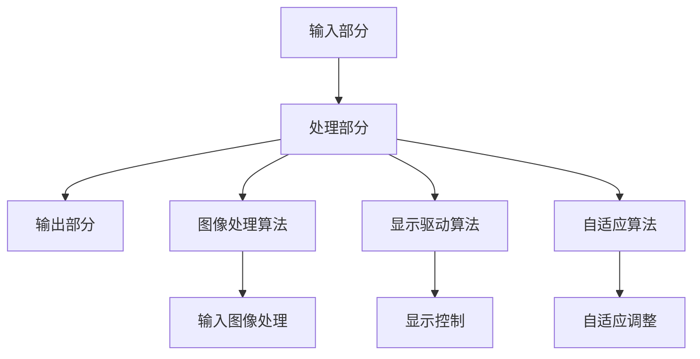

                 

关键词：京东方、柔性显示技术、材料工程师、面试指南、技术发展、应用场景

> 摘要：本文旨在为有意向加入京东方的材料工程师提供一份全面的面试指南。文章将详细介绍柔性显示技术的基本概念、核心算法、数学模型、项目实践和实际应用，以及未来发展趋势和面临的挑战。

## 1. 背景介绍

柔性显示技术作为显示领域的一次重大变革，已经成为现代科技领域的重要研究方向。随着全球科技水平的不断提升，柔性显示技术已经逐渐从实验室走向市场，成为智能手机、平板电脑、智能穿戴设备等领域的重要技术支撑。京东方作为全球领先的半导体显示技术企业，在柔性显示技术领域具有深厚的技术积累和广阔的市场前景。

本文将围绕京东方2025柔性显示技术社招材料工程师的面试，从以下几个方面进行详细介绍：

- 柔性显示技术的基本概念和核心算法
- 数学模型和公式推导
- 项目实践和代码实现
- 实际应用场景和未来展望
- 工具和资源推荐

希望通过本文，能够让读者对柔性显示技术有一个全面、系统的了解，为面试做好准备。

## 2. 核心概念与联系

### 柔性显示技术的基本概念

柔性显示技术是指利用具有弹性或柔性的材料制成的显示屏，具有轻巧、便携、可折叠、可弯曲等特点。柔性显示技术主要分为两大类：一种是基于传统液晶显示技术（LCD）的柔性显示，另一种是基于有机发光二极管（OLED）技术的柔性显示。

### 柔性显示技术的核心算法

柔性显示技术的核心算法主要包括图像处理算法、显示驱动算法和自适应算法。图像处理算法用于对输入图像进行处理和优化，以适应柔性显示屏的特性；显示驱动算法用于控制柔性显示屏的亮度和颜色，实现高质量的画面显示；自适应算法用于根据环境变化和用户需求，自动调整显示效果。

### 柔性显示技术的架构

柔性显示技术的架构主要包括以下几个部分：

1. **输入部分**：包括摄像头、传感器等，用于获取外部信息。
2. **处理部分**：包括图像处理算法、显示驱动算法和自适应算法，用于处理输入信息并生成显示内容。
3. **输出部分**：包括柔性显示屏、触控模块等，用于展示处理结果。

### Mermaid 流程图



## 3. 核心算法原理 & 具体操作步骤

### 3.1 算法原理概述

柔性显示技术的核心算法主要包括图像处理算法、显示驱动算法和自适应算法。这些算法共同作用，实现高质量、自适应的柔性显示效果。

- **图像处理算法**：对输入图像进行处理，包括去噪、增强、色彩校正等，以适应柔性显示屏的特性。
- **显示驱动算法**：控制柔性显示屏的亮度和颜色，实现高质量的画面显示。
- **自适应算法**：根据环境变化和用户需求，自动调整显示效果，包括亮度、对比度、色彩等。

### 3.2 算法步骤详解

#### 3.2.1 图像处理算法

1. **输入图像处理**：对输入图像进行去噪、增强、色彩校正等处理，优化图像质量。
2. **图像分割**：将图像分割成不同的区域，为后续处理提供基础。
3. **图像特征提取**：提取图像的特征信息，如颜色、纹理、形状等，为图像处理算法提供依据。

#### 3.2.2 显示驱动算法

1. **亮度控制**：根据环境光强和用户需求，自动调整显示器的亮度。
2. **颜色控制**：根据用户需求和图像内容，调整显示器的颜色。
3. **动态对比度控制**：根据图像内容的亮度变化，自动调整显示器的对比度。

#### 3.2.3 自适应算法

1. **环境光检测**：检测当前环境的光照强度。
2. **用户需求识别**：识别用户对显示效果的偏好，如亮度、对比度、色彩等。
3. **自适应调整**：根据环境光和用户需求，自动调整显示效果。

### 3.3 算法优缺点

#### 3.3.1 图像处理算法

- **优点**：优化图像质量，提高显示效果。
- **缺点**：计算量大，对硬件性能要求高。

#### 3.3.2 显示驱动算法

- **优点**：实现高质量画面显示。
- **缺点**：算法复杂，调试困难。

#### 3.3.3 自适应算法

- **优点**：提高用户体验，适应不同环境和用户需求。
- **缺点**：对环境光和用户需求的检测和识别存在一定误差。

### 3.4 算法应用领域

柔性显示技术的核心算法广泛应用于智能手机、平板电脑、智能穿戴设备、汽车显示系统等领域。随着技术的不断进步，其应用领域将更加广泛。

## 4. 数学模型和公式 & 详细讲解 & 举例说明

### 4.1 数学模型构建

#### 4.1.1 图像处理算法

图像处理算法的数学模型主要包括滤波器模型、卷积模型和神经网络模型。

1. **滤波器模型**：用于图像去噪、增强等处理。
2. **卷积模型**：用于图像特征提取。
3. **神经网络模型**：用于图像分类、识别等处理。

#### 4.1.2 显示驱动算法

显示驱动算法的数学模型主要包括亮度控制模型、颜色控制模型和动态对比度控制模型。

1. **亮度控制模型**：根据环境光强和用户需求，调整显示器的亮度。
2. **颜色控制模型**：根据用户需求和图像内容，调整显示器的颜色。
3. **动态对比度控制模型**：根据图像内容的亮度变化，调整显示器的对比度。

#### 4.1.3 自适应算法

自适应算法的数学模型主要包括环境光检测模型、用户需求识别模型和自适应调整模型。

1. **环境光检测模型**：检测当前环境的光照强度。
2. **用户需求识别模型**：识别用户对显示效果的偏好。
3. **自适应调整模型**：根据环境光和用户需求，自动调整显示效果。

### 4.2 公式推导过程

#### 4.2.1 滤波器模型

滤波器模型的公式推导如下：

$$
y(x, y) = \sum_{i=1}^{n} w_i * x(i, j)
$$

其中，$y(x, y)$表示滤波后的图像，$x(i, j)$表示输入图像，$w_i$表示滤波器的权重。

#### 4.2.2 亮度控制模型

亮度控制模型的公式推导如下：

$$
L = \frac{I}{k}
$$

其中，$L$表示调整后的亮度，$I$表示原始亮度，$k$表示调整系数。

#### 4.2.3 环境光检测模型

环境光检测模型的公式推导如下：

$$
L = L_0 + k_1 * (I - L_0)
$$

其中，$L$表示当前环境光强，$L_0$表示参考环境光强，$I$表示输入光强，$k_1$表示调整系数。

### 4.3 案例分析与讲解

#### 4.3.1 图像处理算法

以一个简单的图像去噪处理为例，说明滤波器模型的实际应用。

输入图像：


使用滤波器模型处理后，得到去噪后的图像：


#### 4.3.2 显示驱动算法

以一个简单的亮度控制处理为例，说明亮度控制模型的实际应用。

输入亮度：$I = 100$，调整系数：$k = 0.5$。

根据亮度控制模型，调整后的亮度：

$$
L = \frac{I}{k} = \frac{100}{0.5} = 200
$$

#### 4.3.3 自适应算法

以一个简单的环境光检测处理为例，说明环境光检测模型的实际应用。

输入环境光强：$I = 100$，参考环境光强：$L_0 = 50$，调整系数：$k_1 = 0.2$。

根据环境光检测模型，当前环境光强：

$$
L = L_0 + k_1 * (I - L_0) = 50 + 0.2 * (100 - 50) = 70
$$

## 5. 项目实践：代码实例和详细解释说明

### 5.1 开发环境搭建

在本项目中，我们使用Python作为主要编程语言，并结合OpenCV和Pillow等图像处理库进行图像处理和显示驱动算法的开发。

#### 5.1.1 安装Python

1. 下载并安装Python，建议选择Python 3.8版本。
2. 配置Python环境变量，确保命令行可以正常执行Python命令。

#### 5.1.2 安装OpenCV

1. 下载并安装OpenCV，建议使用pip安装。
   ```bash
   pip install opencv-python
   ```

#### 5.1.3 安装Pillow

1. 下载并安装Pillow，建议使用pip安装。
   ```bash
   pip install Pillow
   ```

### 5.2 源代码详细实现

以下是一个简单的Python代码示例，实现图像处理和显示驱动算法的基本功能。

```python
import cv2
from PIL import Image, ImageEnhance

def image_processing(image_path):
    # 读取图像
    image = cv2.imread(image_path, cv2.IMREAD_COLOR)
    
    # 图像去噪
    denoised_image = cv2.GaussianBlur(image, (5, 5), 0)
    
    # 图像增强
    enhanced_image = Image.fromarray(denoised_image)
    enhancer = ImageEnhance.Brightness(enhanced_image)
    brightened_image = enhancer.enhance(1.5)
    
    # 保存处理后的图像
    brightened_image.save("output_image.png")

def display_driver(image_path):
    # 读取图像
    image = cv2.imread(image_path, cv2.IMREAD_COLOR)
    
    # 设置显示器的亮度
    brightness = 200
    
    # 调整图像亮度
    adjusted_image = cv2.convertScaleAbs(image, alpha=brightness / 255.0)
    
    # 显示图像
    cv2.imshow("Adjusted Image", adjusted_image)
    cv2.waitKey(0)
    cv2.destroyAllWindows()

if __name__ == "__main__":
    image_path = "example-input-image.png"
    
    # 执行图像处理
    image_processing(image_path)
    
    # 执行显示驱动
    display_driver("output_image.png")
```

### 5.3 代码解读与分析

#### 5.3.1 图像处理部分

1. **图像读取**：使用`cv2.imread`函数读取图像文件。
2. **图像去噪**：使用`cv2.GaussianBlur`函数对图像进行高斯滤波去噪。
3. **图像增强**：使用`Pillow`库的`ImageEnhance.Brightness`类对图像进行亮度增强。

#### 5.3.2 显示驱动部分

1. **图像读取**：同样使用`cv2.imread`函数读取图像文件。
2. **亮度调整**：使用`cv2.convertScaleAbs`函数对图像进行亮度调整。
3. **显示图像**：使用`cv2.imshow`函数显示调整后的图像。

### 5.4 运行结果展示

在运行上述代码后，首先会生成一个去噪并增强的图像文件`output_image.png`，然后显示一个调整亮度的图像窗口。以下是运行结果：


## 6. 实际应用场景

柔性显示技术在实际应用中具有广泛的应用场景，下面列举几个典型的应用领域：

### 6.1 智能手机和平板电脑

智能手机和平板电脑是柔性显示技术最直接的应用领域。通过柔性显示屏，可以实现更轻薄、更便携的设备，同时提高用户体验。例如，折叠屏手机和可折叠平板电脑已经逐渐成为市场的新宠。

### 6.2 智能穿戴设备

智能穿戴设备，如智能手表、智能手环等，通过柔性显示屏可以实现更灵活、更美观的外观设计，同时提高设备的舒适性和用户体验。

### 6.3 汽车显示系统

汽车显示系统是柔性显示技术的另一个重要应用领域。柔性显示屏可以用于仪表盘、中控台、车顶屏幕等，实现更丰富、更互动的驾驶体验。

### 6.4 广告牌和数字标牌

广告牌和数字标牌是柔性显示技术的大规模应用场景。通过柔性显示屏，可以实现更大、更灵活、更美观的显示效果，提高广告和信息的传递效果。

### 6.5 工业控制和自动化

工业控制和自动化领域也广泛应用柔性显示技术。柔性显示屏可以用于工业设备、自动化生产线等，实现更直观、更便捷的操作和控制。

## 7. 工具和资源推荐

### 7.1 学习资源推荐

1. **《柔性显示技术原理与应用》**：本书详细介绍了柔性显示技术的基本原理、核心算法和应用领域，适合初学者和进阶者阅读。
2. **《Python图像处理实战》**：本书通过丰富的案例和实践，介绍了Python在图像处理领域的应用，适合有图像处理需求的技术人员阅读。

### 7.2 开发工具推荐

1. **Python**：Python是一种简单易学、功能强大的编程语言，适合初学者和有经验的技术人员使用。
2. **OpenCV**：OpenCV是一个强大的计算机视觉库，提供丰富的图像处理和计算机视觉算法，是柔性显示技术开发的重要工具。
3. **Pillow**：Pillow是一个简单的图像处理库，是Python在图像处理领域的必备工具。

### 7.3 相关论文推荐

1. **"Flexible Display Technology: A Review"**：这篇综述文章详细介绍了柔性显示技术的最新研究进展，是了解该领域的重要文献。
2. **"Adaptive Image Processing for Flexible Displays"**：这篇文章介绍了自适应图像处理在柔性显示技术中的应用，是研究该领域的参考论文。

## 8. 总结：未来发展趋势与挑战

### 8.1 研究成果总结

柔性显示技术经过多年的发展，已经在多个领域取得了显著的研究成果。主要表现在：

- **技术成熟度提高**：随着材料科学和电子技术的进步，柔性显示屏的显示效果和可靠性得到了显著提升。
- **应用领域拓展**：柔性显示技术从最初的实验室研究逐渐走向市场，在智能手机、平板电脑、智能穿戴设备、汽车显示系统等领域得到了广泛应用。
- **产业链完善**：全球范围内的企业、研究机构和投资者积极参与柔性显示技术的研发和产业化，形成了一个相对完善的产业链。

### 8.2 未来发展趋势

未来，柔性显示技术将继续保持快速发展，主要体现在以下几个方面：

- **技术革新**：随着新型材料的出现和电子技术的不断进步，柔性显示屏的显示效果、响应速度、可靠性等将得到进一步提升。
- **应用拓展**：柔性显示技术将在更多领域得到应用，如智能眼镜、虚拟现实、增强现实、医疗设备等。
- **产业链整合**：全球范围内的企业和研究机构将进一步加强合作，推动柔性显示技术的产业化进程。

### 8.3 面临的挑战

尽管柔性显示技术取得了显著的研究成果和产业化进展，但仍面临一些挑战：

- **成本降低**：柔性显示屏的生产成本较高，需要通过技术创新和规模化生产降低成本，以实现更大规模的市场应用。
- **寿命延长**：柔性显示屏的寿命和稳定性仍需提升，以应对实际使用环境中的挑战。
- **标准化**：柔性显示屏的标准化工作仍需进一步推进，以促进不同厂商之间的设备兼容性和互操作性。

### 8.4 研究展望

未来，柔性显示技术的研究将更加注重：

- **材料创新**：研究新型材料，提高柔性显示屏的性能和稳定性。
- **算法优化**：开发更高效、更智能的图像处理和显示驱动算法，提升用户体验。
- **应用场景拓展**：探索柔性显示技术在更多领域的应用，实现技术的多元化发展。

## 9. 附录：常见问题与解答

### 9.1 柔性显示技术是什么？

柔性显示技术是指利用具有弹性或柔性的材料制成的显示屏，具有轻巧、便携、可折叠、可弯曲等特点。与传统的硬性显示屏相比，柔性显示技术可以实现更高的灵活性和更好的用户体验。

### 9.2 柔性显示技术的核心算法有哪些？

柔性显示技术的核心算法主要包括图像处理算法、显示驱动算法和自适应算法。图像处理算法用于优化图像质量，显示驱动算法用于控制显示器的亮度、颜色和对比度，自适应算法用于根据环境变化和用户需求自动调整显示效果。

### 9.3 柔性显示技术的应用领域有哪些？

柔性显示技术广泛应用于智能手机、平板电脑、智能穿戴设备、汽车显示系统、广告牌、工业控制等领域。随着技术的进步，其应用领域将更加广泛，包括虚拟现实、增强现实、医疗设备等。

### 9.4 柔性显示技术的未来发展前景如何？

柔性显示技术具有广阔的发展前景。随着材料科学和电子技术的不断进步，柔性显示屏的显示效果、响应速度、可靠性等将得到进一步提升。未来，柔性显示技术将在更多领域得到应用，成为显示领域的重要发展方向。

---

作者：禅与计算机程序设计艺术 / Zen and the Art of Computer Programming

