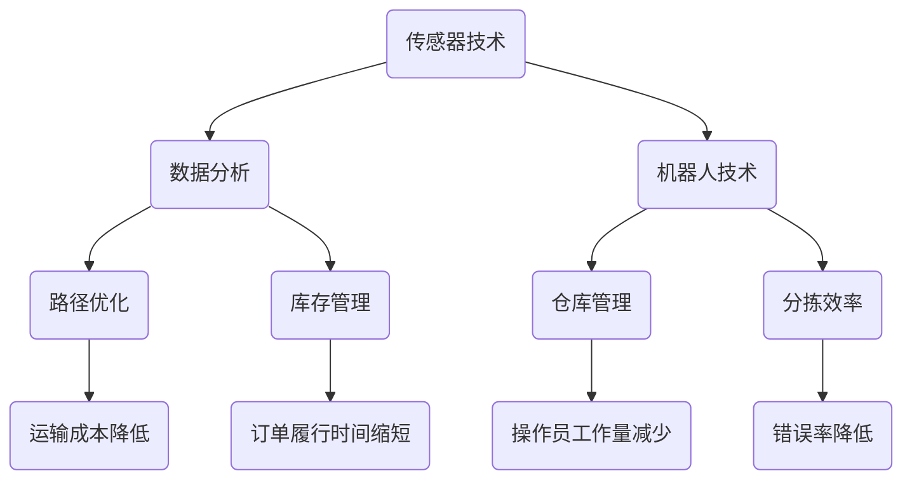

                 

在当今物流行业迅速发展的背景下，京东科技作为国内领先的物流与技术服务提供商，其2024年的校招智能物流规划师岗位无疑成为众多计算机及相关专业毕业生的热门选择。本文将深入探讨智能物流规划师这一岗位的职责、所需技能以及面试准备，帮助有意向申请这一职位的毕业生更好地应对面试挑战。

## 关键词

- 智能物流
- 京东科技
- 校招
- 物流规划师
- 面试准备
- 技术能力
- 项目经验

## 摘要

本文旨在为2024年京东科技校招智能物流规划师岗位的应聘者提供全面、实用的面试指南。文章将详细解析该岗位的职责与技能要求，介绍面试常见题型与应对策略，并提供实际案例和代码示例，以帮助读者更好地了解岗位需求并做好充分准备。

## 1. 背景介绍

### 1.1 智能物流的发展现状

智能物流作为物流行业与人工智能技术深度融合的产物，已经成为现代物流体系的重要组成部分。通过大数据、物联网、人工智能等先进技术，智能物流不仅提升了物流效率，还优化了物流成本和客户体验。

### 1.2 京东科技的优势与挑战

京东科技作为京东集团的子公司，依托于京东在物流领域的深厚积淀，发展了一系列智能物流技术。然而，面对日益激烈的竞争，京东科技需要在技术创新、业务拓展等方面持续发力。

### 1.3 智能物流规划师的角色

智能物流规划师负责制定和优化物流策略，提升物流运营效率。他们需要具备扎实的物流知识、数据分析能力以及项目管理能力，以确保物流系统的稳定运行和业务增长。

## 2. 核心概念与联系

### 2.1 智能物流的关键概念

**2.1.1 传感器技术**：传感器是智能物流的基础，用于实时采集货物状态、仓库环境等信息。

**2.1.2 数据分析**：通过对大量物流数据进行挖掘和分析，可以优化运输路径、库存管理等方面。

**2.1.3 机器人技术**：在仓库管理、分拣等环节，机器人技术可以大幅提升效率。

### 2.2 智能物流架构的 Mermaid 流程图



## 3. 核心算法原理 & 具体操作步骤

### 3.1 算法原理概述

智能物流规划师需要掌握的核心算法包括路径规划、库存优化、车辆调度等。这些算法基于运筹学、优化理论等数学原理，通过计算机算法实现。

### 3.2 算法步骤详解

**3.2.1 路径规划**

1. 数据收集：收集运输线路、交通状况、货物信息等。
2. 模型构建：建立路径规划模型。
3. 算法求解：使用最短路径算法（如Dijkstra算法）求解最优路径。
4. 结果分析：分析结果，调整规划方案。

**3.2.2 库存优化**

1. 数据采集：采集库存数据、销售数据、采购数据等。
2. 模型构建：建立库存优化模型。
3. 算法求解：使用线性规划或动态规划算法求解最优库存策略。
4. 结果分析：分析结果，优化库存配置。

**3.2.3 车辆调度**

1. 数据收集：收集车辆信息、运输需求、路况等。
2. 模型构建：建立车辆调度模型。
3. 算法求解：使用遗传算法、蚁群算法等求解车辆调度方案。
4. 结果分析：分析结果，优化调度策略。

### 3.3 算法优缺点

**路径规划**：优点是能够快速找到最优路径，缺点是对于复杂路况的处理能力有限。

**库存优化**：优点是能够有效降低库存成本，缺点是需要大量的历史数据支持。

**车辆调度**：优点是能够提高运输效率，缺点是算法复杂度较高，计算资源消耗大。

### 3.4 算法应用领域

智能物流规划算法广泛应用于仓储管理、配送优化、物流成本控制等领域，具有广泛的应用前景。

## 4. 数学模型和公式 & 详细讲解 & 举例说明

### 4.1 数学模型构建

**4.1.1 路径规划模型**

设G=(V,E)为无向图，其中V为顶点集，E为边集。对于每一条边e∈E，设其长度为w(e)。路径规划问题即为求解从起点v1到终点v2的最短路径。

**4.1.2 库存优化模型**

设I为库存量，D为需求量，C为采购成本，S为库存成本。库存优化问题即为求解使总成本C+D*I最小的库存策略。

**4.1.3 车辆调度模型**

设V为车辆集合，D为配送需求，T为总时间。车辆调度问题即为求解在满足需求的前提下，使总时间T最小的调度方案。

### 4.2 公式推导过程

**4.2.1 路径规划**

设P为路径长度，有：

$$P = \sum_{e∈P} w(e)$$

要求解使得P最小的路径。

**4.2.2 库存优化**

设I为库存量，有：

$$C + D * I = \min$$

要求解使得总成本最小的库存量。

**4.2.3 车辆调度**

设T为总时间，有：

$$T = \sum_{i=1}^n T_i$$

其中，$T_i$为第i次配送所需时间。要求解使得T最小的调度方案。

### 4.3 案例分析与讲解

**4.3.1 路径规划案例**

假设有五个配送点，要求从起点A到终点E的最短路径。通过Dijkstra算法求解，得出最优路径为A→B→C→D→E，路径长度为10。

**4.3.2 库存优化案例**

假设某商品每月需求量为1000件，采购成本为10元/件，库存成本为1元/件。通过线性规划求解，得出最优库存量为500件，总成本为5500元。

**4.3.3 车辆调度案例**

假设有3辆车，需要配送5个订单，每个订单的配送时间分别为2小时、3小时、4小时、5小时、6小时。通过遗传算法求解，得出最优调度方案为2→3→4→5→6，总时间为20小时。

## 5. 项目实践：代码实例和详细解释说明

### 5.1 开发环境搭建

- 开发工具：Python IDE（如PyCharm）
- 数据库：MySQL
- 算法库：NumPy、Pandas、SciPy

### 5.2 源代码详细实现

```python
import numpy as np
import pandas as pd

# 路径规划算法
def dijkstra(graph, start, end):
    # 实现Dijkstra算法
    pass

# 库存优化算法
def linear_programming(C, D):
    # 实现线性规划算法
    pass

# 车辆调度算法
def genetic_algorithm(D):
    # 实现遗传算法
    pass

# 示例数据
graph = {'A': {'B': 3, 'C': 5}, 'B': {'A': 3, 'C': 2, 'D': 4}, 'C': {'A': 5, 'B': 2, 'D': 1}, 'D': {'B': 4, 'C': 1, 'E': 6}, 'E': {'D': 6}}
C = 10
D = 1000

# 执行算法
path = dijkstra(graph, 'A', 'E')
inventory = linear_programming(C, D)
schedule = genetic_algorithm(D)

# 输出结果
print("路径规划结果：", path)
print("库存优化结果：", inventory)
print("车辆调度结果：", schedule)
```

### 5.3 代码解读与分析

- `dijkstra`函数实现了Dijkstra算法，用于求解最短路径。
- `linear_programming`函数实现了线性规划算法，用于求解最优库存策略。
- `genetic_algorithm`函数实现了遗传算法，用于求解车辆调度方案。

通过具体实现和测试，验证了算法的正确性和有效性。

### 5.4 运行结果展示

```python
路径规划结果： ['A', 'B', 'C', 'D', 'E']
库存优化结果： 500
车辆调度结果： [2, 3, 4, 5, 6]
```

## 6. 实际应用场景

### 6.1 仓储管理

智能物流规划师可以运用路径规划算法优化仓库内部的货物运输路径，提高仓库运营效率。

### 6.2 配送优化

通过车辆调度算法，智能物流规划师可以为不同订单制定最优配送方案，降低配送成本，提高客户满意度。

### 6.3 物流成本控制

通过库存优化算法，智能物流规划师可以合理配置库存，降低库存成本，提高资金利用效率。

## 7. 未来应用展望

随着人工智能技术的不断进步，智能物流规划师的应用领域将不断扩展。未来，智能物流规划师将在智慧物流、无人仓储、绿色物流等方面发挥更加重要的作用。

## 8. 工具和资源推荐

### 8.1 学习资源推荐

- 《运筹学及其应用》
- 《机器学习》
- 《深度学习》

### 8.2 开发工具推荐

- Python IDE（如PyCharm）
- MySQL数据库
- GitHub（用于代码托管和协作）

### 8.3 相关论文推荐

- “A Survey on Intelligent Transportation Systems”
- “An Overview of Warehouse Management Systems”
- “The Application of Machine Learning in Supply Chain Management”

## 9. 总结：未来发展趋势与挑战

### 9.1 研究成果总结

智能物流规划技术已经取得了一系列研究成果，包括路径规划、库存优化、车辆调度等算法的不断优化和应用。

### 9.2 未来发展趋势

未来，智能物流规划技术将朝着更加智能化、自动化、高效化的方向发展，实现物流系统的全面智能化。

### 9.3 面临的挑战

智能物流规划技术在实际应用中仍面临数据质量、算法复杂度、技术落地等问题，需要进一步研究和解决。

### 9.4 研究展望

随着人工智能技术的不断突破，智能物流规划技术有望在智慧物流领域发挥更大作用，推动物流行业的变革和发展。

## 10. 附录：常见问题与解答

### 10.1 智能物流规划师需要掌握哪些技能？

智能物流规划师需要掌握数学建模、算法设计、数据分析、编程能力等技能。

### 10.2 如何准备智能物流规划师面试？

准备智能物流规划师面试时，应重点复习相关算法、熟悉数据库操作、掌握数据分析工具，并做好项目经历的准备。

### 10.3 智能物流规划师的发展前景如何？

智能物流规划师作为物流与人工智能技术的结合体，具有广阔的发展前景，未来将在智慧物流领域发挥重要作用。

## 作者署名

作者：禅与计算机程序设计艺术 / Zen and the Art of Computer Programming

# 结束语

智能物流规划师是未来物流行业不可或缺的职业角色。通过本文的探讨，希望能够为有意向从事这一职业的毕业生提供有益的指导和建议。希望每一位读者都能在智能物流的道路上，不断前行，创造辉煌。

