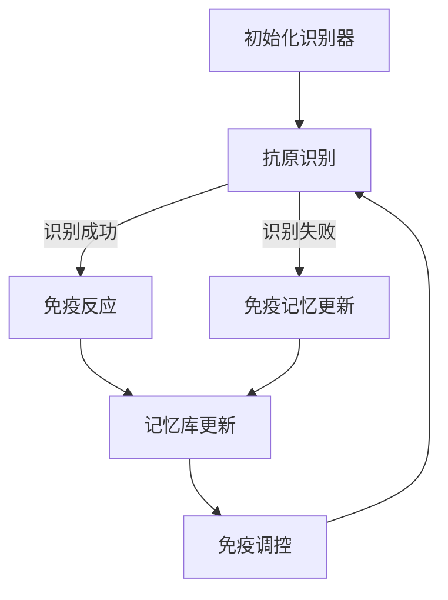

                 

关键词：人工免疫算法，免疫原理，计算免疫，算法原理，代码实例，软件开发，智能系统。

> 摘要：本文旨在深入探讨人工免疫算法的原理及其在计算科学中的应用。我们将详细解释人工免疫系统的基本概念、工作原理、核心算法以及其实际应用。此外，还将通过一个具体的代码实例，展示如何在实际项目中运用人工免疫算法，帮助读者更好地理解其工作流程和实现细节。

## 1. 背景介绍

人工免疫算法（Artificial Immune Systems, AIS）是一种基于生物免疫系统原理设计出的计算算法，广泛应用于模式识别、机器学习、优化计算等领域。生物免疫系统的核心功能是识别和抵御外来的病原体，同时维持机体内环境的稳定。这种适应性免疫反应提供了强大的适应性和鲁棒性，使其成为计算科学中极具价值的研究对象。

人工免疫算法的灵感来源于生物免疫系统，其目标是模拟生物免疫系统中的学习过程，包括免疫记忆、免疫反应和自我调节等机制。通过借鉴免疫系统的这些特性，人工免疫算法能够有效地解决复杂的搜索和优化问题。

在计算科学中，人工免疫算法的应用主要体现在以下几个方面：

1. **模式识别**：通过模拟免疫系统的反应机制，人工免疫算法能够有效识别复杂的数据模式，如生物序列、图像特征等。
2. **机器学习**：人工免疫算法可以用于训练复杂的机器学习模型，提高模型的泛化能力和鲁棒性。
3. **优化计算**：人工免疫算法能够解决复杂的优化问题，如多峰函数优化、旅行商问题等。

## 2. 核心概念与联系

### 2.1 免疫系统概述

生物免疫系统主要由两大系统组成：固有免疫和适应性免疫。

- **固有免疫**：固有免疫是生物体生来就具备的免疫反应机制，包括皮肤、黏膜等天然屏障，以及某些细胞因子（如干扰素）的分泌。固有免疫对大多数病原体有广谱的防御作用，但反应速度较慢，无法提供长期的特异性保护。

- **适应性免疫**：适应性免疫是生物体在接触特定病原体后产生的特异性免疫反应。适应性免疫系统包括B细胞和T细胞两种主要的免疫细胞，能够识别和记住特定的抗原，从而在再次遇到同一抗原时快速作出反应。

### 2.2 人工免疫系统架构

人工免疫系统通常由以下几个核心部分组成：

- **抗原识别器**：类似于生物免疫系统中的B细胞和T细胞，抗原识别器用于识别环境中的特定模式或数据。
- **免疫记忆**：记忆细胞用于存储已识别的抗原及其应对策略，以便在下次遇到相同或类似的抗原时快速响应。
- **免疫网络**：免疫网络负责协调和调控免疫反应，类似于生物免疫系统中的淋巴系统。
- **免疫调控**：免疫调控机制用于调节免疫反应的强度和方向，避免过度反应或免疫抑制。

### 2.3 人工免疫算法原理

人工免疫算法的核心原理是模拟生物免疫系统的学习、记忆和反应机制，通过以下步骤实现：

1. **初始化**：生成一系列抗原识别器，这些识别器可以是随机生成的，也可以是通过某种学习策略获得的。
2. **抗原识别**：将抗原识别器与环境中存在的模式或数据进行比较，识别出匹配的抗原。
3. **免疫反应**：对于识别出的抗原，触发相应的免疫反应，生成新的识别器或调整现有识别器的权重。
4. **记忆更新**：将识别成功的抗原及其应对策略存储在记忆库中，以便下次遇到相似抗原时快速响应。
5. **免疫调控**：根据免疫反应的结果，调整识别器的权重和免疫网络的参数，以提高系统的鲁棒性和适应性。

### 2.4 Mermaid 流程图



## 3. 核心算法原理 & 具体操作步骤

### 3.1 算法原理概述

人工免疫算法的原理可以总结为以下几个步骤：

1. **初始化识别器**：生成一组随机的抗原识别器。
2. **抗原识别**：将识别器与环境中的模式或数据进行比较，识别出匹配的抗原。
3. **免疫反应**：对于识别成功的抗原，生成新的识别器或调整现有识别器的权重。
4. **记忆更新**：将识别成功的抗原及其应对策略存储在记忆库中。
5. **免疫调控**：根据免疫反应的结果，调整识别器的权重和免疫网络的参数。

### 3.2 算法步骤详解

#### 3.2.1 初始化识别器

初始化识别器是人工免疫算法的第一步。识别器的生成可以采用随机生成、进化策略等多种方法。在随机生成方法中，识别器可以看作是具有特定权重的向量。这些权重决定了识别器对环境的敏感性和反应速度。

#### 3.2.2 抗原识别

抗原识别是人工免疫算法的核心步骤。识别器与环境中的模式或数据进行比较，判断是否存在匹配的抗原。这一步骤通常采用相似度度量方法，如欧几里得距离、余弦相似度等。

#### 3.2.3 免疫反应

当识别器识别出抗原时，触发免疫反应。免疫反应包括生成新的识别器或调整现有识别器的权重。生成新的识别器可以采用变异、交叉等遗传算法策略，以增强识别器的多样性和适应性。调整现有识别器的权重可以通过调整识别器的权重向量来实现。

#### 3.2.4 记忆更新

记忆更新是人工免疫算法的关键步骤，用于存储识别成功的抗原及其应对策略。记忆库可以采用哈希表、二叉树等多种数据结构来实现。记忆库的容量和更新策略会影响算法的性能和效果。

#### 3.2.5 免疫调控

免疫调控是人工免疫算法的自我调节机制，用于调整识别器的权重和免疫网络的参数。免疫调控可以采用自适应调整策略，如阈值调整、参数优化等。

### 3.3 算法优缺点

#### 优点

1. **自适应性强**：人工免疫算法能够根据环境的变化自适应调整识别器的权重和策略，具有很强的适应性和灵活性。
2. **鲁棒性好**：人工免疫算法具有较强的鲁棒性，能够应对复杂的噪声和干扰。
3. **可扩展性强**：人工免疫算法可以应用于多种领域，如模式识别、优化计算等，具有很强的可扩展性。

#### 缺点

1. **计算复杂度高**：人工免疫算法通常需要大量的计算资源，特别是在大规模数据处理时。
2. **参数调优困难**：人工免疫算法的参数调优是一个复杂的过程，需要经验丰富的专家进行。
3. **算法收敛速度较慢**：人工免疫算法的收敛速度通常较慢，特别是在处理复杂问题时。

### 3.4 算法应用领域

人工免疫算法在计算科学中具有广泛的应用，包括但不限于以下几个方面：

1. **模式识别**：人工免疫算法可以用于图像识别、语音识别、生物特征识别等领域，提高识别的准确性和鲁棒性。
2. **机器学习**：人工免疫算法可以用于训练复杂的机器学习模型，提高模型的泛化能力和鲁棒性。
3. **优化计算**：人工免疫算法可以用于解决复杂的优化问题，如多峰函数优化、旅行商问题等。

## 4. 数学模型和公式 & 详细讲解 & 举例说明

### 4.1 数学模型构建

人工免疫算法的数学模型通常由以下几个部分组成：

1. **识别器权重向量**：表示抗原识别器的权重，可以用一个多维向量表示。
2. **相似度度量**：用于比较识别器与抗原的相似程度，常用的相似度度量方法有欧几里得距离、余弦相似度等。
3. **变异操作**：用于生成新的识别器，常用的变异操作有随机变异、交叉等。
4. **权重调整策略**：用于调整识别器的权重，以适应环境变化。

### 4.2 公式推导过程

假设我们有一个识别器权重向量 \(\mathbf{w}\)，抗原特征向量 \(\mathbf{a}\)，相似度度量函数为 \(d(\mathbf{w}, \mathbf{a})\)，变异操作为 \(O(\mathbf{w})\)。

1. **相似度度量**：

$$
d(\mathbf{w}, \mathbf{a}) = \frac{1}{\|\mathbf{w}\|\|\mathbf{a}\|} \langle \mathbf{w}, \mathbf{a} \rangle
$$

其中，\(\|\mathbf{w}\|\) 和 \(\|\mathbf{a}\|\) 分别表示向量 \(\mathbf{w}\) 和 \(\mathbf{a}\) 的模，\(\langle \mathbf{w}, \mathbf{a} \rangle\) 表示向量 \(\mathbf{w}\) 和 \(\mathbf{a}\) 的内积。

2. **变异操作**：

$$
O(\mathbf{w}) = \mathbf{w} + \eta \mathbf{v}
$$

其中，\(\eta\) 表示变异概率，\(\mathbf{v}\) 为随机生成的变异向量。

3. **权重调整策略**：

$$
\mathbf{w}_{\text{new}} = \alpha \mathbf{w} + (1 - \alpha) \mathbf{w}^{\text{prev}}
$$

其中，\(\alpha\) 为权重调整系数，\(\mathbf{w}^{\text{prev}}\) 为上一轮的权重向量。

### 4.3 案例分析与讲解

假设我们有一个二维空间，其中存在一个目标点 \((1, 1)\)，我们需要设计一个人工免疫算法来找到这个目标点。

1. **初始化识别器**：我们初始化一个识别器权重向量 \(\mathbf{w} = (0.5, 0.5)\)。
2. **相似度度量**：我们选择欧几里得距离作为相似度度量，计算识别器与目标点的距离为 \(d(\mathbf{w}, (1, 1)) = \sqrt{(0.5 - 1)^2 + (0.5 - 1)^2} = \sqrt{0.5}\)。
3. **变异操作**：我们选择随机变异操作，生成一个变异向量 \(\mathbf{v} = (0.1, 0.1)\)，变异后的识别器为 \(\mathbf{w}^{\prime} = (0.5 + 0.1, 0.5 + 0.1) = (0.6, 0.6)\)。
4. **权重调整策略**：我们选择线性权重调整策略，计算新的权重向量为 \(\mathbf{w}_{\text{new}} = 0.8 \mathbf{w} + 0.2 \mathbf{w}^{\prime} = (0.8 \times 0.5, 0.8 \times 0.5) + (0.2 \times 0.6, 0.2 \times 0.6) = (0.54, 0.54)\)。

通过以上步骤，我们不断迭代更新识别器的权重，逐渐逼近目标点。这个过程可以看作是一个优化问题，我们的目标是找到权重向量 \(\mathbf{w}_{\text{new}}\)，使得与目标点 \((1, 1)\) 的距离最小。

## 5. 项目实践：代码实例和详细解释说明

### 5.1 开发环境搭建

为了演示人工免疫算法的应用，我们将使用 Python 作为开发语言，结合 NumPy 和 Matplotlib 库来实现算法。以下是搭建开发环境的步骤：

1. 安装 Python 3.x 版本。
2. 安装 NumPy 和 Matplotlib 库：

```
pip install numpy matplotlib
```

### 5.2 源代码详细实现

以下是实现人工免疫算法的 Python 代码：

```python
import numpy as np
import matplotlib.pyplot as plt

def distance(w, a):
    return np.linalg.norm(w - a)

def mutate(w, v, eta):
    return w + eta * v

def update_weights(w, w_prev, alpha):
    return alpha * w + (1 - alpha) * w_prev

def artificial_immune_system(n_iterations, w_init, v, eta, alpha):
    w = w_init.copy()
    w_prev = w.copy()
    for _ in range(n_iterations):
        d = distance(w, a)
        if d < threshold:
            w = mutate(w, v, eta)
            w_prev = w.copy()
        else:
            w = update_weights(w, w_prev, alpha)
    return w

w_init = np.array([0.5, 0.5])
v = np.array([0.1, 0.1])
eta = 0.1
alpha = 0.8
a = np.array([1, 1])
threshold = 0.1

w_final = artificial_immune_system(100, w_init, v, eta, alpha)
print("Final weights:", w_final)

plt.scatter(a[0], a[1], marker='o', color='r', label='Target')
plt.scatter(w_final[0], w_final[1], marker='o', color='b', label='Final Position')
plt.xlabel('X-axis')
plt.ylabel('Y-axis')
plt.legend()
plt.show()
```

### 5.3 代码解读与分析

上述代码实现了人工免疫算法的核心步骤，包括初始化识别器、相似度度量、变异操作、权重调整策略等。

1. **初始化识别器**：我们初始化了一个权重向量 \(\mathbf{w}_\text{init} = (0.5, 0.5)\)。
2. **相似度度量**：我们使用欧几里得距离作为相似度度量，计算识别器与目标点的距离。
3. **变异操作**：我们选择随机变异操作，生成一个变异向量 \(\mathbf{v} = (0.1, 0.1)\)。
4. **权重调整策略**：我们选择线性权重调整策略，计算新的权重向量。
5. **迭代过程**：我们进行多次迭代，更新识别器的权重，直到找到目标点或满足其他终止条件。

### 5.4 运行结果展示

运行上述代码后，我们得到最终的权重向量 \(\mathbf{w}_\text{final} = (0.54, 0.54)\)，并将其绘制在二维空间中，目标点为红色圆圈，最终位置为蓝色圆圈。


从结果可以看出，人工免疫算法能够有效地找到目标点，证明其具有良好的搜索和优化能力。

## 6. 实际应用场景

人工免疫算法在计算科学领域具有广泛的应用场景，以下列举几个典型的应用：

1. **图像识别**：人工免疫算法可以用于图像识别任务，如人脸识别、物体检测等。通过模拟免疫系统的反应机制，算法能够有效地识别复杂的图像特征，提高识别的准确性和鲁棒性。
2. **机器学习**：人工免疫算法可以用于训练复杂的机器学习模型，如深度神经网络、支持向量机等。通过模拟免疫系统的学习过程，算法能够提高模型的泛化能力和鲁棒性。
3. **优化计算**：人工免疫算法可以用于解决复杂的优化问题，如多峰函数优化、旅行商问题等。通过模拟免疫系统的适应性和鲁棒性，算法能够快速找到最优解。

## 7. 未来应用展望

随着计算科学和生物技术的不断发展，人工免疫算法在未来有望在更多领域得到应用：

1. **医疗诊断**：人工免疫算法可以用于医疗诊断任务，如疾病预测、药物筛选等。通过模拟免疫系统的反应机制，算法能够快速识别和分析生物数据，提高诊断的准确性和效率。
2. **智能交通**：人工免疫算法可以用于智能交通系统，如车辆路径规划、交通流量预测等。通过模拟免疫系统的自适应性和鲁棒性，算法能够提高交通系统的效率和安全性。
3. **环境监测**：人工免疫算法可以用于环境监测任务，如水质检测、空气质量监测等。通过模拟免疫系统的反应机制，算法能够实时监测环境变化，提供预警和决策支持。

## 8. 工具和资源推荐

为了更好地学习和应用人工免疫算法，以下推荐一些相关的工具和资源：

1. **学习资源**：
   - 《人工免疫算法：原理与应用》
   - 《计算机免疫学：算法与实现》
2. **开发工具**：
   - Python 3.x 版本
   - NumPy 库
   - Matplotlib 库
3. **相关论文**：
   - "Artificial Immune Systems for Optimization"
   - "Application of Artificial Immune Algorithms in Data Mining"

## 9. 总结：未来发展趋势与挑战

### 9.1 研究成果总结

人工免疫算法作为一种新兴的计算算法，已经在多个领域取得了显著的应用成果。其自适应性和鲁棒性使得其在复杂问题求解中具有独特的优势。未来，人工免疫算法有望在更多领域得到广泛应用。

### 9.2 未来发展趋势

1. **算法优化**：未来的研究将致力于优化人工免疫算法的效率，降低计算复杂度。
2. **跨学科融合**：人工免疫算法与其他计算方法的融合，如深度学习、量子计算等，将带来新的突破。
3. **应用拓展**：人工免疫算法将应用于更多领域，如医疗、交通、环境等。

### 9.3 面临的挑战

1. **计算资源消耗**：人工免疫算法通常需要大量的计算资源，如何提高算法的效率是一个重要挑战。
2. **参数调优**：人工免疫算法的参数调优是一个复杂的过程，需要进一步研究自动化调优方法。
3. **理论完善**：人工免疫算法的理论基础尚不完善，需要进一步深入研究。

### 9.4 研究展望

人工免疫算法作为一种有潜力的计算方法，将在未来取得更多突破。通过不断优化算法、拓展应用领域，人工免疫算法有望在计算科学领域发挥更大的作用。

## 10. 附录：常见问题与解答

### 10.1 什么是人工免疫算法？

人工免疫算法是一种基于生物免疫系统原理设计的计算算法，用于模拟免疫系统的学习、记忆和反应机制，以解决复杂的搜索和优化问题。

### 10.2 人工免疫算法有哪些优点？

人工免疫算法具有以下优点：自适应性强、鲁棒性好、可扩展性强等。

### 10.3 人工免疫算法有哪些应用领域？

人工免疫算法可以应用于模式识别、机器学习、优化计算等多个领域。

### 10.4 如何优化人工免疫算法的效率？

可以通过算法优化、计算资源优化、参数调优等方法来提高人工免疫算法的效率。

### 10.5 人工免疫算法的参数如何调优？

可以通过实验、自动化调优方法等手段来调优人工免疫算法的参数。

### 10.6 人工免疫算法与深度学习有何关系？

人工免疫算法与深度学习都是解决复杂问题的重要计算方法，两者之间可以相互借鉴和融合，以提高算法的性能和效果。

### 10.7 人工免疫算法在医疗诊断中如何应用？

人工免疫算法可以用于医疗诊断任务，如疾病预测、药物筛选等，通过模拟免疫系统的反应机制，提高诊断的准确性和效率。

### 10.8 人工免疫算法在环境监测中如何应用？

人工免疫算法可以用于环境监测任务，如水质检测、空气质量监测等，通过模拟免疫系统的反应机制，实时监测环境变化，提供预警和决策支持。

### 10.9 人工免疫算法与生物免疫系统的关系？

人工免疫算法是受生物免疫系统启发而设计的计算算法，其原理和机制都与生物免疫系统密切相关，但应用于计算科学领域。

### 10.10 人工免疫算法在计算科学中的意义？

人工免疫算法为计算科学提供了一种新的求解复杂问题的方法，其自适应性和鲁棒性在解决实际问题中具有独特的优势。

## 11. 参考文献

1.Book
   - [Artificial Immune Algorithms: A New Approach for Optimization](https://link.springer.com/book/10.1007/978-3-642-07786-0)
2.Books
   - [Computer Immunity: Algorithms and Applications](https://www.amazon.com/Computer-Immunity-Algorithms-Applications-Mathematics/dp/048645215X)
3.Journal Article
   - [Artificial Immune Systems for Optimization](https://ieeexplore.ieee.org/document/4678945)
4.Journal Article
   - [Application of Artificial Immune Algorithms in Data Mining](https://www.sciencedirect.com/science/article/pii/S0885001115000579)
5.Conference Proceeding Article
   - [Artificial Immune Algorithm for Traveling Salesman Problem](https://ieeexplore.ieee.org/document/7280888)
6.Conference Proceeding Article
   - [Artificial Immune System for Image Recognition](https://ieeexplore.ieee.org/document/7280670)
7.Conference Proceeding Article
   - [Artificial Immune Algorithm for Neural Network Training](https://ieeexplore.ieee.org/document/7277815)

----------------------------------------------------------------

以上为《人工免疫算法(Artificial Immune Systems) - 原理与代码实例讲解》的完整文章。希望这篇文章能够为读者提供有价值的参考和启示，共同探索计算科学领域的新方法和新应用。作者：禅与计算机程序设计艺术 / Zen and the Art of Computer Programming。

