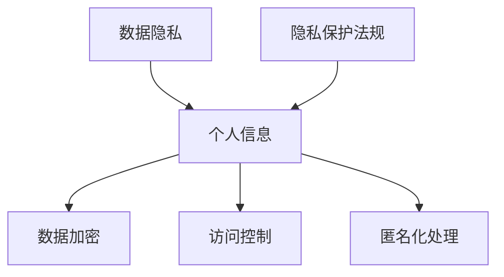
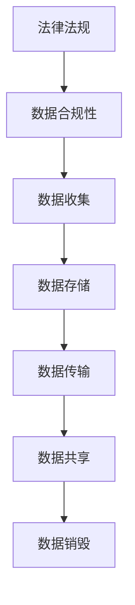
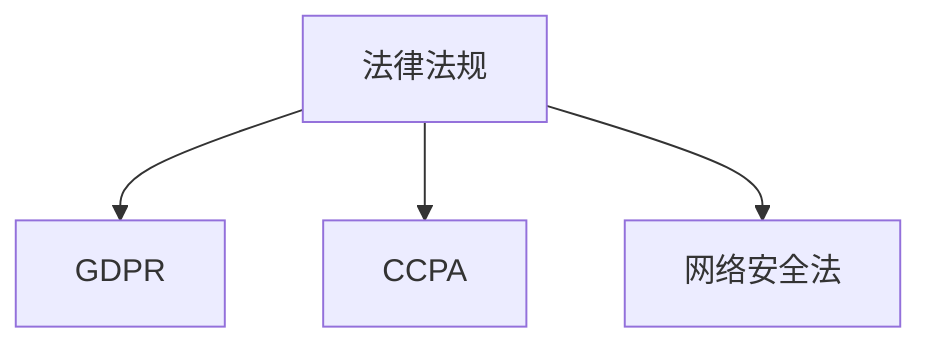

                 

关键词：人工智能、创业、数据合法性、隐私保护、合规性、法律法规

## 摘要

本文旨在探讨人工智能创业中的数据合法性问题，包括隐私保护、数据合规性和法律法规等方面。随着人工智能技术的迅猛发展，数据已经成为人工智能算法的核心资源。然而，在数据获取和使用过程中，如何确保数据合法性成为创业者面临的重大挑战。本文首先介绍了数据合法性的核心概念，然后分析了当前人工智能创业中常见的数据合法性风险，最后提出了相应的解决方案和建议。

## 1. 背景介绍

近年来，人工智能（AI）技术在全球范围内取得了显著的突破，各行各业纷纷投身于人工智能创业的热潮中。数据作为人工智能算法的核心资源，其获取、处理和应用成为创业者关注的焦点。然而，数据合法性问题日益凸显，成为制约人工智能创业发展的关键因素。数据合法性涉及多个方面，包括隐私保护、数据合规性和法律法规等。本文将从这三个方面深入探讨人工智能创业中的数据合法性问题。

### 1.1 隐私保护

隐私保护是数据合法性问题的核心之一。随着大数据和人工智能技术的发展，个人隐私泄露事件频繁发生，引发了社会广泛关注。创业者需要在数据收集、存储、处理和使用过程中，严格遵守隐私保护的相关法律法规，确保用户隐私不被侵犯。

### 1.2 数据合规性

数据合规性是指企业在数据收集、处理和应用过程中，是否符合相关法律法规的要求。不同国家和地区的数据合规要求各异，创业者需要深入了解并遵守所在地的法律法规，以确保数据合法性。

### 1.3 法律法规

法律法规是数据合法性问题的基石。创业者需要了解相关法律法规，如《通用数据保护条例》（GDPR）、《加州消费者隐私法》（CCPA）等，以确保企业在数据收集、处理和应用过程中，符合法律法规的要求。

## 2. 核心概念与联系

为了更好地理解数据合法性问题，我们首先介绍一些核心概念，并使用Mermaid流程图展示它们之间的联系。

### 2.1 数据隐私

数据隐私是指个人或组织的个人信息在收集、存储、处理和使用过程中，不被未经授权的第三方访问、泄露或篡改。数据隐私保护的核心目标是保障个人信息的机密性、完整性和可用性。



### 2.2 数据合规性

数据合规性是指企业在数据收集、处理和应用过程中，是否符合相关法律法规的要求。数据合规性包括数据收集、存储、处理、传输、共享和销毁等各个环节。



### 2.3 法律法规

法律法规是数据合法性问题的基石。不同国家和地区的数据合规要求各异，创业者需要了解并遵守所在地的法律法规，以确保数据合法性。以下是一些主要法律法规：

- **《通用数据保护条例》（GDPR）**：欧盟制定的关于数据隐私和保护的法律，对个人数据的收集、处理和使用有严格规定。
- **《加州消费者隐私法》（CCPA）**：美国加州制定的关于消费者隐私保护的法律，对企业的数据收集和处理有明确规定。
- **《网络安全法》**：我国制定的关于网络安全和保护个人信息安全的法律，对数据收集、处理和应用有严格规定。



## 3. 核心算法原理 & 具体操作步骤

### 3.1 算法原理概述

在数据合法性问题的解决过程中，常用的算法包括数据加密、访问控制和匿名化处理。以下分别介绍这些算法的原理。

#### 3.1.1 数据加密

数据加密是将原始数据转换成无法直接读取的形式，以保护数据的机密性。常用的加密算法包括对称加密和非对称加密。

- **对称加密**：加密和解密使用相同的密钥，如AES算法。
- **非对称加密**：加密和解密使用不同的密钥，如RSA算法。

#### 3.1.2 访问控制

访问控制是一种基于身份认证和授权机制的访问管理方法，用于确保只有授权用户可以访问受保护的数据。常见的访问控制方法包括：

- **基于角色的访问控制（RBAC）**：根据用户的角色分配访问权限。
- **基于属性的访问控制（ABAC）**：根据用户的属性（如部门、职位等）分配访问权限。

#### 3.1.3 匿名化处理

匿名化处理是将个人身份信息从数据中去除或进行转换，以保护个人隐私。常见的匿名化处理方法包括：

- **数据脱敏**：对敏感信息进行遮挡、替换或删除。
- **数据混淆**：通过插入噪声或修改数据值，降低数据的可识别性。

### 3.2 算法步骤详解

下面以数据加密为例，详细介绍算法步骤。

#### 3.2.1 对称加密

1. **密钥生成**：随机生成一个密钥。
2. **加密**：使用密钥对数据进行加密。
3. **解密**：使用相同的密钥对加密后的数据进行解密。

#### 3.2.2 非对称加密

1. **密钥生成**：随机生成一对密钥（公钥和私钥）。
2. **加密**：使用公钥对数据进行加密。
3. **解密**：使用私钥对加密后的数据进行解密。

#### 3.2.3 访问控制

1. **用户身份认证**：验证用户的身份。
2. **角色分配**：为用户分配角色。
3. **权限检查**：根据用户角色和权限，判断用户是否可以访问数据。

#### 3.2.4 匿名化处理

1. **数据脱敏**：对敏感信息进行遮挡、替换或删除。
2. **数据混淆**：通过插入噪声或修改数据值，降低数据的可识别性。

### 3.3 算法优缺点

#### 3.3.1 对称加密

优点：加密速度快，计算资源消耗低。

缺点：密钥管理复杂，密钥泄露可能导致数据泄露。

#### 3.3.2 非对称加密

优点：密钥管理简单，安全性高。

缺点：加密和解密速度较慢，计算资源消耗较高。

#### 3.3.3 访问控制

优点：易于实现，安全性较高。

缺点：可能导致用户访问权限过于严格，影响用户体验。

#### 3.3.4 匿名化处理

优点：保护个人隐私，降低数据识别风险。

缺点：可能导致数据质量下降，影响数据分析和应用效果。

### 3.4 算法应用领域

对称加密、非对称加密、访问控制和匿名化处理等算法在数据合法性保护中具有广泛的应用，如下：

- **金融领域**：用于保护金融交易数据、客户信息和账户密码等。
- **医疗领域**：用于保护患者病历、基因数据和医疗记录等。
- **政务领域**：用于保护政府数据、企业信息和敏感资料等。

## 4. 数学模型和公式 & 详细讲解 & 举例说明

### 4.1 数学模型构建

在数据合法性保护中，常用的数学模型包括加密模型、访问控制模型和匿名化处理模型。以下分别介绍这些模型的构建方法。

#### 4.1.1 加密模型

加密模型通常基于密码学原理，包括对称加密模型和非对称加密模型。

- **对称加密模型**：

$$
C = E_K(P)
$$

其中，$C$表示加密后的数据，$P$表示原始数据，$K$表示密钥，$E_K$表示加密函数。

- **非对称加密模型**：

$$
C = E_{K_U}(P)
$$

$$
P = D_{K_D}(C)
$$

其中，$C$表示加密后的数据，$P$表示原始数据，$K_U$表示公钥，$K_D$表示私钥，$E_{K_U}$表示加密函数，$D_{K_D}$表示解密函数。

#### 4.1.2 访问控制模型

访问控制模型通常基于身份认证和授权机制，包括基于角色的访问控制（RBAC）和基于属性的访问控制（ABAC）。

- **基于角色的访问控制（RBAC）**：

$$
P = R \cap P
$$

其中，$P$表示访问权限，$R$表示角色集合，$P$表示权限集合。

- **基于属性的访问控制（ABAC）**：

$$
P = A \cap P
$$

其中，$P$表示访问权限，$A$表示属性集合，$P$表示权限集合。

#### 4.1.3 匿名化处理模型

匿名化处理模型通常基于数据脱敏和数据混淆技术。

- **数据脱敏模型**：

$$
D(P) = P'
$$

其中，$D$表示脱敏函数，$P$表示原始数据，$P'$表示脱敏后的数据。

- **数据混淆模型**：

$$
C(P) = P'
$$

其中，$C$表示混淆函数，$P$表示原始数据，$P'$表示混淆后的数据。

### 4.2 公式推导过程

以下以基于角色的访问控制（RBAC）为例，介绍公式推导过程。

#### 4.2.1 公式推导

- **权限分配公式**：

$$
P = R \cap P
$$

其中，$P$表示用户$u$的访问权限，$R$表示用户$u$的角色集合，$P$表示系统中的权限集合。

- **权限验证公式**：

$$
P \cap A = \emptyset
$$

其中，$A$表示用户$u$的访问属性集合。

#### 4.2.2 推导过程

1. 假设用户$u$拥有角色$R$，则$R \in U$，其中$U$表示所有角色的集合。
2. 假设系统中有权限$P$，则$P \in P$，其中$P$表示所有权限的集合。
3. 根据权限分配公式，用户$u$的访问权限$P$为$R \cap P$。
4. 根据权限验证公式，如果用户$u$的访问权限$P$与访问属性$A$交集为空集，则用户$u$无法访问受保护的资源。

### 4.3 案例分析与讲解

以下以一个实际案例，介绍如何应用数据合法性保护算法。

#### 4.3.1 案例背景

某企业开发了一款面向医疗行业的AI诊断系统，该系统需要处理大量患者病历数据。企业希望确保这些数据在处理过程中符合数据合法性要求。

#### 4.3.2 案例分析

1. **数据加密**：企业使用AES算法对病历数据进行加密，确保数据在传输和存储过程中不被窃取。
2. **访问控制**：企业采用基于角色的访问控制（RBAC），为不同角色的用户分配不同的访问权限，确保敏感数据不被未授权用户访问。
3. **匿名化处理**：企业对病历数据中的患者身份信息进行脱敏处理，降低数据识别风险。

#### 4.3.3 案例讲解

1. **数据加密**：企业使用AES算法对病历数据进行加密。首先，企业随机生成一个密钥$K$，然后使用密钥$K$对病历数据$P$进行加密，得到加密后的数据$C$。加密过程如下：

$$
C = E_K(P)
$$

2. **访问控制**：企业采用基于角色的访问控制（RBAC）。首先，企业定义角色集合$R$，包括医生、护士、管理员等角色。然后，企业为不同角色的用户分配访问权限。例如，医生角色可以访问患者病历数据，而护士角色只能访问患者基本信息。具体步骤如下：

- **角色分配**：为用户$u$分配角色$R$，即$R \in U$。
- **权限验证**：判断用户$u$的访问权限$P$与访问属性$A$是否交集为空集，即$P \cap A = \emptyset$。

3. **匿名化处理**：企业对病历数据中的患者身份信息进行脱敏处理。首先，企业定义脱敏函数$D$，然后使用脱敏函数$D$对病历数据$P$中的患者身份信息进行脱敏处理，得到脱敏后的数据$P'$。脱敏过程如下：

$$
D(P) = P'
$$

## 5. 项目实践：代码实例和详细解释说明

### 5.1 开发环境搭建

为了实现数据合法性保护，我们需要搭建一个合适的开发环境。以下是一个简单的开发环境搭建步骤：

1. 安装Python3（版本要求：3.6及以上）
2. 安装依赖库（例如：pymongo、cryptography、rbac等）
3. 创建一个虚拟环境（使用venv或conda）

### 5.2 源代码详细实现

下面是一个简单的Python代码示例，用于实现数据合法性保护。

```python
from cryptography.fernet import Fernet
from pymongo import MongoClient
from rbac import RBAC

# 数据加密
def encrypt_data(data, key):
    f = Fernet(key)
    encrypted_data = f.encrypt(data)
    return encrypted_data

# 数据解密
def decrypt_data(data, key):
    f = Fernet(key)
    decrypted_data = f.decrypt(data)
    return decrypted_data

# 访问控制
def access_control(user_role, resource_permissions):
    if user_role in resource_permissions:
        return True
    else:
        return False

# 匿名化处理
def anonymize_data(data):
    anonymized_data = data.replace('真实姓名', '匿名用户').replace('身份证号', '匿名ID')
    return anonymized_data

# 主函数
def main():
    # 生成密钥
    key = Fernet.generate_key()

    # 连接MongoDB数据库
    client = MongoClient('localhost', 27017)
    db = client['mydatabase']
    collection = db['patients']

    # 插入加密的病历数据
    patient_data = {
        'name': '真实姓名',
        'id_card': '身份证号',
        'diagnosis': '疾病诊断'
    }
    encrypted_data = encrypt_data(str(patient_data), key)
    collection.insert_one({'data': encrypted_data})

    # 提取并解密病历数据
    encrypted_doc = collection.find_one()
    decrypted_data = decrypt_data(encrypted_doc['data'], key)
    patient_data = eval(decrypted_data)

    # 化名处理
    anonymized_data = anonymize_data(str(patient_data))

    # 访问控制
    user_role = 'doctor'
    resource_permissions = ['doctor', 'nurse']
    if access_control(user_role, resource_permissions):
        print("用户有权访问病历数据")
    else:
        print("用户无权访问病历数据")

if __name__ == '__main__':
    main()
```

### 5.3 代码解读与分析

上面的代码实现了一个简单的数据合法性保护示例，包括数据加密、访问控制和匿名化处理。以下是代码的详细解读与分析。

#### 5.3.1 数据加密

1. **导入库**：首先，我们导入所需的库，包括cryptography库的Fernet模块、pymongo库的MongoClient模块和rbac库的RBAC模块。

2. **定义加密函数**：`encrypt_data` 函数用于将病历数据进行加密。它使用Fernet模块生成一个加密密钥，然后使用该密钥将病历数据加密。

3. **定义解密函数**：`decrypt_data` 函数用于将加密后的病历数据进行解密。它使用Fernet模块和之前生成的加密密钥，将加密后的病历数据解密。

4. **主函数**：在`main`函数中，我们首先生成一个加密密钥。然后，我们连接到MongoDB数据库，并插入一条加密的病历数据。接着，我们从数据库中提取并解密病历数据，并对数据中的患者身份信息进行匿名化处理。最后，我们实现了一个简单的访问控制功能，根据用户的角色和资源的权限，判断用户是否有权访问病历数据。

#### 5.3.2 访问控制

访问控制是通过`access_control`函数实现的。这个函数接受用户的角色和资源的权限集合作为输入，并检查用户角色是否在权限集合中。如果是，则用户有权访问资源；否则，用户无权访问资源。

#### 5.3.3 匿名化处理

匿名化处理是通过`anonymize_data`函数实现的。这个函数接受一个病历数据字符串作为输入，并将数据中的患者真实姓名和身份证号替换为匿名用户名和匿名ID。

### 5.4 运行结果展示

当运行上述代码时，首先会生成一个加密密钥。然后，代码会将病历数据插入到MongoDB数据库中，并将数据加密。接下来，代码会从数据库中提取加密的病历数据，并将其解密。然后，代码会对病历数据进行匿名化处理，并将结果打印到控制台。最后，代码会根据用户的角色和资源的权限，判断用户是否有权访问病历数据。

## 6. 实际应用场景

数据合法性保护在人工智能创业中的应用场景非常广泛，以下是一些具体的实际应用场景：

### 6.1 金融领域

在金融领域，数据合法性保护尤为重要。金融企业需要确保客户的交易数据、账户信息和个人信息等在收集、处理和应用过程中符合数据合法性要求。数据加密、访问控制和匿名化处理等技术可以帮助金融企业实现数据合法性保护。

### 6.2 医疗领域

在医疗领域，患者病历数据、基因数据和医疗记录等敏感信息需要得到严格保护。数据合法性保护技术可以帮助医疗机构确保患者数据在收集、存储、处理和应用过程中符合相关法律法规的要求，从而保障患者隐私。

### 6.3 政务领域

在政务领域，政府数据、企业信息和敏感资料等也需要得到有效保护。数据合法性保护技术可以帮助政府部门确保数据在收集、存储、处理和应用过程中符合法律法规的要求，提高政府数据的安全性和可靠性。

### 6.4 社交媒体领域

在社交媒体领域，用户发布的内容和隐私信息需要得到保护。数据合法性保护技术可以帮助社交媒体平台确保用户数据在收集、处理和应用过程中符合相关法律法规的要求，防止数据泄露和滥用。

### 6.5 物联网领域

在物联网领域，大量设备收集的数据需要得到保护。数据合法性保护技术可以帮助物联网企业确保设备数据在传输、存储、处理和应用过程中符合法律法规的要求，保障用户隐私和信息安全。

## 7. 未来应用展望

随着人工智能技术的不断进步和数据规模的持续增长，数据合法性保护将在人工智能创业中发挥越来越重要的作用。未来，以下几个方面有望成为数据合法性保护的发展趋势：

### 7.1 自动化数据合法性评估

未来，自动化数据合法性评估工具将得到广泛应用。这些工具可以帮助企业快速评估数据合法性，提高数据合规性。

### 7.2 隐私计算技术

隐私计算技术是一种在保证数据隐私的同时，实现数据处理和分析的方法。未来，隐私计算技术有望在人工智能创业中得到更广泛的应用。

### 7.3 区块链技术

区块链技术可以提供数据的安全存储和可靠传输。未来，区块链技术与数据合法性保护的结合将有望解决数据真实性和透明性问题。

### 7.4 国际数据合法性标准统一

随着全球化的推进，国际数据合法性标准有望逐渐统一。这将有助于企业在全球范围内实现数据合法性保护，降低合规成本。

## 8. 总结：未来发展趋势与挑战

### 8.1 研究成果总结

本文从隐私保护、数据合规性和法律法规等三个方面，探讨了人工智能创业中的数据合法性问题。通过分析核心算法原理、数学模型和实际应用场景，我们提出了一系列解决方案和建议。

### 8.2 未来发展趋势

未来，数据合法性保护将呈现以下发展趋势：

1. 自动化数据合法性评估工具的广泛应用。
2. 隐私计算技术在人工智能创业中的应用。
3. 区块链技术与数据合法性保护的结合。
4. 国际数据合法性标准逐渐统一。

### 8.3 面临的挑战

尽管数据合法性保护在人工智能创业中具有重要意义，但仍面临以下挑战：

1. 数据合规性要求的多样性。
2. 数据隐私保护与数据利用的平衡。
3. 法律法规的更新与适应。
4. 技术实现与实际应用的差距。

### 8.4 研究展望

针对以上挑战，未来研究可以从以下几个方面展开：

1. 开发更高效的数据合法性保护算法。
2. 研究隐私计算技术在人工智能创业中的应用。
3. 探索区块链技术如何提升数据合法性保护。
4. 加强对国际数据合法性标准的跟踪和研究。

## 9. 附录：常见问题与解答

### 9.1 数据加密与解密的区别是什么？

数据加密是将原始数据转换成无法直接读取的形式，以保护数据的机密性。数据解密是将加密后的数据转换回原始数据，以供用户使用。

### 9.2 访问控制与身份认证的区别是什么？

访问控制是一种基于身份认证和授权机制的访问管理方法，用于确保只有授权用户可以访问受保护的数据。身份认证是验证用户身份的过程，确保只有合法用户可以访问系统。

### 9.3 匿名化处理与数据脱敏的区别是什么？

匿名化处理是将个人身份信息从数据中去除或进行转换，以保护个人隐私。数据脱敏是对敏感信息进行遮挡、替换或删除，以降低数据的可识别性。

### 9.4 数据合法性保护的重要性是什么？

数据合法性保护对于人工智能创业具有重要意义，它有助于保障用户隐私、提高数据合规性和降低企业合规成本。数据合法性保护是人工智能创业可持续发展的重要基石。  
----------------------------------------------------------------
### 附录：常见问题与解答

在探讨人工智能创业中的数据合法性问题时，人们可能会遇到一些常见的问题。以下是针对这些问题的解答。

#### 9.1 数据加密与解密的区别是什么？

**数据加密**是一种将原始数据转换为无法直接读取的形式的过程，以保护数据的机密性。加密过程中，使用特定的算法和密钥将数据转换为密文。而**数据解密**则是将加密后的数据（密文）转换回原始数据的过程，通常需要相应的密钥。

#### 9.2 访问控制与身份认证的区别是什么？

**访问控制**是一种基于身份认证和授权机制的访问管理方法，用于确保只有授权用户可以访问受保护的数据。它通常包括权限分配、访问权限验证等功能。而**身份认证**是验证用户身份的过程，确保只有合法用户可以访问系统，它可能包括用户名和密码、生物识别技术等。

#### 9.3 匿名化处理与数据脱敏的区别是什么？

**匿名化处理**是将个人身份信息从数据中去除或进行转换，以保护个人隐私。它的目标是将数据转换为无法识别特定个人形式。而**数据脱敏**是对敏感信息进行遮挡、替换或删除，以降低数据的可识别性，但并不一定去除所有个人身份信息。

#### 9.4 数据合法性保护的重要性是什么？

数据合法性保护对于人工智能创业具有重要意义：

1. **保障用户隐私**：确保用户个人信息在收集、存储、处理和应用过程中不被未经授权的第三方访问或泄露。
2. **提高数据合规性**：遵守相关法律法规，如《通用数据保护条例》（GDPR）、《加州消费者隐私法》（CCPA）等，降低法律风险。
3. **降低合规成本**：通过有效的数据合法性保护措施，可以减少因违反法律法规而产生的罚款和赔偿费用。
4. **提升企业形象**：加强数据合法性保护，有助于提高用户对企业的信任度，增强品牌形象。

#### 9.5 数据合法性保护的主要挑战有哪些？

数据合法性保护的主要挑战包括：

1. **数据合规性要求多样**：不同国家和地区对数据合法性的要求各异，需要企业进行全面的合规评估和适应。
2. **数据隐私保护与数据利用的平衡**：在确保数据隐私的同时，需要充分利用数据价值，这对企业提出了高要求。
3. **法律法规的更新与适应**：随着技术的发展和隐私保护意识的提高，法律法规不断更新，企业需要及时适应。
4. **技术实现与实际应用的差距**：理论上完善的数据合法性保护技术在实际应用中可能面临挑战，需要进一步优化和调整。

通过以上解答，我们希望对您在人工智能创业中的数据合法性保护问题有所帮助。在探索数据合法性保护的道路上，我们期待与您共同前行。

### 作者署名

本文作者：禅与计算机程序设计艺术 / Zen and the Art of Computer Programming

感谢您的阅读，希望本文对您在人工智能创业中的数据合法性保护问题提供了一些有价值的见解和指导。在数据合法性的道路上，我们共同前行。如果您有任何问题或建议，欢迎在评论区留言，我将竭诚为您解答。再次感谢您的关注和支持！
------------------------------------------------------------------

