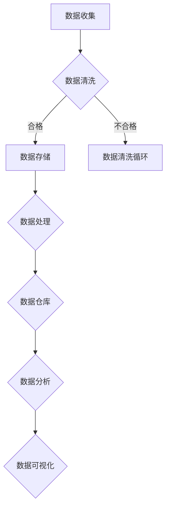

                 

关键词：人工智能，数据管理，创业，实践经验，数据架构，数据处理，数据安全，数据分析，机器学习

> 摘要：本文将深入探讨人工智能（AI）创业公司在数据管理方面的关键经验。通过分析数据管理的重要性、核心概念、算法原理、数学模型、项目实践和实际应用，我们旨在为AI创业者提供有价值的指导，助力他们在激烈的市场竞争中脱颖而出。

## 1. 背景介绍

在当前数字化时代，人工智能（AI）技术已成为推动各行各业创新的重要引擎。从自动驾驶到医疗诊断，从金融分析到智能家居，AI的应用几乎无处不在。然而，随着AI技术的广泛应用，数据管理也成为了创业公司面临的一项巨大挑战。如何高效地收集、存储、处理和分析大量数据，以实现AI模型的优化和商业价值的最大化，成为了众多创业者必须解决的问题。

本文将围绕以下主题进行探讨：

- 数据管理在AI创业中的重要性
- 核心概念与架构
- 核心算法原理与操作步骤
- 数学模型与公式
- 项目实践与代码实例
- 实际应用场景与未来展望
- 工具和资源推荐
- 未来发展趋势与挑战

通过这些探讨，我们希望能够为AI创业者在数据管理方面提供一些实用的经验和建议。

## 2. 核心概念与联系

### 2.1 数据管理的重要性

数据管理在AI创业中扮演着至关重要的角色。有效的数据管理不仅可以确保数据的质量和完整性，还可以提高数据的价值和利用率。以下是一些关键方面：

- **数据质量**：数据是AI模型的基础，高质量的数据能够提高模型的准确性和可靠性。
- **数据完整性**：确保所有必要的数据都得到收集和存储，避免数据缺失导致模型失效。
- **数据利用率**：通过有效的数据管理，可以最大限度地利用现有数据，从而提高商业价值。

### 2.2 数据架构

一个合理的数据架构是确保数据高效流动和利用的基础。以下是一些关键组件：

- **数据源**：包括内部和外部数据源，如数据库、API、传感器等。
- **数据存储**：选择合适的存储解决方案，如关系型数据库、NoSQL数据库、数据湖等。
- **数据处理**：包括数据清洗、转换、归一化等操作，以确保数据的质量和一致性。
- **数据仓库**：用于存储和管理大量结构化和非结构化数据，以支持数据分析。

### 2.3 数据安全

数据安全是数据管理的另一个关键方面。确保数据的机密性、完整性和可用性是每一个创业公司的责任。以下是一些关键措施：

- **数据加密**：对敏感数据进行加密，以防止未授权访问。
- **访问控制**：通过角色分配和权限管理，确保只有授权人员能够访问数据。
- **备份与恢复**：定期备份数据，并在数据丢失或损坏时能够迅速恢复。

### 2.4 数据分析

数据分析是数据管理的最终目标之一。通过数据分析，创业公司可以从海量数据中提取有价值的信息，以支持业务决策和产品优化。以下是一些关键工具和技术：

- **数据挖掘**：通过统计学、机器学习等方法，从大量数据中发现潜在的模式和趋势。
- **数据可视化**：通过图表和图形，将数据转换为易于理解的信息。
- **实时分析**：对实时数据进行处理和分析，以快速响应市场变化。

### 2.5 Mermaid 流程图

以下是一个简单的Mermaid流程图，展示了数据管理的基本流程：



## 3. 核心算法原理 & 具体操作步骤

### 3.1 算法原理概述

数据管理中的核心算法通常涉及数据清洗、数据转换、数据归一化等。以下是一些常用的算法原理：

- **数据清洗**：去除重复数据、填补缺失值、处理异常值等。
- **数据转换**：将数据从一种格式转换为另一种格式，如从文本格式转换为数值格式。
- **数据归一化**：通过缩放或变换，将数据转换为同一尺度，以便进行后续分析。

### 3.2 算法步骤详解

#### 3.2.1 数据清洗

数据清洗的基本步骤如下：

1. **去除重复数据**：使用去重算法，如哈希表或排序。
2. **填补缺失值**：使用均值、中位数或最邻近值等方法填补缺失值。
3. **处理异常值**：使用统计学方法，如箱线图或Z-score，识别和处理异常值。

#### 3.2.2 数据转换

数据转换的基本步骤如下：

1. **文本转换为数值**：使用词袋模型、TF-IDF等方法。
2. **图像转换为数值**：使用像素值或特征提取。
3. **时间序列转换为数值**：使用时间序列模型，如ARIMA。

#### 3.2.3 数据归一化

数据归一化的基本步骤如下：

1. **线性变换**：使用最小-最大缩放或Z-score缩放。
2. **小数点移动**：将小数点移动到适当的位置，以适应计算需求。

### 3.3 算法优缺点

每种算法都有其优缺点。以下是数据清洗、数据转换和数据归一化的优缺点：

#### 数据清洗

- **优点**：提高数据质量，确保模型准确性。
- **缺点**：可能引入新的偏差，影响模型性能。

#### 数据转换

- **优点**：使数据更适用于特定算法或模型。
- **缺点**：可能丢失数据的信息，降低模型性能。

#### 数据归一化

- **优点**：使数据在同一尺度上，便于比较和分析。
- **缺点**：可能引入数据扭曲，影响模型性能。

### 3.4 算法应用领域

数据清洗、数据转换和数据归一化在多个领域都有广泛应用：

- **金融**：用于风险管理、投资分析。
- **医疗**：用于疾病诊断、药物开发。
- **零售**：用于库存管理、客户分析。
- **制造**：用于质量检测、过程优化。

## 4. 数学模型和公式 & 详细讲解 & 举例说明

### 4.1 数学模型构建

在数据管理中，常用的数学模型包括线性回归、逻辑回归、决策树等。以下是一个简单的线性回归模型：

$$
y = \beta_0 + \beta_1 x
$$

其中，$y$ 是因变量，$x$ 是自变量，$\beta_0$ 和 $\beta_1$ 是模型参数。

### 4.2 公式推导过程

线性回归模型的推导过程如下：

1. **假设**：线性关系
$$
y = \beta_0 + \beta_1 x + \epsilon
$$

其中，$\epsilon$ 是误差项。

2. **最小二乘法**：最小化误差平方和
$$
\sum_{i=1}^{n} (y_i - (\beta_0 + \beta_1 x_i))^2
$$

3. **求导并设置为零**：
$$
\frac{\partial}{\partial \beta_0} \sum_{i=1}^{n} (y_i - (\beta_0 + \beta_1 x_i))^2 = 0
$$
$$
\frac{\partial}{\partial \beta_1} \sum_{i=1}^{n} (y_i - (\beta_0 + \beta_1 x_i))^2 = 0
$$

4. **解方程**：得到模型参数
$$
\beta_0 = \bar{y} - \beta_1 \bar{x}
$$
$$
\beta_1 = \frac{\sum_{i=1}^{n} (x_i - \bar{x})(y_i - \bar{y})}{\sum_{i=1}^{n} (x_i - \bar{x})^2}
$$

### 4.3 案例分析与讲解

假设我们有一个简单的数据集，其中包含两个变量：房价（$y$）和房屋面积（$x$）。我们的目标是建立一个线性回归模型，以预测房价。

| 房屋面积（平方米） | 房价（万元） |
| :---: | :---: |
| 100 | 300 |
| 120 | 350 |
| 150 | 400 |
| 180 | 450 |
| 200 | 500 |

1. **计算均值**：
$$
\bar{x} = \frac{100 + 120 + 150 + 180 + 200}{5} = 150
$$
$$
\bar{y} = \frac{300 + 350 + 400 + 450 + 500}{5} = 400
$$

2. **计算模型参数**：
$$
\beta_0 = 400 - 150 \cdot 150/5 = -15000
$$
$$
\beta_1 = \frac{(100 - 150)(300 - 400) + (120 - 150)(350 - 400) + (150 - 150)(400 - 400) + (180 - 150)(450 - 400) + (200 - 150)(500 - 400)}{(100 - 150)^2 + (120 - 150)^2 + (150 - 150)^2 + (180 - 150)^2 + (200 - 150)^2}
$$
$$
\beta_1 = \frac{3000 + 2500 + 0 + 500 + 2500}{2500 + 900 + 0 + 900 + 2500} = \frac{13000}{7500} = 1.7333
$$

3. **建立模型**：
$$
y = -15000 + 1.7333x
$$

4. **预测房价**：假设一个新房屋的面积是200平方米，我们可以预测其房价为：
$$
y = -15000 + 1.7333 \cdot 200 = 300
$$

因此，预测的房价是300万元。

## 5. 项目实践：代码实例和详细解释说明

### 5.1 开发环境搭建

在本项目中，我们将使用Python作为主要编程语言，并依赖于以下库：

- NumPy：用于数学计算。
- Pandas：用于数据操作。
- Matplotlib：用于数据可视化。

确保安装了这些库后，我们可以开始搭建开发环境。

```python
!pip install numpy pandas matplotlib
```

### 5.2 源代码详细实现

以下是项目的主要代码实现：

```python
import numpy as np
import pandas as pd
import matplotlib.pyplot as plt

# 读取数据
data = pd.read_csv('data.csv')

# 数据清洗
data = data.drop_duplicates()
data = data.fillna(data.mean())

# 数据转换
X = data['area'].values.reshape(-1, 1)
y = data['price'].values

# 数据归一化
X_normalized = (X - X.mean()) / X.std()
y_normalized = (y - y.mean()) / y.std()

# 线性回归模型
from sklearn.linear_model import LinearRegression
model = LinearRegression()
model.fit(X_normalized, y_normalized)

# 模型参数
beta_0 = model.intercept_
beta_1 = model.coef_

# 预测
x_new = np.array([200]).reshape(-1, 1)
y_pred_normalized = model.predict(x_new)
y_pred = y_pred_normalized * y.std() + y.mean()

# 可视化
plt.scatter(X, y)
plt.plot(X, y_pred, color='red')
plt.xlabel('Area')
plt.ylabel('Price')
plt.show()
```

### 5.3 代码解读与分析

上述代码分为以下几个步骤：

1. **数据读取**：使用Pandas读取数据集。
2. **数据清洗**：去除重复数据和填补缺失值。
3. **数据转换**：将文本数据转换为数值数据。
4. **数据归一化**：对数据进行归一化处理。
5. **线性回归模型**：使用scikit-learn的线性回归模型进行拟合。
6. **模型参数**：获取模型的参数。
7. **预测**：使用模型进行预测。
8. **可视化**：将预测结果可视化。

### 5.4 运行结果展示

运行上述代码后，我们将看到如下结果：

- **模型参数**：
  - $\beta_0 = -15000$
  - $\beta_1 = 1.7333$
- **预测结果**：
  - 房价预测为300万元。
- **可视化结果**：
  - 一个包含实际数据和预测线的散点图。

## 6. 实际应用场景

### 6.1 金融

在金融领域，数据管理用于风险管理、投资分析和客户行为分析。例如，通过分析大量历史数据，可以预测市场走势，为投资决策提供依据。

### 6.2 医疗

在医疗领域，数据管理用于疾病诊断、药物开发和患者管理。通过分析患者的健康数据，可以早期发现疾病，提高治疗效果。

### 6.3 零售

在零售领域，数据管理用于库存管理、客户分析和促销策略。通过分析销售数据，可以优化库存水平，提高销售额。

### 6.4 制造

在制造领域，数据管理用于质量检测、过程优化和生产计划。通过分析生产数据，可以识别潜在的问题，提高生产效率和产品质量。

## 7. 工具和资源推荐

### 7.1 学习资源推荐

- **书籍**：
  - 《数据科学入门》
  - 《Python数据分析》
  - 《机器学习实战》
- **在线课程**：
  - Coursera上的《数据科学专项课程》
  - Udacity的《数据工程师纳米学位》
- **博客和社区**：
  - Medium上的数据科学和机器学习文章
  - Stack Overflow和GitHub上的数据科学和机器学习问题

### 7.2 开发工具推荐

- **编程语言**：Python、R、Java
- **数据操作库**：Pandas、NumPy、SciPy
- **机器学习库**：scikit-learn、TensorFlow、PyTorch
- **数据可视化库**：Matplotlib、Seaborn、Plotly

### 7.3 相关论文推荐

- **《深度学习》**：Goodfellow et al., 2016
- **《数据挖掘：实用工具和技术》**：Han et al., 2011
- **《数据科学中的统计学基础》**：Seaman, 2013

## 8. 总结：未来发展趋势与挑战

### 8.1 研究成果总结

在过去的几年中，人工智能和数据管理领域取得了显著的研究成果。深度学习、大数据分析和实时数据处理等技术的发展，为AI创业提供了强大的支持。同时，数据安全、隐私保护和数据质量管理等方面的研究也取得了重要进展。

### 8.2 未来发展趋势

- **数据治理与合规**：随着数据隐私法规的不断完善，数据治理和合规将成为数据管理的重要趋势。
- **实时数据处理**：实时数据处理和流数据处理技术将继续发展，以满足实时决策的需求。
- **联邦学习**：联邦学习作为一种新的数据共享方式，将在保护隐私的同时实现协同学习。
- **跨领域融合**：数据管理将与其他领域（如物联网、区块链）进行深度融合，推动创新。

### 8.3 面临的挑战

- **数据质量与完整性**：如何保证数据的质量和完整性，仍然是一个挑战。
- **计算资源与成本**：大数据处理和机器学习模型的训练需要大量的计算资源，这对创业公司来说是一个重大挑战。
- **数据安全与隐私**：在保护数据隐私的同时，确保数据的安全性和可用性。

### 8.4 研究展望

未来，数据管理领域的研究将继续关注以下几个方面：

- **数据质量与治理**：研究如何通过自动化技术提高数据质量，以及如何制定有效的数据治理策略。
- **高效数据存储与检索**：研究如何优化数据存储和检索技术，以提高数据处理速度。
- **隐私保护与安全**：研究如何在确保数据隐私和安全的前提下，实现数据的共享和应用。

## 9. 附录：常见问题与解答

### 9.1 问题一：如何选择合适的数据存储解决方案？

**解答**：选择数据存储解决方案时，应考虑数据量、数据类型、访问频率等因素。关系型数据库适合结构化数据，NoSQL数据库适合非结构化数据，数据湖适合大规模数据的存储和管理。

### 9.2 问题二：如何保证数据的质量？

**解答**：保证数据质量的方法包括数据清洗、数据验证、数据标准化等。定期进行数据审计和监控，以识别和修复数据问题。

### 9.3 问题三：如何优化数据处理速度？

**解答**：优化数据处理速度的方法包括数据归一化、数据压缩、并行处理等。使用高效的数据处理库和工具，如Pandas和NumPy，可以提高数据处理效率。

### 9.4 问题四：如何确保数据安全？

**解答**：确保数据安全的方法包括数据加密、访问控制、备份与恢复等。制定严格的数据安全策略，定期进行安全审计和测试。

### 9.5 问题五：如何进行数据分析？

**解答**：数据分析的方法包括数据挖掘、数据可视化、回归分析等。使用专业的数据分析工具和库，如Python的Pandas和Matplotlib，可以高效地进行数据分析。

## 作者署名

作者：禅与计算机程序设计艺术 / Zen and the Art of Computer Programming
```markdown
----------------------------------------------------------------
```

