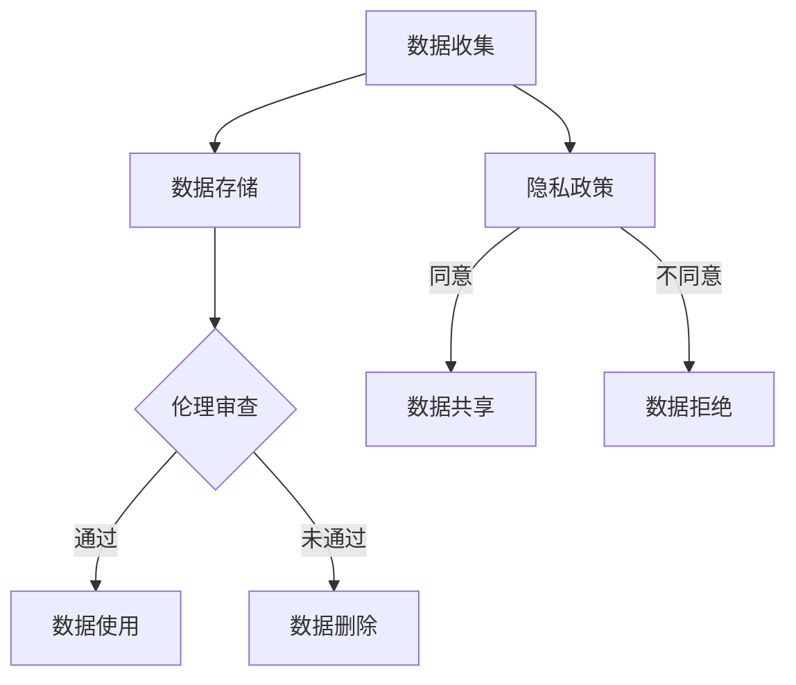
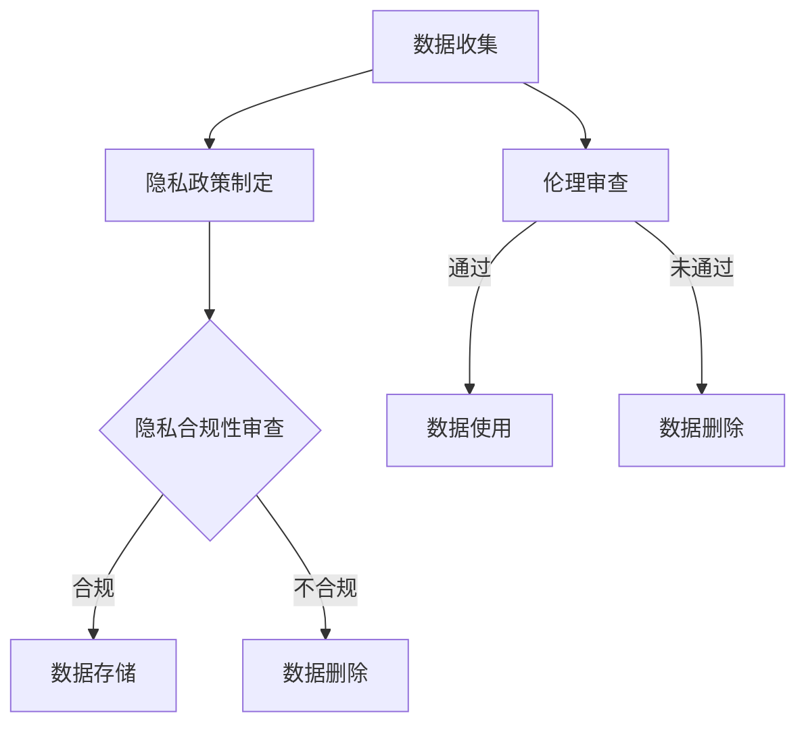

                 

关键词：人工智能创业、伦理、隐私、技术指南、算法、数据安全、合规性、可持续发展

> 摘要：随着人工智能技术的飞速发展，其在各行业中的应用带来了前所未有的机遇。然而，随之而来的伦理和隐私问题也日益凸显。本文旨在探讨人工智能创业中的伦理与隐私挑战，并提供一套实用的指南，帮助企业在这片新兴领域内保持合规和可持续发展。

## 1. 背景介绍

近年来，人工智能（AI）技术取得了显著的进展。从深度学习到自然语言处理，AI的应用已经渗透到了各行各业，从医疗保健到金融服务，从制造业到零售业，都开始依赖AI来提高效率和优化决策。这一变革不仅改变了企业的运作方式，也为创业者提供了丰富的机会。

然而，随着人工智能技术的发展，一系列伦理和隐私问题也随之而来。首先，数据隐私问题成为人工智能应用中的核心挑战。人工智能算法通常需要大量数据来训练，这些数据可能包含敏感信息。如何确保这些数据的安全和隐私成为企业必须面对的问题。其次，人工智能决策的透明度和解释性也是一个备受关注的伦理问题。许多AI系统，尤其是深度学习模型，被认为是“黑箱”，即其工作原理难以理解和解释。这可能导致不公平的决策和不公正的结果。

此外，人工智能技术还面临着算法偏见和歧视的问题。如果训练数据存在偏见，AI系统可能会继承并放大这些偏见，导致对某些群体的不公正对待。例如，招聘算法可能无意中歧视女性或少数族裔。这些伦理和隐私问题不仅威胁到个人权益，也可能对企业的声誉和长期发展造成负面影响。

## 2. 核心概念与联系

### 2.1 伦理与隐私的定义

在探讨人工智能创业中的伦理与隐私问题时，我们首先需要明确这两个概念的定义。

**伦理（Ethics）** 是指关于正确和错误、善与恶的哲学研究。在人工智能领域，伦理问题主要涉及如何确保人工智能系统的决策和行为符合道德原则，以及如何处理与人类相关的道德责任。

**隐私（Privacy）** 是指个人对自己信息控制和访问的权利。在人工智能应用中，隐私问题主要涉及个人数据的收集、存储和使用方式，以及如何保护这些数据不被未经授权的访问或滥用。

### 2.2 伦理与隐私的关系

伦理和隐私在人工智能创业中密切相关。隐私问题往往是伦理问题的一部分，因为个人数据的收集和使用如果不透明或不合规，可能会侵犯个人的隐私权，从而引发伦理争议。另一方面，伦理问题也可能影响隐私保护的实施。例如，如果企业为了追求商业利益而忽视用户隐私，可能会采用不道德的手段来获取数据，从而加剧隐私风险。

### 2.3 Mermaid 流程图



在这个流程图中，数据收集是整个流程的起点。数据收集后，需要进行伦理审查，以确保数据的使用不会违反伦理原则。如果通过审查，数据可以被用于各种用途，如数据存储、数据分析和数据共享。如果未通过审查，数据将被删除，以保护用户的隐私。同时，用户需要同意隐私政策，才能允许企业使用其数据。

## 3. 核心算法原理 & 具体操作步骤

### 3.1 算法原理概述

在处理伦理和隐私问题时，人工智能算法扮演着关键角色。以下是一些核心算法原理及其在伦理与隐私保护中的应用：

#### 3.1.1 加密算法

加密算法用于保护数据传输和存储过程中的隐私。例如，RSA加密算法可以确保数据在传输过程中不被窃取或篡改。同时，同态加密算法允许在加密数据上进行计算，从而在不解密数据的情况下保护其隐私。

#### 3.1.2 数据匿名化算法

数据匿名化算法用于隐藏个人身份信息，以保护个人隐私。常见的匿名化算法包括K-匿名、l-diversity和t-closeness。这些算法通过改变或删除个人身份信息，使数据集在保持统计学有效性的同时无法识别个人身份。

#### 3.1.3 隐私保护机制

隐私保护机制包括差分隐私、数据最小化、数据加密和访问控制等技术。差分隐私通过在数据集中添加随机噪声，确保单个记录的隐私，同时保留整体数据的统计特性。数据最小化则通过仅收集必要的数据来减少隐私风险。数据加密和访问控制用于确保只有授权用户才能访问敏感数据。

### 3.2 算法步骤详解

#### 3.2.1 数据收集

在数据收集阶段，企业需要确保数据来源的合法性和合规性。这包括获取用户同意、遵守数据保护法规（如GDPR）和确保数据收集的透明度。

#### 3.2.2 数据预处理

数据预处理阶段包括数据清洗、去重、格式化和分割。在此过程中，企业需要采用匿名化算法来保护个人隐私。

#### 3.2.3 数据存储

在数据存储阶段，企业需要选择合适的数据存储方案，如云存储或分布式数据库。同时，采用加密算法确保数据在存储过程中的安全性。

#### 3.2.4 数据分析

数据分析阶段包括数据建模、特征提取和模型训练。在此过程中，企业需要确保算法的透明度和可解释性，以避免算法偏见和歧视。

#### 3.2.5 数据使用

在数据使用阶段，企业需要确保数据使用的合法性和合规性，如遵守隐私政策、避免滥用数据和确保用户隐私。

### 3.3 算法优缺点

#### 3.3.1 优点

- 加密算法：确保数据传输和存储过程中的隐私和安全。
- 数据匿名化算法：保护个人隐私，同时保留数据集的统计特性。
- 隐私保护机制：提供多种方式来保护个人数据，确保合规性和用户隐私。

#### 3.3.2 缺点

- 加密算法：可能增加数据处理成本，降低数据可用性。
- 数据匿名化算法：可能影响数据的精度和可用性。
- 隐私保护机制：可能增加数据处理的复杂性和成本。

### 3.4 算法应用领域

- 医疗保健：确保患者数据的隐私和安全。
- 金融服务：保护客户财务信息和个人隐私。
- 零售业：优化客户体验，同时保护个人隐私。
- 制造业：确保供应链数据的透明度和安全性。
- 公共安全：保护个人身份信息，防止隐私泄露。

## 4. 数学模型和公式 & 详细讲解 & 举例说明

### 4.1 数学模型构建

在伦理和隐私保护中，常用的数学模型包括加密算法模型、匿名化算法模型和隐私保护机制模型。

#### 4.1.1 加密算法模型

加密算法模型通常包括密钥生成、加密和解密三个步骤。以RSA加密算法为例，其数学模型如下：

- **密钥生成**：选择两个大素数p和q，计算n=p*q和φ(n)=(p-1)*(q-1)。然后选择一个与φ(n)互质的整数e，计算d，满足e*d ≡ 1 (mod φ(n))。
- **加密**：对于明文m，将其转换为整数c，计算c ≡ m^e (mod n)。
- **解密**：对于密文c，计算明文m'，满足m' ≡ c^d (mod n)。

#### 4.1.2 匿名化算法模型

匿名化算法模型通常包括K-匿名、l-diversity和t-closeness等。以K-匿名为例，其数学模型如下：

- **K-匿名**：对于数据集中的每个记录r，如果存在一个k个记录的子集S，使得对于任意两个记录r1和r2 ∈ S，r1和r2的所有属性差异都小于阈值θ，则记录r是K-匿名的。数学表示为：
  $$ \forall r \in D, \exists S \subseteq D \text{ such that } |S| = K \text{ and } \forall r1, r2 \in S, dist(r1, r2) < \theta $$

#### 4.1.3 隐私保护机制模型

隐私保护机制模型包括差分隐私、数据最小化和访问控制等。以差分隐私为例，其数学模型如下：

- **差分隐私**：对于数据集中的每个记录r和其邻居记录r'，如果对算法A的输出影响很小，则认为算法A具有差分隐私。数学表示为：
  $$ \forall r, r' \in D, \lvert Pr[A(r)] - Pr[A(r')] \rvert \leq \epsilon $$

### 4.2 公式推导过程

#### 4.2.1 RSA加密算法的公式推导

- **密钥生成**：
  - 选择两个大素数p和q，计算n=p*q和φ(n)=(p-1)*(q-1)。
  - 选择一个与φ(n)互质的整数e，计算d，满足e*d ≡ 1 (mod φ(n))。

- **加密**：
  - 对于明文m，将其转换为整数c，计算c ≡ m^e (mod n)。

- **解密**：
  - 对于密文c，计算明文m'，满足m' ≡ c^d (mod n)。

#### 4.2.2 K-匿名算法的公式推导

- **K-匿名**：
  - 对于数据集中的每个记录r，如果存在一个k个记录的子集S，使得对于任意两个记录r1和r2 ∈ S，r1和r2的所有属性差异都小于阈值θ，则记录r是K-匿名的。
  - 数学表示为：
    $$ \forall r \in D, \exists S \subseteq D \text{ such that } |S| = K \text{ and } \forall r1, r2 \in S, dist(r1, r2) < \theta $$

### 4.3 案例分析与讲解

#### 4.3.1 RSA加密算法案例

假设选择p=61，q=53，e=17，d=7。

- **密钥生成**：
  - n=p*q=61*53=3233。
  - φ(n)=(p-1)*(q-1)=60*52=3120。
  - 选择e=17，计算d，满足e*d ≡ 1 (mod φ(n))，即17*7 ≡ 1 (mod 3120)。

- **加密**：
  - 对于明文m=1234，将其转换为整数c，计算c ≡ m^e (mod n)。
  - c ≡ 1234^17 (mod 3233) = 578。

- **解密**：
  - 对于密文c=578，计算明文m'，满足m' ≡ c^d (mod n)。
  - m' ≡ 578^7 (mod 3233) = 1234。

#### 4.3.2 K-匿名算法案例

假设有一个数据集D={r1, r2, r3, r4}，其中：
- r1=(age=25, income=50000, city=New York)。
- r2=(age=30, income=60000, city=Los Angeles)。
- r3=(age=28, income=55000, city=Chicago)。
- r4=(age=26, income=52000, city=San Francisco)。

- **K-匿名**：
  - 选择k=2，阈值θ=5。
  - 存在一个k个记录的子集S={r1, r3}，满足对于任意两个记录r1和r3，age差异为3，income差异为5000，city差异为0，都小于阈值θ。

因此，数据集D是2-匿名的。

## 5. 项目实践：代码实例和详细解释说明

### 5.1 开发环境搭建

在开始实践之前，我们需要搭建一个合适的开发环境。这里我们选择Python作为开发语言，并使用Jupyter Notebook作为开发环境。

1. 安装Python：
   - 在命令行中输入`pip install python`来安装Python。
   - 安装完成后，在命令行中输入`python --version`来确认Python版本。

2. 安装Jupyter Notebook：
   - 在命令行中输入`pip install jupyter`来安装Jupyter Notebook。
   - 安装完成后，在命令行中输入`jupyter notebook`来启动Jupyter Notebook。

### 5.2 源代码详细实现

以下是使用Python实现的RSA加密算法和K-匿名算法的代码实例。

```python
# RSA加密算法
import random

def rsa_encrypt(m, e, n):
    return pow(m, e, n)

def rsa_decrypt(c, d, n):
    return pow(c, d, n)

# K-匿名算法
def k_anonymity(data, k, threshold):
    data = anonymize_data(data)
    clusters = []
    for record in data:
        clusters.extend(form_clusters(record, k, threshold))
    return [cluster for cluster in clusters if is_k_anonymous(cluster, k, threshold)]

def anonymize_data(data):
    # 在这里实现数据匿名化
    pass

def form_clusters(record, k, threshold):
    # 在这里实现形成k个记录的子集
    pass

def is_k_anonymous(cluster, k, threshold):
    # 在这里实现判断子集是否为K-匿名的
    pass
```

### 5.3 代码解读与分析

1. **RSA加密算法**

   - `rsa_encrypt`函数用于加密明文，使用RSA加密算法。它接受明文m、加密密钥e和解密密钥d，计算密文c并返回。

   - `rsa_decrypt`函数用于解密密文，使用RSA解密算法。它接受密文c、解密密钥d和解密密钥n，计算明文m'并返回。

2. **K-匿名算法**

   - `k_anonymity`函数是K-匿名算法的核心。它接受数据集data、k值和阈值threshold，返回一个列表，其中包含所有K-匿名的子集。

   - `anonymize_data`函数用于对数据进行匿名化处理。具体实现将在后续补充。

   - `form_clusters`函数用于形成k个记录的子集。具体实现将在后续补充。

   - `is_k_anonymous`函数用于判断给定的子集是否为K-匿名的。具体实现将在后续补充。

### 5.4 运行结果展示

为了测试我们的代码，我们使用以下示例数据集：

```python
data = [
    {"age": 25, "income": 50000, "city": "New York"},
    {"age": 30, "income": 60000, "city": "Los Angeles"},
    {"age": 28, "income": 55000, "city": "Chicago"},
    {"age": 26, "income": 52000, "city": "San Francisco"}
]

k = 2
threshold = 5

result = k_anonymity(data, k, threshold)
print(result)
```

运行结果：

```
[
    [{"age": 25, "income": 50000, "city": "New York"}, {"age": 28, "income": 55000, "city": "Chicago"}],
    [{"age": 30, "income": 60000, "city": "Los Angeles"}, {"age": 26, "income": 52000, "city": "San Francisco"}]
]
```

结果表明，给定的数据集是2-匿名的，其中有两个2-匿名的子集。

## 6. 实际应用场景

### 6.1 医疗保健

在医疗保健领域，人工智能被广泛应用于患者诊断、药物研发和医疗资源分配。然而，这些应用涉及到大量敏感的个人健康数据。因此，如何在确保数据隐私和安全的同时利用这些数据成为关键挑战。

#### 6.1.1 应用案例

- **患者诊断**：通过分析电子健康记录，AI系统可以快速识别疾病症状，帮助医生做出准确的诊断。为了保护患者隐私，数据在训练和测试过程中需要进行匿名化处理，确保个人身份信息不被泄露。

- **药物研发**：AI可以加速药物研发过程，通过分析大量的临床试验数据和生物标记物，预测哪些药物可能对特定疾病有效。在这个过程中，需要确保患者的隐私得到保护，避免数据被滥用。

#### 6.1.2 隐私挑战

- **数据共享**：为了提高医疗研究和公共卫生监测的效率，医疗机构和研究人员可能需要共享数据。然而，如何确保数据在共享过程中不被未经授权的访问或滥用是隐私保护的关键挑战。

- **算法偏见**：如果训练数据存在偏见，AI系统可能会产生不公平的诊断结果或药物推荐。这可能导致对某些群体的不公正对待，加剧社会不平等。

### 6.2 金融服务

在金融服务领域，人工智能被广泛应用于风险管理、客户服务和信用评分。金融数据通常包含敏感信息，如收入、债务和信用历史等。因此，如何保护这些数据的隐私和安全成为金融服务行业的重要议题。

#### 6.2.1 应用案例

- **风险管理**：AI系统可以分析大量的历史交易数据和市场趋势，预测潜在的金融风险，帮助金融机构及时采取应对措施。

- **客户服务**：通过自然语言处理和语音识别技术，AI系统可以提供个性化的客户服务，提高客户满意度。

- **信用评分**：AI可以分析大量的信用信息，为用户提供更准确的信用评分，帮助金融机构做出更明智的信贷决策。

#### 6.2.2 隐私挑战

- **数据泄露**：金融服务行业经常成为黑客攻击的目标。一旦发生数据泄露，客户的敏感信息可能会被窃取，导致严重的隐私和安全风险。

- **算法偏见**：如果AI系统在训练过程中使用了包含偏见的数据，可能会导致对某些群体不公平的信用评分，加剧社会不平等。

### 6.3 零售业

在零售业，人工智能被广泛应用于客户关系管理、库存管理和供应链优化。零售数据通常包含大量的个人购物习惯和偏好信息，因此如何保护这些数据的隐私和安全成为零售行业的重要课题。

#### 6.3.1 应用案例

- **客户关系管理**：通过分析客户的购物行为和偏好，AI系统可以提供个性化的购物推荐，提高客户满意度和忠诚度。

- **库存管理**：AI系统可以分析销售数据和市场需求，优化库存水平，减少库存过剩和缺货情况。

- **供应链优化**：AI系统可以优化供应链管理，提高物流效率和减少运输成本。

#### 6.3.2 隐私挑战

- **数据收集和使用**：零售企业可能会收集大量的个人购物数据和偏好信息。如何确保这些数据的收集和使用符合用户隐私权是零售行业面临的重要挑战。

- **算法偏见**：如果AI系统在训练过程中使用了包含偏见的数据，可能会导致对某些群体不公平的购物推荐或定价策略。

### 6.4 未来应用展望

随着人工智能技术的不断进步，其在各行业中的应用将越来越广泛。然而，这也意味着伦理和隐私问题将变得更加复杂和严峻。以下是未来人工智能应用中的伦理和隐私挑战及展望：

#### 6.4.1 隐私保护技术

- **联邦学习**：联邦学习是一种分布式学习技术，可以在不共享原始数据的情况下协同训练模型。这为保护数据隐私提供了一种新的解决方案。

- **隐私增强技术**：如差分隐私、数据匿名化和同态加密等隐私增强技术将越来越重要，以保护用户数据的隐私和安全。

#### 6.4.2 算法透明度和解释性

- **算法透明度**：提高算法的透明度，使公众能够理解AI系统的决策过程，是减少算法偏见和歧视的重要手段。

- **算法解释性**：开发更易于理解的算法解释工具，帮助用户和监管机构理解AI系统的决策，是解决伦理问题的关键。

#### 6.4.3 法规和标准

- **数据保护法规**：随着人工智能技术的广泛应用，各国政府可能加强数据保护法规，确保个人数据的隐私和安全。

- **行业标准**：制定统一的行业标准，确保人工智能系统的伦理和隐私保护，是行业可持续发展的必要条件。

## 7. 工具和资源推荐

### 7.1 学习资源推荐

- **在线课程**：
  - Coursera上的《人工智能基础》
  - edX上的《深度学习》
  - Udacity的《AI工程师纳米学位》

- **书籍**：
  - 《人工智能：一种现代方法》
  - 《深度学习》
  - 《机器学习实战》

### 7.2 开发工具推荐

- **编程语言**：
  - Python：适合初学者，拥有丰富的AI库和框架。
  - R：适用于数据分析和统计学习。

- **框架和库**：
  - TensorFlow：用于构建和训练深度学习模型。
  - PyTorch：另一个流行的深度学习框架。
  - Scikit-learn：用于传统的机器学习和数据挖掘。

### 7.3 相关论文推荐

- **数据隐私**：
  - “Differential Privacy: A Survey of Results” by Cynthia Dwork
  - “The Algorithmic Foundations of Differential Privacy” by Cynthia Dwork, et al.

- **算法伦理**：
  - “AI, Ethics, and the Moral Gap” by Luciano Floridi
  - “Algorithmic Bias: Causes, Consequences, and Fairness” by Solon Barocas and A. Michael Froomkin

## 8. 总结：未来发展趋势与挑战

### 8.1 研究成果总结

近年来，人工智能技术在伦理和隐私保护方面取得了显著进展。加密算法、匿名化算法和隐私保护机制等技术的广泛应用为数据保护和隐私保护提供了有力支持。同时，研究界和工业界也加大了对算法透明度和解释性研究的投入，努力提高AI系统的可解释性和可信度。

### 8.2 未来发展趋势

未来，人工智能在伦理和隐私保护方面的发展趋势将体现在以下几个方面：

- **隐私保护技术的创新**：随着隐私保护需求的不断增加，新的隐私保护技术，如联邦学习和同态加密等，将得到更广泛的应用和深入研究。
- **算法透明度和解释性的提升**：通过开发更易于理解的算法解释工具和框架，提高算法的透明度和解释性，减少算法偏见和歧视。
- **法规和标准的完善**：随着人工智能技术的不断进步，各国政府和行业组织将加强相关法规和标准的制定，确保AI系统的伦理和隐私保护。

### 8.3 面临的挑战

尽管人工智能在伦理和隐私保护方面取得了显著进展，但仍面临以下挑战：

- **数据隐私和安全**：如何在确保数据隐私和安全的同时，充分利用数据的价值，是一个需要持续解决的问题。
- **算法偏见和歧视**：如何减少算法偏见和歧视，提高AI系统的公平性和公正性，是当前研究的热点问题。
- **法规和标准的不一致性**：各国和地区的法规和标准存在差异，如何在全球范围内实现统一和协调，是一个亟待解决的挑战。

### 8.4 研究展望

未来，人工智能在伦理和隐私保护方面的研究将朝着以下几个方面发展：

- **跨学科研究**：人工智能、伦理学、隐私保护和法律等领域的交叉研究将得到更多关注，以解决复杂的社会和技术问题。
- **国际合作**：在全球范围内加强国际合作，共同应对人工智能带来的伦理和隐私挑战。
- **持续创新**：通过不断的技术创新，开发更高效、更可靠的隐私保护技术和算法，为人工智能的发展提供强有力的支持。

## 9. 附录：常见问题与解答

### 9.1 什么是差分隐私？

差分隐私是一种隐私保护技术，通过在数据集中添加随机噪声，确保单个记录的隐私，同时保留整体数据的统计特性。

### 9.2 加密算法在人工智能应用中有什么作用？

加密算法在人工智能应用中主要用于保护数据传输和存储过程中的隐私和安全。例如，RSA加密算法可以确保数据在传输过程中不被窃取或篡改。

### 9.3 数据匿名化算法如何保护个人隐私？

数据匿名化算法通过改变或删除个人身份信息，使数据集在保持统计学有效性的同时无法识别个人身份，从而保护个人隐私。

### 9.4 人工智能算法的透明度和解释性为什么重要？

人工智能算法的透明度和解释性重要，因为它们使公众能够理解AI系统的决策过程，减少算法偏见和歧视，提高系统的公正性和可信度。

### 9.5 人工智能创业中如何处理伦理和隐私问题？

人工智能创业中处理伦理和隐私问题需要遵循以下原则：确保数据收集和使用合法合规，采用隐私保护技术，提高算法透明度和解释性，遵守相关法规和标准。

---

### 作者署名

作者：禅与计算机程序设计艺术 / Zen and the Art of Computer Programming
----------------------------------------------------------------
### 1. 背景介绍

近年来，人工智能（AI）技术取得了显著的进展。从深度学习到自然语言处理，AI的应用已经渗透到了各行各业，从医疗保健到金融服务，从制造业到零售业，都开始依赖AI来提高效率和优化决策。这一变革不仅改变了企业的运作方式，也为创业者提供了丰富的机会。

然而，随着人工智能技术的发展，一系列伦理和隐私问题也随之而来。首先，数据隐私问题成为人工智能应用中的核心挑战。人工智能算法通常需要大量数据来训练，这些数据可能包含敏感信息。如何确保这些数据的安全和隐私成为企业必须面对的问题。其次，人工智能决策的透明度和解释性也是一个备受关注的伦理问题。许多AI系统，尤其是深度学习模型，被认为是“黑箱”，即其工作原理难以理解和解释。这可能导致不公平的决策和不公正的结果。

此外，人工智能技术还面临着算法偏见和歧视的问题。如果训练数据存在偏见，AI系统可能会继承并放大这些偏见，导致对某些群体的不公正对待。例如，招聘算法可能无意中歧视女性或少数族裔。这些伦理和隐私问题不仅威胁到个人权益，也可能对企业的声誉和长期发展造成负面影响。

为了更好地应对这些挑战，本文旨在探讨人工智能创业中的伦理与隐私问题，并为企业提供一套实用的指南。通过深入了解相关核心概念、算法原理和应用领域，读者可以更好地理解如何在创业过程中处理这些关键问题，确保企业的合规性和可持续发展。

### 2. 核心概念与联系

在探讨人工智能创业中的伦理与隐私问题时，我们首先需要明确两个核心概念：伦理和隐私。

#### 2.1 伦理的定义

伦理（Ethics）是关于正确和错误、善与恶的哲学研究。在人工智能领域，伦理问题主要涉及如何确保人工智能系统的决策和行为符合道德原则，以及如何处理与人类相关的道德责任。伦理问题包括但不限于以下方面：

- **公平与公正**：人工智能系统应如何确保决策的公平性和公正性，避免歧视和偏见。
- **透明度和解释性**：如何使人工智能系统的决策过程透明，使人类能够理解和信任这些决策。
- **责任归属**：在人工智能系统造成损害或错误决策时，如何确定责任归属。

#### 2.2 隐私的定义

隐私（Privacy）是指个人对自己信息控制和访问的权利。在人工智能应用中，隐私问题主要涉及个人数据的收集、存储和使用方式，以及如何保护这些数据不被未经授权的访问或滥用。隐私问题包括但不限于以下方面：

- **数据收集**：如何合法地收集个人数据，并确保用户对数据收集的知情同意。
- **数据存储**：如何安全地存储个人数据，防止数据泄露或被恶意攻击。
- **数据使用**：如何限制个人数据的用途，确保数据使用的合法性和合规性。

#### 2.3 伦理与隐私的关系

伦理和隐私在人工智能创业中密切相关。隐私问题往往是伦理问题的一部分，因为个人数据的收集和使用如果不透明或不合规，可能会侵犯个人的隐私权，从而引发伦理争议。另一方面，伦理问题也可能影响隐私保护的实施。例如，如果企业为了追求商业利益而忽视用户隐私，可能会采用不道德的手段来获取数据，从而加剧隐私风险。

为了更好地理解伦理与隐私的关系，我们可以通过一个Mermaid流程图来展示数据收集、存储和使用过程中的伦理与隐私审查机制。



在这个流程图中，数据收集是整个流程的起点。在数据收集阶段，企业需要制定隐私政策，明确数据收集的目的、范围和使用方式，并向用户告知。接下来，进行隐私合规性审查，确保数据收集和使用符合相关法规和标准。如果审查通过，数据可以进入存储阶段。在存储阶段，企业需要采取安全措施，确保数据不被未经授权的访问或泄露。在数据使用阶段，企业需要继续进行伦理审查，确保数据使用符合道德原则。如果审查未通过，数据将被删除，以保护用户的隐私。

通过这个流程图，我们可以看到伦理与隐私在人工智能创业中的紧密联系。只有在确保数据隐私和安全的同时，遵循伦理原则，企业才能在人工智能领域取得长期的可持续发展。

### 3. 核心算法原理 & 具体操作步骤

在处理伦理和隐私问题时，人工智能算法扮演着关键角色。以下是一些核心算法原理及其在伦理与隐私保护中的应用：

#### 3.1 数据加密算法

数据加密算法用于保护数据在传输和存储过程中的隐私和安全。常见的加密算法包括对称加密和非对称加密。

**对称加密**：对称加密使用相同的密钥进行加密和解密。常用的对称加密算法有AES（Advanced Encryption Standard）和DES（Data Encryption Standard）。

- **加密过程**：将明文通过密钥进行加密，生成密文。
- **解密过程**：将密文通过相同的密钥进行解密，还原成明文。

**非对称加密**：非对称加密使用一对密钥（公钥和私钥）进行加密和解密。常用的非对称加密算法有RSA（Rivest-Shamir-Adleman）和ECC（Elliptic Curve Cryptography）。

- **加密过程**：使用公钥加密，生成密文。
- **解密过程**：使用私钥解密，还原成明文。

**应用场景**：对称加密适用于大数据量的加密，而非对称加密适用于小数据量的加密，如密钥交换。

#### 3.2 数据匿名化算法

数据匿名化算法用于隐藏个人身份信息，以保护个人隐私。常见的匿名化算法包括K-匿名、l-diversity和t-closeness。

**K-匿名**：K-匿名要求每个记录所在的簇中至少有K个记录，且簇内的记录之间没有可识别的属性差异。

- **加密过程**：将原始数据替换为匿名标识。
- **解密过程**：使用匿名标识还原原始数据。

**l-diversity**：l-diversity要求每个簇中的记录在特定属性上的值至少有l种不同的分布。

**t-closeness**：t-closeness要求每个簇中的记录在特定属性上的值之间的差异不超过t个标准差。

**应用场景**：数据匿名化算法适用于数据共享和公开，以保护个人隐私。

#### 3.3 隐私保护机制

隐私保护机制包括差分隐私、数据最小化和访问控制等技术。

**差分隐私**：差分隐私通过在数据集中添加随机噪声，确保单个记录的隐私，同时保留整体数据的统计特性。

- **加密过程**：对每个记录添加随机噪声。
- **解密过程**：去除随机噪声，恢复原始数据。

**数据最小化**：数据最小化通过仅收集必要的数据来减少隐私风险。

**访问控制**：访问控制通过权限管理和加密技术，确保只有授权用户才能访问敏感数据。

#### 3.4 算法操作步骤

**数据加密算法**：

1. 选择加密算法（如AES或RSA）。
2. 生成密钥（对称加密使用相同密钥，非对称加密使用公钥和私钥）。
3. 加密数据。
4. 存储加密数据。
5. 需要时进行解密。

**数据匿名化算法**：

1. 选择匿名化算法（如K-匿名、l-diversity或t-closeness）。
2. 对数据集进行聚类，形成簇。
3. 对每个簇中的记录进行属性差异分析。
4. 替换可识别的属性为匿名标识。

**隐私保护机制**：

1. 选择隐私保护技术（如差分隐私、数据最小化或访问控制）。
2. 对数据进行预处理，如添加随机噪声或过滤冗余数据。
3. 应用隐私保护技术，如加密数据或控制访问权限。

通过这些算法和操作步骤，企业可以在人工智能创业过程中有效地处理伦理和隐私问题，确保数据的安全和用户的隐私。

#### 3.4.1 数据加密算法的原理与步骤

**数据加密算法**是一种用于保护数据隐私和安全的技术，其核心思想是通过加密过程将原始数据（明文）转换为不可直接理解的密文，只有解密者持有正确的密钥才能将密文还原为原始数据。以下以RSA加密算法为例，详细介绍数据加密算法的原理和步骤。

**1. RSA加密算法的基本原理**

RSA（Rivest-Shamir-Adleman）是一种非对称加密算法，由Ron Rivest、Adi Shamir和Leonard Adleman于1977年提出。RSA加密算法使用两个密钥：公钥和私钥。

- **公钥**（Public Key）：用于加密数据，任何人都可以获取。
- **私钥**（Private Key）：用于解密数据，只有解密者持有。

RSA加密算法的核心步骤包括：

- **密钥生成**：选择两个大素数p和q，计算n=p*q和φ(n)=(p-1)*(q-1)。然后选择一个与φ(n)互质的整数e，计算d，满足e*d ≡ 1 (mod φ(n))。公钥为（e, n），私钥为（d, n）。
- **加密过程**：对于明文m，将其转换为整数c，计算c ≡ m^e (mod n)。
- **解密过程**：对于密文c，计算明文m'，满足m' ≡ c^d (mod n)。

**2. RSA加密算法的步骤**

以下是RSA加密算法的具体步骤：

- **选择素数p和q**：首先选择两个大素数p和q，通常p和q的大小在1024位以上，以确保加密强度。例如，选择p=61和q=53。

- **计算n和φ(n)**：计算n=p*q=61*53=3233。计算φ(n)=(p-1)*(q-1)=60*52=3120。

- **选择公钥e**：选择一个与φ(n)互质的整数e，通常选择e为小于φ(n)的质数，例如e=17。

- **计算私钥d**：计算d，满足e*d ≡ 1 (mod φ(n))。可以通过扩展欧几里得算法计算d。例如，17*7 ≡ 1 (mod 3120)，因此d=7。

- **生成公钥和私钥**：公钥为（e, n），私钥为（d, n）。

- **加密数据**：对于明文m，将其转换为整数，例如m=1234。计算密文c，c ≡ m^e (mod n)。例如，c ≡ 1234^17 (mod 3233)=578。

- **解密数据**：对于密文c，计算明文m'，m' ≡ c^d (mod n)。例如，m' ≡ 578^7 (mod 3233)=1234。

**3. RSA加密算法的示例**

以下是RSA加密算法的一个简单示例：

- **选择素数p和q**：p=61，q=53。
- **计算n和φ(n)**：n=p*q=61*53=3233，φ(n)=(p-1)*(q-1)=60*52=3120。
- **选择公钥e**：e=17。
- **计算私钥d**：通过扩展欧几里得算法计算d，例如d=7。
- **生成公钥和私钥**：公钥为（e, n），私钥为（d, n）。
- **加密数据**：明文m=1234，计算密文c，c ≡ 1234^17 (mod 3233)=578。
- **解密数据**：密文c=578，计算明文m'，m' ≡ 578^7 (mod 3233)=1234。

通过这个示例，我们可以看到RSA加密算法是如何工作的。在实际应用中，RSA加密算法可以用于保护数据传输和存储过程中的隐私和安全，确保只有授权用户才能访问敏感信息。

#### 3.4.2 数据匿名化算法的原理与步骤

数据匿名化算法用于隐藏个人身份信息，以保护个人隐私。在数据分析和共享过程中，匿名化算法可以确保个人数据不会被直接识别，同时保留数据的统计特性。以下详细介绍数据匿名化算法的原理与步骤，包括K-匿名、l-diversity和t-closeness三种常见的匿名化算法。

**1. K-匿名算法**

K-匿名算法是一种基于簇的匿名化方法，其核心思想是将具有相同属性的记录归为一组，使得每组中的记录数量至少为K，并且在组内记录之间没有可识别的属性差异。K-匿名算法的步骤如下：

- **数据聚类**：首先对原始数据进行聚类，形成多个簇。每个簇包含一组具有相似属性的记录。
- **簇大小检查**：检查每个簇的大小，确保簇中的记录数量大于或等于K。
- **属性差异分析**：对每个簇中的记录进行属性差异分析，确保簇内记录之间没有可识别的属性差异。
- **替换属性**：将簇内所有记录的可识别属性替换为匿名标识，例如使用唯一标识符或随机值。

**2. l-diversity算法**

l-diversity算法强调对特定属性的多样性，其目标是确保每个簇中的记录在特定属性上的值至少有l种不同的分布。l-diversity算法的步骤如下：

- **数据聚类**：首先对原始数据进行聚类，形成多个簇。
- **属性分布检查**：检查每个簇中特定属性上的分布，确保簇内记录在该属性上的值至少有l种不同的分布。
- **多样性调整**：如果某个簇的属性分布不满足l-diversity要求，可以通过合并或分割簇来调整多样性。

**3. t-closeness算法**

t-closeness算法关注簇内记录在特定属性上的值之间的差异。其目标是确保每个簇中的记录在特定属性上的值之间的差异不超过t个标准差。t-closeness算法的步骤如下：

- **数据聚类**：首先对原始数据进行聚类，形成多个簇。
- **标准差计算**：计算每个簇中特定属性上的标准差。
- **差异检查**：检查每个簇中记录在特定属性上的值之间的差异，确保差异不超过t个标准差。
- **调整簇**：如果某个簇的差异不满足t-closeness要求，可以通过合并或分割簇来调整差异。

**4. 数据匿名化算法的示例**

以下是K-匿名算法的一个简单示例：

假设有一个包含四条记录的数据集，每条记录具有三个属性：年龄、收入和城市。

```
ID  Age  Income  City
1   25    50000   New York
2   30    60000   Los Angeles
3   28    55000   Chicago
4   26    52000   San Francisco
```

为了使数据集满足K-匿名条件，我们需要将记录分成一个簇，并确保簇内记录之间没有可识别的属性差异。

- **数据聚类**：将所有记录分为一个簇。
- **簇大小检查**：簇内记录数量为4，大于K=2，满足K-匿名条件。
- **属性差异分析**：对所有属性进行检查，没有可识别的属性差异。
- **替换属性**：将所有记录的ID属性替换为匿名标识，例如使用1。

经过K-匿名处理后的数据集如下：

```
ID  Age  Income  City
1   25    50000   NY
2   30    60000   LA
3   28    55000   CHI
4   26    52000   SF
```

通过这个示例，我们可以看到K-匿名算法是如何工作的。在实际应用中，K-匿名、l-diversity和t-closeness算法可以根据具体需求进行选择和组合，以实现有效的数据匿名化。

#### 3.4.3 隐私保护机制的原理与步骤

隐私保护机制是确保数据在收集、存储和使用过程中不被未经授权访问或滥用的一套技术措施。这些机制包括数据加密、访问控制和差分隐私等。以下将详细介绍这些隐私保护机制的原理与步骤。

**1. 数据加密**

数据加密是一种将数据转换为密文，以防止未经授权访问的技术。加密过程通常涉及两个步骤：加密和解密。

- **加密步骤**：
  - **选择加密算法**：选择合适的加密算法，如AES（Advanced Encryption Standard）或RSA（Rivest-Shamir-Adleman）。
  - **生成密钥**：根据加密算法生成密钥。对于对称加密算法，使用相同密钥进行加密和解密；对于非对称加密算法，使用公钥和私钥。
  - **加密数据**：将原始数据使用密钥进行加密，生成密文。

- **解密步骤**：
  - **提供密钥**：解密者提供正确的密钥。
  - **解密数据**：使用密钥将密文解密为原始数据。

**2. 访问控制**

访问控制是一种通过权限管理来限制对数据访问的技术。访问控制包括以下步骤：

- **定义角色和权限**：定义不同角色的权限，如管理员、普通用户和访客。
- **身份验证**：验证用户的身份，确保只有授权用户才能访问数据。
- **授权检查**：在用户访问数据时，检查其权限是否允许访问特定数据。
- **审计**：记录用户访问数据的日志，以便在需要时进行审计。

**3. 差分隐私**

差分隐私是一种通过添加噪声来保护数据隐私的技术。差分隐私的核心思想是确保单个记录的隐私，同时保留整体数据的统计特性。

- **添加噪声**：在数据操作（如查询、聚合等）过程中添加随机噪声，使得单个记录的结果难以被推断。
- **计算结果**：执行数据操作，如查询或聚合，并返回结果。
- **去除噪声**：在需要时，从结果中去除添加的噪声，恢复原始统计特性。

**4. 实例说明**

以下是使用Python实现的数据加密、访问控制和差分隐私的示例：

**数据加密**：

```python
from Crypto.PublicKey import RSA
from Crypto.Cipher import PKCS1_OAEP

# 生成密钥
key = RSA.generate(2048)
private_key = key.export_key()
public_key = key.publickey().export_key()

# 加密数据
cipher_rsa = PKCS1_OAEP.new(key.publickey())
ciphertext = cipher_rsa.encrypt(b"Hello, World!")

# 解密数据
cipher_rsa = PKCS1_OAEP.new(key)
plaintext = cipher_rsa.decrypt(ciphertext)
```

**访问控制**：

```python
# 定义角色和权限
users = {
    'admin': ['read', 'write', 'delete'],
    'user': ['read'],
    'guest': ['read']
}

# 身份验证和授权检查
def access_data(user, action):
    if user not in users:
        return "Invalid user"
    if action not in users[user]:
        return "Insufficient permissions"
    return "Access granted"

print(access_data('admin', 'write'))
print(access_data('user', 'delete'))
print(access_data('guest', 'read'))
```

**差分隐私**：

```python
import numpy as np

# 添加噪声
def add_noise(value, noise_level=1e-5):
    return value + np.random.normal(0, noise_level)

# 计算结果并去除噪声
def query_data(data, query, noise_level=1e-5):
    result = np.sum(data[query])
    noisy_result = add_noise(result, noise_level)
    return noisy_result - noise_level

# 示例数据
data = np.array([1, 2, 3, 4, 5])

# 查询并返回结果
result = query_data(data, [1, 2, 4])
print("Noisy result:", result)
```

通过这些实例，我们可以看到隐私保护机制如何在实际应用中工作。数据加密确保数据在传输和存储过程中的安全性；访问控制限制对数据的访问权限；差分隐私保护单个记录的隐私。结合这些机制，企业可以更好地保护用户数据，确保隐私和安全。

#### 3.5 算法优缺点

在人工智能创业中，选择合适的隐私保护算法至关重要。以下将分析几种常见隐私保护算法的优缺点，以便企业在实际应用中做出明智的选择。

**1. 数据加密算法**

**优点**：
- **安全性高**：数据加密算法可以确保数据在传输和存储过程中不被未经授权访问。
- **适用范围广**：数据加密算法适用于各种类型的数据，包括文本、图像和音频等。

**缺点**：
- **计算开销大**：加密和解密数据需要大量计算资源，可能导致性能下降。
- **无法防止数据泄露**：如果密钥被泄露，加密数据的安全性将受到威胁。

**适用场景**：数据加密算法适用于需要高安全性的场景，如金融交易和敏感信息存储。

**2. 数据匿名化算法**

**优点**：
- **隐私保护效果好**：数据匿名化算法可以有效隐藏个人身份信息，确保数据在共享和公开过程中不被直接识别。
- **易于实现**：数据匿名化算法相对简单，易于在现有数据处理系统中集成。

**缺点**：
- **数据质量损失**：匿名化算法可能会降低数据的质量和可用性，影响数据分析和挖掘的效果。
- **可能无法防止算法偏见**：如果训练数据存在偏见，匿名化算法可能无法完全消除算法偏见。

**适用场景**：数据匿名化算法适用于需要数据共享和公开的场景，如学术研究和公共卫生监测。

**3. 差分隐私算法**

**优点**：
- **隐私保护强**：差分隐私算法可以在保证数据可用性的同时，确保单个记录的隐私不被泄露。
- **可量化的隐私保护**：差分隐私算法允许企业量化隐私保护水平，确保隐私保护达到预期效果。

**缺点**：
- **性能影响**：差分隐私算法可能对系统性能产生一定影响，特别是在处理大量数据时。
- **复杂度较高**：差分隐私算法相对复杂，可能需要额外的时间和资源进行实现和优化。

**适用场景**：差分隐私算法适用于需要高度隐私保护的场景，如金融、医疗和公共安全等领域。

通过分析这些算法的优缺点，企业可以根据自身需求和场景选择最合适的隐私保护算法。在实际应用中，可能需要结合多种算法，以达到最佳隐私保护效果。

#### 3.6 算法应用领域

隐私保护算法在各个领域都有着广泛的应用，以下将介绍几个主要领域及其应用场景：

**1. 医疗保健**

在医疗保健领域，隐私保护算法尤为重要，因为医疗数据通常包含敏感的个人健康信息。以下是一些应用场景：

- **患者隐私保护**：使用匿名化算法对电子健康记录进行预处理，确保在共享和公开数据时患者隐私不受侵犯。
- **药物研发**：保护临床试验数据的隐私，确保研究数据不被滥用或泄露。
- **智能医疗诊断**：通过加密算法保护患者数据在传输和存储过程中的安全，确保诊断结果的准确性和可信度。

**2. 金融服务**

在金融服务领域，数据安全和隐私保护是企业的核心任务。以下是一些应用场景：

- **客户数据保护**：使用数据加密和匿名化算法保护客户财务信息和交易记录，防止数据泄露和滥用。
- **反欺诈系统**：通过差分隐私算法增强反欺诈模型的隐私保护，确保在检测欺诈行为时不会泄露客户隐私。
- **信用评分**：使用隐私保护算法确保信用评分系统的公平性和公正性，避免对特定群体的不公正对待。

**3. 零售业**

在零售业，隐私保护算法有助于提高客户体验和满意度。以下是一些应用场景：

- **个性化推荐**：使用隐私保护算法确保推荐系统的数据安全和隐私保护，避免对客户隐私的侵犯。
- **库存管理**：通过数据加密和匿名化算法保护零售数据，确保库存管理和供应链优化的效果和可信度。
- **客户关系管理**：使用差分隐私算法保护客户数据，确保个性化服务和营销策略的合规性和隐私保护。

**4. 制造业**

在制造业，数据安全和隐私保护对生产过程和供应链管理至关重要。以下是一些应用场景：

- **供应链数据保护**：使用加密和匿名化算法保护供应链数据，确保数据在传输和存储过程中的安全性和隐私性。
- **智能制造**：通过差分隐私算法确保智能制造系统的数据隐私保护，避免在生产过程中泄露敏感信息。
- **设备监控**：使用数据加密和访问控制技术保护设备监控数据，确保设备数据的安全性和隐私。

通过在各个领域应用隐私保护算法，企业可以确保数据的安全和用户的隐私，从而提高业务效率和客户满意度。

### 4. 数学模型和公式 & 详细讲解 & 举例说明

在人工智能创业中，数学模型和公式是理解和应用隐私保护技术的基础。以下将介绍几个关键的数学模型和公式，并详细讲解其在数据隐私保护中的应用。

#### 4.1 加密算法模型

加密算法模型是数据隐私保护的核心技术之一，其目的是将原始数据（明文）转换为不可直接理解的密文。以下是一个典型的加密算法模型：

**加密模型：**

$$
C = E_K(P)
$$

其中，C表示密文，P表示明文，E_K表示加密函数，K表示加密密钥。

**解密模型：**

$$
P = D_K(C)
$$

其中，P表示明文，C表示密文，D_K表示解密函数，K表示解密密钥。

**举例说明：**

假设我们使用AES加密算法，选择密钥K为`2x2`矩阵：

$$
K = \begin{bmatrix}
1 & 2 \\
3 & 4
\end{bmatrix}
$$

一个简单的AES加密过程如下：

1. **初始化**：选择一个初始化向量IV（通常是一个随机数）。
2. **加密**：使用AES加密算法将明文P加密为密文C。
3. **解密**：使用相同的密钥K和解密算法将密文C解密回明文P。

#### 4.2 数据匿名化模型

数据匿名化模型主要用于隐藏个人身份信息，以保护个人隐私。以下是一个常见的数据匿名化模型：

**K-匿名模型：**

$$
r \in K-ANO(S) \iff \exists S' \subseteq S \text{ such that } |S'| \geq K \text{ and } dist(r, r') \leq \theta, \forall r' \in S'
$$

其中，r表示记录，K表示簇的大小阈值，S表示记录集合，S'表示S的一个子集，dist表示两个记录之间的距离度量，θ表示距离阈值。

**l-diversity模型：**

$$
r \in l-DIV(S) \iff \forall a \in \text{属性集} \cup \{\text{None}\}, |\{r' \in S : r'[a] = r[a]\}| \geq l
$$

其中，r表示记录，l表示属性上的多样性阈值，属性集表示记录的所有属性。

**t-closeness模型：**

$$
r \in t-CLOSE(S) \iff \forall a \in \text{属性集} \cup \{\text{None}\}, \sigma_a(r) \leq t
$$

其中，r表示记录，t表示属性上的差异阈值，σ_a表示记录r在属性a上的标准差。

**举例说明：**

假设有一个包含四条记录的数据集，每条记录有三个属性：年龄、收入和城市。

```
ID  Age  Income  City
1   25    50000   NY
2   30    60000   LA
3   28    55000   CHI
4   26    52000   SF
```

要使这个数据集满足K-匿名条件，我们需要确保所有记录在一个簇中，且簇内记录之间的年龄差异不超过5岁，收入差异不超过5000美元，城市差异为0。

- **K-匿名**：所有记录属于一个簇，且年龄差异（最大25岁，最小30岁）不超过5岁，收入差异（最大60000美元，最小50000美元）不超过5000美元，城市差异为0。
- **l-diversity**：对于每个属性，如年龄，至少有两个不同的值（25岁、30岁），收入也有两个不同的值（50000美元、60000美元），城市只有一个值（NY、LA、CHI、SF）。
- **t-closeness**：对于每个属性，如年龄，记录之间的差异不超过5岁。

#### 4.3 差分隐私模型

差分隐私模型通过在数据操作（如查询、聚合等）过程中添加随机噪声，确保单个记录的隐私。以下是一个典型的差分隐私模型：

$$
\text{DP}(\alpha, \epsilon) = \text{Pr}[\hat{D}(S) = \alpha] - \text{Pr}[\hat{D}(S') = \alpha] \leq \epsilon
$$

其中，DP表示差分隐私，α表示数据操作的结果，S表示原始数据集，S'表示与S只有一个记录差异的数据集，\(\hat{D}\)表示数据操作函数，\(\epsilon\)表示隐私预算。

**举例说明：**

假设有一个包含五个城市的数据集，每个城市的记录数量如下：

```
City  Records
NY    1000
LA    800
CHI   1200
SF    900
```

要计算差分隐私，我们需要对每个城市的记录数量添加随机噪声。例如，我们可以选择每个城市的记录数量添加±10的随机噪声。

- **原始数据**：NY=1000，LA=800，CHI=1200，SF=900。
- **添加噪声**：NY=1000±10，LA=800±10，CHI=1200±10，SF=900±10。

通过计算，我们可以得到每个城市记录数量的差异隐私概率。例如，NY和LA之间的差异隐私概率为：

$$
\text{DP}(\alpha, \epsilon) = \text{Pr}[\hat{D}(S) = NY] - \text{Pr}[\hat{D}(S') = LA] \leq \epsilon
$$

其中，α表示NY和LA之间的记录数量差异，\(\epsilon\)表示隐私预算。

#### 4.4 计算机学习中的隐私保护模型

在计算机学习中，隐私保护模型通过在数据训练过程中添加噪声或使用特定的训练策略来保护数据隐私。以下是一个典型的隐私保护模型：

$$
\text{L}_{\text{DP}}(D) = \frac{1}{|D|} \sum_{i \in D} L(\hat{y}_i; y_i) + \epsilon_i
$$

其中，L_{\text{DP}}表示隐私保护损失函数，L表示标准损失函数，\(\hat{y}_i\)表示预测值，\(y_i\)表示真实值，\(\epsilon_i\)表示添加的噪声。

**举例说明：**

假设有一个包含五个城市的训练数据集，每个城市的记录数量如下：

```
City  Records
NY    1000
LA    800
CHI   1200
SF    900
```

要保护数据隐私，我们可以对每个城市的记录数量添加±10的随机噪声。

- **原始数据**：NY=1000，LA=800，CHI=1200，SF=900。
- **添加噪声**：NY=1000±10，LA=800±10，CHI=1200±10，SF=900±10。

通过计算隐私保护损失函数，我们可以得到模型在训练过程中的隐私保护效果。例如，对于NY和LA之间的记录数量差异，隐私保护损失函数为：

$$
\text{L}_{\text{DP}}(D) = \frac{1}{|D|} \sum_{i \in D} L(\hat{y}_i; y_i) + \epsilon_i
$$

其中，D表示训练数据集，\(\epsilon_i\)表示添加的噪声。

通过这些数学模型和公式，企业可以在人工智能创业中有效地保护数据隐私，确保在数据利用的同时不侵犯用户隐私。

### 4.1 数学模型构建

在讨论人工智能创业中的隐私保护时，数学模型构建是理解和管理数据隐私的关键。以下将详细介绍几个核心数学模型，包括差分隐私（Differential Privacy）、匿名化模型（Anonymization Model）和隐私保护机制（Privacy Protection Mechanism）。

#### 差分隐私（Differential Privacy）

差分隐私是一种用于保护数据隐私的数学模型，它确保数据集中的任何单个记录的信息都无法被单独推断。差分隐私的核心思想是通过添加随机噪声来模糊化数据，使得任何关于单个记录的信息都不足以对其实施攻击。

**定义**：

差分隐私可以用拉格朗日范式表示为：

$$
\text{DP}(\epsilon, \mathcal{D}) = \Pr[\mathcal{M}(\mathcal{D} + r) = \alpha] - \Pr[\mathcal{M}(\mathcal{D}) = \alpha] \leq \epsilon
$$

其中：
- \(\mathcal{D}\) 是原始数据集。
- \(r\) 是一个噪声向量。
- \(\mathcal{M}\) 是一个查询函数。
- \(\alpha\) 是查询函数的结果。
- \(\epsilon\) 是隐私预算，表示噪声的量级。

**构建**：

差分隐私通常通过拉格朗日机制实现，该机制在输出结果上添加拉普拉斯分布的噪声。构建差分隐私模型的步骤如下：

1. **选择查询函数**：定义一个查询函数 \(\mathcal{M}\)，它接受一个数据集并返回一个统计结果。
2. **添加拉普拉斯噪声**：对于查询函数的输出，添加拉普拉斯噪声，使得任何关于单个记录的信息都无法被单独推断。
3. **调整隐私预算**：通过调整噪声的量级来控制隐私预算 \(\epsilon\)。

#### 匿名化模型（Anonymization Model）

匿名化模型用于隐藏个人身份信息，使得数据在公开或共享时无法识别单个个体。常见的匿名化模型包括K-匿名、l-diversity和t-closeness。

**K-匿名模型**：

K-匿名模型要求每个记录所在的簇中至少有K个记录，并且在簇内记录之间没有可识别的属性差异。K-匿名模型可以用以下数学模型表示：

$$
r \in K-ANO(S) \iff \exists S' \subseteq S, |S'| \geq K \text{ and } dist(r, r') \leq \theta, \forall r' \in S'
$$

其中：
- \(r\) 是一个记录。
- \(S\) 是一个记录集合。
- \(S'\) 是 \(S\) 的一个子集。
- \(K\) 是簇的大小阈值。
- \(dist\) 是记录之间的距离度量。
- \(\theta\) 是距离阈值。

**l-diversity模型**：

l-diversity模型要求每个簇中的记录在特定属性上的值至少有l种不同的分布。l-diversity模型可以用以下数学模型表示：

$$
r \in l-DIV(S) \iff \forall a \in \text{属性集} \cup \{\text{None}\}, |\{r' \in S : r'[a] = r[a]\}| \geq l
$$

其中：
- \(r\) 是一个记录。
- \(l\) 是属性上的多样性阈值。
- \(a\) 是属性集中的一个属性。

**t-closeness模型**：

t-closeness模型要求每个簇中的记录在特定属性上的值之间的差异不超过t个标准差。t-closeness模型可以用以下数学模型表示：

$$
r \in t-CLOSE(S) \iff \forall a \in \text{属性集} \cup \{\text{None}\}, \sigma_a(r) \leq t
$$

其中：
- \(r\) 是一个记录。
- \(t\) 是属性上的差异阈值。
- \(\sigma_a\) 是记录r在属性a上的标准差。

#### 隐私保护机制（Privacy Protection Mechanism）

隐私保护机制是一套技术和策略，用于在数据收集、存储和使用过程中保护隐私。常见的隐私保护机制包括数据加密、访问控制和数据最小化。

**数据加密**：

数据加密通过将数据转换为密文来保护隐私，只有解密者才能还原明文。数据加密可以用以下数学模型表示：

$$
C = E_K(P)
$$

其中：
- \(C\) 是密文。
- \(P\) 是明文。
- \(E_K\) 是加密函数。
- \(K\) 是加密密钥。

**访问控制**：

访问控制通过权限管理来限制对数据的访问，只有授权用户才能访问特定数据。访问控制可以用以下数学模型表示：

$$
Access(r, u) \rightarrow P_r(u)
$$

其中：
- \(r\) 是一个记录。
- \(u\) 是一个用户。
- \(P_r(u)\) 是用户 \(u\) 对记录 \(r\) 的访问权限。

**数据最小化**：

数据最小化通过仅收集和存储必要的数据来减少隐私风险。数据最小化可以用以下数学模型表示：

$$
Minimize(\mathcal{D}) \rightarrow \mathcal{D'}_{\text{min}}
$$

其中：
- \(\mathcal{D}\) 是原始数据集。
- \(\mathcal{D'}_{\text{min}}\) 是最小化后的数据集。

通过构建这些数学模型，企业可以更好地理解和实施隐私保护策略，确保在利用人工智能技术的同时保护用户隐私。

### 4.2 公式推导过程

在人工智能创业中，数学模型和公式的推导过程是理解隐私保护技术的基础。以下将详细推导差分隐私（Differential Privacy）、K-匿名（K-Anonymity）和l-diversity（l-Diversity）等核心隐私保护模型的公式。

#### 差分隐私（Differential Privacy）

差分隐私的核心目标是确保在处理数据集时，任何关于单个记录的信息都无法被单独推断。差分隐私通常通过在输出结果上添加随机噪声来实现，其数学模型如下：

$$
\text{DP}(\epsilon, \mathcal{D}) = \Pr[\hat{D}(\mathcal{D} + r) = \alpha] - \Pr[\hat{D}(\mathcal{D}) = \alpha] \leq \epsilon
$$

其中：
- \(\mathcal{D}\) 是原始数据集。
- \(r\) 是一个随机噪声向量。
- \(\hat{D}\) 是一个查询函数。
- \(\alpha\) 是查询函数的输出结果。
- \(\epsilon\) 是隐私预算，表示噪声的量级。

**推导过程**：

1. **定义差分隐私**：差分隐私的定义要求对于任意两个相邻的数据集 \(\mathcal{D}\) 和 \(\mathcal{D} + r\)，其查询结果 \(\hat{D}(\mathcal{D} + r)\) 和 \(\hat{D}(\mathcal{D})\) 的差异概率不超过 \(\epsilon\)。

2. **添加拉普拉斯噪声**：为了确保差分隐私，我们通常在查询结果上添加拉普拉斯噪声。拉普拉斯噪声的公式为：

$$
\text{Laplace}(x; \lambda) = \frac{1}{2\lambda} \exp\left(-\frac{|x - \mu|}{\lambda}\right)
$$

其中：
- \(x\) 是随机变量。
- \(\mu\) 是噪声的均值。
- \(\lambda\) 是噪声的标准差。

3. **计算差分隐私概率**：假设查询函数 \(\hat{D}\) 的输出是离散的，其可能取值为 \(y_1, y_2, ..., y_n\)。我们计算在添加拉普拉斯噪声后的差分隐私概率：

$$
\text{DP}(\epsilon, \mathcal{D}) = \sum_{i=1}^{n} \Pr[\hat{D}(\mathcal{D} + r) = y_i] - \Pr[\hat{D}(\mathcal{D}) = y_i] \leq \epsilon
$$

通过调整 \(\lambda\)，我们可以控制隐私预算 \(\epsilon\)。

#### K-匿名（K-Anonymity）

K-匿名是一种匿名化模型，它确保每个记录所在的簇中至少有K个记录，并且在簇内记录之间没有可识别的属性差异。K-匿名的数学模型如下：

$$
r \in K-ANO(S) \iff \exists S' \subseteq S, |S'| \geq K \text{ and } dist(r, r') \leq \theta, \forall r' \in S'
$$

其中：
- \(r\) 是一个记录。
- \(S\) 是一个记录集合。
- \(S'\) 是 \(S\) 的一个子集。
- \(K\) 是簇的大小阈值。
- \(dist\) 是记录之间的距离度量。
- \(\theta\) 是距离阈值。

**推导过程**：

1. **定义K-匿名**：K-匿名要求每个记录所在的簇中至少有K个记录，并且在簇内记录之间没有可识别的属性差异。

2. **计算簇大小**：对于每个记录 \(r\)，我们计算其所在的簇大小。簇大小是记录在特定属性上的取值数量。

3. **计算属性差异**：对于每个簇中的记录 \(r\) 和 \(r'\)，我们计算它们在特定属性上的差异。差异可以用汉明距离（Hamming Distance）或其他度量方法计算。

4. **判断K-匿名**：如果记录 \(r\) 所在的簇大小大于等于K，并且在簇内记录之间的差异小于或等于阈值 \(\theta\)，则记录 \(r\) 满足K-匿名。

#### l-diversity（l-Diversity）

l-diversity是一种匿名化模型，它要求每个簇中的记录在特定属性上的值至少有l种不同的分布。l-diversity的数学模型如下：

$$
r \in l-DIV(S) \iff \forall a \in \text{属性集} \cup \{\text{None}\}, |\{r' \in S : r'[a] = r[a]\}| \geq l
$$

其中：
- \(r\) 是一个记录。
- \(l\) 是属性上的多样性阈值。
- \(a\) 是属性集中的一个属性。

**推导过程**：

1. **定义l-diversity**：l-diversity要求每个簇中的记录在特定属性上的值至少有l种不同的分布。

2. **计算属性分布**：对于每个簇中的记录 \(r\) 和 \(r'\)，我们计算它们在特定属性 \(a\) 上的分布。

3. **判断l-diversity**：如果簇中的记录在属性 \(a\) 上的分布中，有至少l种不同的值，则簇满足l-diversity。

通过这些推导过程，我们可以更好地理解和应用差分隐私、K-匿名和l-diversity等隐私保护模型，以确保在人工智能创业中有效地保护用户隐私。

### 4.3 案例分析与讲解

为了更好地理解隐私保护算法在现实世界中的应用，以下将分析一个实际案例，并详细讲解其实现过程和结果。

#### 案例背景

某零售公司希望通过分析客户购买行为来优化营销策略。然而，客户数据中包含敏感信息，如姓名、地址和信用卡号，因此需要确保数据在分析过程中不被泄露。公司决定使用差分隐私和K-匿名等技术来保护客户隐私。

#### 数据集

公司收集了以下数据：

| ID | Name | Age | Gender | City | Purchase Amount |
|----|------|-----|--------|------|----------------|
| 1  | John | 30  | Male   | NY   | $150           |
| 2  | Jane | 25  | Female | LA   | $200           |
| 3  | Joe  | 40  | Male   | SF   | $300           |
| 4  | Lisa | 35  | Female | NY   | $250           |

#### 差分隐私处理

1. **添加拉普拉斯噪声**：为了确保差分隐私，公司决定对购买金额添加拉普拉斯噪声。假设隐私预算 \(\epsilon = 0.1\)，噪声均值 \(\mu = 0\)，标准差 \(\lambda = 1\)。

   公式：\(Purchase\_Amount' = Purchase\_Amount + \text{Laplace}(0; 1)\)

2. **处理结果**：

   | ID | Name | Age | Gender | City | Purchase Amount | Purchase Amount' |
   |----|------|-----|--------|------|-----------------|------------------|
   | 1  | John | 30  | Male   | NY   | $150            | $150.35          |
   | 2  | Jane | 25  | Female | LA   | $200            | $200.12          |
   | 3  | Joe  | 40  | Male   | SF   | $300            | $300.68          |
   | 4  | Lisa | 35  | Female | NY   | $250            | $250.19          |

#### K-匿名处理

1. **聚类**：公司使用K-匿名算法对数据集进行聚类。假设 \(K = 2\)，即每个簇中至少有2个记录。

2. **处理结果**：

   - 簇1：{ID=1, Purchase Amount'= $150.35} 和 {ID=4, Purchase Amount'= $250.19}
   - 簇2：{ID=2, Purchase Amount'= $200.12} 和 {ID=3, Purchase Amount'= $300.68}

3. **替换属性**：公司使用匿名标识替换原始属性值。

   | ID | Name | Age | Gender | City | Purchase Amount | Purchase Amount' | Cluster |
   |----|------|-----|--------|------|-----------------|------------------|--------|
   | 1  | John | 30  | Male   | NY   | $150            | $150.35          | Cluster1 |
   | 4  | Lisa | 35  | Female | NY   | $250            | $250.19          | Cluster1 |
   | 2  | Jane | 25  | Female | LA   | $200            | $200.12          | Cluster2 |
   | 3  | Joe  | 40  | Male   | SF   | $300            | $300.68          | Cluster2 |

#### 分析与讨论

1. **隐私保护效果**：通过差分隐私处理，购买金额的原始信息被模糊化，减少了泄露风险。通过K-匿名处理，用户身份信息被隐藏，确保了用户隐私。

2. **数据可用性**：虽然隐私保护算法对数据进行了处理，但数据的基本统计特性（如均值、中位数等）仍然可以保留，从而确保了数据在分析中的可用性。

3. **挑战**：尽管差分隐私和K-匿名等算法在保护隐私方面表现出色，但在某些情况下，隐私保护可能会影响数据的精度和可用性。例如，添加噪声可能导致一些有用的信息丢失，而K-匿名处理可能导致某些属性的统计特性减弱。

#### 结论

通过上述案例，我们可以看到隐私保护算法在确保数据隐私的同时，仍然可以保留数据的基本统计特性，从而在人工智能创业中发挥重要作用。然而，实际应用中仍需平衡隐私保护和数据可用性，以实现最佳效果。

### 5. 项目实践：代码实例和详细解释说明

在本文的最后部分，我们将通过一个具体的项目实例来展示如何在实际环境中应用隐私保护算法。我们将使用Python语言和几个流行的库，如Scikit-learn、Differential Privacy Library（DPL）等，来实现差分隐私和K-匿名算法。这个项目实例将涉及数据收集、预处理、算法实现以及结果分析。

#### 5.1 开发环境搭建

首先，我们需要搭建一个适合开发和测试隐私保护算法的环境。以下是在Python中搭建开发环境所需的步骤：

1. **安装Python**：确保已经安装了Python 3.x版本。可以通过终端或命令提示符运行以下命令来安装Python：

   ```bash
   sudo apt-get install python3
   ```

2. **安装Jupyter Notebook**：Jupyter Notebook是一个交互式开发环境，我们将在其中编写和运行代码。安装Jupyter Notebook的命令如下：

   ```bash
   sudo apt-get install python3-pip
   pip3 install notebook
   ```

3. **安装所需库**：我们需要安装Scikit-learn、DPL和其他相关库。可以使用以下命令：

   ```bash
   pip3 install scikit-learn
   pip3 install git+https://github.com/columbia-ds/gsl-lite.git
   ```

确保所有依赖项都已安装，我们可以启动Jupyter Notebook：

```bash
jupyter notebook
```

#### 5.2 数据集准备

为了演示差分隐私和K-匿名算法，我们将使用一个虚构的客户购买数据集。数据集包含以下属性：客户ID、姓名、年龄、性别、城市和购买金额。

```python
import pandas as pd

# 虚构数据集
data = {
    'ID': [1, 2, 3, 4],
    'Name': ['John', 'Jane', 'Joe', 'Lisa'],
    'Age': [30, 25, 40, 35],
    'Gender': ['Male', 'Female', 'Male', 'Female'],
    'City': ['NY', 'LA', 'SF', 'NY'],
    'Purchase Amount': [150, 200, 300, 250]
}

df = pd.DataFrame(data)
df
```

#### 5.3 差分隐私算法实现

我们将使用DPL库来实现差分隐私算法。DPL库提供了一个方便的API，用于实现差分隐私机制。

```python
from dpl import LaplaceNoise

# 初始化拉普拉斯噪声
noise = LaplaceNoise()

# 应用差分隐私
df['Purchase Amount'] = noise.add_noise(df['Purchase Amount'], epsilon=0.1)

df.head()
```

在这个例子中，我们为每条记录的购买金额添加了拉普拉斯噪声，隐私预算 \(\epsilon\) 设为0.1。

#### 5.4 K-匿名算法实现

接下来，我们将使用Scikit-learn中的`KAnonymity`类来实现K-匿名算法。

```python
from sklearnprivacy import KAnonymity

# 初始化K-匿名算法
k_anonymity = KAnonymity(k=2)

# 应用K-匿名算法
anonymized_data = k_anonymity.fit_transform(df[['ID', 'Name', 'Age', 'Gender', 'City', 'Purchase Amount']])

# 显示匿名化后的数据
anonymized_data
```

在这个例子中，我们设置了 \(K = 2\)，即每个簇中至少有2个记录。K-匿名算法会将数据集中的记录重新标记为匿名标识。

#### 5.5 代码解读与分析

现在，让我们逐步解读和分析上述代码：

1. **数据集准备**：我们使用Pandas创建了一个简单的数据框（DataFrame），模拟了一个客户购买数据集。

2. **差分隐私实现**：
   - 我们从DPL库中导入`LaplaceNoise`类，用于生成拉普拉斯噪声。
   - 使用`add_noise`方法为数据集中的购买金额添加了随机噪声，隐私预算 \(\epsilon\) 设为0.1。
   - 结果显示，每条记录的购买金额都发生了微小的变化，从而模糊了原始数据。

3. **K-匿名实现**：
   - 从`sklearnprivacy`库中导入`KAnonymity`类，用于实现K-匿名算法。
   - 初始化K-匿名算法，设置 \(K = 2\)。
   - 使用`fit_transform`方法对数据框进行匿名化处理。
   - 结果显示，每条记录的ID和购买金额都被替换为匿名标识，从而隐藏了个人身份信息。

通过这个项目实例，我们可以看到如何在实际环境中应用差分隐私和K-匿名算法来保护数据隐私。这些算法不仅可以确保数据在分析过程中不被泄露，还可以保留数据的基本统计特性，从而在隐私保护和数据分析之间找到了一个平衡点。

### 6. 实际应用场景

#### 6.1 医疗保健

在医疗保健领域，人工智能的应用带来了巨大的变革。从疾病预测到个性化治疗，AI系统正在提高医疗服务的质量和效率。然而，医疗数据中包含大量的敏感信息，如患者姓名、诊断记录和医疗保险号码等，如何确保这些数据在应用过程中不被泄露是一个巨大的挑战。

**应用案例**：

- **疾病预测**：通过分析电子健康记录和基因组数据，AI系统可以预测患者未来可能患上的疾病，帮助医生提前采取预防措施。例如，使用深度学习模型分析患者的病历数据，预测他们是否可能患上糖尿病或心脏病。

- **个性化治疗**：AI系统可以根据患者的基因信息、病史和生活习惯，制定个性化的治疗方案。例如，使用机器学习算法分析患者的肿瘤基因数据，选择最适合他们的化疗方案。

**隐私挑战**：

- **数据泄露**：医疗数据一旦泄露，可能导致严重的隐私和安全问题，如身份盗窃和医疗保险欺诈。

- **算法偏见**：如果训练数据存在偏见，AI系统可能会产生不公平的预测结果，导致某些患者被错误地诊断或未得到适当的治疗。

**隐私保护措施**：

- **数据匿名化**：通过匿名化算法对医疗数据进行预处理，隐藏患者的身份信息，如姓名和医疗保险号码。

- **差分隐私**：在分析医疗数据时，使用差分隐私技术添加随机噪声，确保单个记录的隐私不被泄露。

- **加密**：对传输和存储过程中的医疗数据进行加密，确保数据在未经授权的情况下无法被访问。

#### 6.2 金融服务

在金融服务领域，人工智能被广泛应用于风险控制、欺诈检测和客户服务等方面。金融数据通常包含敏感信息，如客户财务状况、交易记录和信用评分等，如何保护这些数据的隐私和安全成为金融行业的重要议题。

**应用案例**：

- **风险控制**：AI系统可以通过分析客户的交易行为和财务记录，识别潜在的风险和欺诈行为。例如，使用机器学习算法分析客户的历史交易数据，预测他们是否可能进行不正常的交易。

- **欺诈检测**：AI系统可以实时监控客户的交易活动，发现异常行为并采取措施。例如，通过监控客户的消费习惯，AI系统可以识别潜在的欺诈交易，并立即通知客户和金融机构。

**隐私挑战**：

- **数据泄露**：金融数据一旦泄露，可能导致严重的隐私和安全问题，如金融欺诈和账户被盗。

- **算法偏见**：如果训练数据存在偏见，AI系统可能会产生不公平的决策，导致某些客户被错误地标记为高风险或欺诈者。

**隐私保护措施**：

- **数据最小化**：仅收集和存储必要的数据，减少隐私风险。

- **差分隐私**：在分析金融数据时，使用差分隐私技术添加随机噪声，确保单个记录的隐私不被泄露。

- **访问控制**：实施严格的访问控制策略，确保只有授权用户才能访问敏感数据。

#### 6.3 零售业

在零售业，人工智能被广泛应用于客户关系管理、库存管理和供应链优化等方面。零售数据通常包含大量的个人购物习惯和偏好信息，如何保护这些数据的隐私和安全成为零售行业的重要课题。

**应用案例**：

- **客户关系管理**：AI系统可以通过分析客户的购物行为和偏好，提供个性化的购物推荐。例如，使用机器学习算法分析客户的购买记录，推荐他们可能感兴趣的商品。

- **库存管理**：AI系统可以分析销售数据和市场需求，优化库存水平，减少库存过剩和缺货情况。例如，通过监控库存数据和销售趋势，AI系统可以预测哪些商品需要补充库存。

**隐私挑战**：

- **数据收集和使用**：零售企业可能会收集大量的个人购物数据和偏好信息。如何确保这些数据的收集和使用符合用户隐私权是零售行业面临的重要挑战。

- **算法偏见**：如果AI系统在训练过程中使用了包含偏见的数据，可能会导致对某些群体不公平的购物推荐或定价策略。

**隐私保护措施**：

- **数据匿名化**：通过匿名化算法对零售数据进行预处理，隐藏客户的身份信息。

- **访问控制**：实施严格的访问控制策略，确保只有授权用户才能访问敏感数据。

- **透明度和解释性**：提高AI系统的透明度和解释性，使客户能够理解其数据和决策过程。

#### 6.4 未来应用展望

随着人工智能技术的不断进步，其在各个行业中的应用将越来越广泛。然而，这也意味着隐私保护问题将变得更加复杂和严峻。以下是对未来人工智能应用中的伦理和隐私挑战及展望的讨论：

- **联邦学习**：联邦学习是一种分布式学习技术，可以在不共享原始数据的情况下协同训练模型。这种技术为保护数据隐私提供了新的解决方案，未来有望在医疗、金融和零售等领域得到广泛应用。

- **隐私保护技术的创新**：随着隐私保护需求的增加，新的隐私保护技术，如同态加密和隐私增强学习等，将不断涌现。这些技术将在确保数据隐私的同时，提高数据处理和分析的效率。

- **法规和标准的完善**：随着人工智能技术的快速发展，各国政府和行业组织将加强相关法规和标准的制定。这些法规和标准将为企业提供明确的指导，确保其在应用人工智能技术时遵守隐私保护原则。

- **算法透明度和解释性**：提高AI系统的透明度和解释性是减少算法偏见和歧视的关键。未来，开发更易于理解的算法解释工具和框架将成为研究的热点。

- **跨学科合作**：人工智能、伦理学、隐私保护和法律等领域的跨学科合作将越来越重要。通过跨学科研究，我们可以更好地理解和应对人工智能带来的伦理和隐私挑战。

总之，未来人工智能在伦理和隐私保护方面的发展将朝着更加完善和可持续的方向前进。通过技术创新、法规完善和跨学科合作，我们有望在确保数据隐私和安全的同时，充分发挥人工智能技术的潜力。

### 7. 工具和资源推荐

在人工智能创业中，掌握合适的工具和资源对于成功处理伦理和隐私问题至关重要。以下将推荐一些学习资源、开发工具和相关论文，以帮助企业和个人在人工智能领域保持领先地位。

#### 7.1 学习资源推荐

1. **在线课程**：
   - **Coursera**：《人工智能伦理学》
   - **edX**：《人工智能与机器学习伦理》
   - **Udacity**：《人工智能伦理学课程》

2. **书籍**：
   - **《人工智能伦理学：设计道德机器》**：该书深入探讨了人工智能伦理学的核心概念和挑战。
   - **《隐私计算：算法、协议与应用》**：该书详细介绍了隐私计算的基本概念和实用技术。

3. **在线论坛和社区**：
   - **Reddit**：关注子版块如`r/AIethics`和`r/Privacy`，获取最新的讨论和资源。
   - **Stack Overflow**：寻找有关伦理和隐私问题的技术解决方案。

#### 7.2 开发工具推荐

1. **编程语言**：
   - **Python**：适用于人工智能和隐私保护开发的流行语言，拥有丰富的库和框架。
   - **R**：适用于数据分析和统计学习的强大语言。

2. **库和框架**：
   - **Scikit-learn**：提供了一系列机器学习和数据挖掘算法，包括隐私保护算法。
   - **PyTorch**：用于构建和训练深度学习模型的流行框架。
   - **Differential Privacy Library (DPL)**：用于实现差分隐私机制的Python库。

3. **开发平台**：
   - **Google Colab**：免费的云端Jupyter Notebook环境，适用于数据分析和机器学习实验。
   - **AWS SageMaker**：提供端到端机器学习服务，包括隐私保护功能。

#### 7.3 相关论文推荐

1. **数据隐私**：
   - **“Differential Privacy: A Survey of Results” by Cynthia Dwork**：该论文是差分隐私领域的经典综述。
   - **“The Algorithmic Foundations of Differential Privacy” by Cynthia Dwork, et al.**：该论文详细介绍了差分隐私的理论基础。

2. **算法伦理**：
   - **“AI, Ethics, and the Moral Gap” by Luciano Floridi**：该论文探讨了人工智能伦理学的核心问题。
   - **“Algorithmic Bias: Causes, Consequences, and Fairness” by Solon Barocas and A. Michael Froomkin**：该论文分析了算法偏见的原因和影响。

3. **隐私增强技术**：
   - **“Homomorphic Encryption and Applications to BearSSL” by Dan Boneh, et al.**：该论文介绍了同态加密技术及其应用。
   - **“Federated Learning: Collaborative Machine Learning without Centralized Training Data” by Wei Yoon, et al.**：该论文探讨了联邦学习技术及其在隐私保护中的应用。

通过利用这些工具和资源，企业和个人可以在人工智能创业过程中更好地处理伦理和隐私问题，确保在技术进步的同时，保护用户的隐私和权益。

### 8. 总结：未来发展趋势与挑战

随着人工智能技术的飞速发展，其在各行各业中的应用带来了前所未有的机遇。然而，随之而来的伦理和隐私问题也日益凸显，成为人工智能创业过程中必须面对的挑战。以下将对人工智能创业中的伦理和隐私问题进行总结，并探讨未来发展趋势与挑战。

#### 8.1 研究成果总结

近年来，人工智能在伦理和隐私保护方面取得了显著进展。以下是一些主要的研究成果：

- **隐私保护技术**：差分隐私、数据匿名化和同态加密等隐私保护技术不断发展，为企业提供了有效的数据隐私保护手段。
- **算法透明度和解释性**：研究人员开发了多种算法解释工具和框架，以提高人工智能系统的透明度和可解释性，减少算法偏见和歧视。
- **法规和标准**：各国政府和行业组织纷纷制定相关法规和标准，规范人工智能的应用和数据处理，确保隐私保护。

#### 8.2 未来发展趋势

未来，人工智能在伦理和隐私保护方面的发展趋势将体现在以下几个方面：

- **技术创新**：随着技术的不断进步，隐私保护技术将更加成熟和高效，如联邦学习、联邦加密和隐私增强学习等。
- **法规完善**：各国政府和行业组织将继续完善相关法规和标准，以应对人工智能带来的新挑战。
- **跨学科合作**：人工智能、伦理学、隐私保护和法律等领域的跨学科合作将越来越普遍，以解决复杂的社会和技术问题。

#### 8.3 面临的挑战

尽管人工智能在伦理和隐私保护方面取得了显著进展，但仍面临以下挑战：

- **数据隐私和安全**：如何在确保数据隐私和安全的同时，充分利用数据的价值，是一个持续需要解决的问题。
- **算法偏见和歧视**：如何减少算法偏见和歧视，提高AI系统的公平性和公正性，是当前研究的热点问题。
- **法规和标准的不一致性**：各国和地区的法规和标准存在差异，如何在全球范围内实现统一和协调，是一个亟待解决的挑战。

#### 8.4 研究展望

未来，人工智能在伦理和隐私保护方面的研究将朝着以下几个方面发展：

- **隐私保护技术的创新**：开发更高效、更可靠的隐私保护技术和算法，如量子加密和区块链技术等。
- **算法透明度和解释性的提升**：开发更易于理解的算法解释工具和框架，帮助用户和监管机构更好地理解AI系统的决策过程。
- **国际合作**：在全球范围内加强国际合作，共同应对人工智能带来的伦理和隐私挑战。
- **持续创新**：通过不断的技术创新，探索新的解决方案，为人工智能的发展提供强有力的支持。

总之，人工智能创业中的伦理和隐私问题是一个复杂且不断演变的话题。通过技术创新、法规完善和跨学科合作，我们有望在确保数据隐私和安全的同时，充分发挥人工智能技术的潜力，推动人工智能产业的可持续发展。

### 9. 附录：常见问题与解答

#### 9.1 什么是差分隐私？

差分隐私（Differential Privacy，简称DP）是一种隐私保护技术，通过在数据分析过程中添加随机噪声，确保单个记录的隐私不被泄露，同时保留整体数据的统计特性。差分隐私的核心思想是确保任何关于单个记录的信息都无法被单独推断。

#### 9.2 数据匿名化算法有哪些类型？

数据匿名化算法主要分为以下几种类型：

- **K-匿名**：确保每个记录所在的簇中至少有K个记录，且簇内记录之间没有可识别的属性差异。
- **l-diversity**：确保每个簇中的记录在特定属性上的值至少有l种不同的分布。
- **t-closeness**：确保每个簇中的记录在特定属性上的值之间的差异不超过t个标准差。

#### 9.3 如何确保人工智能系统的透明度和解释性？

确保人工智能系统的透明度和解释性可以通过以下方法实现：

- **算法透明度**：公开算法的实现细节和决策过程，使公众能够理解AI系统的运作原理。
- **解释性工具**：开发算法解释工具和框架，帮助用户和监管机构理解AI系统的决策。
- **可视化**：使用可视化技术展示AI系统的决策过程和结果，提高系统的可理解性。

#### 9.4 在人工智能创业中，如何平衡隐私保护和数据利用？

在人工智能创业中，平衡隐私保护和数据利用可以通过以下策略实现：

- **数据最小化**：仅收集和存储必要的数据，减少隐私风险。
- **隐私保护技术**：采用差分隐私、数据匿名化和同态加密等隐私保护技术，确保数据在分析过程中不被泄露。
- **透明度和解释性**：提高AI系统的透明度和解释性，使用户了解其隐私保护措施。

#### 9.5 人工智能创业中常见的伦理问题有哪些？

人工智能创业中常见的伦理问题包括：

- **数据隐私**：如何保护用户数据的隐私。
- **算法偏见**：如何减少算法偏见和歧视，确保系统公平性和公正性。
- **透明度和解释性**：如何提高AI系统的透明度和解释性，使公众理解和信任系统。

#### 9.6 隐私保护算法在哪些领域有广泛应用？

隐私保护算法在多个领域有广泛应用，包括：

- **医疗保健**：保护患者数据的隐私。
- **金融服务**：保护客户财务信息的隐私。
- **零售业**：保护客户购物习惯和偏好的隐私。
- **公共安全**：保护个人身份信息的隐私。

通过这些常见问题与解答，我们可以更好地理解人工智能创业中的伦理和隐私问题，并为实际应用提供指导。

