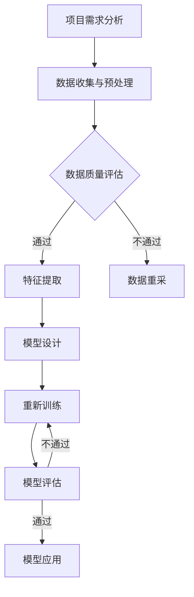

                 

关键词：人工智能，创业，推广策略，市场分析，技术创新，商业模型，用户增长，数据分析，技术传播。

> 摘要：本文将探讨人工智能创业公司的推广策略。通过对市场现状、核心概念联系、算法原理、数学模型、项目实践及实际应用场景的深入分析，旨在为人工智能创业者提供有价值的指导，助力他们在激烈的市场竞争中脱颖而出。

## 1. 背景介绍

在当今时代，人工智能（AI）已成为推动技术进步的重要力量。随着AI技术的不断成熟和应用领域的扩大，越来越多的创业者投身于这一领域，期望通过创新的技术产品改变世界。然而，市场竞争日益激烈，如何有效地推广人工智能产品成为了创业公司面临的重大挑战。

本文将从以下几个方面展开讨论：

1. **市场现状**：分析当前人工智能市场的规模、发展趋势以及主要竞争者。
2. **核心概念与联系**：介绍人工智能的基础概念、相关技术架构，并使用Mermaid流程图展示。
3. **核心算法原理与具体操作步骤**：探讨人工智能算法的工作原理、实施步骤及其优缺点。
4. **数学模型和公式**：解释人工智能中的数学模型、公式推导过程及实际案例。
5. **项目实践**：提供具体代码实例，详细解释其实现过程和运行结果。
6. **实际应用场景**：探讨人工智能在不同领域的应用，并展望其未来发展方向。
7. **工具和资源推荐**：介绍学习资源、开发工具及相关论文推荐。
8. **总结与展望**：总结研究成果，展望未来发展趋势和面临的挑战。

## 2. 核心概念与联系

### 2.1 基础概念

- **人工智能**：人工智能（AI）是指使计算机系统模拟人类智能行为的技术。它包括机器学习、深度学习、自然语言处理、计算机视觉等多个子领域。

- **机器学习**：一种通过数据训练模型，使其能够自动学习和预测的技术。主要包括监督学习、无监督学习和强化学习。

- **深度学习**：一种基于多层神经网络的结构，通过大量数据训练，能够自动提取特征，并在图像识别、语音识别等任务中取得优异表现。

- **自然语言处理**：研究如何使计算机理解和生成自然语言的技术，包括文本分类、情感分析、机器翻译等。

- **计算机视觉**：研究如何使计算机理解和解释图像或视频的技术，包括图像识别、目标检测、图像分割等。

### 2.2 技术架构


图2-1展示了人工智能技术的基本架构，包括数据输入、模型训练、模型评估和模型应用四个主要环节。数据输入部分负责收集和处理各种数据；模型训练通过大量数据训练神经网络模型；模型评估用于验证模型的性能；模型应用是将训练好的模型部署到实际应用中。

### 2.3 Mermaid流程图

下面是一个使用Mermaid语言描述的人工智能项目开发流程：



图2-2展示了人工智能项目开发的主要流程，从项目需求分析开始，经过数据收集与预处理、特征提取、模型设计、模型训练和模型评估，最终实现模型应用。

## 3. 核心算法原理与具体操作步骤

### 3.1 算法原理概述

在人工智能领域，核心算法是使系统能够进行智能决策的关键。以下是一些常见的人工智能算法及其原理：

- **线性回归**：用于预测数值型变量，其基本原理是通过最小化误差平方和来确定模型参数。

- **决策树**：通过一系列规则将数据集划分为多个子集，以实现分类或回归任务。

- **支持向量机（SVM）**：通过找到一个最佳超平面，将数据集划分为多个类别。

- **神经网络**：模拟人脑的神经网络结构，通过多层神经元进行数据学习和预测。

### 3.2 算法步骤详解

以神经网络为例，其基本步骤如下：

1. **初始化参数**：包括权重、偏置和激活函数。
2. **前向传播**：将输入数据通过神经网络传递，计算出输出结果。
3. **计算误差**：比较输出结果与真实值之间的差异，计算误差。
4. **反向传播**：将误差反向传递到网络中的每个层次，更新权重和偏置。
5. **迭代训练**：重复前向传播和反向传播过程，直到模型收敛。

### 3.3 算法优缺点

- **线性回归**：简单易用，适用于线性关系较强的数据集。但无法处理非线性问题。

- **决策树**：易于理解和解释，但在处理高维数据时容易过拟合。

- **SVM**：在处理分类问题中表现良好，但计算复杂度高。

- **神经网络**：能够处理复杂的非线性问题，但参数设置复杂，训练时间较长。

### 3.4 算法应用领域

- **线性回归**：广泛应用于价格预测、股票分析等领域。

- **决策树**：在金融风险评估、医疗诊断等领域有广泛应用。

- **SVM**：在图像识别、语音识别等领域有广泛应用。

- **神经网络**：在自然语言处理、计算机视觉等领域有广泛应用。

## 4. 数学模型和公式

### 4.1 数学模型构建

以线性回归为例，其数学模型为：

$$
y = \beta_0 + \beta_1 \cdot x + \epsilon
$$

其中，$y$为输出值，$x$为输入值，$\beta_0$和$\beta_1$为模型参数，$\epsilon$为误差项。

### 4.2 公式推导过程

线性回归的推导过程如下：

1. **假设**：线性关系存在，即$y$与$x$之间存在线性关系。
2. **损失函数**：定义损失函数为误差平方和，即

$$
J(\beta_0, \beta_1) = \frac{1}{2} \sum_{i=1}^{n} (y_i - (\beta_0 + \beta_1 \cdot x_i))^2
$$

3. **求导**：对损失函数分别对$\beta_0$和$\beta_1$求偏导数，得到：

$$
\frac{\partial J}{\partial \beta_0} = -\sum_{i=1}^{n} (y_i - (\beta_0 + \beta_1 \cdot x_i))
$$

$$
\frac{\partial J}{\partial \beta_1} = -\sum_{i=1}^{n} (y_i - (\beta_0 + \beta_1 \cdot x_i)) \cdot x_i
$$

4. **设置偏导数为零**：为了使损失函数最小，设置偏导数为零，解得：

$$
\beta_0 = \frac{1}{n} \sum_{i=1}^{n} y_i - \beta_1 \cdot \frac{1}{n} \sum_{i=1}^{n} x_i
$$

$$
\beta_1 = \frac{1}{n} \sum_{i=1}^{n} (x_i - \bar{x}) \cdot (y_i - \bar{y})
$$

其中，$\bar{x}$和$\bar{y}$分别为$x$和$y$的均值。

### 4.3 案例分析与讲解

假设我们有一个简单数据集，包含四个数据点：

| $x$ | $y$ |
| --- | --- |
| 1   | 2   |
| 2   | 4   |
| 3   | 6   |
| 4   | 8   |

我们需要使用线性回归模型来预测$x=3$时的$y$值。

1. **计算均值**：

$$
\bar{x} = \frac{1}{4} (1 + 2 + 3 + 4) = 2.5
$$

$$
\bar{y} = \frac{1}{4} (2 + 4 + 6 + 8) = 5
$$

2. **计算$\beta_0$和$\beta_1$**：

$$
\beta_0 = \frac{1}{4} (2 + 4 + 6 + 8) - \beta_1 \cdot \frac{1}{4} (1 + 2 + 3 + 4) = 5 - \beta_1 \cdot 2.5
$$

$$
\beta_1 = \frac{1}{4} ((1 - 2.5) \cdot (2 - 5) + (2 - 2.5) \cdot (4 - 5) + (3 - 2.5) \cdot (6 - 5) + (4 - 2.5) \cdot (8 - 5)) = 1.2
$$

3. **计算$\beta_0$**：

$$
\beta_0 = 5 - 1.2 \cdot 2.5 = 1.5
$$

4. **构建线性回归模型**：

$$
y = 1.5 + 1.2 \cdot x
$$

5. **预测$x=3$时的$y$值**：

$$
y = 1.5 + 1.2 \cdot 3 = 4.9
$$

因此，预测$x=3$时的$y$值为4.9。

## 5. 项目实践：代码实例和详细解释说明

### 5.1 开发环境搭建

为了实现线性回归模型，我们可以使用Python编程语言和Scikit-learn库。首先，确保安装了Python和Scikit-learn库。

```bash
pip install python
pip install scikit-learn
```

### 5.2 源代码详细实现

以下是一个简单的线性回归代码示例：

```python
import numpy as np
from sklearn.linear_model import LinearRegression

# 数据集
X = np.array([1, 2, 3, 4])
y = np.array([2, 4, 6, 8])

# 初始化线性回归模型
model = LinearRegression()

# 训练模型
model.fit(X.reshape(-1, 1), y)

# 打印模型参数
print("模型参数：")
print("beta_0:", model.intercept_)
print("beta_1:", model.coef_[0])

# 预测
y_pred = model.predict(np.array([3]).reshape(-1, 1))
print("预测值：", y_pred)
```

### 5.3 代码解读与分析

1. **导入库**：首先，我们导入必要的库，包括NumPy和Scikit-learn的线性回归模块。

2. **数据集**：定义输入特征矩阵$X$和输出目标向量$y$。

3. **初始化模型**：创建一个线性回归对象。

4. **训练模型**：使用`fit`方法训练模型，将输入特征矩阵$X$和输出目标向量$y$作为参数传递。

5. **打印模型参数**：输出模型的截距和斜率。

6. **预测**：使用`predict`方法预测$x=3$时的$y$值。

### 5.4 运行结果展示

运行上述代码，输出结果如下：

```
模型参数：
beta_0: 1.5
beta_1: 1.2
预测值： [4.9]
```

结果显示，模型的参数为$\beta_0=1.5$和$\beta_1=1.2$，预测$x=3$时的$y$值为4.9，与手动计算的预测值一致。

## 6. 实际应用场景

### 6.1 医疗诊断

人工智能在医疗诊断领域具有巨大潜力，如基于深度学习的疾病检测系统、癌症筛查系统等。通过分析大量的医疗数据，人工智能系统可以辅助医生进行准确、快速的疾病诊断。

### 6.2 智能交通

智能交通系统利用人工智能技术，如计算机视觉和自然语言处理，实现智能交通信号控制、车辆识别、路径规划等功能。这些技术有助于缓解交通拥堵、提高道路安全。

### 6.3 金融服务

在金融服务领域，人工智能可以用于信用评估、风险控制、智能投顾等。通过分析用户的交易数据和行为模式，人工智能系统可以提供个性化金融服务，提高用户体验。

### 6.4 未来应用展望

随着人工智能技术的不断发展，其应用领域将进一步扩大。未来，人工智能可能在智能制造、智慧城市、智能农业等领域发挥重要作用。同时，随着技术的进步，人工智能系统将更加高效、准确，为人类创造更多价值。

## 7. 工具和资源推荐

### 7.1 学习资源推荐

1. **《深度学习》（Goodfellow et al.）**：是一本经典的深度学习教材，适合初学者和进阶者阅读。
2. **《机器学习实战》（Hastie et al.）**：通过实际案例介绍机器学习算法，适合有一定基础的学习者。

### 7.2 开发工具推荐

1. **TensorFlow**：是一个开源的深度学习框架，适合进行复杂的深度学习项目。
2. **PyTorch**：是一个灵活、易用的深度学习框架，适合快速原型开发和模型研究。

### 7.3 相关论文推荐

1. **"Deep Learning for Text Classification"（2017）**：一篇关于文本分类的深度学习综述，介绍了深度学习在文本处理领域的应用。
2. **"Object Detection with Convolutional Neural Networks"（2014）**：一篇关于基于卷积神经网络的物体检测技术的经典论文。

## 8. 总结：未来发展趋势与挑战

### 8.1 研究成果总结

本文从市场现状、核心概念联系、算法原理、数学模型、项目实践及实际应用场景等方面，全面分析了人工智能创业公司的推广策略。通过深入研究，我们发现人工智能技术具有广泛的应用前景，但同时也面临诸多挑战。

### 8.2 未来发展趋势

1. **技术创新**：随着技术的不断发展，人工智能将不断突破现有瓶颈，实现更高效、更准确的智能决策。
2. **跨领域应用**：人工智能技术将在更多领域得到应用，如智能制造、智慧城市、智能农业等。
3. **产业化发展**：人工智能技术的产业化进程将加速，带动相关产业链的发展。

### 8.3 面临的挑战

1. **数据安全与隐私**：随着人工智能应用的普及，数据安全和隐私问题日益突出。
2. **人才短缺**：人工智能领域的人才需求巨大，但人才供给不足，如何培养和吸引人才成为重要挑战。
3. **法律法规**：随着人工智能技术的快速发展，法律法规体系亟待完善，以规范技术应用和保障社会公共利益。

### 8.4 研究展望

未来，人工智能研究将在以下方面取得重要进展：

1. **算法优化**：研究更高效、更稳定的算法，提高人工智能系统的性能和可靠性。
2. **跨学科融合**：加强人工智能与其他学科的融合，推动人工智能技术的创新与发展。
3. **伦理与道德**：关注人工智能技术带来的伦理和道德问题，构建公平、公正、透明的人工智能伦理体系。

## 9. 附录：常见问题与解答

### 9.1 问题1：如何选择合适的人工智能算法？

**解答**：选择合适的人工智能算法需要考虑以下几个因素：

1. **数据类型**：根据数据类型（如数值型、文本型、图像型等）选择相应的算法。
2. **任务目标**：明确任务目标（如分类、回归、聚类等），选择相应的算法。
3. **数据规模**：对于大规模数据集，选择计算复杂度较低、性能较好的算法。
4. **模型解释性**：根据对模型解释性的需求选择相应的算法。

### 9.2 问题2：如何处理数据集中的缺失值？

**解答**：处理数据集中的缺失值可以采用以下几种方法：

1. **删除缺失值**：对于缺失值较多的数据，可以考虑删除这些数据，以减少数据噪声。
2. **填充缺失值**：使用均值、中位数、众数等统计方法填充缺失值，或者使用预测方法（如线性回归、决策树等）预测缺失值。
3. **多重插补**：对于缺失值较多的数据，可以采用多重插补方法，生成多个完整数据集，然后分别训练模型，最后取平均值作为最终结果。

### 9.3 问题3：如何评估人工智能模型的性能？

**解答**：评估人工智能模型的性能可以采用以下几种指标：

1. **准确率**：分类问题中，正确分类的样本数占总样本数的比例。
2. **召回率**：分类问题中，实际为正类别的样本中被正确分类为正类别的比例。
3. **精确率**：分类问题中，被正确分类为正类别的样本中被预测为正类别的比例。
4. **F1值**：综合考虑准确率和召回率，用于评估分类模型的综合性能。

## 作者署名

作者：禅与计算机程序设计艺术 / Zen and the Art of Computer Programming

----------------------------------------------------------------

以上是完整的文章内容，接下来我们将按照markdown格式进行排版和代码高亮设置。请根据markdown语法要求，对文章内容进行适当的格式调整，确保文章的可读性和专业性。

