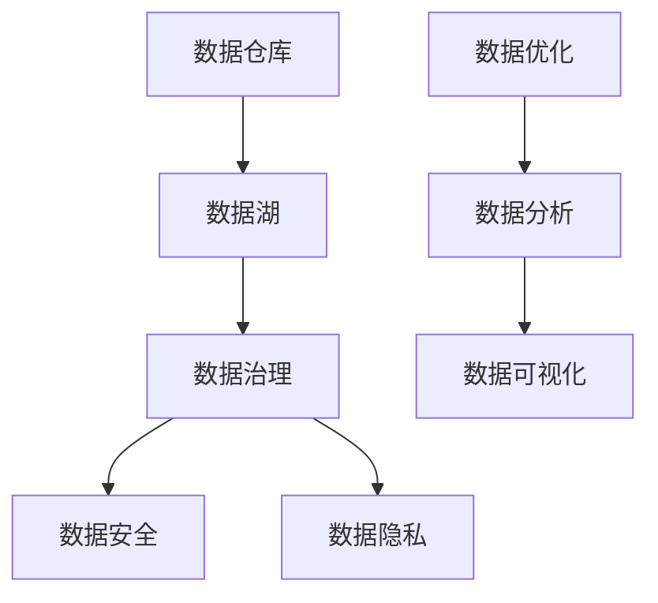

                 

关键词：人工智能、数据管理、创业、数据安全、数据隐私、数据优化、数据分析、云计算、大数据处理。

> 摘要：本文旨在为人工智能创业公司提供一套完整的数据管理技巧，帮助它们在竞争激烈的市场中脱颖而出。通过深入探讨数据管理的重要性、核心概念、算法原理、数学模型、实际应用以及未来趋势，本文旨在为创业者提供实用而全面的数据管理策略。

## 1. 背景介绍

在当今数字化时代，数据已经成为企业最重要的资产之一。无论是传统行业还是新兴领域，数据驱动决策已经成为企业成功的基石。人工智能（AI）作为数据科学的重要分支，通过机器学习和深度学习技术，能够从大量数据中提取有价值的信息，从而为业务提供强有力的支持。然而，数据管理的复杂性也成为了许多创业公司的难题。有效的数据管理不仅能够提升数据质量，还能够提高数据分析的效率和准确性，为企业的战略决策提供有力支撑。

### 1.1 数据管理的重要性

数据管理的重要性体现在以下几个方面：

1. **数据安全与隐私**：在处理大量数据时，确保数据的安全性和用户隐私至关重要。数据泄露可能会导致严重的法律和商业后果。
2. **数据质量**：高质量的数据是准确分析和决策的基础。数据质量低下会导致错误的结论和战略失误。
3. **数据治理**：有效的数据治理能够确保数据的一致性、完整性和可靠性，从而提高数据利用率。
4. **成本效益**：高效的数据管理能够降低存储和处理成本，提高资源利用率。

### 1.2 数据管理挑战

1. **数据量级**：随着大数据技术的发展，数据量级日益增长，对数据存储和处理提出了更高的要求。
2. **数据多样性**：数据来源多样，格式各异，包括结构化数据、非结构化数据和半结构化数据。
3. **数据隐私与合规性**：遵守各种数据隐私法规，如GDPR，对于创业公司来说是一个巨大的挑战。
4. **技术复杂性**：数据管理涉及多种技术和工具，对于技术团队来说是一个复杂的过程。

## 2. 核心概念与联系

数据管理涉及多个核心概念，包括数据仓库、数据湖、数据治理、数据安全、数据隐私等。下面是一个简化的Mermaid流程图，展示了这些概念之间的关系。



### 2.1 数据仓库与数据湖

数据仓库是用于存储、管理和分析结构化数据的大型数据库系统。数据湖则是一种存储原始数据（包括结构化、半结构化和非结构化数据）的分布式存储架构。与数据仓库相比，数据湖具有更高的灵活性和扩展性，能够处理更多样化的数据。

### 2.2 数据治理

数据治理是指制定和执行政策、程序和标准，确保数据的一致性、完整性和可靠性。数据治理涉及数据质量监控、数据生命周期管理、数据分类和访问控制等。

### 2.3 数据安全与数据隐私

数据安全涉及防止数据泄露、损坏和未授权访问的措施。数据隐私则涉及保护个人数据不被滥用或泄露。这两个方面在数据管理中至关重要，特别是在处理敏感数据时。

### 2.4 数据优化与数据分析

数据优化是指通过清洗、转换和整合数据，提高数据的可用性和分析效率。数据分析则是使用统计和机器学习技术从数据中提取有价值的信息。

## 3. 核心算法原理 & 具体操作步骤

### 3.1 算法原理概述

数据管理中常用的算法包括数据清洗、数据聚类、数据分类和数据分析算法等。下面简要介绍这些算法的原理。

### 3.2 算法步骤详解

1. **数据清洗**：包括去除重复数据、填补缺失值、消除噪声和异常值等。
2. **数据聚类**：将相似数据点分组，常用的算法有K-means、DBSCAN等。
3. **数据分类**：将数据分为不同的类别，常用的算法有决策树、支持向量机等。
4. **数据分析**：使用统计和机器学习技术从数据中提取有价值的信息，如相关性分析、预测建模等。

### 3.3 算法优缺点

- **数据清洗**：优点是提高数据质量，缺点是处理复杂，可能引入偏差。
- **数据聚类**：优点是能够发现数据中的自然结构，缺点是结果依赖于初始化参数。
- **数据分类**：优点是能够提供明确的分类结果，缺点是可能受到过拟合问题的影响。
- **数据分析**：优点是能够提供深入的洞察，缺点是可能需要大量的计算资源。

### 3.4 算法应用领域

- **数据清洗**：在金融、医疗、电商等领域都有广泛应用。
- **数据聚类**：在市场细分、图像识别等领域有重要应用。
- **数据分类**：在垃圾邮件过滤、信用评分等领域有广泛应用。
- **数据分析**：在预测建模、风险分析等领域有广泛应用。

## 4. 数学模型和公式 & 详细讲解 & 举例说明

### 4.1 数学模型构建

在数据管理中，常用的数学模型包括线性回归、逻辑回归、决策树等。下面以线性回归为例，介绍数学模型的构建过程。

### 4.2 公式推导过程

线性回归模型的基本公式为：

\[ y = \beta_0 + \beta_1 \cdot x \]

其中，\( y \) 是因变量，\( x \) 是自变量，\( \beta_0 \) 和 \( \beta_1 \) 是模型的参数。

### 4.3 案例分析与讲解

假设我们想研究房价与房间数量之间的关系。收集了一些数据，包括房间数量（\( x \)）和房价（\( y \））。

```plaintext
房间数量  房价
1         200,000
2         250,000
3         300,000
4         350,000
5         400,000
```

我们可以使用线性回归模型来预测未知房价。首先，需要计算参数 \( \beta_0 \) 和 \( \beta_1 \)：

\[ \beta_1 = \frac{\sum{(x_i - \bar{x})(y_i - \bar{y})}}{\sum{(x_i - \bar{x})^2}} \]

\[ \beta_0 = \bar{y} - \beta_1 \cdot \bar{x} \]

其中，\( \bar{x} \) 和 \( \bar{y} \) 分别是房间数量和房价的平均值。

经过计算，我们得到：

\[ \beta_1 = \frac{(1-2.5)(200-250) + (2-2.5)(250-250) + (3-2.5)(300-250) + (4-2.5)(350-250) + (5-2.5)(400-250)}{(1-2.5)^2 + (2-2.5)^2 + (3-2.5)^2 + (4-2.5)^2 + (5-2.5)^2} \]

\[ \beta_0 = 250,000 - 25,000 \cdot 2.5 \]

\[ \beta_1 \approx 62,500 \]

\[ \beta_0 \approx 187,500 \]

因此，线性回归模型为：

\[ y = 187,500 + 62,500 \cdot x \]

### 4.4 案例分析与讲解

使用上述模型，我们可以预测房间数量为3的房价：

\[ y = 187,500 + 62,500 \cdot 3 \]

\[ y \approx 312,500 \]

这意味着，在一个房间数量为3的房产中，房价预计为312,500美元。

## 5. 项目实践：代码实例和详细解释说明

### 5.1 开发环境搭建

在本项目中，我们将使用Python编程语言，结合Pandas、Scikit-learn等库，实现数据清洗、数据聚类和数据分类算法。首先，确保安装了Python和以下库：

```bash
pip install pandas scikit-learn matplotlib
```

### 5.2 源代码详细实现

下面是一个简单的示例，展示如何使用Pandas进行数据清洗，使用Scikit-learn进行数据聚类和数据分类。

```python
import pandas as pd
from sklearn.cluster import KMeans
from sklearn.model_selection import train_test_split
from sklearn.tree import DecisionTreeClassifier
from sklearn.metrics import accuracy_score
import matplotlib.pyplot as plt

# 5.2.1 数据读取与初步清洗
data = pd.read_csv('data.csv')
data.dropna(inplace=True)  # 删除缺失值

# 5.2.2 数据分类
X = data[['rooms', 'price']]  # 特征选择
y = data['label']  # 目标变量

# 5.2.3 数据聚类
kmeans = KMeans(n_clusters=3, random_state=42)
clusters = kmeans.fit_predict(X)

# 5.2.4 数据分类
X_train, X_test, y_train, y_test = train_test_split(X, y, test_size=0.2, random_state=42)
clf = DecisionTreeClassifier(random_state=42)
clf.fit(X_train, y_train)
predictions = clf.predict(X_test)

# 5.2.5 结果分析
print("Accuracy:", accuracy_score(y_test, predictions))

# 5.2.6 可视化
plt.scatter(X['rooms'], X['price'], c=clusters)
plt.xlabel('Rooms')
plt.ylabel('Price')
plt.title('K-means Clustering')
plt.show()
```

### 5.3 代码解读与分析

上述代码分为几个部分：

- **数据读取与初步清洗**：使用Pandas读取CSV文件，并删除缺失值。
- **数据分类**：选择特征和目标变量，准备数据用于分类。
- **数据聚类**：使用K-means算法对数据进行聚类。
- **数据分类**：使用决策树分类器进行分类，并计算准确率。
- **可视化**：使用Matplotlib展示聚类结果。

通过这个简单的示例，我们可以看到数据管理在实际项目中的应用。在实际开发中，需要根据具体需求调整代码和算法，以达到最佳效果。

## 6. 实际应用场景

数据管理在多个行业和领域有着广泛的应用，以下是几个典型的实际应用场景：

### 6.1 金融行业

在金融行业，数据管理有助于风险控制和合规性。通过实时监控交易数据，金融机构可以及时发现异常交易，降低风险。此外，数据分析还可以用于信用评分、投资组合优化等。

### 6.2 医疗保健

在医疗保健领域，数据管理可以提高医疗服务的质量和效率。通过对患者数据的分析，医生可以更准确地诊断病情，制定个性化的治疗方案。此外，数据管理还可以用于疾病预测和公共卫生监测。

### 6.3 电子商务

电子商务公司通过数据管理可以更好地了解客户需求，提高客户满意度。通过分析客户购物行为和偏好，公司可以推荐合适的商品，提高销售额。此外，数据分析还可以用于库存管理和供应链优化。

### 6.4 制造业

在制造业，数据管理可以提高生产效率和产品质量。通过对生产数据的分析，企业可以优化生产流程，减少故障和停机时间。此外，数据管理还可以用于预测性维护和设备优化。

## 6.4 未来应用展望

随着技术的不断发展，数据管理将在更多领域得到应用。以下是几个未来的应用展望：

- **智能城市**：通过数据管理，智能城市可以实现交通优化、能源管理、环境监测等。
- **物联网（IoT）**：物联网设备产生的海量数据需要高效的数据管理，以支持实时分析和决策。
- **区块链**：区块链技术与数据管理的结合，将有助于提高数据的安全性和透明度。

## 7. 工具和资源推荐

为了更好地进行数据管理，以下是几个推荐的工具和资源：

### 7.1 学习资源推荐

- **《数据科学入门》（Data Science from Scratch）**：作者Joel Grus，适合初学者。
- **《Python数据科学手册》（Python Data Science Handbook）**：作者Jake VanderPlas，内容全面，适合进阶者。

### 7.2 开发工具推荐

- **Jupyter Notebook**：强大的交互式计算环境，适用于数据分析和可视化。
- **Docker**：容器化技术，有助于开发、测试和部署数据管理应用程序。

### 7.3 相关论文推荐

- **"Big Data: A Revolution That Will Transform How We Live, Work, and Think"**：作者Viktor Mayer-Schönberger和Kenneth Cukier，深入探讨了大数据的影响。
- **"Data-Driven Development in the Era of Big Data"**：作者Hans-Torben Astrup，探讨了大数据时代的数据驱动开发。

## 8. 总结：未来发展趋势与挑战

### 8.1 研究成果总结

数据管理领域的研究取得了显著成果，包括高效的数据存储、处理和分析算法，以及各种数据管理工具和平台。然而，数据管理仍然面临着许多挑战，如数据隐私、数据质量和数据治理等。

### 8.2 未来发展趋势

- **自动化与智能化**：数据管理将更加自动化和智能化，通过机器学习和人工智能技术，提高数据处理的效率和准确性。
- **云计算与边缘计算**：云计算和边缘计算的结合，将为数据管理提供更灵活的解决方案。
- **区块链**：区块链技术将提高数据的安全性和透明度，为数据管理带来新的机会。

### 8.3 面临的挑战

- **数据隐私**：如何在确保数据隐私的同时，充分利用数据的价值，是一个重要挑战。
- **数据质量**：提高数据质量仍然是一个长期任务，需要持续的监控和改进。
- **数据治理**：有效的数据治理能够提高数据的一致性和可靠性，但实施起来需要大量的资源和专业知识。

### 8.4 研究展望

数据管理领域的研究将继续深入，探索新的算法和技术，以应对日益复杂的数据环境。同时，数据管理将与其他领域（如区块链、物联网等）相结合，推动更多创新和应用。

## 9. 附录：常见问题与解答

### 9.1 什么是数据仓库？

数据仓库是一种用于存储、管理和分析结构化数据的大型数据库系统。它通常包含历史数据，以便进行复杂的分析。

### 9.2 数据湖与数据仓库的区别是什么？

数据湖是一种分布式存储架构，用于存储各种类型的原始数据（包括结构化、半结构化和非结构化数据），而数据仓库主要用于存储结构化数据。

### 9.3 数据治理的重要性是什么？

数据治理确保数据的一致性、完整性和可靠性，从而提高数据利用率，支持数据驱动的决策。

### 9.4 如何提高数据质量？

提高数据质量的方法包括数据清洗、数据集成、数据验证和数据监控等。

### 9.5 数据安全与数据隐私的区别是什么？

数据安全涉及防止数据泄露、损坏和未授权访问的措施，而数据隐私涉及保护个人数据不被滥用或泄露。

### 9.6 数据分析有哪些常见方法？

数据分析的常见方法包括统计分析、机器学习、数据挖掘和深度学习等。

### 9.7 什么是K-means算法？

K-means是一种常用的聚类算法，它通过迭代计算，将数据点分为K个簇，以最小化簇内距离和。

### 9.8 线性回归模型如何计算？

线性回归模型通过最小二乘法计算参数，以最小化预测值与实际值之间的误差。

### 9.9 数据分析在电商中的应用有哪些？

数据分析在电商中的应用包括用户行为分析、推荐系统、价格优化、库存管理和市场营销等。

### 9.10 数据管理工具有哪些？

常见的数据管理工具包括Hadoop、Spark、Oracle、MongoDB、MySQL等。

## 作者署名

作者：禅与计算机程序设计艺术 / Zen and the Art of Computer Programming
----------------------------------------------------------------
### 完成文章撰写后的操作指南 Guide for Submitting the Article

现在，您已经完成了文章的撰写。接下来，请按照以下步骤提交您的文章：

1. **校对和修改**：首先，对文章进行彻底的校对，确保没有语法错误、错别字，并且所有章节都符合之前的约定。

2. **格式化**：确保文章的格式正确，包括章节标题的格式、段落间距、引用格式等。使用Markdown格式，按照要求编写文章。

3. **附件格式**：将文章保存为`.md`（Markdown）文件，并准备一个`.txt`或`.pdf`格式的副本，以防Markdown格式无法正确显示。

4. **提交**：将`.md`文件通过适当的渠道（如电子邮件、云存储服务或在线平台）提交。同时，附上`.txt`或`.pdf`副本，以备后续查看。

5. **备注**：在提交邮件或文档中，注明文章的标题、作者姓名、字数以及所有要求的附加信息，以确保接收者能够迅速了解文章的基本信息。

6. **等待反馈**：提交后，等待编辑团队的审阅和反馈。如有需要，根据反馈进行修改和完善。

7. **最终确认**：在收到编辑的最终确认后，确认无误并确保所有细节都符合要求。一旦确认，文章将被正式发布。

祝您撰写顺利，期待看到您的精彩作品！

