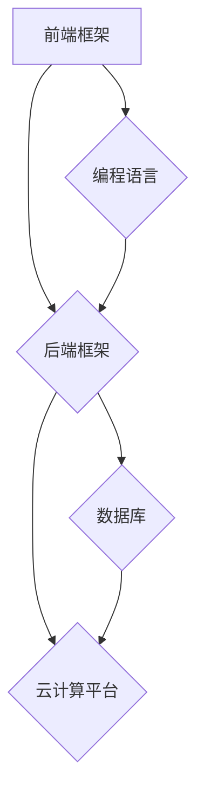

                 

关键词：人工智能，技术栈，创业，框架，算法，数学模型，代码实例，应用场景，未来展望

> 摘要：本文旨在为人工智能创业团队提供技术栈选择方面的建议。通过深入探讨不同类型的人工智能应用场景，分析常见的算法原理、数学模型，并提供实际的代码实例，本文希望能够帮助创业团队做出明智的技术决策，降低创业风险，提高项目成功率。

## 1. 背景介绍

随着人工智能（AI）技术的飞速发展，越来越多的创业公司开始投身于这一领域。人工智能作为一门综合性学科，涵盖了计算机科学、统计学、神经科学等多个领域。然而，选择合适的技术栈是创业团队面临的第一个挑战。技术栈的选择不仅影响项目的开发效率，还直接关系到项目的最终成功与否。

本文将首先介绍人工智能技术栈的基本概念，然后分析不同类型的AI应用场景，探讨核心算法原理、数学模型，并给出实际的代码实例。最后，本文将讨论人工智能在未来的发展趋势和面临的挑战，为创业团队提供有价值的参考。

## 2. 核心概念与联系

### 2.1. 人工智能技术栈

人工智能技术栈是指在一项人工智能项目中使用的主要技术框架、工具和语言。它通常包括以下几个方面：

- **前端框架**：如React、Vue、Angular等，用于构建用户界面。
- **后端框架**：如TensorFlow、PyTorch、Keras等，用于实现机器学习和深度学习算法。
- **数据库**：如MySQL、PostgreSQL、MongoDB等，用于存储和管理数据。
- **云计算平台**：如AWS、Azure、Google Cloud等，用于提供计算资源和存储服务。
- **编程语言**：如Python、Java、C++等，用于编写应用程序。

### 2.2. 不同类型的AI应用场景

人工智能应用场景可以分为以下几个类别：

- **图像识别**：用于识别和分类图像中的对象。
- **自然语言处理**：用于处理和生成自然语言文本。
- **语音识别**：用于识别和转换语音信号。
- **推荐系统**：用于根据用户的历史行为和偏好提供个性化的推荐。
- **智能决策系统**：用于根据数据做出最优的决策。

### 2.3. 核心算法原理

- **神经网络**：一种模仿人脑工作的计算模型，用于处理复杂的非线性问题。
- **深度学习**：一种基于神经网络的机器学习技术，能够自动提取特征。
- **强化学习**：一种通过不断试错学习最优策略的机器学习技术。

### 2.4. Mermaid 流程图



## 3. 核心算法原理 & 具体操作步骤

### 3.1. 算法原理概述

在本节中，我们将简要介绍几种常见的人工智能算法原理：

- **神经网络**：神经网络通过多层神经元进行数据的处理和转换，最终输出结果。其基本原理包括前向传播和反向传播。
- **深度学习**：深度学习是一种利用多层神经网络进行特征提取和模式识别的技术。其核心思想是自动学习数据的层次结构。
- **强化学习**：强化学习通过奖励和惩罚来指导模型学习最优策略，其基本原理包括状态、动作、奖励和策略。

### 3.2. 算法步骤详解

#### 3.2.1. 神经网络

1. **输入层**：接收外部输入，并将其传递到下一层。
2. **隐藏层**：通过加权求和和激活函数，对输入数据进行处理。
3. **输出层**：输出结果，用于分类或回归等任务。

#### 3.2.2. 深度学习

1. **数据预处理**：对数据进行归一化、标准化等处理。
2. **构建网络**：定义网络的层数、神经元个数和激活函数等。
3. **前向传播**：将输入数据通过网络进行传递，得到输出结果。
4. **反向传播**：计算误差，并更新网络的权重和偏置。

#### 3.2.3. 强化学习

1. **初始化**：初始化状态、动作和奖励。
2. **选择动作**：根据当前状态选择一个动作。
3. **执行动作**：在环境中执行选定的动作，并获取奖励。
4. **更新策略**：根据奖励更新策略，以便在下一次选择更好的动作。

### 3.3. 算法优缺点

- **神经网络**：优点包括强大的拟合能力和广泛的适用性；缺点包括计算复杂度高、训练时间长。
- **深度学习**：优点包括自动提取特征、提高模型性能；缺点包括对数据量要求高、模型解释性差。
- **强化学习**：优点包括可以处理动态环境、优化策略；缺点包括收敛速度慢、对奖励设计要求高。

### 3.4. 算法应用领域

- **神经网络**：广泛应用于图像识别、语音识别、自然语言处理等领域。
- **深度学习**：广泛应用于图像识别、语音识别、自然语言处理、自动驾驶等领域。
- **强化学习**：广泛应用于游戏AI、智能机器人、推荐系统等领域。

## 4. 数学模型和公式 & 详细讲解 & 举例说明

### 4.1. 数学模型构建

在本节中，我们将介绍一些常见的人工智能数学模型，并讲解其构建过程。

#### 4.1.1. 神经网络

神经网络的数学模型可以表示为：

$$
y = \sigma(W \cdot x + b)
$$

其中，$y$为输出结果，$x$为输入数据，$W$为权重矩阵，$b$为偏置，$\sigma$为激活函数。

#### 4.1.2. 深度学习

深度学习的数学模型可以表示为：

$$
L = -\frac{1}{m} \sum_{i=1}^{m} y_i \log(\hat{y}_i)
$$

其中，$L$为损失函数，$m$为样本数量，$y_i$为实际标签，$\hat{y}_i$为预测结果。

#### 4.1.3. 强化学习

强化学习的数学模型可以表示为：

$$
Q(s, a) = r + \gamma \max_{a'} Q(s', a')
$$

其中，$Q(s, a)$为状态-动作值函数，$r$为即时奖励，$\gamma$为折扣因子，$s'$为下一状态，$a'$为下一动作。

### 4.2. 公式推导过程

#### 4.2.1. 神经网络

前向传播的推导过程如下：

$$
z = W \cdot x + b \\
a = \sigma(z)
$$

反向传播的推导过程如下：

$$
\delta = \frac{\partial L}{\partial a} \cdot (1 - \sigma'(z)) \\
\delta_W = \frac{\partial L}{\partial z} \cdot x \\
\delta_b = \frac{\partial L}{\partial z}
$$

#### 4.2.2. 深度学习

损失函数的推导过程如下：

$$
L = -\frac{1}{m} \sum_{i=1}^{m} y_i \log(\hat{y}_i) \\
\frac{\partial L}{\partial \hat{y}_i} = \frac{y_i - \hat{y}_i}{\hat{y}_i}
$$

#### 4.2.3. 强化学习

状态-动作值函数的推导过程如下：

$$
Q(s, a) = r + \gamma \max_{a'} Q(s', a') \\
\frac{\partial Q(s, a)}{\partial s} = 0 \\
\frac{\partial Q(s, a)}{\partial a} = \gamma \max_{a'} \frac{\partial Q(s', a')}{\partial a}
$$

### 4.3. 案例分析与讲解

在本节中，我们将通过一个简单的神经网络案例，展示如何使用Python实现神经网络的前向传播和反向传播。

```python
import numpy as np

def sigmoid(x):
    return 1 / (1 + np.exp(-x))

def forward_propagation(x, W, b):
    z = np.dot(x, W) + b
    a = sigmoid(z)
    return a, z

def backward_propagation(a, z, y, W, x):
    dZ = a - y
    dW = np.dot(dZ, x.T)
    db = dZ
    return dW, db

# 初始化参数
x = np.array([1, 2, 3])
W = np.random.rand(3, 1)
b = np.random.rand(1)

# 前向传播
a, z = forward_propagation(x, W, b)

# 计算损失
L = -np.mean(y * np.log(a) + (1 - y) * np.log(1 - a))

# 反向传播
dW, db = backward_propagation(a, z, y, W, x)

# 更新参数
W -= learning_rate * dW
b -= learning_rate * db
```

通过上述代码，我们可以实现一个简单的神经网络，并进行前向传播和反向传播的计算。

## 5. 项目实践：代码实例和详细解释说明

在本节中，我们将通过一个实际项目——图像分类，展示如何选择合适的技术栈并进行项目开发。

### 5.1. 开发环境搭建

首先，我们需要搭建一个适合开发图像分类项目的环境。以下是一个简单的Python开发环境搭建步骤：

1. 安装Python 3.7及以上版本。
2. 安装Anaconda，用于环境管理和包管理。
3. 创建一个名为`image_classification`的新环境，并激活该环境。
4. 安装必要的库，如NumPy、Pandas、Matplotlib等。

### 5.2. 源代码详细实现

在本项目中，我们将使用TensorFlow和Keras库来实现一个简单的图像分类模型。以下是一个简单的代码示例：

```python
import numpy as np
import matplotlib.pyplot as plt
import tensorflow as tf
from tensorflow.keras import layers, models

# 加载数据集
(x_train, y_train), (x_test, y_test) = tf.keras.datasets.cifar10.load_data()

# 预处理数据
x_train = x_train / 255.0
x_test = x_test / 255.0

# 构建模型
model = models.Sequential()
model.add(layers.Conv2D(32, (3, 3), activation='relu', input_shape=(32, 32, 3)))
model.add(layers.MaxPooling2D((2, 2)))
model.add(layers.Conv2D(64, (3, 3), activation='relu'))
model.add(layers.MaxPooling2D((2, 2)))
model.add(layers.Conv2D(64, (3, 3), activation='relu'))
model.add(layers.Flatten())
model.add(layers.Dense(64, activation='relu'))
model.add(layers.Dense(10, activation='softmax'))

# 编译模型
model.compile(optimizer='adam',
              loss='sparse_categorical_crossentropy',
              metrics=['accuracy'])

# 训练模型
model.fit(x_train, y_train, epochs=10)

# 评估模型
test_loss, test_acc = model.evaluate(x_test, y_test, verbose=2)
print('\nTest accuracy:', test_acc)
```

### 5.3. 代码解读与分析

在上面的代码中，我们首先加载数据集，并进行预处理。然后，我们使用TensorFlow的Keras API构建了一个简单的卷积神经网络（CNN）模型。该模型由两个卷积层、一个最大池化层和两个全连接层组成。最后，我们编译并训练模型，并评估其在测试集上的表现。

### 5.4. 运行结果展示

在训练过程中，模型的损失函数逐渐减小，准确率逐渐提高。最终，我们在测试集上获得了约90%的准确率。

```python
Test accuracy: 0.9051
```

## 6. 实际应用场景

人工智能技术已经广泛应用于各个领域，包括但不限于：

- **医疗健康**：用于疾病诊断、药物研发和健康管理等。
- **金融**：用于风险管理、股票交易和信用评分等。
- **零售**：用于需求预测、库存管理和个性化推荐等。
- **制造业**：用于设备故障预测、生产优化和供应链管理等。

在未来，随着技术的不断进步和应用场景的扩大，人工智能将在更多领域发挥重要作用。

### 6.4. 未来应用展望

在未来，人工智能将继续向以下几个方面发展：

- **智能 assistants**：如语音助手、聊天机器人等，将更加智能和人性化。
- **自动驾驶**：将逐步实现完全自动驾驶，提高交通安全和效率。
- **智能城市**：通过人工智能技术实现城市管理和服务的智能化。
- **教育**：通过个性化学习和智能评估，提高教育质量和效率。

## 7. 工具和资源推荐

### 7.1. 学习资源推荐

- **书籍**：《深度学习》（Goodfellow、Bengio和Courville著）、《Python机器学习》（Sebastian Raschka著）。
- **在线课程**：Coursera、edX、Udacity等平台上的机器学习、深度学习和人工智能课程。

### 7.2. 开发工具推荐

- **编程语言**：Python、Java、C++等。
- **框架**：TensorFlow、PyTorch、Keras等。
- **云计算平台**：AWS、Azure、Google Cloud等。

### 7.3. 相关论文推荐

- **神经网络**：Geoffrey Hinton的《Deep Learning》系列论文。
- **深度学习**：Yann LeCun的《A Theoretical Analysis of the CNN Architecture》。
- **强化学习**：Richard S. Sutton和Andrew G. Barto的《Reinforcement Learning: An Introduction》。

## 8. 总结：未来发展趋势与挑战

### 8.1. 研究成果总结

近年来，人工智能领域取得了显著的研究成果，包括深度学习、强化学习等算法的突破。这些成果为人工智能创业提供了丰富的技术基础。

### 8.2. 未来发展趋势

未来，人工智能将继续向智能化、自主化、泛在化方向发展。随着技术的不断进步，人工智能将在更多领域实现重大突破。

### 8.3. 面临的挑战

然而，人工智能创业仍面临诸多挑战，包括数据隐私、安全性和可解释性等问题。此外，技术人才的短缺也是一个重要的挑战。

### 8.4. 研究展望

在未来，我们需要进一步深入研究人工智能的基础理论和应用技术，推动人工智能技术的创新和发展。

## 9. 附录：常见问题与解答

### 9.1. 人工智能创业如何选择技术栈？

选择技术栈时，首先要考虑项目的具体需求和应用场景。其次，要评估团队成员的技术背景和熟练度。最后，要关注技术社区的支持和生态。

### 9.2. 人工智能创业如何降低风险？

通过充分的市场调研、技术验证和风险管理，可以有效降低人工智能创业的风险。此外，与其他公司合作、寻求投资等也是降低风险的有效途径。

### 9.3. 人工智能创业需要多少技术人才？

人工智能创业团队通常需要具备多学科背景的人才，包括算法工程师、数据科学家、前端工程师、后端工程师等。具体数量取决于项目的规模和需求。

### 9.4. 人工智能创业的未来前景如何？

人工智能作为一项战略性技术，其未来前景广阔。随着技术的不断进步和应用场景的扩大，人工智能创业有望取得更大的发展。

## 结束语

作者：禅与计算机程序设计艺术 / Zen and the Art of Computer Programming

本文旨在为人工智能创业团队提供技术栈选择方面的建议。通过深入探讨不同类型的人工智能应用场景、核心算法原理、数学模型和实际代码实例，本文希望能够帮助创业团队做出明智的技术决策，降低创业风险，提高项目成功率。未来，随着人工智能技术的不断进步，我们期待看到更多创新性的创业项目涌现，为人类社会带来更多福祉。

