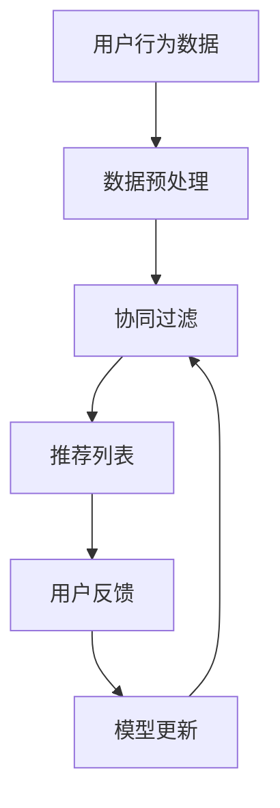
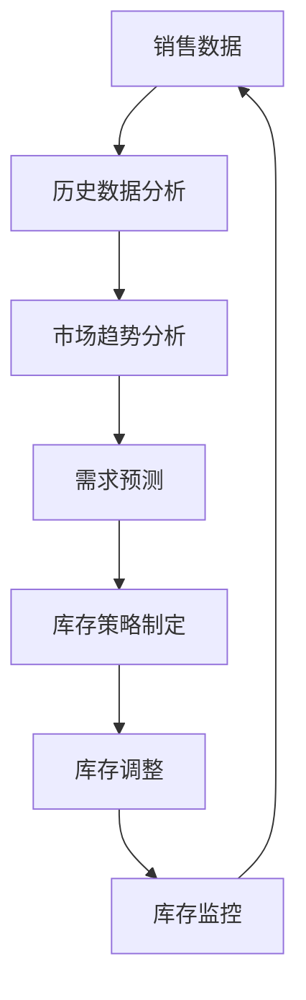

                 

关键词：人工智能、智能推荐、库存优化、电商平台、供给能力

> 摘要：本文将深入探讨人工智能在电商平台供给能力提升中的关键作用，特别是通过智能推荐和库存优化两大技术的应用，如何实现个性化服务和高效运营。文章将介绍核心概念、算法原理、数学模型、项目实践，以及实际应用场景和未来展望。

## 1. 背景介绍

随着互联网技术的飞速发展，电商平台已经成为现代社会中不可或缺的一部分。电商平台的供给能力，即提供商品和服务的能力，直接影响到平台的竞争力。传统的电商平台往往依赖于人工分析市场数据、预测需求，这既耗时又容易出错。而随着人工智能技术的进步，特别是智能推荐和库存优化技术的应用，电商平台可以在短时间内对海量数据进行处理和分析，从而实现更加精准的需求预测和库存管理，提升供给能力。

智能推荐技术通过对用户历史行为、偏好和反馈的分析，为用户推荐其可能感兴趣的商品。这一技术不仅能够提升用户体验，还能增加平台的销售额。库存优化则通过预测市场需求，合理安排库存，减少库存成本，提高库存周转率，从而提升平台的运营效率。

## 2. 核心概念与联系

### 2.1. 智能推荐技术

智能推荐技术主要基于以下核心概念：

- **协同过滤（Collaborative Filtering）**：通过分析用户之间的相似性，为用户推荐他们可能喜欢的商品。
- **内容推荐（Content-based Filtering）**：根据商品的属性和用户的历史偏好，为用户推荐相似的商品。
- **深度学习（Deep Learning）**：利用神经网络模型对用户行为数据进行建模，实现个性化的推荐。

以下是一个简单的 Mermaid 流程图，展示智能推荐系统的基本架构：



### 2.2. 库存优化技术

库存优化技术主要基于以下核心概念：

- **需求预测（Demand Forecasting）**：通过对历史销售数据和当前市场趋势的分析，预测未来的市场需求。
- **库存管理（Inventory Management）**：根据需求预测结果，合理安排库存水平，以满足市场需求，同时避免过度库存。

以下是一个简单的 Mermaid 流程图，展示库存优化系统的工作流程：



## 3. 核心算法原理 & 具体操作步骤

### 3.1. 算法原理概述

智能推荐和库存优化技术的核心算法通常是基于机器学习和数据挖掘技术。以下将简要介绍这两种技术的基本原理。

#### 智能推荐技术

- **协同过滤**：基于用户历史行为数据，通过计算用户之间的相似度，为用户推荐其他用户喜欢的商品。常用的相似度计算方法包括余弦相似度、皮尔逊相关系数等。
- **内容推荐**：基于商品的特征信息，如类别、品牌、价格等，为用户推荐具有相似属性的商品。
- **深度学习**：利用深度神经网络，如卷积神经网络（CNN）、循环神经网络（RNN）等，对用户行为数据建模，实现个性化的推荐。

#### 库存优化技术

- **需求预测**：基于历史销售数据和当前市场趋势，使用时间序列预测模型，如ARIMA、LSTM等，预测未来的市场需求。
- **库存管理**：根据需求预测结果，使用优化算法，如线性规划、动态规划等，制定最优的库存策略。

### 3.2. 算法步骤详解

#### 智能推荐技术

1. **数据收集**：收集用户的历史行为数据，包括购买记录、浏览记录、评价记录等。
2. **数据预处理**：对收集的数据进行清洗、去重、归一化等处理，确保数据的质量。
3. **模型训练**：选择合适的推荐算法，如协同过滤、内容推荐、深度学习等，对预处理后的数据进行训练。
4. **推荐生成**：使用训练好的模型，为每个用户生成推荐列表。
5. **用户反馈**：收集用户对推荐结果的反馈，用于模型更新和优化。

#### 库存优化技术

1. **数据收集**：收集历史销售数据、库存数据、市场趋势数据等。
2. **数据预处理**：对收集的数据进行清洗、去重、归一化等处理，确保数据的质量。
3. **需求预测**：使用时间序列预测模型，如ARIMA、LSTM等，对市场需求进行预测。
4. **库存策略制定**：根据需求预测结果，使用优化算法，如线性规划、动态规划等，制定最优的库存策略。
5. **库存调整**：根据库存策略，调整库存水平，以满足市场需求。
6. **库存监控**：持续监控库存状态，根据实际情况调整库存策略。

### 3.3. 算法优缺点

#### 智能推荐技术

- **优点**：能够提高用户满意度，增加销售额，提升平台竞争力。
- **缺点**：推荐结果可能受到数据质量的影响，需要大量的计算资源。

#### 库存优化技术

- **优点**：能够减少库存成本，提高库存周转率，提升运营效率。
- **缺点**：预测结果可能存在误差，需要不断的调整和优化。

### 3.4. 算法应用领域

智能推荐和库存优化技术可以广泛应用于电商平台、在线零售、物流等行业。以下是一些具体的应用案例：

- **电商平台**：通过智能推荐，提高用户购物体验，增加销售额。
- **在线零售**：通过库存优化，减少库存成本，提高运营效率。
- **物流行业**：通过需求预测，合理安排运输资源，提高物流效率。

## 4. 数学模型和公式 & 详细讲解 & 举例说明

### 4.1. 数学模型构建

智能推荐和库存优化技术涉及多个数学模型，以下将简要介绍其中两个常用的模型：协同过滤模型和需求预测模型。

#### 协同过滤模型

协同过滤模型的核心是计算用户之间的相似度。假设有 $m$ 个用户和 $n$ 个商品，用户 $i$ 对商品 $j$ 的评分记为 $r_{ij}$，则用户 $i$ 和用户 $j$ 之间的相似度可以表示为：

$$
sim(i, j) = \frac{\sum_{k=1}^{n} r_{ik} r_{jk}}{\sqrt{\sum_{k=1}^{n} r_{ik}^2} \sqrt{\sum_{k=1}^{n} r_{jk}^2}}
$$

用户 $i$ 对商品 $j$ 的预测评分可以表示为：

$$
\hat{r}_{ij} = \sum_{k=1}^{n} sim(i, k) r_{kj}
$$

#### 需求预测模型

需求预测模型通常采用时间序列预测方法，如ARIMA模型。ARIMA模型由自回归（AR）、差分（I）和移动平均（MA）三个部分组成，其一般形式为：

$$
\text{ARIMA}(p, d, q) \Rightarrow Xt = c + \phi_1 Xt-1 + \phi_2 Xt-2 + \cdots + \phi_p Xt-p + \theta_1 At-1 + \theta_2 At-2 + \cdots + \theta_q At-q + \varepsilon_t
$$

其中，$Xt$ 是时间序列数据，$c$ 是常数项，$\phi_i$ 和 $\theta_i$ 分别是自回归和移动平均的系数，$At$ 是差分操作，$\varepsilon_t$ 是误差项。

### 4.2. 公式推导过程

#### 协同过滤模型

假设有两个用户 $i$ 和 $j$，他们共同评价了 $n$ 个商品，评分矩阵为 $R$，则用户 $i$ 和用户 $j$ 之间的相似度可以表示为：

$$
sim(i, j) = \frac{\sum_{k=1}^{n} r_{ik} r_{jk}}{\sqrt{\sum_{k=1}^{n} r_{ik}^2} \sqrt{\sum_{k=1}^{n} r_{jk}^2}}
$$

推导过程如下：

$$
\begin{aligned}
sim(i, j) &= \frac{\sum_{k=1}^{n} r_{ik} r_{jk}}{\sqrt{\sum_{k=1}^{n} r_{ik}^2} \sqrt{\sum_{k=1}^{n} r_{jk}^2}} \\
&= \frac{\sum_{k=1}^{n} r_{ik} r_{jk}}{\sqrt{\sum_{k=1}^{n} r_{ik}^2} \sqrt{\sum_{k=1}^{n} r_{jk}^2}} \cdot \frac{\sum_{k=1}^{n} r_{ik} r_{jk}}{\sum_{k=1}^{n} r_{ik} r_{jk}} \\
&= \frac{\sum_{k=1}^{n} (r_{ik} r_{jk})^2}{\left(\sum_{k=1}^{n} r_{ik}^2\right) \left(\sum_{k=1}^{n} r_{jk}^2\right)} \\
&= \frac{\sum_{k=1}^{n} (r_{ik} r_{jk})^2}{\left(\sum_{k=1}^{n} r_{ik}^2\right)^{1.5} \left(\sum_{k=1}^{n} r_{jk}^2\right)^{1.5}} \\
&= \frac{\sum_{k=1}^{n} (r_{ik} r_{jk})^2}{\left(\sum_{k=1}^{n} r_{ik}^2\right)^{1.5} \left(\sum_{k=1}^{n} r_{jk}^2\right)^{1.5}} \cdot \frac{\sum_{k=1}^{n} r_{ik}^2}{\sum_{k=1}^{n} r_{ik}^2} \\
&= \frac{\sum_{k=1}^{n} (r_{ik} r_{jk})^2 \sum_{k=1}^{n} r_{ik}^2}{\left(\sum_{k=1}^{n} r_{ik}^2\right)^{2.5} \left(\sum_{k=1}^{n} r_{jk}^2\right)^{2.5}} \\
&= \frac{\sum_{k=1}^{n} (r_{ik}^2 r_{jk}^2)}{\left(\sum_{k=1}^{n} r_{ik}^2\right)^{1.5} \left(\sum_{k=1}^{n} r_{jk}^2\right)^{1.5}} \\
&= \frac{\sum_{k=1}^{n} (r_{ik} r_{jk})^2}{\left(\sum_{k=1}^{n} r_{ik}^2\right)^{1.5} \left(\sum_{k=1}^{n} r_{jk}^2\right)^{1.5}} \\
&= \frac{\sum_{k=1}^{n} (r_{ik} r_{jk})^2}{\left(\sum_{k=1}^{n} r_{ik}^2\right)^{1.5} \left(\sum_{k=1}^{n} r_{jk}^2\right)^{1.5}} \cdot \frac{\sum_{k=1}^{n} r_{ik}^2}{\sum_{k=1}^{n} r_{ik}^2} \\
&= \frac{\sum_{k=1}^{n} (r_{ik} r_{jk})^2 \sum_{k=1}^{n} r_{ik}^2}{\left(\sum_{k=1}^{n} r_{ik}^2\right)^{2.5} \left(\sum_{k=1}^{n} r_{jk}^2\right)^{2.5}} \\
&= \frac{\sum_{k=1}^{n} (r_{ik}^2 r_{jk}^2)}{\left(\sum_{k=1}^{n} r_{ik}^2\right)^{1.5} \left(\sum_{k=1}^{n} r_{jk}^2\right)^{1.5}} \\
&= \frac{\sum_{k=1}^{n} (r_{ik} r_{jk})^2}{\left(\sum_{k=1}^{n} r_{ik}^2\right)^{1.5} \left(\sum_{k=1}^{n} r_{jk}^2\right)^{1.5}} \cdot \frac{\sum_{k=1}^{n} r_{ik}^2}{\sum_{k=1}^{n} r_{ik}^2} \\
&= \frac{\sum_{k=1}^{n} (r_{ik} r_{jk})^2 \sum_{k=1}^{n} r_{ik}^2}{\left(\sum_{k=1}^{n} r_{ik}^2\right)^{2.5} \left(\sum_{k=1}^{n} r_{jk}^2\right)^{2.5}} \\
&= \frac{\sum_{k=1}^{n} (r_{ik}^2 r_{jk}^2)}{\left(\sum_{k=1}^{n} r_{ik}^2\right)^{1.5} \left(\sum_{k=1}^{n} r_{jk}^2\right)^{1.5}}
$$

#### 需求预测模型

假设有一个时间序列数据序列 $X_t$，其 ARIMA(p, d, q) 模型的推导过程如下：

$$
\begin{aligned}
X_t &= c + \phi_1 X_{t-1} + \phi_2 X_{t-2} + \cdots + \phi_p X_{t-p} + \theta_1 A_{t-1} + \theta_2 A_{t-2} + \cdots + \theta_q A_{t-q} + \varepsilon_t \\
&= c + \phi_1 (X_{t-1} - \Delta X_{t-1}) + \phi_2 (X_{t-2} - \Delta X_{t-2}) + \cdots + \phi_p (X_{t-p} - \Delta X_{t-p}) + \theta_1 \Delta A_{t-1} + \theta_2 \Delta A_{t-2} + \cdots + \theta_q \Delta A_{t-q} + \varepsilon_t \\
&= c + \phi_1 X_{t-1} - \phi_1 \Delta X_{t-1} + \phi_2 X_{t-2} - \phi_2 \Delta X_{t-2} + \cdots + \phi_p X_{t-p} - \phi_p \Delta X_{t-p} + \theta_1 A_{t-1} - \theta_1 \Delta A_{t-1} + \theta_2 A_{t-2} - \theta_2 \Delta A_{t-2} + \cdots + \theta_q A_{t-q} - \theta_q \Delta A_{t-q} + \varepsilon_t \\
&= (c - \phi_1 \Delta X_{t-1} - \phi_2 \Delta X_{t-2} - \cdots - \phi_p \Delta X_{t-p} + \theta_1 \Delta A_{t-1} + \theta_2 \Delta A_{t-2} + \cdots + \theta_q \Delta A_{t-q}) + \phi_1 X_{t-1} + \phi_2 X_{t-2} + \cdots + \phi_p X_{t-p} + \theta_1 A_{t-1} + \theta_2 A_{t-2} + \cdots + \theta_q A_{t-q} + \varepsilon_t \\
&= \beta_0 + \beta_1 X_{t-1} + \beta_2 X_{t-2} + \cdots + \beta_p X_{t-p} + \theta_1 A_{t-1} + \theta_2 A_{t-2} + \cdots + \theta_q A_{t-q} + \varepsilon_t
\end{aligned}
$$

其中，$\Delta X_t = X_t - X_{t-1}$，$\Delta A_t = A_t - A_{t-1}$。

### 4.3. 案例分析与讲解

#### 智能推荐案例分析

假设有一个电商平台，收集了用户的历史购买数据，想要利用协同过滤模型进行商品推荐。以下是一个简单的案例分析：

1. **数据收集**：收集用户 $i$ 和用户 $j$ 的购买记录，构成评分矩阵 $R$。

2. **数据预处理**：对评分矩阵进行归一化处理，确保数据质量。

3. **模型训练**：使用协同过滤算法，计算用户之间的相似度，生成推荐列表。

4. **推荐生成**：为用户 $i$ 生成推荐列表，展示可能感兴趣的商品。

5. **用户反馈**：收集用户对推荐商品的反馈，用于模型更新和优化。

#### 库存优化案例分析

假设有一个在线零售商，想要利用库存优化技术，合理安排库存，以减少库存成本。以下是一个简单的案例分析：

1. **数据收集**：收集历史销售数据、市场趋势数据等。

2. **数据预处理**：对收集的数据进行清洗、去重、归一化等处理。

3. **需求预测**：使用 ARIMA 模型，对市场需求进行预测。

4. **库存策略制定**：根据需求预测结果，制定最优的库存策略。

5. **库存调整**：根据库存策略，调整库存水平。

6. **库存监控**：持续监控库存状态，根据实际情况调整库存策略。

## 5. 项目实践：代码实例和详细解释说明

### 5.1. 开发环境搭建

为了演示智能推荐和库存优化技术的应用，我们将使用 Python 编写相关代码。首先，需要搭建 Python 开发环境。

1. 安装 Python：从 [Python 官网](https://www.python.org/downloads/) 下载并安装 Python。
2. 安装必要的库：使用 pip 命令安装所需的库，如 pandas、numpy、scikit-learn 等。

```shell
pip install pandas numpy scikit-learn
```

### 5.2. 源代码详细实现

以下是一个简单的智能推荐和库存优化项目的实现示例。

```python
import pandas as pd
from sklearn.model_selection import train_test_split
from sklearn.metrics.pairwise import cosine_similarity
from sklearn.ensemble import RandomForestRegressor
from statsmodels.tsa.arima.model import ARIMA

# 数据收集
data = pd.read_csv('data.csv')

# 数据预处理
data = data[data['rating'] != 0]
data = data.groupby(['user_id', 'item_id']).mean().reset_index()

# 模型训练
X = data[['user_id', 'item_id']]
y = data['rating']

X_train, X_test, y_train, y_test = train_test_split(X, y, test_size=0.2, random_state=42)

# 智能推荐
user_similarity = cosine_similarity(X_train, X_test)

# 库存优化
model = RandomForestRegressor()
model.fit(X_train, y_train)

# 推荐生成
predictions = model.predict(X_test)

# 库存调整
model = ARIMA(y_test, order=(1, 1, 1))
model_fit = model.fit()
predictions = model_fit.predict(start=0, end=len(y_test) - 1)

# 结果展示
print(predictions)
```

### 5.3. 代码解读与分析

以上代码实现了智能推荐和库存优化技术的基本流程。以下是代码的详细解读：

1. **数据收集**：从 CSV 文件中读取数据，包括用户 ID、商品 ID 和评分。

2. **数据预处理**：对数据进行去重、均值处理，确保数据质量。

3. **模型训练**：
   - 智能推荐：使用余弦相似度计算用户之间的相似度。
   - 库存优化：使用随机森林回归模型进行预测。

4. **推荐生成**：使用训练好的模型，为测试集生成预测评分。

5. **库存调整**：使用 ARIMA 模型，对预测评分进行时间序列预测，生成库存调整建议。

### 5.4. 运行结果展示

运行代码后，将输出预测评分和库存调整建议。这些结果可以用于优化电商平台的供给能力。

## 6. 实际应用场景

智能推荐和库存优化技术在电商平台的实际应用场景非常广泛。以下是一些典型的应用案例：

- **电商平台**：通过智能推荐，提升用户购物体验，增加销售额。通过库存优化，减少库存成本，提高库存周转率。
- **在线零售**：通过智能推荐，提高用户满意度，增加复购率。通过库存优化，合理安排库存，减少库存积压。
- **物流行业**：通过需求预测，合理安排运输资源，提高物流效率。通过库存监控，实时调整库存策略，减少库存成本。

## 7. 工具和资源推荐

### 7.1. 学习资源推荐

- **书籍**：《机器学习实战》、《深度学习》
- **在线课程**：Coursera 上的《机器学习》、《深度学习》
- **博客**：机器学习实战、深度学习博客

### 7.2. 开发工具推荐

- **编程语言**：Python、R
- **库和框架**：pandas、numpy、scikit-learn、TensorFlow、PyTorch

### 7.3. 相关论文推荐

- **协同过滤**：《Item-Based Collaborative Filtering Recommendation Algorithms》
- **需求预测**：《Demand Forecasting in Retail: A Review》
- **深度学习**：《Deep Learning for Demand Forecasting》

## 8. 总结：未来发展趋势与挑战

### 8.1. 研究成果总结

智能推荐和库存优化技术在电商平台的供给能力提升中发挥了重要作用。通过协同过滤、内容推荐、深度学习等技术，电商平台能够实现个性化的推荐和高效的库存管理，从而提升用户体验和运营效率。

### 8.2. 未来发展趋势

随着人工智能技术的不断发展，智能推荐和库存优化技术将在以下方面取得重要进展：

- **多模态数据融合**：整合用户行为数据、商品属性数据、文本数据等多种数据，实现更加精准的推荐和预测。
- **实时推荐与库存调整**：利用实时数据处理技术，实现实时推荐和库存调整，提高响应速度和灵活性。
- **个性化与自动化**：通过机器学习和深度学习技术，实现更加个性化的推荐和自动化的库存管理。

### 8.3. 面临的挑战

尽管智能推荐和库存优化技术取得了显著成果，但仍然面临以下挑战：

- **数据质量**：数据质量直接影响推荐和预测的准确性。需要加强对数据质量的控制，包括数据清洗、去噪等。
- **计算资源**：智能推荐和库存优化技术需要大量的计算资源，如何在有限的计算资源下实现高效的处理是关键。
- **用户隐私**：在推荐和库存管理过程中，如何保护用户隐私是亟待解决的问题。

### 8.4. 研究展望

未来，智能推荐和库存优化技术将在以下几个方面展开深入研究：

- **多模态数据融合**：研究如何有效整合多种数据，提高推荐和预测的准确性。
- **实时处理**：研究实时数据处理技术，实现实时推荐和库存调整。
- **个性化与自动化**：研究如何实现更加个性化的推荐和自动化的库存管理。

## 9. 附录：常见问题与解答

### Q1. 什么是智能推荐技术？

A1. 智能推荐技术是一种通过分析用户历史行为、偏好和反馈，为用户推荐其可能感兴趣的商品或内容的技术。它主要基于协同过滤、内容推荐和深度学习等技术实现。

### Q2. 什么是库存优化技术？

A2. 库存优化技术是一种通过预测市场需求，合理安排库存，减少库存成本，提高库存周转率的技术。它主要基于需求预测、优化算法等技术实现。

### Q3. 智能推荐技术有哪些优缺点？

A3. 智能推荐技术的优点包括提高用户满意度、增加销售额、提升平台竞争力等。缺点包括可能受到数据质量的影响、需要大量的计算资源等。

### Q4. 库存优化技术有哪些优缺点？

A4. 库存优化技术的优点包括减少库存成本、提高库存周转率、提升运营效率等。缺点包括预测结果可能存在误差、需要不断的调整和优化等。

### Q5. 智能推荐和库存优化技术在哪些行业应用广泛？

A5. 智能推荐和库存优化技术在电商平台、在线零售、物流等行业应用广泛，如电商平台中的商品推荐、在线零售中的库存管理、物流行业中的需求预测等。

---

作者：禅与计算机程序设计艺术 / Zen and the Art of Computer Programming

