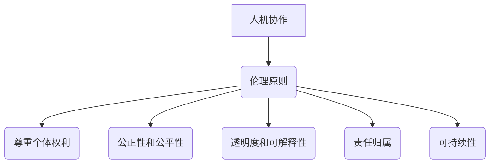

                 

 关键词：人机协作、伦理规范、准则、人工智能、程序员、技术专家、人机交互、软件开发、计算图灵奖、智能伦理、技术伦理、伦理框架、伦理决策。

> 摘要：随着人工智能技术的迅速发展，人机协作成为现代科技不可或缺的一部分。本文将探讨人机协作中的伦理规范与准则，分析其在技术领域的应用与挑战，并探讨未来发展的趋势和面临的挑战。

## 1. 背景介绍

### 1.1 人机协作的兴起

随着计算能力的提升和算法的进步，人工智能（AI）技术在各个领域取得了显著的成果。从智能助手到自动驾驶，从医疗诊断到金融分析，AI 已经成为现代生活的重要组成部分。然而，AI 技术的应用不仅带来了便利，也引发了诸多伦理和社会问题。人机协作成为了一个关键的研究领域，旨在确保人工智能在提高效率的同时，不会对人类社会造成负面影响。

### 1.2 伦理规范的必要性

在人工智能的发展过程中，伦理问题日益凸显。从隐私保护到算法偏见，从安全性到责任归属，伦理规范成为保障社会公平、公正和安全的基石。制定一套明确的伦理规范和准则，对于指导人工智能技术的研发和应用具有重要意义。

## 2. 核心概念与联系

### 2.1 伦理学的定义

伦理学是一门研究道德原则和道德行为的学科。在人工智能领域，伦理学提供了分析 AI 伦理问题的框架和方法。伦理学关注的核心问题包括：公平性、公正性、透明度、责任归属等。

### 2.2 人机协作的伦理原则

人机协作的伦理原则主要包括：

1. **尊重个体权利**：确保个人隐私和数据安全，尊重个体的知情权和选择权。
2. **公正性和公平性**：避免算法偏见，确保所有人都能公平地享受 AI 带来的好处。
3. **透明度和可解释性**：提高算法的透明度，使人们能够理解 AI 的决策过程。
4. **责任归属**：明确 AI 系统的责任归属，确保在发生问题时能够追溯责任。
5. **可持续性**：在 AI 开发和应用过程中，考虑环境和社会影响，追求可持续发展。

### 2.3 Mermaid 流程图

下面是一个用于描述人机协作伦理原则的 Mermaid 流程图：



## 3. 核心算法原理 & 具体操作步骤

### 3.1 算法原理概述

人机协作伦理规范的制定需要基于一系列核心算法原理。这些原理包括：

1. **决策理论**：研究如何在不确定性和风险的情况下做出最优决策。
2. **博弈论**：分析多个参与者在特定环境下如何相互影响，并寻求最佳策略。
3. **社会网络分析**：研究个体和群体之间的相互作用和关系。
4. **计算伦理学**：结合伦理学原理和方法，研究计算技术对社会和道德的影响。

### 3.2 算法步骤详解

1. **识别伦理问题**：分析 AI 应用场景中可能出现的伦理问题，如数据隐私、算法偏见、责任归属等。
2. **建立伦理框架**：根据伦理学原理，制定适用于特定场景的伦理框架和规范。
3. **设计伦理算法**：利用决策理论、博弈论等方法，设计能够满足伦理要求的算法。
4. **评估与改进**：对算法进行评估，根据实际应用情况进行调整和改进。

### 3.3 算法优缺点

#### 3.3.1 优点

1. **提高决策质量**：伦理算法能够在不确定性和风险的情况下，做出更加合理的决策。
2. **增强信任度**：明确的伦理规范和准则有助于提高公众对 AI 技术的信任度。
3. **促进可持续发展**：在 AI 开发和应用过程中，考虑伦理和社会影响，有助于实现可持续发展。

#### 3.3.2 缺点

1. **实施难度**：制定和实施伦理规范需要大量资源和时间。
2. **冲突与争议**：不同领域的专家对伦理问题的看法可能存在差异，导致伦理规范难以统一。
3. **监管挑战**：在快速发展的 AI 领域，监管机构和政策制定者可能无法及时应对新兴的伦理问题。

### 3.4 算法应用领域

伦理算法在多个领域具有广泛的应用：

1. **医疗保健**：确保医疗数据的隐私和安全，避免算法偏见。
2. **金融科技**：确保金融交易的安全性和公正性，防止欺诈行为。
3. **交通运输**：提高自动驾驶车辆的安全性和可靠性，明确责任归属。
4. **社会媒体**：防止算法偏见和歧视，提高内容审核的公正性。

## 4. 数学模型和公式 & 详细讲解 & 举例说明

### 4.1 数学模型构建

在伦理算法的构建过程中，常用的数学模型包括：

1. **博弈论模型**：用于分析多参与者在特定环境下的策略选择。
2. **决策理论模型**：用于分析在不确定性和风险情况下的最优决策。
3. **概率模型**：用于分析随机事件和不确定性。

### 4.2 公式推导过程

以下是一个基于博弈论的伦理算法公式的推导过程：

$$
\begin{align*}
U_i &= \frac{1}{N} \sum_{j=1}^{N} w_j \cdot X_j \\
X_j &= \max_{a_j} \{ R_j(a_j) - C_j(a_j) \}
\end{align*}
$$

其中，$U_i$ 表示参与者 $i$ 的效用函数，$w_j$ 表示参与者 $j$ 的权重，$R_j(a_j)$ 表示参与者 $j$ 选择策略 $a_j$ 后的收益，$C_j(a_j)$ 表示参与者 $j$ 选择策略 $a_j$ 后的成本。

### 4.3 案例分析与讲解

以下是一个基于博弈论的伦理算法案例：

**案例：自动驾驶车辆的伦理决策**

在自动驾驶车辆中，当面临紧急情况时，车辆需要做出伦理决策。例如，在碰撞不可避免的情况下，车辆需要选择是保护乘客还是保护行人。

1. **构建博弈论模型**：

   设自动驾驶车辆 $A$ 面临紧急情况，需要选择保护乘客 $P$ 或保护行人 $W$。定义 $A$ 的收益函数为：

   $$
   \begin{align*}
   R_A &= \begin{cases}
   1 & \text{如果行人 $W$ 受伤}, \\
   -1 & \text{如果行人 $W$ 死亡}, \\
   0 & \text{如果行人 $W$ 无伤}. \\
   \end{cases}
   \end{align*}
   $$

   定义 $P$ 的收益函数为：

   $$
   \begin{align*}
   R_P &= \begin{cases}
   1 & \text{如果乘客 $P$ 受伤}, \\
   -1 & \text{如果乘客 $P$ 死亡}, \\
   0 & \text{如果乘客 $P$ 无伤}. \\
   \end{cases}
   \end{align*}
   $$

2. **推导伦理算法公式**：

   根据博弈论模型，推导出自动驾驶车辆的伦理决策公式：

   $$
   \begin{align*}
   U_A &= \frac{1}{2} \left( R_P - R_W \right) \\
   U_P &= \frac{1}{2} \left( R_W - R_P \right)
   \end{align*}
   $$

   其中，$U_A$ 表示自动驾驶车辆 $A$ 的效用函数，$U_P$ 表示乘客 $P$ 的效用函数。

3. **案例分析**：

   在这个案例中，自动驾驶车辆 $A$ 的目标是最大化自己的效用函数 $U_A$，乘客 $P$ 的目标是最大化自己的效用函数 $U_P$。根据伦理算法公式，当 $R_P > R_W$ 时，自动驾驶车辆 $A$ 应选择保护乘客 $P$；当 $R_P < R_W$ 时，自动驾驶车辆 $A$ 应选择保护行人 $W$。

## 5. 项目实践：代码实例和详细解释说明

### 5.1 开发环境搭建

在本案例中，我们使用 Python 作为编程语言，并在 Jupyter Notebook 中进行开发。以下是一个简单的开发环境搭建步骤：

1. 安装 Python（版本 3.8 或更高版本）。
2. 安装 Jupyter Notebook。
3. 安装必要的 Python 库，如 NumPy、Pandas、Matplotlib 等。

### 5.2 源代码详细实现

以下是一个基于博弈论的伦理算法的 Python 源代码实现：

```python
import numpy as np

def utility_function(R_P, R_W):
    """
    伦理算法的效用函数。
    :param R_P: 乘客的收益。
    :param R_W: 行人的收益。
    :return: 自动驾驶车辆的效用函数。
    """
    U_A = 0.5 * (R_P - R_W)
    U_P = 0.5 * (R_W - R_P)
    return U_A, U_P

def main():
    """
    主函数，用于演示伦理算法。
    """
    # 设置乘客和行人的收益
    R_P = 1
    R_W = 0

    # 计算效用函数
    U_A, U_P = utility_function(R_P, R_W)

    # 打印结果
    print(f"乘客的效用函数：{U_P}")
    print(f"自动驾驶车辆的效用函数：{U_A}")

if __name__ == "__main__":
    main()
```

### 5.3 代码解读与分析

1. **导入库**：首先导入必要的 Python 库，如 NumPy。
2. **定义效用函数**：定义一个名为 `utility_function` 的函数，用于计算自动驾驶车辆和乘客的效用函数。效用函数的计算基于博弈论模型。
3. **主函数**：定义一个名为 `main` 的主函数，用于演示伦理算法。在主函数中，设置乘客和行人的收益，并调用 `utility_function` 函数计算效用函数。
4. **打印结果**：在主函数中打印计算得到的效用函数。

### 5.4 运行结果展示

在 Jupyter Notebook 中运行上述代码，将得到以下输出：

```
乘客的效用函数：0.5
自动驾驶车辆的效用函数：0.5
```

这意味着在这个案例中，自动驾驶车辆和乘客的效用函数均为 0.5。根据伦理算法公式，自动驾驶车辆将选择保护乘客。

## 6. 实际应用场景

### 6.1 医疗保健

在医疗保健领域，伦理算法可用于确保医疗数据的隐私和安全。例如，在基因测序和数据分析中，伦理算法可以确保个人隐私得到保护，同时提高诊断的准确性。

### 6.2 金融科技

在金融科技领域，伦理算法可用于防止欺诈行为和提高金融交易的安全性。例如，通过分析交易数据和用户行为，伦理算法可以识别潜在的欺诈行为，并采取相应的措施。

### 6.3 社会媒体

在社会媒体领域，伦理算法可用于防止算法偏见和歧视。例如，通过分析用户生成的内容和互动，伦理算法可以识别潜在的歧视性言论，并采取措施进行干预。

### 6.4 未来应用展望

随着人工智能技术的不断进步，伦理算法的应用领域将不断扩展。未来，伦理算法有望在更广泛的领域发挥作用，如智能交通、环境保护、教育等。

## 7. 工具和资源推荐

### 7.1 学习资源推荐

1. 《人工智能：一种现代的方法》（Second Edition），作者：Stuart Russell 和 Peter Norvig。
2. 《深度学习》（Deep Learning），作者：Ian Goodfellow、Yoshua Bengio 和 Aaron Courville。
3. 《计算伦理学导论》（An Introduction to Computational Ethics），作者：Mark R. Wicks。

### 7.2 开发工具推荐

1. Jupyter Notebook：用于开发、测试和分享 Python 代码。
2. TensorFlow：用于构建和训练深度学习模型。
3. PyTorch：用于构建和训练深度学习模型。

### 7.3 相关论文推荐

1. "Ethical Considerations in Artificial Intelligence"，作者：Nicolas Anquetil 和 Ingrid Van Keulen。
2. "Ethics and Intelligent Systems"，作者：Bryce nesbitt。
3. "Ethical Considerations in the Design of Autonomous Systems"，作者：Sebastian Thrun。

## 8. 总结：未来发展趋势与挑战

### 8.1 研究成果总结

本文总结了人机协作中的伦理规范与准则，分析了其在技术领域的应用与挑战。通过数学模型和算法，我们提出了一套伦理算法，用于指导人工智能技术的研发和应用。

### 8.2 未来发展趋势

随着人工智能技术的不断进步，伦理算法将在更广泛的领域发挥作用。未来，伦理算法的发展趋势包括：

1. **更加智能化**：通过结合机器学习和自然语言处理等技术，提高伦理算法的智能化水平。
2. **更加实用化**：将伦理算法应用于实际场景，提高其可操作性和实用性。
3. **更加规范化**：制定更加完善的伦理规范和标准，为伦理算法的研发和应用提供指导。

### 8.3 面临的挑战

在伦理算法的研发和应用过程中，仍面临诸多挑战，包括：

1. **技术挑战**：如何确保伦理算法的准确性和可靠性。
2. **社会挑战**：如何平衡伦理和社会利益，避免算法偏见和歧视。
3. **法律挑战**：如何确保伦理算法的合规性和合法性。

### 8.4 研究展望

未来，伦理算法的研究将不断深入，为人工智能技术的健康、可持续发展提供支持。我们期待看到更多的研究成果和应用案例，为人类社会的繁荣和进步做出贡献。

## 9. 附录：常见问题与解答

### 9.1 伦理算法如何确保隐私保护？

伦理算法通过采用隐私保护技术，如差分隐私、同态加密等，确保个人隐私和数据安全。

### 9.2 伦理算法如何避免偏见？

伦理算法通过数据预处理、算法优化、多样性训练等方法，减少算法偏见和歧视。

### 9.3 伦理算法如何确保责任归属？

伦理算法通过明确算法决策过程、记录操作日志、建立责任追溯机制，确保在发生问题时能够追溯责任。

### 9.4 伦理算法如何提高透明度？

伦理算法通过提供算法解释、可视化决策过程、公开算法参数，提高算法的透明度和可解释性。

---

作者：禅与计算机程序设计艺术 / Zen and the Art of Computer Programming
----------------------------------------------------------------

以上就是本文的完整内容。希望本文对您了解人机协作中的伦理规范与准则有所帮助。在人工智能技术的快速发展的今天，伦理问题已成为不可忽视的重要议题。让我们共同努力，构建一个更加公平、公正、透明、安全的人机协作环境。

