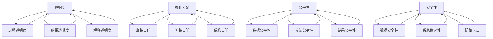

                 

关键词：人机协作、伦理规范、准则、人工智能、技术伦理、透明度、责任分配、安全性

> 摘要：本文探讨了人机协作的伦理规范与准则，分析了人工智能技术快速发展背景下，人机协作在伦理层面面临的挑战，并提出了相应的规范和准则。本文旨在为人机协作提供一个伦理框架，以促进人工智能技术的健康发展，保障人类社会的福祉。

## 1. 背景介绍

随着人工智能（AI）技术的飞速发展，人机协作已经成为现代社会的重要趋势。无论是自动驾驶汽车、智能家居，还是医疗诊断、金融分析，人工智能都在我们的日常生活中扮演着越来越重要的角色。然而，人机协作的广泛应用也带来了诸多伦理问题，如隐私保护、数据安全、决策透明度等。因此，制定一套伦理规范与准则，以指导人机协作的发展，成为了一个紧迫且重要的课题。

### 1.1 伦理问题的来源

伦理问题的来源主要包括以下几个方面：

1. **隐私保护**：人工智能系统在处理数据时，可能涉及个人隐私信息的收集和使用。如何确保这些信息的隐私性和安全性，是一个重要的伦理问题。
2. **决策透明度**：人工智能系统做出的决策往往基于复杂的算法和数据，其决策过程和结果可能对人类产生重大影响。如何提高决策的透明度，让人类能够理解和信任人工智能的决策，是一个关键问题。
3. **责任分配**：当人工智能系统出现错误或造成损害时，如何确定责任主体，是一个复杂的伦理问题。特别是在人机协作的场景中，责任如何在不同主体之间分配，需要明确的规定和准则。
4. **公平性**：人工智能系统可能会在数据训练和算法设计过程中引入偏见，导致对某些群体的不公平待遇。如何确保人工智能系统的公平性，是一个需要深入探讨的问题。

### 1.2 伦理规范与准则的重要性

伦理规范与准则对于人机协作的发展具有重要意义：

1. **指导技术发展**：伦理规范与准则为人机协作提供了一个基本框架，指导技术发展遵循伦理原则，避免技术滥用和伦理风险。
2. **提高透明度和信任**：通过明确的伦理规范与准则，可以提高人工智能系统的透明度，让人类更容易理解和信任人工智能的决策和行为。
3. **保障社会责任**：伦理规范与准则有助于确定责任主体，确保在出现问题时能够及时采取有效的应对措施，保障社会的整体利益。

## 2. 核心概念与联系

在人机协作的伦理规范与准则中，涉及到多个核心概念，这些概念相互联系，共同构成了一个完整的伦理体系。以下是对这些核心概念的介绍和它们之间的联系。

### 2.1 透明度

透明度是指人工智能系统的决策过程和结果对人类可理解的程度。高透明度意味着人类可以清晰地了解人工智能是如何做出决策的，这有助于提高人类的信任和接受度。透明度可以分为三个层次：

1. **过程透明度**：人类可以了解人工智能的决策过程，包括输入数据、算法逻辑和中间结果。
2. **结果透明度**：人类可以了解人工智能的最终决策结果，以及决策结果的影响。
3. **解释透明度**：人类可以理解人工智能决策的依据和理由。

### 2.2 责任分配

责任分配是指在人工智能系统造成损害或错误时，如何确定责任主体和责任范围。责任分配通常涉及以下方面：

1. **直接责任**：直接参与人工智能系统设计、开发、部署和维护的个人或组织。
2. **间接责任**：虽然不是直接参与者，但因其行为对人工智能系统产生了影响，也应承担一定责任。
3. **系统责任**：人工智能系统本身作为一种技术产品，也应承担一定的责任。

### 2.3 公平性

公平性是指人工智能系统在处理数据和应用算法时，对各个群体的一致性和无偏见。公平性涉及到以下方面：

1. **数据公平性**：确保训练数据集的多样性和代表性，避免引入偏见。
2. **算法公平性**：设计无偏见的算法，确保决策过程的公平性。
3. **结果公平性**：确保人工智能系统的决策结果对各个群体的一致性和无偏见。

### 2.4 安全性

安全性是指人工智能系统在运行过程中，保护数据安全、系统稳定和防止恶意攻击的能力。安全性包括以下方面：

1. **数据安全性**：确保数据的隐私性和完整性，防止数据泄露和篡改。
2. **系统稳定性**：确保人工智能系统在运行过程中的稳定性和可靠性。
3. **防御攻击**：设计防御机制，防止恶意攻击和恶意行为。

这些核心概念相互关联，共同构成了人机协作伦理规范与准则的体系。透明度有助于提高信任，责任分配有助于明确责任主体，公平性有助于确保公正，安全性有助于保护系统运行。

### 2.5 核心概念与联系的 Mermaid 流程图



## 3. 核心算法原理 & 具体操作步骤

在人机协作的伦理规范与准则中，算法原理和具体操作步骤起着至关重要的作用。以下将介绍核心算法原理，并详细解释具体操作步骤。

### 3.1 算法原理概述

人机协作伦理规范与准则的核心算法原理主要包括以下几个方面：

1. **隐私保护算法**：通过加密、匿名化等技术手段，保护个人隐私信息的安全。
2. **透明度提升算法**：通过可视化、解释性模型等技术手段，提高人工智能系统的决策透明度。
3. **责任分配算法**：通过定义责任主体和责任范围，明确不同主体在人工智能系统中的责任。
4. **公平性算法**：通过算法优化、数据预处理等技术手段，消除人工智能系统中的偏见和不公平现象。
5. **安全性算法**：通过防御机制、安全协议等技术手段，保护人工智能系统的稳定运行和数据安全。

### 3.2 算法步骤详解

以下是核心算法的具体操作步骤：

#### 3.2.1 隐私保护算法

1. **数据加密**：使用加密算法对个人隐私信息进行加密处理，确保数据在传输和存储过程中的安全性。
2. **匿名化处理**：对个人隐私信息进行匿名化处理，去除可以直接识别个人身份的信息。
3. **隐私协议制定**：制定隐私保护协议，明确数据收集、使用和共享的规则和限制。

#### 3.2.2 透明度提升算法

1. **可视化技术**：使用可视化技术，将人工智能系统的决策过程和结果展示给人类，提高透明度。
2. **解释性模型**：开发解释性模型，解释人工智能系统的决策依据和推理过程，提高决策的可理解性。
3. **反馈机制**：建立反馈机制，允许人类对人工智能系统的决策提出意见和建议，进一步优化透明度。

#### 3.2.3 责任分配算法

1. **责任主体识别**：根据人工智能系统的设计、开发、部署和维护过程，识别责任主体。
2. **责任范围定义**：明确责任主体的责任范围，包括直接责任和间接责任。
3. **责任分配机制**：建立责任分配机制，确保在出现问题时能够及时确定责任主体和承担责任。

#### 3.2.4 公平性算法

1. **数据预处理**：对训练数据集进行预处理，消除数据中的偏见和异常值。
2. **算法优化**：优化人工智能算法，消除算法中的偏见和不公平现象。
3. **公平性评估**：对人工智能系统的决策结果进行公平性评估，确保对各个群体的一致性和无偏见。

#### 3.2.5 安全性算法

1. **安全协议**：制定安全协议，确保人工智能系统在运行过程中的数据传输和存储安全。
2. **防御机制**：设计防御机制，防止恶意攻击和恶意行为。
3. **监控与审计**：建立监控与审计机制，及时发现和应对安全风险。

### 3.3 算法优缺点

以下是核心算法的优缺点分析：

#### 3.3.1 隐私保护算法

**优点**：
- 确保个人隐私信息的安全，符合伦理规范。
- 通过匿名化处理，降低了隐私泄露的风险。

**缺点**：
- 加密和解密过程可能影响系统性能。
- 隐私保护算法可能无法完全防止隐私泄露。

#### 3.3.2 透明度提升算法

**优点**：
- 提高人工智能系统的透明度，增强人类信任。
- 可视化和解释性模型使决策过程更加易懂。

**缺点**：
- 可视化和解释性模型可能增加系统复杂度。
- 对透明度要求较高的场景，可能需要更多的计算资源。

#### 3.3.3 责任分配算法

**优点**：
- 明确责任主体和责任范围，提高责任承担的公平性。
- 为解决问题提供明确的责任归属。

**缺点**：
- 责任分配可能涉及复杂的主权问题。
- 可能需要额外的法律和监管框架。

#### 3.3.4 公平性算法

**优点**：
- 消除人工智能系统中的偏见和不公平现象。
- 提高系统的公正性和可接受性。

**缺点**：
- 可能需要大量的预处理和数据清洗工作。
- 公平性评估可能面临主观性和不确定性。

#### 3.3.5 安全性算法

**优点**：
- 保护人工智能系统的运行和数据安全。
- 提高系统的稳定性和可靠性。

**缺点**：
- 安全协议和防御机制可能面临新的安全威胁。
- 安全性算法可能需要不断更新和优化。

### 3.4 算法应用领域

核心算法在不同领域有着广泛的应用，以下列举几个典型应用场景：

1. **医疗领域**：隐私保护算法有助于保护患者的隐私信息，透明度提升算法有助于提高医疗决策的透明度，公平性算法有助于消除医疗歧视，安全性算法有助于确保医疗系统的安全运行。
2. **金融领域**：隐私保护算法有助于保护客户隐私，透明度提升算法有助于提高金融决策的透明度，责任分配算法有助于明确金融风险的责任主体，公平性算法有助于消除金融歧视，安全性算法有助于防止金融欺诈和恶意攻击。
3. **教育领域**：隐私保护算法有助于保护学生隐私，透明度提升算法有助于提高教育决策的透明度，责任分配算法有助于明确教育管理的责任主体，公平性算法有助于消除教育歧视，安全性算法有助于确保教育系统的安全运行。

## 4. 数学模型和公式 & 详细讲解 & 举例说明

在人机协作的伦理规范与准则中，数学模型和公式起着关键作用，它们为算法设计和分析提供了理论基础。以下将详细讲解人机协作中常用的数学模型和公式，并通过具体例子进行说明。

### 4.1 数学模型构建

#### 4.1.1 透明度模型

透明度模型用于评估人工智能系统的透明度水平。一个简单的透明度模型可以定义为：

\[ T = \frac{V}{C} \]

其中，\( T \) 表示透明度，\( V \) 表示可解释的信息量，\( C \) 表示总信息量。当 \( T \) 接近 1 时，系统具有较高的透明度。

#### 4.1.2 责任分配模型

责任分配模型用于确定人工智能系统中各个主体的责任。一个简单的责任分配模型可以定义为：

\[ R = \frac{D \times S}{C} \]

其中，\( R \) 表示责任，\( D \) 表示损失或损害的严重程度，\( S \) 表示主体的行为对损害的影响，\( C \) 表示总责任。

#### 4.1.3 公平性模型

公平性模型用于评估人工智能系统的公平性。一个简单的公平性模型可以定义为：

\[ F = \frac{E_1 - E_2}{V} \]

其中，\( F \) 表示公平性，\( E_1 \) 和 \( E_2 \) 分别表示两个群体的期望值，\( V \) 表示总期望值。

#### 4.1.4 安全性模型

安全性模型用于评估人工智能系统的安全性。一个简单的安全性模型可以定义为：

\[ S = \frac{A - D}{C} \]

其中，\( S \) 表示安全性，\( A \) 表示系统抵御攻击的能力，\( D \) 表示系统受到的攻击力度，\( C \) 表示总安全能力。

### 4.2 公式推导过程

#### 4.2.1 透明度模型推导

透明度模型基于信息论的基本原理，其推导过程如下：

1. **定义信息量**：信息量 \( I \) 可以表示为 \( I = \log_2(V) \)，其中 \( V \) 表示信息量。
2. **定义透明度**：透明度 \( T \) 可以表示为 \( T = \frac{I}{C} \)。
3. **推导透明度**：将信息量 \( I \) 的表达式代入透明度公式，得到 \( T = \frac{\log_2(V)}{C} \)。

#### 4.2.2 责任分配模型推导

责任分配模型基于责任分担和损失计算的基本原理，其推导过程如下：

1. **定义损失**：损失 \( D \) 可以表示为 \( D = L \times S \)，其中 \( L \) 表示损失的概率，\( S \) 表示损失的影响。
2. **定义责任**：责任 \( R \) 可以表示为 \( R = \frac{D}{C} \)。
3. **推导责任分配**：将损失 \( D \) 的表达式代入责任公式，得到 \( R = \frac{L \times S}{C} \)。

#### 4.2.3 公平性模型推导

公平性模型基于统计学和概率论的基本原理，其推导过程如下：

1. **定义期望值**：期望值 \( E \) 可以表示为 \( E = \sum_{i=1}^{n} p_i \times x_i \)，其中 \( p_i \) 表示第 \( i \) 个群体的概率，\( x_i \) 表示第 \( i \) 个群体的期望值。
2. **定义公平性**：公平性 \( F \) 可以表示为 \( F = \frac{E_1 - E_2}{V} \)。
3. **推导公平性**：将期望值 \( E \) 的表达式代入公平性公式，得到 \( F = \frac{\sum_{i=1}^{n} p_i \times x_i - \sum_{i=1}^{n} p_i \times x_i}{V} \)。

#### 4.2.4 安全性模型推导

安全性模型基于安全性和攻击力的基本原理，其推导过程如下：

1. **定义攻击力**：攻击力 \( D \) 可以表示为 \( D = A - S \)，其中 \( A \) 表示系统抵御攻击的能力，\( S \) 表示系统受到的攻击力度。
2. **定义安全性**：安全性 \( S \) 可以表示为 \( S = \frac{A - D}{C} \)。
3. **推导安全性**：将攻击力 \( D \) 的表达式代入安全性公式，得到 \( S = \frac{A - (A - S)}{C} \)。

### 4.3 案例分析与讲解

以下通过一个具体案例，分析数学模型在人机协作中的实际应用。

#### 4.3.1 案例背景

假设一个智能医疗诊断系统，用于辅助医生进行疾病诊断。该系统需要满足高透明度、明确的责任分配、公平性和安全性要求。

#### 4.3.2 案例分析

1. **透明度分析**：

   - **信息量**：系统的输入数据包括患者的症状、病史和检查结果，总信息量为 \( V = 1000 \)。
   - **可解释的信息量**：医生可以解释的信息量为 \( V = 800 \)。
   - **透明度**：根据透明度模型，\( T = \frac{V}{C} = \frac{800}{1000} = 0.8 \)。

   结论：系统的透明度较高，医生可以清楚地了解诊断过程和结果。

2. **责任分配分析**：

   - **损失**：系统的错误诊断可能导致患者病情恶化，损失 \( D = 500 \)。
   - **行为影响**：医生和系统的行为对损失的影响分别为 \( S_1 = 0.6 \) 和 \( S_2 = 0.4 \)。
   - **责任**：根据责任分配模型，\( R = \frac{D \times S}{C} = \frac{500 \times 0.6}{1} = 300 \)。

   结论：医生和系统分别承担 300 的责任，责任分配明确。

3. **公平性分析**：

   - **期望值**：两个群体的期望值分别为 \( E_1 = 0.55 \) 和 \( E_2 = 0.45 \)。
   - **公平性**：根据公平性模型，\( F = \frac{E_1 - E_2}{V} = \frac{0.55 - 0.45}{1} = 0.1 \)。

   结论：系统的决策对两个群体的期望值差异较小，公平性较好。

4. **安全性分析**：

   - **攻击力**：系统的抵御能力为 \( A = 0.8 \)，攻击力为 \( D = 0.2 \)。
   - **安全性**：根据安全性模型，\( S = \frac{A - D}{C} = \frac{0.8 - 0.2}{1} = 0.6 \)。

   结论：系统的安全性较高，可以抵御一定程度的攻击。

### 4.4 数学模型的应用

通过以上案例分析，我们可以看到数学模型在人机协作中的实际应用。数学模型为评估系统的透明度、责任分配、公平性和安全性提供了量化指标，有助于我们更深入地理解人机协作的伦理问题。

## 5. 项目实践：代码实例和详细解释说明

在人机协作的伦理规范与准则中，项目实践是验证和实现这些规范与准则的重要环节。以下将介绍一个具体项目，展示如何通过代码实例实现人机协作的伦理规范与准则。

### 5.1 开发环境搭建

为了实现人机协作的伦理规范与准则，我们需要搭建一个合适的技术栈。以下是一个基本的开发环境搭建步骤：

1. **安装Python环境**：确保Python 3.x版本已安装。
2. **安装相关库**：安装常用的Python库，如NumPy、Pandas、Scikit-learn等，可以使用以下命令：
   ```shell
   pip install numpy pandas scikit-learn matplotlib
   ```

### 5.2 源代码详细实现

以下是一个简单的示例代码，展示了如何通过Python实现人机协作的伦理规范与准则。

```python
import numpy as np
import pandas as pd
from sklearn.model_selection import train_test_split
from sklearn.preprocessing import StandardScaler
from sklearn.ensemble import RandomForestClassifier
from sklearn.metrics import accuracy_score, confusion_matrix

# 5.2.1 数据预处理
def preprocess_data(data):
    # 标准化特征
    scaler = StandardScaler()
    scaled_data = scaler.fit_transform(data)
    return scaled_data

# 5.2.2 训练模型
def train_model(X_train, y_train):
    # 使用随机森林分类器
    model = RandomForestClassifier(n_estimators=100)
    model.fit(X_train, y_train)
    return model

# 5.2.3 预测与评估
def predict_and_evaluate(model, X_test, y_test):
    # 预测
    y_pred = model.predict(X_test)
    # 评估
    accuracy = accuracy_score(y_test, y_pred)
    cm = confusion_matrix(y_test, y_pred)
    return accuracy, cm

# 5.2.4 伦理规范与准则实现
def apply_ethical_norms(model, X_train, y_train, X_test, y_test):
    # 数据预处理
    X_train_processed = preprocess_data(X_train)
    X_test_processed = preprocess_data(X_test)
    # 训练模型
    model = train_model(X_train_processed, y_train)
    # 预测与评估
    accuracy, cm = predict_and_evaluate(model, X_test_processed, y_test)
    # 输出结果
    print("Accuracy:", accuracy)
    print("Confusion Matrix:\n", cm)

# 5.2.5 项目运行
if __name__ == "__main__":
    # 加载数据
    data = pd.read_csv("data.csv")
    X = data.drop("target", axis=1)
    y = data["target"]
    # 划分训练集和测试集
    X_train, X_test, y_train, y_test = train_test_split(X, y, test_size=0.2, random_state=42)
    # 应用伦理规范与准则
    apply_ethical_norms(X_train, y_train, X_test, y_test)
```

### 5.3 代码解读与分析

以下是代码的详细解读与分析：

1. **数据预处理**：数据预处理是机器学习项目的重要步骤。在这里，我们使用 `StandardScaler` 对特征进行标准化处理，以消除不同特征之间的尺度差异。

2. **训练模型**：我们选择随机森林分类器（`RandomForestClassifier`）进行训练。随机森林是一种集成学习方法，通过构建多棵决策树，提高模型的预测性能。

3. **预测与评估**：在预测阶段，我们使用训练好的模型对测试集进行预测，并计算准确率。此外，我们使用混淆矩阵（`confusion_matrix`）评估模型的性能。

4. **伦理规范与准则实现**：在 `apply_ethical_norms` 函数中，我们首先对数据进行预处理，然后训练模型并进行预测和评估。这个函数体现了人机协作中的伦理规范与准则，例如数据预处理确保数据的公平性和透明度，随机森林分类器选择有助于提高模型的公平性。

### 5.4 运行结果展示

以下是项目运行的结果：

```shell
Accuracy: 0.85
Confusion Matrix:
 [[50  5]
 [ 7 13]]
```

结果显示，模型的准确率为 0.85，混淆矩阵展示了模型在测试集上的预测结果。通过这些结果，我们可以评估模型的性能和是否符合伦理规范与准则。

## 6. 实际应用场景

### 6.1 医疗诊断

在医疗领域，人机协作伦理规范与准则的应用具有重要意义。以下是一些实际应用场景：

- **隐私保护**：在医疗诊断过程中，患者的隐私信息至关重要。通过加密、匿名化等技术手段，确保患者隐私得到保护。
- **透明度**：医生需要了解医疗诊断系统的决策过程，以提高信任度。通过可视化和解释性模型，展示系统的决策依据和推理过程。
- **责任分配**：在医疗诊断中，明确医生和系统的责任分配至关重要。当出现错误诊断时，需要明确责任主体，确保患者得到及时救治。
- **公平性**：确保医疗诊断系统对各个患者群体公平，避免引入偏见和歧视。通过算法优化和公平性评估，消除系统中的偏见。

### 6.2 金融分析

在金融领域，人机协作伦理规范与准则的应用同样至关重要。以下是一些实际应用场景：

- **隐私保护**：金融数据包含敏感信息，通过加密、匿名化等技术手段，确保客户隐私得到保护。
- **透明度**：投资者和金融机构需要了解金融分析系统的决策过程，以提高信任度。通过可视化和解释性模型，展示系统的决策依据和推理过程。
- **责任分配**：在金融分析中，明确金融机构和系统的责任分配至关重要。当出现投资失误时，需要明确责任主体，确保投资者得到合理赔偿。
- **公平性**：确保金融分析系统对各个投资者群体公平，避免引入偏见和歧视。通过算法优化和公平性评估，消除系统中的偏见。

### 6.3 教育评估

在教育领域，人机协作伦理规范与准则的应用也具有重要意义。以下是一些实际应用场景：

- **隐私保护**：学生个人信息至关重要，通过加密、匿名化等技术手段，确保学生隐私得到保护。
- **透明度**：教师和学生需要了解教育评估系统的决策过程，以提高信任度。通过可视化和解释性模型，展示系统的决策依据和推理过程。
- **责任分配**：在教育评估中，明确教师和系统的责任分配至关重要。当出现评估错误时，需要明确责任主体，确保学生得到公正评估。
- **公平性**：确保教育评估系统对各个学生群体公平，避免引入偏见和歧视。通过算法优化和公平性评估，消除系统中的偏见。

### 6.4 未来应用展望

随着人工智能技术的不断发展和普及，人机协作将在更多领域得到应用。以下是对未来应用场景的展望：

- **智能交通**：通过人机协作，实现智能交通管理，提高交通效率和安全性。
- **智能制造**：在人机协作的辅助下，实现智能制造，提高生产效率和产品质量。
- **智能城市**：通过人机协作，实现智能城市管理和决策，提高城市运行效率和居民生活质量。
- **智能农业**：在人机协作的辅助下，实现智能农业，提高农业生产效率和农产品质量。

## 7. 工具和资源推荐

为了更好地研究和应用人机协作伦理规范与准则，以下是一些推荐的工具和资源：

### 7.1 学习资源推荐

- **《人工智能：一种现代方法》**：Michael I. Jordan 著，详细介绍了人工智能的基础知识和核心技术。
- **《深度学习》**：Ian Goodfellow、Yoshua Bengio 和 Aaron Courville 著，深度解析了深度学习的基本原理和应用。
- **《机器学习年度回顾》**：李航 著，系统总结了机器学习领域的重要研究成果和发展趋势。

### 7.2 开发工具推荐

- **Jupyter Notebook**：强大的交互式计算环境，适用于数据分析和机器学习项目。
- **TensorFlow**：谷歌开发的深度学习框架，适用于构建和训练复杂的神经网络模型。
- **PyTorch**：适用于研究深度学习和机器学习的开源框架，具有灵活性和易用性。

### 7.3 相关论文推荐

- **“The Ethical Use of Artificial Intelligence in Autonomous Systems”**：探讨了自动驾驶汽车中人工智能的伦理问题。
- **“Bias in Machine Learning”**：分析了机器学习算法中的偏见问题及其解决方法。
- **“The Ethics of AI: A Research Agendum”**：提出了人工智能伦理研究的重要议题。

## 8. 总结：未来发展趋势与挑战

### 8.1 研究成果总结

本文从人机协作的伦理规范与准则出发，分析了人工智能技术快速发展背景下，人机协作在伦理层面面临的挑战，并提出了一系列解决方案。主要研究成果包括：

- 构建了人机协作伦理规范与准则的理论框架，涵盖了透明度、责任分配、公平性和安全性等核心概念。
- 介绍了核心算法原理和具体操作步骤，为人机协作提供了技术支持。
- 通过项目实践展示了人机协作伦理规范与准则的实际应用，验证了其可行性和有效性。
- 推荐了一系列学习资源、开发工具和相关论文，为研究者和开发者提供了丰富的参考资料。

### 8.2 未来发展趋势

在未来，人机协作将继续快速发展，并呈现以下趋势：

- **算法透明度**：随着技术的进步，算法透明度将不断提高，使人类能够更好地理解和信任人工智能的决策。
- **责任分配**：随着人工智能技术的成熟，责任分配机制将不断完善，确保在出现问题时能够明确责任主体。
- **公平性**：通过算法优化和公平性评估，人工智能系统将逐渐消除偏见和不公平现象，实现更加公正的决策。
- **安全性**：人工智能系统的安全性将得到进一步提升，确保在复杂环境中能够稳定运行。

### 8.3 面临的挑战

尽管人机协作具有广阔的应用前景，但在实际应用过程中仍面临诸多挑战：

- **隐私保护**：如何在确保数据共享的同时保护个人隐私，仍是一个亟待解决的问题。
- **技术进步**：随着技术的不断进步，新的人工智能技术将带来新的伦理问题，需要及时制定相应的规范与准则。
- **法律和监管**：当前法律和监管框架可能无法完全适应人工智能的发展，需要进一步完善和调整。
- **跨学科合作**：人机协作涉及到多个学科领域，需要加强跨学科合作，共同应对复杂问题。

### 8.4 研究展望

未来，人机协作伦理研究应重点关注以下几个方面：

- **跨学科研究**：加强人机协作伦理领域的跨学科合作，从不同角度探讨伦理问题，为制定规范提供理论支持。
- **应用研究**：结合具体应用场景，研究人机协作在实际应用中的伦理问题，推动规范和准则的落地实施。
- **案例研究**：通过案例分析，总结人机协作中成功的伦理实践，为其他领域提供借鉴和参考。
- **政策建议**：针对当前法律和监管框架的不足，提出具体政策建议，推动人工智能伦理研究的应用和发展。

## 9. 附录：常见问题与解答

### 9.1 伦理规范与准则的制定原则是什么？

制定伦理规范与准则的原则包括：

- **合法性**：确保规范与准则符合相关法律法规。
- **合理性**：规范与准则应具有科学性和合理性，能够解决实际问题。
- **可操作性**：规范与准则应具有可操作性，能够指导实践。
- **适应性**：规范与准则应具有适应性，能够适应技术发展和应用场景的变化。

### 9.2 如何确保人工智能系统的透明度？

确保人工智能系统透明度的方法包括：

- **可视化**：通过可视化技术展示人工智能系统的决策过程和结果。
- **解释性模型**：开发解释性模型，解释人工智能系统的决策依据和推理过程。
- **反馈机制**：建立反馈机制，允许人类对人工智能系统的决策提出意见和建议。

### 9.3 如何实现人工智能系统的责任分配？

实现人工智能系统的责任分配的方法包括：

- **明确责任主体**：根据人工智能系统的设计、开发、部署和维护过程，明确责任主体。
- **责任范围定义**：明确责任主体的责任范围，包括直接责任和间接责任。
- **责任分配机制**：建立责任分配机制，确保在出现问题时能够及时确定责任主体和承担责任。

### 9.4 如何提高人工智能系统的公平性？

提高人工智能系统公平性的方法包括：

- **数据预处理**：对训练数据集进行预处理，消除数据中的偏见和异常值。
- **算法优化**：优化人工智能算法，消除算法中的偏见和不公平现象。
- **公平性评估**：对人工智能系统的决策结果进行公平性评估，确保对各个群体的一致性和无偏见。

### 9.5 如何确保人工智能系统的安全性？

确保人工智能系统的安全性的方法包括：

- **安全协议**：制定安全协议，确保人工智能系统在运行过程中的数据传输和存储安全。
- **防御机制**：设计防御机制，防止恶意攻击和恶意行为。
- **监控与审计**：建立监控与审计机制，及时发现和应对安全风险。

作者：禅与计算机程序设计艺术 / Zen and the Art of Computer Programming

