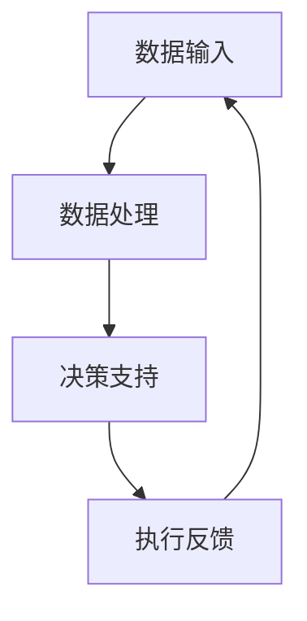

                 

关键词：人机协同、人工智能、工作生产力、自动化、人类与机器协作

> 摘要：随着人工智能技术的飞速发展，人机协同正逐步成为未来工作的核心竞争力。本文将从背景介绍、核心概念与联系、核心算法原理、数学模型和公式、项目实践、实际应用场景、工具和资源推荐、总结与展望等方面，深入探讨人机协同在各个领域的应用及其发展趋势。

## 1. 背景介绍

在过去的几十年中，人工智能（AI）技术的发展迅速，从最初的实验室研究到如今已经广泛应用于各行各业。从早期的规则系统到深度学习，AI技术的不断进步使得机器能够在处理复杂数据、识别模式、进行预测等方面展现出强大的能力。与此同时，人类的工作方式和生产力也得到了极大的提升。然而，随着AI技术的不断成熟，一个全新的问题也逐渐凸显出来：人类与机器之间的协作如何实现？

人机协同，即人类与机器之间的协作，是一种新型的工作方式，它结合了人类的创造力和直觉与机器的计算能力和效率，以期达到更高效、更智能的工作效果。随着AI技术的不断发展，人机协同逐渐成为未来工作的核心竞争力，它不仅能够提高工作效率，还能解决许多传统方法难以解决的问题。

## 2. 核心概念与联系

### 2.1 人工智能与人类协作的概念

人工智能（AI）是一种模拟人类智能的技术，它通过算法和模型，使计算机能够执行通常需要人类智能才能完成的任务。而人类协作，则是指人类之间的互动和合作，以实现共同的目标。人机协同则是将人工智能与人类协作结合起来，使机器能够更好地服务于人类。

### 2.2 人工智能与人类协作的架构

为了实现人机协同，首先需要建立一个人工智能与人类协作的架构。这个架构主要包括以下几个方面：

- **数据输入**：人类将数据输入到系统中，可以是结构化的数据，也可以是非结构化的数据，如文本、图像、声音等。
- **数据处理**：人工智能系统对输入的数据进行处理，包括数据清洗、特征提取、模式识别等。
- **决策支持**：根据处理结果，人工智能系统为人类提供决策支持，帮助人类做出更明智的决策。
- **执行反馈**：人类根据决策支持，执行具体的任务，并将执行结果反馈给系统。

### 2.3 Mermaid 流程图



## 3. 核心算法原理 & 具体操作步骤

### 3.1 算法原理概述

人机协同的核心算法主要包括以下几个方面：

- **机器学习**：通过训练模型，使机器能够对数据进行分析和预测。
- **自然语言处理**：使机器能够理解和生成自然语言，从而实现人与机器的对话。
- **计算机视觉**：使机器能够识别和理解图像和视频，从而实现视觉交互。

### 3.2 算法步骤详解

1. **数据收集与预处理**：收集数据，并进行数据清洗、去重、归一化等预处理操作。
2. **模型训练**：选择合适的算法，对数据进行训练，使模型能够对数据进行有效的分析和预测。
3. **模型评估**：使用测试数据对模型进行评估，确保模型的准确性和可靠性。
4. **模型部署**：将训练好的模型部署到生产环境中，使其能够为人类提供决策支持。
5. **人机交互**：人类根据模型提供的决策支持，进行任务执行，并将结果反馈给系统。

### 3.3 算法优缺点

- **优点**：能够提高工作效率，降低人力成本，解决复杂问题。
- **缺点**：需要大量的数据支持，模型的训练和部署过程复杂。

### 3.4 算法应用领域

人机协同算法广泛应用于各个领域，如金融、医疗、零售、制造业等。例如，在金融领域，AI可以用于风险评估、交易策略制定等；在医疗领域，AI可以用于疾病诊断、药物研发等；在零售领域，AI可以用于库存管理、客户推荐等。

## 4. 数学模型和公式 & 详细讲解 & 举例说明

### 4.1 数学模型构建

人机协同的数学模型主要包括以下几个部分：

- **决策树模型**：用于分类和回归任务。
- **神经网络模型**：用于处理复杂的非线性问题。
- **支持向量机模型**：用于分类和回归任务。

### 4.2 公式推导过程

以决策树模型为例，其基本公式如下：

$$
y = f(x_1, x_2, ..., x_n)
$$

其中，$y$ 为输出结果，$x_1, x_2, ..., x_n$ 为输入特征。

### 4.3 案例分析与讲解

以金融领域的风险评估为例，假设有以下几个特征：年龄、收入、负债率、信用评分。通过决策树模型，可以预测客户的信用风险。

## 5. 项目实践：代码实例和详细解释说明

### 5.1 开发环境搭建

- **硬件环境**：CPU 内存至少 8G，硬盘至少 100G。
- **软件环境**：Python 3.7及以上版本，Jupyter Notebook。

### 5.2 源代码详细实现

```python
import pandas as pd
from sklearn.tree import DecisionTreeClassifier
from sklearn.model_selection import train_test_split

# 数据读取
data = pd.read_csv('data.csv')

# 特征提取
X = data[['age', 'income', 'debt_ratio', 'credit_score']]
y = data['credit_risk']

# 数据分割
X_train, X_test, y_train, y_test = train_test_split(X, y, test_size=0.2, random_state=42)

# 模型训练
model = DecisionTreeClassifier()
model.fit(X_train, y_train)

# 模型评估
accuracy = model.score(X_test, y_test)
print(f'Model accuracy: {accuracy:.2f}')
```

### 5.3 代码解读与分析

这段代码首先读取数据，然后提取特征，接着分割数据为训练集和测试集，然后使用决策树模型进行训练，最后评估模型准确性。

## 6. 实际应用场景

人机协同在各个领域的应用非常广泛，以下是一些典型的实际应用场景：

- **金融领域**：风险评估、交易策略制定。
- **医疗领域**：疾病诊断、药物研发。
- **零售领域**：库存管理、客户推荐。
- **制造业**：生产计划制定、质量控制。

## 6.4 未来应用展望

随着AI技术的不断发展，人机协同将在未来有更广泛的应用。一方面，AI技术将进一步提升机器的智能水平，使其能够更好地服务于人类；另一方面，人类也将通过不断学习，提高与机器的协作能力。未来，人机协同将成为一种新的工作模式，推动社会生产力的进一步提高。

## 7. 工具和资源推荐

### 7.1 学习资源推荐

- **书籍**：《机器学习》、《深度学习》
- **在线课程**：Coursera、Udacity、edX

### 7.2 开发工具推荐

- **Python**：Jupyter Notebook、PyCharm
- **数据可视化**：Matplotlib、Seaborn

### 7.3 相关论文推荐

- **金融领域**：《基于机器学习的信用风险评估方法研究》
- **医疗领域**：《深度学习在疾病诊断中的应用》

## 8. 总结：未来发展趋势与挑战

人机协同作为未来工作的核心竞争力，将推动社会生产力的进一步提升。然而，人机协同也面临着一些挑战，如数据隐私、算法公平性等。未来，我们需要继续深入研究人机协同的理论和实践，探索更加高效、智能的人机协作方式。

## 9. 附录：常见问题与解答

### 问题1：人机协同是否会取代人类工作？

解答：人机协同并不会完全取代人类工作，而是将人类从重复性、低效的工作中解放出来，使其能够更多地从事创造性、决策性的工作。

### 问题2：人机协同需要哪些技能？

解答：人机协同需要掌握人工智能、数据分析、编程等技能，同时还需要具备良好的沟通能力和团队协作能力。

## 作者署名

作者：禅与计算机程序设计艺术 / Zen and the Art of Computer Programming
```

