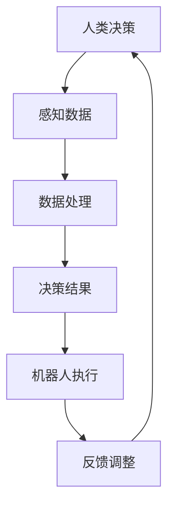

                 

关键词：人机协同、未来工作、人工智能、技术创新、工作模式变革

> 摘要：随着人工智能技术的迅速发展，人机协同正成为未来工作的核心驱动力。本文将深入探讨人机协同的背景、核心概念、算法原理、应用实践，以及未来的发展趋势和面临的挑战，旨在为读者提供对这一领域的全面理解。

## 1. 背景介绍

在信息时代，人工智能（AI）技术的发展正以前所未有的速度改变着人类社会。从自动驾驶汽车到智能家居，从医疗诊断到金融交易，AI技术正在各个行业展现出其巨大的潜力。然而，AI的发展不仅仅是技术层面的突破，更重要的是它对人类工作和生活方式的深远影响。

人机协同（Human-Robot Collaboration）作为一种新兴的工作模式，正在逐步改变传统的工作方式。人机协同指的是人类和机器人在同一工作环境中协作完成工作任务的过程。这种模式不仅提高了工作效率，还减少了人力成本，提升了工作质量。

近年来，随着AI技术的不断进步，人机协同在制造业、服务业、医疗健康等多个领域得到了广泛应用。例如，在制造业中，机器人与人类工人共同操作生产线，实现了自动化和智能化生产；在医疗领域，医生与AI系统协同工作，提高了诊断和治疗的准确性和效率。

## 2. 核心概念与联系

### 2.1. 人类与机器人的协作机制

人机协同的核心在于构建人类与机器人之间的协作机制。这一机制包括以下几个方面：

1. **任务分配**：明确人类和机器人在协同工作过程中的职责和任务，确保二者能够高效合作。
2. **感知与决策**：机器人需要具备对环境的感知能力，同时人类需要根据实际情况进行决策。
3. **交互与反馈**：人类与机器人之间需要建立有效的沟通渠道，以便及时反馈问题和调整工作流程。

### 2.2. 技术架构

人机协同的技术架构可以分为感知层、决策层和执行层三个部分。

1. **感知层**：包括传感器、摄像头、雷达等设备，用于获取环境信息。
2. **决策层**：基于感知层的数据，通过算法模型进行分析和处理，生成决策结果。
3. **执行层**：机器人根据决策层的指令执行具体任务。

### 2.3. Mermaid 流程图



在这个流程图中，人类决策、感知数据、数据处理、决策结果、机器人执行和反馈调整共同构成了人机协同的基本循环。

## 3. 核心算法原理 & 具体操作步骤

### 3.1. 算法原理概述

人机协同中的核心算法主要包括感知算法、决策算法和执行算法。这些算法的原理如下：

1. **感知算法**：通过传感器获取环境信息，如图像、声音、温度等。
2. **决策算法**：基于感知数据，通过机器学习、深度学习等算法进行分析和处理，生成决策结果。
3. **执行算法**：根据决策结果，指导机器人执行具体任务。

### 3.2. 算法步骤详解

1. **感知数据收集**：机器人通过传感器收集环境信息，如图像、声音、温度等。
2. **数据处理**：将收集到的感知数据进行预处理，如去噪、归一化等。
3. **特征提取**：从预处理后的数据中提取关键特征，如边缘、纹理、颜色等。
4. **模型训练**：使用机器学习或深度学习算法，对提取的特征进行训练，生成决策模型。
5. **决策生成**：将感知数据输入决策模型，生成决策结果。
6. **任务执行**：机器人根据决策结果执行具体任务。
7. **反馈调整**：根据执行结果进行反馈，调整决策模型和任务流程。

### 3.3. 算法优缺点

**优点**：
- 提高工作效率：机器人能够高效地执行重复性、危险性的工作。
- 减少人力成本：通过自动化和智能化，降低了人力成本。
- 提高工作质量：机器人能够精确地执行任务，减少人为错误。

**缺点**：
- 技术门槛高：需要专业的算法工程师进行开发和维护。
- 适应性问题：机器人需要针对不同场景进行定制化开发。

### 3.4. 算法应用领域

人机协同算法在多个领域具有广泛的应用：

1. **制造业**：自动化生产线、质量控制等。
2. **服务业**：配送、餐饮、医疗等。
3. **医疗健康**：辅助诊断、手术等。
4. **安防监控**：人脸识别、行为分析等。

## 4. 数学模型和公式 & 详细讲解 & 举例说明

### 4.1. 数学模型构建

人机协同中的数学模型主要包括感知模型、决策模型和执行模型。

1. **感知模型**：通常使用卷积神经网络（CNN）进行图像处理。
2. **决策模型**：使用支持向量机（SVM）、决策树（DT）等算法进行分类和预测。
3. **执行模型**：使用深度强化学习（DRL）算法进行路径规划和任务执行。

### 4.2. 公式推导过程

以感知模型为例，CNN的公式推导如下：

$$
h_l = \sigma(\mathbf{W}_l \cdot \mathbf{a}_{l-1} + b_l)
$$

其中，$h_l$表示第$l$层的特征图，$\sigma$为激活函数，$\mathbf{W}_l$为权重矩阵，$\mathbf{a}_{l-1}$为上一层的激活值，$b_l$为偏置。

### 4.3. 案例分析与讲解

以制造业为例，人机协同在自动化生产线中的应用：

1. **感知数据收集**：机器人通过摄像头收集生产线上的图像数据。
2. **数据处理**：对图像数据去噪、归一化等预处理。
3. **特征提取**：使用CNN提取图像中的关键特征。
4. **决策生成**：通过SVM对特征进行分类，判断产品是否合格。
5. **任务执行**：根据决策结果，指导机器人进行下一步操作。

## 5. 项目实践：代码实例和详细解释说明

### 5.1. 开发环境搭建

1. 安装Python环境，版本要求3.7及以上。
2. 安装TensorFlow和OpenCV等库。

### 5.2. 源代码详细实现

以下是一个简单的基于CNN的人机协同感知模型实现：

```python
import tensorflow as tf
from tensorflow.keras.models import Sequential
from tensorflow.keras.layers import Conv2D, Flatten, Dense

model = Sequential([
    Conv2D(32, (3, 3), activation='relu', input_shape=(28, 28, 1)),
    Flatten(),
    Dense(128, activation='relu'),
    Dense(1, activation='sigmoid')
])

model.compile(optimizer='adam', loss='binary_crossentropy', metrics=['accuracy'])
```

### 5.3. 代码解读与分析

- `Sequential`：创建一个序列模型。
- `Conv2D`：卷积层，用于提取图像特征。
- `Flatten`：将卷积层的输出展平为一个一维向量。
- `Dense`：全连接层，用于分类和预测。

### 5.4. 运行结果展示

```python
model.fit(x_train, y_train, epochs=10, batch_size=32, validation_data=(x_val, y_val))
```

这个代码片段用于训练模型，`x_train`和`y_train`为训练数据，`x_val`和`y_val`为验证数据。

## 6. 实际应用场景

### 6.1. 制造业

人机协同在制造业中的应用主要体现在自动化生产线上，通过机器人与人类工人的协作，实现生产过程的自动化和智能化。

### 6.2. 医疗健康

在医疗健康领域，人机协同主要体现在辅助诊断和治疗。例如，医生与AI系统协同工作，提高疾病诊断的准确性和治疗效率。

### 6.3. 服务业

在服务业中，人机协同广泛应用于配送、餐饮、医疗等环节。例如，机器人可以协助服务员进行点餐、送餐等工作。

### 6.4. 未来应用展望

随着AI技术的不断发展，人机协同将在更多领域得到应用。例如，在教育、农业、环保等领域，人机协同将发挥重要作用。

## 7. 工具和资源推荐

### 7.1. 学习资源推荐

- 《深度学习》（Goodfellow, Bengio, Courville）
- 《Python机器学习》（Sebastian Raschka）

### 7.2. 开发工具推荐

- TensorFlow
- OpenCV

### 7.3. 相关论文推荐

- "Human-Robot Collaboration: A Review"
- "A Comprehensive Survey on Human-Robot Collaboration in Service Robotics"

## 8. 总结：未来发展趋势与挑战

### 8.1. 研究成果总结

人机协同作为未来工作的重要驱动力，已经在多个领域取得了显著成果。随着AI技术的不断发展，人机协同将在更多领域得到应用。

### 8.2. 未来发展趋势

1. 人工智能与人类工人的协作更加紧密。
2. 机器人智能化程度不断提高。
3. 人机协同系统将更加完善。

### 8.3. 面临的挑战

1. 技术门槛高，需要专业的算法工程师。
2. 机器人适应性问题。
3. 数据隐私和安全问题。

### 8.4. 研究展望

未来，人机协同将朝着更加智能化、自适应化和人性化的方向发展。通过不断的技术创新，人机协同将为人类带来更多的便利和效益。

## 9. 附录：常见问题与解答

### 9.1. 什么是人机协同？

人机协同指的是人类和机器人在同一工作环境中协作完成工作任务的过程。

### 9.2. 人机协同有哪些应用领域？

人机协同在制造业、服务业、医疗健康、安防监控等多个领域得到了广泛应用。

### 9.3. 人机协同有哪些优点和缺点？

人机协同的优点包括提高工作效率、减少人力成本、提高工作质量等；缺点包括技术门槛高、适应性问题等。

## 作者署名

作者：禅与计算机程序设计艺术 / Zen and the Art of Computer Programming

----------------------------------------------------------------


