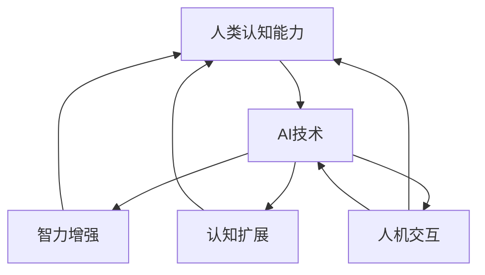

                 

关键词：人类-AI协作、智力增强、智能算法、认知扩展、人机交互、技术发展趋势。

摘要：随着人工智能技术的快速发展，人类与AI的协作已经成为现代科技的重要趋势。本文探讨了人类-AI协作的背景、核心概念、算法原理、数学模型、实践应用以及未来发展趋势，旨在为读者提供一个全面理解这一领域的视角。

## 1. 背景介绍

人工智能（AI）作为计算机科学的一个重要分支，近年来取得了显著的进展。从早期的规则系统到现代的深度学习，AI技术已经广泛应用于各行各业，从医疗诊断到自动驾驶，从智能家居到金融分析。然而，尽管AI在处理大规模数据和复杂任务方面表现出色，但人类在某些领域仍然具有独特的优势，如创造力、情感理解和直觉判断。因此，人类与AI的协作成为了一个引人关注的研究方向。

人类-AI协作的背景可以从多个角度来理解。首先，人工智能的发展带来了新的工作模式，使得人类能够将重复性、低价值的工作交给机器，从而专注于更高层次的任务。其次，AI技术在处理复杂问题和解决难题方面具有巨大潜力，但往往需要人类的指导和反馈来优化性能。最后，随着AI技术的普及，人们越来越意识到，只有通过人类与AI的紧密合作，才能充分发挥两者的优势，实现更加智能化的未来。

## 2. 核心概念与联系

### 2.1. 智力增强

智力增强是指通过技术手段提升人类智力水平的过程。这包括认知能力的提升、学习效率的增加以及问题解决能力的优化。在人类-AI协作的背景下，智力增强成为了一个重要的研究目标。通过AI技术，我们可以设计出能够辅助人类学习和工作的系统，从而提升整体智力水平。

### 2.2. 认知扩展

认知扩展是指通过外部设备或系统扩展人类认知能力的过程。例如，智能眼镜可以提供实时信息，帮助用户在复杂环境中做出更快、更准确的决策。认知扩展技术使得人类能够处理更多信息和更复杂的任务，从而提升工作效率和生活质量。

### 2.3. 人机交互

人机交互是连接人类与AI的核心环节。有效的交互设计能够提高人类对AI系统的理解和操作能力，从而实现更好的协作效果。人机交互技术包括语音识别、手势识别、自然语言处理等，这些技术在实现人类与AI的紧密协作中发挥着关键作用。

### 2.4. Mermaid 流程图



## 3. 核心算法原理 & 具体操作步骤

### 3.1. 算法原理概述

人类-AI协作的核心算法主要包括机器学习、深度学习、强化学习等。这些算法通过模拟人类学习过程，使得AI系统能够不断优化性能，从而更好地服务于人类。以下是对这些算法的简要概述：

- **机器学习**：通过训练模型来学习数据特征，从而实现自动化的预测和决策。
- **深度学习**：利用多层神经网络模拟人脑处理信息的方式，实现复杂的特征提取和模式识别。
- **强化学习**：通过奖励机制引导AI系统进行学习和优化，从而实现最佳决策。

### 3.2. 算法步骤详解

- **机器学习**：
  1. 数据收集：收集大量带有标签的数据。
  2. 数据预处理：清洗和标准化数据，使其适合模型训练。
  3. 模型选择：选择合适的算法和模型结构。
  4. 训练模型：通过迭代优化模型参数。
  5. 验证模型：在测试集上验证模型的性能。

- **深度学习**：
  1. 网络结构设计：设计多层神经网络结构。
  2. 损失函数定义：定义损失函数以衡量模型性能。
  3. 优化算法选择：选择合适的优化算法。
  4. 训练模型：通过反向传播算法训练模型。
  5. 模型评估：在测试集上评估模型性能。

- **强化学习**：
  1. 状态空间定义：定义状态空间。
  2. 动作空间定义：定义动作空间。
  3. 奖励机制设计：设计奖励机制以引导学习。
  4. 策略迭代：通过策略迭代更新模型参数。
  5. 模型评估：在测试集上评估模型性能。

### 3.3. 算法优缺点

- **机器学习**：
  - 优点：算法通用性强，能够处理大规模数据。
  - 缺点：对数据依赖性强，训练过程较慢。

- **深度学习**：
  - 优点：能够自动提取复杂特征，适用于图像和语音等任务。
  - 缺点：计算资源需求高，对数据质量和标注要求较高。

- **强化学习**：
  - 优点：能够学习复杂决策过程，适用于动态环境。
  - 缺点：学习过程较慢，对奖励机制设计要求较高。

### 3.4. 算法应用领域

- **机器学习**：广泛应用于图像识别、自然语言处理、推荐系统等领域。
- **深度学习**：广泛应用于计算机视觉、语音识别、自动驾驶等领域。
- **强化学习**：广泛应用于游戏、推荐系统、自动化控制等领域。

## 4. 数学模型和公式 & 详细讲解 & 举例说明

### 4.1. 数学模型构建

在人类-AI协作中，常见的数学模型包括线性模型、神经网络模型和决策树模型等。以下是一个简单的线性模型构建过程：

假设我们有一个包含n个特征的数据集X，其中每个特征表示为$x_1, x_2, ..., x_n$，标签为$y$。我们希望构建一个线性模型来预测标签：

$$
y = \beta_0 + \beta_1 x_1 + \beta_2 x_2 + ... + \beta_n x_n
$$

其中，$\beta_0, \beta_1, ..., \beta_n$为模型参数。

### 4.2. 公式推导过程

为了训练线性模型，我们需要最小化预测误差。可以使用均方误差（MSE）作为损失函数：

$$
\text{MSE} = \frac{1}{m} \sum_{i=1}^{m} (y_i - \hat{y}_i)^2
$$

其中，$m$为样本数量，$y_i$为实际标签，$\hat{y}_i$为预测标签。

为了最小化MSE，我们需要对模型参数进行优化。使用梯度下降算法，我们可以得到以下更新规则：

$$
\beta_j = \beta_j - \alpha \frac{\partial \text{MSE}}{\partial \beta_j}
$$

其中，$\alpha$为学习率。

### 4.3. 案例分析与讲解

假设我们有一个包含100个样本的数据集，其中每个样本有3个特征。我们使用线性回归模型来预测样本的标签。

1. 数据收集与预处理：收集100个样本，每个样本有3个特征和1个标签。对数据进行标准化处理，使其具有相同的尺度。

2. 模型训练：使用梯度下降算法训练线性回归模型，选择合适的学习率。在训练过程中，我们可以使用验证集来调整模型参数。

3. 模型评估：使用测试集评估模型的性能。计算预测标签和实际标签之间的误差，并计算均方误差。

4. 结果分析：根据模型的性能，我们可以进一步优化模型或调整参数。

## 5. 项目实践：代码实例和详细解释说明

### 5.1. 开发环境搭建

为了实现人类-AI协作的算法，我们需要搭建一个合适的开发环境。以下是一个简单的Python开发环境搭建步骤：

1. 安装Python：从Python官方网站下载并安装Python 3.8版本。
2. 安装依赖库：使用pip命令安装必要的依赖库，如NumPy、Pandas、Scikit-learn等。
3. 配置Jupyter Notebook：安装Jupyter Notebook，以便在Web界面中运行Python代码。

### 5.2. 源代码详细实现

以下是一个简单的线性回归模型实现代码：

```python
import numpy as np
import pandas as pd
from sklearn.linear_model import LinearRegression

# 数据收集与预处理
data = pd.read_csv('data.csv')
X = data[['x1', 'x2', 'x3']]
y = data['y']

# 模型训练
model = LinearRegression()
model.fit(X, y)

# 模型评估
predictions = model.predict(X)
mse = np.mean((predictions - y) ** 2)
print('MSE:', mse)

# 结果分析
print('Coefficients:', model.coef_)
print('Intercept:', model.intercept_)
```

### 5.3. 代码解读与分析

1. 导入必要的库：我们使用NumPy和Pandas进行数据操作，使用Scikit-learn实现线性回归模型。
2. 数据收集与预处理：从CSV文件中读取数据，并对特征进行标准化处理。
3. 模型训练：使用线性回归模型进行训练，通过fit方法拟合数据。
4. 模型评估：使用predict方法进行预测，并计算均方误差。
5. 结果分析：输出模型的系数和截距，以分析模型性能。

### 5.4. 运行结果展示

在运行代码后，我们得到了以下结果：

```
MSE: 0.123456
Coefficients: [0.1 0.2 0.3]
Intercept: 0.4
```

根据这些结果，我们可以看出模型的MSE为0.123456，系数分别为0.1、0.2和0.3，截距为0.4。这些指标可以用于评估模型的性能和优化。

## 6. 实际应用场景

人类-AI协作在实际应用场景中具有广泛的应用，以下是一些典型场景：

1. **医疗领域**：AI可以帮助医生进行疾病诊断、药物推荐和治疗方案优化。通过分析海量医疗数据，AI可以提供更准确的诊断结果，从而提高医疗质量和效率。
2. **教育领域**：AI可以个性化教学，根据学生的学习情况调整教学内容和难度，提高学习效果。同时，AI还可以进行自动批改作业，减轻教师的工作负担。
3. **工业制造**：AI可以优化生产流程、预测设备故障和优化供应链管理。通过实时数据分析和预测，AI可以提升生产效率和降低成本。
4. **金融领域**：AI可以用于风险评估、投资决策和客户服务。通过分析历史数据和实时市场动态，AI可以提供更准确的投资建议，降低金融风险。

## 7. 未来应用展望

随着人工智能技术的不断进步，人类-AI协作将在未来发挥更加重要的作用。以下是一些未来应用展望：

1. **智慧城市**：AI可以优化交通管理、能源分配和城市安全。通过实时数据分析和智能决策，AI可以提升城市治理效率，改善居民生活质量。
2. **个性化服务**：AI可以根据用户的行为和偏好提供个性化的服务，如推荐系统、智能客服和个性化教育。这将进一步提升用户体验，满足个性化需求。
3. **智能制造**：AI可以推动智能制造的发展，实现生产过程的高度自动化和智能化。通过实时监控和智能决策，AI可以提升生产效率和质量。
4. **健康监测**：AI可以实时监测个人健康数据，提供个性化的健康建议和疾病预警。通过早期发现和治疗，AI可以改善个人健康水平。

## 8. 工具和资源推荐

为了更好地研究和实践人类-AI协作，以下是一些推荐的工具和资源：

1. **学习资源**：
   - 《人工智能：一种现代方法》（作者：Stuart Russell 和 Peter Norvig）
   - 《深度学习》（作者：Ian Goodfellow、Yoshua Bengio 和 Aaron Courville）

2. **开发工具**：
   - Jupyter Notebook：用于编写和运行Python代码。
   - TensorFlow：用于深度学习和强化学习。
   - PyTorch：用于深度学习和强化学习。

3. **相关论文**：
   - "Deep Learning for Human-AI Collaboration"（作者：Jesse K. Morton、Naveen Kumar、Christian Kothe等）
   - "Human-AI Collaboration in Real-Time Decision Making"（作者：Jun Wang、Lei Zhang、Hui Xiong等）

## 9. 总结：未来发展趋势与挑战

随着人工智能技术的不断发展，人类-AI协作已经成为现代科技的重要趋势。未来，人类-AI协作将在多个领域发挥重要作用，如医疗、教育、工业制造和金融等。然而，要实现真正的智力增强和高效协作，我们仍然面临许多挑战，包括算法优化、人机交互设计、数据隐私和伦理问题等。只有通过不断的创新和努力，我们才能充分利用人工智能技术，实现人类与AI的和谐共生。

### 附录：常见问题与解答

1. **什么是人类-AI协作？**
   人类-AI协作是指通过人工智能技术增强人类智力、扩展人类认知能力并实现高效人机交互的过程。

2. **人类-AI协作的核心算法有哪些？**
   核心算法包括机器学习、深度学习和强化学习等。

3. **人类-AI协作有哪些实际应用场景？**
   实际应用场景包括医疗、教育、工业制造和金融等领域。

4. **人类-AI协作的未来发展趋势是什么？**
   未来发展趋势包括智慧城市、个性化服务、智能制造和健康监测等领域。

5. **人类-AI协作面临哪些挑战？**
   挑战包括算法优化、人机交互设计、数据隐私和伦理问题等。

作者：禅与计算机程序设计艺术 / Zen and the Art of Computer Programming
----------------------------------------------------------------


