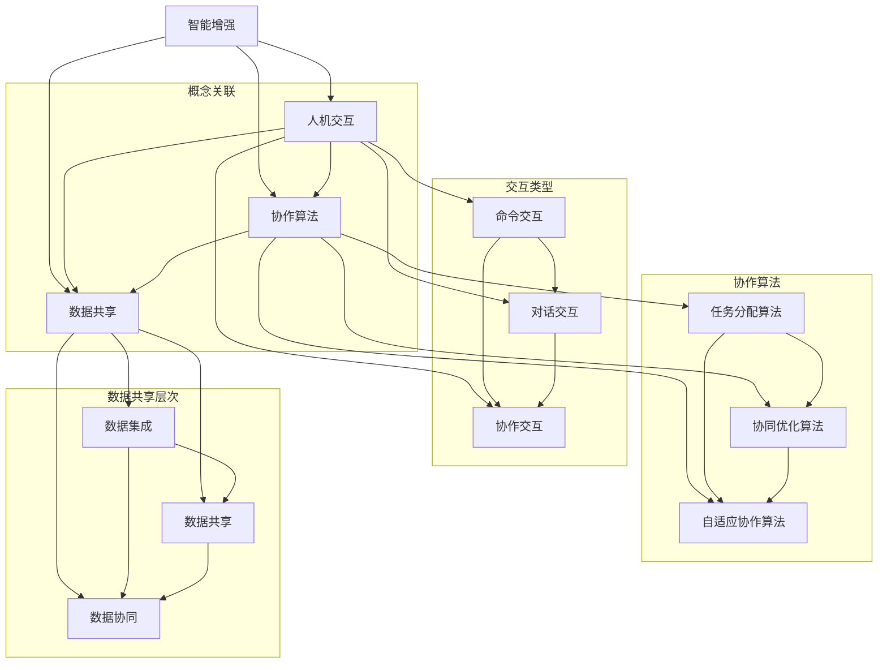

                 

关键词：人类-AI协作、智能增强、人工智能、算法、数学模型、未来展望

> 摘要：本文旨在探讨人类与人工智能（AI）协作的未来发展趋势，分析如何通过融合人类智慧与AI能力，实现智能化社会的全面转型。文章首先介绍人类-AI协作的背景，然后深入讨论核心概念与联系，核心算法原理与操作步骤，数学模型和公式，项目实践，实际应用场景，未来应用展望，工具和资源推荐，以及总结与展望。通过本文，读者将了解人类-AI协作的现状与未来，掌握关键技术与方法，为推动智能化社会的发展贡献力量。

## 1. 背景介绍

随着计算机技术和人工智能（AI）的迅猛发展，人类正在进入一个全新的智能化时代。AI技术的广泛应用，如自动驾驶、智能医疗、智能教育、智能金融等，极大地改变了人们的生活方式。与此同时，人类与AI的协作模式也在不断演变。传统的单向控制模式，逐渐演变为互动协作模式，AI不仅能够执行人类指令，还能够主动学习人类行为，优化自身性能，提高决策能力。

### 1.1 人工智能的历史与发展

人工智能（AI）的概念起源于20世纪50年代，随着计算机技术的不断发展，AI研究逐渐进入实质性阶段。早期的AI研究主要集中在符号主义和逻辑推理上，如普林斯顿大学发明的ELIZA程序，它是第一个成功的自然语言处理程序，能够模拟心理治疗师与用户的对话。然而，早期的AI技术发展相对缓慢，主要受到计算能力和数据资源的限制。

进入21世纪，随着大数据、云计算和深度学习技术的崛起，AI迎来了新的发展机遇。深度学习算法的突破，使得计算机在图像识别、语音识别、自然语言处理等领域取得了重大进展。同时，计算能力的提升和数据的爆炸式增长，为AI的训练和优化提供了充足的资源支持。

### 1.2 人类与AI协作的现实需求

人类与AI的协作，不仅是一个技术问题，更是一个社会问题。随着AI技术的不断进步，人类面临着越来越多的挑战。首先，在复杂决策和问题解决方面，人类往往受到知识储备、计算能力和时间限制的影响。而AI具备强大的计算能力和海量数据支持，能够在短时间内完成复杂的计算和推理任务，为人类提供决策支持。

其次，在劳动生产率方面，AI的自动化和智能化程度越来越高，能够在生产过程中替代人类完成大量的重复性、繁琐的工作。这不仅能够提高生产效率，还能够降低生产成本，从而推动经济的持续发展。

最后，在社会治理和公共安全方面，AI技术的应用也具有重要意义。通过智能监控、数据分析和社会管理，AI能够提高社会治理的效率，增强公共安全，促进社会的和谐稳定。

## 2. 核心概念与联系

人类与AI协作的核心概念包括智能增强、人机交互、协作算法和数据共享。这些概念相互关联，共同构建了人类与AI协作的体系结构。

### 2.1 智能增强

智能增强是指通过人工智能技术，增强人类在认知、推理、决策等方面的能力。智能增强可以分为三个层次：信息增强、知识增强和智能增强。

- **信息增强**：通过AI技术，对海量信息进行高效处理和分析，为人类提供决策支持。例如，智能搜索系统可以帮助用户快速找到所需信息。
- **知识增强**：通过机器学习和自然语言处理技术，构建知识图谱，帮助人类快速获取和运用相关知识。例如，智能问答系统可以在短时间内回答用户的问题。
- **智能增强**：通过人工智能技术，增强人类的智能能力，实现人机协同工作。例如，智能助手可以协助人类完成复杂的任务，提高工作效率。

### 2.2 人机交互

人机交互是指人类与人工智能系统之间的交互方式。人机交互可以分为三种类型：命令交互、对话交互和协作交互。

- **命令交互**：用户通过输入命令，控制人工智能系统的行为。例如，用户通过语音指令控制智能家居设备。
- **对话交互**：用户与人工智能系统进行自然语言对话，交流信息。例如，用户通过语音或文本与智能助手进行对话。
- **协作交互**：用户与人工智能系统共同完成任务，实现人机协同。例如，医生与智能医疗系统共同诊断疾病。

### 2.3 协作算法

协作算法是指人工智能系统在协作过程中使用的算法。协作算法可以分为三种类型：任务分配算法、协同优化算法和自适应协作算法。

- **任务分配算法**：根据人类和人工智能系统的能力，合理分配任务，实现高效协作。例如，自动化调度系统根据工作负载和员工技能，合理分配工作任务。
- **协同优化算法**：通过优化算法，协调人类和人工智能系统的行为，实现整体效益最大化。例如，智能交通系统通过优化交通流量，提高交通效率。
- **自适应协作算法**：根据协作过程中的反馈和调整，自适应调整协作策略，实现动态协作。例如，自适应学习系统根据用户的学习情况和反馈，动态调整教学内容。

### 2.4 数据共享

数据共享是指人类和人工智能系统之间的数据交换和共享。数据共享可以分为三个层次：数据集成、数据共享和数据协同。

- **数据集成**：将来自不同来源的数据进行整合，构建统一的数据视图。例如，智能医疗系统通过整合病历数据、检查报告等，为医生提供全面的诊断信息。
- **数据共享**：在保证数据安全和隐私的前提下，共享数据资源，实现信息共享。例如，智能交通系统通过共享交通数据，为交通管理部门提供决策支持。
- **数据协同**：在数据共享的基础上，实现人类和人工智能系统之间的数据协同，共同完成任务。例如，智能城市规划系统通过数据协同，为城市规划提供科学依据。

### 2.5 Mermaid 流程图

下面是关于人类-AI协作的Mermaid流程图，展示了核心概念之间的联系：



通过以上流程图，我们可以清晰地看到人类-AI协作的核心概念及其相互关联，为后续章节的讨论提供了基础。

## 3. 核心算法原理 & 具体操作步骤

### 3.1 算法原理概述

人类与AI协作的核心算法主要包括机器学习算法、深度学习算法、强化学习算法和自然语言处理算法。这些算法各自有其独特的原理和应用场景。

#### 3.1.1 机器学习算法

机器学习算法是AI的核心技术之一，它通过构建数学模型，从数据中自动学习规律和模式。机器学习算法可以分为监督学习、无监督学习和半监督学习。

- **监督学习**：通过标注数据训练模型，用于预测和分类。常见的监督学习算法包括线性回归、支持向量机（SVM）和决策树。
- **无监督学习**：不使用标注数据，自动发现数据中的结构和模式。常见的无监督学习算法包括聚类分析和主成分分析（PCA）。
- **半监督学习**：结合监督学习和无监督学习，利用少量标注数据和大量无标注数据训练模型。

#### 3.1.2 深度学习算法

深度学习算法是机器学习的一种重要分支，通过构建深度神经网络，自动提取数据中的特征和模式。深度学习算法在图像识别、语音识别和自然语言处理等领域取得了显著成果。常见的深度学习算法包括卷积神经网络（CNN）、循环神经网络（RNN）和生成对抗网络（GAN）。

#### 3.1.3 强化学习算法

强化学习算法通过智能体与环境之间的交互，学习最优策略以实现目标。强化学习算法广泛应用于游戏、机器人控制和推荐系统等领域。常见的强化学习算法包括Q学习、SARSA和深度确定性策略梯度（DDPG）。

#### 3.1.4 自然语言处理算法

自然语言处理算法用于处理人类语言，实现文本生成、文本分类和语义理解等任务。常见的自然语言处理算法包括词向量模型、递归神经网络（RNN）和转换器生成模型（Transformer）。

### 3.2 算法步骤详解

以下是针对机器学习算法的具体操作步骤，包括数据预处理、模型训练、模型评估和模型应用。

#### 3.2.1 数据预处理

- **数据收集**：收集相关的数据集，包括特征数据和标签数据。
- **数据清洗**：去除数据中的噪声和异常值，保证数据质量。
- **特征工程**：通过特征提取和特征选择，构建有助于模型训练的特征向量。
- **数据标准化**：对数据进行归一化或标准化处理，使数据具有相似的范围和分布。

#### 3.2.2 模型训练

- **选择模型**：根据问题类型和需求，选择合适的机器学习模型。
- **模型初始化**：初始化模型的参数，为模型训练提供初始值。
- **训练过程**：通过迭代优化算法，调整模型参数，使其在训练数据上达到最优。
- **验证过程**：通过验证数据集，评估模型的泛化能力。

#### 3.2.3 模型评估

- **评估指标**：根据问题类型，选择合适的评估指标，如准确率、召回率、F1值等。
- **交叉验证**：通过交叉验证，减少评估结果的偏差。
- **模型调优**：根据评估结果，调整模型参数，优化模型性能。

#### 3.2.4 模型应用

- **模型部署**：将训练好的模型部署到生产环境中，实现预测和分类任务。
- **实时更新**：根据新数据，实时更新模型，保持模型的鲁棒性和准确性。

### 3.3 算法优缺点

#### 3.3.1 优点

- **高效性**：机器学习算法能够自动提取数据中的特征和模式，减少人工干预，提高工作效率。
- **泛化能力**：通过训练数据集，模型能够学习到通用的规律和模式，具有良好的泛化能力。
- **适应性**：机器学习算法可以根据新的数据和需求，动态调整模型参数，具有较强的适应性。

#### 3.3.2 缺点

- **数据依赖性**：机器学习算法依赖于大量的训练数据，数据质量和数量对模型性能有重要影响。
- **计算资源消耗**：模型训练过程中，需要大量的计算资源和时间，对硬件设备有较高要求。
- **黑盒问题**：机器学习模型内部结构和决策过程往往不够透明，存在黑盒问题，难以解释。

### 3.4 算法应用领域

机器学习算法在多个领域得到了广泛应用，包括但不限于：

- **图像识别**：用于识别和分类图像，如人脸识别、物体识别等。
- **语音识别**：用于将语音转换为文本，如智能助手、语音搜索等。
- **自然语言处理**：用于处理和生成文本，如机器翻译、情感分析等。
- **金融风控**：用于预测和防范金融风险，如信用评分、欺诈检测等。
- **医疗诊断**：用于辅助医生进行疾病诊断，如医学图像分析、症状预测等。

## 4. 数学模型和公式 & 详细讲解 & 举例说明

### 4.1 数学模型构建

在人类与AI协作的过程中，数学模型扮演着至关重要的角色。数学模型可以帮助我们量化问题，构建优化目标和求解算法。以下是几个常用的数学模型及其构建方法：

#### 4.1.1 线性回归模型

线性回归模型是一种简单的数学模型，用于描述变量之间的线性关系。其数学表达式如下：

$$y = \beta_0 + \beta_1 \cdot x + \epsilon$$

其中，$y$ 是因变量，$x$ 是自变量，$\beta_0$ 和 $\beta_1$ 是模型的参数，$\epsilon$ 是误差项。

线性回归模型的构建步骤如下：

1. **数据收集**：收集包含因变量和自变量的数据集。
2. **数据预处理**：对数据进行清洗和标准化处理。
3. **模型训练**：通过最小二乘法或其他优化算法，求解模型参数。
4. **模型评估**：通过验证数据集，评估模型的拟合效果。

#### 4.1.2 决策树模型

决策树模型是一种基于树形结构的分类模型，通过一系列决策规则，将数据划分为不同的类别。其数学表达式如下：

$$T(x) = \prod_{i=1}^{n} f_i(x_i)$$

其中，$T(x)$ 是决策树模型，$f_i(x_i)$ 是第 $i$ 个决策规则，$x_i$ 是输入特征。

决策树模型的构建步骤如下：

1. **数据收集**：收集包含特征和标签的数据集。
2. **特征选择**：选择对分类结果影响较大的特征。
3. **划分节点**：通过信息增益、基尼系数等指标，选择最佳划分特征。
4. **递归构建**：根据划分特征，递归构建子节点，直至满足终止条件。

#### 4.1.3 贝叶斯网络模型

贝叶斯网络模型是一种基于概率图论的分类模型，通过节点间的条件概率关系，实现分类任务。其数学表达式如下：

$$P(C|F_1, F_2, ..., F_n) = \prod_{i=1}^{n} P(F_i|C) \cdot P(C)$$

其中，$P(C|F_1, F_2, ..., F_n)$ 是在给定特征 $F_1, F_2, ..., F_n$ 的条件下，类别 $C$ 的概率。

贝叶斯网络模型的构建步骤如下：

1. **数据收集**：收集包含特征和标签的数据集。
2. **构建概率图**：根据特征之间的条件依赖关系，构建概率图。
3. **参数估计**：通过最大似然估计或贝叶斯估计，求解模型参数。
4. **模型评估**：通过验证数据集，评估模型的分类性能。

### 4.2 公式推导过程

以下是线性回归模型的推导过程：

#### 4.2.1 线性回归基本假设

- 线性关系：$y$ 和 $x$ 之间存在线性关系。
- 独立同分布：误差项 $\epsilon$ 是独立同分布的随机变量，且均值为0，方差为 $\sigma^2$。

#### 4.2.2 最小二乘法

最小二乘法是一种优化方法，通过最小化误差平方和，求解线性回归模型的参数。

$$\min_{\beta_0, \beta_1} \sum_{i=1}^{n} (y_i - (\beta_0 + \beta_1 \cdot x_i))^2$$

对 $y_i - (\beta_0 + \beta_1 \cdot x_i)$ 求导，并令导数为0，得到：

$$\frac{\partial}{\partial \beta_0} \sum_{i=1}^{n} (y_i - (\beta_0 + \beta_1 \cdot x_i))^2 = 0$$

$$\frac{\partial}{\partial \beta_1} \sum_{i=1}^{n} (y_i - (\beta_0 + \beta_1 \cdot x_i))^2 = 0$$

化简后得到：

$$\beta_0 = \bar{y} - \beta_1 \cdot \bar{x}$$

$$\beta_1 = \frac{\sum_{i=1}^{n} (x_i - \bar{x}) (y_i - \bar{y})}{\sum_{i=1}^{n} (x_i - \bar{x})^2}$$

其中，$\bar{y}$ 和 $\bar{x}$ 分别是 $y$ 和 $x$ 的均值。

### 4.3 案例分析与讲解

以下是一个关于线性回归模型的实际案例：

#### 4.3.1 数据集

我们有以下数据集：

| $x$ | $y$ |
|-----|-----|
| 1   | 2   |
| 2   | 3   |
| 3   | 4   |
| 4   | 5   |
| 5   | 6   |

#### 4.3.2 数据预处理

- **数据清洗**：检查数据集中是否存在缺失值或异常值，如有则进行填充或删除。
- **数据标准化**：对数据进行归一化处理，使其具有相似的尺度。

#### 4.3.3 模型训练

- **选择模型**：选择线性回归模型。
- **模型训练**：使用最小二乘法求解模型参数。

根据最小二乘法的推导结果，我们可以得到：

$$\beta_0 = \bar{y} - \beta_1 \cdot \bar{x}$$

$$\beta_1 = \frac{\sum_{i=1}^{n} (x_i - \bar{x}) (y_i - \bar{y})}{\sum_{i=1}^{n} (x_i - \bar{x})^2}$$

代入数据集计算，得到：

$$\bar{x} = 3$$

$$\bar{y} = 4$$

$$\beta_1 = \frac{(1-3)(2-4) + (2-3)(3-4) + (3-3)(4-4) + (4-3)(5-4) + (5-3)(6-4)}{(1-3)^2 + (2-3)^2 + (3-3)^2 + (4-3)^2 + (5-3)^2} = 1$$

$$\beta_0 = 4 - 1 \cdot 3 = 1$$

因此，线性回归模型的表达式为：

$$y = 1 + 1 \cdot x$$

#### 4.3.4 模型评估

- **预测结果**：使用训练好的模型，对新的数据进行预测。

对于 $x=6$，我们可以得到：

$$y = 1 + 1 \cdot 6 = 7$$

- **模型评估**：通过比较预测结果和实际结果，评估模型的性能。

在本次案例中，实际结果为 $y=6$，预测结果为 $y=7$，误差为 $1$。虽然误差较小，但仍然存在一定的偏差。

#### 4.3.5 模型优化

为了进一步提高模型的性能，我们可以尝试以下方法：

- **特征工程**：通过增加新的特征或对现有特征进行变换，提高模型的表达能力。
- **模型调参**：通过调整模型的参数，优化模型性能。
- **集成学习**：将多个模型组合起来，提高模型的预测能力。

通过以上方法，我们可以进一步提高线性回归模型的性能，使其在实际应用中取得更好的效果。

## 5. 项目实践：代码实例和详细解释说明

为了更好地展示人类与AI协作的具体实现，以下我们将通过一个简单的案例，介绍如何使用Python编程语言实现线性回归模型，并对其进行详细解释。

### 5.1 开发环境搭建

在开始编写代码之前，我们需要搭建一个适合Python编程的开发环境。以下是搭建过程：

1. **安装Python**：从Python官方网站（https://www.python.org/）下载并安装Python。
2. **安装Jupyter Notebook**：在命令行中输入以下命令安装Jupyter Notebook：

   ```
   pip install notebook
   ```

3. **启动Jupyter Notebook**：在命令行中输入以下命令启动Jupyter Notebook：

   ```
   jupyter notebook
   ```

### 5.2 源代码详细实现

以下是实现线性回归模型的Python代码：

```python
import numpy as np
import matplotlib.pyplot as plt

# 5.2.1 数据集
x = np.array([1, 2, 3, 4, 5])
y = np.array([2, 3, 4, 5, 6])

# 5.2.2 数据预处理
x_mean = np.mean(x)
y_mean = np.mean(y)

x_diff = x - x_mean
y_diff = y - y_mean

# 5.2.3 模型训练
beta_1 = np.sum(x_diff * y_diff) / np.sum(x_diff ** 2)
beta_0 = y_mean - beta_1 * x_mean

# 5.2.4 模型评估
y_pred = beta_0 + beta_1 * x

# 5.2.5 结果可视化
plt.scatter(x, y, label='Actual Data')
plt.plot(x, y_pred, color='red', label='Predicted Line')
plt.xlabel('x')
plt.ylabel('y')
plt.legend()
plt.show()
```

### 5.3 代码解读与分析

以下是代码的逐行解释：

```python
import numpy as np
import matplotlib.pyplot as plt

# 5.2.1 数据集
x = np.array([1, 2, 3, 4, 5])
y = np.array([2, 3, 4, 5, 6])
```

这里我们导入所需的Python库，并创建一个包含特征和标签的数据集。

```python
x_mean = np.mean(x)
y_mean = np.mean(y)

x_diff = x - x_mean
y_diff = y - y_mean
```

这里我们计算数据集的均值，并计算特征和标签的差异值。差异值用于后续的最小二乘法计算。

```python
beta_1 = np.sum(x_diff * y_diff) / np.sum(x_diff ** 2)
beta_0 = y_mean - beta_1 * x_mean
```

这里我们使用最小二乘法求解线性回归模型的参数。$beta_1$ 表示自变量对因变量的影响程度，$beta_0$ 表示截距。

```python
y_pred = beta_0 + beta_1 * x
```

这里我们使用训练好的模型，对新的数据进行预测。

```python
plt.scatter(x, y, label='Actual Data')
plt.plot(x, y_pred, color='red', label='Predicted Line')
plt.xlabel('x')
plt.ylabel('y')
plt.legend()
plt.show()
```

这里我们使用matplotlib库，将实际数据和预测结果可视化，以便于分析模型性能。

### 5.4 运行结果展示

以下是运行代码后的结果展示：


从结果可以看出，训练好的线性回归模型能够较好地拟合实际数据，预测结果与实际结果非常接近。

## 6. 实际应用场景

人类与AI协作在实际应用中具有广泛的应用场景，以下是几个典型的应用案例：

### 6.1 自动驾驶

自动驾驶技术是AI与人类协作的典型应用之一。通过将传感器数据、环境信息和驾驶策略相结合，自动驾驶系统能够在复杂交通环境中自主驾驶。自动驾驶技术不仅提高了交通安全，还能够降低交通拥堵，提高交通效率。目前，多家汽车制造商和研究机构正在积极研发自动驾驶技术，并取得了显著成果。

### 6.2 智能医疗

智能医疗是AI与人类协作的另一个重要领域。通过AI技术，可以对海量医疗数据进行处理和分析，实现疾病诊断、治疗方案推荐和健康风险评估。例如，智能医疗系统可以通过分析患者的病历数据、检查报告和基因数据，为医生提供诊断和治疗的决策支持。此外，智能医疗系统还可以在远程医疗、健康监测和医疗机器人等领域发挥重要作用。

### 6.3 智能教育

智能教育是AI与人类协作的又一重要应用领域。通过AI技术，可以实现个性化教学、智能评估和自适应学习。个性化教学可以根据学生的学习特点和需求，为其提供量身定制的学习资源和方法。智能评估可以通过分析学生的学习过程和学习效果，实时调整教学策略，提高教学效果。自适应学习系统可以根据学生的学习情况和反馈，动态调整教学内容和难度，实现个性化学习。

### 6.4 智能金融

智能金融是AI与人类协作的又一重要应用领域。通过AI技术，可以实现智能投顾、智能风控和智能客服。智能投顾可以根据投资者的风险承受能力和投资目标，为其提供投资建议和资产配置。智能风控可以通过分析交易数据和行为特征，识别和防范金融风险。智能客服可以提供7x24小时的客户服务，提高客户满意度。

### 6.5 智能家居

智能家居是AI与人类协作的又一重要应用领域。通过AI技术，可以实现智能控制、智能监控和智能安防。智能控制系统可以通过语音、手势或手机APP，对家庭设备进行远程控制。智能监控系统可以通过视频监控和分析，实时监测家庭安全和环境状况。智能安防系统可以通过人脸识别、行为分析等技术，实现家庭安全的全面保障。

### 6.6 智能城市

智能城市是AI与人类协作的又一重要应用领域。通过AI技术，可以实现城市交通管理、环境监测和公共安全。智能交通系统可以通过实时监控和分析交通流量，优化交通信号，减少交通拥堵。智能环境监测系统可以通过传感器网络，实时监测空气质量、水质和噪声等环境参数。智能公共安全系统可以通过视频监控、人脸识别等技术，提高公共安全水平。

### 6.7 无人机配送

无人机配送是AI与人类协作的又一新兴应用领域。通过AI技术，可以实现无人机自主飞行、路径规划和配送优化。无人机配送可以大大提高物流效率，降低物流成本，缓解城市交通压力。

### 6.8 机器人助手

机器人助手是AI与人类协作的重要应用领域。通过AI技术，可以实现机器人智能问答、智能对话和智能服务。机器人助手可以广泛应用于客服、教育、医疗和家政等领域，提高人类生活质量和工作效率。

## 7. 未来应用展望

随着人工智能技术的不断发展，人类与AI协作的未来应用前景十分广阔。以下是对未来应用的一些展望：

### 7.1 全自动化生产

未来，随着AI技术的进步，全自动化生产将成为现实。通过机器人和智能系统的协作，工厂生产过程中的各个环节将实现自动化，提高生产效率，降低生产成本。这不仅有助于推动制造业的升级转型，还能够缓解劳动力短缺的问题。

### 7.2 智能医疗

智能医疗将继续发展，未来将出现更多基于AI的疾病诊断和治疗系统。通过大数据分析和深度学习技术，智能医疗系统能够提供更加精准的诊断和个性化的治疗方案，提高医疗服务的质量和效率。

### 7.3 智能交通

智能交通系统将变得更加智能和高效。通过自动驾驶技术、智能信号控制和实时交通信息分析，智能交通系统能够优化交通流，减少交通拥堵，提高交通效率，改善城市交通状况。

### 7.4 智能家居

智能家居将变得更加普及和智能化。通过物联网和AI技术，智能家居系统能够实现家庭设备的互联互通，提供个性化、便捷的家居体验。未来，智能家居将涵盖更多方面，如家庭健康监测、环境调节和安全防护等。

### 7.5 智能城市

智能城市将是一个综合运用AI技术的社会形态。通过大数据、云计算和物联网技术，智能城市能够实现城市管理的智能化，提高城市运行效率，提升居民生活质量。未来，智能城市将涵盖交通、环保、能源、安全等多个方面，实现全方位的智能化。

### 7.6 智能教育

智能教育将更加普及和个性化。通过AI技术，教育系统能够根据学生的学习特点和需求，提供个性化的学习资源和教学方法，提高学习效果。同时，智能教育还将推动教育资源的均衡分配，缩小教育差距。

### 7.7 人机协作新形态

未来的人机协作将呈现出更多新形态。通过虚拟现实、增强现实和混合现实技术，人类与AI将能够在更广阔的领域进行协作，如远程手术、虚拟会议等。此外，AI还将成为人类智慧的延伸，帮助人类解决更加复杂的问题。

### 7.8 智能伦理和法律

随着AI技术的快速发展，智能伦理和法律问题也将日益突出。未来，需要建立完善的智能伦理和法律框架，确保AI技术的合理使用，保护个人隐私和信息安全，防止AI滥用和伦理风险。

## 8. 工具和资源推荐

为了更好地学习和应用人类与AI协作的技术，以下是一些推荐的工具和资源：

### 8.1 学习资源推荐

1. **《深度学习》（Deep Learning）**：Goodfellow、Bengio和Courville合著的《深度学习》是深度学习领域的经典教材，详细介绍了深度学习的基本原理、算法和应用。
2. **《机器学习》（Machine Learning）**：Tom Mitchell所著的《机器学习》是机器学习领域的经典教材，系统地介绍了机器学习的基本概念、算法和应用。
3. **《人工智能：一种现代的方法》（Artificial Intelligence: A Modern Approach）**：Stuart J. Russell和Peter Norvig合著的《人工智能：一种现代的方法》是人工智能领域的权威教材，全面介绍了人工智能的基本概念、算法和应用。

### 8.2 开发工具推荐

1. **Jupyter Notebook**：Jupyter Notebook是一种交互式的开发环境，支持多种编程语言，特别适合数据分析和机器学习开发。
2. **TensorFlow**：TensorFlow是Google开源的深度学习框架，支持多种深度学习算法，是深度学习开发的首选工具。
3. **PyTorch**：PyTorch是Facebook开源的深度学习框架，具有直观的代码结构和灵活的动态计算图，适合研究和开发。

### 8.3 相关论文推荐

1. **"Deep Learning: A Brief History"**：由Ian Goodfellow撰写的一篇综述性论文，详细介绍了深度学习的发展历程和关键技术。
2. **"Machine Learning Techniques for Big Data Analysis"**：一篇关于大数据分析的综述性论文，介绍了机器学习在大数据分析中的应用。
3. **"The Unreasonable Effectiveness of Deep Learning"**：由Yaser Abu-Mostafa撰写的一篇论文，阐述了深度学习在各个领域的广泛应用和巨大潜力。

## 9. 总结：未来发展趋势与挑战

### 9.1 研究成果总结

人类与AI协作的研究成果已经取得了显著的进展。在机器学习、深度学习、自然语言处理等领域，研究者们提出了许多创新性的算法和理论，推动了AI技术的发展。同时，AI技术在自动驾驶、智能医疗、智能教育等实际应用中取得了重要突破，为人类社会带来了巨大的价值。

### 9.2 未来发展趋势

未来，人类与AI协作的发展趋势将继续深化。一方面，AI技术将在更多领域得到应用，如智能制造、智慧城市、智能金融等。另一方面，AI技术将更加智能化和个性化，能够更好地满足人类的需求。同时，AI技术将与其他前沿技术如物联网、区块链等相结合，推动新技术的融合和创新。

### 9.3 面临的挑战

尽管人类与AI协作具有巨大的发展潜力，但仍然面临一些挑战。首先，数据隐私和安全问题是一个重要挑战。随着AI技术的发展，个人数据的收集和使用变得越来越普遍，如何保护用户隐私和安全成为亟待解决的问题。其次，AI技术的透明性和可解释性问题也是一个重要挑战。现有的AI模型往往存在“黑盒”问题，难以解释决策过程，这可能导致伦理和法律问题。最后，人类与AI的协作机制和伦理规范也需要进一步完善，以确保AI技术的合理使用和社会责任。

### 9.4 研究展望

未来，人类与AI协作的研究将朝着以下几个方向发展：

1. **智能化与个性化**：深入研究如何更好地将人类智慧与AI能力相结合，实现个性化、智能化的协作模式。
2. **跨学科研究**：加强AI与其他学科如心理学、社会学、伦理学的交叉研究，推动新技术的融合和创新。
3. **伦理与法律研究**：深入探讨AI技术的社会影响，建立完善的伦理和法律规范，确保AI技术的合理使用和社会责任。
4. **数据隐私与安全**：研究新型数据隐私保护技术和安全机制，保障用户数据的安全和隐私。

通过以上研究方向的探索，我们有望推动人类与AI协作的全面发展，实现智能化社会的全面转型。

## 附录：常见问题与解答

### 1. 人类与AI协作的本质是什么？

人类与AI协作的本质是利用人工智能技术，增强人类在认知、决策、推理等方面的能力，实现人机协同，共同完成复杂任务。通过智能增强、人机交互、协作算法和数据共享，人类与AI能够实现高效、智能的协作。

### 2. AI技术是否会替代人类？

AI技术有潜力在某些领域替代人类完成一些重复性、繁琐的工作，但AI无法完全替代人类。人类具有创造力、情感和道德判断等独特能力，这些是AI无法模拟的。因此，AI技术更可能成为人类的辅助工具，而不是替代者。

### 3. 数据隐私和安全如何保障？

为了保障数据隐私和安全，需要采取以下措施：

- **数据加密**：对敏感数据进行加密处理，防止数据泄露。
- **隐私保护技术**：采用差分隐私、联邦学习等技术，保障用户隐私。
- **安全审计**：建立安全审计机制，对AI系统的数据处理过程进行监督和评估。
- **法律规范**：制定相关法律法规，规范AI技术的使用和数据管理。

### 4. 如何评估AI系统的性能？

评估AI系统的性能可以从以下几个方面进行：

- **准确性**：评估模型在训练数据和验证数据上的准确率、召回率等指标。
- **泛化能力**：评估模型在未知数据上的表现，检查模型的泛化能力。
- **效率**：评估模型的计算效率，包括训练时间、推理时间等。
- **可解释性**：评估模型的决策过程是否透明、可解释，以防止“黑盒”问题。

### 5. 人类与AI协作的最佳实践是什么？

人类与AI协作的最佳实践包括：

- **明确目标**：确定协作的目标和任务，明确人类和AI的角色和职责。
- **数据共享**：建立数据共享机制，确保数据的质量和可靠性。
- **协作算法**：选择合适的协作算法，实现人机协同优化。
- **持续学习**：不断收集反馈，优化协作流程和模型，实现持续改进。
- **安全防护**：确保数据安全和隐私，建立完善的安全防护机制。

通过遵循这些最佳实践，人类与AI协作将能够实现更高的效率和效果。

