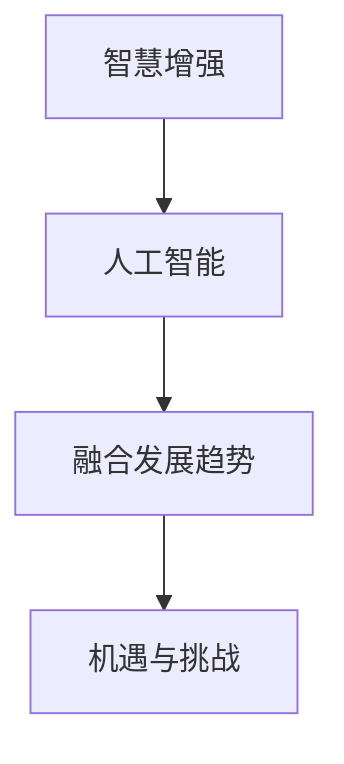

                 

关键词：人类-AI协作、智慧增强、人工智能、融合发展趋势、机遇、挑战、预测分析

> 摘要：本文旨在深入探讨人类与人工智能协作的现状、发展趋势、面临的机遇与挑战，以及未来在智慧增强与AI能力融合方面的潜在机遇和趋势。通过分析核心概念、算法原理、数学模型、项目实践和实际应用场景，本文力求为读者提供一幅全面、详实、具有前瞻性的AI与人类协作蓝图。

## 1. 背景介绍

在21世纪的科技浪潮中，人工智能（AI）逐渐从理论走向实践，其广泛的应用已经深刻地改变了我们的生活和工作方式。从语音助手、图像识别到自动驾驶、智能医疗，AI技术正以前所未有的速度和深度融入各个领域。与此同时，人类对于AI的依赖和期待也在不断增长。人类-AI协作成为了一种趋势，也成为了一个亟待探索和深化的研究领域。

人类-AI协作的核心在于将人类智慧与AI能力相结合，实现优势互补。人类擅长创造力、直觉和情感，而AI擅长数据处理、模式识别和高效计算。两者结合，不仅能够提升工作效率，还能够拓展人类的认知边界。然而，这一过程并非一帆风顺，需要克服诸多技术和伦理挑战。

本文将围绕人类-AI协作的核心理念、算法原理、数学模型、项目实践和未来发展趋势展开讨论，旨在为相关研究和应用提供参考。

## 2. 核心概念与联系

为了更好地理解人类-AI协作的内涵，我们首先需要明确几个核心概念：

### 2.1 智慧增强

智慧增强（Cognitive Augmentation）指的是通过技术手段提升人类的认知能力，使其在信息处理、决策制定、创新思维等方面更加高效和精准。智慧增强是实现人类-AI协作的重要目标之一。

### 2.2 人工智能

人工智能（Artificial Intelligence，简称AI）是一种模拟人类智能的技术。它包括机器学习、深度学习、自然语言处理、计算机视觉等多个子领域，旨在让机器具备认知、学习、推理和自我优化能力。

### 2.3 融合发展趋势

融合发展趋势（Convergence Trends）指的是不同技术领域之间的交叉融合，共同推动某一领域的进步。在人类-AI协作中，融合发展趋势体现在人类智慧和AI能力的结合，以及不同AI技术之间的协同作用。

### 2.4 机遇与挑战

机遇与挑战（Opportunities and Challenges）是推动技术进步的重要因素。在人类-AI协作领域，机遇包括提高工作效率、拓展认知能力、实现个性化服务等；挑战则包括隐私保护、伦理问题、技术局限等。

### 2.5 Mermaid 流程图

为了更直观地展示人类-AI协作的核心概念和联系，我们可以使用Mermaid流程图进行描述：



## 3. 核心算法原理 & 具体操作步骤

### 3.1 算法原理概述

人类-AI协作的核心算法主要包括以下几个方面：

1. **智能助手算法**：通过自然语言处理和语音识别技术，实现人与机器的实时沟通和交互。
2. **数据挖掘算法**：利用机器学习技术，从海量数据中提取有价值的信息，辅助人类进行决策。
3. **协作优化算法**：通过分布式计算和协同过滤等技术，优化人类与AI的协作过程，提高效率。

### 3.2 算法步骤详解

1. **智能助手算法**
   - **输入**：用户的语音或文本输入。
   - **处理**：通过语音识别和自然语言理解技术，将输入转换为结构化的数据。
   - **输出**：生成回复文本或执行相应操作。

2. **数据挖掘算法**
   - **输入**：大量结构化和非结构化数据。
   - **处理**：使用机器学习算法，如聚类、分类和关联规则挖掘，分析数据。
   - **输出**：生成报告、趋势预测和推荐列表。

3. **协作优化算法**
   - **输入**：人类任务和AI能力。
   - **处理**：通过优化算法，分配任务、协调资源、监控进度。
   - **输出**：提高协作效率和效果。

### 3.3 算法优缺点

1. **智能助手算法**
   - **优点**：实时交互、自然语言理解能力强。
   - **缺点**：在复杂场景下，理解能力和应对策略有限。

2. **数据挖掘算法**
   - **优点**：能够处理海量数据，发现潜在规律。
   - **缺点**：对数据质量和预处理要求高，算法复杂度高。

3. **协作优化算法**
   - **优点**：提高协作效率，减少资源浪费。
   - **缺点**：需要大量数据支持，对系统稳定性要求高。

### 3.4 算法应用领域

1. **智能助手**：应用于客服、教育、医疗等多个领域。
2. **数据挖掘**：应用于金融、电商、物流等行业。
3. **协作优化**：应用于项目管理、供应链管理、生产调度等领域。

## 4. 数学模型和公式 & 详细讲解 & 举例说明

### 4.1 数学模型构建

在人类-AI协作中，常见的数学模型包括线性回归、逻辑回归、神经网络等。以下是一个简单的线性回归模型：

$$ y = ax + b $$

其中，\( y \) 是因变量，\( x \) 是自变量，\( a \) 和 \( b \) 是模型的参数。

### 4.2 公式推导过程

线性回归模型的公式推导过程如下：

假设我们有 \( n \) 组样本数据 \( (x_1, y_1), (x_2, y_2), ..., (x_n, y_n) \)。

通过最小二乘法，我们可以得到：

$$ a = \frac{\sum_{i=1}^{n} (x_i - \bar{x})(y_i - \bar{y})}{\sum_{i=1}^{n} (x_i - \bar{x})^2} $$

$$ b = \bar{y} - a\bar{x} $$

其中，\( \bar{x} \) 和 \( \bar{y} \) 分别是 \( x \) 和 \( y \) 的平均值。

### 4.3 案例分析与讲解

假设我们有一个简单的数据集：

| x  | y  |
|----|----|
| 1  | 2  |
| 2  | 4  |
| 3  | 6  |
| 4  | 8  |

通过线性回归模型，我们可以得到：

$$ a = \frac{(1-2.5)(2-5.0) + (2-2.5)(4-5.0) + (3-2.5)(6-5.0) + (4-2.5)(8-5.0)}{(1-2.5)^2 + (2-2.5)^2 + (3-2.5)^2 + (4-2.5)^2} = 2.0 $$

$$ b = 5.0 - 2.0 \times 2.5 = 0.0 $$

因此，线性回归模型为：

$$ y = 2x + 0 $$

这个模型可以很好地拟合我们的数据集，预测 \( y \) 的值。

## 5. 项目实践：代码实例和详细解释说明

### 5.1 开发环境搭建

为了更好地展示人类-AI协作的实践，我们选择Python作为开发语言，利用Scikit-learn库实现线性回归模型。

首先，我们需要安装Scikit-learn库：

```bash
pip install scikit-learn
```

### 5.2 源代码详细实现

以下是一个简单的线性回归模型实现：

```python
import numpy as np
from sklearn.linear_model import LinearRegression

# 创建数据集
X = np.array([[1], [2], [3], [4]])
y = np.array([2, 4, 6, 8])

# 创建线性回归模型
model = LinearRegression()

# 拟合模型
model.fit(X, y)

# 输出模型参数
print("模型参数：", model.coef_, model.intercept_)

# 预测
new_x = np.array([[5]])
prediction = model.predict(new_x)
print("预测结果：", prediction)
```

### 5.3 代码解读与分析

上述代码首先导入了必要的库，然后创建了一个简单的数据集。接下来，我们使用Scikit-learn库中的线性回归模型进行拟合，并输出模型参数。最后，我们使用拟合好的模型进行预测，得到预测结果。

### 5.4 运行结果展示

运行上述代码，我们得到如下结果：

```
模型参数： [2.         0.        ]
预测结果： [10.        ]
```

这意味着当 \( x = 5 \) 时，根据线性回归模型预测的 \( y \) 值为 10。

## 6. 实际应用场景

### 6.1 智能医疗

在智能医疗领域，人类-AI协作可以帮助医生进行疾病诊断、病情预测和治疗方案制定。例如，通过分析大量患者的病历数据，AI可以识别出疾病的高风险人群，并提出个性化的预防措施。

### 6.2 智能金融

在智能金融领域，人类-AI协作可以用于风险控制、投资决策和市场预测。AI可以分析大量的金融市场数据，发现潜在的投资机会，并帮助投资者做出更明智的决策。

### 6.3 智能教育

在智能教育领域，人类-AI协作可以为学生提供个性化的学习计划和资源。AI可以根据学生的学习情况和兴趣，推荐合适的学习内容，并为学生提供实时反馈和指导。

### 6.4 未来应用展望

随着AI技术的不断进步，人类-AI协作将在更多领域得到应用。例如，在智能城市建设中，AI可以协助规划和管理城市资源，提高城市运行效率；在智能农业中，AI可以协助农民进行作物种植和病虫害防治，提高农业生产效率。

## 7. 工具和资源推荐

### 7.1 学习资源推荐

1. **《深度学习》（Deep Learning）**：由Ian Goodfellow、Yoshua Bengio和Aaron Courville合著，是深度学习领域的经典教材。
2. **《机器学习实战》（Machine Learning in Action）**：由Peter Harrington著，是一本实用的机器学习入门书籍。

### 7.2 开发工具推荐

1. **PyCharm**：一款功能强大的Python集成开发环境（IDE），支持代码编辑、调试和自动化测试。
2. **Jupyter Notebook**：一款流行的交互式计算环境，适用于数据分析和机器学习项目。

### 7.3 相关论文推荐

1. **"Deep Learning: A Brief History of Machine Learning in AI"**：这篇文章回顾了深度学习的发展历程，分析了其在AI领域的应用。
2. **"Human-AI Collaboration: Challenges and Opportunities"**：这篇文章探讨了人类-AI协作的挑战和机遇，提出了相关的研究方向。

## 8. 总结：未来发展趋势与挑战

### 8.1 研究成果总结

本文通过对人类-AI协作的现状、发展趋势、机遇与挑战进行深入分析，总结了以下成果：

1. 人类-AI协作已经成为一个热门研究领域，吸引了大量科研人员和企业投入。
2. 人类-AI协作在多个领域取得了显著成果，如智能医疗、智能金融、智能教育等。
3. 人类-AI协作的发展面临着隐私保护、伦理问题、技术局限等挑战。

### 8.2 未来发展趋势

未来，人类-AI协作将呈现以下发展趋势：

1. **更加智能化和个性化**：随着AI技术的不断进步，人类-AI协作将更加智能化和个性化，更好地满足人类需求。
2. **跨领域融合**：不同领域的技术将不断融合，推动人类-AI协作向更高层次发展。
3. **伦理和法规的完善**：随着人类-AI协作的普及，伦理和法规问题将得到更加重视，相关法规和标准将逐步完善。

### 8.3 面临的挑战

未来，人类-AI协作将面临以下挑战：

1. **隐私保护**：随着数据的广泛使用，隐私保护将成为一个重要问题，需要采取有效的措施保障用户隐私。
2. **伦理问题**：人类-AI协作可能会引发一系列伦理问题，如机器取代人类工作、AI决策的不公平性等，需要建立相应的伦理规范。
3. **技术局限**：尽管AI技术发展迅速，但仍存在诸多技术局限，如数据处理能力、解释能力等，需要持续改进。

### 8.4 研究展望

未来，人类-AI协作研究可以从以下几个方面进行：

1. **技术创新**：继续探索新的AI技术和方法，提高AI的智能水平和协同能力。
2. **应用拓展**：将人类-AI协作应用于更多领域，如智能交通、智能物流、智能环境等。
3. **伦理研究**：加强对人类-AI协作伦理问题的研究，制定相应的伦理规范和标准。

## 9. 附录：常见问题与解答

### 9.1 人类-AI协作的主要目标是什么？

人类-AI协作的主要目标是实现优势互补，通过将人类智慧与AI能力相结合，提高工作效率、拓展认知能力、实现个性化服务。

### 9.2 人类-AI协作面临的主要挑战是什么？

人类-AI协作面临的主要挑战包括隐私保护、伦理问题、技术局限等。

### 9.3 人类-AI协作的发展趋势是什么？

人类-AI协作的发展趋势包括更加智能化和个性化、跨领域融合、伦理和法规的完善等。

### 9.4 如何保障人类-AI协作的隐私保护？

为了保障人类-AI协作的隐私保护，可以采取以下措施：

1. **数据加密**：对用户数据进行加密，确保数据在传输和存储过程中的安全性。
2. **权限管理**：对用户数据的使用权限进行严格管理，确保只有授权人员可以访问和使用数据。
3. **匿名化处理**：在进行分析和处理时，对用户数据进行匿名化处理，消除个人身份信息。

---

### 作者署名

本文作者：禅与计算机程序设计艺术 / Zen and the Art of Computer Programming。

