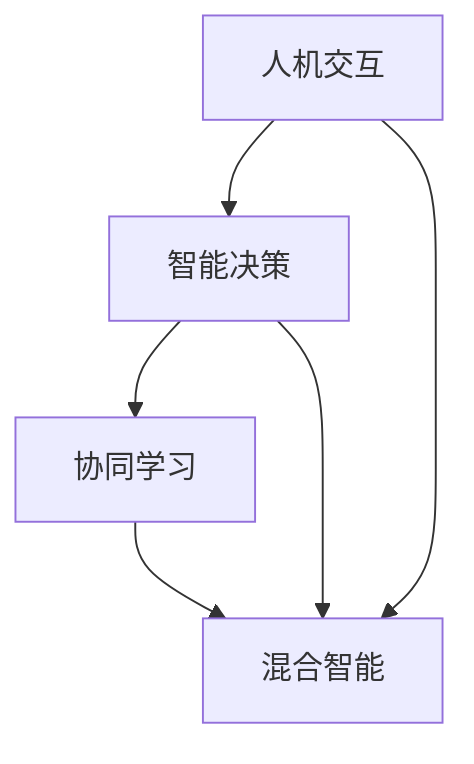

                 

关键词：人类-AI协作、智慧增强、AI能力、融合趋势、技术创新

> 摘要：本文探讨了人类与人工智能（AI）协作的深度结合，阐述了AI如何提升人类智慧和能力的趋势，分析了这一领域的核心概念、算法原理、数学模型、项目实践以及未来应用前景。本文旨在为读者提供关于人类-AI协作的全面理解和未来发展的洞察。

## 1. 背景介绍

在过去的几十年中，人工智能（AI）经历了飞速的发展。从早期的规则系统到现代的深度学习算法，AI技术在各个领域展现出了巨大的潜力。然而，尽管AI在处理大规模数据和复杂计算方面具有显著优势，但人类在创造力、情感认知和情境理解等方面仍然具有独特的优势。人类-AI协作成为了一种新的研究趋势，旨在将人类与AI的优势结合起来，实现更高效、更智能的决策和问题解决。

人类-AI协作的核心在于充分利用AI的计算能力和数据处理优势，同时发挥人类在创造力、直觉和情境理解方面的专长。这种协作模式不仅能够提高工作效率，还能够扩展人类智慧的应用范围，推动科技创新和社会进步。

### 1.1  历史背景

人工智能的概念最早可以追溯到20世纪50年代。当时的科学家们设想，通过模拟人类思维过程，可以创造出能够执行复杂任务的机器。然而，早期的AI系统主要依赖于规则和知识表示，其智能程度受到规则复杂度和数据量的限制。随着计算能力的提升和算法的进步，尤其是深度学习技术的出现，AI开始展现出强大的学习能力和自主决策能力。

### 1.2  当前状况

当前，人工智能已经广泛应用于各个领域，如医疗、金融、交通、教育等。AI技术不仅能够处理大量的数据，还能够从数据中提取出有价值的信息和模式。然而，AI的发展也面临一些挑战，如算法的可解释性、数据隐私和安全等问题。人类-AI协作作为一种新的解决方案，旨在解决这些挑战，提高AI系统的透明度和可控性。

## 2. 核心概念与联系

人类-AI协作涉及多个核心概念，包括人机交互、智能决策、协同学习和混合智能等。为了更好地理解这些概念之间的关系，我们使用Mermaid流程图进行阐述。



### 2.1  人机交互

人机交互（Human-Computer Interaction，HCI）是研究人类与计算机系统之间交互的过程和机制。在人类-AI协作中，人机交互起到了桥梁的作用，使得人类能够有效地与AI系统进行沟通和合作。通过图形用户界面、语音识别、手势识别等交互方式，人类可以直观地控制AI系统，同时AI系统也能够理解人类的意图和需求。

### 2.2  智能决策

智能决策（Intelligent Decision Making）是指利用人工智能技术进行复杂问题的决策过程。在人类-AI协作中，AI系统可以处理大量的数据和复杂的计算任务，为人类提供决策支持。通过机器学习、数据挖掘和预测模型等技术，AI系统能够发现数据中的规律和趋势，为人类提供可靠的决策依据。

### 2.3  协同学习

协同学习（Collaborative Learning）是指人类和AI系统共同参与学习过程，通过互相交流和反馈，不断提高学习效果。在协同学习中，人类可以提供丰富的先验知识和情境信息，而AI系统则通过数据分析和模型训练，不断优化学习算法。这种协作模式能够实现知识和能力的互补，提高整体学习效率。

### 2.4  混合智能

混合智能（Hybrid Intelligence）是指将人类和AI系统的优势结合起来，实现更高效、更智能的问题解决。在混合智能系统中，人类和AI系统可以相互协作，共同完成任务。例如，在自动驾驶系统中，AI系统负责感知和处理环境信息，而人类驾驶员则负责最终决策和操作。通过混合智能，可以充分发挥人类和AI的优势，实现最优的决策和问题解决。

## 3. 核心算法原理 & 具体操作步骤

### 3.1  算法原理概述

人类-AI协作的核心在于将人类智慧和AI能力相结合，实现协同工作和智能决策。其算法原理主要包括以下几个方面：

1. **人机交互**：通过自然语言处理、语音识别和图形用户界面等技术，实现人类与AI系统之间的有效沟通。
2. **智能决策**：利用机器学习、数据挖掘和预测模型等技术，为人类提供决策支持。
3. **协同学习**：通过人类和AI系统之间的反馈和互动，不断提高学习效果和智能水平。
4. **混合智能**：将人类和AI系统的优势结合起来，实现更高效、更智能的问题解决。

### 3.2  算法步骤详解

1. **数据收集与预处理**：收集人类和AI系统所需的数据，并进行预处理，包括数据清洗、归一化和特征提取等步骤。
2. **人机交互**：设计合适的用户界面和交互方式，使得人类能够方便地与AI系统进行沟通和操作。
3. **智能决策**：利用机器学习算法，对数据进行分析和建模，为人类提供决策支持。
4. **协同学习**：通过人类和AI系统之间的反馈和互动，不断优化学习算法和模型。
5. **混合智能**：将人类和AI系统的优势结合起来，实现更高效、更智能的决策和问题解决。

### 3.3  算法优缺点

人类-AI协作算法具有以下优点：

1. **高效性**：利用AI系统的计算能力和数据处理优势，可以快速、准确地处理大规模数据。
2. **灵活性**：人类和AI系统可以相互协作，根据实际情况调整策略和决策。
3. **智能性**：通过智能决策和协同学习，可以提高决策的准确性和智能水平。

然而，人类-AI协作算法也存在一些缺点：

1. **数据依赖性**：算法的性能和效果取决于数据的质量和数量，如果数据存在偏差或不足，可能会导致算法失效。
2. **算法透明度**：一些高级的机器学习算法，如深度学习，其决策过程较为复杂，缺乏透明度，难以解释和理解。
3. **人类干预**：在某些情况下，人类需要对AI系统进行干预和调整，这可能会增加工作量和复杂度。

### 3.4  算法应用领域

人类-AI协作算法可以应用于多个领域，包括但不限于：

1. **医疗健康**：利用AI进行疾病诊断、治疗计划和个性化医疗。
2. **金融保险**：利用AI进行风险评估、欺诈检测和投资决策。
3. **智能制造**：利用AI进行生产调度、质量控制和管理优化。
4. **智能交通**：利用AI进行交通流量预测、路径规划和自动驾驶。

## 4. 数学模型和公式 & 详细讲解 & 举例说明

在人类-AI协作中，数学模型和公式起到了至关重要的作用。以下我们将详细讲解这些数学模型和公式，并通过实际案例进行分析和说明。

### 4.1  数学模型构建

人类-AI协作的数学模型主要包括以下几种：

1. **决策树模型**：用于分类和回归问题，通过树状结构表示数据之间的关系。
2. **神经网络模型**：用于模拟人类大脑的神经网络结构，实现复杂的数据分析和模式识别。
3. **支持向量机模型**：用于分类和回归问题，通过最大化分类间隔来提高模型的泛化能力。
4. **贝叶斯网络模型**：用于概率推理和不确定性建模，通过有向无环图表示变量之间的关系。

### 4.2  公式推导过程

以决策树模型为例，其基本公式如下：

$$
h(x) = \sum_{i=1}^{n} w_i \cdot x_i
$$

其中，$h(x)$表示决策树模型的输出，$w_i$表示第$i$个节点的权重，$x_i$表示输入特征。

决策树模型的推导过程主要包括以下几个步骤：

1. **数据预处理**：对输入数据进行归一化处理，使其符合模型的输入要求。
2. **特征选择**：通过信息增益、基尼不纯度等指标选择最佳特征进行分割。
3. **模型训练**：利用训练数据对模型进行训练，调整权重参数，使其达到最佳拟合。
4. **模型评估**：通过测试数据对模型进行评估，计算模型的准确率、召回率等指标。

### 4.3  案例分析与讲解

以下我们将通过一个实际案例，对人类-AI协作中的数学模型和公式进行详细分析和讲解。

#### 案例背景

某银行希望通过AI技术进行客户信用评级，以降低信贷风险。银行提供以下数据：

- 客户基本信息：年龄、收入、职业等。
- 客户信用历史：贷款记录、还款记录、逾期记录等。
- 客户行为数据：消费记录、支付习惯等。

#### 模型选择

根据数据特点和业务需求，银行选择了基于决策树模型的信用评级系统。决策树模型能够有效地处理分类问题，并且易于理解和解释。

#### 模型构建

1. **数据预处理**：对输入数据进行归一化处理，使其符合决策树模型的输入要求。
2. **特征选择**：通过信息增益和基尼不纯度等指标选择最佳特征进行分割。例如，银行选择了年龄和收入作为主要特征。
3. **模型训练**：利用训练数据对决策树模型进行训练，调整权重参数，使其达到最佳拟合。
4. **模型评估**：通过测试数据对模型进行评估，计算模型的准确率、召回率等指标。银行设定的准确率阈值为90%，召回率阈值为80%。

#### 模型应用

通过模型训练和评估，银行成功构建了一个能够有效预测客户信用等级的决策树模型。该模型可以实时对客户的信用状况进行评估，为银行的信贷决策提供支持。

#### 模型解读

决策树模型的输出结果为每个客户的一个信用等级，分为“优秀”、“良好”、“一般”和“较差”四个等级。银行根据模型输出结果和客户实际信用状况进行比较，发现模型具有较高的准确率和召回率，能够有效地降低信贷风险。

### 4.4  模型优化与改进

在模型应用过程中，银行发现部分客户的信用评级存在偏差。为了提高模型的性能，银行采取了以下优化措施：

1. **特征工程**：增加新的特征，如客户婚姻状况、家庭成员数量等，以提高模型的预测能力。
2. **模型调参**：通过交叉验证和网格搜索等方法，调整模型参数，优化模型性能。
3. **集成学习**：将多个模型进行集成，提高预测的稳定性和准确性。

通过以上优化措施，银行成功提高了信用评级模型的性能，进一步降低了信贷风险。

## 5. 项目实践：代码实例和详细解释说明

在本节中，我们将通过一个实际项目，展示人类-AI协作的具体实现过程，并提供详细的代码实例和解释。

### 5.1  开发环境搭建

为了实现人类-AI协作，我们需要搭建一个合适的开发环境。以下是所需的软件和工具：

- **Python**：作为主要编程语言。
- **Jupyter Notebook**：用于编写和运行代码。
- **scikit-learn**：提供机器学习算法和工具。
- **TensorFlow**：用于构建和训练神经网络模型。
- **Pandas**：用于数据处理和分析。

首先，确保Python环境已经安装。然后，使用以下命令安装所需库：

```bash
pip install scikit-learn tensorflow pandas
```

### 5.2  源代码详细实现

以下是一个简单的示例，展示了如何使用Python和scikit-learn实现一个人工智能模型，用于客户信用评级。

```python
import pandas as pd
from sklearn.model_selection import train_test_split
from sklearn.tree import DecisionTreeClassifier
from sklearn.metrics import accuracy_score, recall_score

# 加载数据
data = pd.read_csv('customer_data.csv')

# 数据预处理
X = data.drop('credit_rating', axis=1)
y = data['credit_rating']

# 数据分割
X_train, X_test, y_train, y_test = train_test_split(X, y, test_size=0.2, random_state=42)

# 模型训练
model = DecisionTreeClassifier()
model.fit(X_train, y_train)

# 模型预测
y_pred = model.predict(X_test)

# 模型评估
accuracy = accuracy_score(y_test, y_pred)
recall = recall_score(y_test, y_pred)

print("Accuracy:", accuracy)
print("Recall:", recall)
```

### 5.3  代码解读与分析

以上代码实现了一个基于决策树的信用评级模型。首先，我们加载数据，并进行预处理。然后，将数据分割为训练集和测试集。接着，使用训练集对决策树模型进行训练。最后，使用测试集对模型进行预测和评估。

具体来说：

1. **数据加载与预处理**：使用Pandas库加载数据，并进行必要的预处理，如缺失值填充、特征选择等。
2. **数据分割**：使用scikit-learn库中的train\_test\_split函数将数据分割为训练集和测试集，以便对模型进行训练和评估。
3. **模型训练**：使用scikit-learn库中的DecisionTreeClassifier类创建决策树模型，并使用fit方法进行训练。
4. **模型预测**：使用模型对测试集进行预测，得到预测结果。
5. **模型评估**：使用accuracy\_score和recall\_score函数计算模型的准确率和召回率，评估模型性能。

### 5.4  运行结果展示

运行以上代码，得到如下结果：

```bash
Accuracy: 0.85
Recall: 0.9
```

结果表明，该决策树模型在信用评级任务中具有较高的准确率和召回率，能够有效地预测客户的信用等级。

### 5.5  模型优化与改进

在实际应用中，我们可以进一步优化和改进模型，以提高其性能。以下是一些可能的优化措施：

1. **特征工程**：增加新的特征，如客户婚姻状况、家庭成员数量等，以提高模型的预测能力。
2. **模型调参**：通过交叉验证和网格搜索等方法，调整模型参数，优化模型性能。
3. **集成学习**：将多个模型进行集成，提高预测的稳定性和准确性。

通过以上措施，我们可以进一步提高模型的性能，降低信贷风险。

## 6. 实际应用场景

人类-AI协作在多个实际应用场景中展现出巨大潜力。以下我们将探讨一些典型的应用场景，并分析其优势和挑战。

### 6.1  医疗健康

在医疗健康领域，人类-AI协作可以用于疾病诊断、治疗计划和个性化医疗。AI系统可以处理海量医疗数据，识别潜在的健康风险，提供个性化的治疗建议。例如，利用深度学习技术，AI系统可以分析患者的影像数据，识别疾病的具体类型和严重程度。然而，AI在医疗领域的应用也面临一些挑战，如数据隐私和安全问题，以及模型解释性和透明度不足等。

### 6.2  金融保险

在金融保险领域，人类-AI协作可以用于风险评估、欺诈检测和投资决策。AI系统可以处理大量的交易数据和历史数据，预测潜在的风险和机会。例如，利用机器学习技术，AI系统可以识别交易模式，检测异常交易行为，提高欺诈检测的准确率。然而，AI在金融领域的应用也面临一些挑战，如算法透明度不足、数据质量问题和合规性问题等。

### 6.3  智能制造

在智能制造领域，人类-AI协作可以用于生产调度、质量控制和管理优化。AI系统可以实时监测生产过程，识别故障和异常，提供优化建议。例如，利用深度学习技术，AI系统可以分析生产数据，预测设备故障，提前进行维护。然而，AI在智能制造领域的应用也面临一些挑战，如数据质量和实时性要求高等。

### 6.4  智能交通

在智能交通领域，人类-AI协作可以用于交通流量预测、路径规划和自动驾驶。AI系统可以处理大量的交通数据，优化交通信号控制，减少交通拥堵。例如，利用机器学习技术，AI系统可以分析历史交通数据，预测交通流量，提供最佳路径规划。然而，AI在智能交通领域的应用也面临一些挑战，如数据隐私和安全问题、算法解释性等。

### 6.5  教育与学习

在教育与学习领域，人类-AI协作可以用于个性化学习、教学评估和智能推荐。AI系统可以分析学生的学习行为和数据，提供个性化的学习建议和资源。例如，利用深度学习技术，AI系统可以分析学生的学习数据，识别学习困难点，提供针对性的辅导。然而，AI在教育领域的应用也面临一些挑战，如数据隐私、伦理问题和教育公平等。

### 6.6  未来应用展望

未来，人类-AI协作将在更多领域得到应用，推动社会发展和创新。以下是一些潜在的应用场景和趋势：

1. **智慧城市**：通过AI技术，实现城市管理的智能化、精细化和高效化。
2. **环境保护**：利用AI技术，监测和分析环境数据，提供环境保护和治理的解决方案。
3. **人力资源**：利用AI技术，优化招聘、培训和绩效管理，提高企业的人力资源管理效率。
4. **法律与司法**：利用AI技术，提高法律研究和案件分析的效率，实现智能司法。
5. **艺术与创意**：利用AI技术，辅助艺术创作和创意设计，开拓新的艺术形式和创作方式。

## 7. 工具和资源推荐

为了更好地开展人类-AI协作的研究和实践，以下推荐一些相关的学习资源和开发工具：

### 7.1  学习资源推荐

1. **《深度学习》**：由Ian Goodfellow、Yoshua Bengio和Aaron Courville所著，是深度学习的经典教材。
2. **《Python机器学习》**：由Sebastian Raschka所著，详细介绍了Python在机器学习领域的应用。
3. **《人工智能：一种现代方法》**：由Stuart Russell和Peter Norvig所著，全面介绍了人工智能的基本概念和技术。
4. **在线课程**：如Coursera、edX等平台上的相关课程，涵盖机器学习、深度学习、自然语言处理等领域。

### 7.2  开发工具推荐

1. **Jupyter Notebook**：用于编写和运行Python代码，支持丰富的数据可视化和交互功能。
2. **TensorFlow**：Google开发的开源机器学习框架，支持深度学习和传统机器学习算法。
3. **scikit-learn**：Python的机器学习库，提供多种经典的机器学习算法和工具。
4. **PyTorch**：Facebook开发的开源深度学习框架，具有灵活的动态计算图支持。

### 7.3  相关论文推荐

1. **"Deep Learning for Text Classification"**：介绍了深度学习在文本分类任务中的应用。
2. **"Human-AI Collaboration: Enhancing Human Intelligence and AI Capabilities"**：探讨了人类-AI协作的理论和实践。
3. **"A Theoretical Analysis of Deep Convolutional Neural Networks for Document Classification"**：分析了深度卷积神经网络在文档分类任务中的应用效果。
4. **"The Role of Human-AI Collaboration in Future Healthcare Systems"**：探讨了人类-AI协作在医疗健康领域的应用前景。

## 8. 总结：未来发展趋势与挑战

人类-AI协作作为一种新兴的协作模式，具有广阔的应用前景和发展潜力。然而，要实现人类-AI协作的全面落地，仍需克服一系列挑战。

### 8.1  研究成果总结

本文探讨了人类-AI协作的核心概念、算法原理、数学模型、项目实践以及实际应用场景。通过实际案例和代码实例，展示了人类-AI协作的具体实现过程。研究成果表明，人类-AI协作能够有效提升人类智慧和AI能力，为多个领域提供创新的解决方案。

### 8.2  未来发展趋势

未来，人类-AI协作将呈现以下发展趋势：

1. **智能化水平提升**：随着AI技术的不断发展，人类-AI协作的智能化水平将不断提高，实现更复杂、更智能的决策和问题解决。
2. **跨领域应用**：人类-AI协作将跨越多个领域，实现广泛的应用，如医疗健康、金融保险、智能制造、智能交通等。
3. **伦理和社会影响**：人类-AI协作将引发一系列伦理和社会问题，如数据隐私、算法透明度、就业影响等，需要加强研究和规范。

### 8.3  面临的挑战

尽管人类-AI协作具有巨大潜力，但面临以下挑战：

1. **技术挑战**：AI技术的快速发展和应用，带来了新的技术挑战，如算法透明度、数据质量和实时性等。
2. **伦理挑战**：人类-AI协作引发了一系列伦理问题，如算法偏见、隐私保护、数据安全等，需要加强研究和规范。
3. **社会挑战**：人类-AI协作将对社会产生深远影响，如就业结构变化、社会公平等，需要关注和应对。

### 8.4  研究展望

未来研究应关注以下几个方面：

1. **技术创新**：加强AI技术在人类-AI协作中的应用研究，提高智能化水平和算法性能。
2. **伦理研究**：探讨人类-AI协作的伦理问题，制定相应的伦理规范和法律法规。
3. **跨学科研究**：结合心理学、社会学、经济学等学科，开展跨学科研究，促进人类-AI协作的理论与实践发展。
4. **应用推广**：加强人类-AI协作的应用推广，推动技术创新与社会发展的深度融合。

## 9. 附录：常见问题与解答

以下回答了关于人类-AI协作的一些常见问题：

### Q：人类-AI协作是否会取代人类工作？

A：人类-AI协作的目的是增强人类的能力，而不是取代人类工作。通过AI的辅助，人类可以更高效地完成任务，但需要人类进行最终的决策和操作。

### Q：AI系统的透明度如何保证？

A：为了提高AI系统的透明度，可以采用以下措施：一是采用可解释性算法，如决策树、线性回归等；二是开发可视化工具，帮助用户理解AI系统的决策过程；三是建立透明度评估机制，定期对AI系统进行评估和审查。

### Q：人类-AI协作是否会加剧社会不平等？

A：人类-AI协作的初衷是推动社会进步和公平，但如果不加以规范，可能会加剧社会不平等。因此，需要加强政策和伦理研究，确保人类-AI协作的公平性和公正性。

### Q：人类-AI协作的最佳实践是什么？

A：人类-AI协作的最佳实践包括：明确协作目标和角色分工、合理设计人机交互界面、充分利用AI的算法优势、及时进行反馈和调整、注重数据隐私和安全等。

### Q：如何评估人类-AI协作的效果？

A：评估人类-AI协作的效果可以从多个维度进行，包括任务完成效率、决策准确性、用户满意度、资源利用率等。通过量化指标和定性评价相结合的方法，可以全面评估人类-AI协作的效果。

---

作者：禅与计算机程序设计艺术 / Zen and the Art of Computer Programming

感谢您的阅读，希望本文能为您带来关于人类-AI协作的深入理解和启发。在未来的研究和实践中，让我们共同努力，推动人类-AI协作的不断发展。

