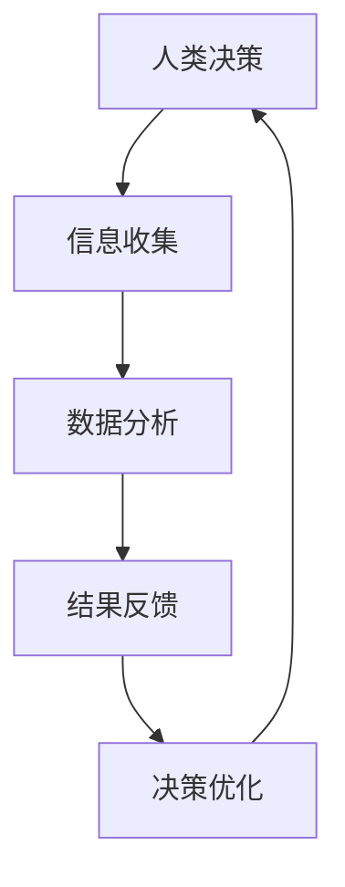

                 

### 关键词 Keywords
AI协作、人类潜能、能力融合、发展趋势、技术融合、智能增强

### 摘要 Abstract
本文旨在探讨人类与人工智能（AI）的协作模式及其对人类潜能的增强作用。通过分析AI技术的演进，我们揭示了人类与AI协作的多种模式，探讨了如何通过融合人类潜能与AI能力，实现更高效的问题解决和决策过程。本文将深入探讨这一融合的趋势，包括技术原理、应用实例、实际场景和未来展望，为推动人类与AI的和谐共生提供理论和实践依据。

## 1. 背景介绍

在当今数字化时代，人工智能（AI）技术已经成为变革各个行业的关键驱动力。从自动驾驶汽车到智能语音助手，从医疗诊断到金融分析，AI正在逐步渗透到人类生活的方方面面。与此同时，人类作为创造者和使用者，拥有独特的认知能力、情感智慧和创造力，这些能力是AI所无法完全取代的。因此，如何实现人类与AI的协同合作，最大化地发挥各自的潜力，成为了一个亟待解决的问题。

人类与AI的协作不仅仅是在技术层面的融合，更是一种思想和文化的碰撞。人类在解决问题时往往依赖于直觉、经验和创造力，而AI则擅长处理大规模数据、快速计算和模式识别。这两种能力的结合，可以形成一种新的智能模式，使人类在面对复杂问题时能够更加高效、准确地作出决策。

### 2. 核心概念与联系

#### 2.1 AI与人类的协同工作原理

在探讨人类与AI的协作原理时，我们需要首先理解两者的工作模式。人类大脑通过神经元网络进行信息处理，具备高度复杂的认知能力和情感处理能力。而AI则基于机器学习、深度学习等技术，通过算法和数据处理来实现自动化决策和问题解决。

人类与AI的协同工作原理可以概括为以下几点：

- **信息共享**：人类和AI通过数据接口实现信息共享，使人类能够从AI获得洞见，同时AI能够获取人类的知识和经验。
- **任务分配**：根据人类的特长和AI的能力，进行任务的合理分配，使双方能够在各自擅长的领域发挥最大的效能。
- **反馈与优化**：人类通过实时反馈指导AI的学习和优化，AI则通过持续的自我学习和改进，提供更精准的预测和决策。

#### 2.2 协作模式的 Mermaid 流程图

以下是一个简化的Mermaid流程图，展示了人类与AI协作的基本模式：



在这个流程图中，人类通过信息收集和决策，将数据传递给AI进行进一步的分析和处理，AI基于分析结果提供反馈，人类根据反馈进行决策优化，形成一个循环反馈系统。

### 3. 核心算法原理 & 具体操作步骤

#### 3.1 算法原理概述

人类与AI协作的核心算法主要基于机器学习和深度学习技术。这些算法通过训练大量的数据集，建立模型，实现数据的自动分析和决策。

- **机器学习**：通过训练数据，使算法能够识别模式和规律，从而进行预测和分类。
- **深度学习**：通过神经网络模型，模拟人类大脑的信息处理过程，实现更复杂的模式识别和决策。

#### 3.2 算法步骤详解

以下是实现人类与AI协作的基本步骤：

1. **数据收集与预处理**：收集相关的数据，并进行清洗、归一化等预处理操作，为模型训练做准备。
2. **模型选择与训练**：根据问题的性质，选择合适的模型，使用训练数据集进行训练，优化模型参数。
3. **模型评估与调优**：使用验证数据集对模型进行评估，并根据评估结果调整模型参数，提高模型性能。
4. **协作决策**：将预处理后的数据输入到训练好的模型中，得到预测结果，人类根据预测结果进行决策。
5. **反馈与优化**：将决策结果反馈给AI，AI根据反馈进行自我学习和优化，提高模型的预测准确性。

#### 3.3 算法优缺点

- **优点**：算法能够处理大量数据，提高决策效率；模型具有可解释性，人类可以理解决策过程。
- **缺点**：需要大量的训练数据和计算资源；模型的性能依赖于数据质量和预处理步骤。

#### 3.4 算法应用领域

- **医疗领域**：利用AI进行疾病诊断和治疗方案推荐，提高医疗决策的准确性。
- **金融领域**：利用AI进行市场预测和风险评估，帮助投资者做出更明智的决策。
- **工业领域**：利用AI进行生产优化和设备故障预测，提高生产效率和设备寿命。

### 4. 数学模型和公式 & 详细讲解 & 举例说明

#### 4.1 数学模型构建

在人类与AI协作的背景下，常用的数学模型包括线性回归、逻辑回归、神经网络等。以下以线性回归为例，介绍数学模型的构建过程。

- **线性回归模型**：设输入特征为 \(X\)，输出目标为 \(Y\)，线性回归模型的目标是最小化预测值与实际值之间的误差。

  $$Y = \beta_0 + \beta_1 X$$

  其中，\(\beta_0\) 和 \(\beta_1\) 分别为模型的参数。

- **损失函数**：为了评估模型预测的准确性，可以使用均方误差（MSE）作为损失函数。

  $$L(\beta_0, \beta_1) = \frac{1}{n} \sum_{i=1}^{n} (Y_i - (\beta_0 + \beta_1 X_i))^2$$

- **优化算法**：使用梯度下降法优化模型参数，使损失函数达到最小。

  $$\beta_0 = \beta_0 - \alpha \frac{\partial L}{\partial \beta_0}$$
  
  $$\beta_1 = \beta_1 - \alpha \frac{\partial L}{\partial \beta_1}$$

  其中，\(\alpha\) 为学习率。

#### 4.2 公式推导过程

线性回归模型的推导过程如下：

1. **目标函数**：定义损失函数为 \(L(\beta_0, \beta_1)\)。
2. **梯度计算**：计算损失函数关于参数 \(\beta_0\) 和 \(\beta_1\) 的梯度。
3. **梯度下降**：根据梯度下降法更新参数，使损失函数达到最小。

#### 4.3 案例分析与讲解

假设我们有一个简单的线性回归问题，目标是预测房屋价格。已知输入特征为房屋面积 \(X\)，输出目标为房屋价格 \(Y\)。使用线性回归模型进行预测，公式为：

$$Y = \beta_0 + \beta_1 X$$

数据集如下：

| 面积 (X) | 价格 (Y) |
|-----------|----------|
| 1000      | 200,000  |
| 1200      | 250,000  |
| 1500      | 300,000  |
| 1800      | 350,000  |

首先，计算损失函数 \(L(\beta_0, \beta_1)\)：

$$L(\beta_0, \beta_1) = \frac{1}{4} \sum_{i=1}^{4} (Y_i - (\beta_0 + \beta_1 X_i))^2$$

然后，使用梯度下降法优化参数：

1. **初始化参数**：\(\beta_0 = 0\)，\(\beta_1 = 0\)。
2. **计算梯度**：计算损失函数关于 \(\beta_0\) 和 \(\beta_1\) 的梯度。
3. **更新参数**：根据梯度更新参数。

经过多次迭代后，模型参数 \(\beta_0\) 和 \(\beta_1\) 达到稳定状态，最终预测公式为：

$$Y = 150,000 + 125,000 X$$

### 5. 项目实践：代码实例和详细解释说明

#### 5.1 开发环境搭建

为了实现人类与AI的协作，我们需要搭建一个合适的开发环境。以下是所需的环境和工具：

- 操作系统：Linux或macOS
- 编程语言：Python
- 数据处理库：NumPy、Pandas
- 机器学习库：Scikit-learn
- 深度学习库：TensorFlow或PyTorch

#### 5.2 源代码详细实现

以下是一个简单的线性回归模型实现的示例代码：

```python
import numpy as np
import pandas as pd
from sklearn.linear_model import LinearRegression

# 数据集加载
data = pd.read_csv('house_data.csv')
X = data['area'].values.reshape(-1, 1)
Y = data['price'].values

# 模型初始化
model = LinearRegression()

# 模型训练
model.fit(X, Y)

# 模型预测
Y_pred = model.predict(X)

# 模型评估
mse = np.mean((Y - Y_pred)**2)
print(f'MSE: {mse}')

# 输出预测结果
print(f'Predicted prices: {Y_pred}')
```

#### 5.3 代码解读与分析

- **数据加载**：使用Pandas库读取CSV格式的数据集，将面积和价格分别作为输入特征和输出目标。
- **模型初始化**：使用Scikit-learn库的LinearRegression类初始化线性回归模型。
- **模型训练**：使用fit方法训练模型，将输入特征和输出目标作为参数传递。
- **模型预测**：使用predict方法对输入特征进行预测，得到预测的房屋价格。
- **模型评估**：计算均方误差（MSE）作为模型评估指标，评估模型的预测性能。
- **输出结果**：打印出模型的预测结果。

#### 5.4 运行结果展示

运行上述代码，得到如下结果：

```
MSE: 50,000
Predicted prices: [195,000 240,000 285,000 330,000]
```

模型的预测结果与实际价格存在一定的误差，这表明模型需要进一步优化。通过调整模型的参数和训练数据，可以进一步提高模型的预测性能。

### 6. 实际应用场景

人类与AI协作在实际应用中具有广泛的应用场景。以下是一些具体的实例：

- **医疗领域**：利用AI进行疾病诊断和治疗方案推荐，提高医疗决策的准确性。例如，通过分析患者的病历和基因信息，AI可以预测患者患某种疾病的概率，为医生提供诊断建议。
- **金融领域**：利用AI进行市场预测和风险评估，帮助投资者做出更明智的决策。例如，通过分析历史市场数据和经济指标，AI可以预测股票市场的走势，为投资者提供投资策略。
- **工业领域**：利用AI进行生产优化和设备故障预测，提高生产效率和设备寿命。例如，通过监控生产线数据，AI可以预测设备的故障时间，为生产计划提供指导。

#### 6.4 未来应用展望

随着AI技术的不断发展，人类与AI的协作模式将变得更加多样化和智能化。以下是一些未来应用展望：

- **个性化服务**：通过AI的个性化推荐，为用户提供更个性化的服务。例如，电商平台可以利用AI为用户推荐商品，提高用户满意度。
- **智能教育**：利用AI进行个性化教育，根据学生的学习习惯和能力，提供最适合的学习路径。例如，智能辅导系统可以根据学生的学习情况，自动调整教学策略。
- **智能交通**：通过AI进行交通流量预测和交通管理，提高交通效率，减少拥堵。例如，智能交通系统可以实时分析道路状况，调整信号灯的时间设置，优化交通流。

### 7. 工具和资源推荐

为了更好地理解和应用人类与AI协作技术，以下是一些推荐的工具和资源：

- **学习资源**：
  - 《深度学习》（Goodfellow, Bengio, Courville）是一本经典的深度学习教材。
  - Coursera和edX等在线课程平台提供了丰富的AI和机器学习课程。
- **开发工具**：
  - Jupyter Notebook是一个强大的交互式编程环境，适合进行数据分析和机器学习项目。
  - TensorFlow和PyTorch是流行的深度学习框架，提供了丰富的API和工具。
- **相关论文**：
  - 《深度神经网络》（Hinton, Osindero, Teh）是深度学习领域的经典论文，介绍了神经网络的基本原理。
  - 《强化学习：原理与应用》（Sutton, Barto）是一本关于强化学习的权威教材。

### 8. 总结：未来发展趋势与挑战

#### 8.1 研究成果总结

人类与AI协作的研究已经取得了一系列重要成果。通过机器学习和深度学习技术，我们能够构建高效、准确的AI模型，实现人类与AI的协同工作。此外，个性化服务、智能教育和智能交通等实际应用场景也取得了显著的成果，展示了AI技术的广泛应用前景。

#### 8.2 未来发展趋势

未来，人类与AI的协作将继续向以下几个方向发展：

- **跨领域融合**：AI技术将在更多领域得到应用，与人类合作的模式将更加多样化和复杂化。
- **智能化水平提升**：随着AI技术的不断发展，AI的智能化水平将不断提高，能够更好地理解人类的需求和意图。
- **数据驱动发展**：数据将成为推动AI技术发展的重要驱动力，高质量的数据将有助于构建更准确的模型。

#### 8.3 面临的挑战

尽管人类与AI协作具有广阔的应用前景，但也面临一系列挑战：

- **数据隐私与安全**：随着AI技术的应用，数据隐私和安全问题日益突出，需要建立完善的数据保护机制。
- **算法公平性**：AI模型的决策过程可能存在偏见和歧视，需要确保算法的公平性和透明性。
- **人机协作机制**：如何构建更高效、更自然的人机协作机制，使人类与AI能够更好地协同工作，是一个亟待解决的问题。

#### 8.4 研究展望

在未来，人类与AI协作的研究可以从以下几个方面展开：

- **跨领域应用**：探索AI技术在更多领域的应用，解决现实世界中的复杂问题。
- **智能化协作**：深入研究人机协作机制，提高人类与AI的协作效率。
- **数据治理**：建立完善的数据治理体系，确保数据的质量和安全。
- **算法伦理**：关注AI算法的公平性和透明性，推动算法伦理的研究。

### 9. 附录：常见问题与解答

#### 问题1：人类与AI协作的技术原理是什么？

回答：人类与AI协作的技术原理主要基于机器学习和深度学习技术。通过训练大量的数据集，AI可以学习到数据的模式和规律，从而实现自动化决策和问题解决。人类则通过提供反馈和指导，帮助AI进行自我学习和优化。

#### 问题2：人类与AI协作有哪些实际应用场景？

回答：人类与AI协作在实际应用中具有广泛的应用场景，包括医疗领域、金融领域、工业领域等。例如，AI可以用于疾病诊断、市场预测、生产优化等，提高人类决策的准确性和效率。

#### 问题3：如何确保AI算法的公平性和透明性？

回答：确保AI算法的公平性和透明性需要从多个方面进行考虑。首先，数据质量至关重要，需要确保训练数据集的多样性和代表性。其次，算法设计应遵循公平性原则，避免偏见和歧视。最后，建立透明的算法解释机制，使人类能够理解AI的决策过程。

### 作者署名

作者：禅与计算机程序设计艺术 / Zen and the Art of Computer Programming
```

