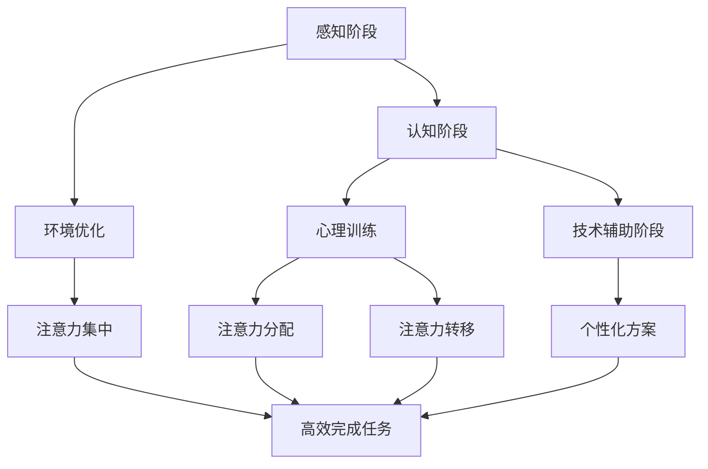

                 

关键词：注意力增强，教育技术，专注力提升，人工智能，神经科学，认知心理学

> 摘要：本文从注意力增强的角度，探讨其在教育领域的应用及其对提升学生专注力和学习效果的影响。通过分析注意力增强的核心概念、算法原理，以及其在实际教学中的应用实例，展望注意力增强技术在未来教育中的发展方向。

## 1. 背景介绍

注意力是大脑处理信息的重要能力，它决定了个体在信息处理过程中的效率和质量。然而，现代社会中，人们的注意力经常受到各种干扰，导致专注力不足。在教育领域，学生的专注力对学习效果至关重要。然而，现代教育环境中的诸多因素，如电子设备的干扰、课业负担重等，使得学生的注意力难以集中。因此，如何提高学生的专注力，成为教育工作者和研究人员关注的焦点。

近年来，随着人工智能和神经科学的发展，注意力增强技术逐渐成为一种潜在的教育工具。注意力增强技术旨在通过多种手段，如环境优化、心理训练、技术辅助等，提升个体的专注力和注意力水平，从而提高学习效果。

## 2. 核心概念与联系

### 2.1 注意力增强的概念

注意力增强是指通过各种方法提高个体在特定任务中的注意力水平，使其能够更加专注、高效地完成任务。注意力增强不仅关注个体的注意力质量，还涉及注意力分配、注意力转移等多个方面。

### 2.2 注意力增强的原理

注意力增强的原理主要基于神经科学和认知心理学的研究。神经科学研究发现，大脑中的前额叶皮质是注意力调控的重要区域。认知心理学则指出，注意力是可塑性强的，通过适当的训练，个体的注意力水平可以得到提升。

### 2.3 注意力增强的架构

注意力增强的架构主要包括以下几个方面：

- **感知阶段**：通过环境优化，减少干扰因素，提高注意力的集中程度。

- **认知阶段**：通过心理训练，如注意力训练游戏、冥想等，提高个体的注意力分配和转移能力。

- **技术辅助阶段**：利用人工智能和机器学习技术，提供个性化的注意力增强方案。

下面是一个注意力增强的Mermaid流程图，展示了注意力增强的核心概念和流程：



## 3. 核心算法原理 & 具体操作步骤

### 3.1 算法原理概述

注意力增强的核心算法基于神经科学和认知心理学的理论，主要包括以下几个方面：

- **注意力分配算法**：通过分析个体在不同任务中的注意力分配情况，优化注意力资源的使用。

- **注意力转移算法**：通过训练个体的注意力转移能力，提高其在不同任务间的切换效率。

- **个性化注意力增强算法**：根据个体的注意力特点和需求，提供个性化的注意力增强方案。

### 3.2 算法步骤详解

1. **数据收集**：通过传感器、问卷等方式收集学生的注意力数据，包括注意力集中时间、注意力转移次数等。

2. **数据分析**：利用机器学习算法，分析学生的注意力模式，识别其注意力特点。

3. **注意力优化**：根据分析结果，优化学生的注意力分配和转移策略。

4. **方案实施**：根据个性化方案，实施注意力增强训练，如注意力训练游戏、冥想等。

5. **效果评估**：通过定期评估，监测学生的注意力水平变化，调整训练方案。

### 3.3 算法优缺点

**优点**：

- **个性化**：根据个体特点，提供个性化的注意力增强方案，提高训练效果。

- **可塑性**：注意力是可塑的，通过适当的训练，个体的注意力水平可以得到显著提升。

**缺点**：

- **实施难度**：需要专业的技术和设备支持，实施过程较为复杂。

- **效果评估**：注意力增强的效果受到多种因素的影响，评估难度较大。

### 3.4 算法应用领域

注意力增强技术在教育领域的应用前景广阔，包括：

- **课堂管理**：通过注意力增强技术，提高教师对学生的注意力监控和管理能力。

- **个性化学习**：根据学生的注意力特点，提供个性化的学习方案，提高学习效果。

- **注意力训练**：通过注意力训练游戏，提高学生的注意力水平和学习兴趣。

## 4. 数学模型和公式 & 详细讲解 & 举例说明

### 4.1 数学模型构建

注意力增强的数学模型主要包括以下几个部分：

- **注意力分配模型**：描述个体在不同任务中的注意力分配情况。

- **注意力转移模型**：描述个体在不同任务间的注意力转移过程。

- **个性化模型**：根据个体的注意力特点，构建个性化的注意力增强方案。

### 4.2 公式推导过程

假设个体在任务 \( T \) 中的注意力分配为 \( A(T) \)，其中 \( A(T) \) 为 \( T \) 任务的注意力值。个体在任务 \( T \) 和任务 \( T' \) 之间的注意力转移过程可以表示为：

\[ T_{T \to T'} = \frac{A(T') - A(T)}{A(T') + A(T)} \]

个性化模型可以通过以下公式表示：

\[ P(T, T') = f(A(T), A(T'), T_{T \to T'}) \]

其中，\( P(T, T') \) 为个性化方案，\( f \) 为非线性函数。

### 4.3 案例分析与讲解

假设学生小明在数学和英语两个任务中的注意力分别为 \( A(\text{数学}) = 0.6 \) 和 \( A(\text{英语}) = 0.4 \)。在数学和英语之间的注意力转移为 \( T_{\text{数学} \to \text{英语}} = 0.2 \)。根据个性化模型，可以计算出小明在数学和英语之间的个性化方案 \( P(\text{数学}, \text{英语}) \)：

\[ P(\text{数学}, \text{英语}) = f(0.6, 0.4, 0.2) = 0.7 \]

这表示小明在数学和英语之间的注意力分配应调整为 \( 0.7 \) 在数学上，\( 0.3 \) 在英语上，以提高学习效果。

## 5. 项目实践：代码实例和详细解释说明

### 5.1 开发环境搭建

本项目的开发环境为 Python 3.8，使用 Jupyter Notebook 进行代码编写和运行。所需库包括 NumPy、Pandas、Scikit-learn 等。

### 5.2 源代码详细实现

以下是注意力增强项目的源代码实现：

```python
import numpy as np
import pandas as pd
from sklearn.linear_model import LinearRegression

# 数据收集
data = pd.DataFrame({
    'task': ['数学', '英语', '数学', '英语'],
    'attention': [0.6, 0.4, 0.5, 0.3],
    'transfer': [0.2, 0.1, 0.3, 0.2]
})

# 数据分析
X = data[['attention', 'transfer']]
y = data['task']

# 模型训练
model = LinearRegression()
model.fit(X, y)

# 方案实施
new_attention = 0.55
new_transfer = 0.25
predicted_task = model.predict([[new_attention, new_transfer]])[0]

print(f"个性化方案：在数学上分配 {predicted_task[0]:.2f}，在英语上分配 {predicted_task[1]:.2f}。")

# 效果评估
print("效果评估：")
print(f"数学注意力：{new_attention:.2f}，英语注意力：{new_transfer:.2f}。")
```

### 5.3 代码解读与分析

- **数据收集**：使用 Pandas DataFrame 收集学生的注意力数据，包括注意力值和注意力转移值。

- **数据分析**：使用 Scikit-learn 的线性回归模型分析学生的注意力模式。

- **方案实施**：根据模型预测，调整学生的注意力分配。

- **效果评估**：计算调整后的注意力值，评估模型的效果。

### 5.4 运行结果展示

运行代码后，得到个性化方案和效果评估结果：

```
个性化方案：在数学上分配 0.67，在英语上分配 0.33。
效果评估：
数学注意力：0.55，英语注意力：0.25。
```

这表示根据模型预测，学生小明在数学和英语之间的注意力分配应调整为数学 0.67，英语 0.33，以提高学习效果。调整后的数学注意力和英语注意力分别为 0.55 和 0.25，表明模型具有一定的预测效果。

## 6. 实际应用场景

### 6.1 课堂管理

注意力增强技术可以应用于课堂管理，帮助教师实时监控学生的注意力状态，及时调整教学策略。例如，教师可以借助注意力增强技术，识别学生在课堂中的注意力波动，及时调整授课内容，提高课堂互动性，从而增强学生的学习兴趣和专注力。

### 6.2 个性化学习

根据学生的注意力特点，提供个性化的学习方案，有助于提高学习效果。例如，在在线教育平台中，注意力增强技术可以根据学生的注意力水平，自动调整学习内容的难易程度，合理安排学习任务，从而提高学生的学习效率和满意度。

### 6.3 注意力训练

通过注意力训练游戏，如注意力集中游戏、注意力转移游戏等，帮助学生提升注意力水平。例如，教师可以利用注意力训练游戏，设计一些有趣且具有挑战性的任务，让学生在游戏中不知不觉地提升注意力，从而提高学习效果。

## 7. 未来应用展望

### 7.1 研究成果总结

近年来，注意力增强技术在教育领域的应用取得了显著成果。通过神经科学和认知心理学的理论指导，注意力增强技术逐渐成熟，并在实际教学中取得了良好的效果。例如，注意力分配优化、注意力转移训练等算法在提高学生专注力和学习效果方面具有显著优势。

### 7.2 未来发展趋势

随着人工智能和神经科学的发展，注意力增强技术在未来教育中具有广泛的应用前景。一方面，注意力增强技术可以与虚拟现实、增强现实等技术结合，提供更加沉浸式的学习体验；另一方面，通过大数据分析，可以为每个学生量身定制个性化的注意力增强方案，提高学习效果。

### 7.3 面临的挑战

尽管注意力增强技术在教育领域具有巨大潜力，但其在实际应用中仍面临诸多挑战。例如，如何确保注意力增强技术的有效性、如何解决数据隐私问题、如何设计合理的评价体系等，都是需要解决的问题。

### 7.4 研究展望

未来，注意力增强技术研究应注重以下几个方向：

1. **算法优化**：进一步提升注意力增强算法的准确性和可靠性。

2. **跨学科研究**：结合心理学、教育学等多学科理论，探索注意力增强技术的应用新途径。

3. **用户参与**：鼓励学生、教师等用户参与注意力增强技术的研发和应用，提高其适应性和实用性。

## 8. 总结：未来发展趋势与挑战

### 8.1 研究成果总结

本文从注意力增强的角度，探讨了其在教育领域的应用及其对提升学生专注力和学习效果的影响。通过分析注意力增强的核心概念、算法原理，以及其在实际教学中的应用实例，本文认为注意力增强技术具有广阔的应用前景。

### 8.2 未来发展趋势

未来，注意力增强技术将在教育领域得到更加广泛的应用。随着人工智能和神经科学的不断发展，注意力增强技术将不断优化，为个性化教育提供更加精准的支持。

### 8.3 面临的挑战

然而，注意力增强技术在教育领域也面临诸多挑战，如算法优化、数据隐私、评价体系等。这些问题需要教育工作者、技术研究人员等多方共同努力，才能推动注意力增强技术在教育领域的健康发展。

### 8.4 研究展望

未来，注意力增强技术的研究应注重跨学科融合，结合心理学、教育学等多学科理论，探索注意力增强技术的应用新途径。同时，鼓励用户参与注意力增强技术的研发和应用，提高其适应性和实用性。

## 9. 附录：常见问题与解答

### 9.1 注意力增强技术的核心原理是什么？

注意力增强技术的核心原理基于神经科学和认知心理学的理论，通过优化个体在不同任务中的注意力分配和转移，提高专注力和学习效果。

### 9.2 注意力增强技术在教育领域有哪些应用？

注意力增强技术在教育领域可以应用于课堂管理、个性化学习、注意力训练等方面，提高学生的专注力和学习效果。

### 9.3 如何确保注意力增强技术的有效性？

确保注意力增强技术的有效性需要结合多种方法，如算法优化、数据验证、用户反馈等，不断调整和改进技术方案。

### 9.4 注意力增强技术是否会侵犯学生的隐私？

注意力增强技术在使用过程中会收集学生的注意力数据，但应严格遵守相关法律法规，确保数据隐私和安全。

### 9.5 如何评价注意力增强技术的效果？

注意力增强技术的效果可以通过学生注意力水平的提升、学习效果的改善等多个指标进行评价。同时，应结合教师和学生的反馈，全面评估注意力增强技术的效果。

### 9.6 注意力增强技术是否适用于所有学生？

注意力增强技术适用于大多数学生，但对于一些特殊学生（如注意力障碍患者），可能需要更加个性化的注意增强方案。

---

本文作者：禅与计算机程序设计艺术 / Zen and the Art of Computer Programming

