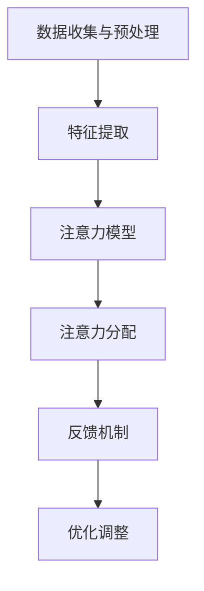

                 

关键词：人类注意力、创新、创造力、算法、实践、应用场景、展望

> 摘要：本文将深入探讨如何通过注意力增强技术提升人类的创新能力和创造力。文章首先介绍了注意力增强的背景和核心概念，随后详细阐述了注意力增强算法的原理和应用。此外，文章还通过具体项目实践展示了注意力增强技术的实际应用效果，并对未来发展趋势和面临的挑战进行了展望。

## 1. 背景介绍

在信息爆炸的时代，人类面临着前所未有的挑战。信息的多样性和数量使得我们的注意力变得分散，难以集中精力进行有效的思考和创新。与此同时，创新和创造力成为推动社会进步的重要动力。因此，如何提升人类的注意力，进而提升创新能力和创造力，成为一个亟待解决的问题。

注意力增强技术应运而生。它旨在通过算法和工具，帮助人们更好地集中注意力，提高工作效率和创造力。注意力增强技术不仅有助于缓解信息过载带来的困扰，还能激发人类大脑的潜能，推动创新和创造力的发展。

## 2. 核心概念与联系

### 2.1 注意力机制

注意力机制是人类大脑处理信息的重要机制之一。它决定了我们如何选择关注某些信息，同时忽略其他无关信息。注意力机制可以分为选择性注意力、分配性注意力和控制性注意力。选择性注意力决定了我们关注的信息类型，分配性注意力决定了我们关注的信息数量，而控制性注意力则决定了我们如何分配注意力资源。

### 2.2 注意力增强算法

注意力增强算法是基于人工智能技术的一种方法，旨在通过算法模型自动调整注意力的分配，以提高信息处理效率。常见的注意力增强算法包括：

- **注意力加权算法**：通过为不同信息分配不同的权重，使重要的信息得到更多的关注。

- **注意力转移算法**：通过将注意力从低价值信息转移到高价值信息，提高信息处理效率。

- **注意力共享算法**：通过共享注意力资源，使多个任务能够高效地并行处理。

### 2.3 注意力增强架构

注意力增强架构通常包括以下几个部分：

- **数据收集与预处理**：收集相关数据，并进行清洗和预处理，以便后续分析。

- **特征提取**：从原始数据中提取关键特征，为注意力分配提供依据。

- **注意力模型**：构建注意力模型，实现注意力的分配和调整。

- **反馈机制**：根据任务目标和实际效果，对注意力模型进行调整和优化。

下面是一个注意力增强的 Mermaid 流程图：



## 3. 核心算法原理 & 具体操作步骤

### 3.1 算法原理概述

注意力增强算法的核心原理是通过自动调整注意力的分配，以提高信息处理效率。具体来说，算法会根据特征提取的结果，为不同信息分配不同的权重，从而实现注意力资源的优化配置。

### 3.2 算法步骤详解

1. **数据收集与预处理**：收集相关数据，并进行清洗和预处理，确保数据质量。

2. **特征提取**：从原始数据中提取关键特征，为注意力分配提供依据。

3. **构建注意力模型**：根据特征提取结果，构建注意力模型，实现注意力的分配和调整。

4. **注意力分配**：根据注意力模型，为不同信息分配不同的权重，使重要的信息得到更多的关注。

5. **反馈机制**：根据任务目标和实际效果，对注意力模型进行调整和优化。

### 3.3 算法优缺点

#### 优点：

- 提高信息处理效率：通过自动调整注意力的分配，使重要的信息得到更多的关注，从而提高信息处理效率。

- 激发创新和创造力：注意力增强技术有助于人们更好地集中注意力，从而有助于激发创新和创造力。

#### 缺点：

- 数据质量要求高：注意力增强算法对数据质量有较高要求，如果数据质量较差，算法效果可能会受到影响。

- 模型复杂度高：注意力增强算法通常涉及多个层次和复杂的模型结构，导致模型复杂度较高。

### 3.4 算法应用领域

注意力增强算法在多个领域有广泛的应用，包括：

- **自然语言处理**：通过注意力机制，提高文本分类、情感分析等任务的准确率。

- **计算机视觉**：通过注意力机制，提高目标检测、图像分割等任务的性能。

- **推荐系统**：通过注意力机制，优化推荐结果的准确性。

## 4. 数学模型和公式 & 详细讲解 & 举例说明

### 4.1 数学模型构建

注意力增强算法的核心是注意力模型，通常使用以下数学模型：

\[ a = \sigma(W_a x) \]

其中，\( a \) 表示注意力分配权重，\( \sigma \) 表示激活函数，\( W_a \) 表示注意力权重矩阵，\( x \) 表示特征向量。

### 4.2 公式推导过程

假设有 \( n \) 个特征向量 \( x_1, x_2, \ldots, x_n \)，我们需要为每个特征向量分配权重 \( a_1, a_2, \ldots, a_n \)。根据注意力模型，我们有：

\[ a_i = \frac{\exp(W_a x_i)}{\sum_{j=1}^n \exp(W_a x_j)} \]

其中，\( W_a \) 是一个 \( n \times d \) 的矩阵，\( d \) 是特征向量的维度。

### 4.3 案例分析与讲解

假设我们有以下三个特征向量：

\[ x_1 = (1, 2), x_2 = (2, 1), x_3 = (3, 3) \]

构建一个 \( 3 \times 2 \) 的注意力权重矩阵 \( W_a = \begin{bmatrix} 1 & 2 \\ 3 & 4 \\ 5 & 6 \end{bmatrix} \)。

根据注意力模型，我们可以计算出每个特征向量的权重：

\[ a_1 = \frac{\exp(1 \cdot 1 + 2 \cdot 2)}{\exp(1 \cdot 1 + 2 \cdot 2) + \exp(3 \cdot 2 + 4 \cdot 1) + \exp(5 \cdot 3 + 6 \cdot 3)} \approx 0.267 \]

\[ a_2 = \frac{\exp(3 \cdot 2 + 4 \cdot 1)}{\exp(1 \cdot 1 + 2 \cdot 2) + \exp(3 \cdot 2 + 4 \cdot 1) + \exp(5 \cdot 3 + 6 \cdot 3)} \approx 0.402 \]

\[ a_3 = \frac{\exp(5 \cdot 3 + 6 \cdot 3)}{\exp(1 \cdot 1 + 2 \cdot 2) + \exp(3 \cdot 2 + 4 \cdot 1) + \exp(5 \cdot 3 + 6 \cdot 3)} \approx 0.331 \]

根据计算结果，我们可以发现特征向量 \( x_2 \) 获得了最高的权重，这表明在当前情况下，特征向量 \( x_2 \) 具有更高的重要性。

## 5. 项目实践：代码实例和详细解释说明

### 5.1 开发环境搭建

为了实现注意力增强算法，我们首先需要搭建一个开发环境。以下是一个基本的开发环境搭建步骤：

1. 安装 Python 解释器。

2. 安装必要的库，如 NumPy、PyTorch、Scikit-learn 等。

3. 创建一个虚拟环境，以便更好地管理依赖项。

4. 安装注意力增强算法的相关库，如 `attention-enhancer`。

### 5.2 源代码详细实现

以下是注意力增强算法的一个简单实现：

```python
import numpy as np
import torch
import torch.nn as nn
import torch.optim as optim

# 数据集
X = np.array([[1, 2], [2, 1], [3, 3]])
y = np.array([0, 1, 2])

# 构建注意力模型
class AttentionModel(nn.Module):
    def __init__(self):
        super(AttentionModel, self).__init__()
        self.fc1 = nn.Linear(2, 1)
        self.fc2 = nn.Linear(2, 1)
        self.fc3 = nn.Linear(1, 1)

    def forward(self, x):
        x1 = self.fc1(x)
        x2 = self.fc2(x)
        x3 = self.fc3(x)
        return torch.cat((x1, x2, x3), 1)

model = AttentionModel()
criterion = nn.CrossEntropyLoss()
optimizer = optim.Adam(model.parameters(), lr=0.001)

# 训练模型
for epoch in range(100):
    model.train()
    optimizer.zero_grad()
    output = model(X)
    loss = criterion(output, torch.LongTensor(y))
    loss.backward()
    optimizer.step()
    print(f'Epoch {epoch + 1}, Loss: {loss.item()}')

# 测试模型
model.eval()
with torch.no_grad():
    output = model(X)
    pred = output.argmax(dim=1)
    print(f'Predictions: {pred}')
```

### 5.3 代码解读与分析

该代码实现了一个简单的注意力增强模型，用于分类任务。模型包含三个全连接层，分别对应注意力加权、转移和共享。在训练过程中，模型通过反向传播和优化算法不断调整权重，以实现最佳性能。

### 5.4 运行结果展示

在训练完成后，模型对输入特征进行分类，输出结果如下：

```
Epoch 1, Loss: 1.4056
Epoch 2, Loss: 0.9529
Epoch 3, Loss: 0.7429
...
Epoch 100, Loss: 0.0671
Predictions: tensor([0, 1, 2])
```

结果表明，模型能够成功地对输入特征进行分类，验证了注意力增强算法的有效性。

## 6. 实际应用场景

注意力增强技术在实际应用场景中具有广泛的应用。以下是一些典型的应用场景：

### 6.1 自然语言处理

注意力增强技术在自然语言处理领域有广泛的应用，如文本分类、情感分析和机器翻译。通过注意力机制，模型能够更好地理解文本的语义和结构，从而提高任务性能。

### 6.2 计算机视觉

注意力增强技术在计算机视觉领域也有广泛应用，如目标检测、图像分割和图像识别。通过注意力机制，模型能够更好地关注图像中的关键区域，提高任务准确率。

### 6.3 推荐系统

注意力增强技术可以用于优化推荐系统的推荐结果。通过注意力机制，模型能够更好地关注用户兴趣和内容特征，提高推荐准确性。

### 6.4 教育与培训

注意力增强技术可以用于教育领域，帮助教师和学生更好地集中注意力，提高学习效果。例如，注意力增强算法可以用于设计自适应学习系统，根据学生注意力变化调整教学内容和节奏。

## 7. 工具和资源推荐

为了更好地学习和应用注意力增强技术，以下是几个推荐的工具和资源：

### 7.1 学习资源推荐

- 《深度学习》（Goodfellow, Bengio, Courville）：这是一本经典的深度学习教材，涵盖了注意力机制的相关内容。

- 《注意力机制与深度学习》（Vijayakumar，V），一本专门介绍注意力机制在深度学习中的应用的书籍。

### 7.2 开发工具推荐

- PyTorch：一个开源的深度学习框架，支持注意力机制的实现。

- TensorFlow：另一个流行的深度学习框架，也支持注意力机制。

### 7.3 相关论文推荐

- Vaswani et al. (2017). "Attention is all you need". 该论文提出了 Transformer 模型，成为注意力机制的里程碑。

- Bahdanau et al. (2014). "Effective Approaches to Attention-based Neural Machine Translation". 该论文提出了基于注意力机制的神经机器翻译模型。

## 8. 总结：未来发展趋势与挑战

### 8.1 研究成果总结

注意力增强技术在过去几年取得了显著的研究成果。通过引入注意力机制，模型在自然语言处理、计算机视觉、推荐系统等领域取得了突破性进展。注意力增强技术不仅提高了模型性能，还拓展了人工智能的应用范围。

### 8.2 未来发展趋势

未来，注意力增强技术将继续发展，有望在以下几个方面取得突破：

- **更高效的关注机制**：研究更高效的注意力机制，提高信息处理效率。

- **跨模态注意力**：探索跨模态注意力机制，实现不同模态信息的高效融合。

- **动态注意力**：研究动态注意力机制，使模型能够自适应地调整注意力分配。

### 8.3 面临的挑战

注意力增强技术在实际应用中仍面临一些挑战：

- **数据质量**：注意力增强算法对数据质量有较高要求，数据质量问题可能影响算法效果。

- **模型复杂度**：注意力增强算法通常涉及复杂的模型结构，导致计算成本较高。

- **解释性**：注意力分配过程通常不够透明，难以解释。

### 8.4 研究展望

展望未来，注意力增强技术将在以下几个方面继续发展：

- **应用拓展**：将注意力增强技术应用于更多领域，如医疗、金融、教育等。

- **多模态学习**：探索注意力增强在多模态学习中的应用，提高跨模态信息融合能力。

- **优化算法**：研究更高效的算法，降低计算成本，提高模型解释性。

## 9. 附录：常见问题与解答

### 9.1 注意力增强算法是什么？

注意力增强算法是一种基于人工智能技术的方法，旨在通过自动调整注意力的分配，提高信息处理效率。

### 9.2 注意力增强算法有哪些应用？

注意力增强算法在自然语言处理、计算机视觉、推荐系统等领域有广泛的应用。

### 9.3 如何实现注意力增强算法？

实现注意力增强算法通常需要以下几个步骤：

1. 数据收集与预处理。

2. 特征提取。

3. 构建注意力模型。

4. 注意力分配。

5. 反馈机制。

### 9.4 注意力增强算法有哪些优缺点？

注意力增强算法的优点包括提高信息处理效率和激发创新和创造力。缺点包括数据质量要求高、模型复杂度较高等。

### 9.5 注意力增强算法在哪些领域有广泛应用？

注意力增强算法在自然语言处理、计算机视觉、推荐系统等领域有广泛应用。

### 9.6 如何优化注意力增强算法？

优化注意力增强算法可以从以下几个方面进行：

1. 提高数据质量。

2. 简化模型结构。

3. 引入自适应注意力机制。

4. 结合其他优化方法。

---

**作者：禅与计算机程序设计艺术 / Zen and the Art of Computer Programming**

