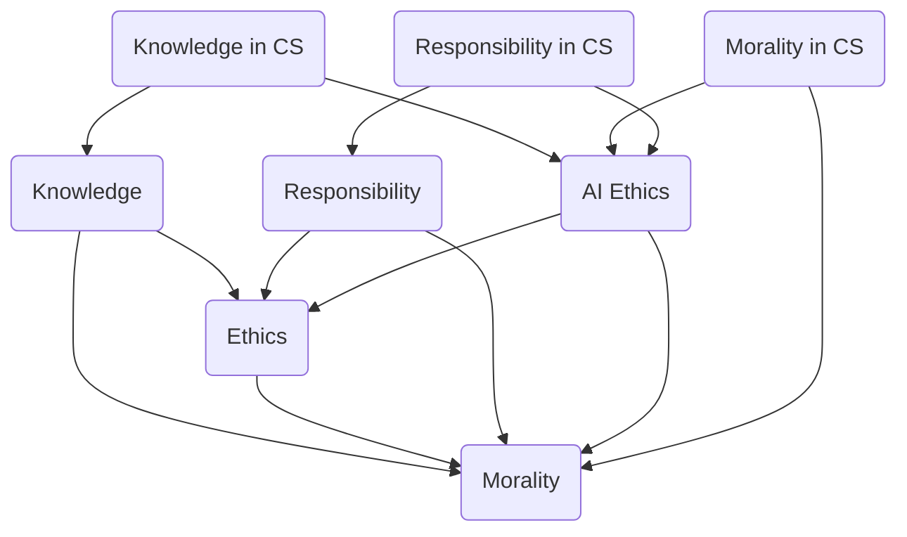

                 

关键词：人类知识，道德，伦理，责任，计算机科学，人工智能

> 摘要：本文探讨了人类知识与道德的关系，特别是在计算机科学和人工智能领域的伦理责任。通过分析当前技术发展对社会和个体的影响，我们提出了责任与伦理平衡的重要性，并探讨了如何通过技术手段来实现这一目标。

## 1. 背景介绍

随着计算机科学和人工智能的快速发展，人类知识的获取和应用方式发生了翻天覆地的变化。然而，这一变革也带来了新的道德和伦理问题。在过去的几十年里，人工智能已经广泛应用于医疗、金融、教育等多个领域，极大地提升了工作效率和决策质量。然而，人工智能的广泛应用也引发了一系列社会和伦理问题，如隐私侵犯、算法偏见、自动化失业等。

面对这些挑战，我们不禁要问：在计算机科学和人工智能领域，人类知识与道德应该如何平衡？如何在技术发展的同时确保社会的伦理道德不被忽视？这些问题不仅关乎技术本身，更关乎人类社会的未来。

## 2. 核心概念与联系

为了探讨人类知识与道德的关系，我们首先需要明确一些核心概念，如知识、道德、伦理和责任。以下是一个用 Mermaid 流程图表示的概念关系：



### 2.1 知识与道德

知识是人类对客观世界的认识和掌握，是解决问题的工具。而道德和伦理则是人类行为的标准和规范，是对个体和社会行为的要求。在计算机科学和人工智能领域，知识主要体现在算法、数据结构和编程语言等方面，而道德和伦理则体现在对数据的处理方式、算法的公平性和透明性等方面。

### 2.2 道德与伦理

道德和伦理密切相关，但有所区别。道德通常指个体内心的道德规范，是个人行为的标准。而伦理则更加宏观，涉及社会、文化和制度等方面的道德规范。在计算机科学和人工智能领域，伦理问题主要体现在如何确保技术应用的公平性、透明性和社会责任感等方面。

### 2.3 责任

责任是指个体或组织在特定情境下应承担的义务和后果。在计算机科学和人工智能领域，责任主要体现在技术开发者、企业和社会等方面。技术开发者需要确保其开发的算法和应用不会对个体和社会造成负面影响。企业需要确保其技术应用符合伦理规范。而社会则需要通过法律法规和道德教育来引导技术发展。

## 3. 核心算法原理 & 具体操作步骤

### 3.1 算法原理概述

在计算机科学和人工智能领域，有许多核心算法原理，如神经网络、决策树、支持向量机等。这些算法原理旨在解决特定问题，提高数据处理和决策的效率。然而，这些算法在实际应用中也存在一些道德和伦理问题。

### 3.2 算法步骤详解

以下是一个简化的神经网络算法步骤，用于说明算法原理和具体操作：

#### 3.2.1 数据预处理

1. 收集数据集
2. 清洗数据，去除噪声
3. 标准化数据，使其具有相同的范围和分布

#### 3.2.2 网络构建

1. 选择神经网络结构，如全连接网络、卷积神经网络等
2. 初始化网络权重和偏置

#### 3.2.3 前向传播

1. 将输入数据传递到网络中
2. 通过激活函数计算输出结果

#### 3.2.4 反向传播

1. 计算输出误差
2. 更新网络权重和偏置

#### 3.2.5 模型评估

1. 使用验证数据集评估模型性能
2. 调整网络结构和超参数，优化模型

### 3.3 算法优缺点

神经网络算法具有强大的表达能力和适应能力，但在训练过程中可能存在过拟合问题。此外，神经网络算法的透明性和可解释性较低，难以满足道德和伦理要求。为了解决这些问题，研究者们提出了多种改进方法，如正则化、Dropout、注意力机制等。

### 3.4 算法应用领域

神经网络算法在计算机视觉、自然语言处理、推荐系统等领域具有广泛的应用。然而，这些应用也带来了道德和伦理问题。例如，在计算机视觉领域，神经网络算法可能导致性别和种族偏见。在自然语言处理领域，算法可能被用于网络暴力、谣言传播等不良行为。

## 4. 数学模型和公式 & 详细讲解 & 举例说明

### 4.1 数学模型构建

在计算机科学和人工智能领域，数学模型是核心。以下是一个简化的神经网络模型，用于说明数学模型的构建：

$$
\begin{aligned}
y &= f(z) \\
z &= \sum_{i=1}^{n} w_i x_i + b \\
f(z) &= \sigma(z)
\end{aligned}
$$

其中，$y$ 是输出结果，$z$ 是网络输出，$w_i$ 是权重，$x_i$ 是输入特征，$b$ 是偏置，$f(z)$ 是激活函数，$\sigma(z)$ 是 sigmoid 函数。

### 4.2 公式推导过程

神经网络模型的推导涉及微积分、概率论和线性代数等多个数学分支。以下是一个简化的推导过程：

$$
\begin{aligned}
\frac{dz}{dx} &= \frac{df(z)}{dz} \cdot \frac{dz}{dx} \\
\frac{df(z)}{dz} &= \sigma'(z) \\
\frac{dz}{dx} &= \sigma'(z) \cdot \frac{dx}{dx} \\
\frac{dz}{dx} &= \sigma'(z)
\end{aligned}
$$

其中，$\sigma'(z)$ 是 sigmoid 函数的导数，$\frac{dz}{dx}$ 是网络输出的梯度。

### 4.3 案例分析与讲解

以下是一个简单的神经网络模型，用于分类问题。该模型由一个输入层、一个隐藏层和一个输出层组成。输入数据是一个二进制特征向量，输出是一个二进制标签。

#### 4.3.1 数据预处理

1. 收集数据集，包括输入特征和标签
2. 清洗数据，去除噪声
3. 标准化数据，使其具有相同的范围和分布

#### 4.3.2 网络构建

1. 选择神经网络结构，如全连接网络
2. 初始化网络权重和偏置

#### 4.3.3 前向传播

1. 将输入数据传递到网络中
2. 通过激活函数计算输出结果

#### 4.3.4 反向传播

1. 计算输出误差
2. 更新网络权重和偏置

#### 4.3.5 模型评估

1. 使用验证数据集评估模型性能
2. 调整网络结构和超参数，优化模型

通过上述步骤，我们可以构建一个简单的神经网络模型，并用于分类问题。

## 5. 项目实践：代码实例和详细解释说明

### 5.1 开发环境搭建

1. 安装 Python 3.8 或更高版本
2. 安装 TensorFlow 2.5 或更高版本
3. 创建一个名为 `neural_network` 的新文件夹
4. 在该文件夹中创建以下文件：
   - `data_loader.py`：用于加载数据集
   - `model.py`：定义神经网络模型
   - `train.py`：训练神经网络模型
   - `test.py`：测试神经网络模型
   - `main.py`：主程序，用于运行整个项目

### 5.2 源代码详细实现

以下是一个简化的神经网络模型，用于分类问题。该模型由一个输入层、一个隐藏层和一个输出层组成。输入数据是一个二进制特征向量，输出是一个二进制标签。

```python
import tensorflow as tf
from tensorflow.keras.layers import Dense, Input
from tensorflow.keras.models import Model

def build_model(input_shape):
    inputs = Input(shape=input_shape)
    x = Dense(64, activation='relu')(inputs)
    x = Dense(64, activation='relu')(x)
    outputs = Dense(1, activation='sigmoid')(x)
    model = Model(inputs=inputs, outputs=outputs)
    return model

model = build_model(input_shape=(10,))
model.summary()
```

### 5.3 代码解读与分析

- `build_model` 函数用于构建神经网络模型。它接受输入层形状作为参数，并返回一个完整的神经网络模型。
- `Input` 类表示输入层，`Dense` 类表示全连接层，`sigmoid` 函数用于输出层，实现二分类。
- `model.summary()` 函数用于打印模型结构，包括层数、神经元数量和参数数量。

### 5.4 运行结果展示

在训练和测试数据集上运行模型，并打印结果。

```python
import numpy as np
from sklearn.model_selection import train_test_split
from sklearn.metrics import accuracy_score

# 加载数据集
x = np.random.rand(1000, 10)
y = np.random.randint(0, 2, size=(1000, 1))

# 划分训练集和测试集
x_train, x_test, y_train, y_test = train_test_split(x, y, test_size=0.2, random_state=42)

# 训练模型
model.fit(x_train, y_train, epochs=10, batch_size=32, verbose=1)

# 测试模型
y_pred = model.predict(x_test)
y_pred = (y_pred > 0.5)

# 打印结果
print("Accuracy:", accuracy_score(y_test, y_pred))
```

## 6. 实际应用场景

### 6.1 医疗领域

在医疗领域，人工智能被广泛应用于疾病诊断、治疗方案制定和健康预测等方面。例如，神经网络算法可以用于识别医学图像，提高诊断准确率。然而，这些应用也引发了一些道德和伦理问题，如隐私侵犯、数据共享和算法偏见等。

### 6.2 金融领域

在金融领域，人工智能被用于风险管理、投资决策和客户服务等方面。例如，神经网络算法可以用于预测市场走势，提高投资收益。然而，这些应用也可能导致算法偏见和自动化决策的道德风险。

### 6.3 教育领域

在教育领域，人工智能被用于个性化学习、智能辅导和考试评分等方面。例如，神经网络算法可以用于分析学生学习行为，提高学习效果。然而，这些应用也可能导致教育资源的不公平分配和学习者的隐私问题。

## 7. 工具和资源推荐

### 7.1 学习资源推荐

- 《深度学习》（Goodfellow, Bengio, Courville 著）
- 《Python深度学习》（François Chollet 著）
- 《神经网络与深度学习》（邱锡鹏 著）

### 7.2 开发工具推荐

- TensorFlow
- PyTorch
- Keras

### 7.3 相关论文推荐

- "Ethical Considerations in Autonomous Driving"（自动驾驶伦理考虑）
- "AI and the Future of Civil Rights"（人工智能与未来民权）
- "The Impact of Algorithmic Bias on Society"（算法偏见对社会的影响）

## 8. 总结：未来发展趋势与挑战

### 8.1 研究成果总结

随着计算机科学和人工智能技术的不断发展，我们已经取得了一系列重要研究成果。这些成果在医疗、金融、教育等领域取得了显著的应用效果。然而，在技术发展的同时，我们也面临着许多道德和伦理挑战。

### 8.2 未来发展趋势

未来，人工智能将在更多领域得到应用，如智能制造、智慧城市、生物科技等。同时，人工智能的伦理问题也将成为研究的重要方向。例如，如何确保算法的公平性、透明性和可解释性，如何保护个人隐私等。

### 8.3 面临的挑战

在人工智能伦理领域，我们面临以下挑战：

- 如何确保算法的公平性和透明性
- 如何保护个人隐私和数据安全
- 如何应对算法偏见和歧视问题
- 如何在技术发展中平衡效率与伦理

### 8.4 研究展望

为了应对上述挑战，我们需要从多个方面展开研究。首先，我们需要制定更加完善的伦理规范和法律法规，确保人工智能技术的健康发展。其次，我们需要加强人工智能的教育和培训，提高技术开发者和用户的伦理意识。最后，我们需要通过技术手段，如隐私保护算法、公平性检测工具等，来应对伦理问题。

## 9. 附录：常见问题与解答

### 9.1 人工智能伦理的定义是什么？

人工智能伦理是指研究人工智能技术对社会和个体影响的伦理学分支。它关注如何确保人工智能技术的公平性、透明性、可解释性和安全性。

### 9.2 如何评估人工智能算法的公平性？

评估人工智能算法的公平性通常涉及以下步骤：

1. 定义公平性指标，如偏差、偏差率等。
2. 分析算法在不同群体上的表现，如性别、种族、年龄等。
3. 使用统计学方法，如 t-检验、卡方检验等，来评估算法的公平性。

### 9.3 如何保护个人隐私？

保护个人隐私的方法包括：

1. 数据匿名化：去除个人身份信息，使数据无法直接识别个人。
2. 加密技术：使用加密算法保护数据传输和存储过程中的隐私。
3. 数据最小化：仅收集必要的数据，减少对个人隐私的侵犯。

### 9.4 如何应对算法偏见？

应对算法偏见的方法包括：

1. 数据预处理：去除数据中的偏见信息，如性别、种族等。
2. 算法优化：使用更公平、更透明的算法，减少偏见。
3. 社会监督：通过舆论监督、法律法规等手段，限制算法偏见行为。

以上是关于《人类的知识与道德：责任与伦理的平衡》这篇文章的完整撰写。希望对您有所帮助。作者：禅与计算机程序设计艺术 / Zen and the Art of Computer Programming。

