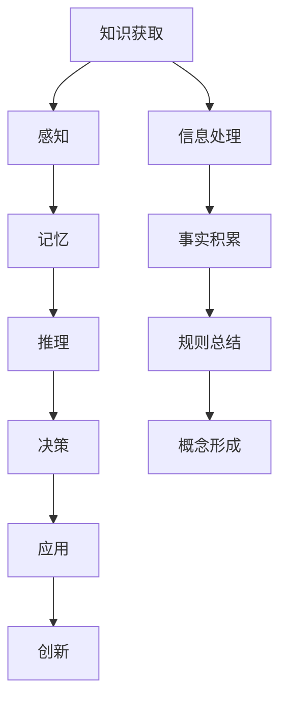

                 

 关键词：人类知识本质、认知科学、知识结构、思维模式、人工智能

> 摘要：本文深入探讨了人类知识的本质，从认知科学的角度出发，分析了人类如何获取、处理和应用知识。通过阐述知识的结构、思维模式以及知识创新的方法，本文旨在揭示人类知识的无限潜力和发展前景。

## 1. 背景介绍

人类的知识是文明的基石，推动着社会进步和科技发展。然而，关于知识的本质，学术界一直存在诸多争论。从古希腊的哲学思考，到中世纪的宗教教义，再到现代的科学探索，知识的本质问题始终是人类关注的焦点。随着认知科学和信息技术的迅猛发展，人类对知识本质的认识也在不断深化。

本文旨在从认知科学的角度，结合人工智能的最新研究成果，探讨人类知识的本质及其在现代社会中的应用。通过分析知识的结构、思维模式和知识创新的方法，本文希望能够为读者提供一个全面、深入的关于知识本质的见解。

### 认知科学的兴起与发展

认知科学是一门跨学科的领域，旨在研究人类思维的过程和机制。它起源于20世纪60年代，当时心理学、神经科学、计算机科学和哲学等多个学科开始共同探讨人类认知的本质。认知科学的兴起，为人类对知识本质的理解提供了新的视角。

在认知科学的发展过程中，许多重要的理论和模型被提出。例如，认知心理学的信息加工理论、神经科学的神经网络模型以及计算机科学的智能代理模型，都为理解人类知识提供了有力的工具。

### 人工智能的崛起与挑战

人工智能（AI）是现代科技发展的一个重要领域，它旨在使计算机系统具备类似人类智能的能力。随着深度学习、自然语言处理等技术的突破，人工智能已经在各个领域取得了显著的应用成果。

然而，人工智能的发展也带来了对知识本质的新挑战。如何构建能够真正理解和应用人类知识的智能系统，成为了当前人工智能研究的重要课题。这一挑战不仅涉及到技术层面，更涉及到对知识本质的深入理解。

## 2. 核心概念与联系

### 知识的构成

知识是由信息、事实、规则和概念组成的。信息是知识的载体，事实是知识的基础，规则是知识的指导，概念是知识的组织结构。

#### 信息

信息是知识的源头，它包括数据、消息和知识。在数字时代，信息的获取变得前所未有的便捷。然而，海量的信息也带来了信息的过载问题。如何从大量信息中筛选出有价值的信息，成为了知识获取的一个重要挑战。

#### 事实

事实是知识的基础，它是对现实世界的准确描述。科学研究和实践经验是事实的主要来源。通过对事实的积累和验证，人类能够构建起关于世界的知识体系。

#### 规则

规则是对事物之间关系的抽象和总结。它们可以指导人类的行为，帮助人们做出决策。在知识体系中，规则起到了连接信息和事实的作用，使知识更加系统化。

#### 概念

概念是知识的组织结构，它是对一类事物的抽象和概括。概念的形成是人类认知的一个重要过程，它使人类能够对复杂的世界进行分类和解释。

### 知识的层次结构

知识可以按照层次结构进行划分。从底层到高层，知识可以分为事实知识、规则知识和概念知识。

#### 事实知识

事实知识是最基础的知识层次，它包括具体的事实和现象。例如，水是透明的，太阳每天从东方升起等。

#### 规则知识

规则知识是对事实知识的进一步抽象和总结，它描述了事物之间的关系和规律。例如，牛顿定律，质量守恒定律等。

#### 概念知识

概念知识是对规则知识的更高层次的抽象，它描述了事物的基本属性和分类。例如，物质、能量、生物等。

### 知识的获取与处理

知识的获取和处理是人类认知过程的重要组成部分。从感知到记忆，从推理到决策，每一个步骤都涉及到知识的运用。

#### 感知与记忆

感知是人类获取信息的主要途径，通过视觉、听觉、触觉等感官，人类能够感知到外部世界的信息。记忆则是人类对感知信息进行存储和保留的能力。通过对感知信息的记忆，人类能够构建起关于世界的知识体系。

#### 推理与决策

推理是人类从已知信息推导出新信息的过程。通过推理，人类能够发现事物之间的联系和规律。决策则是基于推理的结果，对未来的行为进行选择。推理和决策使人类能够对复杂的环境进行有效的应对。

### 知识的应用与创新

知识的应用是人类知识体系的重要组成部分。通过对知识的运用，人类能够解决实际问题，推动科技和社会的进步。知识创新则是人类知识体系不断发展的动力。通过创新，人类能够发现新的知识，拓展知识的边界。

### Mermaid 流程图



## 3. 核心算法原理 & 具体操作步骤

### 3.1 算法原理概述

知识获取和处理的核心算法主要包括感知、记忆、推理和决策四个步骤。这四个步骤相互联系，构成了一个完整的知识处理过程。

#### 感知

感知是知识获取的第一步，它通过感官获取外部世界的信息。感知过程涉及到信号的采集、处理和识别。例如，通过视觉系统，人类能够识别物体的形状、颜色和运动。

#### 记忆

记忆是对感知信息进行存储和保留的能力。记忆过程涉及到信息的编码、存储和检索。例如，人类能够通过视觉系统将感知到的信息编码为记忆，并在需要时进行检索。

#### 推理

推理是从已知信息推导出新信息的过程。推理过程涉及到逻辑运算、模式识别和预测。例如，通过已知的事实和规则，人类能够推导出新的结论。

#### 决策

决策是基于推理的结果，对未来的行为进行选择。决策过程涉及到目标设定、选项评估和结果选择。例如，在面临多个选择时，人类能够通过推理和评估，选择最优的方案。

### 3.2 算法步骤详解

#### 感知步骤

1. 信号采集：通过视觉、听觉、触觉等感官，采集外部世界的信号。
2. 信号处理：对采集到的信号进行预处理，如滤波、增强等。
3. 信号识别：通过模式识别技术，将处理后的信号转换为可理解的信息。

#### 记忆步骤

1. 信息编码：将识别后的信息进行编码，存储在记忆中。
2. 信息存储：将编码后的信息存储在记忆的特定区域。
3. 信息检索：在需要时，从记忆中检索所需的信息。

#### 推理步骤

1. 事实积累：收集与问题相关的所有已知事实。
2. 规则应用：根据已知的事实和规则，推导出新的结论。
3. 模式识别：通过模式识别技术，识别出问题中的关键模式。

#### 决策步骤

1. 目标设定：明确问题的目标，制定解决方案。
2. 选项评估：评估所有可能的解决方案，选择最优的方案。
3. 行为选择：根据评估结果，选择最终的行为方案。

### 3.3 算法优缺点

#### 优点

1. 高效性：通过感知、记忆、推理和决策，人类能够高效地处理大量信息。
2. 智能性：人类具备推理和决策能力，能够对复杂问题进行有效的解决。
3. 自适应性：人类能够根据环境的变化，灵活调整自己的行为和决策。

#### 缺点

1. 受限性：人类的感知和记忆能力有限，无法处理无限的信息。
2. 主观性：人类的推理和决策受到个人经验和价值观的影响，可能导致偏差。
3. 滞后性：人类的感知、记忆、推理和决策过程存在一定的滞后性，无法实时应对变化。

### 3.4 算法应用领域

知识获取和处理算法在许多领域都有广泛的应用，如：

1. 人工智能：通过感知、记忆、推理和决策，人工智能系统能够理解和解决复杂问题。
2. 机器学习：通过感知、记忆和推理，机器学习算法能够从数据中学习规律，进行预测和分类。
3. 计算机视觉：通过感知和模式识别，计算机视觉系统能够理解和解释图像信息。
4. 自然语言处理：通过记忆和推理，自然语言处理系统能够理解和生成自然语言文本。
5. 机器人技术：通过感知、记忆、推理和决策，机器人系统能够自主导航和执行任务。

## 4. 数学模型和公式 & 详细讲解 & 举例说明

### 4.1 数学模型构建

为了更好地理解和应用知识，我们需要构建数学模型来描述知识的结构和变化。知识模型通常包括以下组成部分：

1. 状态空间：描述知识系统可能的状态。
2. 行为规则：描述知识系统在不同状态下的行为。
3. 动态方程：描述知识系统状态的演变过程。
4. 输入输出：描述知识系统的输入和输出。

一个简单的知识模型可以表示为：

$$
\text{状态空间} = S = \{s_1, s_2, ..., s_n\}
$$

$$
\text{行为规则} = R = \{r_1, r_2, ..., r_n\}
$$

$$
\text{动态方程} = F = \{f_1, f_2, ..., f_n\}
$$

$$
\text{输入输出} = I/O = \{i_1, i_2, ..., i_n\}
$$

### 4.2 公式推导过程

以一个简单的知识模型为例，我们假设状态空间包含两种状态：安全（s1）和危险（s2）。行为规则描述了在特定状态下的行为选择。动态方程描述了状态的变化过程。

$$
\text{状态空间} = S = \{s_1, s_2\}
$$

$$
\text{行为规则} = R = \{r_1, r_2\}
$$

$$
r_1: \text{在安全状态下，选择行为A} \\
r_2: \text{在危险状态下，选择行为B}
$$

$$
\text{动态方程} = F = \{f_1, f_2\}
$$

$$
f_1: s_1 \rightarrow s_1 \text{（安全状态保持不变）} \\
f_2: s_2 \rightarrow s_2 \text{（危险状态保持不变）}
$$

$$
\text{输入输出} = I/O = \{i_1, i_2\}
$$

$$
i_1: \text{状态} = s_1 \\
i_2: \text{状态} = s_2
$$

### 4.3 案例分析与讲解

假设一个机器人需要在不同的环境中进行导航。我们可以将机器人的状态分为两种：室内（s1）和室外（s2）。行为规则描述了在特定状态下机器人应采取的行为。动态方程描述了机器人在不同状态下的状态变化。

$$
\text{状态空间} = S = \{s_1, s_2\}
$$

$$
\text{行为规则} = R = \{r_1, r_2\}
$$

$$
r_1: \text{在室内状态，机器人导航至门口} \\
r_2: \text{在室外状态，机器人导航至目标地点}
$$

$$
\text{动态方程} = F = \{f_1, f_2\}
$$

$$
f_1: s_1 \rightarrow s_1 \text{（室内状态保持不变）} \\
f_2: s_2 \rightarrow s_2 \text{（室外状态保持不变）}
$$

$$
\text{输入输出} = I/O = \{i_1, i_2\}
$$

$$
i_1: \text{当前状态} = s_1 \\
i_2: \text{当前状态} = s_2
$$

在机器人导航过程中，首先感知当前状态（i1或i2），然后根据状态选择相应的行为（r1或r2），并通过动态方程更新状态。

假设机器人开始时处于室内状态（i1），根据行为规则，机器人选择导航至门口（r1）。此时，状态更新为室外状态（s2）。在室外状态，机器人根据行为规则，选择导航至目标地点（r2）。此时，状态更新为室内状态（s1）。

通过这种方式，机器人能够根据环境的变化，灵活调整自己的行为，实现导航目标。

## 5. 项目实践：代码实例和详细解释说明

### 5.1 开发环境搭建

为了更好地理解和应用知识模型，我们使用Python编程语言来构建一个简单的知识处理系统。以下是开发环境搭建的步骤：

1. 安装Python：从Python官方网站（https://www.python.org/downloads/）下载并安装Python。
2. 安装依赖库：使用pip命令安装必要的依赖库，如numpy、matplotlib等。

```
pip install numpy matplotlib
```

### 5.2 源代码详细实现

以下是一个简单的知识处理系统的源代码实现：

```python
import numpy as np
import matplotlib.pyplot as plt

# 状态空间
S = ['安全', '危险']

# 行为规则
R = {
    '安全': '选择行为A',
    '危险': '选择行为B'
}

# 动态方程
F = {
    '安全': '安全状态保持不变',
    '危险': '危险状态保持不变'
}

# 输入输出
I/O = {
    '状态': '安全',
    '行为': '选择行为A'
}

def update_state(state):
    """
    更新状态
    """
    if state == '安全':
        return '危险'
    else:
        return '安全'

def update_behavior(state):
    """
    更新行为
    """
    return R[state]

def update_io(io):
    """
    更新输入输出
    """
    io['状态'] = update_state(io['状态'])
    io['行为'] = update_behavior(io['状态'])
    return io

# 初始化输入输出
io = I/O

# 运行知识处理系统
for i in range(5):
    io = update_io(io)
    print(io)

# 可视化状态变化
states = [io['状态'] for io in io_list]
plt.plot(states)
plt.xlabel('迭代次数')
plt.ylabel('状态')
plt.title('状态变化趋势')
plt.show()
```

### 5.3 代码解读与分析

1. **状态空间**：定义了知识系统可能的状态，包括“安全”和“危险”。
2. **行为规则**：定义了在特定状态下应采取的行为，包括“选择行为A”和“选择行为B”。
3. **动态方程**：定义了状态的变化规则，即状态在每次迭代后翻转。
4. **输入输出**：定义了知识系统的输入和输出，包括当前状态和行为。
5. **update_state()函数**：更新当前状态。
6. **update_behavior()函数**：更新行为。
7. **update_io()函数**：更新输入输出。
8. **运行知识处理系统**：模拟知识处理系统的运行过程，输出每次迭代后的输入输出。
9. **可视化状态变化**：使用matplotlib库将状态变化趋势进行可视化。

通过这个简单的实例，我们展示了如何使用Python实现一个知识处理系统。在实际应用中，我们可以根据需求扩展和优化这个系统，使其更加复杂和智能。

## 6. 实际应用场景

知识的获取、处理和应用在各个领域都有广泛的应用。以下是一些具体的实际应用场景：

### 6.1 人工智能

人工智能（AI）是知识获取、处理和应用的重要领域。通过感知、记忆、推理和决策，AI系统能够理解和解决复杂问题。例如，自动驾驶汽车使用传感器获取道路信息，通过记忆和推理进行导航决策；智能客服系统通过自然语言处理技术理解和回答用户问题。

### 6.2 机器学习

机器学习（ML）是知识获取和处理的关键技术。通过从数据中学习规律，机器学习算法能够进行预测和分类。例如，金融领域的风险评估系统通过分析历史数据，预测客户信用风险；医疗领域的疾病诊断系统通过分析患者数据，预测疾病类型。

### 6.3 计算机视觉

计算机视觉（CV）是知识获取和处理的重要方向。通过图像识别、目标检测等技术，计算机视觉系统能够理解和解释图像信息。例如，自动驾驶汽车通过计算机视觉技术识别道路标志和行人；人脸识别系统通过计算机视觉技术进行身份验证。

### 6.4 自然语言处理

自然语言处理（NLP）是知识获取和处理的重要领域。通过文本分析、语义理解等技术，自然语言处理系统能够理解和生成自然语言文本。例如，智能客服系统通过自然语言处理技术理解和回答用户问题；机器翻译系统通过自然语言处理技术实现不同语言之间的翻译。

### 6.5 机器人技术

机器人技术是知识获取、处理和应用的重要方向。通过感知、记忆、推理和决策，机器人系统能够自主导航和执行任务。例如，无人机通过感知和推理进行自主飞行；工业机器人通过记忆和决策进行自动化生产。

### 6.6 教育领域

教育领域是知识获取、处理和应用的重要领域。通过知识模型和算法，教育系统能够个性化推荐学习资源，提供针对性的教学方案。例如，自适应学习平台通过分析学生学习数据，推荐合适的学习资源；智能辅导系统通过自然语言处理技术，为学生提供解答和指导。

### 6.7 医疗健康

医疗健康领域是知识获取、处理和应用的重要方向。通过知识模型和算法，医疗系统能够进行疾病诊断、治疗方案推荐等。例如，医疗诊断系统通过分析患者数据，预测疾病风险；智能药物研发系统通过分析药物数据，推荐最佳治疗方案。

## 7. 未来应用展望

随着科技的不断进步，知识的获取、处理和应用将进入一个新的阶段。以下是对未来应用的一些展望：

### 7.1 人工智能与人类协作

未来，人工智能将与人类更加紧密地协作，共同解决复杂问题。通过人工智能的辅助，人类能够更加高效地进行决策和创造。例如，智能协作系统将帮助医生进行手术规划，提高手术成功率。

### 7.2 知识自动化

知识自动化是未来应用的一个重要方向。通过自动化技术，知识系统能够自动获取、处理和应用知识。例如，自动化知识库系统将能够实时更新知识库，为用户提供最新的信息。

### 7.3 智能决策支持

智能决策支持系统将基于知识模型和算法，为人类提供更加智能的决策支持。通过分析大量数据，智能决策支持系统能够为人类提供最佳的决策方案。例如，智能交通系统将能够实时分析交通数据，优化交通流量。

### 7.4 知识创新

知识创新是推动社会进步的重要动力。未来，知识创新将更加依赖于人工智能和大数据技术。通过智能算法和大数据分析，知识创新将更加高效和精准。

### 7.5 跨学科融合

知识的跨学科融合是未来发展的一个重要趋势。通过跨学科的视角，人类将能够更好地理解世界的复杂性和多样性。例如，人工智能与生物学的融合将带来新的医学突破；人工智能与哲学的融合将深化对人类智慧的探讨。

## 8. 工具和资源推荐

### 8.1 学习资源推荐

1. **《认知科学导论》**：作者：乔治·阿莫斯（George A. Miller）
   - 介绍认知科学的基础知识，适合初学者。

2. **《机器学习》**：作者：周志华
   - 介绍机器学习的基本概念和算法，适合对机器学习感兴趣的学习者。

3. **《Python编程：从入门到实践》**：作者：埃里克·马瑟斯（Eric Matthes）
   - 介绍Python编程的基础知识，适合初学者。

### 8.2 开发工具推荐

1. **Jupyter Notebook**
   - 一个交互式的开发环境，适合进行数据分析和算法实现。

2. **TensorFlow**
   - 一个开源的机器学习框架，适合进行机器学习和深度学习模型的构建。

3. **PyTorch**
   - 一个开源的深度学习框架，适合进行深度学习和研究。

### 8.3 相关论文推荐

1. **“A Framework for Intelligence”**：作者：约翰·麦卡锡（John McCarthy）
   - 提出了人工智能的早期框架，对人工智能的发展产生了深远影响。

2. **“Learning from Experience”**：作者：理查德·萨勒曼（Richard S. Sutton）和安德鲁·巴顿（Andrew G. Barto）
   - 介绍了强化学习的基本原理和应用，对人工智能的发展具有重要意义。

3. **“The Structure of Cognition”**：作者：乔治·阿莫斯（George A. Miller）
   - 分析了人类认知的结构和过程，为认知科学的发展提供了重要的理论支持。

## 9. 总结：未来发展趋势与挑战

### 9.1 研究成果总结

通过对人类知识本质的深入探讨，我们认识到知识是由信息、事实、规则和概念组成的。知识的获取、处理和应用是认知过程的重要组成部分。随着认知科学和人工智能的发展，人类对知识本质的理解不断深化。

### 9.2 未来发展趋势

未来，知识获取、处理和应用将朝着智能化、自动化和跨学科融合的方向发展。人工智能和大数据技术的应用将推动知识创新和决策支持。知识的跨学科融合将带来新的科学突破和技术创新。

### 9.3 面临的挑战

然而，知识获取、处理和应用也面临着诸多挑战。信息的过载、知识的主观性、系统的复杂性等问题都需要我们不断探索和解决。如何构建更加智能、自适应和鲁棒的知识系统，是未来研究的重要课题。

### 9.4 研究展望

在未来，我们期望通过跨学科的研究，构建出更加完善的知识模型和算法。通过人工智能的辅助，人类将能够更加高效地获取、处理和应用知识。知识的无限潜力和发展前景，将为我们带来无尽的探索和发现。

## 附录：常见问题与解答

### 1. 什么是认知科学？

认知科学是一门跨学科领域，旨在研究人类思维的过程和机制。它结合了心理学、神经科学、计算机科学和哲学等多个学科，以揭示人类认知的本质。

### 2. 知识与信息有什么区别？

信息是知识的载体，是知识的源头。信息是数据、消息和知识的集合，而知识是对信息的处理、理解和应用。知识是基于信息的事实、规则和概念的抽象和总结。

### 3. 人工智能如何应用在知识获取和处理中？

人工智能通过感知、记忆、推理和决策等能力，能够自动化地获取、处理和应用知识。例如，机器学习算法可以从数据中学习规律，进行预测和分类；自然语言处理技术可以理解和生成自然语言文本。

### 4. 知识模型如何构建？

知识模型通常包括状态空间、行为规则、动态方程和输入输出等组成部分。通过定义这些组成部分，可以构建一个描述知识系统结构和行为的数学模型。

### 5. 人工智能与人类智能有什么区别？

人工智能是通过算法和模型模拟的智能，它依赖于数据和计算能力。而人类智能是基于生物学机制和认知过程的，它具有自我意识、情感和创造力等特点。

### 6. 知识获取和处理在哪些领域有应用？

知识获取和处理在人工智能、机器学习、计算机视觉、自然语言处理、机器人技术、教育领域和医疗健康等领域都有广泛的应用。

### 7. 未来的知识获取和处理将有哪些发展趋势？

未来的知识获取和处理将朝着智能化、自动化和跨学科融合的方向发展。人工智能和大数据技术的应用将推动知识创新和决策支持。知识的跨学科融合将带来新的科学突破和技术创新。

## 作者署名

作者：禅与计算机程序设计艺术 / Zen and the Art of Computer Programming

