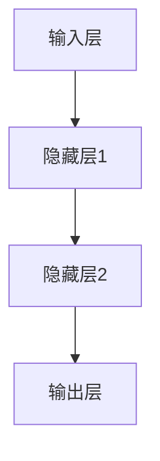
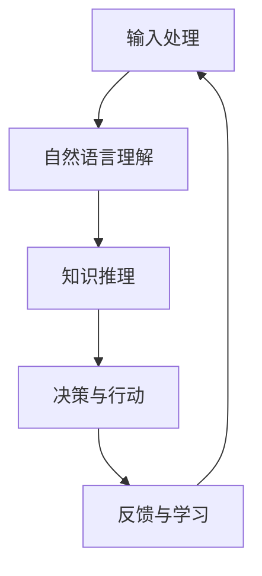

                 

关键词：认知革命、人工智能、认知科学、人类思维、神经网络、机器学习、计算模型、大脑结构、算法优化、神经可塑性、认知计算、人机交互

> 摘要：本文将探讨人工智能时代下，人类认知如何经历一场革命。通过分析神经网络与大脑结构的关系、机器学习算法的进步、认知计算的潜力，以及人机交互模式的转变，揭示人工智能如何正在重新定义我们的认知方式，并对未来社会的深远影响。

## 1. 背景介绍

自20世纪50年代人工智能（AI）首次被提出以来，该领域经历了巨大的发展。从最初的规则基础系统到今天基于深度学习的复杂模型，人工智能技术不断突破人类认知的界限。同时，认知科学作为一门研究人类思维和智能的学科，也在不断地深化对人类认知机制的理解。然而，随着AI技术的迅速发展，人类自身的认知能力似乎正经历一场前所未有的变革。

### 1.1 认知科学的兴起

认知科学是20世纪中叶兴起的一门跨学科领域，结合了心理学、神经科学、计算机科学和哲学等多方面知识，致力于研究人类认知的原理和机制。通过认知科学的进展，我们逐渐理解了大脑如何处理信息、如何进行学习、记忆和决策。

### 1.2 人工智能的发展

人工智能的发展经历了几个重要的阶段，从最初的符号主义、基于规则的系统，到基于统计的机器学习方法，再到深度学习的崛起。随着计算能力的提升和数据量的爆炸性增长，人工智能在很多领域都展现出了超越人类的能力。

## 2. 核心概念与联系

### 2.1 神经网络与大脑结构

神经网络（Neural Networks）是人工智能的核心技术之一，其设计灵感来自于人脑的结构和功能。一个典型的神经网络由大量的神经元（或节点）和它们之间的连接（或边）组成。这些神经元模拟了大脑中的神经元，通过传递电信号来进行信息处理。

下面是一个简化的神经网络结构的 Mermaid 流程图：



### 2.2 机器学习与认知机制

机器学习是使计算机能够从数据中学习的关键技术，它在很大程度上模拟了人类的学习过程。机器学习算法可以分为监督学习、无监督学习和强化学习等类型。这些算法通过不断调整模型参数，使得模型能够在新的数据上做出预测或决策。

### 2.3 认知计算的潜力

认知计算（Cognitive Computing）是一种将人类认知过程与计算技术相结合的方法，旨在开发出能够理解和解释人类语言、视觉和听觉的智能系统。认知计算涉及到自然语言处理、计算机视觉和语音识别等多个领域。

下面是一个认知计算的基本流程的 Mermaid 流程图：



## 3. 核心算法原理 & 具体操作步骤

### 3.1 算法原理概述

人工智能的核心算法包括神经网络算法、机器学习算法和深度学习算法等。这些算法的核心思想是通过学习数据来提取模式和规律，从而进行预测或决策。

### 3.2 算法步骤详解

以深度学习算法为例，其基本步骤包括：

1. **数据预处理**：对输入数据进行标准化、归一化等处理。
2. **构建模型**：设计神经网络结构，包括输入层、隐藏层和输出层。
3. **训练模型**：使用训练数据集来调整模型参数，使得模型能够在新的数据上进行准确预测。
4. **评估模型**：使用验证数据集来评估模型性能，调整模型参数以达到最佳效果。
5. **应用模型**：将训练好的模型应用到实际问题上，进行预测或决策。

### 3.3 算法优缺点

神经网络算法的优点包括强大的自适应能力和处理复杂问题的能力，但缺点包括对大规模数据的需求和训练过程的高计算成本。机器学习算法的优点在于其能够在大量数据中发现模式和规律，但缺点包括对数据质量和数量的高度依赖。

### 3.4 算法应用领域

神经网络算法广泛应用于图像识别、语音识别、自然语言处理等领域。机器学习算法在推荐系统、金融风控、医疗诊断等领域有广泛应用。深度学习算法则在自动驾驶、智能家居、机器人等领域展现出巨大的潜力。

## 4. 数学模型和公式 & 详细讲解 & 举例说明

### 4.1 数学模型构建

神经网络算法的核心是多层感知机（MLP），其基本数学模型可以表示为：

$$
y = \sigma(W_2 \cdot \sigma(W_1 \cdot x + b_1) + b_2)
$$

其中，$x$ 为输入向量，$y$ 为输出向量，$W_1$ 和 $W_2$ 分别为第一层和第二层的权重矩阵，$b_1$ 和 $b_2$ 分别为偏置向量，$\sigma$ 为激活函数。

### 4.2 公式推导过程

多层感知机的推导过程涉及矩阵运算和优化算法。首先，定义输入层、隐藏层和输出层的权重矩阵和偏置向量。然后，通过前向传播计算隐藏层和输出层的输出。最后，通过反向传播调整权重矩阵和偏置向量，使得输出与目标值之间的误差最小。

### 4.3 案例分析与讲解

以图像分类任务为例，使用卷积神经网络（CNN）对图像进行分类。首先，将图像转化为二维矩阵作为输入，然后通过卷积层提取图像的特征。接下来，通过全连接层对特征进行分类。最后，使用损失函数（如交叉熵损失函数）来评估模型性能。

## 5. 项目实践：代码实例和详细解释说明

### 5.1 开发环境搭建

在 Python 环境中，使用 TensorFlow 和 Keras 库搭建深度学习模型。首先，安装 TensorFlow：

```bash
pip install tensorflow
```

然后，导入所需的库：

```python
import tensorflow as tf
from tensorflow.keras import layers
```

### 5.2 源代码详细实现

以下是一个简单的卷积神经网络实现图像分类的代码示例：

```python
model = tf.keras.Sequential([
    layers.Conv2D(32, (3, 3), activation='relu', input_shape=(28, 28, 1)),
    layers.MaxPooling2D((2, 2)),
    layers.Flatten(),
    layers.Dense(128, activation='relu'),
    layers.Dense(10, activation='softmax')
])

model.compile(optimizer='adam',
              loss='categorical_crossentropy',
              metrics=['accuracy'])

model.fit(x_train, y_train, epochs=5, batch_size=64)
```

### 5.3 代码解读与分析

这段代码定义了一个卷积神经网络，包括一个卷积层、一个池化层、一个全连接层和一个softmax输出层。通过编译模型和训练模型，可以实现图像分类任务。

### 5.4 运行结果展示

训练完成后，可以使用测试集来评估模型的性能：

```python
test_loss, test_acc = model.evaluate(x_test, y_test, verbose=2)
print('\nTest accuracy:', test_acc)
```

输出结果为测试集上的准确率。

## 6. 实际应用场景

### 6.1 人工智能在医疗领域的应用

人工智能在医疗领域的应用包括疾病诊断、药物研发和健康监测等。例如，通过深度学习模型对医学影像进行分析，可以帮助医生更准确地诊断疾病。

### 6.2 人工智能在交通领域的应用

人工智能在交通领域的应用包括自动驾驶、智能交通管理和交通预测等。通过结合计算机视觉和深度学习技术，可以实现更加安全和高效的交通系统。

### 6.3 人工智能在教育领域的应用

人工智能在教育领域的应用包括个性化学习、智能评估和教学辅助等。通过分析学生的学习数据，可以提供更加个性化的学习资源和教学方法。

## 7. 工具和资源推荐

### 7.1 学习资源推荐

- 《深度学习》（Goodfellow, Bengio, Courville著）：深度学习领域的经典教材。
- 《机器学习》（周志华著）：机器学习领域的全面介绍。

### 7.2 开发工具推荐

- TensorFlow：用于构建和训练深度学习模型的强大框架。
- Keras：基于 TensorFlow 的简单易用的深度学习库。

### 7.3 相关论文推荐

- "Deep Learning"（Ian Goodfellow, Yoshua Bengio, Aaron Courville著）
- "Machine Learning Yearning"（Andrew Ng著）

## 8. 总结：未来发展趋势与挑战

### 8.1 研究成果总结

随着人工智能技术的不断进步，人类在认知科学领域的理解也在逐步深化。神经网络算法、机器学习算法和深度学习算法已经取得了显著的成果，并在许多领域得到了广泛应用。

### 8.2 未来发展趋势

未来，人工智能将更加深入地与人类认知相结合，实现更加智能化的认知计算。此外，随着量子计算的兴起，人工智能的计算能力将进一步提升。

### 8.3 面临的挑战

尽管人工智能取得了巨大进展，但仍然面临一些挑战，如数据隐私、安全性和伦理问题。此外，如何更好地理解人类认知机制，以构建更加智能的人工智能系统，仍是一个重要课题。

### 8.4 研究展望

随着技术的不断进步，人工智能将在认知革命中发挥更加重要的作用。通过深入研究人类认知机制，我们可以开发出更加智能的人工智能系统，为社会带来更多的价值。

## 9. 附录：常见问题与解答

### 9.1 什么是认知科学？

认知科学是研究人类思维和智能的跨学科领域，涉及心理学、神经科学、计算机科学和哲学等多个学科。

### 9.2 人工智能与认知科学有何关系？

人工智能通过模拟人类认知过程，结合认知科学的理论和方法，致力于开发出能够理解、学习和适应的智能系统。

### 9.3 深度学习算法是如何工作的？

深度学习算法通过多层神经网络结构，学习输入数据和目标数据之间的关系，从而进行预测或决策。

### 9.4 人工智能在未来会有什么影响？

人工智能在未来将对医疗、交通、教育等多个领域产生深远影响，提高生产效率，改善生活质量。

---

作者：禅与计算机程序设计艺术 / Zen and the Art of Computer Programming
```

