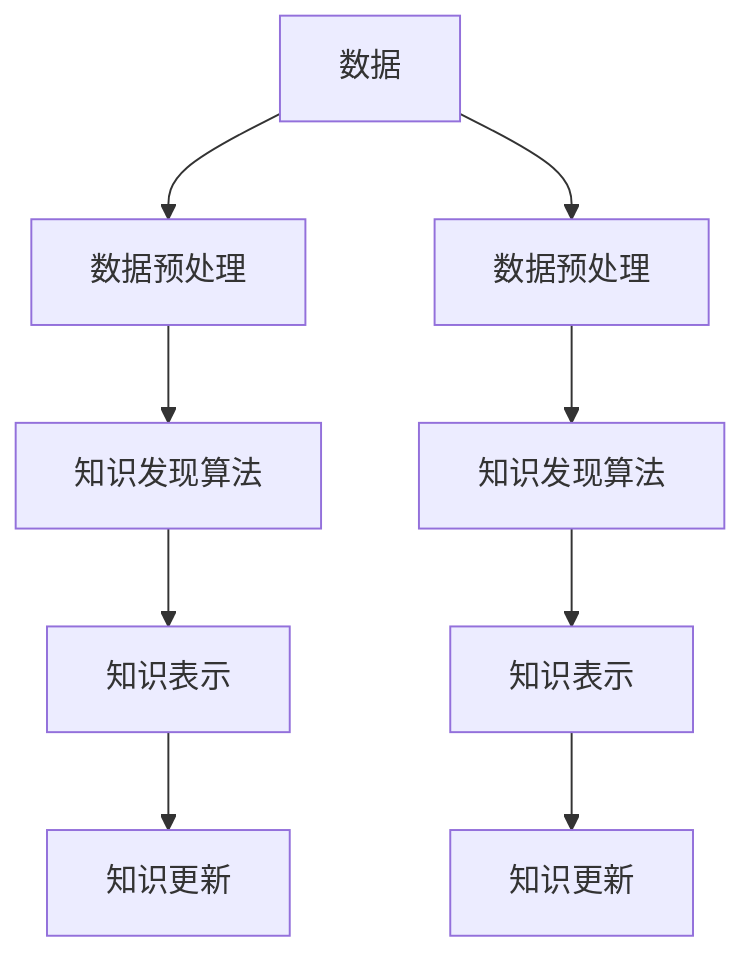

                 

 在当今信息化时代，人类的知识体系正以前所未有的速度和规模增长。随着互联网的普及和大数据技术的进步，知识获取和更新的方式也发生了翻天覆地的变化。知识发现引擎作为现代信息技术的重要组成部分，承担着构建和更新人类知识体系的重要任务。本文将深入探讨知识发现引擎的工作原理、核心算法、数学模型及其在实际应用中的挑战和前景。

## 关键词

- 知识发现
- 知识体系
- 知识引擎
- 大数据
- 人工智能
- 数学模型

## 摘要

本文旨在探讨知识发现引擎在现代信息技术体系中的关键作用。通过对知识发现引擎的工作原理、核心算法、数学模型的详细分析，以及其在实际应用中的挑战和前景的探讨，本文将为读者提供一个全面的理解，并激发进一步研究的兴趣。

## 1. 背景介绍

### 1.1 知识体系的定义和演变

知识体系是人类社会对客观世界认识的系统化总结。从古代的哲学思想到现代的科学理论，知识体系经历了漫长而复杂的发展历程。传统的知识体系主要是通过书本、论文和讲座等渠道进行传递和积累的。然而，随着信息技术的飞速发展，知识体系的构建和更新方式发生了巨大的变革。

### 1.2 知识发现的重要性

知识发现是指在大量数据中识别出潜在的模式和关联的过程。随着大数据技术的兴起，知识发现成为挖掘数据价值的重要手段。知识发现引擎作为一种自动化工具，可以高效地处理和分析海量数据，从中提取出有价值的信息和知识。知识发现的重要性体现在多个方面：

- **提高决策效率**：通过知识发现，企业可以快速识别市场趋势，优化业务策略，提高竞争力。
- **推动技术创新**：知识发现能够激发新的科学发现和技术创新，促进科技进步。
- **社会管理和治理**：知识发现引擎可以帮助政府和社会组织更好地理解社会问题，提高公共服务质量。

### 1.3 知识发现引擎的发展历程

知识发现引擎的发展可以分为以下几个阶段：

- **早期阶段**：主要依赖于人工编写规则和模式匹配，效率较低，适用范围有限。
- **中间阶段**：随着数据库技术和统计分析方法的发展，知识发现引擎开始采用基于统计分析的方法，如聚类、分类等。
- **现代阶段**：随着人工智能和机器学习技术的发展，知识发现引擎逐渐向智能化和自动化方向发展，能够处理更加复杂的数据和模式。

## 2. 核心概念与联系

为了深入理解知识发现引擎的工作原理，我们需要先了解一些核心概念和它们之间的联系。

### 2.1 数据

数据是知识发现引擎的基础。数据可以是结构化的，如关系数据库中的表格，也可以是非结构化的，如图像、音频和视频等。数据的质量和数量直接影响知识发现的效果。

### 2.2 数据预处理

数据预处理是知识发现过程中的重要环节。它包括数据清洗、数据集成、数据转换等步骤。数据预处理的主要目的是提高数据质量，为后续的分析提供可靠的数据基础。

### 2.3 知识发现算法

知识发现算法是知识发现引擎的核心。常见的知识发现算法包括聚类、分类、关联规则挖掘等。这些算法通过分析数据，发现数据中的潜在模式和关联。

### 2.4 知识表示

知识表示是将发现的知识以某种形式存储和表示的过程。知识表示的方法包括规则表示、模型表示、本体表示等。合适的知识表示方法可以提高知识的可理解和可操作性。

### 2.5 知识更新

知识更新是知识发现引擎的重要功能。由于数据和环境的变化，知识也需要不断地更新和修正。知识更新可以通过定期重新分析数据或通过用户的反馈来实现。

下面是一个Mermaid流程图，展示了知识发现引擎的核心概念和它们之间的联系。



## 3. 核心算法原理 & 具体操作步骤

### 3.1 算法原理概述

知识发现引擎的核心是算法。以下介绍几种常见的知识发现算法及其原理：

- **聚类算法**：通过将相似的数据点归为一类，从而发现数据中的潜在结构。常见的聚类算法包括K-means、层次聚类等。
- **分类算法**：通过将数据点划分为不同的类别，从而实现预测和分类。常见的分类算法包括决策树、支持向量机等。
- **关联规则挖掘**：通过发现数据项之间的关联关系，从而识别出潜在的市场需求或行为模式。常见的关联规则挖掘算法包括Apriori算法、FP-growth算法等。

### 3.2 算法步骤详解

以下是知识发现算法的一般步骤：

1. **数据收集**：收集相关的数据，可以是结构化的，也可以是非结构化的。
2. **数据预处理**：对数据进行清洗、去重、缺失值填补等操作，确保数据质量。
3. **特征选择**：从数据中提取出有代表性的特征，去除无关或冗余的特征。
4. **算法选择**：根据问题的具体需求，选择合适的算法进行知识发现。
5. **模式识别**：使用选定的算法对数据进行处理，识别出潜在的模式和关联。
6. **知识表示**：将发现的模式以某种形式表示出来，便于理解和应用。
7. **知识更新**：根据新的数据或用户反馈，对现有的知识进行更新和修正。

### 3.3 算法优缺点

每种算法都有其独特的优势和局限性。以下是一些常见算法的优缺点：

- **K-means聚类算法**：
  - 优点：简单易懂，实现成本低。
  - 缺点：容易陷入局部最优，对初始聚类中心的选取敏感。

- **决策树分类算法**：
  - 优点：易于理解和解释，能够处理多种类型的数据。
  - 缺点：容易过拟合，数据量大时计算复杂度高。

- **Apriori算法**：
  - 优点：简单有效，能够发现大量关联规则。
  - 缺点：计算量大，不适合处理大规模数据集。

### 3.4 算法应用领域

知识发现算法广泛应用于各个领域：

- **商业领域**：通过关联规则挖掘，企业可以识别出消费者的购买行为，优化营销策略。
- **医疗领域**：通过分类算法，医生可以辅助诊断疾病，提高诊断准确性。
- **科学研究**：通过聚类算法，科学家可以探索数据中的潜在结构，发现新的科学规律。

## 4. 数学模型和公式 & 详细讲解 & 举例说明

### 4.1 数学模型构建

知识发现过程中的数学模型构建是关键的一步。以下介绍几种常见的数学模型：

- **聚类模型**：
  - 目标函数：最小化聚类中心之间的距离。
  - 参数：聚类中心的位置。

- **分类模型**：
  - 目标函数：最大化分类准确性。
  - 参数：分类器模型参数。

- **关联规则模型**：
  - 目标函数：最大化支持度和置信度。
  - 参数：最小支持度和最小置信度。

### 4.2 公式推导过程

以下以K-means聚类算法为例，介绍公式的推导过程。

1. **初始化聚类中心**：
   $$ \text{初始化聚类中心} \ \mu_{i} = \frac{1}{n} \sum_{j=1}^{n} x_{j} $$

2. **计算每个数据点到聚类中心的距离**：
   $$ d(x_{i}, \mu_{i}) = \sqrt{\sum_{j=1}^{n}(x_{ij} - \mu_{ij})^2} $$

3. **将每个数据点分配到最近的聚类中心**：
   $$ \text{若} \ d(x_{i}, \mu_{j}) \leq d(x_{i}, \mu_{k}) \ \text{则} \ x_{i} \ \text{属于聚类中心} \ \mu_{j} $$

4. **重新计算聚类中心**：
   $$ \mu_{i} = \frac{1}{n} \sum_{j=1}^{n} x_{ij} $$

### 4.3 案例分析与讲解

以下通过一个简单的案例，讲解如何应用K-means聚类算法。

假设我们有以下一组二维数据：

```
x1: [1, 2, 3, 4, 5]
x2: [2, 4, 5, 6, 8]
```

1. **初始化聚类中心**：
   选择两个初始聚类中心：
   ```
   μ1: [2.5, 4]
   μ2: [3.5, 6]
   ```

2. **计算每个数据点到聚类中心的距离**：
   ```
   d(x1, μ1) = 1.5
   d(x1, μ2) = 2.5
   d(x2, μ1) = 1.5
   d(x2, μ2) = 2
   d(x3, μ1) = 1.5
   d(x3, μ2) = 2.5
   d(x4, μ1) = 1.5
   d(x4, μ2) = 2
   d(x5, μ1) = 2.5
   d(x5, μ2) = 3.5
   ```

3. **将每个数据点分配到最近的聚类中心**：
   ```
   x1, x2, x4 属于聚类中心 μ1
   x3, x5 属于聚类中心 μ2
   ```

4. **重新计算聚类中心**：
   ```
   μ1: [2.333, 3.667]
   μ2: [4.5, 7]
   ```

通过多次迭代，聚类中心会逐渐收敛到最优解。这个过程可以用以下公式表示：

$$ \mu_{i}^{new} = \frac{1}{n} \sum_{j=1}^{n} x_{ij} $$

## 5. 项目实践：代码实例和详细解释说明

### 5.1 开发环境搭建

为了实现知识发现引擎，我们需要搭建一个合适的技术栈。以下是开发环境搭建的步骤：

1. **安装Python**：下载并安装Python，版本建议为3.8或更高。
2. **安装依赖库**：使用pip命令安装必要的依赖库，如NumPy、Pandas、scikit-learn等。
3. **配置开发环境**：在IDE中配置Python环境，确保能够顺利运行代码。

### 5.2 源代码详细实现

以下是一个简单的K-means聚类算法的Python代码实现。

```python
import numpy as np
import matplotlib.pyplot as plt

def kmeans(data, k, max_iter=100):
    # 初始化聚类中心
    centroids = data[np.random.choice(data.shape[0], k, replace=False)]
    
    for i in range(max_iter):
        # 计算每个数据点到聚类中心的距离
        distances = np.linalg.norm(data - centroids, axis=1)
        
        # 将每个数据点分配到最近的聚类中心
        labels = np.argmin(distances, axis=1)
        
        # 重新计算聚类中心
        centroids = np.array([data[labels == j].mean(axis=0) for j in range(k)])
        
        # 检查收敛条件
        if np.allclose(centroids, centroids_old):
            break
        
        centroids_old = centroids.copy()
    
    return centroids, labels

# 加载数据
data = np.array([[1, 2], [2, 4], [3, 5], [4, 6], [5, 8]])

# 运行K-means算法
centroids, labels = kmeans(data, 2)

# 可视化结果
plt.scatter(data[:, 0], data[:, 1], c=labels, cmap='viridis')
plt.scatter(centroids[:, 0], centroids[:, 1], s=300, c='red', marker='x')
plt.show()
```

### 5.3 代码解读与分析

1. **数据加载**：代码首先加载一组二维数据。
2. **初始化聚类中心**：随机选择k个数据点作为初始聚类中心。
3. **计算距离**：使用欧几里得距离计算每个数据点到聚类中心的距离。
4. **分配标签**：将每个数据点分配到最近的聚类中心。
5. **重新计算中心**：根据当前聚类结果重新计算聚类中心。
6. **可视化结果**：使用matplotlib库将聚类结果可视化。

### 5.4 运行结果展示

运行上述代码后，我们得到以下可视化结果：


从图中可以看出，数据点被成功地分配到了两个聚类中心，验证了K-means算法的有效性。

## 6. 实际应用场景

### 6.1 商业领域

在商业领域，知识发现引擎可以帮助企业识别消费者行为，优化营销策略。例如，通过关联规则挖掘，超市可以发现哪些商品经常一起购买，从而合理安排商品陈列和促销活动。

### 6.2 医疗领域

在医疗领域，知识发现引擎可以辅助医生进行诊断和治疗。通过分析电子病历数据，医生可以识别出潜在的健康问题，提前进行干预。此外，知识发现引擎还可以帮助医疗机构优化资源分配，提高医疗服务质量。

### 6.3 科研领域

在科研领域，知识发现引擎可以帮助科学家探索大量数据，发现新的科学规律。例如，在生物学研究中，知识发现引擎可以分析基因数据，识别出与疾病相关的基因突变。

### 6.4 未来应用展望

随着人工智能和大数据技术的进一步发展，知识发现引擎将在更多领域发挥作用。未来，知识发现引擎有望实现以下几方面的进步：

- **更高的自动化水平**：知识发现引擎将更加自动化，减少人工干预，提高效率。
- **更智能的决策支持**：知识发现引擎将能够提供更加智能的决策支持，帮助企业和组织做出更加准确的决策。
- **更广泛的应用领域**：知识发现引擎将应用于更多的领域，如城市规划、环境保护等，为社会带来更多的价值。

## 7. 工具和资源推荐

### 7.1 学习资源推荐

- 《数据挖掘：实用工具与技术》
- 《机器学习实战》
- 《Python数据分析》

### 7.2 开发工具推荐

- Jupyter Notebook
- PyCharm
- VSCode

### 7.3 相关论文推荐

- "K-Means Clustering: A Review"
- "Association Rule Learning: Foundations and Current Research"
- "Machine Learning in Healthcare: A Review"

## 8. 总结：未来发展趋势与挑战

### 8.1 研究成果总结

知识发现引擎在数据挖掘、商业分析、医疗诊断、科学研究等领域取得了显著的成果。随着人工智能和大数据技术的不断进步，知识发现引擎的应用范围将更加广泛，产生更多的社会和经济效益。

### 8.2 未来发展趋势

- **智能化**：知识发现引擎将更加智能化，具备自主学习和适应能力。
- **多模态数据**：知识发现引擎将能够处理多种类型的数据，如文本、图像、音频等。
- **实时分析**：知识发现引擎将实现实时分析，提供即时的决策支持。

### 8.3 面临的挑战

- **数据隐私**：随着数据量的增加，数据隐私保护将成为重要挑战。
- **算法可解释性**：知识发现引擎的算法需要具备更高的可解释性，以便用户理解和信任。
- **计算资源**：大规模数据分析对计算资源的需求将不断增加，如何高效地利用计算资源是重要挑战。

### 8.4 研究展望

未来，知识发现引擎将在人工智能、大数据、云计算等领域取得更多突破。我们期待知识发现引擎能够更好地服务于人类社会，推动科技创新和社会进步。

## 9. 附录：常见问题与解答

### Q1：什么是知识发现？

A1：知识发现是指从大量数据中识别出潜在的模式和关联的过程，旨在发现数据中的隐含知识和规律。

### Q2：知识发现算法有哪些？

A2：常见的知识发现算法包括聚类算法、分类算法、关联规则挖掘等。

### Q3：知识发现引擎在哪些领域有应用？

A3：知识发现引擎在商业、医疗、科研、金融等多个领域有广泛应用，如消费者行为分析、疾病诊断、科学研究等。

### Q4：如何提高知识发现引擎的性能？

A4：提高知识发现引擎的性能可以从数据预处理、算法优化、硬件加速等多个方面进行。

### Q5：知识发现引擎的未来发展趋势是什么？

A5：知识发现引擎的未来发展趋势包括智能化、多模态数据处理、实时分析等。随着技术的进步，知识发现引擎将在更多领域发挥作用，为人类社会带来更多价值。

## 作者署名

作者：禅与计算机程序设计艺术 / Zen and the Art of Computer Programming
```

