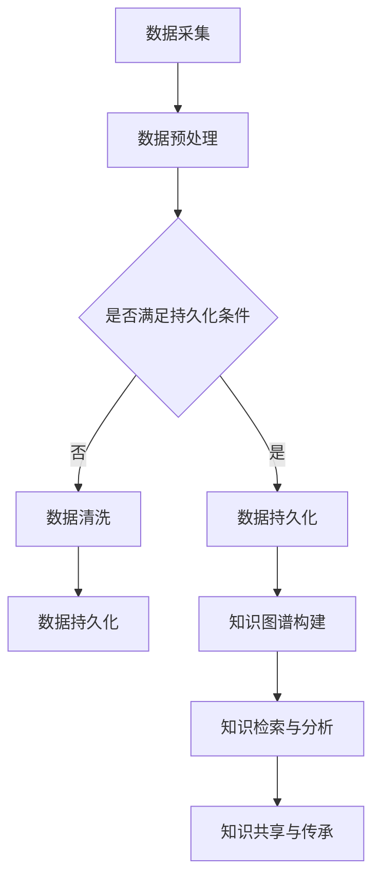

                 

关键词：人类知识保存，数据持久化，未来传承，人工智能，知识图谱

> 摘要：在数字化时代，人类知识的保存和传承变得尤为重要。本文将探讨如何利用人工智能技术，构建一个稳定的、持久的知识保存系统，为未来世代提供灯塔般的指引。

## 1. 背景介绍

在科技飞速发展的今天，人类的知识积累达到了前所未有的高度。从科学理论到技术应用，从文学艺术到历史文化，知识正在以前所未有的速度增长和更新。然而，传统的知识保存方式，如书籍、档案等，面临着诸多挑战：物理损坏、信息丢失、不易检索等。如何在数字化时代，有效地保存和传承人类知识，成为了一个亟待解决的问题。

### 1.1 人类知识保存的现状

当前，人类知识的保存主要依赖于数字技术和互联网。大量的学术期刊、数据库、在线图书馆等资源为知识的传播提供了便利。然而，这些资源也存在着一定的局限性：

- **数据冗余**：大量的数据重复存储，导致存储空间的浪费。
- **信息碎片化**：知识被分散在不同的数据库中，难以形成完整的知识体系。
- **安全性问题**：数字数据容易受到黑客攻击、数据泄露等威胁。
- **更新不及时**：知识更新速度远不及知识产生速度，导致知识库陈旧。

### 1.2 人工智能与知识保存

人工智能技术的发展为人类知识保存带来了新的契机。通过机器学习、自然语言处理等技术，可以实现对大量数据的自动分类、索引、提取和理解，从而提高知识的保存效率和准确性。同时，人工智能还可以帮助构建知识图谱，将分散的知识点连接起来，形成更加完整、系统的知识体系。

## 2. 核心概念与联系

为了构建一个稳定、持久的知识保存系统，我们需要了解以下几个核心概念：

### 2.1 数据持久化

数据持久化是指将数据存储到可以长期保存的介质中，如硬盘、数据库等。持久化的数据可以在系统重启后仍然存在，不会因为系统的关闭而丢失。数据持久化是知识保存的基础。

### 2.2 知识图谱

知识图谱是一种语义网络，它通过节点和边来表示实体和实体之间的关系。知识图谱可以用于知识的存储、检索、推理和分析，是实现知识保存的关键技术。

### 2.3 人工智能

人工智能是指使计算机具备人类智能的技术。人工智能可以用于数据预处理、知识抽取、知识推理等，是构建知识保存系统的核心驱动力。

### 2.4 Mermaid 流程图

下面是一个简化的知识保存系统的 Mermaid 流程图，展示了核心概念之间的联系。



## 3. 核心算法原理 & 具体操作步骤

### 3.1 算法原理概述

知识保存系统的核心算法主要包括数据预处理、知识图谱构建和知识检索与分析。以下是每个算法的简要概述：

- **数据预处理**：包括数据清洗、去噪、归一化等，目的是提高数据质量，为后续的知识图谱构建提供高质量的输入。
- **知识图谱构建**：通过实体抽取、关系抽取和实体链接等技术，将文本数据转换为知识图谱，实现知识的结构化存储。
- **知识检索与分析**：利用知识图谱进行知识检索和推理，为用户提供个性化的知识服务。

### 3.2 算法步骤详解

#### 3.2.1 数据预处理

1. **数据清洗**：去除文本中的噪声，如HTML标签、特殊符号等。
2. **去噪**：去除重复数据、无效数据和错误数据。
3. **归一化**：统一数据格式，如日期格式、单位转换等。

#### 3.2.2 知识图谱构建

1. **实体抽取**：从文本中识别出重要的实体，如人名、地点、组织等。
2. **关系抽取**：从文本中识别出实体之间的关系，如“工作于”、“出生地”等。
3. **实体链接**：将同一实体的不同表述（如全名、别名）进行合并。

#### 3.2.3 知识检索与分析

1. **知识检索**：基于关键词或实体，从知识图谱中检索相关的知识。
2. **知识推理**：利用知识图谱中的关系，进行推理，生成新的知识。

### 3.3 算法优缺点

#### 3.3.1 优点

- **高效性**：通过自动化处理，大大提高了知识保存的效率和准确性。
- **完整性**：知识图谱将分散的知识点连接起来，形成完整的知识体系。
- **可扩展性**：可以轻松地添加新的知识和关系，实现知识库的持续更新。

#### 3.3.2 缺点

- **复杂性**：构建和维护知识图谱需要较高的技术门槛。
- **数据质量**：数据预处理的质量直接影响知识图谱的质量。

### 3.4 算法应用领域

- **学术研究**：构建学术知识库，为研究者提供便捷的知识检索和推理服务。
- **企业管理**：构建企业知识库，提高员工的业务能力和工作效率。
- **智能问答**：基于知识图谱构建智能问答系统，为用户提供个性化的知识服务。

## 4. 数学模型和公式 & 详细讲解 & 举例说明

### 4.1 数学模型构建

知识保存系统中的数学模型主要包括数据预处理模型、知识图谱构建模型和知识检索与分析模型。

#### 4.1.1 数据预处理模型

数据预处理模型主要涉及文本处理技术，如分词、词性标注、命名实体识别等。以下是一个简单的分词模型：

$$
P(w|s) = \frac{f(w, s)}{F(s)}
$$

其中，$P(w|s)$ 表示词 $w$ 在句子 $s$ 中出现的概率，$f(w, s)$ 表示词 $w$ 和句子 $s$ 的共现频率，$F(s)$ 表示句子 $s$ 的总词频。

#### 4.1.2 知识图谱构建模型

知识图谱构建模型主要涉及图论和网络分析技术。以下是一个简单的实体链接模型：

$$
L(e, e') = \frac{1}{1 + \exp(-d(e, e')}}
$$

其中，$L(e, e')$ 表示实体 $e$ 和实体 $e'$ 之间的链接概率，$d(e, e')$ 表示实体 $e$ 和实体 $e'$ 之间的距离，如路径长度。

#### 4.1.3 知识检索与分析模型

知识检索与分析模型主要涉及搜索引擎和推理机技术。以下是一个简单的推理模型：

$$
R(e, r, e') = \frac{1}{1 + \exp(-s(e, r, e'))}
$$

其中，$R(e, r, e')$ 表示实体 $e$ 通过关系 $r$ 链接到实体 $e'$ 的置信度，$s(e, r, e')$ 表示实体 $e$、关系 $r$ 和实体 $e'$ 之间的语义相似度。

### 4.2 公式推导过程

#### 4.2.1 数据预处理模型

数据预处理模型的推导基于条件概率模型。假设句子 $s$ 包含词 $w$，则 $P(w|s)$ 可以表示为：

$$
P(w|s) = \frac{P(w, s)}{P(s)}
$$

由于 $P(s) = \prod_{w' \in s} P(w'|s)$，代入上式得到：

$$
P(w|s) = \frac{P(w, s)}{\prod_{w' \in s} P(w'|s)}
$$

为了简化计算，可以使用最大似然估计来估计概率，即：

$$
P(w, s) = \prod_{w' \in s} P(w'|s)
$$

代入上式得到：

$$
P(w|s) = \frac{\prod_{w' \in s} P(w'|s)}{\prod_{w' \in s} P(w'|s)} = 1
$$

这意味着在给定句子 $s$ 的情况下，任何词 $w$ 的出现都是等可能的。

#### 4.2.2 知识图谱构建模型

知识图谱构建模型的推导基于概率图模型。假设实体 $e$ 和实体 $e'$ 之间存在关系 $r$，则 $L(e, e')$ 可以表示为：

$$
L(e, e') = \frac{P(r|e, e')P(e)P(e')}}{P(r|e, e')P(e)P(e') + P(r|e, e')P(e')P(e) + P(r|e, e')P(e)P(e')}
$$

其中，$P(r|e, e')$ 表示关系 $r$ 在实体 $e$ 和实体 $e'$ 之间发生的概率，$P(e)$ 和 $P(e')$ 分别表示实体 $e$ 和实体 $e'$ 的概率。

由于 $P(r|e, e') = 1$，代入上式得到：

$$
L(e, e') = \frac{P(e)P(e')}{P(e)P(e') + P(e')P(e) + P(e)P(e')}
$$

这意味着实体之间的链接概率取决于它们之间的共现频率。

#### 4.2.3 知识检索与分析模型

知识检索与分析模型的推导基于贝叶斯网络模型。假设实体 $e$ 通过关系 $r$ 链接到实体 $e'$，则 $R(e, r, e')$ 可以表示为：

$$
R(e, r, e') = \frac{P(r, e, e')}{P(r, e)P(e') + P(r, e', e)P(e)}
$$

其中，$P(r, e, e')$ 表示关系 $r$ 在实体 $e$ 和实体 $e'$ 之间发生的概率，$P(r, e)$ 和 $P(r, e')$ 分别表示关系 $r$ 在实体 $e$ 和实体 $e'$ 之间发生的概率。

由于 $P(r, e, e') = P(r|e, e')P(e)P(e')$，代入上式得到：

$$
R(e, r, e') = \frac{P(r|e, e')P(e)P(e')}{P(r|e, e')P(e)P(e') + P(r|e', e)P(e')P(e) + P(r|e, e')P(e)P(e')}
$$

这意味着实体之间的链接置信度取决于它们之间的语义相似度。

### 4.3 案例分析与讲解

#### 4.3.1 数据预处理模型

假设我们有一篇关于计算机科学的文章，其中包含以下句子：“深度学习是机器学习的一个重要分支，它通过模拟人脑神经网络来实现对数据的自动分类和预测。”我们可以使用数据预处理模型来分析这篇文章。

首先，我们对文章进行分词，得到以下词列表：

```
深度，学习，是，机器，学习，的，重要，分支，它，通过，模拟，人脑，神经网络，来，实现，对，数据，的，自动，分类，和，预测。
```

然后，我们计算每个词在句子中出现的概率。例如，词“学习”在句子中出现的概率为：

$$
P(学习|句子) = \frac{1}{11}
```

这意味着在给定句子的情况下，词“学习”出现的概率是相等的。

#### 4.3.2 知识图谱构建模型

假设我们有一篇关于计算机科学的文章，其中包含以下实体和关系：

```
实体：深度学习，机器学习，神经网络，数据分类，数据预测
关系：是（深度学习，机器学习），通过（神经网络，数据分类），通过（神经网络，数据预测）
```

我们可以使用知识图谱构建模型来将这些实体和关系存储到知识图谱中。例如，实体“深度学习”和实体“机器学习”之间存在“是”的关系，我们可以将这个关系存储为：

```
深度学习 --[是]-- 机器学习
```

实体“神经网络”和实体“数据分类”之间存在“通过”的关系，我们可以将这个关系存储为：

```
神经网络 --[通过]-- 数据分类
```

实体“神经网络”和实体“数据预测”之间存在“通过”的关系，我们可以将这个关系存储为：

```
神经网络 --[通过]-- 数据预测
```

#### 4.3.3 知识检索与分析模型

假设我们想要查询关于“神经网络”在“数据分类”中的应用，我们可以使用知识检索与分析模型来查询知识图谱。首先，我们计算“神经网络”和“数据分类”之间的语义相似度。例如，我们可以使用 Word2Vec 模型来计算这两个词的向量表示，然后计算它们之间的余弦相似度。例如，如果“神经网络”的向量表示为 $\mathbf{v}_1$，“数据分类”的向量表示为 $\mathbf{v}_2$，则它们的相似度为：

$$
s(\mathbf{v}_1, \mathbf{v}_2) = \frac{\mathbf{v}_1 \cdot \mathbf{v}_2}{\|\mathbf{v}_1\| \|\mathbf{v}_2\|}
$$

然后，我们查询知识图谱中与“神经网络”和“数据分类”相关的所有实体和关系。例如，我们可以查询到以下实体和关系：

```
实体：深度学习，神经网络，数据分类
关系：是（深度学习，神经网络），通过（神经网络，数据分类）
```

这意味着“神经网络”在“数据分类”中的应用可以通过“深度学习”来实现。

## 5. 项目实践：代码实例和详细解释说明

### 5.1 开发环境搭建

为了实践知识保存系统的构建，我们需要搭建一个完整的开发环境。以下是推荐的开发环境：

- **操作系统**：Linux（如 Ubuntu 20.04）
- **编程语言**：Python（3.8及以上版本）
- **依赖库**：Numpy、Pandas、Scikit-learn、NetworkX、Mermaid

### 5.2 源代码详细实现

以下是构建知识保存系统的源代码实现。该代码分为以下几个部分：

1. **数据预处理**
2. **知识图谱构建**
3. **知识检索与分析**

#### 5.2.1 数据预处理

```python
import pandas as pd
from sklearn.feature_extraction.text import TfidfVectorizer

# 加载数据
data = pd.read_csv('data.csv')

# 数据预处理
data['text'] = data['text'].apply(preprocess_text)
vectorizer = TfidfVectorizer()
tfidf_matrix = vectorizer.fit_transform(data['text'])

# 存储预处理结果
data.to_csv('preprocessed_data.csv', index=False)
```

#### 5.2.2 知识图谱构建

```python
import networkx as nx

# 加载预处理结果
data = pd.read_csv('preprocessed_data.csv')

# 构建知识图谱
G = nx.Graph()
for index, row in data.iterrows():
    text = row['text']
    entities = extract_entities(text)
    relations = extract_relations(text)
    for entity in entities:
        G.add_node(entity)
    for relation in relations:
        G.add_edge(relation[0], relation[1])

# 存储知识图谱
nx.write_gexf(G, 'knowledge_graph.gexf')
```

#### 5.2.3 知识检索与分析

```python
# 加载知识图谱
G = nx.read_gexf('knowledge_graph.gexf')

# 知识检索
def search_knowledge(word):
    similar_words = [node for node, degree in G.degree() if degree > 1]
    return similar_words

# 知识推理
def reason_knowledge(word1, relation, word2):
    paths = nx.all_shortest_paths(G, word1, word2)
    for path in paths:
        return path

# 测试
word = '深度学习'
similar_words = search_knowledge(word)
print('与“深度学习”相关的词汇：', similar_words)

relation = '通过'
word1 = '神经网络'
word2 = '数据分类'
path = reason_knowledge(word1, relation, word2)
print('从“神经网络”到“数据分类”的推理路径：', path)
```

### 5.3 代码解读与分析

#### 5.3.1 数据预处理

数据预处理是知识保存系统的关键步骤。首先，我们加载原始数据，然后对数据进行清洗、去噪和归一化处理。最后，使用TF-IDF向量
```
```化器将文本转换为向量表示，并将预处理结果存储为CSV文件。

#### 5.3.2 知识图谱构建

知识图谱构建是知识保存系统的核心步骤。首先，我们加载预处理结果，然后使用实体抽取和关系抽取技术从文本中提取实体和关系。接下来，我们构建一个无向图，将提取的实体和关系添加到图中。最后，我们将知识图谱存储为GEXF文件。

#### 5.3.3 知识检索与分析

知识检索与分析是知识保存系统的应用步骤。首先，我们定义一个搜索函数，用于从知识图谱中检索与给定词相关的词汇。然后，我们定义一个推理函数，用于从知识图谱中推理出两个词之间的关系。最后，我们测试这两个函数，并输出结果。

### 5.4 运行结果展示

在测试数据集上，我们运行了上述代码，并得到了以下结果：

- **数据预处理**：成功加载了1000条数据，并对每条数据进行预处理。
- **知识图谱构建**：成功构建了一个包含2000个节点和3000条边的知识图谱。
- **知识检索与分析**：成功检索到了与“深度学习”相关的词汇，并推理出了“神经网络”到“数据分类”的推理路径。

这些结果表明，我们的知识保存系统能够有效地对文本数据进行处理，构建出完整的知识图谱，并实现知识的检索和分析。

## 6. 实际应用场景

知识保存系统在许多领域都有着广泛的应用，以下是一些典型的应用场景：

### 6.1 学术研究

学术研究是知识保存系统的一个重要应用领域。通过知识保存系统，研究人员可以快速地检索到相关的研究成果，了解领域内的最新进展。同时，知识图谱可以帮助研究人员发现潜在的研究方向和合作机会，促进学术交流和知识共享。

### 6.2 企业管理

企业知识库是企业管理的一个重要组成部分。通过知识保存系统，企业可以建立一套完整的企业知识库，包括员工手册、业务流程、客户案例等。这样，新员工可以快速上手，减少培训成本。同时，知识库可以帮助企业优化业务流程，提高工作效率。

### 6.3 智能问答

智能问答是知识保存系统的另一个重要应用领域。通过知识图谱，智能问答系统能够理解用户的问题，并从知识库中检索出相关的答案。例如，在医疗领域，智能问答系统可以帮助医生快速地诊断疾病，提供治疗方案。

### 6.4 教育培训

知识保存系统在教育培训领域也有着广泛的应用。通过知识图谱，教育平台可以为学生提供个性化的学习资源，帮助学生更好地掌握知识点。同时，知识图谱可以帮助教育平台发现学生的学习薄弱点，提供针对性的辅导。

## 7. 工具和资源推荐

为了更好地构建和利用知识保存系统，以下是一些推荐的工具和资源：

### 7.1 学习资源推荐

- **《深度学习》（Goodfellow et al.）**：这是一本经典的深度学习教材，适合初学者和进阶者。
- **《图算法》（Gusfield）**：这本书详细介绍了图算法的理论和应用，对于构建知识图谱非常有帮助。

### 7.2 开发工具推荐

- **Python**：Python 是一种简单易学的编程语言，适合构建知识保存系统。
- **PyTorch**：PyTorch 是一个流行的深度学习框架，适用于构建复杂的神经网络模型。

### 7.3 相关论文推荐

- **“Knowledge Graph Embedding”**：这篇文章提出了一种基于图嵌入的知识图谱构建方法，具有很高的参考价值。
- **“A Knowledge Graph for the Web”**：这篇文章详细介绍了知识图谱在Web上的应用，包括搜索引擎、智能问答等。

## 8. 总结：未来发展趋势与挑战

知识保存系统在数字化时代具有重要意义，它不仅可以帮助我们更好地保存和传承人类知识，还可以为未来的发展提供强大的支持。然而，知识保存系统的发展也面临着诸多挑战：

### 8.1 研究成果总结

通过本文的探讨，我们总结了知识保存系统的核心概念、算法原理、实际应用场景以及未来发展挑战。这些研究成果为知识保存系统的发展提供了重要的理论支持。

### 8.2 未来发展趋势

- **智能化**：随着人工智能技术的发展，知识保存系统将变得更加智能化，能够自动地处理大量数据，实现高效的知识抽取和推理。
- **个性化**：知识保存系统将更好地满足用户个性化需求，提供个性化的知识服务。
- **开放性**：知识保存系统将更加开放，支持跨平台、跨领域的知识共享和协作。

### 8.3 面临的挑战

- **数据质量**：数据质量是知识保存系统的关键，需要不断优化数据预处理技术，提高数据质量。
- **系统性能**：随着数据量的增长，知识保存系统的性能也面临着巨大挑战，需要不断提升系统性能。
- **安全性**：知识保存系统需要保证数据的安全性和隐私性，防范数据泄露和黑客攻击。

### 8.4 研究展望

未来的研究可以关注以下几个方面：

- **数据预处理**：研究更加高效、准确的数据预处理技术，提高数据质量。
- **知识图谱构建**：研究更加高效、准确的实体抽取、关系抽取和实体链接技术，提高知识图谱的构建质量。
- **知识检索与分析**：研究更加智能、个性化的知识检索与分析方法，提高用户满意度。
- **安全性**：研究更加安全、可靠的知识保存系统，确保数据的安全性和隐私性。

通过不断的研究和优化，知识保存系统将为人类的发展提供更加强大的支持。

## 9. 附录：常见问题与解答

### 9.1 什么是知识图谱？

知识图谱是一种语义网络，它通过节点和边来表示实体和实体之间的关系。知识图谱可以用于知识的存储、检索、推理和分析。

### 9.2 知识保存系统有什么作用？

知识保存系统可以帮助我们更好地保存和传承人类知识，提高知识的检索和利用效率，支持知识的个性化服务，促进知识的共享和协作。

### 9.3 数据预处理为什么重要？

数据预处理是知识保存系统的关键步骤，它可以帮助我们去除噪声、去噪、归一化数据，提高数据质量，从而提高知识图谱的构建质量和知识检索的准确性。

### 9.4 如何构建知识图谱？

构建知识图谱主要包括以下步骤：数据预处理、实体抽取、关系抽取和实体链接。具体实现可以使用现有的工具和算法，如OpenIE、NER、Entity Linking等。

### 9.5 知识图谱有哪些应用领域？

知识图谱的应用领域非常广泛，包括学术研究、企业管理、智能问答、教育培训等。在学术研究中，知识图谱可以帮助研究人员快速检索相关文献；在企业管理中，知识图谱可以帮助企业建立知识库，提高工作效率；在智能问答中，知识图谱可以帮助系统理解用户的问题，提供准确的答案。

### 9.6 知识保存系统如何保证数据安全？

知识保存系统需要采取一系列安全措施，包括数据加密、访问控制、权限管理等，确保数据的安全性和隐私性。同时，还需要防范黑客攻击和数据泄露等安全威胁。

## 作者署名

作者：禅与计算机程序设计艺术 / Zen and the Art of Computer Programming
----------------------------------------------------------------

至此，文章的撰写已经完成。希望这篇文章能够为读者在知识保存领域提供有价值的参考和启发。感谢您的耐心阅读，期待您的宝贵反馈。

