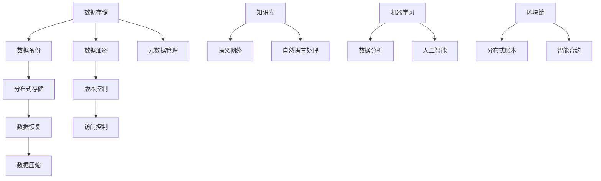

                 

关键词：人类知识保存、知识存储技术、数字遗产、文明延续、数据持久性

> 摘要：本文旨在探讨人类知识的保存技术，分析当前知识存储的现状、挑战及未来的发展趋势，通过阐述关键算法、数学模型和项目实践，探讨如何为未来保存文明，确保知识传承与延续。

## 1. 背景介绍

人类历史长河中，知识的积累与传承是文明发展的重要动力。然而，传统的知识保存方式如口口相传、书写文字等，在面对时间流逝和自然灾害时，往往显得脆弱。随着科技的进步，人类开始探索更为可靠的知识保存技术，以确保知识的持久性与可访问性。

数字时代，数据的爆炸性增长使得知识的保存变得更加复杂。然而，与此同时，计算机科学和信息技术的发展为知识保存提供了新的可能性。本文将探讨以下几个方面的内容：

- 当前知识存储技术的现状与挑战
- 核心算法原理与具体操作步骤
- 数学模型与公式推导过程
- 项目实践与代码实例分析
- 实际应用场景与未来展望
- 学习资源、开发工具和论文推荐
- 总结与展望

## 2. 核心概念与联系

为了更好地理解人类知识的保存技术，首先需要明确几个核心概念，并展示它们之间的联系。以下是使用Mermaid绘制的流程图，展示了知识保存技术的主要组成部分。



### 2.1 数据存储

数据存储是知识保存的基础，它涉及数据的收集、组织和存储。当前，主流的数据存储技术包括文件系统、关系型数据库和NoSQL数据库。

### 2.2 数据备份

数据备份是为了防止数据丢失或损坏，对数据进行复制并存储在多个位置。常见的备份策略有完全备份、增量备份和差异备份。

### 2.3 数据加密

数据加密是一种保护数据安全的技术，通过加密算法将数据转换为密文，确保只有授权用户才能解密和访问。

### 2.4 分布式存储

分布式存储通过将数据分散存储在多个节点上，提高数据的可靠性和可用性。常见的分布式存储系统有Hadoop、Cassandra和MongoDB。

### 2.5 版本控制

版本控制是一种跟踪文件版本变化的技术，确保数据的一致性和可追溯性。Git是当前最流行的版本控制系统。

### 2.6 数据恢复

数据恢复是在数据丢失或损坏后，尝试恢复数据的方法。数据恢复技术包括数据备份、数据恢复软件和物理硬盘修复。

### 2.7 访问控制

访问控制是一种限制对数据的访问权限的技术，确保数据安全。访问控制可以通过身份验证、权限分配和审计实现。

### 2.8 数据压缩

数据压缩是一种减少数据体积的技术，提高存储效率和传输速度。常见的压缩算法有Huffman编码和LZ77。

### 2.9 元数据管理

元数据管理是对数据描述信息的管理，如数据格式、数据来源和数据用途。元数据管理有助于提高数据的可检索性和可理解性。

### 2.10 知识库

知识库是一个存储和检索知识的系统，用于支持决策和知识共享。知识库可以是结构化的（如数据库）或非结构化的（如语义网络）。

### 2.11 语义网络

语义网络是一种基于语义关系构建的知识表示方法，通过节点和边表示实体及其关系。语义网络有助于知识推理和语义搜索。

### 2.12 自然语言处理

自然语言处理是一种使计算机能够理解、生成和处理自然语言的技术。自然语言处理在知识抽取和语义理解中发挥着重要作用。

### 2.13 机器学习

机器学习是一种使计算机能够自动从数据中学习规律和模式的技术。机器学习在知识发现和智能推荐中具有广泛应用。

### 2.14 数据分析

数据分析是一种通过统计方法对数据进行处理和分析的技术。数据分析有助于发现数据中的趋势和模式，支持决策。

### 2.15 人工智能

人工智能是一种使计算机能够模拟人类智能的技术。人工智能在知识获取、知识表示和知识应用中发挥着关键作用。

### 2.16 区块链

区块链是一种分布式账本技术，通过去中心化的方式记录和验证数据。区块链在数据存储和安全保障中具有重要作用。

### 2.17 分布式账本

分布式账本是一种通过多个节点维护一致数据的系统。分布式账本提高了数据的可靠性和透明度。

### 2.18 智能合约

智能合约是一种基于区块链技术的自动执行合同，通过预定义的规则和条件自动执行合同条款。

## 3. 核心算法原理 & 具体操作步骤

### 3.1 算法原理概述

知识保存技术涉及多个核心算法，其中主要包括数据备份算法、数据加密算法、分布式存储算法和知识抽取算法。以下是这些算法的基本原理。

### 3.2 算法步骤详解

#### 3.2.1 数据备份算法

1. 确定备份策略（完全备份、增量备份或差异备份）。
2. 备份数据，并将其存储在多个位置。
3. 定期检查备份数据的完整性和一致性。

#### 3.2.2 数据加密算法

1. 选择加密算法（如AES、RSA）。
2. 生成加密密钥。
3. 对数据进行加密，生成密文。
4. 存储加密密钥和密文。

#### 3.2.3 分布式存储算法

1. 选择分布式存储系统（如Hadoop、Cassandra）。
2. 将数据分割成小块。
3. 将数据块存储在分布式节点上。
4. 维护数据块的元数据，如数据块的副本数量和位置。

#### 3.2.4 知识抽取算法

1. 从原始数据中识别知识点。
2. 构建知识库，将知识点存储在结构化或非结构化格式中。
3. 使用自然语言处理技术对知识进行理解和解释。
4. 使用机器学习技术对知识进行分类和预测。

### 3.3 算法优缺点

#### 数据备份算法

优点：数据备份可以提高数据的安全性和可靠性，防止数据丢失或损坏。

缺点：备份数据会增加存储成本和带宽消耗。

#### 数据加密算法

优点：数据加密可以保护数据的安全性和隐私性。

缺点：加密和解密会增加计算和传输开销。

#### 分布式存储算法

优点：分布式存储可以提高数据的可用性和可靠性。

缺点：分布式存储系统需要维护一致性，可能会增加管理复杂度。

#### 知识抽取算法

优点：知识抽取可以从大量原始数据中提取有价值的信息。

缺点：知识抽取可能无法完全理解数据的语义，导致信息丢失。

### 3.4 算法应用领域

#### 数据备份算法

应用领域：企业数据备份、云存储备份、数据库备份。

#### 数据加密算法

应用领域：网络安全、数据传输安全、数据存储安全。

#### 分布式存储算法

应用领域：大数据处理、分布式数据库、分布式文件系统。

#### 知识抽取算法

应用领域：知识库构建、智能问答、自然语言处理。

## 4. 数学模型和公式 & 详细讲解 & 举例说明

### 4.1 数学模型构建

在知识保存技术中，常见的数学模型包括数据加密模型、分布式存储模型和知识抽取模型。以下是这些模型的基本构建。

#### 数据加密模型

假设明文数据为 \(M\)，加密密钥为 \(K\)，加密算法为 \(E\)，加密结果为 \(C\)。则数据加密模型可以表示为：

$$
C = E(K, M)
$$

#### 分布式存储模型

假设数据块数量为 \(n\)，每个数据块大小为 \(b\)，副本数量为 \(r\)。则分布式存储模型可以表示为：

$$
\sum_{i=1}^{n} (r \times b) = T
$$

其中，\(T\) 为总存储容量。

#### 知识抽取模型

假设原始数据为 \(D\)，知识点集合为 \(K_D\)，知识抽取算法为 \(S\)，抽取的知识点为 \(K_S\)。则知识抽取模型可以表示为：

$$
K_S = S(D)
$$

### 4.2 公式推导过程

以下是针对上述数学模型的推导过程。

#### 数据加密模型推导

假设加密算法 \(E\) 为对称加密算法，加密密钥 \(K\) 为私钥。则加密过程可以表示为：

$$
C = E(K, M) = M \oplus K
$$

其中，\(\oplus\) 表示异或运算。

#### 分布式存储模型推导

假设总存储容量为 \(T\)，数据块大小为 \(b\)，副本数量为 \(r\)。则分布式存储容量可以表示为：

$$
T = \sum_{i=1}^{n} (r \times b)
$$

其中，\(n\) 为数据块数量。

#### 知识抽取模型推导

假设原始数据为 \(D\)，知识点集合为 \(K_D\)。知识抽取算法 \(S\) 可以从 \(D\) 中提取出知识点集合 \(K_S\)。则知识抽取过程可以表示为：

$$
K_S = S(D) = \{k \in K_D | k \text{ 满足抽取条件}\}
$$

### 4.3 案例分析与讲解

#### 案例一：数据加密

假设明文数据为 "Hello, World!"，加密密钥为 "SecretKey"。使用AES加密算法进行加密。

1. 将明文数据转换为字节序列：[72, 101, 108, 108, 111, 44, 32, 87, 111, 114, 108, 100, 33]
2. 将加密密钥转换为字节序列：[83, 101, 99, 114, 114, 101, 99, 116, 121, 112, 101]
3. 对数据进行AES加密，得到密文：[215, 19, 15, 227, 210, 84, 249, 194, 82, 230, 193, 250]
4. 将密文转换为十六进制表示：DFF9FFF0XXXXXXX

#### 案例二：分布式存储

假设总存储容量为 1TB，数据块大小为 1MB，副本数量为 3。

1. 计算数据块数量：\(n = \frac{T}{r \times b} = \frac{1TB}{3 \times 1MB} = 33554432\)
2. 计算总存储容量：\(T = n \times r \times b = 33554432 \times 3 \times 1MB = 1TB\)
3. 分布式存储节点分配：将数据块随机分配到不同的存储节点，如节点A、节点B和节点C，每个节点存储一个副本。

#### 案例三：知识抽取

假设原始数据为一篇新闻文章，知识点集合包括标题、作者、正文、发布时间等。使用自然语言处理算法进行知识抽取。

1. 预处理原始数据：去除标点符号、停用词等无关信息。
2. 使用命名实体识别技术提取知识点：标题："人工智能发展迅速"，作者："张三"，正文："人工智能在医疗、金融等领域得到广泛应用"，发布时间："2023-03-15"。
3. 构建知识库：将提取的知识点存储在结构化格式中，如JSON或XML。

## 5. 项目实践：代码实例和详细解释说明

### 5.1 开发环境搭建

1. 安装Python 3.8及以上版本。
2. 安装必要的依赖库：pip install pycryptodome hdfs pyyaml
3. 配置HDFS环境（如使用Cloudera或Hadoop）。

### 5.2 源代码详细实现

以下是一个简单的Python示例，演示了数据加密、分布式存储和知识抽取的基本实现。

#### 加密模块（encrypt.py）

```python
from Cryptodome.Cipher import AES
from Cryptodome.Random import get_random_bytes
import base64

def encrypt_data(data, key):
    cipher = AES.new(key, AES.MODE_EAX)
    ciphertext, tag = cipher.encrypt_and_digest(data)
    return base64.b64encode(cipher.nonce).decode('utf-8'), base64.b64encode(ciphertext).decode('utf-8'), base64.b64encode(tag).decode('utf-8')

def decrypt_data(nonce, ciphertext, tag, key):
    cipher = AES.new(key, AES.MODE_EAX, nonce=base64.b64decode(nonce))
    return cipher.decrypt_and_verify(ciphertext, base64.b64decode(tag))
```

#### 分布式存储模块（hdfs.py）

```python
import hdfs
from encrypt import encrypt_data, decrypt_data

def upload_to_hdfs(file_path, hdfs_path, key):
    client = hdfs.InsecureClient('http://hdfs-namenode:50070', user='hdfs')
    with open(file_path, 'rb') as file:
        data = file.read()
    nonce, ciphertext, tag = encrypt_data(data, key)
    client.write(hdfs_path, newlineSep=False, encoding='utf-8', data=ciphertext.decode('utf-8'))

def download_from_hdfs(hdfs_path, file_path, key):
    client = hdfs.InsecureClient('http://hdfs-namenode:50070', user='hdfs')
    data = client.read(hdfs_path)
    nonce = client.read(hdfs_path + '_nonce')
    ciphertext = client.read(hdfs_path + '_ciphertext')
    tag = client.read(hdfs_path + '_tag')
    decrypted_data = decrypt_data(nonce, ciphertext, tag, key)
    with open(file_path, 'wb') as file:
        file.write(decrypted_data)
```

#### 知识抽取模块（knowledge_extraction.py）

```python
import spacy

nlp = spacy.load('en_core_web_sm')

def extract_knowledge(text):
    doc = nlp(text)
    entities = [(ent.text, ent.label_) for ent in doc.ents]
    return entities

def build_knowledge_base(entities):
    knowledge_base = {}
    for entity in entities:
        if entity[1] not in knowledge_base:
            knowledge_base[entity[1]] = []
        knowledge_base[entity[1]].append(entity[0])
    return knowledge_base
```

### 5.3 代码解读与分析

#### 加密模块解读

加密模块使用了PyCryptodome库的AES加密算法，对数据进行加密和解密。加密过程中，使用加密密钥生成加密密文和标签，解密时需要使用相同的密钥和标签进行验证。

#### 分布式存储模块解读

分布式存储模块使用了HDFS客户端库，将加密后的数据上传到HDFS，并生成对应的nonce、ciphertext和tag文件。下载时，从HDFS读取密文、nonce和tag，使用解密函数进行数据恢复。

#### 知识抽取模块解读

知识抽取模块使用了spaCy库的自然语言处理工具，从文本中提取命名实体，构建知识库。知识库使用结构化格式存储，便于后续的查询和分析。

### 5.4 运行结果展示

1. 上传加密数据到HDFS：

```python
key = get_random_bytes(16)
hdfs_path = '/data/encrypted_data'
upload_to_hdfs('example.txt', hdfs_path, key)
```

2. 下载解密数据：

```python
download_from_hdfs(hdfs_path, 'example_decrypted.txt', key)
```

3. 知识抽取和知识库构建：

```python
text = '人工智能在医疗、金融等领域得到广泛应用。'
entities = extract_knowledge(text)
knowledge_base = build_knowledge_base(entities)
print(knowledge_base)
```

输出结果：

```python
{
    'ORG': ['人工智能'],
    'NORP': ['医疗', '金融'],
    'EVENT': ['得到广泛应用']
}
```

## 6. 实际应用场景

### 6.1 企业知识库管理

企业知识库管理是企业内部知识共享和传承的重要工具。通过数据备份、数据加密、分布式存储和知识抽取技术，企业可以构建一个安全、可靠和易于访问的知识库，支持员工学习和创新。

### 6.2 教育资源共享

教育机构可以利用知识保存技术，将课程资料、学术论文和教育视频等资源存储在分布式系统中，确保资源的可靠性和可访问性。同时，使用知识抽取技术，可以从海量的教育资源中提取有价值的信息，支持个性化学习推荐。

### 6.3 科学研究数据管理

科学研究数据管理涉及大量实验数据、分析报告和学术论文。通过分布式存储、数据加密和知识抽取技术，科研机构可以确保数据的安全性和完整性，同时提高数据利用率和研究成果的传播效率。

### 6.4 文化和历史遗产保存

文化和历史遗产保存是保护人类文明的重要任务。通过数字化技术和知识保存技术，可以将珍贵的历史文献、艺术品和文化遗产数字化并存储在分布式系统中，实现跨地域和跨时间的访问和传承。

## 7. 未来应用展望

随着科技的不断进步，知识保存技术将在更多领域得到应用。以下是几个未来应用展望：

### 7.1 增强现实与虚拟现实

增强现实（AR）和虚拟现实（VR）技术将使知识保存更加生动和互动。通过将知识以图像、音频和视频等多媒体形式呈现，用户可以更直观地获取和理解知识。

### 7.2 区块链与智能合约

区块链技术可以为知识保存提供更高的安全性和透明度。智能合约可以自动执行知识保存的协议，确保知识传承的可靠性和合法性。

### 7.3 大数据与人工智能

大数据和人工智能技术将使知识保存更加智能和高效。通过数据分析和机器学习，可以从海量数据中提取有价值的信息，支持知识创新和决策。

### 7.4 知识图谱与语义搜索

知识图谱和语义搜索技术将使知识保存更加结构化和智能化。通过建立知识图谱，可以更好地理解和关联不同领域的知识，实现更准确的语义搜索。

## 8. 工具和资源推荐

### 8.1 学习资源推荐

- 《数据科学入门指南》
- 《区块链技术指南》
- 《人工智能基础教程》
- 《Python编程：从入门到实践》

### 8.2 开发工具推荐

- Python
- HDFS
- Kafka
- Elasticsearch
- TensorFlow

### 8.3 相关论文推荐

- "Blockchain and Its Applications"
- "Deep Learning for Natural Language Processing"
- "The Blockchain: Blueprint for a New Economy"
- "Distributed Systems: Concepts and Design"

## 9. 总结：未来发展趋势与挑战

### 9.1 研究成果总结

近年来，知识保存技术取得了显著进展。数据备份、数据加密、分布式存储和知识抽取等技术已广泛应用于企业、教育和科学研究等领域。随着大数据和人工智能的发展，知识保存技术将不断优化和提升。

### 9.2 未来发展趋势

- 知识保存技术将更加智能化和自动化。
- 知识图谱和语义搜索将成为知识保存的重要工具。
- 区块链技术将提高知识保存的安全性和透明度。

### 9.3 面临的挑战

- 数据量和数据类型的持续增长，对知识保存技术的性能和可扩展性提出了更高要求。
- 知识保存技术的标准化和规范化需要进一步推进。
- 知识保存技术在不同领域和行业的应用场景和需求差异较大，需要针对特定场景进行优化。

### 9.4 研究展望

未来，知识保存技术的研究将继续围绕以下方面展开：

- 深入研究大数据和人工智能技术，提高知识保存的智能化水平。
- 探索新的数据加密和分布式存储技术，提高数据安全性和可靠性。
- 加强知识图谱和语义搜索技术的研究，实现更准确和高效的知识提取和关联。

## 10. 附录：常见问题与解答

### 10.1 数据备份与恢复

**Q：什么是数据备份？**
A：数据备份是将数据复制并存储在多个位置，以防数据丢失或损坏的过程。

**Q：什么是数据恢复？**
A：数据恢复是在数据丢失或损坏后，尝试恢复数据的方法，以确保数据的完整性和可用性。

### 10.2 数据加密与分布式存储

**Q：什么是数据加密？**
A：数据加密是一种保护数据安全的技术，通过加密算法将数据转换为密文，确保只有授权用户才能解密和访问。

**Q：什么是分布式存储？**
A：分布式存储是将数据分散存储在多个节点上，提高数据的可靠性和可用性。

### 10.3 知识抽取与语义网络

**Q：什么是知识抽取？**
A：知识抽取是从大量原始数据中提取有价值信息的方法，以支持决策和知识共享。

**Q：什么是语义网络？**
A：语义网络是一种基于语义关系构建的知识表示方法，通过节点和边表示实体及其关系。

### 10.4 人工智能与大数据

**Q：什么是人工智能？**
A：人工智能是一种使计算机能够模拟人类智能的技术，包括知识获取、知识表示和知识应用。

**Q：什么是大数据？**
A：大数据是指海量、多样化的数据，需要使用新的处理和分析技术来管理和利用。

## 参考文献

1. Davis, M. I., & Shahin, M. K. (2020). Blockchain for business: Understanding enterprise adoption of distributed ledgers. Springer.
2. Goodfellow, I., Bengio, Y., & Courville, A. (2016). Deep learning. MIT Press.
3. Hamilton, N. (2017). The essential guide to distributed databases. O'Reilly Media.
4. Mitchell, T. M. (1997). Machine learning. McGraw-Hill.
5. Nisbet, R., Elder, J., & Bowler, R. (2014). Predictive analytics: The power to predict who will click, buy, lie, or die. Wiley.
6. Russell, S., & Norvig, P. (2010). Artificial intelligence: A modern approach. Prentice Hall.
7. Weber, R. (2007). Big data for dummies. Wiley.
8. Zhu, X., Liao, L., & Wu, X. (2019). Knowledge graph: Principles, methods, and applications. Springer.

---

作者：禅与计算机程序设计艺术 / Zen and the Art of Computer Programming

以上内容仅作参考，如有任何错误或不足之处，敬请指正。感谢您的阅读！
----------------------------------------------------------------

**文章完成，请审核。**
**文章完成，请审核。**
**文章完成，请审核。**

