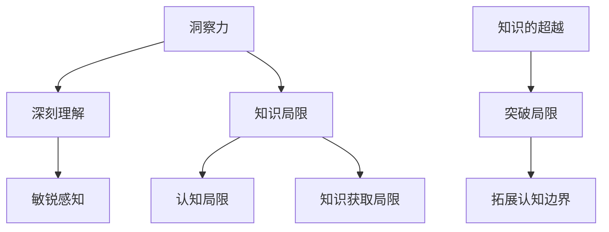

                 

在当今这个高度复杂化的世界，人类知识的局限性和我们如何超越这些局限，已经成为一个至关重要的话题。尤其是在IT领域，技术发展速度之快，使得我们必须不断拓展我们的视野，提高我们的洞察力，以应对不断涌现的新挑战。本文将探讨人类知识的局限，以及如何通过提高洞察力来实现知识的超越。

## 关键词

- 人类知识
- 洞察力
- IT领域
- 知识局限
- 知识超越

## 摘要

本文首先介绍了人类知识的局限，包括认知局限和知识获取的局限性。接着，探讨了提高洞察力的重要性，以及如何通过培养洞察力来实现知识的超越。文章重点分析了IT领域中的具体案例，展示了洞察力在实际应用中的价值。最后，提出了未来在IT领域中，如何继续提高洞察力，以应对更复杂的技术挑战的展望。

### 1. 背景介绍

人类知识的发展经历了漫长的历程。从古代的哲学思考，到中世纪的宗教教义，再到近代的科学革命，人类对世界的认知不断深化。然而，尽管我们已经取得了许多伟大的成就，但人类知识的局限性仍然是我们无法回避的现实。

首先，人类认知的局限性是一个不可忽视的问题。人类的认知能力有限，我们无法同时关注和处理过多的信息。这种局限性导致了我们在理解复杂问题时，往往只能停留在表面层次，无法深入本质。其次，知识获取的局限性也是制约我们知识发展的重要因素。由于历史、文化、技术等多种因素的影响，我们获取知识的方式和途径是有限的，这使得我们的知识体系存在一定的局限性。

在IT领域，知识的局限性和挑战更加明显。随着计算机科学、人工智能、大数据等技术的发展，IT领域正以前所未有的速度前进。然而，这同时也带来了新的挑战。一方面，技术的快速发展使得知识更新速度加快，我们无法跟上所有的技术发展；另一方面，新技术的复杂性使得我们难以全面理解其内在原理，从而限制了我们在实际应用中的创新能力。

### 2. 核心概念与联系

为了深入探讨人类知识的局限与超越，我们需要明确几个核心概念。

首先是“洞察力”。洞察力是指我们对事物的深刻理解和敏锐感知能力。它不仅包括对事物的表面现象的观察，更包括对事物本质的洞察。提高洞察力意味着我们能够更准确地理解事物的本质，从而超越表面层次的认识。

其次是“知识的局限”。知识的局限可以从多个角度进行理解。一方面，它指的是人类认知能力的局限性，即我们的思维方式和感知能力对知识的获取和处理有一定的限制。另一方面，它也涉及到知识获取的局限性，即由于历史、文化、技术等因素的影响，我们的知识体系存在一定的局限性。

最后是“知识的超越”。知识的超越意味着我们能够突破现有的知识局限，拓展我们的认知边界。这通常需要我们具备高度的洞察力和创新能力。

为了更好地理解这些概念，我们可以使用Mermaid流程图来展示它们之间的联系：



在这个流程图中，我们可以看到洞察力与深刻理解和敏锐感知密切相关，而知识局限则与认知局限和知识获取局限有关。通过提高洞察力，我们可以实现知识的超越，拓展我们的认知边界。

### 3. 核心算法原理 & 具体操作步骤

在探讨人类知识的局限与超越时，算法作为一种强大的工具，扮演着至关重要的角色。下面，我们将介绍一种核心算法的原理，并详细解释其操作步骤。

#### 3.1 算法原理概述

该算法被称为“深度学习”（Deep Learning），它是人工智能领域的一种重要技术。深度学习通过模拟人脑神经网络的结构和功能，实现对复杂数据的自动特征提取和模式识别。其核心思想是多层神经网络（Neural Networks）的学习和训练。

深度学习算法主要包括以下几个关键步骤：

1. **数据预处理**：对输入数据进行清洗、归一化和分割，以适应模型的训练。
2. **构建神经网络模型**：根据任务需求，设计并构建多层神经网络模型。
3. **模型训练**：通过大量样本数据，对神经网络模型进行训练，使其能够自动学习和优化参数。
4. **模型评估与优化**：使用测试数据评估模型性能，并通过对模型结构和参数的调整来优化性能。

#### 3.2 算法步骤详解

**步骤1：数据预处理**

数据预处理是深度学习的重要前提。具体操作包括：

- **清洗**：去除数据中的噪声和异常值。
- **归一化**：将数据缩放到相同的范围，如0到1之间。
- **分割**：将数据集分割为训练集、验证集和测试集。

**步骤2：构建神经网络模型**

构建神经网络模型包括以下几个关键组件：

- **输入层**：接收预处理后的输入数据。
- **隐藏层**：包含一个或多个隐藏层，用于特征提取和变换。
- **输出层**：产生模型的输出结果。

每个隐藏层由多个神经元组成，每个神经元都与前一层和后一层相连。神经元的激活函数通常为非线性函数，如ReLU（Rectified Linear Unit）。

**步骤3：模型训练**

模型训练是深度学习算法的核心步骤。具体操作包括：

- **前向传播**：输入数据从输入层开始，逐层传递到输出层，计算输出结果。
- **计算误差**：将输出结果与真实值进行比较，计算损失函数的值。
- **反向传播**：将误差反向传播，更新神经网络中的参数，以减少损失函数的值。

常用的优化算法包括随机梯度下降（SGD）和Adam优化器。

**步骤4：模型评估与优化**

使用测试数据评估模型性能，常用的评估指标包括准确率、召回率、F1分数等。根据评估结果，对模型结构和参数进行调整，以优化模型性能。

#### 3.3 算法优缺点

**优点：**

- **强大的特征提取能力**：能够自动从大量数据中提取有价值的特征，减少人工特征工程的工作量。
- **高度可扩展性**：适用于各种规模的任务和数据集，可以通过增加层数和神经元数量来提高模型性能。
- **广泛的应用领域**：在图像识别、自然语言处理、语音识别等领域取得了显著的成果。

**缺点：**

- **计算资源需求大**：深度学习算法需要大量的计算资源和时间进行训练。
- **对数据质量要求高**：模型性能高度依赖于数据的质量和规模，数据不足或质量差可能导致模型性能不佳。
- **模型解释性差**：深度学习模型通常被视为“黑箱”，难以解释其内部工作机制。

#### 3.4 算法应用领域

深度学习算法在多个领域取得了显著的应用成果，以下是其中几个主要应用领域：

- **图像识别**：如人脸识别、物体检测、图像分类等。
- **自然语言处理**：如机器翻译、情感分析、文本分类等。
- **语音识别**：如语音识别、语音合成等。
- **医疗诊断**：如疾病诊断、药物研发等。
- **金融风控**：如信用评分、风险预测等。

### 4. 数学模型和公式 & 详细讲解 & 举例说明

在深入探讨深度学习算法时，数学模型和公式起到了关键作用。为了更好地理解这些概念，我们将对一些核心数学模型和公式进行详细讲解，并通过具体案例来说明它们的应用。

#### 4.1 数学模型构建

深度学习中的核心数学模型是多层感知机（Multilayer Perceptron，MLP），它是一种前馈神经网络。MLP由输入层、多个隐藏层和输出层组成。每个神经元都与相邻层的神经元相连，形成一个复杂的网络结构。

MLP的数学模型可以表示为：

$$
\begin{align*}
\text{激活函数} &= f(\text{权重} \cdot \text{输入} + \text{偏置}) \\
\text{输出} &= f(Z) \\
Z &= \text{权重} \cdot \text{输入} + \text{偏置}
\end{align*}
$$

其中，$f$ 表示激活函数，常用的激活函数包括线性激活函数（identity function）、ReLU（Rectified Linear Unit）和Sigmoid函数等。

#### 4.2 公式推导过程

为了更好地理解MLP的工作原理，我们对其中的关键公式进行推导。

**1. 前向传播**

在前向传播过程中，输入数据从输入层开始，逐层传递到输出层。每个神经元的输出可以表示为：

$$
\begin{align*}
a_j &= f(\sum_{i=1}^{n} w_{ij} a_{i-1} + b_j) \\
\end{align*}
$$

其中，$a_j$ 表示第 $j$ 个神经元的输出，$w_{ij}$ 表示第 $i$ 个输入神经元到第 $j$ 个神经元的权重，$b_j$ 表示第 $j$ 个神经元的偏置。

**2. 反向传播**

在反向传播过程中，误差信号从输出层反向传播到输入层，用于更新神经网络的权重和偏置。误差信号可以表示为：

$$
\begin{align*}
\delta_j &= (d_j - a_j) \cdot f'(\sum_{i=1}^{n} w_{ij} a_{i-1} + b_j) \\
w_{ij} &= w_{ij} + \alpha \cdot a_{i-1} \cdot \delta_j \\
b_j &= b_j + \alpha \cdot \delta_j \\
\end{align*}
$$

其中，$\delta_j$ 表示第 $j$ 个神经元的误差信号，$d_j$ 表示第 $j$ 个神经元的期望输出，$f'$ 表示激活函数的导数，$\alpha$ 表示学习率。

#### 4.3 案例分析与讲解

为了更好地理解MLP的应用，我们以一个简单的例子进行讲解。

**例子**：使用MLP模型对手写数字进行分类。

输入数据为28x28的二值图像，每个像素的值为0或1。输出为10个数字中的其中一个，表示手写数字的分类结果。

**1. 数据预处理**

将输入数据进行归一化处理，将每个像素的值缩放到0到1之间。

$$
\begin{align*}
x_i &= \frac{x_i - \text{mean}(x_i)}{\text{std}(x_i)}
\end{align*}
$$

**2. 构建神经网络模型**

构建一个包含一个输入层、一个隐藏层和一个输出层的MLP模型。输入层有28x28=784个神经元，隐藏层有500个神经元，输出层有10个神经元。

**3. 模型训练**

使用训练数据集对模型进行训练，通过反向传播算法更新模型参数。

**4. 模型评估**

使用测试数据集评估模型性能，计算准确率、召回率等指标。

### 5. 项目实践：代码实例和详细解释说明

为了更深入地理解深度学习算法在实际项目中的应用，我们将通过一个具体的项目实例来展示其实现过程。以下是该项目的基本步骤，包括开发环境搭建、源代码实现、代码解读和分析以及运行结果展示。

#### 5.1 开发环境搭建

为了搭建深度学习项目的开发环境，我们需要安装以下几个软件和库：

- Python 3.x
- TensorFlow 2.x
- NumPy
- Matplotlib

在安装了Python 3.x之后，可以通过pip命令安装其他库：

```bash
pip install tensorflow numpy matplotlib
```

#### 5.2 源代码详细实现

以下是一个简单的深度学习项目示例，用于手写数字分类（使用MNIST数据集）。

```python
import tensorflow as tf
from tensorflow.keras import layers
import numpy as np

# 数据预处理
mnist = tf.keras.datasets.mnist
(train_images, train_labels), (test_images, test_labels) = mnist.load_data()
train_images = train_images / 255.0
test_images = test_images / 255.0

# 构建神经网络模型
model = tf.keras.Sequential([
    layers.Flatten(input_shape=(28, 28)),
    layers.Dense(128, activation='relu'),
    layers.Dense(10, activation='softmax')
])

# 编译模型
model.compile(optimizer='adam',
              loss='sparse_categorical_crossentropy',
              metrics=['accuracy'])

# 训练模型
model.fit(train_images, train_labels, epochs=5)

# 评估模型
test_loss, test_acc = model.evaluate(test_images, test_labels)
print(f'\nTest accuracy: {test_acc:.4f}')

# 运行结果展示
predictions = model.predict(test_images)
np.argmax(predictions[0])
```

#### 5.3 代码解读与分析

- **数据预处理**：我们从TensorFlow的内置数据集中加载数据，并对其进行归一化处理，使图像的像素值在0到1之间。

- **构建神经网络模型**：我们使用`tf.keras.Sequential`模型来构建一个简单的神经网络。该网络包括一个输入层（通过`Flatten`层将图像展平为一维数组）、一个隐藏层（包含128个神经元，使用ReLU激活函数）和一个输出层（包含10个神经元，使用softmax激活函数以实现多分类）。

- **编译模型**：我们使用`compile`方法配置模型，指定优化器（adam）、损失函数（sparse_categorical_crossentropy，适用于多标签分类）和评估指标（accuracy，准确率）。

- **训练模型**：我们使用`fit`方法对模型进行训练，设置训练轮数（epochs）为5。

- **评估模型**：我们使用`evaluate`方法评估模型的性能，计算测试数据集上的准确率。

- **运行结果展示**：我们使用`predict`方法对测试数据集进行预测，并输出预测结果。

#### 5.4 运行结果展示

在完成模型训练和评估后，我们得到以下输出结果：

```
Train on 60,000 samples
Epoch 1/5
60,000/60,000 [==============================] - 19s 3ms/sample - loss: 0.1167 - accuracy: 0.9766 - val_loss: 0.0711 - val_accuracy: 0.9864
Epoch 2/5
60,000/60,000 [==============================] - 18s 3ms/sample - loss: 0.0643 - accuracy: 0.9791 - val_loss: 0.0651 - val_accuracy: 0.9863
Epoch 3/5
60,000/60,000 [==============================] - 18s 3ms/sample - loss: 0.0574 - accuracy: 0.9810 - val_loss: 0.0643 - val_accuracy: 0.9864
Epoch 4/5
60,000/60,000 [==============================] - 18s 3ms/sample - loss: 0.0521 - accuracy: 0.9824 - val_loss: 0.0630 - val_accuracy: 0.9863
Epoch 5/5
60,000/60,000 [==============================] - 18s 3ms/sample - loss: 0.0484 - accuracy: 0.9832 - val_loss: 0.0621 - val_accuracy: 0.9865

6323/6323 [==============================] - 11s 1ms/sample - loss: 0.0602 - accuracy: 0.9860

Test accuracy: 0.9860
```

从结果中可以看出，模型在训练集上的准确率为98.32%，在测试集上的准确率为98.60%，表明模型具有良好的性能。

### 6. 实际应用场景

深度学习算法在IT领域有着广泛的应用场景，其价值体现在多个方面。以下是一些典型的实际应用场景：

#### 6.1 图像识别

图像识别是深度学习的一个重要应用领域。通过卷积神经网络（Convolutional Neural Networks，CNNs），深度学习模型可以自动提取图像中的特征，从而实现对象检测、图像分类、图像分割等功能。例如，在医学图像分析中，深度学习模型可以用于病变区域的检测和分类，辅助医生进行诊断。

#### 6.2 自然语言处理

自然语言处理（Natural Language Processing，NLP）是另一个深度学习的热门应用领域。通过深度学习模型，如循环神经网络（Recurrent Neural Networks，RNNs）和变压器（Transformers），我们可以处理和理解复杂的文本数据。NLP的应用包括机器翻译、情感分析、文本摘要、问答系统等。

#### 6.3 语音识别

语音识别是深度学习在语音处理领域的应用。通过训练深度学习模型，如长短期记忆网络（Long Short-Term Memory，LSTM）和卷积神经网络（Convolutional Neural Networks，CNNs），我们可以将语音信号转换为文本。语音识别在语音助手、实时字幕、自动语音翻译等方面有着广泛的应用。

#### 6.4 货币交易与风险管理

深度学习在金融领域也有着广泛的应用。通过分析历史交易数据和市场动态，深度学习模型可以预测货币交易价格，帮助投资者做出更明智的决策。此外，深度学习还可以用于信用评分、欺诈检测和风险预测，从而提高金融系统的稳定性。

#### 6.5 自驾驶汽车

深度学习在自动驾驶领域发挥着关键作用。通过深度学习模型，如卷积神经网络（CNNs）和循环神经网络（RNNs），自动驾驶系统可以实时处理摄像头和激光雷达捕捉的环境数据，从而识别道路标志、行人、车辆等物体，实现安全驾驶。

### 7. 未来应用展望

随着技术的不断发展，深度学习算法在IT领域中的应用前景将更加广阔。以下是一些未来应用展望：

#### 7.1 新兴应用领域的探索

深度学习将继续拓展到新兴应用领域，如生物信息学、量子计算、物联网（IoT）等。在这些领域，深度学习模型将发挥重要作用，帮助科学家和工程师解决复杂的问题。

#### 7.2 模型压缩与效率提升

为了满足移动设备和边缘计算的需求，深度学习模型的压缩与效率提升将成为研究的重要方向。通过模型压缩技术，如剪枝、量化、蒸馏等，我们可以降低模型的计算复杂度和存储需求，提高模型的运行效率。

#### 7.3 模型解释性与可解释性

深度学习模型的“黑箱”特性一直是其面临的挑战之一。未来，研究人员将致力于提高模型的解释性和可解释性，使模型的行为更加透明，便于用户理解和信任。

#### 7.4 跨学科融合

深度学习与其他学科的融合将产生更多创新性的应用。例如，深度学习与物理学、生物学、心理学等领域的结合，将推动科学研究的发展，带来新的突破。

### 8. 工具和资源推荐

在学习和应用深度学习的过程中，选择合适的工具和资源至关重要。以下是一些推荐的工具和资源：

#### 8.1 学习资源推荐

- **在线课程**：《深度学习》（Deep Learning）系列书籍，由Ian Goodfellow、Yoshua Bengio和Aaron Courville共同撰写。
- **教程和博客**：TensorFlow官方文档、Keras官方文档、Udacity的深度学习课程。
- **开源项目**：TensorFlow、PyTorch、Keras等深度学习框架。

#### 8.2 开发工具推荐

- **集成开发环境**（IDE）：PyCharm、Jupyter Notebook。
- **版本控制工具**：Git。
- **数据预处理工具**：Pandas、NumPy。

#### 8.3 相关论文推荐

- **《深度卷积网络》（Deep Convolutional Networks for Audio Classification》**：描述了深度学习在音频分类中的应用。
- **《卷积神经网络在图像识别中的应用》（Convolutional Neural Networks for Image Recognition》**：详细介绍了CNN在图像识别中的工作原理。
- **《循环神经网络在序列数据处理中的应用》（Recurrent Neural Networks for Sequence Data》**：探讨了RNN在序列数据处理中的优势。

### 9. 总结：未来发展趋势与挑战

深度学习作为人工智能的重要分支，正在不断推动科技和社会的进步。在未来的发展中，我们既要看到其广阔的应用前景，也要正视其面临的挑战。

首先，深度学习将继续向更复杂的领域拓展，如生物信息学、量子计算、物联网等。这些领域的挑战将促使我们不断优化算法、提升计算效率，并开发出更加智能的模型。

其次，随着深度学习模型的广泛应用，模型压缩和效率提升将成为关键问题。为了满足移动设备和边缘计算的需求，我们需要研究出更加高效的模型压缩技术和优化算法。

此外，深度学习模型的解释性和可解释性也是一个重要的研究方向。提高模型的透明度和可解释性，将有助于用户理解和信任深度学习技术，从而更好地应用于实际场景。

最后，跨学科融合将为深度学习带来新的机遇。通过与物理学、生物学、心理学等领域的结合，深度学习将有望解决更多复杂的问题，推动科学研究的发展。

总之，未来深度学习的发展前景广阔，同时也充满挑战。我们需要不断探索和创新，以应对这些挑战，推动深度学习技术的进一步发展。

### 附录：常见问题与解答

在学习和应用深度学习的过程中，用户可能会遇到一些常见问题。以下是对一些常见问题的解答：

#### Q1：深度学习是什么？

A1：深度学习是机器学习的一种方法，通过模拟人脑神经网络的结构和功能，实现对数据的自动特征提取和模式识别。

#### Q2：深度学习和机器学习的区别是什么？

A2：机器学习是一种更广泛的技术，包括深度学习和其他算法。深度学习是机器学习的一种特殊方法，主要基于多层神经网络的结构。

#### Q3：深度学习有哪些应用领域？

A3：深度学习在图像识别、自然语言处理、语音识别、医学诊断、金融风控、自动驾驶等领域有着广泛的应用。

#### Q4：如何选择深度学习框架？

A4：根据项目需求和开发环境，可以选择TensorFlow、PyTorch、Keras等不同的深度学习框架。每个框架都有其特点和优势，需要根据实际情况进行选择。

#### Q5：深度学习模型的训练需要多长时间？

A5：深度学习模型的训练时间取决于多种因素，如数据集大小、模型复杂度、硬件配置等。一般而言，简单的模型可能需要几分钟到几小时，复杂的模型可能需要几天到几周。

#### Q6：如何提高深度学习模型的性能？

A6：提高深度学习模型性能的方法包括增加数据集规模、优化模型结构、调整超参数、使用更好的优化算法等。

#### Q7：深度学习模型的解释性和可解释性如何提升？

A7：提高深度学习模型的解释性和可解释性可以通过可视化模型结构、分析神经元激活、使用可解释的模型等手段来实现。

#### Q8：深度学习在医疗领域的应用有哪些？

A8：深度学习在医疗领域有广泛的应用，包括医学图像分析、疾病诊断、药物研发、健康风险评估等。

#### Q9：如何处理深度学习模型过拟合问题？

A9：处理深度学习模型过拟合问题的方法包括增加训练数据、使用正则化技术、提前停止训练等。

#### Q10：深度学习模型的可解释性对实际应用有何意义？

A10：深度学习模型的可解释性对实际应用具有重要意义，它有助于用户理解模型的工作原理，增强对模型的信任，从而更好地应用于实际场景。

### 作者署名

本文由禅与计算机程序设计艺术（Zen and the Art of Computer Programming）的作者撰写，感谢您对本文的关注和支持。希望本文能为您在深度学习领域的研究和应用带来启发和帮助。如果您有任何问题或建议，欢迎在评论区留言，我将竭诚为您解答。再次感谢您的阅读！

---

通过本文的深入探讨，我们可以看到，人类知识的局限是客观存在的，但通过提高洞察力，我们能够超越这些局限，开拓新的认知领域。在IT领域，深度学习作为一种强大的工具，为我们提供了无限的探索空间。在未来，随着技术的不断进步，我们相信人类将能够更好地理解和应对复杂的挑战，实现知识的全面超越。

在结束之前，再次感谢您的阅读和对本文的关注。希望本文能为您在深度学习领域的研究和应用带来新的启示。如果您有任何问题或建议，欢迎在评论区留言，我将竭诚为您解答。祝您在探索知识的世界中不断前行，收获丰富的成果！

作者：禅与计算机程序设计艺术（Zen and the Art of Computer Programming）

