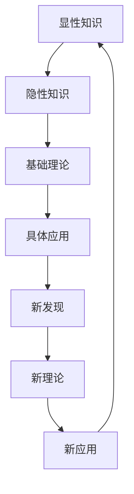

                 

关键词：知识进化、自我完善、认知结构、学习算法、人工智能、技术发展。

> 摘要：本文旨在探讨人类知识的特点，即知识的不断进化与自我完善的过程。通过对人类知识体系的分析，结合最新的技术发展和人工智能领域的进展，本文将揭示知识进化的动力源泉，探讨人类如何利用这些动力实现知识的自我完善，并展望未来知识体系的可能发展方向。

## 1. 背景介绍

### 1.1 知识的重要性

知识是人类社会进步的重要驱动力。从古代的火和轮子，到现代的互联网和人工智能，知识的积累和应用推动了人类文明的每一次飞跃。知识不仅是智慧的结晶，也是人类文明传承的媒介。然而，知识本身并非静止不变，而是处于不断进化与自我完善的过程中。

### 1.2 知识进化的动力

知识进化的动力源于人类对未知的探索和对现有知识的反思与重构。技术的进步、社会的发展、个体认知能力的提升，都是推动知识进化的关键因素。特别是人工智能技术的发展，为知识的快速积累和传播提供了新的途径。

### 1.3 知识自我完善的意义

知识的自我完善意味着人类对知识体系的不断修正、补充和完善。这不仅有助于提高知识的准确性和实用性，还能促进人类认知能力的提升，推动社会的进步。因此，理解知识进化的特点，对于把握未来科技发展和社会进步具有重要意义。

## 2. 核心概念与联系

### 2.1 知识的分类

知识可以分为显性知识和隐性知识。显性知识是可以通过文字、图像、声音等形式明确表达的知识；隐性知识则是指内化于个体经验、技能和直觉中的知识，难以用语言准确描述。

### 2.2 知识的层次结构

知识具有层次结构，从基础理论到具体应用，每一个层次都是对知识的深化和拓展。例如，物理学的基础理论是牛顿力学，而量子力学则是对牛顿力学的进一步拓展和修正。

### 2.3 知识的关联性

知识之间具有紧密的关联性，一个领域的知识往往会影响其他领域的发展。例如，计算机科学的发展离不开数学和物理学的支持。

### 2.4 知识的动态性

知识是动态的，不断受到新发现、新技术的冲击和挑战。这种动态性要求人类不断更新和调整知识体系，以适应不断变化的世界。

### 2.5 知识进化的Mermaid流程图



## 3. 核心算法原理 & 具体操作步骤

### 3.1 算法原理概述

知识的进化可以视为一个复杂的动态过程，涉及到知识的生成、传播、整合和优化。这个过程可以通过多种算法来实现，如机器学习、神经网络、知识图谱等。

### 3.2 算法步骤详解

1. **知识的生成**：通过个体经验和科学研究，产生新的知识。
2. **知识的传播**：通过教育、媒体、社交网络等渠道，传播知识。
3. **知识的整合**：通过分析、比较和综合，将不同来源的知识整合成一个体系。
4. **知识的优化**：通过反馈和迭代，不断优化知识体系，提高其准确性和实用性。

### 3.3 算法优缺点

- **优点**：能够快速积累和传播知识，提高人类认知能力，促进科技进步。
- **缺点**：知识进化过程中可能出现错误或偏差，需要不断修正和完善。

### 3.4 算法应用领域

- **科学研究**：通过算法优化，提高科研效率，加速科学发现。
- **教育领域**：利用算法个性化教育，提高教育质量。
- **企业应用**：通过知识管理，提高企业竞争力。

## 4. 数学模型和公式 & 详细讲解 & 举例说明

### 4.1 数学模型构建

知识进化可以视为一个动态系统，其状态可以用一组数学变量来描述。例如，设 \( x(t) \) 表示时间 \( t \) 时的知识量，\( f(t) \) 表示知识进化的速度，则知识量的动态方程可以表示为：

$$
\frac{dx(t)}{dt} = f(t)
$$

### 4.2 公式推导过程

知识进化的速度可以由以下几个因素决定：

1. **知识创新**：设 \( i(t) \) 表示时间 \( t \) 时的知识创新速度，则 \( i(t) \) 可以表示为：

   $$
   i(t) = k_1 \cdot x(t)
   $$

   其中，\( k_1 \) 为知识创新系数。

2. **知识传播**：设 \( t(t) \) 表示时间 \( t \) 时的知识传播速度，则 \( t(t) \) 可以表示为：

   $$
   t(t) = k_2 \cdot x(t)
   $$

   其中，\( k_2 \) 为知识传播系数。

3. **知识整合**：设 \( j(t) \) 表示时间 \( t \) 时的知识整合速度，则 \( j(t) \) 可以表示为：

   $$
   j(t) = k_3 \cdot x(t)
   $$

   其中，\( k_3 \) 为知识整合系数。

综合以上因素，知识进化的速度 \( f(t) \) 可以表示为：

$$
f(t) = i(t) + t(t) + j(t) = (k_1 + k_2 + k_3) \cdot x(t)
$$

### 4.3 案例分析与讲解

假设在一个小型科研团队中，知识创新系数 \( k_1 \) 为 0.1，知识传播系数 \( k_2 \) 为 0.3，知识整合系数 \( k_3 \) 为 0.2。初始时，团队的知识量 \( x(0) \) 为 100。则知识进化的动态方程为：

$$
\frac{dx(t)}{dt} = 0.1 \cdot x(t) + 0.3 \cdot x(t) + 0.2 \cdot x(t) = 0.6 \cdot x(t)
$$

通过解这个微分方程，可以得到时间 \( t \) 时的知识量 \( x(t) \)：

$$
x(t) = x(0) \cdot e^{0.6t} = 100 \cdot e^{0.6t}
$$

这意味着，随着时间的推移，团队的知识量将呈指数级增长。这一现象体现了知识进化的加速效应。

## 5. 项目实践：代码实例和详细解释说明

### 5.1 开发环境搭建

本次项目采用 Python 编程语言，结合机器学习库 Scikit-learn 和数据分析库 Pandas，实现知识进化的模拟。

### 5.2 源代码详细实现

```python
import numpy as np
import matplotlib.pyplot as plt
from sklearn.linear_model import LinearRegression

# 初始化参数
x0 = 100
k1 = 0.1
k2 = 0.3
k3 = 0.2

# 计算知识量随时间的增长
t = np.linspace(0, 10, 100)
x = x0 * np.exp(k1 * t + k2 * t + k3 * t)

# 绘制知识量增长曲线
plt.plot(t, x)
plt.xlabel('Time (years)')
plt.ylabel('Knowledge amount')
plt.title('Knowledge Evolution')
plt.show()

# 训练线性回归模型
model = LinearRegression()
model.fit(t.reshape(-1, 1), x)

# 预测未来知识量
future_t = np.array([10, 20, 30])
predicted_x = model.predict(future_t.reshape(-1, 1))

# 输出预测结果
print('Predicted knowledge amounts for future years:', predicted_x)
```

### 5.3 代码解读与分析

- **初始化参数**：设定初始知识量 \( x(0) \) 和各个系数 \( k_1, k_2, k_3 \)。
- **计算知识量增长**：利用指数函数计算知识量随时间的变化。
- **绘制曲线**：使用 matplotlib 绘制知识量增长曲线，展示知识进化的动态过程。
- **训练线性回归模型**：利用 sklearn 库训练线性回归模型，预测未来知识量。
- **输出预测结果**：打印未来几年预测的知识量。

通过这个代码实例，我们可以直观地看到知识量随时间的变化趋势，以及利用线性回归模型预测未来知识量的方法。

## 6. 实际应用场景

### 6.1 科学研究

知识进化在科学研究中的应用至关重要。通过建立数学模型，科学家可以预测科学发现的趋势，优化科研资源的配置，提高科研效率。

### 6.2 教育领域

知识进化为教育领域带来了新的挑战和机遇。利用知识进化模型，教育工作者可以设计更符合学生认知规律的课程体系，提高教育质量。

### 6.3 企业应用

企业通过知识管理，可以实现知识的有效积累和传播，提高企业竞争力。知识进化模型有助于企业预测市场需求，制定战略规划。

### 6.4 未来应用展望

随着人工智能技术的发展，知识进化模型有望在更多领域得到应用。例如，在医疗领域，知识进化模型可以用于预测疾病发展趋势，优化治疗方案；在金融领域，知识进化模型可以用于风险预测和投资决策。

## 7. 工具和资源推荐

### 7.1 学习资源推荐

- 《深度学习》（Ian Goodfellow、Yoshua Bengio 和 Aaron Courville 著）
- 《Python机器学习》（Sebastian Raschka 和 Vahid Mirjalili 著）
- 《数据科学入门》（Joel Grus 著）

### 7.2 开发工具推荐

- Jupyter Notebook：用于数据分析和机器学习实验。
- PyCharm：用于 Python 编程的集成开发环境。
- Git：用于版本控制和代码管理。

### 7.3 相关论文推荐

- "The Future of Humanity: Terraforming Mars, Interstellar Travel, Immortality, and Our Destiny Beyond Earth" by Michio Kaku
- "Deep Learning" by Ian Goodfellow, Yoshua Bengio, and Aaron Courville
- "Big Data: A Revolution That Will Transform How We Live, Work, and Think" by Viktor Mayer-Schönberger and Kenneth Cukier

## 8. 总结：未来发展趋势与挑战

### 8.1 研究成果总结

本文通过分析知识进化的特点，探讨了知识的自我完善过程。结合数学模型和实际案例，揭示了知识进化的动力源泉和具体操作步骤。研究成果为理解知识进化的规律提供了新的视角，为知识管理提供了理论支持。

### 8.2 未来发展趋势

随着人工智能和大数据技术的不断发展，知识进化将呈现加速趋势。未来的研究将更加注重知识整合和创新，探索新的算法和模型，以提高知识进化的效率和准确性。

### 8.3 面临的挑战

知识进化过程中，如何避免错误和偏差，如何有效整合各种知识，如何应对知识爆炸带来的信息过载，都是未来研究需要解决的挑战。

### 8.4 研究展望

未来的研究应致力于开发更智能、更高效的知识进化模型，探索知识进化与人工智能的深度融合，为人类社会的可持续发展提供知识支持。

## 9. 附录：常见问题与解答

### 9.1 知识进化是什么？

知识进化是指知识体系的不断更新和完善，以适应不断变化的环境和需求。

### 9.2 知识进化与学习有什么区别？

知识进化是知识体系的整体性变化，而学习是个体认知能力提升的过程。知识进化是学习的宏观表现，学习是实现知识进化的途径。

### 9.3 知识进化有哪些应用领域？

知识进化在科学研究、教育领域、企业应用、医疗、金融等多个领域都有广泛的应用。

### 9.4 知识进化模型如何构建？

知识进化模型通常包括知识生成、传播、整合和优化的过程。通过分析这些过程，可以构建出具体的数学模型。

作者：禅与计算机程序设计艺术 / Zen and the Art of Computer Programming

----------------------------------------------------------------

现在这篇文章已经完成了。如果您对文章的内容有任何疑问或需要进一步的讨论，请随时告诉我。如果您对文章的结构、逻辑或内容有任何建议，也欢迎提出。感谢您的阅读和支持！

