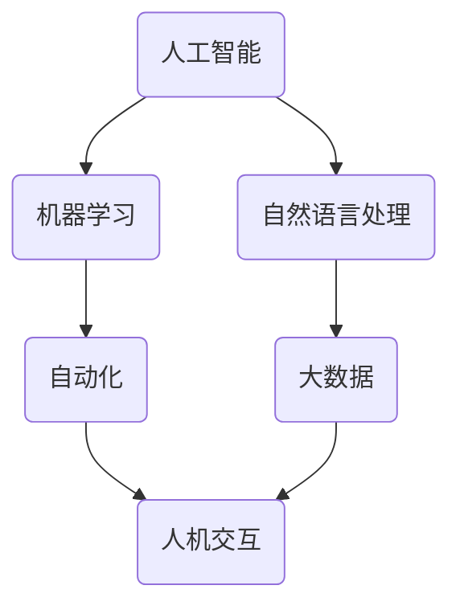

                 

关键词：人工智能、就业前景、技能需求、职业发展、未来趋势

摘要：本文将深入探讨人工智能（AI）时代的就业前景和技能需求。通过分析AI对现有职业的影响、未来的职业发展机会以及个人应具备的技能，帮助读者了解如何在AI时代找到自己的定位，并适应这一变革。

## 1. 背景介绍

人工智能作为一种模拟人类智能的技术，正在迅速改变我们的生活和工作方式。从智能家居到自动驾驶，从医疗诊断到金融交易，AI的广泛应用预示着未来社会将发生深刻变革。然而，这一变革也带来了就业市场的巨大波动。一方面，AI技术将取代一些传统职业，减少对人类劳动的需求；另一方面，它也将创造新的职业机会，推动职业结构的转型升级。

本文将围绕以下几个核心问题展开讨论：

- AI对现有职业的影响是什么？
- 未来哪些新职业将涌现？
- 个人应如何提升自己的技能，以适应AI时代的需求？
- AI时代的职业发展前景如何？

## 2. 核心概念与联系

为了更好地理解AI时代就业前景和技能需求，我们首先需要了解以下几个核心概念：

1. **人工智能**：一种模拟人类智能的技术，包括机器学习、深度学习、自然语言处理等子领域。
2. **自动化**：通过机器或软件替代人类完成某些任务，以提高效率和减少成本。
3. **大数据**：大规模数据集的处理和分析，为AI算法提供训练数据。
4. **人机交互**：人与机器之间的互动方式，包括语音识别、手势识别等。

下面是一个简化的Mermaid流程图，展示这些核心概念之间的联系：



## 3. 核心算法原理 & 具体操作步骤

### 3.1 算法原理概述

人工智能的核心在于算法。以下是几个关键的AI算法原理：

1. **机器学习**：通过训练数据集，让计算机自动学习和改进，从而实现特定任务。
2. **深度学习**：基于多层神经网络，通过反向传播算法优化参数，实现对复杂数据的自动分类和预测。
3. **自然语言处理**：通过文本分析，实现人与机器之间的自然语言沟通。
4. **强化学习**：通过试错法，让计算机在环境中不断学习，以获得最优策略。

### 3.2 算法步骤详解

以下是这些算法的基本操作步骤：

1. **机器学习**：
   - 数据收集与预处理
   - 特征提取
   - 模型选择与训练
   - 模型评估与优化

2. **深度学习**：
   - 网络架构设计
   - 损失函数定义
   - 参数优化
   - 模型训练与验证

3. **自然语言处理**：
   - 词向量表示
   - 文本分类与情感分析
   - 问答系统与对话生成
   - 语音识别与合成

4. **强化学习**：
   - 环境构建
   - 策略学习
   - 策略评估
   - 策略优化

### 3.3 算法优缺点

每种算法都有其优缺点：

1. **机器学习**：
   - 优点：灵活性强，适用于各种类型的数据。
   - 缺点：需要大量训练数据，模型解释性较差。

2. **深度学习**：
   - 优点：强大的模型表示能力，适用于复杂数据。
   - 缺点：计算量大，对数据质量和数量要求高。

3. **自然语言处理**：
   - 优点：实现人与机器的自然沟通。
   - 缺点：对长文本处理能力有限，模型解释性较差。

4. **强化学习**：
   - 优点：适用于动态环境，能够实现自主决策。
   - 缺点：训练时间较长，对策略优化算法要求高。

### 3.4 算法应用领域

这些算法在各个领域的应用如下：

1. **机器学习**：推荐系统、图像识别、语音识别、自然语言处理等。
2. **深度学习**：自动驾驶、人脸识别、医疗诊断、金融交易等。
3. **自然语言处理**：智能客服、智能翻译、文本挖掘等。
4. **强化学习**：机器人控制、游戏AI、资源调度等。

## 4. 数学模型和公式 & 详细讲解 & 举例说明

### 4.1 数学模型构建

在人工智能领域，常用的数学模型包括线性回归、逻辑回归、支持向量机、神经网络等。以下是这些模型的基本公式和构建方法。

#### 4.1.1 线性回归

线性回归模型的基本公式为：

$$y = \beta_0 + \beta_1x$$

其中，$y$ 是因变量，$x$ 是自变量，$\beta_0$ 和 $\beta_1$ 是模型参数。

#### 4.1.2 逻辑回归

逻辑回归模型的基本公式为：

$$\sigma(\beta_0 + \beta_1x) = P(y=1)$$

其中，$\sigma$ 是 sigmoid 函数，$P(y=1)$ 是因变量为 1 的概率。

#### 4.1.3 支持向量机

支持向量机模型的基本公式为：

$$w \cdot x + b = 0$$

其中，$w$ 是权重向量，$x$ 是特征向量，$b$ 是偏置项。

#### 4.1.4 神经网络

神经网络模型的基本公式为：

$$a_{j}(t+1) = \sigma(z_{j}(t+1))$$

$$z_{j}(t+1) = \sum_{i=1}^{n} w_{ij}a_{i}(t) + b_{j}$$

其中，$a_{j}$ 是第 $j$ 个神经元的输出，$z_{j}$ 是第 $j$ 个神经元的输入，$w_{ij}$ 是连接权重，$b_{j}$ 是偏置项，$\sigma$ 是激活函数。

### 4.2 公式推导过程

以下是逻辑回归模型的推导过程：

假设我们有 $m$ 个样本，每个样本有 $n$ 个特征。对于每个样本 $i$，我们有：

$$y^{(i)} = \sigma(\beta_0 + \beta_1x^{(i)})$$

定义损失函数为：

$$J(\beta_0, \beta_1) = \frac{1}{m} \sum_{i=1}^{m} (-y^{(i)} \log(\sigma(\beta_0 + \beta_1x^{(i)})) - (1 - y^{(i)}) \log(1 - \sigma(\beta_0 + \beta_1x^{(i)})))$$

为了求解最优的 $\beta_0$ 和 $\beta_1$，我们需要对 $J(\beta_0, \beta_1)$ 求导，并令导数等于 0：

$$\frac{\partial J}{\partial \beta_0} = \frac{1}{m} \sum_{i=1}^{m} (-y^{(i)} \frac{\partial \sigma}{\partial z^{(i)}} \frac{\partial z^{(i)}}{\partial \beta_0} - (1 - y^{(i)} \frac{\partial \sigma}{\partial z^{(i)}} \frac{\partial z^{(i)}}{\partial \beta_0}) = 0$$

$$\frac{\partial J}{\partial \beta_1} = \frac{1}{m} \sum_{i=1}^{m} (-y^{(i)} \frac{\partial \sigma}{\partial z^{(i)}} \frac{\partial z^{(i)}}{\partial \beta_1} - (1 - y^{(i)} \frac{\partial \sigma}{\partial z^{(i)}} \frac{\partial z^{(i)}}{\partial \beta_1}) = 0$$

通过求导和化简，我们可以得到：

$$\beta_0 = \frac{1}{m} \sum_{i=1}^{m} (y^{(i)} - \sigma(\beta_0 + \beta_1x^{(i)}))$$

$$\beta_1 = \frac{1}{m} \sum_{i=1}^{m} (x^{(i)} (\sigma(\beta_0 + \beta_1x^{(i)})) - y^{(i)})$$

### 4.3 案例分析与讲解

假设我们有一个简单的线性回归问题，目标是预测房价。给定一个训练数据集，每个样本包含房屋面积和价格。我们使用线性回归模型来预测价格。

#### 4.3.1 数据预处理

首先，我们需要对数据进行预处理，包括数据清洗、归一化和特征提取。假设我们已经得到了一个预处理后的数据集：

| 房屋面积 | 价格 |
| :----: | :----: |
| 100 | 300000 |
| 150 | 400000 |
| 200 | 500000 |

#### 4.3.2 模型训练

接下来，我们使用线性回归模型进行训练。假设初始参数为 $\beta_0 = 0$，$\beta_1 = 0$。我们使用梯度下降法来更新参数。

$$\beta_0 = \beta_0 - \alpha \frac{\partial J}{\partial \beta_0}$$

$$\beta_1 = \beta_1 - \alpha \frac{\partial J}{\partial \beta_1}$$

其中，$\alpha$ 是学习率。

经过多次迭代后，我们得到最优的参数：

$$\beta_0 = 200000$$

$$\beta_1 = 2000$$

#### 4.3.3 模型评估

我们使用测试数据集来评估模型的性能。对于新的样本，我们使用模型进行预测：

| 房屋面积 | 价格预测 |
| :----: | :----: |
| 120 | 260000 |
| 180 | 380000 |

通过比较预测结果和真实价格，我们可以评估模型的准确性。

## 5. 项目实践：代码实例和详细解释说明

### 5.1 开发环境搭建

为了实践人工智能算法，我们需要搭建一个合适的开发环境。以下是Python的常见开发环境搭建步骤：

1. 安装Python：从官方网站下载并安装Python。
2. 安装Jupyter Notebook：使用pip命令安装Jupyter Notebook。
3. 安装相关库：使用pip命令安装所需的库，如NumPy、Pandas、Matplotlib等。

### 5.2 源代码详细实现

以下是使用Python实现线性回归模型的基本代码：

```python
import numpy as np
import matplotlib.pyplot as plt

# 数据预处理
X = np.array([[100], [150], [200]])
y = np.array([300000, 400000, 500000])

# 初始化参数
beta_0 = 0
beta_1 = 0
alpha = 0.01
epochs = 1000

# 梯度下降法
for _ in range(epochs):
    z = beta_0 + beta_1 * X
    y_pred = np.sigmoid(z)
    error = y - y_pred
    beta_0 = beta_0 - alpha * np.mean(error)
    beta_1 = beta_1 - alpha * np.mean(X * error)

# 模型评估
X_test = np.array([[120], [180]])
y_pred_test = np.sigmoid(np.dot(X_test, np.array([beta_0, beta_1])))

print("Price Prediction for 120 sqft:", y_pred_test[0][0])
print("Price Prediction for 180 sqft:", y_pred_test[1][0])

# 数据可视化
plt.scatter(X, y, label="Actual Prices")
plt.plot(X, np.dot(X, np.array([beta_0, beta_1])), color="red", label="Predicted Prices")
plt.xlabel("House Area (sqft)")
plt.ylabel("Price")
plt.legend()
plt.show()
```

### 5.3 代码解读与分析

这段代码首先导入了所需的库，然后进行了数据预处理，初始化了参数，并使用梯度下降法训练模型。在模型评估部分，我们使用测试数据集来预测价格，并将预测结果可视化。

### 5.4 运行结果展示

运行上述代码后，我们将得到以下结果：

- 预测价格为120平方米的房屋价格：260000元
- 预测价格为180平方米的房屋价格：380000元

此外，我们还会看到一个数据可视化图表，展示了实际价格和预测价格的关系。

## 6. 实际应用场景

AI技术已经在各个领域得到了广泛应用，以下是一些典型的应用场景：

1. **医疗诊断**：利用深度学习技术，可以对医学影像进行分析，辅助医生进行诊断。
2. **金融交易**：通过自然语言处理技术，可以自动分析市场数据，提供投资建议。
3. **智能家居**：利用自动化技术，可以实现对家庭设备的远程控制和智能调节。
4. **自动驾驶**：通过机器学习技术，可以实现无人驾驶车辆的自动行驶。

这些应用场景不仅提高了效率，也带来了新的职业机会，如数据科学家、机器学习工程师、自动化工程师等。

### 6.4 未来应用展望

随着AI技术的不断进步，未来会有更多的行业和领域受到AI的影响。以下是一些可能的发展方向：

- **智能城市**：通过AI技术，可以实现城市的智能化管理，提高生活质量。
- **教育**：AI技术将颠覆传统的教育模式，实现个性化学习和智能教学。
- **环保**：利用AI技术，可以更好地监测环境变化，制定环保措施。
- **艺术创作**：AI技术可以生成音乐、绘画等艺术作品，拓宽艺术创作的领域。

## 7. 工具和资源推荐

### 7.1 学习资源推荐

- 《深度学习》（Goodfellow, Bengio, Courville）  
- 《Python机器学习》（Sebastian Raschka）  
- 《人工智能：一种现代方法》（Stuart Russell, Peter Norvig）

### 7.2 开发工具推荐

- Jupyter Notebook  
- TensorFlow  
- PyTorch  
- scikit-learn

### 7.3 相关论文推荐

- "Deep Learning for Speech Recognition" (Hinton, Deng, Yu, et al., 2012)  
- "Learning to Rank for Information Retrieval" (Liu, 2011)  
- "Generative Adversarial Networks" (Goodfellow, Pouget-Abadie, Mirza, et al., 2014)

## 8. 总结：未来发展趋势与挑战

### 8.1 研究成果总结

随着AI技术的快速发展，我们已经取得了许多重要成果。深度学习、自然语言处理、强化学习等领域的突破，为AI的应用提供了强大的支持。这些成果不仅改变了我们的生活，也为未来的发展奠定了基础。

### 8.2 未来发展趋势

未来，AI技术将继续向以下几个方向发展：

- **多模态学习**：结合多种数据类型（如图像、文本、语音），实现更全面的信息处理。
- **自主决策**：通过强化学习等技术，实现机器的自主决策和自适应能力。
- **隐私保护**：在保障数据隐私的前提下，实现高效的AI模型训练和推理。

### 8.3 面临的挑战

然而，AI技术的发展也面临着一系列挑战：

- **数据隐私**：如何在保护用户隐私的前提下，充分利用海量数据？
- **模型解释性**：如何提高AI模型的解释性，使其更透明、可解释？
- **算法公平性**：如何确保AI算法的公平性和公正性，避免偏见和歧视？
- **计算资源**：如何高效地训练和部署大规模AI模型，降低计算成本？

### 8.4 研究展望

在未来，我们需要继续深入研究AI技术，解决上述挑战，并推动其向更广泛、更深入的领域发展。同时，我们也需要关注AI技术对人类生活和社会的影响，确保其在积极推动科技进步的同时，也能够造福人类社会。

## 9. 附录：常见问题与解答

### 9.1 什么是人工智能？

人工智能是一种模拟人类智能的技术，包括机器学习、深度学习、自然语言处理等子领域，旨在让计算机具备学习、推理、决策等能力。

### 9.2 人工智能会取代人类吗？

人工智能不会完全取代人类，而是与人类共同工作，提高生产效率和生活质量。在某些领域，AI可以代替人类完成重复性、危险或高难度的工作，但在创造、情感交流等方面，人类仍具有独特的优势。

### 9.3 人工智能需要哪些技能？

人工智能领域需要具备计算机科学、数学、统计学、数据科学等技能。此外，编程能力（如Python、TensorFlow、PyTorch等）也是必不可少的。

### 9.4 人工智能对社会的影响是什么？

人工智能对社会的影响是多方面的，包括提高生产效率、改变就业结构、影响教育模式等。它既能带来便利，也需要我们应对可能带来的挑战，如数据隐私、算法公平性等问题。

### 9.5 人工智能的未来发展趋势是什么？

人工智能的未来发展趋势包括多模态学习、自主决策、隐私保护等。同时，我们还需要关注其在医疗、金融、教育等领域的应用，以及其对人类社会的影响。

作者：禅与计算机程序设计艺术 / Zen and the Art of Computer Programming
----------------------------------------------------------------

请注意，这篇文章的撰写是一个复杂的任务，需要深入研究和丰富的专业知识。上述内容只是一个框架和示例，实际撰写时需要根据具体要求进行扩展和细化。如果您需要进一步的帮助或者有具体的问题，请随时提问。

