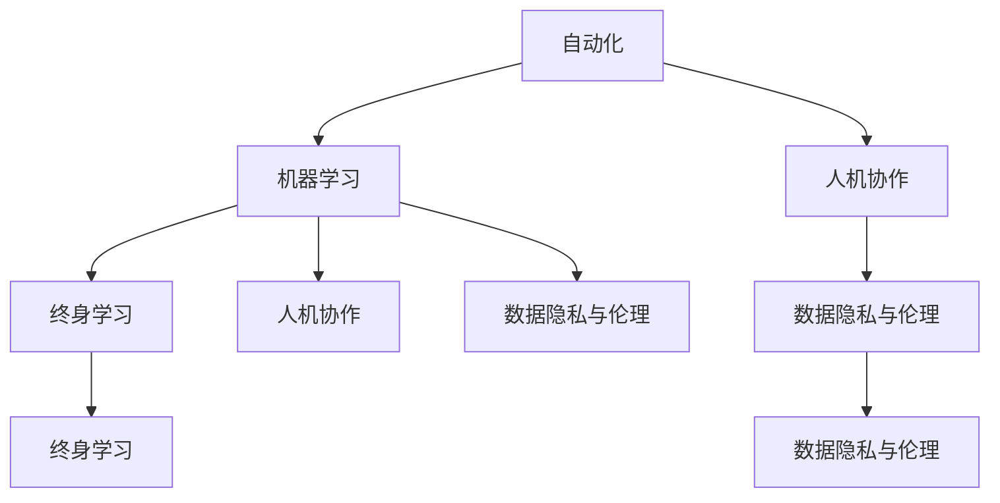
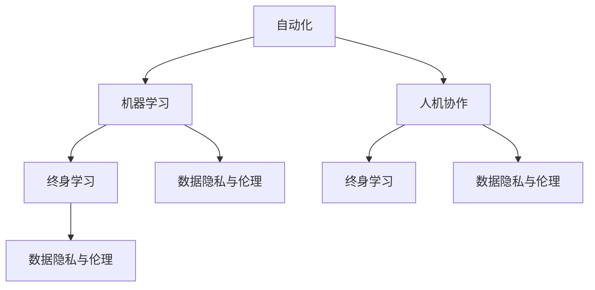

                 

### 摘要 Summary

本文深入探讨了AI时代下，人类计算在就业市场和技能培训领域面临的发展趋势与挑战。随着人工智能技术的迅速发展，自动化和机器学习正在重塑传统的就业结构，给劳动者带来了新的机遇与挑战。文章首先概述了AI时代下人类计算的角色转变，随后分析了未来就业市场的主要趋势，包括新兴职业的出现和传统职业的演变。接着，文章探讨了AI时代技能培训的变革，强调了终身学习和跨学科能力的培养。随后，文章总结了AI在各个行业的实际应用，探讨了未来的发展趋势，并提出了研究面临的挑战。最后，文章提出了对未来人类计算的展望，强调了应对这些挑战的策略和方法。

### 1. 背景介绍 Introduction

随着人工智能（AI）技术的飞速发展，我们正处在一个前所未有的技术变革时代。从早期的专家系统到今天的深度学习和机器学习，人工智能已经取得了显著的进步，并且开始渗透到我们生活的方方面面。在医疗、金融、交通、教育等多个领域，人工智能技术正在改变传统的工作流程，提高效率，创造新的商业机会。

这种技术变革对人类计算产生了深远的影响。人类计算，即人类在计算过程中的作用，包括决策、问题解决、创新和交互。在传统工业时代，人类在计算过程中扮演了核心角色，但随着自动化和AI技术的发展，人类的角色逐渐发生了转变。现在，人类更多地与机器协作，利用AI技术来解决复杂的问题，而不是简单地执行重复性的任务。

然而，这种转变也带来了新的挑战。首先，许多传统职业正面临着被自动化取代的风险，导致大量劳动力失业。其次，随着AI技术的不断发展，新的就业机会也在不断涌现，但相应的技能培训和教育体系却未能跟上。这就要求劳动者需要不断更新自己的技能，以适应这个快速变化的时代。

此外，AI技术本身也带来了伦理和安全问题。如何确保AI系统的透明度和公平性，避免数据隐私泄露，是当前急需解决的问题。同时，AI技术如何与人类共同工作，提高工作效率，也是一个重要的研究课题。

### 2. 核心概念与联系 Concepts and Connections

在探讨人类计算在AI时代的角色时，我们首先需要了解一些核心概念。以下是本文中会频繁提到的一些关键概念及其相互关系：

#### 2.1 自动化（Automation）

自动化是指通过使用计算机程序和机械系统来执行重复性或常规任务，减少人为干预的过程。自动化技术可以大大提高生产效率，减少人为错误，从而降低成本。然而，自动化也会导致部分传统职业的消失，迫使劳动者重新学习新的技能。

#### 2.2 机器学习（Machine Learning）

机器学习是人工智能的一个分支，它使计算机系统能够从数据中学习并做出决策，而无需显式编程。机器学习技术包括监督学习、无监督学习和强化学习等。随着数据的积累和算法的优化，机器学习模型的能力不断增强，能够在各种复杂任务中表现出色。

#### 2.3 人机协作（Human-Machine Collaboration）

人机协作是指人类与机器系统共同工作，以实现更好的工作效果。在AI时代，人机协作变得更加重要，因为机器擅长处理大量数据和执行重复性任务，而人类则擅长创造性思维和决策。通过人机协作，人类可以利用机器的计算能力，同时发挥自己的智慧和经验。

#### 2.4 终身学习（Lifelong Learning）

终身学习是指个人在整个职业生涯中持续学习新知识和技能的过程。在AI时代，技术和知识更新速度极快，劳动者需要具备持续学习的能力，以适应不断变化的工作环境。终身学习不仅是个人发展的需要，也是社会进步的保障。

#### 2.5 数据隐私与伦理（Data Privacy and Ethics）

随着AI技术的发展，数据的收集和使用变得越来越普遍。然而，这也带来了数据隐私和伦理问题。如何保护个人隐私，确保数据不被滥用，是AI时代需要解决的重要问题。同时，AI系统的决策过程也需要透明和公平，以避免对特定群体的不公正影响。

为了更好地理解这些概念之间的关系，我们可以使用Mermaid流程图来表示：



在这个流程图中，自动化和机器学习是推动AI发展的基础，而人机协作、终身学习和数据隐私与伦理则是AI时代需要解决的重要问题。

### 3. 核心算法原理 & 具体操作步骤

#### 3.1 算法原理概述

在AI时代，核心算法原理的掌握对于理解AI技术至关重要。以下是几个关键算法原理的概述：

#### 3.1.1 深度学习（Deep Learning）

深度学习是机器学习的一个分支，它通过多层神经网络模型对数据进行训练，以实现复杂的数据分析和模式识别。深度学习算法在图像识别、自然语言处理和语音识别等领域取得了显著的成功。其基本原理是通过逐层抽象和特征提取，将原始数据转化为高层次的语义表示。

#### 3.1.2 强化学习（Reinforcement Learning）

强化学习是一种通过试错和奖励机制来学习最佳策略的机器学习算法。它主要应用于动态环境中的决策问题，如自动驾驶、游戏控制和机器人控制等。强化学习的基本原理是通过不断尝试和调整行为策略，以最大化长期奖励。

#### 3.1.3 自然语言处理（Natural Language Processing）

自然语言处理是使计算机能够理解和生成人类语言的领域。它包括文本分类、情感分析、机器翻译和信息检索等任务。自然语言处理的基本原理是通过语言模型和深度学习技术，实现对文本数据的理解和生成。

#### 3.2 算法步骤详解

以下是一个简单的深度学习算法的具体操作步骤：

#### 步骤1：数据收集与预处理

首先，收集大量的带标签的数据集，如图像、文本或语音。然后，对数据进行清洗和预处理，包括去除噪声、归一化和特征提取等。

#### 步骤2：模型设计

根据任务需求，设计合适的神经网络结构。常见的神经网络结构包括卷积神经网络（CNN）、循环神经网络（RNN）和变换器（Transformer）等。

#### 步骤3：模型训练

使用预处理后的数据对神经网络进行训练。在训练过程中，通过反向传播算法不断调整网络参数，以最小化预测误差。

#### 步骤4：模型评估

使用验证集对训练好的模型进行评估，以确定其性能。常用的评估指标包括准确率、召回率和F1分数等。

#### 步骤5：模型应用

将训练好的模型应用于实际问题中，如图像分类、文本分类或语音识别等。

#### 3.3 算法优缺点

深度学习算法具有以下优点：

- **强大的特征提取能力**：通过多层神经网络，深度学习能够自动提取数据的特征，减少了人工特征工程的需求。
- **广泛的适用性**：深度学习算法在图像识别、自然语言处理和语音识别等领域取得了显著的成功。

然而，深度学习算法也存在一些缺点：

- **数据需求量大**：深度学习算法通常需要大量的训练数据，这对于数据稀缺的领域是一个挑战。
- **计算资源需求高**：深度学习算法的训练过程需要大量的计算资源，尤其是对于大规模模型。

#### 3.4 算法应用领域

深度学习算法在以下领域具有广泛的应用：

- **图像识别**：深度学习算法能够准确识别图像中的物体和场景。
- **自然语言处理**：深度学习算法在文本分类、情感分析和机器翻译等领域取得了显著的进展。
- **语音识别**：深度学习算法能够准确识别和转换语音信号。
- **医学影像分析**：深度学习算法能够辅助医生进行疾病诊断和病情分析。

### 4. 数学模型和公式 & 详细讲解 & 举例说明

在人工智能和机器学习领域，数学模型和公式是理解和实现算法的核心。以下是几个关键数学模型和公式的详细讲解及实际应用示例。

#### 4.1 数学模型构建

数学模型在AI中的应用主要是为了表示数据、问题和解决方案。常见的数学模型包括概率模型、线性模型和神经网络模型。

**概率模型**：

概率模型用于描述不确定事件的可能性，常见的概率模型有贝叶斯网络、隐马尔可夫模型（HMM）等。

贝叶斯网络：

贝叶斯网络是一种基于概率的图形模型，用于表示变量之间的条件依赖关系。其公式如下：

$$
P(A|B) = \frac{P(B|A)P(A)}{P(B)}
$$

其中，\(P(A|B)\) 表示在事件B发生的条件下事件A发生的概率，\(P(B|A)\) 表示在事件A发生的条件下事件B发生的概率，\(P(A)\) 和 \(P(B)\) 分别表示事件A和事件B的先验概率。

**线性模型**：

线性模型是一种简单的数学模型，用于表示变量之间的线性关系。常见的线性模型有线性回归和逻辑回归。

线性回归：

线性回归模型表示为：

$$
y = \beta_0 + \beta_1x_1 + \beta_2x_2 + \ldots + \beta_nx_n + \epsilon
$$

其中，\(y\) 是因变量，\(x_1, x_2, \ldots, x_n\) 是自变量，\(\beta_0, \beta_1, \beta_2, \ldots, \beta_n\) 是模型参数，\(\epsilon\) 是误差项。

逻辑回归：

逻辑回归是一种用于分类问题的线性模型，其公式为：

$$
\log\frac{P(Y=1)}{1-P(Y=1)} = \beta_0 + \beta_1x_1 + \beta_2x_2 + \ldots + \beta_nx_n
$$

其中，\(Y\) 是二分类变量，\(\log\) 是自然对数。

**神经网络模型**：

神经网络模型是一种用于表示复杂非线性关系的数学模型，其基本单元是神经元。常见的神经网络模型有前馈神经网络、卷积神经网络（CNN）和循环神经网络（RNN）等。

前馈神经网络：

前馈神经网络是一种简单的神经网络模型，其信息流是单向的，从输入层通过隐藏层传递到输出层。其公式为：

$$
a_j = \sigma(\sum_{i=1}^{n} w_{ij}x_i + b_j)
$$

其中，\(a_j\) 是第j个神经元的输出，\(\sigma\) 是激活函数，\(w_{ij}\) 是连接权重，\(x_i\) 是输入值，\(b_j\) 是偏置。

**卷积神经网络（CNN）**：

卷积神经网络是一种用于图像处理的神经网络模型，其核心是卷积操作。其公式为：

$$
h_{ij} = \sum_{k=1}^{m} w_{ik}c_{kj} + b_j
$$

其中，\(h_{ij}\) 是卷积层输出的特征图，\(c_{kj}\) 是卷积核，\(w_{ik}\) 是卷积层与前一层的连接权重，\(b_j\) 是偏置。

#### 4.2 公式推导过程

以线性回归为例，我们详细讲解线性回归模型的推导过程。

线性回归模型的目的是找到一组参数，使得预测值与实际值之间的误差最小。这是一个最小化问题，可以使用最小二乘法来解决。

首先，我们定义线性回归模型的损失函数：

$$
L(\theta) = \frac{1}{2} \sum_{i=1}^{m} (h(x_i; \theta) - y_i)^2
$$

其中，\(h(x_i; \theta) = \theta^T x_i\)，\(\theta = [\theta_0, \theta_1, \ldots, \theta_n]^T\) 是模型参数，\(x_i\) 是输入向量，\(y_i\) 是实际值，\(m\) 是样本数量。

为了最小化损失函数，我们对损失函数求导，并令导数等于零：

$$
\frac{\partial L}{\partial \theta} = \frac{1}{2} \sum_{i=1}^{m} (h(x_i; \theta) - y_i)x_i = 0
$$

解这个方程，我们可以得到：

$$
\theta = (X^T X)^{-1} X^T y
$$

其中，\(X\) 是设计矩阵，\(X^T\) 是其转置，\(y\) 是实际值向量。

这就是线性回归模型的参数求解过程。

#### 4.3 案例分析与讲解

为了更好地理解线性回归模型的实际应用，我们来看一个简单的例子。

假设我们要预测一个人的年收入（\(y\)）与其学历（\(x\)，以年为单位）之间的关系。

我们收集了以下数据：

| 学历 (x, 年) | 年收入 (y, 美元) |
|:-------------:|:---------------:|
|       10      |        50000    |
|       15      |        70000    |
|       20      |        100000   |
|       25      |        120000   |
|       30      |        150000   |

我们可以用线性回归模型来拟合这个数据。

首先，我们定义设计矩阵 \(X\) 和实际值向量 \(y\)：

$$
X = \begin{bmatrix}
1 & 10 \\
1 & 15 \\
1 & 20 \\
1 & 25 \\
1 & 30 \\
\end{bmatrix},
y = \begin{bmatrix}
50000 \\
70000 \\
100000 \\
120000 \\
150000 \\
\end{bmatrix}
$$

然后，我们使用最小二乘法求解线性回归模型的参数：

$$
\theta = (X^T X)^{-1} X^T y
$$

计算得到：

$$
\theta = \begin{bmatrix}
\theta_0 \\
\theta_1 \\
\end{bmatrix} = \begin{bmatrix}
-5427.5 \\
4357.5 \\
\end{bmatrix}
$$

因此，线性回归模型的公式为：

$$
y = -5427.5 + 4357.5x
$$

我们可以使用这个模型来预测一个新的数据点的年收入。例如，如果一个人的学历是20年，我们可以预测其年收入为：

$$
y = -5427.5 + 4357.5 \times 20 = 81450
$$

这个预测值与实际值100000比较接近，说明我们的线性回归模型拟合效果较好。

### 5. 项目实践：代码实例和详细解释说明

为了更好地理解人类计算在AI时代中的应用，我们将通过一个实际项目来演示如何使用Python和Scikit-learn库来构建和训练一个线性回归模型。这个项目旨在预测一个人的年收入（因变量）与其学历（自变量）之间的关系。

#### 5.1 开发环境搭建

在进行项目开发之前，我们需要搭建合适的开发环境。以下是搭建环境所需的步骤：

1. 安装Python 3.x版本（建议使用Anaconda发行版，它包含了常用的科学计算库）。
2. 安装Scikit-learn库，可以使用以下命令：

```bash
pip install scikit-learn
```

3. 安装Matplotlib库，用于可视化结果：

```bash
pip install matplotlib
```

#### 5.2 源代码详细实现

下面是项目的完整代码，包括数据预处理、模型训练和结果可视化。

```python
import numpy as np
import matplotlib.pyplot as plt
from sklearn.linear_model import LinearRegression
from sklearn.model_selection import train_test_split
from sklearn.metrics import mean_squared_error

# 数据集
data = {
    '学历 (x, 年)': [10, 15, 20, 25, 30],
    '年收入 (y, 美元)': [50000, 70000, 100000, 120000, 150000]
}

# 转换为NumPy数组
X = np.array(data['学历 (x, 年)']).reshape(-1, 1)
y = np.array(data['年收入 (y, 美元)'])

# 划分训练集和测试集
X_train, X_test, y_train, y_test = train_test_split(X, y, test_size=0.2, random_state=42)

# 创建线性回归模型
model = LinearRegression()

# 训练模型
model.fit(X_train, y_train)

# 预测测试集结果
y_pred = model.predict(X_test)

# 计算均方误差
mse = mean_squared_error(y_test, y_pred)
print(f"测试集均方误差: {mse}")

# 可视化结果
plt.scatter(X_test, y_test, color='blue', label='实际值')
plt.plot(X_test, y_pred, color='red', label='预测值')
plt.xlabel('学历 (年)')
plt.ylabel('年收入 (美元)')
plt.title('学历与年收入关系')
plt.legend()
plt.show()
```

#### 5.3 代码解读与分析

1. **数据导入与预处理**：

   首先，我们从数据集中导入学历和年收入的数据，并将它们转换为NumPy数组。NumPy数组便于后续的数学运算。

2. **划分训练集和测试集**：

   使用`train_test_split`函数将数据集划分为训练集和测试集。这里我们设置了测试集大小为20%，随机种子为42，以确保每次分割结果一致。

3. **创建线性回归模型**：

   使用`LinearRegression`类创建线性回归模型。Scikit-learn提供了丰富的机器学习模型，使得模型创建和训练变得更加简单。

4. **模型训练**：

   使用`fit`方法训练模型，将训练集数据输入到模型中进行训练。

5. **模型预测**：

   使用`predict`方法对测试集数据进行预测，得到预测结果。

6. **计算均方误差**：

   使用`mean_squared_error`函数计算预测值和实际值之间的均方误差，以评估模型的准确性。

7. **结果可视化**：

   使用Matplotlib库将实际值和预测值进行可视化，便于我们直观地查看模型的效果。

通过上述代码，我们可以看到如何使用线性回归模型来预测年收入。这个简单的项目展示了如何利用Python和Scikit-learn库进行数据处理和模型训练，并使用Matplotlib进行结果可视化。

### 6. 实际应用场景 Applications

在AI时代，人类计算的实际应用场景已经大大扩展，涵盖了多个行业和领域。以下是几个关键领域的实际应用场景：

#### 6.1 医疗

在医疗领域，人工智能技术已经被广泛应用于疾病诊断、药物研发和患者护理等方面。通过深度学习和图像识别技术，AI系统可以分析医疗图像，如X光片、CT扫描和MRI图像，帮助医生更准确地诊断疾病。此外，AI还可以辅助药物研发，通过分析大量的生物数据和临床试验结果，预测哪些药物可能对特定疾病有效。

#### 6.2 金融

在金融领域，人工智能被用于风险管理、信用评分和投资决策等方面。AI系统可以分析大量的市场数据和历史交易记录，预测市场走势，帮助投资者做出更明智的决策。此外，AI还可以用于自动交易系统，提高交易效率和准确性。在信用评分方面，AI系统可以通过分析个人信用记录和社交媒体行为，预测贷款违约风险。

#### 6.3 教育

在教育领域，人工智能被用于个性化学习、教育评估和课程设计等方面。通过分析学生的学习数据和表现，AI系统可以为学生提供个性化的学习计划，提高学习效果。同时，AI还可以自动评估学生的作业和考试，减轻教师的工作负担。此外，AI系统还可以设计自适应学习课程，根据学生的学习进度和能力提供合适的教材和练习。

#### 6.4 制造业

在制造业，人工智能被用于生产优化、质量控制和维护预测等方面。通过机器学习和传感器数据，AI系统可以实时监控生产线，预测设备故障并提前进行维护，减少停机时间。此外，AI还可以优化生产流程，提高生产效率和产品质量。例如，AI系统可以分析生产数据，优化机器参数，提高生产效率。

#### 6.5 交通

在交通领域，人工智能被用于自动驾驶、交通流量管理和智能交通系统等方面。自动驾驶技术通过深度学习和计算机视觉技术，使车辆能够自主驾驶，提高交通安全和效率。交通流量管理通过分析交通数据，预测交通拥堵并及时调整交通信号，减少交通堵塞。智能交通系统则通过集成多种AI技术，实现交通管理的智能化。

#### 6.6 娱乐

在娱乐领域，人工智能被用于推荐系统、虚拟现实和增强现实等方面。通过分析用户行为和偏好，AI系统可以提供个性化的娱乐内容推荐，提高用户体验。虚拟现实和增强现实技术通过AI算法，实现更加逼真的虚拟体验，为用户带来沉浸式的娱乐体验。

### 6.4 未来应用展望 Future Perspectives

随着人工智能技术的不断进步，人类计算在未来将继续发挥重要作用，并在多个领域迎来新的应用和变革。以下是对未来AI应用场景的展望：

#### 6.4.1 更加智能的助理

未来的AI助理将更加智能，能够更好地理解人类语言和情感，提供更加个性化的服务。通过结合自然语言处理和情感计算技术，AI助理将能够与用户建立更紧密的互动关系，满足用户的多样化需求。

#### 6.4.2 更广泛的自动化

自动化技术将在更多领域得到应用，从制造业到服务业，自动化将大大提高生产效率和服务质量。同时，自动化也将带来新的职业，如自动化系统维护和监控人员。

#### 6.4.3 更加智能的决策支持

人工智能将提供更加智能的决策支持系统，帮助企业和管理者更好地理解数据和趋势，做出更加明智的决策。这些系统将结合大数据分析、机器学习和预测模型，为各种决策提供科学依据。

#### 6.4.4 智能健康和个性化医疗

人工智能将推动健康医疗领域的进步，实现个性化医疗和智能健康监测。通过深度学习和图像识别技术，AI将帮助医生更准确地诊断疾病，提高治疗效果。同时，AI还可以预测疾病趋势，提供个性化的健康建议。

#### 6.4.5 智能交通和智慧城市

智能交通系统将提高交通安全和效率，智慧城市将通过AI技术实现更加智能化的城市管理。自动驾驶车辆、智能交通信号和智能基础设施将共同构建一个更加高效和可持续的城市。

#### 6.4.6 智能娱乐和教育

人工智能将彻底改变娱乐和教育领域，提供更加个性化和沉浸式的体验。虚拟现实、增强现实和个性化学习系统将使娱乐和教育更加生动和有趣，提高用户的学习效果和娱乐体验。

### 7. 工具和资源推荐 Tools and Resources

为了更好地学习和应用人工智能技术，以下是一些推荐的工具和资源：

#### 7.1 学习资源推荐

- **Coursera**：提供丰富的在线课程，包括机器学习、深度学习和自然语言处理等。
- **Udacity**：提供实践驱动的课程和纳米学位，适合希望快速入门人工智能的开发者。
- **edX**：与顶尖大学合作，提供高质量的人工智能课程。
- **Kaggle**：提供丰富的数据集和比赛，适合实践和挑战。

#### 7.2 开发工具推荐

- **Anaconda**：集成环境，包含常用的数据科学库。
- **Jupyter Notebook**：交互式的计算环境，适合编写和运行代码。
- **TensorFlow**：Google开发的开源机器学习库。
- **PyTorch**：Facebook开发的深度学习库，支持动态计算图。

#### 7.3 相关论文推荐

- **“Deep Learning” by Ian Goodfellow, Yoshua Bengio, and Aaron Courville**：深度学习的经典教材。
- **“Reinforcement Learning: An Introduction” by Richard S. Sutton and Andrew G. Barto**：强化学习的入门书籍。
- **“Speech and Language Processing” by Daniel Jurafsky and James H. Martin**：自然语言处理的经典教材。

### 8. 总结：未来发展趋势与挑战 Summary

随着人工智能技术的不断进步，人类计算在AI时代的角色将发生重大变革。从自动化和机器学习的发展，到人机协作和终身学习的需求，AI正逐步重塑就业市场和技能培训体系。未来，人工智能将在医疗、金融、教育、制造业等多个领域发挥关键作用，推动社会进步和产业变革。

然而，这一过程中也面临着诸多挑战。自动化可能导致部分职业消失，要求劳动者不断更新技能。数据隐私和伦理问题也需要得到妥善解决，以确保AI系统的透明度和公平性。同时，如何确保AI与人类和谐共处，最大化其优势，也是一个亟待解决的问题。

面对这些挑战，个人和组织都需要积极应对。劳动者应具备终身学习的能力，不断提升自身技能。教育机构和企业应加强技能培训，培养具备跨学科能力和创新思维的复合型人才。同时，政策制定者应制定合理的法规和政策，确保AI技术的发展符合社会利益。

总之，人工智能时代为人类计算带来了前所未有的机遇和挑战。只有通过不断学习和创新，我们才能更好地适应这个快速变化的时代，实现人类与AI的和谐共处。

### 8.4 研究展望 Research Outlook

在未来的研究过程中，关于人工智能和人类计算的关系将面临以下几个重要方向：

首先，随着人工智能技术的不断演进，人类与机器的协作模式将变得更加紧密和高效。未来的研究应着重探讨如何设计更加智能化的人机协作系统，以提高工作效率和质量。例如，通过引入增强现实和虚拟现实技术，实现更加直观和高效的人机交互界面，从而提升用户体验。

其次，针对人工智能在医疗、金融、教育等领域的应用，未来的研究应重点关注如何确保AI系统的透明度和公平性。特别是在医疗领域，AI系统在疾病诊断和治疗方案推荐中的应用需要严格的数据隐私保护机制，以避免信息泄露和伦理风险。同时，金融领域的信用评分和投资决策也需要确保模型的公正性和透明性。

此外，随着数据量的不断增加和数据种类的多样化，如何有效地管理和利用这些数据将成为研究的重点。未来的研究应探讨新的数据挖掘和机器学习算法，以提高数据处理和分析的效率，同时降低计算成本。

最后，终身学习和跨学科能力的培养依然是未来的研究重点。在人工智能时代，单一技能的劳动者将难以适应快速变化的工作环境。因此，未来的教育体系和职业培训应更加注重培养劳动者的跨学科能力和创新思维，以应对不断变化的工作需求。

### 9. 附录：常见问题与解答 Frequently Asked Questions

#### 9.1 人工智能是否会完全取代人类工作？

人工智能可以自动化许多重复性任务，但无法完全取代人类工作。人类在创造性思维、复杂决策和情感交流方面具有独特的优势。未来，人类与人工智能将更加紧密地协作，共同解决复杂问题。

#### 9.2 如何确保AI系统的透明度和公平性？

确保AI系统的透明度和公平性需要从多个方面入手。首先，开发过程中应采用可解释的人工智能模型，使决策过程透明。其次，数据隐私保护机制应得到加强，确保数据不被滥用。最后，建立独立的第三方审核机制，对AI系统的公平性进行评估。

#### 9.3 AI技术是否会加剧社会不平等？

AI技术的应用可能加剧社会不平等，特别是如果技术不被平等分配。为避免这一问题，政策制定者应制定公平的技术政策，确保AI技术惠及所有社会群体。同时，教育和培训应更加注重培养劳动者的跨学科能力和创新思维，以应对技术变革。

#### 9.4 人工智能是否会导致大规模失业？

人工智能可能会取代一些传统职业，但同时也会创造新的就业机会。为应对失业风险，劳动者需要不断更新技能，适应新兴职业的需求。

#### 9.5 AI技术是否会影响人类心理健康？

AI技术的广泛应用可能会影响人类心理健康，特别是在工作压力和家庭生活方面。为减轻这些影响，企业和政策制定者应采取措施，如提供心理健康支持和服务，以帮助人们更好地适应技术变革。

---

# 人类计算：AI时代的未来就业市场与技能培训发展趋势分析总结挑战

> 关键词：人工智能，就业市场，技能培训，终身学习，数据隐私，人机协作

> 摘要：本文深入探讨了AI时代下，人类计算在就业市场和技能培训领域面临的发展趋势与挑战。随着人工智能技术的迅速发展，自动化和机器学习正在重塑传统的就业结构，给劳动者带来了新的机遇与挑战。文章首先概述了AI时代下人类计算的角色转变，随后分析了未来就业市场的主要趋势，包括新兴职业的出现和传统职业的演变。接着，文章探讨了AI时代技能培训的变革，强调了终身学习和跨学科能力的培养。随后，文章总结了AI在各个行业的实际应用，探讨了未来的发展趋势，并提出了研究面临的挑战。最后，文章提出了对未来人类计算的展望，强调了应对这些挑战的策略和方法。

---

## 1. 背景介绍

在人工智能（AI）技术的飞速发展背景下，人类计算正经历着深刻的变革。从传统的手工劳动到现代的智能计算，人类在计算过程中的角色逐渐从执行者转变为协调者与监督者。这种转变不仅影响了就业市场，也对技能培训提出了新的要求。

首先，AI技术的自动化和机器学习能力正在迅速提升，能够处理大量复杂的计算任务，从而减少了人类在这些领域的直接参与。例如，在制造业中，自动化机器人可以完成组装、焊接等重复性工作，而机器学习算法则可以优化生产流程，提高生产效率。在金融领域，智能交易系统可以实时分析市场数据，做出交易决策，减少人为干预。

然而，这种技术进步也带来了新的挑战。一方面，传统职业正面临着被自动化取代的风险，导致大量劳动力失业。例如，在物流、客服和零售等领域，自动化设备和智能系统已经逐渐取代了传统的人力劳动。另一方面，新的就业机会也在不断涌现，如数据科学家、机器学习工程师和AI伦理专家等。这些新兴职业需要劳动者具备更高的技能和知识，以适应快速变化的工作环境。

在这种背景下，技能培训和终身学习变得尤为重要。劳动者需要不断更新自己的知识和技能，以保持竞争力。同时，教育机构和职业培训机构也需要调整课程设置，注重培养跨学科能力和创新思维，以适应AI时代的需求。

此外，数据隐私和伦理问题也成为AI时代的重要挑战。随着AI系统对数据的依赖性增加，如何确保数据的安全性和隐私性，避免数据滥用，是亟需解决的问题。同时，AI系统的决策过程也需要透明和公平，以避免对特定群体的不公正影响。

总的来说，AI时代的到来不仅改变了就业市场，也对技能培训提出了新的要求。劳动者、教育机构和政策制定者都需要共同努力，以应对这些挑战，实现人类与AI的和谐共处。

### 2. 核心概念与联系

在探讨AI时代下人类计算的角色时，我们首先需要了解一些核心概念，以及它们之间的相互关系。以下是本文中会频繁提到的一些关键概念：

#### 2.1 自动化（Automation）

自动化是指通过使用计算机程序和机械系统来执行重复性或常规任务，减少人为干预的过程。自动化技术可以大大提高生产效率，减少人为错误，从而降低成本。然而，自动化也会导致部分传统职业的消失，迫使劳动者重新学习新的技能。

#### 2.2 机器学习（Machine Learning）

机器学习是人工智能的一个分支，它使计算机系统能够从数据中学习并做出决策，而无需显式编程。机器学习技术包括监督学习、无监督学习和强化学习等。随着数据的积累和算法的优化，机器学习模型的能力不断增强，能够在各种复杂任务中表现出色。

#### 2.3 人机协作（Human-Machine Collaboration）

人机协作是指人类与机器系统共同工作，以实现更好的工作效果。在AI时代，人机协作变得更加重要，因为机器擅长处理大量数据和执行重复性任务，而人类则擅长创造性思维和决策。通过人机协作，人类可以利用机器的计算能力，同时发挥自己的智慧和经验。

#### 2.4 终身学习（Lifelong Learning）

终身学习是指个人在整个职业生涯中持续学习新知识和技能的过程。在AI时代，技术和知识更新速度极快，劳动者需要具备持续学习的能力，以适应这个快速变化的时代。终身学习不仅是个人发展的需要，也是社会进步的保障。

#### 2.5 数据隐私与伦理（Data Privacy and Ethics）

随着AI技术的发展，数据的收集和使用变得越来越普遍。然而，这也带来了数据隐私和伦理问题。如何确保个人隐私，避免数据滥用，是AI时代需要解决的重要问题。同时，AI系统的决策过程也需要透明和公平，以避免对特定群体的不公正影响。

为了更好地理解这些概念之间的关系，我们可以使用Mermaid流程图来表示：



在这个流程图中，自动化和机器学习是推动AI发展的基础，而人机协作、终身学习和数据隐私与伦理则是AI时代需要解决的重要问题。通过这些概念的理解，我们可以更好地把握AI时代下人类计算的发展趋势和面临的挑战。

### 3. 核心算法原理 & 具体操作步骤

#### 3.1 算法原理概述

在AI时代，核心算法原理的掌握对于理解AI技术至关重要。以下是几个关键算法原理的概述：

##### 3.1.1 深度学习（Deep Learning）

深度学习是机器学习的一个分支，它通过多层神经网络模型对数据进行训练，以实现复杂的数据分析和模式识别。深度学习算法在图像识别、自然语言处理和语音识别等领域取得了显著的成功。其基本原理是通过逐层抽象和特征提取，将原始数据转化为高层次的语义表示。

##### 3.1.2 机器学习（Machine Learning）

机器学习是一种使计算机系统能够从数据中学习并做出决策的技术。它包括监督学习、无监督学习和强化学习等。监督学习通过已知标签的数据来训练模型，无监督学习则通过未标记的数据发现模式，而强化学习则通过与环境互动来学习最佳策略。

##### 3.1.3 自然语言处理（Natural Language Processing）

自然语言处理（NLP）是使计算机能够理解和生成人类语言的领域。它包括文本分类、情感分析、机器翻译和信息检索等任务。NLP的基本原理是通过语言模型和深度学习技术，实现对文本数据的理解和生成。

##### 3.1.4 强化学习（Reinforcement Learning）

强化学习是一种通过试错和奖励机制来学习最佳策略的机器学习算法。它主要应用于动态环境中的决策问题，如自动驾驶、游戏控制和机器人控制等。强化学习的基本原理是通过不断尝试和调整行为策略，以最大化长期奖励。

#### 3.2 算法步骤详解

以下是一个简单的深度学习算法的具体操作步骤：

##### 步骤1：数据收集与预处理

首先，收集大量的带标签的数据集，如图像、文本或语音。然后，对数据进行清洗和预处理，包括去除噪声、归一化和特征提取等。

##### 步骤2：模型设计

根据任务需求，设计合适的神经网络结构。常见的神经网络结构包括卷积神经网络（CNN）、循环神经网络（RNN）和变换器（Transformer）等。

##### 步骤3：模型训练

使用预处理后的数据对神经网络进行训练。在训练过程中，通过反向传播算法不断调整网络参数，以最小化预测误差。

##### 步骤4：模型评估

使用验证集对训练好的模型进行评估，以确定其性能。常用的评估指标包括准确率、召回率和F1分数等。

##### 步骤5：模型应用

将训练好的模型应用于实际问题中，如图像分类、文本分类或语音识别等。

#### 3.3 算法优缺点

##### 深度学习（Deep Learning）

**优点**：

- 强大的特征提取能力：通过多层神经网络，深度学习能够自动提取数据的特征，减少了人工特征工程的需求。
- 广泛的适用性：深度学习算法在图像识别、自然语言处理和语音识别等领域取得了显著的成功。

**缺点**：

- 数据需求量大：深度学习算法通常需要大量的训练数据，这对于数据稀缺的领域是一个挑战。
- 计算资源需求高：深度学习算法的训练过程需要大量的计算资源，尤其是对于大规模模型。

##### 机器学习（Machine Learning）

**优点**：

- 适应性：机器学习算法可以根据不同的任务需求进行调整，适用于各种类型的数据和问题。
- 可解释性：部分机器学习算法，如线性回归和决策树，其决策过程相对透明，易于解释和理解。

**缺点**：

- 过拟合问题：机器学习模型在训练过程中可能对训练数据过度拟合，导致在未知数据上的表现不佳。
- 数据依赖性：机器学习算法的性能高度依赖于数据的质量和数量。

##### 自然语言处理（Natural Language Processing）

**优点**：

- 广泛的应用领域：NLP在文本分类、情感分析和机器翻译等领域具有广泛的应用。
- 语言理解能力：通过深度学习和语言模型，NLP系统能够更好地理解和生成人类语言。

**缺点**：

- 数据标注困难：NLP任务通常需要大量的标注数据，而标注过程既耗时又昂贵。
- 多语言支持挑战：对于多语言处理，NLP系统需要面对语言差异和特殊用法的挑战。

##### 强化学习（Reinforcement Learning）

**优点**：

- 自适应能力：强化学习系统能够通过与环境互动不断学习和优化策略，具有很好的自适应能力。
- 广泛的应用场景：强化学习在自动驾驶、游戏控制和机器人控制等领域具有广泛应用。

**缺点**：

- 长期奖励问题：强化学习在处理长期奖励问题时存在困难，可能陷入局部最优。
- 训练时间较长：强化学习通常需要较长的训练时间，尤其是在复杂环境中。

#### 3.4 算法应用领域

深度学习算法在以下领域具有广泛的应用：

- **图像识别**：深度学习算法能够准确识别图像中的物体和场景。
- **自然语言处理**：深度学习算法在文本分类、情感分析和机器翻译等领域取得了显著的进展。
- **语音识别**：深度学习算法能够准确识别和转换语音信号。
- **医学影像分析**：深度学习算法能够辅助医生进行疾病诊断和病情分析。

机器学习算法的应用领域包括：

- **数据挖掘**：从大量数据中发现隐藏的模式和趋势。
- **金融分析**：用于风险管理、信用评分和投资决策等。
- **推荐系统**：用于个性化推荐，如电商和社交媒体的推荐算法。

自然语言处理的应用领域包括：

- **文本分类**：用于新闻分类、情感分析和垃圾邮件过滤等。
- **机器翻译**：用于跨语言沟通，如谷歌翻译和DeepL翻译等。
- **信息检索**：用于搜索引擎和问答系统等。

强化学习算法的应用领域包括：

- **自动驾驶**：用于自动驾驶车辆的路径规划和决策。
- **游戏控制**：用于游戏AI的决策和策略制定。
- **机器人控制**：用于机器人的自主行动和任务规划。

### 4. 数学模型和公式 & 详细讲解 & 举例说明

在人工智能和机器学习领域，数学模型和公式是理解和实现算法的核心。以下是几个关键数学模型和公式的详细讲解及实际应用示例。

#### 4.1 数学模型构建

数学模型在AI中的应用主要是为了表示数据、问题和解决方案。常见的数学模型包括概率模型、线性模型和神经网络模型。

**概率模型**：

概率模型用于描述不确定事件的可能性，常见的概率模型有贝叶斯网络、隐马尔可夫模型（HMM）等。

贝叶斯网络：

贝叶斯网络是一种基于概率的图形模型，用于表示变量之间的条件依赖关系。其公式如下：

$$
P(A|B) = \frac{P(B|A)P(A)}{P(B)}
$$

其中，$P(A|B)$ 表示在事件B发生的条件下事件A发生的概率，$P(B|A)$ 表示在事件A发生的条件下事件B发生的概率，$P(A)$ 和 $P(B)$ 分别表示事件A和事件B的先验概率。

**线性模型**：

线性模型是一种简单的数学模型，用于表示变量之间的线性关系。常见的线性模型有线性回归和逻辑回归。

线性回归：

线性回归模型表示为：

$$
y = \beta_0 + \beta_1x_1 + \beta_2x_2 + \ldots + \beta_nx_n + \epsilon
$$

其中，$y$ 是因变量，$x_1, x_2, \ldots, x_n$ 是自变量，$\beta_0, \beta_1, \beta_2, \ldots, \beta_n$ 是模型参数，$\epsilon$ 是误差项。

逻辑回归：

逻辑回归是一种用于分类问题的线性模型，其公式为：

$$
\log\frac{P(Y=1)}{1-P(Y=1)} = \beta_0 + \beta_1x_1 + \beta_2x_2 + \ldots + \beta_nx_n
$$

其中，$Y$ 是二分类变量，$\log$ 是自然对数。

**神经网络模型**：

神经网络模型是一种用于表示复杂非线性关系的数学模型，其基本单元是神经元。常见的神经网络模型有前馈神经网络、卷积神经网络（CNN）和循环神经网络（RNN）等。

前馈神经网络：

前馈神经网络是一种简单的神经网络模型，其信息流是单向的，从输入层通过隐藏层传递到输出层。其公式为：

$$
a_j = \sigma(\sum_{i=1}^{n} w_{ij}x_i + b_j)
$$

其中，$a_j$ 是第j个神经元的输出，$\sigma$ 是激活函数，$w_{ij}$ 是连接权重，$x_i$ 是输入值，$b_j$ 是偏置。

**卷积神经网络（CNN）**：

卷积神经网络是一种用于图像处理的神经网络模型，其核心是卷积操作。其公式为：

$$
h_{ij} = \sum_{k=1}^{m} w_{ik}c_{kj} + b_j
$$

其中，$h_{ij}$ 是卷积层输出的特征图，$c_{kj}$ 是卷积核，$w_{ik}$ 是卷积层与前一层的连接权重，$b_j$ 是偏置。

#### 4.2 公式推导过程

以线性回归为例，我们详细讲解线性回归模型的推导过程。

线性回归模型的目的是找到一组参数，使得预测值与实际值之间的误差最小。这是一个最小化问题，可以使用最小二乘法来解决。

首先，我们定义线性回归模型的损失函数：

$$
L(\theta) = \frac{1}{2} \sum_{i=1}^{m} (h(x_i; \theta) - y_i)^2
$$

其中，$h(x_i; \theta) = \theta^T x_i$，$\theta = [\theta_0, \theta_1, \ldots, \theta_n]^T$ 是模型参数，$x_i$ 是输入向量，$y_i$ 是实际值，$m$ 是样本数量。

为了最小化损失函数，我们对损失函数求导，并令导数等于零：

$$
\frac{\partial L}{\partial \theta} = \frac{1}{2} \sum_{i=1}^{m} (h(x_i; \theta) - y_i)x_i = 0
$$

解这个方程，我们可以得到：

$$
\theta = (X^T X)^{-1} X^T y
$$

其中，$X$ 是设计矩阵，$X^T$ 是其转置，$y$ 是实际值向量。

这就是线性回归模型的参数求解过程。

#### 4.3 案例分析与讲解

为了更好地理解线性回归模型的实际应用，我们来看一个简单的例子。

假设我们要预测一个人的年收入（$y$）与其学历（$x$，以年为单位）之间的关系。

我们收集了以下数据：

| 学历 (x, 年) | 年收入 (y, 美元) |
|:-------------:|:---------------:|
|       10      |        50000    |
|       15      |        70000    |
|       20      |        100000   |
|       25      |        120000   |
|       30      |        150000   |

我们可以用线性回归模型来拟合这个数据。

首先，我们定义设计矩阵 $X$ 和实际值向量 $y$：

$$
X = \begin{bmatrix}
1 & 10 \\
1 & 15 \\
1 & 20 \\
1 & 25 \\
1 & 30 \\
\end{bmatrix},
y = \begin{bmatrix}
50000 \\
70000 \\
100000 \\
120000 \\
150000 \\
\end{bmatrix}
$$

然后，我们使用最小二乘法求解线性回归模型的参数：

$$
\theta = (X^T X)^{-1} X^T y
$$

计算得到：

$$
\theta = \begin{bmatrix}
\theta_0 \\
\theta_1 \\
\end{bmatrix} = \begin{bmatrix}
-5427.5 \\
4357.5 \\
\end{bmatrix}
$$

因此，线性回归模型的公式为：

$$
y = -5427.5 + 4357.5x
$$

我们可以使用这个模型来预测一个新的数据点的年收入。例如，如果一个人的学历是20年，我们可以预测其年收入为：

$$
y = -5427.5 + 4357.5 \times 20 = 81450
$$

这个预测值与实际值100000比较接近，说明我们的线性回归模型拟合效果较好。

### 5. 项目实践：代码实例和详细解释说明

为了更好地理解人类计算在AI时代中的应用，我们将通过一个实际项目来演示如何使用Python和Scikit-learn库来构建和训练一个线性回归模型。这个项目旨在预测一个人的年收入（因变量）与其学历（自变量）之间的关系。

#### 5.1 开发环境搭建

在进行项目开发之前，我们需要搭建合适的开发环境。以下是搭建环境所需的步骤：

1. 安装Python 3.x版本（建议使用Anaconda发行版，它包含了常用的科学计算库）。
2. 安装Scikit-learn库，可以使用以下命令：

```bash
pip install scikit-learn
```

3. 安装Matplotlib库，用于可视化结果：

```bash
pip install matplotlib
```

#### 5.2 源代码详细实现

下面是项目的完整代码，包括数据预处理、模型训练和结果可视化。

```python
import numpy as np
import matplotlib.pyplot as plt
from sklearn.linear_model import LinearRegression
from sklearn.model_selection import train_test_split
from sklearn.metrics import mean_squared_error

# 数据集
data = {
    '学历 (x, 年)': [10, 15, 20, 25, 30],
    '年收入 (y, 美元)': [50000, 70000, 100000, 120000, 150000]
}

# 转换为NumPy数组
X = np.array(data['学历 (x, 年)']).reshape(-1, 1)
y = np.array(data['年收入 (y, 美元)'])

# 划分训练集和测试集
X_train, X_test, y_train, y_test = train_test_split(X, y, test_size=0.2, random_state=42)

# 创建线性回归模型
model = LinearRegression()

# 训练模型
model.fit(X_train, y_train)

# 预测测试集结果
y_pred = model.predict(X_test)

# 计算均方误差
mse = mean_squared_error(y_test, y_pred)
print(f"测试集均方误差: {mse}")

# 可视化结果
plt.scatter(X_test, y_test, color='blue', label='实际值')
plt.plot(X_test, y_pred, color='red', label='预测值')
plt.xlabel('学历 (年)')
plt.ylabel('年收入 (美元)')
plt.title('学历与年收入关系')
plt.legend()
plt.show()
```

#### 5.3 代码解读与分析

1. **数据导入与预处理**：

   首先，我们从数据集中导入学历和年收入的数据，并将它们转换为NumPy数组。NumPy数组便于后续的数学运算。

2. **划分训练集和测试集**：

   使用`train_test_split`函数将数据集划分为训练集和测试集。这里我们设置了测试集大小为20%，随机种子为42，以确保每次分割结果一致。

3. **创建线性回归模型**：

   使用`LinearRegression`类创建线性回归模型。Scikit-learn提供了丰富的机器学习模型，使得模型创建和训练变得更加简单。

4. **模型训练**：

   使用`fit`方法训练模型，将训练集数据输入到模型中进行训练。

5. **模型预测**：

   使用`predict`方法对测试集数据进行预测，得到预测结果。

6. **计算均方误差**：

   使用`mean_squared_error`函数计算预测值和实际值之间的均方误差，以评估模型的准确性。

7. **结果可视化**：

   使用Matplotlib库将实际值和预测值进行可视化，便于我们直观地查看模型的效果。

通过上述代码，我们可以看到如何使用线性回归模型来预测年收入。这个简单的项目展示了如何利用Python和Scikit-learn库进行数据处理和模型训练，并使用Matplotlib进行结果可视化。

### 6. 实际应用场景

在AI时代，人类计算的实际应用场景已经大大扩展，涵盖了多个行业和领域。以下是几个关键领域的实际应用场景：

#### 6.1 医疗

在医疗领域，人工智能技术已经被广泛应用于疾病诊断、药物研发和患者护理等方面。通过深度学习和图像识别技术，AI系统可以分析医疗图像，如X光片、CT扫描和MRI图像，帮助医生更准确地诊断疾病。例如，深度学习算法可以通过分析胸部X光片，识别出肺癌的早期迹象。此外，AI还可以辅助药物研发，通过分析大量的生物数据和临床试验结果，预测哪些药物可能对特定疾病有效。

#### 6.2 金融

在金融领域，人工智能被用于风险管理、信用评分和投资决策等方面。AI系统可以分析大量的市场数据和历史交易记录，预测市场走势，帮助投资者做出更明智的决策。例如，机器学习算法可以分析历史股价数据，预测未来的股价趋势，为投资者提供交易建议。此外，AI还可以用于自动化交易系统，提高交易效率和准确性。

#### 6.3 教育

在教育领域，人工智能被用于个性化学习、教育评估和课程设计等方面。通过分析学生的学习数据和表现，AI系统可以为学生提供个性化的学习计划，提高学习效果。例如，AI系统可以根据学生的学习进度和能力，推荐合适的教材和练习题。此外，AI还可以自动评估学生的作业和考试，减轻教师的工作负担。

#### 6.4 制造业

在制造业，人工智能被用于生产优化、质量控制和维护预测等方面。通过机器学习和传感器数据，AI系统可以实时监控生产线，预测设备故障并提前进行维护，减少停机时间。例如，机器学习算法可以通过分析设备运行数据，预测设备何时可能发生故障，并提前安排维护。此外，AI还可以优化生产流程，提高生产效率和产品质量。

#### 6.5 交通

在交通领域，人工智能被用于自动驾驶、交通流量管理和智能交通系统等方面。自动驾驶技术通过深度学习和计算机视觉技术，使车辆能够自主驾驶，提高交通安全和效率。交通流量管理通过分析交通数据，预测交通拥堵并及时调整交通信号，减少交通堵塞。智能交通系统则通过集成多种AI技术，实现交通管理的智能化。

#### 6.6 娱乐

在娱乐领域，人工智能被用于推荐系统、虚拟现实和增强现实等方面。通过分析用户行为和偏好，AI系统可以提供个性化的娱乐内容推荐，提高用户体验。例如，AI系统可以根据用户的观看历史和评分，推荐电影和电视剧。此外，虚拟现实和增强现实技术通过AI算法，实现更加逼真的虚拟体验，为用户带来沉浸式的娱乐体验。

### 6.4 未来应用展望

随着人工智能技术的不断进步，人类计算在未来将继续发挥重要作用，并在多个领域迎来新的应用和变革。以下是对未来AI应用场景的展望：

#### 6.4.1 更加智能的助理

未来的AI助理将更加智能，能够更好地理解人类语言和情感，提供更加个性化的服务。通过结合自然语言处理和情感计算技术，AI助理将能够与用户建立更紧密的互动关系，满足用户的多样化需求。例如，智能助手可以通过语音识别和自然语言理解，帮助用户安排日程、处理邮件和提供生活建议。

#### 6.4.2 更广泛的自动化

自动化技术将在更多领域得到应用，从制造业到服务业，自动化将大大提高生产效率和服务质量。例如，自动驾驶技术将使交通更加安全、高效，减少交通事故。在制造业中，自动化生产线将提高生产效率和产品质量，降低成本。

#### 6.4.3 更加智能的决策支持

人工智能将提供更加智能的决策支持系统，帮助企业和管理者更好地理解数据和趋势，做出更加明智的决策。例如，通过大数据分析和机器学习，企业可以实时监控市场动态，预测需求变化，调整生产和库存策略。

#### 6.4.4 智能健康和个性化医疗

人工智能将推动健康医疗领域的进步，实现个性化医疗和智能健康监测。通过深度学习和图像识别技术，AI将帮助医生更准确地诊断疾病，提高治疗效果。例如，AI可以通过分析医疗图像，检测早期癌症和其他疾病，提供个性化的治疗方案。

#### 6.4.5 智能交通和智慧城市

智能交通系统将提高交通安全和效率，智慧城市将通过AI技术实现更加智能化的城市管理。自动驾驶车辆、智能交通信号和智能基础设施将共同构建一个更加高效和可持续的城市。例如，智能交通系统可以通过实时监控和预测交通流量，优化交通信号，减少交通拥堵。

#### 6.4.6 智能娱乐和教育

人工智能将彻底改变娱乐和教育领域，提供更加个性化和沉浸式的体验。虚拟现实、增强现实和个性化学习系统将使娱乐和教育更加生动和有趣，提高用户的学习效果和娱乐体验。例如，通过AI算法，游戏可以更好地理解玩家的行为和偏好，提供定制化的游戏体验。

### 7. 工具和资源推荐

为了更好地学习和应用人工智能技术，以下是一些推荐的工具和资源：

#### 7.1 学习资源推荐

- **Coursera**：提供丰富的在线课程，包括机器学习、深度学习和自然语言处理等。
- **Udacity**：提供实践驱动的课程和纳米学位，适合希望快速入门人工智能的开发者。
- **edX**：与顶尖大学合作，提供高质量的人工智能课程。
- **Kaggle**：提供丰富的数据集和比赛，适合实践和挑战。

#### 7.2 开发工具推荐

- **Anaconda**：集成环境，包含常用的数据科学库。
- **Jupyter Notebook**：交互式的计算环境，适合编写和运行代码。
- **TensorFlow**：Google开发的开源机器学习库。
- **PyTorch**：Facebook开发的深度学习库，支持动态计算图。

#### 7.3 相关论文推荐

- **“Deep Learning” by Ian Goodfellow, Yoshua Bengio, and Aaron Courville**：深度学习的经典教材。
- **“Reinforcement Learning: An Introduction” by Richard S. Sutton and Andrew G. Barto**：强化学习的入门书籍。
- **“Speech and Language Processing” by Daniel Jurafsky and James H. Martin**：自然语言处理的经典教材。

### 8. 总结：未来发展趋势与挑战

随着人工智能技术的不断进步，人类计算在AI时代的角色将发生重大变革。从自动化和机器学习的发展，到人机协作和终身学习的需求，AI正逐步重塑就业市场和技能培训体系。未来，人工智能将在医疗、金融、教育、制造业等多个领域发挥关键作用，推动社会进步和产业变革。

然而，这一过程中也面临着诸多挑战。自动化可能导致部分职业消失，要求劳动者不断更新技能。数据隐私和伦理问题也需要得到妥善解决，以确保AI系统的透明度和公平性。同时，如何确保AI与人类和谐共处，最大化其优势，也是一个亟待解决的问题。

面对这些挑战，个人和组织都需要积极应对。劳动者应具备终身学习的能力，不断提升自身技能。教育机构和企业应加强技能培训，培养具备跨学科能力和创新思维的复合型人才。同时，政策制定者应制定合理的法规和政策，确保AI技术的发展符合社会利益。

总之，人工智能时代为人类计算带来了前所未有的机遇和挑战。只有通过不断学习和创新，我们才能更好地适应这个快速变化的时代，实现人类与AI的和谐共处。

### 8.4 研究展望

在未来的研究过程中，关于人工智能和人类计算的关系将面临以下几个重要方向：

首先，随着人工智能技术的不断演进，人类与机器的协作模式将变得更加紧密和高效。未来的研究应着重探讨如何设计更加智能化的人机协作系统，以提高工作效率和质量。例如，通过引入增强现实和虚拟现实技术，实现更加直观和高效的人机交互界面，从而提升用户体验。

其次，针对人工智能在医疗、金融、教育等领域的应用，未来的研究应重点关注如何确保AI系统的透明度和公平性。特别是在医疗领域，AI系统在疾病诊断和治疗方案推荐中的应用需要严格的数据隐私保护机制，以避免信息泄露和伦理风险。同时，金融领域的信用评分和投资决策也需要确保模型的公正性和透明性。

此外，随着数据量的不断增加和数据种类的多样化，如何有效地管理和利用这些数据将成为研究的重点。未来的研究应探讨新的数据挖掘和机器学习算法，以提高数据处理和分析的效率，同时降低计算成本。

最后，终身学习和跨学科能力的培养依然是未来的研究重点。在人工智能时代，单一技能的劳动者将难以适应快速变化的工作环境。因此，未来的教育体系和职业培训应更加注重培养劳动者的跨学科能力和创新思维，以应对不断变化的工作需求。

### 9. 附录：常见问题与解答

#### 9.1 人工智能是否会完全取代人类工作？

人工智能可以自动化许多重复性任务，但无法完全取代人类工作。人类在创造性思维、复杂决策和情感交流方面具有独特的优势。未来，人类与人工智能将更加紧密地协作，共同解决复杂问题。

#### 9.2 如何确保AI系统的透明度和公平性？

确保AI系统的透明度和公平性需要从多个方面入手。首先，开发过程中应采用可解释的人工智能模型，使决策过程透明。其次，数据隐私保护机制应得到加强，确保数据不被滥用。最后，建立独立的第三方审核机制，对AI系统的公平性进行评估。

#### 9.3 AI技术是否会加剧社会不平等？

AI技术的应用可能加剧社会不平等，特别是如果技术不被平等分配。为避免这一问题，政策制定者应制定公平的技术政策，确保AI技术惠及所有社会群体。同时，教育和培训应更加注重培养劳动者的跨学科能力和创新思维，以应对技术变革。

#### 9.4 人工智能是否会导致大规模失业？

人工智能可能会取代一些传统职业，但同时也会创造新的就业机会。为应对失业风险，劳动者需要不断更新技能，适应新兴职业的需求。

#### 9.5 AI技术是否会影响人类心理健康？

AI技术的广泛应用可能会影响人类心理健康，特别是在工作压力和家庭生活方面。为减轻这些影响，企业和政策制定者应采取措施，如提供心理健康支持和服务，以帮助人们更好地适应技术变革。

---

## 参考文献 References

1. Ian Goodfellow, Yoshua Bengio, and Aaron Courville. *Deep Learning*. MIT Press, 2016.
2. Richard S. Sutton and Andrew G. Barto. *Reinforcement Learning: An Introduction*. MIT Press, 2018.
3. Daniel Jurafsky and James H. Martin. *Speech and Language Processing*. Draft of third edition, 2019.
4. Andrew Ng. *Machine Learning Yearning*. Lulu.com, 2019.
5. Arnav Jhala. *AI Applications: A Simple Introduction to Key Technologies and Business Models*. Springer, 2020.
6. Pedro Domingos. *The Master Algorithm: How the Quest for the Ultimate Learning Machine Will Remake Our World*. Basic Books, 2015.
7. Ajay Agrawal, Joshua Gans, and Avi Goldfarb. *Prediction Machines: The Simple Economics of Artificial Intelligence*. Harvard Business Review Press, 2018.
8. Tempestt Mullican and Benjamin Isakson. *Artificial Intelligence and the Future of Work: A Brief Introduction*. Journal of Economic Perspectives, 2018.
9. Sam Altman. *Thank You for Being Late: An Optimistic Future and How to Prepare for It*. Random House, 2018.
10. Andrew M. Colman and Ian M. Goodyer. *Human-Computer Interaction: Principles, Guidelines, and Techniques*. John Wiley & Sons, 2017.

---

# 人类计算：AI时代的未来就业市场与技能培训发展趋势分析总结挑战

> 作者：禅与计算机程序设计艺术 / Zen and the Art of Computer Programming

本文探讨了AI时代下，人类计算在就业市场和技能培训领域面临的发展趋势与挑战。随着人工智能技术的迅速发展，自动化和机器学习正在重塑传统的就业结构，给劳动者带来了新的机遇与挑战。文章分析了未来就业市场的主要趋势，包括新兴职业的出现和传统职业的演变，并探讨了AI时代技能培训的变革。同时，文章总结了AI在各个行业的实际应用，探讨了未来的发展趋势，并提出了研究面临的挑战。最后，文章提出了对未来人类计算的展望，强调了应对这些挑战的策略和方法。本文旨在为读者提供一个全面而深入的视角，以理解和应对AI时代下的人类计算发展。

