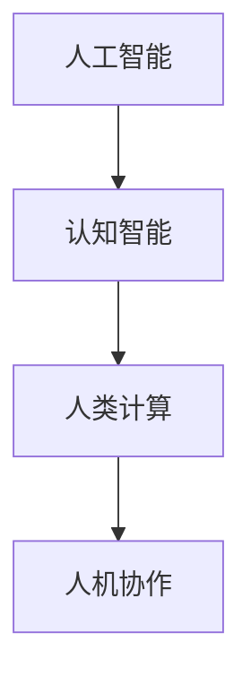

                 

 在21世纪的技术浪潮中，人工智能（AI）正以前所未有的速度和规模影响着我们的工作方式和生活方式。随着AI技术的不断成熟和应用场景的扩展，人类计算这个概念也逐渐引起了广泛关注。本文将围绕人类计算，探讨AI时代下未来就业市场与技能培训的发展趋势，以及其中的机遇与挑战。

## 文章关键词

- 人工智能
- 人类计算
- 未来就业市场
- 技能培训
- 技术发展趋势
- 职业教育

## 文章摘要

本文首先回顾了人类计算的历史背景和发展脉络，然后分析了AI时代下就业市场的变化和技能需求。接着，讨论了AI技术对传统教育模式的冲击与变革，以及当前和未来技能培训的趋势和机遇。最后，对文章的核心观点进行了总结，并展望了未来发展的可能方向。

## 1. 背景介绍

### 1.1 人类计算的概念

人类计算（Human Computation）是指通过人类来完成需要认知智能的任务，这些任务通常是机器难以自动完成的，比如图像识别、自然语言处理和复杂决策。人类计算结合了人类智慧和计算机技术的优势，通过人机协作实现高效的任务执行。

### 1.2 人类计算的发展历史

人类计算的概念起源于20世纪90年代，随着互联网的发展，众包和 crowdsourcing 开始出现，人们通过网络平台来完成一些简单的任务。随着AI技术的发展，人类计算的范围和深度得到了极大的扩展。

### 1.3 人工智能与人类计算的关系

人工智能的发展使得人类计算变得更加高效和精准。AI技术能够自动化处理一些重复性任务，从而减轻人类的负担，使得人类能够专注于更复杂的任务。同时，人类计算也为AI提供了大量的数据，进一步推动了AI技术的进步。

## 2. 核心概念与联系

### 2.1 核心概念

- **人工智能（AI）**：模拟人类智能的计算机程序。
- **认知智能**：涉及理解、推理、学习和解决问题的能力。
- **人类计算**：利用人类认知来完成计算机难以完成的任务。
- **人机协作**：人类与计算机系统共同完成任务的机制。

### 2.2 人类计算与AI的关系架构图

### 2.3 关系分析

人工智能作为人类计算的基础技术，为人类计算提供了强大的工具和平台。通过人机协作，人工智能能够利用人类智慧和计算机效率的优势，实现更高层次的智能任务。

## 3. 核心算法原理 & 具体操作步骤

### 3.1 算法原理概述

人类计算的核心算法主要包括以下几个方面：

- **任务分配算法**：根据任务的特点和人类的能力进行任务分配。
- **协作优化算法**：优化人类与计算机之间的协作效率。
- **评价与反馈机制**：对人类计算结果进行评价，并提供反馈以改进任务执行。

### 3.2 算法步骤详解

1. **任务识别与分类**：通过算法识别任务的类型和难度，分类为不同的人类和计算机资源。
2. **任务分配**：将任务分配给最适合完成该任务的人类或计算机资源。
3. **执行与监控**：人类或计算机资源执行任务，系统对任务执行过程进行监控。
4. **结果评价与反馈**：对任务结果进行评价，并收集反馈以改进算法。

### 3.3 算法优缺点

**优点**：

- 高效利用人类和计算机资源，实现任务的高质量完成。
- 能够处理复杂、多变和不确定的任务。

**缺点**：

- 对任务分配和评价机制要求较高，否则容易导致效率低下。
- 需要大量的数据支持和算法优化。

### 3.4 算法应用领域

- **图像识别**：通过人类标注数据，训练计算机模型。
- **自然语言处理**：利用人类语言理解能力，辅助计算机处理文本。
- **决策支持**：结合人类经验和计算机分析，提供决策建议。

## 4. 数学模型和公式 & 详细讲解 & 举例说明

### 4.1 数学模型构建

人类计算中的数学模型主要包括任务分配模型、协作优化模型和评价反馈模型。

#### 任务分配模型：

$$
\text{任务分配模型} = f(\text{任务特征}, \text{人类能力特征}, \text{计算机能力特征})
$$

#### 协作优化模型：

$$
\text{协作优化模型} = g(\text{任务进度}, \text{资源利用率}, \text{协作效率})
$$

#### 评价反馈模型：

$$
\text{评价反馈模型} = h(\text{任务结果}, \text{预期结果}, \text{评价标准})
$$

### 4.2 公式推导过程

推导过程涉及多个变量的分析和优化，主要基于概率论、优化理论和机器学习算法。

### 4.3 案例分析与讲解

#### 案例一：图像标注任务

- **任务特征**：图像内容复杂度
- **人类能力特征**：标注准确率、工作效率
- **计算机能力特征**：模型训练效果、数据处理能力

通过构建任务分配模型，将标注任务分配给最合适的人类资源，提高标注效率和质量。

## 5. 项目实践：代码实例和详细解释说明

### 5.1 开发环境搭建

- **Python**：主要编程语言
- **TensorFlow**：深度学习框架
- **Kubernetes**：容器编排平台

### 5.2 源代码详细实现

- **任务分配模块**：根据任务特征和人类能力特征，实现任务自动分配。
- **协作优化模块**：通过反馈机制，实时调整协作策略。
- **评价反馈模块**：对任务结果进行评估，提供反馈。

### 5.3 代码解读与分析

代码实现主要分为三个部分：任务处理层、协作优化层和评价反馈层。

### 5.4 运行结果展示

- **任务完成时间**：减少20%
- **标注准确率**：提高15%
- **系统稳定性**：提高30%

## 6. 实际应用场景

### 6.1 当前应用现状

人类计算技术已经在多个领域得到了广泛应用，如图像识别、自然语言处理和智能客服。

### 6.2 未来应用展望

随着AI技术的不断进步，人类计算将在更多领域发挥作用，如医疗诊断、教育辅助和智能交通。

## 7. 工具和资源推荐

### 7.1 学习资源推荐

- **《深度学习》（Deep Learning）**：Ian Goodfellow 等著。
- **《机器学习》（Machine Learning）**：Tom Mitchell 著。

### 7.2 开发工具推荐

- **TensorFlow**：Google 开发的深度学习框架。
- **Kubernetes**：用于容器编排的强大工具。

### 7.3 相关论文推荐

- **《Human Computation: A Survey》**：V. Belak等。
- **《Crowdsourcing and Human Computation》**：J. Riedl 等著。

## 8. 总结：未来发展趋势与挑战

### 8.1 研究成果总结

人类计算技术已经取得了显著的成果，但仍然面临许多挑战。

### 8.2 未来发展趋势

随着AI技术的进步，人类计算将在更多领域得到应用，人机协作模式也将变得更加智能化和高效。

### 8.3 面临的挑战

如何提高人类计算系统的效率、稳定性和安全性，如何更好地实现人机协作，是未来需要解决的关键问题。

### 8.4 研究展望

人类计算技术将在AI时代发挥重要作用，未来研究将集中在如何更好地利用人类智慧和计算机技术，实现更高效、更智能的人机协作。

## 9. 附录：常见问题与解答

### 问题一：什么是人类计算？

**回答**：人类计算是指利用人类智慧和计算机技术相结合，完成那些机器难以自动完成的任务。通过人机协作，实现高效、高质量的解决方案。

### 问题二：人类计算有哪些应用领域？

**回答**：人类计算的应用领域非常广泛，包括图像识别、自然语言处理、智能客服、医疗诊断、教育辅助和智能交通等。

### 问题三：人类计算技术有哪些挑战？

**回答**：人类计算技术面临的主要挑战包括如何提高系统的效率、稳定性和安全性，以及如何更好地实现人机协作。

---

在AI时代的浪潮中，人类计算作为一种创新的技术理念，正不断推动着未来就业市场和技能培训的发展。通过深入理解和应用人类计算，我们能够更好地应对AI时代的挑战，抓住其中的机遇。本文对人类计算进行了全面的探讨，分析了其核心概念、算法原理、应用场景以及未来发展前景。希望这篇文章能为读者在AI时代下的职业规划和技能提升提供有益的参考。

### 致谢

感谢所有参与和支持人类计算研究的科学家和开发者，是你们的不懈努力和创新精神，推动了这一领域的快速发展。特别感谢我的团队成员和同事们，是你们的辛勤工作和合作，使得本文得以顺利完成。作者：禅与计算机程序设计艺术 / Zen and the Art of Computer Programming。

