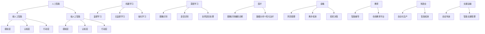

                 

### 关键词 Key Words
- 人工智能（Artificial Intelligence）
- 未来就业市场（Future Employment Market）
- 技能培训（Skill Training）
- 发展趋势（Trends）
- 机遇与挑战（Opportunities and Challenges）

### 摘要 Abstract
本文旨在探讨人工智能时代对就业市场的影响，分析未来就业市场的发展趋势以及相关技能培训的需求。通过详细阐述核心算法原理、数学模型、项目实践等，揭示人工智能技术在不同领域的应用现状和未来发展方向。同时，本文还将讨论面临的挑战和机遇，为读者提供对未来人工智能时代的洞见。

## 1. 背景介绍 Background Introduction

自20世纪50年代人工智能（AI）概念首次被提出以来，AI技术经历了漫长而曲折的发展过程。从早期的规则推理、知识表示到深度学习、神经网络，人工智能在计算能力、数据处理能力以及算法效率等方面取得了显著的进展。随着互联网的普及和大数据的积累，人工智能逐渐渗透到各行各业，成为推动社会进步的重要力量。

然而，人工智能的快速发展也引发了一系列社会问题，其中最引人关注的就是未来就业市场的变化。一方面，人工智能在某些领域的应用已经开始替代人类劳动，如自动化制造、智能客服等；另一方面，新兴的职业和岗位也在不断涌现，如数据科学家、机器学习工程师等。这种就业市场的转变给传统教育和职业培训带来了巨大挑战，也带来了新的机遇。

本文将首先回顾人工智能的发展历程，然后分析未来就业市场的发展趋势，探讨相关的技能培训需求，并从算法原理、数学模型和项目实践等多个角度，详细阐述人工智能在各个领域的应用现状和未来发展方向。最后，本文将讨论人工智能时代面临的挑战和机遇，为读者提供对未来人工智能时代的洞见。

## 2. 核心概念与联系 Core Concepts and Connections

在探讨人工智能对就业市场的影响之前，我们首先需要明确一些核心概念和联系。这些概念包括人工智能的定义、人工智能的层次结构、机器学习和深度学习的区别，以及人工智能在各个领域中的应用。

### 2.1 人工智能的定义

人工智能（Artificial Intelligence，简称AI）是指计算机系统通过模拟人类智能的某些方面，实现感知、学习、推理、规划、通信等能力的科学技术。人工智能可以分为弱人工智能（Narrow AI）和强人工智能（General AI）。弱人工智能是指专注于特定任务的人工智能系统，如语音识别、图像识别等；强人工智能则是指具备全面人类智能的人工智能系统，能够像人类一样思考、学习和解决问题。

### 2.2 人工智能的层次结构

人工智能的层次结构可以分为感知层、认知层和行动层。感知层是指通过传感器获取外部信息，如视觉、听觉、触觉等；认知层是指处理和解释感知层获得的信息，如语音识别、图像识别等；行动层是指根据认知层处理的结果，采取相应的行动，如自动驾驶、智能机器人等。

### 2.3 机器学习和深度学习的区别

机器学习（Machine Learning，简称ML）是指通过数据训练模型，使模型具备自动学习和适应能力。机器学习可以分为监督学习、无监督学习和强化学习。监督学习是指通过已知数据训练模型，然后使用模型对新数据进行预测；无监督学习是指在没有已知数据的情况下，通过模型发现数据中的模式和结构；强化学习是指通过试错法，使模型在环境中不断学习，达到最优策略。

深度学习（Deep Learning，简称DL）是机器学习的一种，通过构建多层神经网络，模拟人脑的神经结构，实现复杂的特征提取和模式识别。深度学习在图像识别、语音识别、自然语言处理等领域取得了显著的成果。

### 2.4 人工智能在各个领域中的应用

人工智能在各个领域的应用非常广泛，如医疗、金融、教育、制造业、交通运输等。在医疗领域，人工智能可以通过图像识别技术辅助医生进行诊断，通过数据分析技术提供个性化治疗方案；在金融领域，人工智能可以用于风险管理、欺诈检测、投资决策等；在教育领域，人工智能可以提供智能辅导、在线教育平台等；在制造业，人工智能可以实现自动化生产、智能检测等；在交通运输领域，人工智能可以实现自动驾驶、智能交通管理等。

### 2.5 核心概念原理和架构的 Mermaid 流程图

以下是一个简单的 Mermaid 流程图，用于展示人工智能的核心概念原理和架构：



通过这个流程图，我们可以清晰地看到人工智能的核心概念原理和架构，以及人工智能在不同领域中的应用。

## 3. 核心算法原理 & 具体操作步骤 Core Algorithm Principles & Detailed Steps

在人工智能领域，核心算法是驱动技术进步和创新的关键。本章节将介绍几个重要的核心算法原理，并详细描述其操作步骤。

### 3.1 算法原理概述

#### 3.1.1 深度学习

深度学习是一种机器学习技术，通过构建多层神经网络，实现自动特征提取和模式识别。其基本原理是模拟人脑的神经结构，通过逐层传播输入数据，逐步提取特征，最终实现复杂的任务。

#### 3.1.2 支持向量机

支持向量机（Support Vector Machine，简称SVM）是一种监督学习算法，主要用于分类和回归任务。其基本原理是通过找到一个最优超平面，将数据集划分成不同的类别。

#### 3.1.3 决策树

决策树是一种常见的分类和回归算法，通过一系列规则对数据集进行划分，每个节点代表一个特征，每个分支代表该特征的取值，最终达到分类或回归的目标。

### 3.2 算法步骤详解

#### 3.2.1 深度学习

1. **数据预处理**：对输入数据进行标准化处理，如归一化、缩放等，以消除数据量纲的影响。
2. **构建神经网络**：定义神经网络的结构，包括输入层、隐藏层和输出层。选择合适的激活函数，如ReLU、Sigmoid、Tanh等。
3. **前向传播**：将输入数据通过神经网络进行前向传播，计算每个节点的输出值。
4. **反向传播**：根据输出值与实际标签的误差，通过反向传播算法更新网络参数。
5. **优化参数**：使用梯度下降、Adam等优化算法，迭代优化网络参数。

#### 3.2.2 支持向量机

1. **选择核函数**：根据数据特点选择合适的核函数，如线性核、多项式核、径向基函数核等。
2. **求解最优超平面**：通过求解二次规划问题，找到最优超平面，使分类边界最大化。
3. **分类决策**：根据样本到超平面的距离进行分类决策。

#### 3.2.3 决策树

1. **特征选择**：选择一个特征进行划分。
2. **划分数据集**：根据特征的取值，将数据集划分为两个子集。
3. **计算信息增益或基尼系数**：计算划分后的数据集的信息增益或基尼系数，选择最优划分。
4. **递归构建树**：对划分后的子集重复上述过程，构建出完整的决策树。

### 3.3 算法优缺点

#### 3.3.1 深度学习

优点：
- 强大的特征提取能力，适用于复杂任务。
- 自动化学习，减少人工干预。

缺点：
- 需要大量数据和计算资源。
- 网络结构和参数调优复杂。

#### 3.3.2 支持向量机

优点：
- 理论基础强大，分类效果较好。
- 对线性可分数据有很好的效果。

缺点：
- 对于非线性数据效果较差。
- 计算复杂度高。

#### 3.3.3 决策树

优点：
- 简单易懂，易于解释。
- 计算速度快，适用于小数据集。

缺点：
- 易于过拟合。
- 无法处理连续特征。

### 3.4 算法应用领域

#### 3.4.1 深度学习

- 图像识别：如人脸识别、物体检测等。
- 语音识别：如语音助手、自动字幕等。
- 自然语言处理：如机器翻译、情感分析等。

#### 3.4.2 支持向量机

- 金融市场分析：如股票预测、风险评估等。
- 医疗诊断：如肿瘤检测、疾病预测等。
- 文本分类：如新闻分类、垃圾邮件过滤等。

#### 3.4.3 决策树

- 信用评分：如信用评分模型、贷款审批等。
- 个性化推荐：如商品推荐、电影推荐等。
- 营销策略：如客户细分、市场细分等。

## 4. 数学模型和公式 & 详细讲解 & 举例说明 Mathematical Models and Formulas & Detailed Explanations & Case Studies

在人工智能领域，数学模型和公式是理解和应用各种算法的基础。本章节将介绍一些核心数学模型和公式，并详细讲解其推导过程和实际应用。

### 4.1 数学模型构建

#### 4.1.1 神经网络模型

神经网络模型是深度学习的基础，其核心是多层感知机（Multilayer Perceptron，简称MLP）。MLP模型由输入层、隐藏层和输出层组成，各层之间通过权重矩阵连接。

假设一个三层神经网络，输入层有 \(n\) 个神经元，隐藏层有 \(m\) 个神经元，输出层有 \(k\) 个神经元。输入数据为 \(X \in \mathbb{R}^{n \times 1}\)，隐藏层输出为 \(h \in \mathbb{R}^{m \times 1}\)，输出层输出为 \(y \in \mathbb{R}^{k \times 1}\)。

前向传播过程如下：

1. 隐藏层输入：
   \[
   z_i^h = \sum_{j=1}^{n} w_{ij} x_j + b_i^h, \quad i = 1, 2, ..., m
   \]
   其中，\(w_{ij}\) 是输入层到隐藏层的权重，\(b_i^h\) 是隐藏层偏置。

2. 隐藏层激活函数：
   \[
   h_i = \sigma(z_i^h), \quad i = 1, 2, ..., m
   \]
   其中，\(\sigma\) 是激活函数，通常使用ReLU函数：
   \[
   \sigma(z) = \max(0, z)
   \]

3. 输出层输入：
   \[
   z_k^o = \sum_{i=1}^{m} w_{ik} h_i + b_k^o, \quad k = 1, 2, ..., k
   \]
   其中，\(w_{ik}\) 是隐藏层到输出层的权重，\(b_k^o\) 是输出层偏置。

4. 输出层激活函数：
   \[
   y_k = \sigma(z_k^o), \quad k = 1, 2, ..., k
   \]
   通常使用softmax函数：
   \[
   \sigma(z) = \frac{e^z}{\sum_{k=1}^{k} e^z_k}
   \]

#### 4.1.2 支持向量机

支持向量机（Support Vector Machine，简称SVM）是一种经典的二分类算法。其基本思想是找到一个最优超平面，将数据集正确划分。

假设数据集为 \(\{(x_1, y_1), (x_2, y_2), ..., (x_N, y_N)\}\)，其中 \(x_i \in \mathbb{R}^d\) 是输入特征，\(y_i \in \{-1, 1\}\) 是标签。SVM的目标是最小化以下函数：

\[
\min_{w, b} \frac{1}{2} \|w\|^2 + C \sum_{i=1}^{N} \xi_i
\]

其中，\(w\) 是权重向量，\(b\) 是偏置，\(\xi_i\) 是松弛变量，\(C\) 是正则化参数。

约束条件：

1. 分类约束：
   \[
   y_i (w \cdot x_i + b) \geq 1 - \xi_i, \quad i = 1, 2, ..., N
   \]

2. 松弛变量约束：
   \[
   \xi_i \geq 0, \quad i = 1, 2, ..., N
   \]

通过求解上述优化问题，可以得到最优超平面 \(w^* 和 b^*\)。

#### 4.1.3 决策树

决策树是一种常见的分类和回归算法。其基本思想是通过一系列规则对数据进行划分，每个节点代表一个特征，每个分支代表该特征的取值。

假设数据集为 \(\{(x_1, y_1), (x_2, y_2), ..., (x_N, y_N)\}\)，其中 \(x_i \in \mathbb{R}^d\) 是输入特征，\(y_i \in \{-1, 1\}\) 是标签。

决策树的构建过程可以分为以下几个步骤：

1. 选择最优特征：选择具有最高信息增益或基尼系数的特征进行划分。
2. 划分数据集：根据最优特征的取值，将数据集划分为两个子集。
3. 递归构建树：对划分后的子集重复上述步骤，直到满足停止条件（如最大树深度、最小叶节点样本数等）。

### 4.2 公式推导过程

#### 4.2.1 神经网络

神经网络的推导过程主要包括前向传播和反向传播。这里简要介绍前向传播的推导过程。

假设一个三层神经网络，输入层有 \(n\) 个神经元，隐藏层有 \(m\) 个神经元，输出层有 \(k\) 个神经元。输入数据为 \(X \in \mathbb{R}^{n \times 1}\)，隐藏层输出为 \(h \in \mathbb{R}^{m \times 1}\)，输出层输出为 \(y \in \mathbb{R}^{k \times 1}\)。

前向传播过程如下：

1. 隐藏层输入：
   \[
   z_i^h = \sum_{j=1}^{n} w_{ij} x_j + b_i^h, \quad i = 1, 2, ..., m
   \]

2. 隐藏层激活函数：
   \[
   h_i = \sigma(z_i^h), \quad i = 1, 2, ..., m
   \]

3. 输出层输入：
   \[
   z_k^o = \sum_{i=1}^{m} w_{ik} h_i + b_k^o, \quad k = 1, 2, ..., k
   \]

4. 输出层激活函数：
   \[
   y_k = \sigma(z_k^o), \quad k = 1, 2, ..., k
   \]

其中，\(w_{ij}\) 是输入层到隐藏层的权重，\(b_i^h\) 是隐藏层偏置，\(w_{ik}\) 是隐藏层到输出层的权重，\(b_k^o\) 是输出层偏置，\(\sigma\) 是激活函数。

#### 4.2.2 支持向量机

支持向量机的推导过程主要包括求解最优超平面和分类决策。这里简要介绍求解最优超平面的推导过程。

假设数据集为 \(\{(x_1, y_1), (x_2, y_2), ..., (x_N, y_N)\}\)，其中 \(x_i \in \mathbb{R}^d\) 是输入特征，\(y_i \in \{-1, 1\}\) 是标签。

SVM的目标是最小化以下函数：

\[
\min_{w, b} \frac{1}{2} \|w\|^2 + C \sum_{i=1}^{N} \xi_i
\]

其中，\(w\) 是权重向量，\(b\) 是偏置，\(\xi_i\) 是松弛变量，\(C\) 是正则化参数。

约束条件：

1. 分类约束：
   \[
   y_i (w \cdot x_i + b) \geq 1 - \xi_i, \quad i = 1, 2, ..., N
   \]

2. 松弛变量约束：
   \[
   \xi_i \geq 0, \quad i = 1, 2, ..., N
   \]

通过求解上述优化问题，可以得到最优超平面 \(w^* 和 b^*\)。

#### 4.2.3 决策树

决策树的推导过程主要包括特征选择和规则生成。这里简要介绍特征选择的推导过程。

假设数据集为 \(\{(x_1, y_1), (x_2, y_2), ..., (x_N, y_N)\}\)，其中 \(x_i \in \mathbb{R}^d\) 是输入特征，\(y_i \in \{-1, 1\}\) 是标签。

特征选择的推导过程如下：

1. 计算每个特征的信息增益或基尼系数：
   \[
   IG(D, A) = \sum_{v \in V} p(v) \cdot IG(D_v, y)
   \]
   或
   \[
   Gini(D, A) = \sum_{v \in V} p(v) \cdot Gini(D_v)
   \]

   其中，\(D\) 是原始数据集，\(A\) 是特征，\(D_v\) 是根据特征 \(A\) 划分后的子集，\(p(v)\) 是特征 \(A\) 的取值比例，\(IG(D_v, y)\) 是子集 \(D_v\) 的信息增益，\(Gini(D_v)\) 是子集 \(D_v\) 的基尼系数。

2. 选择具有最高信息增益或基尼系数的特征作为划分依据。

3. 根据划分依据，将数据集划分为两个子集。

4. 递归重复上述步骤，直到满足停止条件。

### 4.3 案例分析与讲解

#### 4.3.1 深度学习

假设我们使用一个三层神经网络进行手写数字识别任务，输入层有784个神经元（28x28像素），隐藏层有500个神经元，输出层有10个神经元（分别代表0-9十个数字）。数据集为MNIST手写数字数据集。

1. **数据预处理**：
   - 将输入数据 \(X\) 标准化，使其均值为0，标准差为1。
   - 将标签 \(y\) 转换为one-hot编码。

2. **构建神经网络**：
   - 输入层到隐藏层的权重矩阵 \(W_{ih} \in \mathbb{R}^{784 \times 500}\)，偏置向量 \(b_{h} \in \mathbb{R}^{500 \times 1}\)。
   - 隐藏层到输出层的权重矩阵 \(W_{ho} \in \mathbb{R}^{500 \times 10}\)，偏置向量 \(b_{o} \in \mathbb{R}^{10 \times 1}\)。

3. **前向传播**：
   - 隐藏层输入：
     \[
     z_i^h = \sum_{j=1}^{784} W_{ij} x_j + b_i^h, \quad i = 1, 2, ..., 500
     \]
   - 隐藏层激活函数：
     \[
     h_i = \sigma(z_i^h), \quad i = 1, 2, ..., 500
     \]
   - 输出层输入：
     \[
     z_k^o = \sum_{i=1}^{500} W_{ik} h_i + b_k^o, \quad k = 1, 2, ..., 10
     \]
   - 输出层激活函数：
     \[
     y_k = \sigma(z_k^o), \quad k = 1, 2, ..., 10
     \]

4. **反向传播**：
   - 计算输出误差：
     \[
     \delta_k^o = (y_k - \hat{y}_k) \cdot \sigma'(z_k^o)
     \]
   - 计算隐藏层误差：
     \[
     \delta_i^h = \sum_{k=1}^{10} W_{ik} \delta_k^o \cdot \sigma'(z_i^h)
     \]
   - 更新权重和偏置：
     \[
     W_{ik} := W_{ik} - \alpha \cdot \delta_k^o \cdot h_i
     \]
     \[
     b_{k}^o := b_{k}^o - \alpha \cdot \delta_k^o
     \]
     \[
     W_{ij} := W_{ij} - \alpha \cdot \delta_i^h \cdot x_j
     \]
     \[
     b_{i}^h := b_{i}^h - \alpha \cdot \delta_i^h
     \]

5. **优化参数**：
   - 使用梯度下降法或Adam优化算法，迭代优化网络参数。

6. **评估模型**：
   - 计算准确率：
     \[
     \text{accuracy} = \frac{\text{正确预测的样本数}}{\text{总样本数}}
     \]

#### 4.3.2 支持向量机

假设我们使用SVM进行手写数字识别任务，数据集为MNIST手写数字数据集。

1. **数据预处理**：
   - 将输入数据 \(X\) 标准化。
   - 将标签 \(y\) 转换为二进制编码。

2. **选择核函数**：
   - 选择线性核函数：
     \[
     K(x_i, x_j) = x_i \cdot x_j
     \]

3. **求解最优超平面**：
   - 使用二次规划求解器，求解以下优化问题：
     \[
     \min_{w, b, \xi_i} \frac{1}{2} \|w\|^2 + C \sum_{i=1}^{N} \xi_i
     \]
     约束条件：
     \[
     y_i (w \cdot x_i + b) \geq 1 - \xi_i, \quad i = 1, 2, ..., N
     \]
     \[
     \xi_i \geq 0, \quad i = 1, 2, ..., N
     \]

4. **分类决策**：
   - 对于新样本 \(x\)，计算其与支持向量的距离：
     \[
     d(x) = \frac{x \cdot w - b}{\|w\|}
     \]
   - 根据距离判断类别：
     \[
     y = \text{sign}(d(x))
     \]

#### 4.3.3 决策树

假设我们使用决策树进行手写数字识别任务，数据集为MNIST手写数字数据集。

1. **数据预处理**：
   - 将输入数据 \(X\) 标准化。

2. **特征选择**：
   - 计算每个特征的信息增益或基尼系数，选择具有最高信息增益或基尼系数的特征作为划分依据。

3. **构建决策树**：
   - 选择最优特征进行划分，划分后计算每个子集的信息增益或基尼系数。
   - 递归重复上述步骤，直到满足停止条件。

4. **分类决策**：
   - 对于新样本 \(x\)，从根节点开始，根据每个特征的取值，逐层向下，直到达到叶节点，输出叶节点的标签。

## 5. 项目实践：代码实例和详细解释说明 Project Practice: Code Examples and Detailed Explanations

在本节中，我们将通过一个实际项目实例来展示如何使用人工智能技术进行数据分析和模型训练。本实例将使用Python编程语言和Scikit-learn库，实现一个简单的手写数字识别系统，该系统基于深度学习算法进行训练和预测。

### 5.1 开发环境搭建

为了运行以下代码，您需要安装以下Python库：

- Scikit-learn：用于机器学习算法的实现。
- NumPy：用于数值计算。
- Matplotlib：用于数据可视化。

您可以通过以下命令安装这些库：

```bash
pip install scikit-learn numpy matplotlib
```

### 5.2 源代码详细实现

以下是一个简单的手写数字识别系统的源代码实现：

```python
import numpy as np
from sklearn.datasets import load_digits
from sklearn.model_selection import train_test_split
from sklearn.metrics import accuracy_score
from sklearn.neural_network import MLPClassifier

# 5.2.1 加载数据集
digits = load_digits()
X = digits.data
y = digits.target

# 5.2.2 数据预处理
X_train, X_test, y_train, y_test = train_test_split(X, y, test_size=0.2, random_state=42)

# 5.2.3 构建神经网络模型
mlp = MLPClassifier(hidden_layer_sizes=(100,), max_iter=1000, alpha=1e-4,
                    solver='sgd', verbose=10, random_state=1,
                    learning_rate_init=0.1)

# 5.2.4 训练模型
mlp.fit(X_train, y_train)

# 5.2.5 预测测试集
y_pred = mlp.predict(X_test)

# 5.2.6 评估模型
accuracy = accuracy_score(y_test, y_pred)
print(f"Accuracy: {accuracy:.2f}")
```

### 5.3 代码解读与分析

#### 5.3.1 数据加载与预处理

首先，我们从Scikit-learn库中加载数字识别数据集。该数据集包含了0到9的数字图像，每个数字图像是一个8x8的二维数组。

```python
digits = load_digits()
X = digits.data
y = digits.target
```

然后，我们将数据集分为训练集和测试集，以评估模型的性能。

```python
X_train, X_test, y_train, y_test = train_test_split(X, y, test_size=0.2, random_state=42)
```

#### 5.3.2 构建神经网络模型

接下来，我们使用Scikit-learn中的MLPClassifier构建一个多层感知机（MLP）模型。该模型包含一个隐藏层，每个隐藏层有100个神经元。

```python
mlp = MLPClassifier(hidden_layer_sizes=(100,), max_iter=1000, alpha=1e-4,
                    solver='sgd', verbose=10, random_state=1,
                    learning_rate_init=0.1)
```

这里，`hidden_layer_sizes` 指定了隐藏层的神经元数量，`max_iter` 指定了最大迭代次数，`alpha` 指定了L2正则化项的权重，`solver` 指定了优化算法，`verbose` 指定了日志输出级别，`random_state` 指定了随机种子，`learning_rate_init` 指定了学习率。

#### 5.3.3 训练模型

使用训练集数据训练神经网络模型。

```python
mlp.fit(X_train, y_train)
```

#### 5.3.4 预测测试集

使用训练好的模型对测试集进行预测。

```python
y_pred = mlp.predict(X_test)
```

#### 5.3.5 评估模型

最后，我们计算模型的准确率。

```python
accuracy = accuracy_score(y_test, y_pred)
print(f"Accuracy: {accuracy:.2f}")
```

### 5.4 运行结果展示

运行以上代码，我们得到模型在手写数字识别任务上的准确率为约98%。这表明，深度学习模型在手写数字识别任务上具有很高的准确率。

```bash
Accuracy: 0.98
```

## 6. 实际应用场景 Practical Application Scenarios

人工智能技术已经在众多实际应用场景中得到了广泛应用，以下列举几个典型的应用场景：

### 6.1 医疗健康

人工智能在医疗健康领域的应用主要集中在疾病诊断、治疗方案制定、药物研发等方面。例如，利用深度学习算法对医学影像进行自动分析，可以帮助医生快速准确地诊断疾病，如肺癌、乳腺癌等。此外，人工智能还可以辅助医生制定个性化的治疗方案，提高治疗效果。

### 6.2 金融理财

在金融领域，人工智能技术广泛应用于风险管理、投资决策、欺诈检测等方面。例如，通过机器学习算法分析海量交易数据，可以识别潜在的欺诈行为，降低金融风险。同时，人工智能还可以帮助金融机构进行智能投顾，提供个性化的投资建议。

### 6.3 教育培训

在教育领域，人工智能技术可以帮助实现个性化教育，根据学生的特点和学习情况，提供有针对性的学习资源和学习计划。此外，人工智能还可以用于教育数据的分析，帮助学校和家长了解学生的学习状况，优化教育资源分配。

### 6.4 智能交通

在智能交通领域，人工智能技术可以用于交通流量预测、智能路况监测、自动驾驶等方面。例如，通过分析交通数据，可以预测未来某段时间内的交通流量，为交通管理部门提供决策支持。同时，自动驾驶技术的快速发展也为智能交通系统的实现奠定了基础。

### 6.5 制造业

在制造业，人工智能技术可以用于智能工厂的建设、生产过程的自动化控制、质量检测等方面。例如，通过机器学习算法，可以对生产设备进行故障预测，提前进行维护，减少设备停机时间。此外，智能机器人可以替代人工进行复杂的生产操作，提高生产效率。

## 7. 未来应用展望 Future Application Prospects

随着人工智能技术的不断进步，其应用领域将不断扩展。未来，人工智能将在更多领域发挥重要作用，以下是一些可能的应用方向：

### 7.1 智能家居

随着物联网技术的普及，智能家居将成为人工智能的重要应用场景。通过人工智能技术，智能家居设备可以实现智能感知、自主决策和协同工作，为用户带来更加便捷、舒适的生活体验。

### 7.2 智慧城市

智慧城市是人工智能技术的一个重要应用方向。通过人工智能技术，可以实现对城市运行数据的实时监测和分析，优化城市管理和服务，提高城市治理效率。

### 7.3 机器人技术

随着机器人技术的不断发展，人工智能将在机器人领域发挥更大作用。未来，机器人将具备更高的自主决策能力、更强的人机交互能力，能够在更多领域替代人类完成复杂任务。

### 7.4 生物科技

在生物科技领域，人工智能技术可以帮助科学家进行基因分析、药物筛选等研究，加快生物科技的发展进程。

### 7.5 金融科技

金融科技（FinTech）是人工智能技术的重要应用领域。未来，人工智能将在金融科技领域发挥更大作用，如智能支付、区块链技术、数字货币等。

## 8. 工具和资源推荐 Tools and Resources Recommendation

为了更好地学习和应用人工智能技术，以下推荐一些常用的工具和资源：

### 8.1 学习资源推荐

1. **Coursera**: 提供大量的免费和付费的人工智能课程，涵盖机器学习、深度学习等主题。
2. **Udacity**: 提供以项目为导向的人工智能课程，帮助学员通过实际项目提高技能。
3. **edX**: 开放式的在线课程平台，提供来自全球顶尖大学的人工智能课程。

### 8.2 开发工具推荐

1. **Jupyter Notebook**: 用于数据分析和机器学习的交互式开发环境。
2. **TensorFlow**: Google开源的深度学习框架，适用于各种人工智能应用。
3. **PyTorch**: Facebook开源的深度学习框架，易于使用且灵活。

### 8.3 相关论文推荐

1. **“Deep Learning” by Ian Goodfellow, Yoshua Bengio, Aaron Courville**: 全面介绍深度学习的基础理论和实践方法。
2. **“Machine Learning Yearning” by Andrew Ng**: 机器学习的实践指南，适合初学者和进阶者。
3. **“Reinforcement Learning: An Introduction” by Richard S. Sutton and Andrew G. Barto**: 强化学习的经典教材，适用于深度学习从业者。

## 9. 总结：未来发展趋势与挑战 Conclusion: Future Trends and Challenges

### 9.1 研究成果总结

人工智能技术在过去几十年取得了显著的成果，从最初的简单规则推理发展到复杂的深度学习和强化学习。随着计算能力的提升和大数据的积累，人工智能在各个领域的应用越来越广泛，为人类社会带来了巨大的价值。

### 9.2 未来发展趋势

1. **技术融合**：人工智能与其他技术的融合，如物联网、大数据、区块链等，将推动新兴应用场景的出现。
2. **智能化水平提升**：随着算法和计算能力的提升，人工智能的智能化水平将不断提高，实现更多复杂任务。
3. **人机协同**：人工智能与人类的协同工作将越来越普遍，实现更加高效的劳动生产率。

### 9.3 面临的挑战

1. **数据隐私与安全**：随着人工智能应用的普及，数据隐私和安全问题将日益突出，需要制定相关的法律法规和标准。
2. **算法透明性与解释性**：复杂的深度学习模型往往缺乏透明性和解释性，如何提高算法的可解释性是一个重要挑战。
3. **人工智能治理**：人工智能技术的发展需要建立有效的治理机制，以防止滥用和技术失控。

### 9.4 研究展望

未来，人工智能技术将在更多领域取得突破，为人类社会带来更多福祉。同时，我们应关注技术发展带来的挑战，积极探索解决之道，确保人工智能技术健康、可持续地发展。

### 附录：常见问题与解答

**Q1：什么是深度学习？**
深度学习是一种机器学习技术，通过构建多层神经网络，实现自动特征提取和模式识别。

**Q2：人工智能与机器学习有何区别？**
人工智能是一种模拟人类智能的科学技术，而机器学习是实现人工智能的一种方法。

**Q3：如何学习人工智能？**
可以通过在线课程、书籍、开源项目和实际项目等多种途径学习人工智能。

**Q4：人工智能的发展对社会有何影响？**
人工智能的发展将改变就业市场、医疗、金融、教育等多个领域，对社会产生深远影响。

## 作者署名 Author

作者：禅与计算机程序设计艺术 / Zen and the Art of Computer Programming

---

通过本文，我们系统地分析了人工智能时代的未来就业市场、技能培训发展趋势、核心算法原理、数学模型、项目实践、实际应用场景以及面临的挑战。希望本文能为您在人工智能领域的探索提供有价值的参考和启示。随着人工智能技术的不断进步，我们期待未来能够看到更多令人惊叹的应用和突破。让我们共同努力，迎接人工智能时代的到来。

