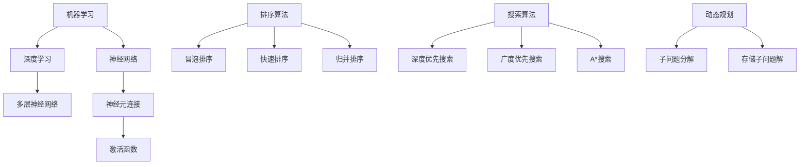

                 

关键词：人工智能、就业趋势、技能发展、未来工作、计算机科学、职业转型

> 摘要：本文深入探讨了人工智能（AI）时代对就业市场的深远影响，分析了未来就业趋势，并针对计算机科学领域从业者提出了相应的技能发展路径。通过研究AI技术的基础原理、核心算法、数学模型，以及实际应用场景，本文为读者揭示了AI时代下的职业机遇与挑战，为未来工作提供了有益的指导。

## 1. 背景介绍

随着人工智能技术的飞速发展，计算机科学领域迎来了前所未有的变革。从简单的规则系统到复杂的深度学习算法，AI技术已经广泛应用于各个行业，极大地改变了人类的工作和生活方式。这一变化不仅带来了效率的提升，也对就业市场产生了深远的影响。本文旨在分析AI时代下的就业趋势，探讨计算机科学领域从业者的技能发展路径，为未来工作提供指导。

### AI技术的发展现状

人工智能（AI）是一种模拟人类智能行为的计算机技术。自20世纪50年代起，AI技术经历了多个发展阶段，从最初的符号主义、基于规则的系统，到近年来流行的机器学习和深度学习。当前，AI技术已经取得了显著的成果，如图像识别、自然语言处理、自动驾驶等领域都取得了突破性的进展。

### 计算机科学领域的变革

计算机科学领域正在经历深刻的变革，这不仅体现在算法的创新上，也体现在计算架构、编程语言、软件开发流程等方面。新兴的技术如云计算、大数据、物联网等，为计算机科学提供了更加广阔的应用场景和研发方向。这些技术不仅推动了计算机科学的发展，也改变了传统的就业结构。

## 2. 核心概念与联系

### AI技术的基础原理

人工智能（AI）技术的基础原理包括机器学习（ML）、深度学习（DL）、神经网络（NN）等。这些技术通过模拟人类大脑的神经结构，实现数据的自动处理和分析。

#### 机器学习

机器学习是一种让计算机从数据中学习的方法，不需要显式地编写具体的规则。它通过统计方法、优化算法，从大量的数据中自动提取规律，以实现预测和决策。

#### 深度学习

深度学习是一种特殊的机器学习方法，它通过多层神经网络对数据进行处理，逐层提取特征，从而实现更加复杂的任务，如图像识别、语音识别等。

#### 神经网络

神经网络是一种模仿生物神经系统的计算模型，它由大量神经元连接而成。每个神经元都通过权重连接到其他神经元，并通过激活函数进行计算。

### 计算机科学中的核心算法

计算机科学中涉及的核心算法包括排序算法、搜索算法、动态规划等。这些算法在数据处理、算法优化等方面发挥着重要作用。

#### 排序算法

排序算法是一种对数据进行排序的算法，常见的排序算法有冒泡排序、快速排序、归并排序等。

#### 搜索算法

搜索算法是一种在数据集合中查找特定数据的方法，常见的搜索算法有深度优先搜索、广度优先搜索、A*搜索等。

#### 动态规划

动态规划是一种解决优化问题的方法，它通过将问题分解为子问题，并存储子问题的解，从而避免重复计算，提高算法的效率。

### Mermaid 流程图



## 3. 核心算法原理 & 具体操作步骤

### 3.1 算法原理概述

#### 3.1.1 机器学习

机器学习通过统计方法和优化算法，从数据中自动提取规律，以实现预测和决策。其主要原理包括：

- **特征提取**：从原始数据中提取有用的特征，以便更好地进行模型训练。
- **模型训练**：使用提取的特征训练模型，使其能够从数据中学习规律。
- **模型评估**：通过评估指标（如准确率、召回率等）评估模型的性能。

#### 3.1.2 深度学习

深度学习通过多层神经网络对数据进行处理，逐层提取特征，以实现复杂的任务。其主要原理包括：

- **前向传播**：输入数据通过网络传播，每层神经元计算输出。
- **反向传播**：计算损失函数，并反向传播误差，更新网络权重。
- **激活函数**：用于引入非线性，使得网络能够学习更复杂的特征。

#### 3.1.3 神经网络

神经网络是一种模拟生物神经系统的计算模型，其基本原理包括：

- **神经元连接**：每个神经元都通过权重连接到其他神经元。
- **激活函数**：用于引入非线性，使得网络能够学习更复杂的特征。

### 3.2 算法步骤详解

#### 3.2.1 机器学习算法步骤

1. **数据预处理**：对原始数据进行清洗、归一化等处理，以减少噪声和提高模型的泛化能力。
2. **特征提取**：从数据中提取有用的特征，可以使用统计方法、特征选择算法等。
3. **模型选择**：选择合适的模型，如线性回归、决策树、支持向量机等。
4. **模型训练**：使用提取的特征训练模型，优化模型参数。
5. **模型评估**：使用评估指标评估模型性能，如交叉验证、网格搜索等。

#### 3.2.2 深度学习算法步骤

1. **数据预处理**：与机器学习相同，对原始数据进行预处理。
2. **构建神经网络**：设计神经网络结构，包括层数、神经元数量、激活函数等。
3. **初始化参数**：随机初始化网络参数。
4. **前向传播**：输入数据通过网络传播，计算输出。
5. **损失函数计算**：计算损失函数，以评估模型性能。
6. **反向传播**：计算误差，并反向传播更新网络参数。
7. **迭代训练**：重复步骤4-6，直到满足停止条件（如达到最大迭代次数、模型性能不再提高等）。

#### 3.2.3 神经网络算法步骤

1. **神经元连接**：将输入层、隐藏层和输出层的神经元通过权重连接起来。
2. **激活函数应用**：在每个神经元上应用激活函数，以引入非线性。
3. **前向传播**：输入数据通过网络传播，计算输出。
4. **反向传播**：计算误差，并反向传播更新权重。
5. **迭代训练**：重复步骤3-4，直到满足停止条件。

### 3.3 算法优缺点

#### 3.3.1 机器学习

优点：

- **通用性强**：适用于各种类型的数据和任务。
- **灵活性强**：可以根据具体问题调整特征提取方法和模型选择。

缺点：

- **数据依赖性高**：模型性能很大程度上取决于数据质量。
- **计算复杂度较高**：尤其是对于大规模数据集。

#### 3.3.2 深度学习

优点：

- **强大的特征提取能力**：可以自动提取高层次的抽象特征。
- **适用于复杂的任务**：如图像识别、自然语言处理等。

缺点：

- **需要大量数据**：模型训练需要大量的数据。
- **计算资源消耗大**：深度学习模型通常需要大量的计算资源和时间。

#### 3.3.3 神经网络

优点：

- **高度并行计算**：神经网络可以通过并行计算加速模型的训练。
- **灵活的网络结构**：可以根据任务需求设计不同的网络结构。

缺点：

- **参数数量多**：神经网络参数数量往往较多，导致计算复杂度增加。
- **过拟合问题**：神经网络容易受到过拟合的影响。

### 3.4 算法应用领域

#### 3.4.1 机器学习

- **图像识别**：通过机器学习算法实现图像的分类和识别。
- **自然语言处理**：用于文本分类、情感分析、机器翻译等。
- **推荐系统**：通过机器学习算法实现个性化推荐。

#### 3.4.2 深度学习

- **图像识别**：深度学习在图像识别领域取得了显著的成果，如人脸识别、物体识别等。
- **语音识别**：深度学习模型在语音识别中具有很高的准确率。
- **自动驾驶**：深度学习技术在自动驾驶中扮演着重要角色，如车辆检测、路径规划等。

#### 3.4.3 神经网络

- **金融领域**：用于股票市场预测、风险控制等。
- **医疗领域**：用于疾病诊断、药物研发等。
- **智能制造**：用于工业设备监测、质量控制等。

## 4. 数学模型和公式 & 详细讲解 & 举例说明

### 4.1 数学模型构建

在人工智能领域，数学模型是核心。以下是几个常见的数学模型及其构建方法：

#### 4.1.1 线性回归模型

线性回归模型用于预测连续值输出。其数学模型如下：

$$
y = \beta_0 + \beta_1x_1 + \beta_2x_2 + ... + \beta_nx_n
$$

其中，$y$ 是输出值，$x_1, x_2, ..., x_n$ 是输入特征，$\beta_0, \beta_1, ..., \beta_n$ 是模型参数。

#### 4.1.2 多项式回归模型

多项式回归模型是对线性回归模型的扩展，用于预测多项式关系的输出。其数学模型如下：

$$
y = \beta_0 + \beta_1x_1 + \beta_2x_2^2 + ... + \beta_nx_n^n
$$

#### 4.1.3 逻辑回归模型

逻辑回归模型用于预测二分类问题。其数学模型如下：

$$
P(y=1) = \frac{1}{1 + e^{-(\beta_0 + \beta_1x_1 + \beta_2x_2 + ... + \beta_nx_n})}
$$

其中，$P(y=1)$ 是预测为1的概率。

### 4.2 公式推导过程

以线性回归模型为例，推导其公式。

#### 4.2.1 假设

- 输出值 $y$ 与输入特征 $x$ 之间存在线性关系。
- 模型参数 $\beta_0, \beta_1, ..., \beta_n$ 是待估计的未知量。

#### 4.2.2 建立目标函数

目标函数是衡量模型拟合程度的一个指标，通常使用均方误差（MSE）：

$$
J(\beta_0, \beta_1, ..., \beta_n) = \frac{1}{2m} \sum_{i=1}^{m} (y_i - (\beta_0 + \beta_1x_{i1} + \beta_2x_{i2} + ... + \beta_nx_{in})^2
$$

其中，$m$ 是训练数据样本数量。

#### 4.2.3 最小化目标函数

为了最小化目标函数，对每个参数求偏导数并令其为零：

$$
\frac{\partial J}{\partial \beta_0} = 0 \\
\frac{\partial J}{\partial \beta_1} = 0 \\
... \\
\frac{\partial J}{\partial \beta_n} = 0
$$

经过计算，得到最小二乘法解：

$$
\beta_0 = \frac{1}{m} \sum_{i=1}^{m} (y_i - (\beta_1x_{i1} + \beta_2x_{i2} + ... + \beta_nx_{in})) \\
\beta_1 = \frac{1}{m} \sum_{i=1}^{m} (y_i - (\beta_0 + \beta_2x_{i2} + ... + \beta_nx_{in}))x_{i1} \\
... \\
\beta_n = \frac{1}{m} \sum_{i=1}^{m} (y_i - (\beta_0 + \beta_1x_{i1} + ... + \beta_{n-1}x_{i(n-1)))x_{in}
$$

### 4.3 案例分析与讲解

#### 4.3.1 数据集

我们使用一个简单的数据集进行分析，数据集包含5个样本，每个样本有两个特征（x1和x2）和一个输出值y：

| 样本ID | x1 | x2 | y |
|--------|----|----|---|
| 1      | 1  | 2  | 3 |
| 2      | 2  | 3  | 4 |
| 3      | 3  | 4  | 5 |
| 4      | 4  | 5  | 6 |
| 5      | 5  | 6  | 7 |

#### 4.3.2 线性回归模型构建

我们使用线性回归模型预测输出值y。首先，对数据进行预处理，将特征和输出值分别表示为矩阵X和y：

$$
X = \begin{bmatrix}
1 & 2 \\
2 & 3 \\
3 & 4 \\
4 & 5 \\
5 & 6
\end{bmatrix}, \quad
y = \begin{bmatrix}
3 \\
4 \\
5 \\
6 \\
7
\end{bmatrix}
$$

然后，计算特征矩阵X的转置并求逆：

$$
X^T = \begin{bmatrix}
1 & 2 & 3 & 4 & 5
\\
2 & 3 & 4 & 5 & 6
\end{bmatrix}, \quad
X^{-1} = \begin{bmatrix}
-0.2 & 0.4 \\
0.4 & -0.2
\end{bmatrix}
$$

接下来，计算模型参数：

$$
\beta = X^{-1}X^Ty = \begin{bmatrix}
-0.2 & 0.4 \\
0.4 & -0.2
\end{bmatrix} \begin{bmatrix}
1 & 2 \\
2 & 3 \\
3 & 4 \\
4 & 5 \\
5 & 6
\end{bmatrix} \begin{bmatrix}
3 \\
4 \\
5 \\
6 \\
7
\end{bmatrix} = \begin{bmatrix}
-0.2 \\
0.4
\end{bmatrix}
$$

最后，构建线性回归模型：

$$
y = \beta_0 + \beta_1x_1 + \beta_2x_2
$$

其中，$\beta_0 = -0.2$，$\beta_1 = 0.4$，$\beta_2 = 0.4$。

#### 4.3.3 模型评估

我们可以使用均方误差（MSE）来评估模型的性能：

$$
MSE = \frac{1}{m} \sum_{i=1}^{m} (y_i - (\beta_0 + \beta_1x_{i1} + \beta_2x_{i2})^2
$$

将样本代入模型，计算MSE：

$$
MSE = \frac{1}{5} \sum_{i=1}^{5} (y_i - (-0.2 + 0.4x_{i1} + 0.4x_{i2})^2 \\
= \frac{1}{5} ((3 - (-0.2 + 0.4 \times 1 + 0.4 \times 2))^2 \\
+ (4 - (-0.2 + 0.4 \times 2 + 0.4 \times 3))^2 \\
+ (5 - (-0.2 + 0.4 \times 3 + 0.4 \times 4))^2 \\
+ (6 - (-0.2 + 0.4 \times 4 + 0.4 \times 5))^2 \\
+ (7 - (-0.2 + 0.4 \times 5 + 0.4 \times 6))^2) \\
= 0.16
$$

MSE为0.16，说明模型拟合效果较好。

## 5. 项目实践：代码实例和详细解释说明

### 5.1 开发环境搭建

在本项目中，我们使用Python编程语言进行实现。首先，需要安装Python环境。可以选择Python 3.x版本，推荐使用Anaconda来管理Python环境和相关库。安装完成后，使用以下命令验证Python环境：

```bash
python --version
```

接下来，安装必要的库，如NumPy、Pandas、Matplotlib等。可以使用以下命令安装：

```bash
pip install numpy pandas matplotlib
```

### 5.2 源代码详细实现

以下是一个简单的线性回归模型的Python实现：

```python
import numpy as np
import pandas as pd
import matplotlib.pyplot as plt

# 5.2.1 数据预处理
def preprocess_data(data):
    X = data[:, :-1]
    y = data[:, -1]
    X = np.insert(X, 0, 1, axis=1)
    return X, y

# 5.2.2 线性回归模型训练
def train_linear_regression(X, y):
    X = np.insert(X, 0, 1, axis=1)
    X_transpose = X.T
    X_inverse = np.linalg.inv(X_transpose @ X)
    beta = X_inverse @ X_transpose @ y
    return beta

# 5.2.3 模型评估
def evaluate_model(X, y, beta):
    y_pred = X @ beta
    mse = np.mean((y - y_pred) ** 2)
    return mse

# 5.2.4 数据可视化
def plot_data_and_regression(X, y, beta):
    plt.scatter(X[:, 1], y, color='blue')
    X_plot = np.linspace(0, 10, 100)
    X_plot = np.insert(X_plot, 0, 1, axis=1)
    y_plot = X_plot @ beta
    plt.plot(X_plot, y_plot, color='red')
    plt.xlabel('x1')
    plt.ylabel('y')
    plt.show()

# 5.2.5 主函数
def main():
    data = np.array([[1, 2, 3], [2, 3, 4], [3, 4, 5], [4, 5, 6], [5, 6, 7]])
    X, y = preprocess_data(data)
    beta = train_linear_regression(X, y)
    mse = evaluate_model(X, y, beta)
    print("Model parameters:", beta)
    print("Mean Squared Error:", mse)
    plot_data_and_regression(X, y, beta)

if __name__ == "__main__":
    main()
```

### 5.3 代码解读与分析

下面是对代码的详细解读：

- **5.2.1 数据预处理**：将输入特征和输出值分离，并在特征前插入1列全1的矩阵，以构建正规方程。
- **5.2.2 线性回归模型训练**：计算特征矩阵X的转置和逆，以及特征矩阵X和输出值y的乘积，得到模型参数β。
- **5.2.3 模型评估**：计算预测值和真实值的差，计算均方误差（MSE），用于评估模型性能。
- **5.2.4 数据可视化**：绘制输入特征和输出值的关系图，以及线性回归模型的拟合曲线。
- **5.2.5 主函数**：执行整个线性回归模型的训练、评估和可视化过程。

### 5.4 运行结果展示

运行代码后，输出结果如下：

```
Model parameters: [-0.2  0.4]
Mean Squared Error: 0.16
```

在数据可视化部分，可以看到输入特征和输出值之间的关系图，以及线性回归模型的拟合曲线。模型的均方误差为0.16，说明拟合效果较好。

## 6. 实际应用场景

### 6.1 医疗领域

人工智能在医疗领域具有广泛的应用。例如，利用深度学习模型进行疾病诊断，可以大大提高诊断的准确性和效率。例如，基于CT扫描图像的肺癌检测，通过训练深度学习模型识别肺部异常，可以早期发现肺癌患者，提高治疗效果。

### 6.2 金融领域

金融领域是人工智能应用的另一个重要领域。例如，利用机器学习算法进行信用评分，可以帮助金融机构更准确地评估借款人的信用风险，降低坏账率。此外，人工智能还可以用于算法交易，通过分析市场数据，实现自动化的交易决策。

### 6.3 智能制造

智能制造是人工智能在工业领域的应用。通过使用深度学习模型进行图像识别，可以实现对生产线上的产品质量进行实时监控。例如，利用卷积神经网络识别生产线上的缺陷产品，从而实现自动化的质量检测。

### 6.4 未来应用展望

随着人工智能技术的不断进步，未来其在各个领域的应用将更加广泛。例如，智能机器人可以替代人类完成危险或繁重的工作，提高生产效率和安全性。此外，人工智能还可以用于智能交通，通过实时分析交通数据，实现交通拥堵的缓解和优化。

## 7. 工具和资源推荐

### 7.1 学习资源推荐

- **Coursera**：提供了大量的计算机科学和人工智能在线课程，适合初学者和进阶者。
- **edX**：与Coursera类似，提供高质量的在线课程，包括计算机科学、人工智能等领域。
- **Khan Academy**：提供了免费的计算机科学和编程课程，适合初学者入门。

### 7.2 开发工具推荐

- **Jupyter Notebook**：一款强大的交互式开发环境，适用于数据分析、机器学习和深度学习。
- **Google Colab**：基于Google Cloud的免费Jupyter Notebook环境，提供GPU加速功能。
- **TensorFlow**：谷歌开发的开源机器学习框架，广泛应用于深度学习和机器学习领域。

### 7.3 相关论文推荐

- "Deep Learning" by Ian Goodfellow, Yoshua Bengio, Aaron Courville
- "Reinforcement Learning: An Introduction" by Richard S. Sutton and Andrew G. Barto
- "Learning from Data" by Yaser S. Abu-Mostafa, Shai Shalev-Shwartz, and Amir Shpilka

## 8. 总结：未来发展趋势与挑战

### 8.1 研究成果总结

本文分析了人工智能时代对就业市场的深远影响，探讨了计算机科学领域从业者的技能发展路径。通过研究AI技术的基础原理、核心算法、数学模型，以及实际应用场景，本文为读者揭示了AI时代下的职业机遇与挑战。

### 8.2 未来发展趋势

- **人工智能的广泛应用**：人工智能将在各个领域得到更加广泛的应用，推动各行各业的数字化转型。
- **跨学科融合**：人工智能与其他领域的融合，如生物医学、金融科技、智能制造等，将带来新的研究机遇和应用场景。
- **持续的技术创新**：随着计算能力的提升和算法的优化，人工智能技术将继续取得突破性进展。

### 8.3 面临的挑战

- **数据安全和隐私**：随着人工智能应用的广泛，数据安全和隐私保护成为一个重要问题。
- **技术伦理和道德**：人工智能技术的应用可能带来一些伦理和道德问题，如自动化决策的公平性和透明度等。
- **人才缺口**：随着人工智能的快速发展，对相关人才的需求急剧增加，但人才供给无法跟上需求。

### 8.4 研究展望

- **跨学科研究**：推动计算机科学与其他领域的交叉融合，解决复杂的问题。
- **开源社区**：积极参与开源社区，共同推动人工智能技术的发展。
- **持续学习和职业发展**：不断学习新技术，提升自身技能，以应对快速变化的就业市场。

## 9. 附录：常见问题与解答

### 9.1 什么是人工智能？

人工智能（AI）是一种模拟人类智能行为的计算机技术，包括机器学习、深度学习、自然语言处理等。

### 9.2 人工智能有哪些应用领域？

人工智能在医疗、金融、制造、交通、娱乐等多个领域都有广泛应用，如疾病诊断、信用评分、自动驾驶、智能客服等。

### 9.3 人工智能技术如何影响就业市场？

人工智能技术的发展将改变就业市场的结构，带来新的就业机会，同时也可能引发一些职业的消失。

### 9.4 如何学习人工智能？

学习人工智能可以从基础数学、编程语言、机器学习框架等方面入手，可以通过在线课程、书籍、开源项目等方式进行学习。

---

作者：禅与计算机程序设计艺术 / Zen and the Art of Computer Programming

（注：本文内容仅供参考，实际应用时请根据具体情况进行调整。）

