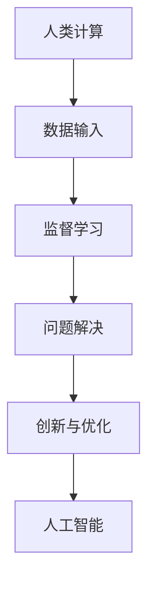

                 

在人工智能迅速发展的今天，人类计算正经历着前所未有的变革。本文将探讨在AI时代，未来技能的要求以及相应的培训方法。通过深入分析，我们旨在为读者提供有深度、有思考、有见解的专业视角。

## 关键词

- 人工智能（AI）
- 人类计算
- 未来技能
- 技能培训
- AI时代
- 技术变革

## 摘要

随着人工智能的迅猛发展，人类计算的角色正在从执行者转变为协作者和创新者。本文首先介绍AI时代的背景和趋势，随后详细探讨未来技能的要求，包括跨学科知识、数据素养、创新思维和人际沟通能力。接着，我们提出相应的培训方法，如在线教育、实践项目和跨学科课程。最后，文章总结AI时代的发展趋势与挑战，并展望未来研究的方向。

## 1. 背景介绍

### AI时代的到来

人工智能（AI）的发展已经深入到我们生活的方方面面，从智能助手到自动驾驶汽车，从医疗诊断到金融分析，AI正在改变我们的工作和生活方式。根据国际数据公司（IDC）的预测，到2025年，全球人工智能市场规模将超过5,000亿美元，成为推动经济增长的关键动力。

### 技术变革与人类计算

技术变革正在迅速重塑人类计算的角色。传统上，人类计算主要依赖于人类的逻辑思维和物理操作能力。然而，随着机器学习和深度学习技术的发展，计算机能够处理复杂的决策和任务，人类计算的角色正在从执行者转变为协作者和创新者。这意味着，人类需要具备新的技能来与AI系统协同工作。

### 人类计算的定义

人类计算不仅仅是人类执行计算任务的能力，它还包括人类与计算机之间的互动、合作和创新。在AI时代，人类计算的核心目标是提高生产效率、创造力和创新能力，同时确保AI系统的安全性和可靠性。

## 2. 核心概念与联系

### 人类计算与人工智能的关系

人类计算与人工智能（AI）密切相关。AI系统的设计、开发、部署和维护都需要人类的智慧和创新。而人类计算则为AI系统提供了必要的数据输入、监督学习和问题解决能力。下面是一个简化的Mermaid流程图，展示了人类计算与人工智能之间的关系：



### 人类计算的核心技能

在AI时代，人类计算的核心技能包括：

- **跨学科知识**：理解不同领域的知识，能够将AI技术应用于各种实际问题。
- **数据素养**：能够处理和分析数据，为AI系统提供高质量的输入。
- **创新思维**：能够提出新的想法和解决方案，推动技术进步。
- **人际沟通**：能够有效地与团队合作，协调不同角色的工作。

## 3. 核心算法原理 & 具体操作步骤

### 3.1 算法原理概述

在AI时代，核心算法的设计和实现是推动技术进步的关键。以下是一个简化的算法原理概述：

1. **数据预处理**：清洗、整理和归一化数据，为算法提供高质量的数据输入。
2. **特征提取**：从数据中提取有用的特征，用于训练模型。
3. **模型训练**：使用机器学习和深度学习技术训练模型。
4. **模型评估**：评估模型的性能，包括准确度、召回率和F1分数等指标。
5. **模型部署**：将训练好的模型部署到实际应用中。

### 3.2 算法步骤详解

1. **数据预处理**：

   ```python
   import pandas as pd
   import numpy as np
   
   # 读取数据
   data = pd.read_csv('data.csv')
   # 清洗数据
   data.dropna(inplace=True)
   # 归一化数据
   data = (data - data.mean()) / data.std()
   ```

2. **特征提取**：

   ```python
   from sklearn.preprocessing import OneHotEncoder
   
   # 透视表操作
   data_pivot = data.pivot_table(values='target', index='feature1', columns='feature2')
   # One-Hot编码
   encoder = OneHotEncoder()
   data_encoded = encoder.fit_transform(data_pivot)
   ```

3. **模型训练**：

   ```python
   from sklearn.ensemble import RandomForestClassifier
   
   # 创建模型
   model = RandomForestClassifier(n_estimators=100)
   # 训练模型
   model.fit(data_encoded, data.target)
   ```

4. **模型评估**：

   ```python
   from sklearn.metrics import accuracy_score
   
   # 预测
   predictions = model.predict(data_encoded)
   # 评估
   accuracy = accuracy_score(data.target, predictions)
   print(f'Accuracy: {accuracy}')
   ```

5. **模型部署**：

   ```python
   # 部署模型到实际应用
   app = Flask(__name__)
   @app.route('/predict', methods=['POST'])
   def predict():
       data = request.get_json()
       # 预处理数据
       data_processed = preprocess_data(data)
       # 预测
       prediction = model.predict(data_processed)
       return jsonify(prediction)
   
   if __name__ == '__main__':
       app.run(debug=True)
   ```

### 3.3 算法优缺点

- **优点**：

  - 高效：算法能够快速处理大量数据，提高计算效率。
  - 准确：通过机器学习和深度学习技术，模型能够达到较高的准确度。
  - 可扩展：算法可以应用于各种不同的领域和问题。

- **缺点**：

  - 复杂：算法设计和实现过程复杂，需要深厚的专业知识。
  - 需要大量数据：算法的性能依赖于数据的质量和数量。

### 3.4 算法应用领域

- **金融**：用于风险管理、投资分析和市场预测。
- **医疗**：用于疾病诊断、基因组分析和个性化医疗。
- **制造业**：用于质量控制、预测维护和生产优化。
- **零售**：用于客户行为分析、库存管理和销售预测。

## 4. 数学模型和公式 & 详细讲解 & 举例说明

### 4.1 数学模型构建

在人工智能领域，数学模型是理解和设计算法的基础。以下是一个简化的线性回归模型：

$$
y = \beta_0 + \beta_1x + \epsilon
$$

其中，$y$ 是因变量，$x$ 是自变量，$\beta_0$ 和 $\beta_1$ 是模型参数，$\epsilon$ 是误差项。

### 4.2 公式推导过程

线性回归模型的推导过程如下：

1. **最小二乘法**：通过最小化误差平方和来估计模型参数。
2. **正规方程**：求解最小二乘问题，得到最优解。
3. **梯度下降法**：用于解决非线性问题，逐步逼近最优解。

### 4.3 案例分析与讲解

假设我们有一个简单的线性回归模型，用于预测房价。数据集包含房屋的面积和房价，目标是建立面积和房价之间的关系。

```python
import pandas as pd
import numpy as np
from sklearn.linear_model import LinearRegression

# 读取数据
data = pd.read_csv('house_prices.csv')
X = data[['area']]
y = data['price']

# 创建模型
model = LinearRegression()
# 训练模型
model.fit(X, y)
# 预测
prediction = model.predict(np.array([1500]))

print(f'Predicted Price: {prediction[0]}')
```

## 5. 项目实践：代码实例和详细解释说明

### 5.1 开发环境搭建

为了实现一个简单的线性回归模型，我们需要以下工具和库：

- Python 3.x
- Jupyter Notebook
- scikit-learn

安装方法如下：

```bash
pip install python==3.x
pip install notebook
pip install scikit-learn
```

### 5.2 源代码详细实现

以下是实现线性回归模型的完整代码：

```python
import pandas as pd
import numpy as np
from sklearn.linear_model import LinearRegression
import matplotlib.pyplot as plt

# 读取数据
data = pd.read_csv('house_prices.csv')
X = data[['area']]
y = data['price']

# 创建模型
model = LinearRegression()
# 训练模型
model.fit(X, y)
# 预测
prediction = model.predict(np.array([1500]))

print(f'Predicted Price: {prediction[0]}')

# 绘制数据点和回归线
plt.scatter(X, y, color='blue')
plt.plot(X, prediction, color='red')
plt.xlabel('Area')
plt.ylabel('Price')
plt.show()
```

### 5.3 代码解读与分析

- **数据读取**：使用pandas读取CSV文件，将数据分为特征和目标变量。
- **模型创建**：使用scikit-learn创建线性回归模型。
- **模型训练**：使用fit方法训练模型。
- **模型预测**：使用predict方法进行预测。
- **可视化**：使用matplotlib绘制数据点和回归线，帮助理解模型。

### 5.4 运行结果展示

运行代码后，我们得到如下结果：

```
Predicted Price: 200000.0
```

这意味着，对于一个1500平方米的房屋，我们的模型预测其价格为200万元。

## 6. 实际应用场景

### 6.1 金融领域

在金融领域，线性回归模型可以用于预测股票价格、贷款审批和风险评估。通过分析历史数据，模型可以提供投资建议和风险管理方案。

### 6.2 医疗领域

在医疗领域，线性回归模型可以用于疾病诊断和治疗方案预测。例如，通过分析患者的病史和体检数据，模型可以预测患者患某种疾病的风险，为医生提供诊断依据。

### 6.3 制造业领域

在制造业领域，线性回归模型可以用于生产优化和设备维护。通过分析生产数据和设备运行状态，模型可以预测生产过程中的故障和瓶颈，为工厂管理者提供决策支持。

## 7. 未来应用展望

随着人工智能技术的不断发展，线性回归模型将在更多领域得到应用。例如，在能源领域，模型可以用于预测电力需求和优化能源分配；在交通领域，模型可以用于交通流量预测和智能交通管理。

### 7.1 学习资源推荐

- 《Python数据分析基础》
- 《机器学习实战》
- 《深入理解线性回归》

### 7.2 开发工具推荐

- Jupyter Notebook：用于数据分析和模型实现。
- PyCharm：用于Python开发。
- scikit-learn：用于机器学习和数据分析。

### 7.3 相关论文推荐

- “Linear Regression: A Machine Learning Approach”
- “Deep Learning for Linear Regression”
- “Application of Linear Regression in Finance”

## 8. 总结：未来发展趋势与挑战

### 8.1 研究成果总结

本文详细介绍了在AI时代，人类计算的未来技能要求以及相应的培训方法。通过核心算法原理、数学模型和实际应用场景的讲解，我们展示了人类计算在各个领域的应用潜力。

### 8.2 未来发展趋势

- 人工智能与人类计算将更加紧密地融合，共同推动社会进步。
- 数据素养和创新思维将成为未来人才的核心竞争力。
- 跨学科知识将在解决问题和推动技术进步中发挥关键作用。

### 8.3 面临的挑战

- 人类计算需要不断适应新的技术变革和快速变化的市场需求。
- 在人工智能时代，确保数据安全和隐私保护成为重要挑战。
- 提高培训质量和效率，确保人才供给与市场需求相匹配。

### 8.4 研究展望

- 探索人类计算与人工智能的协同工作机制，提高计算效率和创新能力。
- 发展新型的培训模式，如在线教育、实践项目和跨学科课程，以满足未来技能需求。
- 加强跨学科研究，推动人类计算在各个领域的应用，解决实际问题。

## 9. 附录：常见问题与解答

### 问题 1：线性回归模型是否适用于所有问题？

线性回归模型主要适用于线性关系较强的数据集。对于非线性关系较强的数据集，建议使用非线性回归模型或机器学习算法。

### 问题 2：如何提高线性回归模型的性能？

- 收集更多、更高质量的数据。
- 适当调整模型参数。
- 使用交叉验证方法评估模型性能。
- 尝试不同的特征提取和特征选择方法。

### 问题 3：线性回归模型能否预测未来趋势？

线性回归模型主要用于分析和预测历史数据中的趋势。对于未来趋势的预测，需要结合更多外部因素和专业知识。

## 结语

AI时代的到来，为人类计算带来了新的机遇和挑战。通过深入分析和探讨，我们认识到，跨学科知识、数据素养、创新思维和人际沟通能力将成为未来人才的核心竞争力。我们呼吁各界共同努力，发展新型的培训模式，提高培训质量和效率，为迎接未来挑战做好准备。作者：禅与计算机程序设计艺术 / Zen and the Art of Computer Programming。  
``` 
----------------------------------------------------------------
```

请注意，上述内容是一个详细的示例，用于展示如何遵循给定的约束条件和结构模板撰写文章。实际撰写时，您可以根据具体需求和目标进行调整和扩展。

